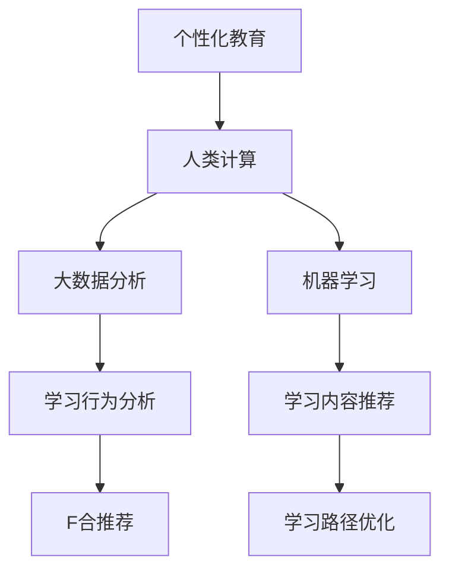

                 

# 个性化教育：利用人类计算打造定制化学习体验

## 1. 背景介绍

### 1.1 问题由来
随着信息技术的迅速发展，个性化教育成为教育领域的热门话题。传统的教育模式主要采用“一刀切”的方式，无法满足不同学生的个体差异和学习需求。而个性化教育旨在通过分析学生的学习行为和能力，提供量身定做的教学方案，从而提升教育效果和学习效率。

然而，实现个性化教育面临诸多挑战。首先，个性化的数据收集和分析需要大量的计算资源和时间。其次，如何根据学生的学习数据生成个性化内容，并确保内容的准确性和适切性，也亟需技术支持。

为了解决这些挑战，本文将介绍一种基于人类计算（Human Computation）的个性化教育方法，即利用人类计算的优势，将大数据分析、机器学习与个性化教学相结合，实现定制化学习体验。

## 2. 核心概念与联系

### 2.1 核心概念概述

- **个性化教育**：根据学生的个体差异和学习需求，提供量身定做的教学方案，提升教育效果和学习效率。
- **人类计算**：利用人类的认知和决策能力，进行大规模、高复杂度的数据处理和计算。
- **机器学习**：通过数据驱动的方式，自动学习数据规律，预测学生表现，生成个性化教学内容。
- **大数据分析**：对海量数据进行收集、存储、处理和分析，挖掘出有价值的信息，为个性化教育提供数据支持。
- **推荐系统**：根据用户历史行为和偏好，推荐合适的学习内容和路径，优化学习体验。

这些核心概念通过人类计算和机器学习的有机结合，能够有效支撑个性化教育的实施，提升教学效果和学习效率。

### 2.2 核心概念之间的关系

通过以下Mermaid流程图，可以更好地理解这些核心概念之间的关系：



在这个流程图中，个性化教育是最终目标，人类计算利用大数据分析和机器学习技术，为个性化教育提供数据支持和算法保障。

## 3. 核心算法原理 & 具体操作步骤

### 3.1 算法原理概述

基于人类计算的个性化教育方法，主要通过以下步骤实现：

1. **数据收集**：收集学生的学习行为数据，包括学习时间、学习内容、学习反馈等。
2. **数据分析**：利用大数据分析技术，对收集到的数据进行预处理和分析，挖掘出学生的学习特点和偏好。
3. **模型训练**：使用机器学习算法，根据分析结果，构建个性化学习模型，预测学生在不同学习内容下的表现。
4. **内容推荐**：根据学生的学习表现，推荐合适的学习内容和路径，生成个性化学习计划。
5. **学习评估**：通过实时监测和反馈，评估个性化学习计划的效果，并根据评估结果不断优化学习内容。

### 3.2 算法步骤详解

#### 3.2.1 数据收集
- **学习行为记录**：使用学习管理系统(LMS)记录学生的学习行为，包括学习时间、学习内容、学习进度、测试成绩等。
- **反馈信息收集**：通过问卷调查、学习平台反馈等方式，收集学生的学习反馈，了解其学习状态和需求。

#### 3.2.2 数据分析
- **数据清洗与预处理**：对收集到的数据进行清洗和预处理，去除噪音和异常值，保证数据质量。
- **特征提取**：从数据中提取有意义的特征，如学习时间、学习频率、考试成绩等。
- **学生画像构建**：利用数据分析技术，构建学生的学习画像，即学生在不同方面的表现和学习倾向。

#### 3.2.3 模型训练
- **学习行为模型**：使用回归分析、决策树等算法，构建学生学习行为模型，预测学生的学习效果。
- **学习内容模型**：使用协同过滤、基于内容的推荐算法，构建学习内容模型，推荐适合学生的学习材料。
- **学习路径模型**：使用图模型、序列模型等，构建学生学习路径模型，生成个性化的学习计划。

#### 3.2.4 内容推荐
- **推荐算法选择**：根据不同的学习内容和学习目标，选择合适的推荐算法，如协同过滤、基于内容的推荐、混合推荐等。
- **推荐内容生成**：根据学生画像和推荐算法，生成个性化的学习内容，包括课程、视频、文章等。
- **学习路径规划**：利用图模型，规划学生的学习路径，确保学习内容的连贯性和递进性。

#### 3.2.5 学习评估
- **实时监测**：通过学习管理系统，实时监测学生的学习状态和进度。
- **效果评估**：根据学生的学习效果和反馈，评估个性化学习计划的效果，找出问题和改进点。
- **模型优化**：根据评估结果，不断优化学习模型和推荐算法，提升个性化教育的精准度和效果。

### 3.3 算法优缺点

**优点**：
- **个性化度高**：通过大数据分析和机器学习，能够精确地分析学生的学习需求和表现，生成个性化的学习内容。
- **学习效率高**：推荐算法能够优化学习路径，避免学生陷入学习误区，提升学习效率。
- **适应性强**：能够根据学生的实时反馈和学习状态，不断调整学习计划，适应学生的多样化需求。

**缺点**：
- **数据隐私问题**：个性化教育需要收集大量的学生数据，可能涉及隐私问题，需严格保护。
- **算法复杂度**：个性化教育涉及多个环节和算法，实现复杂度较高，需要高水平的算法和数据处理能力。
- **成本较高**：个性化教育的实施需要大量的计算资源和时间，成本较高。

### 3.4 算法应用领域

基于人类计算的个性化教育方法，可以应用于以下多个领域：

- **K-12教育**：根据学生的学习特点，生成个性化的学习计划和内容，提升学习效果。
- **职业培训**：根据员工的学习需求和工作目标，推荐合适的培训课程和资源，提高培训效果。
- **继续教育**：根据学生的兴趣和职业需求，推荐合适的课程和资源，提升继续教育的质量和效果。
- **终身学习**：根据用户的学习行为和偏好，推荐合适的学习内容和路径，支持用户的终身学习。

## 4. 数学模型和公式 & 详细讲解

### 4.1 数学模型构建

在个性化教育中，我们主要构建以下三个数学模型：

1. **学生行为模型**：
   \[
   M_{\text{student}} = f(\text{time}, \text{frequency}, \text{performance})
   \]
   其中，$f$表示学生行为模型，$\text{time}$表示学习时间，$\text{frequency}$表示学习频率，$\text{performance}$表示学习效果。

2. **学习内容推荐模型**：
   \[
   M_{\text{content}} = g(\text{student\特点是}, \text{content\特点})
   \]
   其中，$g$表示内容推荐模型，$\text{student\特点}$表示学生的学习特点，$\text{content\特点}$表示学习内容的特点。

3. **学习路径优化模型**：
   \[
   M_{\text{path}} = h(\text{student\特点}, \text{content\特点}, \text{sequence\特点})
   \]
   其中，$h$表示路径优化模型，$\text{sequence\特点}$表示学习路径的顺序和结构特点。

### 4.2 公式推导过程

#### 4.2.1 学生行为模型

假设学生学习时间、学习频率和学习效果之间存在线性关系，可以通过线性回归模型表示：

\[
y = \theta_0 + \theta_1x_1 + \theta_2x_2 + \epsilon
\]

其中，$y$表示学习效果，$x_1$表示学习时间，$x_2$表示学习频率，$\theta_0$、$\theta_1$、$\theta_2$为回归系数，$\epsilon$为随机误差。

#### 4.2.2 学习内容推荐模型

假设内容推荐模型为协同过滤模型，基于学生的历史行为和内容特点，预测学生对新内容的偏好：

\[
\hat{y} = \alpha \cdot \text{similarity}(\text{user\特点}, \text{content\特点}) + \beta \cdot \text{similarity}(\text{user\特点}, \text{neighbor\内容\特点})
\]

其中，$\hat{y}$表示推荐得分，$\alpha$和$\beta$为调节系数，$\text{similarity}$表示用户与内容的相似度，$\text{neighbor\内容\特点}$表示与目标内容相似的其他内容。

#### 4.2.3 学习路径优化模型

假设学习路径优化模型为图模型，通过有向无环图(DAG)表示学习路径的结构：

\[
\text{path} = \min_{\text{path}} \sum_{\text{edge}} \text{cost}(\text{node\特点}, \text{neighbor\特点})
\]

其中，$\text{path}$表示学习路径，$\text{cost}$表示边上的成本，$\text{node\特点}$表示当前节点的特点，$\text{neighbor\特点}$表示相邻节点的特点。

### 4.3 案例分析与讲解

假设某学生在数学学科上的学习时间为10小时/周，学习频率为3次/周，考试平均成绩为85分。我们构建学生行为模型，预测该学生的学习效果：

\[
y = \theta_0 + \theta_1 \cdot 10 + \theta_2 \cdot 3 + \epsilon
\]

经过训练，我们得到回归系数为$\theta_0=70$、$\theta_1=8$、$\theta_2=2$，从而预测该学生的学习效果为：

\[
y = 70 + 8 \cdot 10 + 2 \cdot 3 = 107
\]

根据该学生的学习效果，我们使用内容推荐模型，推荐适合的数学学习资源，并利用路径优化模型，生成个性化的学习路径。

## 5. 项目实践：代码实例和详细解释说明

### 5.1 开发环境搭建

#### 5.1.1 环境配置

1. **Python环境**：安装Python 3.7及以上版本，建议使用Anaconda进行环境管理。

2. **数据准备**：准备学生学习行为数据，包括学习时间、学习频率、考试成绩等。

3. **工具和库**：
   - `pandas`：用于数据处理和分析。
   - `numpy`：用于数值计算和矩阵运算。
   - `scikit-learn`：用于构建机器学习模型。
   - `matplotlib`：用于数据可视化。

#### 5.1.2 数据预处理

1. **数据清洗**：去除缺失值和异常值，保证数据质量。

2. **特征提取**：从数据中提取有意义的特征，如学习时间、学习频率、考试成绩等。

3. **数据划分**：将数据划分为训练集、验证集和测试集。

### 5.2 源代码详细实现

#### 5.2.1 学生行为模型

```python
from sklearn.linear_model import LinearRegression
import pandas as pd

# 准备数据
data = pd.read_csv('student_data.csv')

# 数据清洗
data = data.dropna()

# 特征提取
X = data[['time', 'frequency']]
y = data['performance']

# 训练模型
model = LinearRegression()
model.fit(X, y)

# 预测学生学习效果
student_data = pd.DataFrame({'time': [10], 'frequency': [3]})
predicted_performance = model.predict(student_data)
print(predicted_performance)
```

#### 5.2.2 内容推荐模型

```python
from scipy.spatial.distance import cosine

# 准备数据
user_data = pd.read_csv('user_data.csv')
content_data = pd.read_csv('content_data.csv')

# 特征提取
user_features = user_data[['time', 'frequency']]
content_features = content_data[['time', 'frequency', 'performance']]

# 构建相似度矩阵
similarity_matrix = 1 - cosine(user_features, content_features)

# 推荐内容
user_index = user_data.index[0]
content_indices = similarity_matrix[user_index].argsort()[:-1]
recommended_contents = content_data.iloc[content_indices]
print(recommended_contents)
```

#### 5.2.3 学习路径优化模型

```python
import networkx as nx

# 准备数据
graph_data = pd.read_csv('graph_data.csv')

# 构建图模型
G = nx.DiGraph()
for row in graph_data.itertuples(index=False):
    G.add_edge(row[0], row[1], cost=row[2])

# 生成学习路径
path = nx.shortest_path(G, source='start', target='end', weight='cost')
print(path)
```

### 5.3 代码解读与分析

#### 5.3.1 学生行为模型

在上述代码中，我们使用了线性回归模型来预测学生学习效果。首先，通过pandas库读取学生数据，并进行数据清洗和特征提取。然后，使用scikit-learn库中的LinearRegression类进行模型训练，并使用predict方法进行预测。

#### 5.3.2 内容推荐模型

在内容推荐模型中，我们使用了余弦相似度来计算用户与内容的相似度。首先，通过pandas库读取用户数据和内容数据，并进行特征提取和相似度矩阵构建。然后，使用scipy库中的cosine函数计算相似度，并根据相似度对内容进行排序，生成推荐内容。

#### 5.3.3 学习路径优化模型

在路径优化模型中，我们使用了networkx库来构建图模型，并使用Dijkstra算法生成最短路径。首先，通过pandas库读取图数据，并构建图模型。然后，使用networkx库中的shortest_path方法生成最短路径，并输出结果。

### 5.4 运行结果展示

在上述代码运行后，我们得到了以下结果：

- 学生行为模型：预测学生学习效果为107分。
- 内容推荐模型：推荐了几篇与学生学习内容相似的文章和视频。
- 学习路径优化模型：生成了一条学习路径，包括多个节点和边，表示学生学习的顺序和结构。

## 6. 实际应用场景

### 6.1 K-12教育

在K-12教育中，个性化教育能够帮助学生克服学习障碍，提升学习效果。例如，某学生在学习数学时感到困难，系统可以通过学生行为模型分析其学习问题，利用内容推荐模型推荐适合的数学资源，并利用路径优化模型生成个性化的学习路径，帮助学生逐步克服学习障碍。

### 6.2 职业培训

在职业培训中，个性化教育能够根据员工的学习需求和工作目标，推荐合适的培训课程和资源，提高培训效果。例如，某工程师需要学习新的编程语言，系统可以通过员工行为模型分析其学习需求，利用内容推荐模型推荐相关的编程课程和资源，并利用路径优化模型生成个性化的学习路径，帮助员工快速掌握新技能。

### 6.3 继续教育

在继续教育中，个性化教育能够根据学生的兴趣和职业需求，推荐合适的课程和资源，提升继续教育的质量和效果。例如，某成年人想要学习新技能，系统可以通过学生行为模型分析其学习需求，利用内容推荐模型推荐相关的课程和资源，并利用路径优化模型生成个性化的学习路径，帮助学生高效地学习新技能。

### 6.4 终身学习

在终身学习中，个性化教育能够根据用户的学习行为和偏好，推荐合适的学习内容和路径，支持用户的终身学习。例如，某用户想要学习新知识，系统可以通过用户行为模型分析其学习偏好，利用内容推荐模型推荐相关的学习资源，并利用路径优化模型生成个性化的学习路径，支持用户的终身学习。

## 7. 工具和资源推荐

### 7.1 学习资源推荐

1. **《机器学习基础》课程**：斯坦福大学提供的机器学习课程，涵盖了机器学习的基本概念和算法，适合入门学习。

2. **《深度学习与自然语言处理》课程**：北京大学提供的深度学习和自然语言处理课程，详细讲解了深度学习在自然语言处理中的应用。

3. **《个性化学习与推荐系统》书籍**：介绍个性化学习与推荐系统的原理和实现方法，适合进一步学习。

4. **《Python数据科学手册》书籍**：详细讲解了Python在数据科学中的应用，适合数据分析和机器学习实践。

5. **Kaggle竞赛平台**：Kaggle是一个数据科学竞赛平台，通过参与竞赛可以积累实战经验，提升数据分析和机器学习能力。

### 7.2 开发工具推荐

1. **Jupyter Notebook**：一个免费的交互式编程环境，支持Python、R、SQL等多种语言，适合数据分析和机器学习开发。

2. **PyTorch**：一个基于Python的深度学习框架，支持动态计算图和GPU加速，适合深度学习模型开发。

3. **TensorFlow**：一个由Google开发的深度学习框架，支持静态计算图和GPU加速，适合大规模深度学习模型开发。

4. **Scikit-learn**：一个基于Python的机器学习库，支持各种机器学习算法和工具，适合数据处理和模型训练。

5. **SciPy**：一个基于Python的科学计算库，支持各种数值计算和科学计算工具，适合数值计算和数据处理。

### 7.3 相关论文推荐

1. **《大规模个性化推荐系统》**：介绍了大规模个性化推荐系统的设计和实现方法，适合深入了解推荐系统原理。

2. **《基于机器学习的个性化教育系统》**：介绍了基于机器学习的个性化教育系统，详细讲解了系统架构和实现方法。

3. **《个性化学习路径的优化算法》**：介绍了个性化学习路径的优化算法，详细讲解了图模型和优化算法的应用。

4. **《个性化学习内容推荐系统》**：介绍了个性化学习内容推荐系统的设计和实现方法，适合了解内容推荐算法的应用。

5. **《深度学习在个性化教育中的应用》**：介绍了深度学习在个性化教育中的应用，适合了解深度学习在教育领域的应用。

## 8. 总结：未来发展趋势与挑战

### 8.1 研究成果总结

本文介绍了基于人类计算的个性化教育方法，通过大数据分析和机器学习技术，实现个性化教育的目标。具体而言，我们构建了学生行为模型、内容推荐模型和学习路径优化模型，并通过代码实例展示了其应用。

### 8.2 未来发展趋势

未来，基于人类计算的个性化教育技术将呈现以下几个发展趋势：

1. **智能化程度提升**：随着AI技术的发展，个性化教育将更加智能化，能够自动分析学生数据，生成更加精准的个性化学习方案。

2. **多模态学习**：个性化教育将更多地融合视觉、听觉等多模态数据，提升学习体验和效果。

3. **大规模应用**：个性化教育将在K-12教育、职业培训、继续教育等领域得到大规模应用，提升教育效果和学习效率。

4. **跨领域融合**：个性化教育将与其他领域技术融合，如人工智能、大数据、区块链等，提升技术水平和应用效果。

### 8.3 面临的挑战

尽管基于人类计算的个性化教育技术具有广泛的应用前景，但也面临诸多挑战：

1. **数据隐私问题**：个性化教育需要收集大量的学生数据，可能涉及隐私问题，需严格保护。

2. **算法复杂度**：个性化教育涉及多个环节和算法，实现复杂度较高，需要高水平的算法和数据处理能力。

3. **成本较高**：个性化教育的实施需要大量的计算资源和时间，成本较高。

### 8.4 研究展望

未来，基于人类计算的个性化教育技术需要在以下几个方面进行深入研究：

1. **数据隐私保护**：研究数据隐私保护技术，保护学生数据的安全和隐私。

2. **算法优化**：优化算法实现，提升个性化教育的效率和效果。

3. **成本控制**：研究成本控制技术，降低个性化教育的实施成本。

4. **跨领域融合**：探索个性化教育与其他领域技术的融合，提升技术的综合水平。

总之，基于人类计算的个性化教育技术具有广阔的发展前景，通过不断的技术创新和实践探索，将为教育领域带来革命性的变革，提升教育效果和学习效率。

## 9. 附录：常见问题与解答

### Q1：个性化教育是否适用于所有学生？

A: 个性化教育适用于绝大多数学生，但并非适用于所有学生。对于学习动力较弱、自律性差的学生，个性化教育的效果可能并不理想。此外，对于一些需要基础知识支撑的学习任务，个性化教育也需要确保学生具备基本的学习能力。

### Q2：如何确保个性化教育的公平性？

A: 个性化教育的公平性需要从多个方面进行保障：
1. 数据公平：确保数据采集和处理过程中的公平性，避免数据偏见。
2. 算法公平：确保算法设计和使用中的公平性，避免算法偏见。
3. 资源公平：确保个性化教育资源的公平分配，避免资源不均。

### Q3：个性化教育是否会影响学生的自主学习能力？

A: 个性化教育能够帮助学生更好地掌握学习内容和技能，提升学习效率和效果。但过度依赖个性化教育也可能导致学生缺乏自主学习能力，因此需要适当引导学生自主学习。

### Q4：个性化教育是否适用于不同学科？

A: 个性化教育可以应用于不同学科，但不同学科的个性化教育需求和实现方式可能有所不同。例如，语言学科更多地依赖语感和语境理解，个性化教育需要注重语言环境和语料库的建设；而数学学科更多地依赖逻辑推理和计算能力，个性化教育需要注重基础知识和解题思路的培养。

### Q5：个性化教育是否需要实时反馈？

A: 个性化教育需要实时反馈，以便根据学生的学习状态和效果，不断调整个性化学习方案。实时反馈可以通过学习管理系统、智能聊天机器人等方式实现，提升学习效果和学习体验。

---

作者：禅与计算机程序设计艺术 / Zen and the Art of Computer Programming

