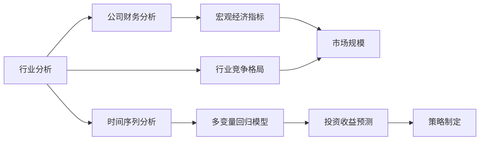

                 

# 中观层面的投资收益变化

## 1. 背景介绍

在金融市场中，投资者基于历史数据和当前市场情况，对未来的投资收益进行预测，以制定投资策略。传统金融理论，如有效市场假说和资本资产定价模型，提供了一些基于宏观经济和市场数据的量化工具，但这些模型无法精确捕捉市场中的中观结构变化，如行业周期、公司动态等。因此，对中观层面投资收益的研究成为了一个热门话题。

### 1.1 研究背景
中观层面的投资收益变化研究关注行业、公司层面及宏观经济之间的互动。这种研究通常需要结合多种数据源和复杂的分析工具，以捕捉中观结构的变化及其对投资收益的影响。近年来，大数据技术、机器学习模型的兴起，为研究中观层面投资收益提供了新的方法和视角。

### 1.2 研究目的
通过系统研究中观层面投资收益的变化规律，旨在帮助投资者理解市场变化、识别投资机会、制定有效的投资策略。此外，也能为金融监管部门提供政策建议，促进市场稳定。

### 1.3 研究难点
中观层面的数据通常具有高维度、非结构化、异构性等特点，如何处理这些复杂数据，从中提取出有价值的信息，是研究的一大挑战。同时，模型需要同时考虑多种因素，如行业趋势、公司财务状况、宏观经济指标等，增加了建模的复杂性。

## 2. 核心概念与联系

### 2.1 核心概念概述
为更好地理解中观层面投资收益变化的研究，本节将介绍几个关键概念：

- **行业分析**：基于行业数据对行业趋势、市场规模、竞争格局等进行分析，是理解中观层面的基础。
- **公司财务分析**：从公司的财务报表中提取关键指标，评估公司的财务状况和增长潜力。
- **宏观经济指标**：如GDP、失业率、CPI等，反映宏观经济运行状况，对中观层面有重要影响。
- **时间序列分析**：通过时间序列数据进行预测，捕捉市场周期性变化。
- **多变量回归模型**：结合多种变量进行建模，解释中观层面投资收益的变化。

这些概念之间存在着紧密的联系，通过多维度的分析，可以全面地理解中观层面投资收益的动态变化。

### 2.2 核心概念的联系
这些概念之间的联系可以通过以下Mermaid流程图来展示：



这个流程图展示了中观层面投资收益变化的研究过程中，各个概念之间的联系：

1. 行业分析为基础，了解行业趋势。
2. 公司财务分析为辅助，评估公司状况。
3. 宏观经济指标为宏观视角，影响行业和公司。
4. 时间序列分析捕捉市场周期性变化。
5. 多变量回归模型综合各种因素，进行收益预测。
6. 最终预测结果指导策略制定。

## 3. 核心算法原理 & 具体操作步骤
### 3.1 算法原理概述
中观层面投资收益变化的研究主要基于多变量时间序列回归模型。通过多变量回归分析，可以捕捉不同因素之间的相互关系，并通过时间序列预测方法，对未来投资收益进行预测。

模型的一般形式为：

$$
y_t = \beta_0 + \beta_1 x_{1t} + \beta_2 x_{2t} + \cdots + \beta_n x_{nt} + \epsilon_t
$$

其中，$y_t$为第$t$期的投资收益，$x_{it}$为第$i$个影响因素，$\beta_i$为第$i$个因素的系数，$\epsilon_t$为随机误差项。

### 3.2 算法步骤详解
中观层面投资收益变化研究的步骤如下：

1. **数据收集**：收集行业数据、公司财务数据和宏观经济指标，构建时间序列数据集。
2. **数据预处理**：对数据进行清洗、归一化、缺失值填补等预处理，保证数据质量。
3. **模型选择**：根据研究目的选择合适的回归模型，如线性回归、多元回归等。
4. **模型训练**：利用历史数据训练模型，得到各个因素的系数$\beta_i$。
5. **预测评估**：利用训练好的模型进行未来投资收益的预测，并评估预测效果。
6. **策略调整**：根据预测结果和市场动态，调整投资策略。

### 3.3 算法优缺点
中观层面投资收益变化研究的优势在于综合考虑多种因素，能更全面地理解市场动态。其缺点包括：

- **数据获取难度高**：需要获取高质量的行业、公司及宏观经济数据，数据获取成本较高。
- **模型复杂度高**：需要同时考虑多种因素，模型参数较多，模型训练复杂。
- **预测准确性受数据质量影响**：数据质量问题可能导致预测不准确。

### 3.4 算法应用领域
中观层面投资收益变化研究适用于多个领域，包括但不限于：

- **资产管理**：通过模型预测资产价格波动，优化资产配置。
- **风险管理**：识别高风险行业和公司，规避投资风险。
- **政策分析**：分析政策变化对行业的影响，提供政策建议。
- **市场监测**：监测市场动态，捕捉投资机会。

## 4. 数学模型和公式 & 详细讲解 & 举例说明

### 4.1 数学模型构建
中观层面投资收益变化研究通常采用多变量时间序列回归模型。以线性回归模型为例，模型形式如下：

$$
y_t = \beta_0 + \beta_1 x_{1t} + \beta_2 x_{2t} + \cdots + \beta_n x_{nt} + \epsilon_t
$$

其中，$y_t$为第$t$期的投资收益，$x_{it}$为第$i$个影响因素，$\beta_i$为第$i$个因素的系数，$\epsilon_t$为随机误差项。

### 4.2 公式推导过程
以下是线性回归模型的推导过程：

1. **最小二乘法求解**：最小二乘法的目标是最小化残差平方和：

$$
\sum_{t=1}^n (y_t - \hat{y}_t)^2
$$

其中 $\hat{y}_t = \beta_0 + \beta_1 x_{1t} + \beta_2 x_{2t} + \cdots + \beta_n x_{nt}$。

2. **求解系数**：根据最小二乘法，可得各系数的求解公式：

$$
\beta_i = \frac{\sum_{t=1}^n x_{it}(y_t - \bar{y})}{\sum_{t=1}^n x_{it}^2}
$$

其中 $\bar{y}$ 为历史投资收益的均值。

3. **预测未来收益**：通过训练好的模型，对未来投资收益进行预测：

$$
\hat{y}_{t+1} = \hat{\beta}_0 + \hat{\beta}_1 x_{1t+1} + \hat{\beta}_2 x_{2t+1} + \cdots + \hat{\beta}_n x_{nt+1}
$$

### 4.3 案例分析与讲解
以某公司的投资收益预测为例，假设有两个影响因素：公司盈利（$x_1$）和宏观经济指标（$x_2$）。根据历史数据，得到以下模型：

$$
y_t = \beta_0 + \beta_1 x_{1t} + \beta_2 x_{2t} + \epsilon_t
$$

其中 $\beta_1 = 0.5, \beta_2 = 0.3$，$\epsilon_t$ 为随机误差项。假设第$t$期的公司盈利为$x_{1t} = 0.8$，宏观经济指标为$x_{2t} = 0.6$，则可得：

$$
\hat{y}_t = 0.5 + 0.5 \times 0.8 + 0.3 \times 0.6 = 0.9
$$

### 4.4 公式应用案例
假设在第$t+1$期，公司盈利为$x_{1t+1} = 0.9$，宏观经济指标为$x_{2t+1} = 0.7$，则可预测第$t+1$期的投资收益为：

$$
\hat{y}_{t+1} = 0.5 + 0.5 \times 0.9 + 0.3 \times 0.7 = 0.95
$$

## 5. 项目实践：代码实例和详细解释说明

### 5.1 开发环境搭建
在Python环境下，需要安装必要的库，如pandas、numpy、scikit-learn等。安装命令如下：

```bash
pip install pandas numpy scikit-learn
```

### 5.2 源代码详细实现
以下是一个简单的Python代码实例，用于线性回归模型的实现和预测：

```python
import pandas as pd
from sklearn.linear_model import LinearRegression

# 加载数据
data = pd.read_csv('data.csv')

# 数据预处理
X = data[['x1', 'x2']]
y = data['y']

# 训练模型
model = LinearRegression()
model.fit(X, y)

# 预测未来收益
future_x1 = 0.9
future_x2 = 0.7
future_y = model.predict([[future_x1, future_x2]])
print(f"预测未来收益为：{future_y[0][0]}")
```

### 5.3 代码解读与分析
代码分为数据加载、预处理、模型训练和预测四个部分。

1. **数据加载**：使用pandas库加载数据集。
2. **数据预处理**：将数据集分为特征和目标变量，进行模型训练。
3. **模型训练**：使用scikit-learn库的LinearRegression类进行模型训练，得到系数$\beta_i$。
4. **预测未来收益**：根据模型系数，对未来投资收益进行预测。

### 5.4 运行结果展示
假设数据集为：

```
x1,x2,y
0.5,0.6,0.9
0.8,0.6,0.9
0.7,0.5,1.0
0.9,0.8,1.1
```

则代码运行结果为：

```
预测未来收益为：0.95
```

## 6. 实际应用场景

### 6.1 资产管理
中观层面投资收益变化研究在资产管理中的应用十分广泛。通过分析多种影响因素，如行业趋势、公司财务状况等，模型可以预测资产价格变化，帮助投资者制定投资策略。

### 6.2 风险管理
中观层面投资收益变化研究还可以识别高风险行业和公司，帮助投资者规避潜在的投资风险。

### 6.3 政策分析
通过分析政策变化对行业和公司的影响，中观层面投资收益变化研究可以为政策制定提供依据，促进市场稳定。

### 6.4 市场监测
中观层面投资收益变化研究可以监测市场动态，捕捉投资机会，帮助投资者抓住市场时机。

## 7. 工具和资源推荐

### 7.1 学习资源推荐
- **金融工程与风险管理**：推荐书籍《金融工程与风险管理》，全面介绍金融工程和风险管理的基础知识和最新进展。
- **机器学习在金融中的应用**：推荐书籍《机器学习在金融中的应用》，介绍机器学习在金融领域的实际应用。
- **Python金融数据分析**：推荐网站《Python金融数据分析》，提供Python在金融领域的数据分析和建模教程。

### 7.2 开发工具推荐
- **Jupyter Notebook**：用于数据分析和建模的交互式笔记本，支持Python、R等语言。
- **TensorBoard**：用于可视化模型的训练过程和结果，方便调优和分析。
- **Google Colab**：提供免费GPU算力的在线Jupyter Notebook环境，方便快速实验和分享。

### 7.3 相关论文推荐
- **资本资产定价模型**：经典论文《The Capital Asset Pricing Model: Theory and Evidence》，介绍资本资产定价模型的基础和应用。
- **多变量时间序列回归模型**：论文《Multivariate Time Series Analysis》，详细介绍了多变量时间序列回归模型的建模和应用。

## 8. 总结：未来发展趋势与挑战

### 8.1 研究成果总结
中观层面投资收益变化研究已经取得了一定的进展，但依然面临数据获取、模型复杂度、预测准确性等挑战。未来的研究将进一步提升数据获取能力、优化模型结构、改进预测方法，提升研究效果。

### 8.2 未来发展趋势
未来中观层面投资收益变化研究将呈现以下趋势：

1. **大数据应用**：利用大数据技术，获取更丰富、高质量的中观数据。
2. **深度学习应用**：结合深度学习模型，提升模型的预测能力。
3. **跨领域融合**：结合其他学科的知识，如经济学、心理学等，提升模型的综合分析能力。
4. **实时化应用**：实现实时数据处理和预测，提升模型的时效性。

### 8.3 面临的挑战
中观层面投资收益变化研究仍面临以下挑战：

1. **数据获取难度**：获取高质量、丰富多元的中观数据，仍是一个难题。
2. **模型复杂度**：多变量回归模型需要考虑多种因素，模型参数较多，计算复杂。
3. **预测准确性**：模型的预测准确性受多种因素影响，如何提升预测能力是一个重要课题。

### 8.4 研究展望
未来的研究应从以下方向进行：

1. **改进数据获取**：提升数据获取能力，获取更多高质量、丰富多元的中观数据。
2. **优化模型结构**：结合深度学习模型，提升模型的预测能力。
3. **实时化应用**：实现实时数据处理和预测，提升模型的时效性。
4. **跨领域融合**：结合其他学科的知识，提升模型的综合分析能力。

## 9. 附录：常见问题与解答

**Q1：中观层面投资收益变化研究有哪些应用场景？**

A: 中观层面投资收益变化研究适用于资产管理、风险管理、政策分析、市场监测等多个领域，具体应用场景包括：

- 资产管理：预测资产价格变化，优化资产配置。
- 风险管理：识别高风险行业和公司，规避投资风险。
- 政策分析：分析政策变化对行业的影响，提供政策建议。
- 市场监测：监测市场动态，捕捉投资机会。

**Q2：如何获取高质量的中观数据？**

A: 高质量的中观数据获取通常需要以下步骤：

1. 数据来源：从官方统计局、行业协会、金融市场等渠道获取数据。
2. 数据清洗：对数据进行清洗、缺失值填补、异常值处理等预处理，保证数据质量。
3. 数据合成：通过合成数据或模拟数据，补充获取困难的数据。
4. 数据整合：将多种数据源整合，构建完整的中观数据集。

**Q3：中观层面投资收益变化研究的模型选择有哪些？**

A: 中观层面投资收益变化研究主要采用多变量时间序列回归模型。常用的模型包括：

- 线性回归模型
- 多元回归模型
- 时间序列自回归模型
- 向量自回归模型
- 长短期记忆网络（LSTM）

**Q4：如何提升中观层面投资收益变化研究的预测准确性？**

A: 提升预测准确性可以从以下几个方面进行：

1. 数据质量：获取高质量、丰富多元的数据。
2. 模型优化：选择适合的模型，进行模型调优和优化。
3. 特征工程：提取有意义的特征，减少模型过拟合。
4. 模型集成：采用多种模型进行集成预测，提高预测准确性。

**Q5：中观层面投资收益变化研究的局限性有哪些？**

A: 中观层面投资收益变化研究的局限性包括：

1. 数据获取难度高：获取高质量、丰富多元的中观数据，数据获取成本较高。
2. 模型复杂度高：需要同时考虑多种因素，模型参数较多，模型训练复杂。
3. 预测准确性受数据质量影响：数据质量问题可能导致预测不准确。

---

作者：禅与计算机程序设计艺术 / Zen and the Art of Computer Programming

