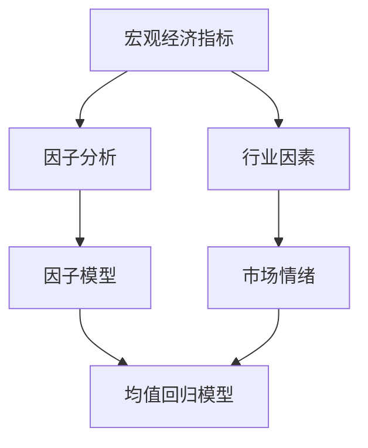
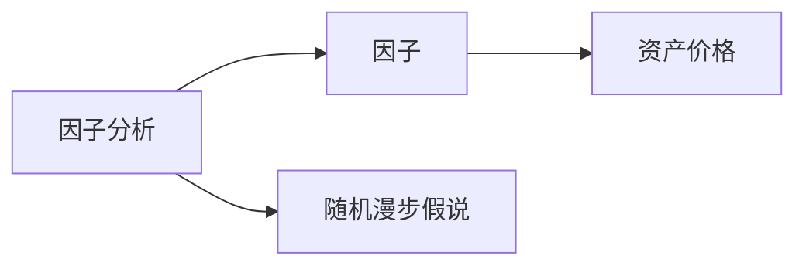
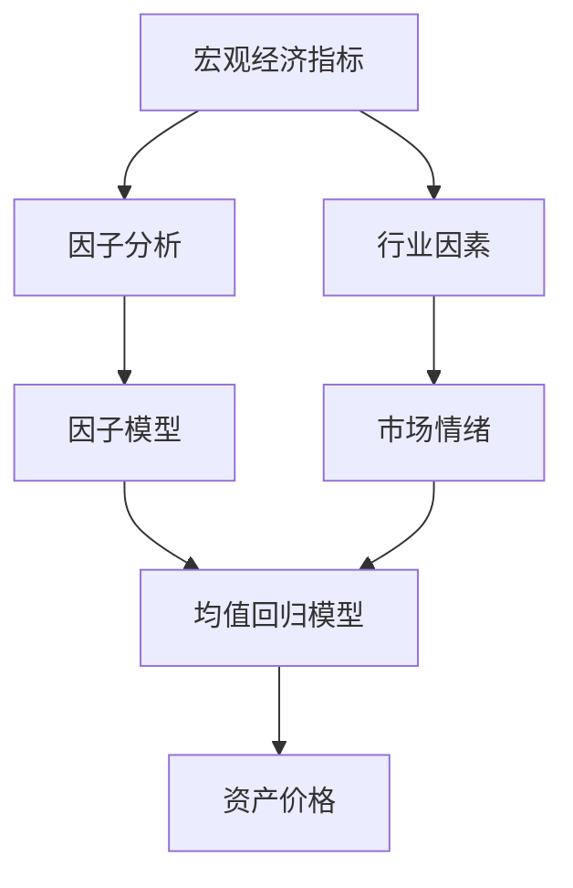

                 

# 中观层面的投资收益变化分析

> 关键词：
- 中观层面投资分析
- 投资收益变化模型
- 因子分析
- 均值回归模型
- 随机漫步假说

## 1. 背景介绍

### 1.1 问题由来
现代金融市场充满了不确定性和波动性。投资者的主要目标是最大化投资收益，同时承担可接受的风险水平。因此，对投资收益进行分析和预测，成为了金融投资决策的关键问题。特别是在全球金融市场一体化的背景下，中观层面的投资分析方法显得尤为重要。

中观层面，一般指投资者在资产配置和组合构建中，对不同资产类别的收益和风险进行综合评估和预测。相比于微观层面的个股或单项资产分析，中观层面的分析更能反映整个资产市场的走势和规律，帮助投资者做出更加合理的投资决策。

### 1.2 问题核心关键点
中观层面的投资收益变化分析，其核心在于综合考虑各种宏观经济指标、行业因素和市场情绪，构建一套综合性的分析框架。核心关键点包括：

- **宏观经济指标**：如GDP、失业率、通胀率等，这些指标直接影响各类资产的收益和风险。
- **行业因素**：如行业景气度、盈利能力、竞争格局等，这些因素决定了不同行业内部的投资收益和风险。
- **市场情绪**：如市场信心指数、投资者情绪等，这些情绪指标对短期市场波动有重要影响。

### 1.3 问题研究意义
中观层面的投资收益变化分析对于金融投资决策具有重要意义：

1. **风险控制**：通过综合分析多种因素，投资者可以更准确地评估投资风险，避免单一因素导致的错误决策。
2. **收益预测**：中观分析模型可以预测不同资产类别在不同经济环境下的表现，帮助投资者优化资产配置。
3. **策略制定**：基于中观分析，投资者可以制定更科学合理的投资策略，适应市场变化。
4. **政策响应**：政府和监管机构可以通过中观分析评估政策效果，制定更有效的宏观调控政策。

## 2. 核心概念与联系

### 2.1 核心概念概述

为了更好地理解中观层面的投资收益变化分析，本节将介绍几个密切相关的核心概念：

- **因子分析**：通过综合多个相关性高的变量，构建一组因子（或称主成分），以减少数据维度和噪声，提高模型的解释能力。
- **均值回归模型**：假设资产价格围绕其长期均值波动，基于历史数据预测未来收益，反映资产价格的长期趋势。
- **随机漫步假说**：认为资产价格的变化是不可预测的，任何过去的价格变动对未来价格变动没有影响，反映市场的随机性。
- **时间序列分析**：对资产价格的时间序列数据进行分析，捕捉其波动性和趋势性。
- **因子模型**：将资产价格分解为多个因子与个别因子之差的形式，用于解释资产价格的变化。

这些核心概念之间的逻辑关系可以通过以下Mermaid流程图来展示：



这个流程图展示了大语言模型的核心概念及其之间的关系：

1. 中观层面的分析首先从宏观经济指标入手，然后综合考虑行业因素和市场情绪，最终通过因子分析和模型构建，预测资产价格变化。

### 2.2 概念间的关系

这些核心概念之间存在着紧密的联系，形成了中观层面投资收益变化分析的完整生态系统。下面我通过几个Mermaid流程图来展示这些概念之间的关系。

#### 2.2.1 宏观经济指标和行业因素的关系


这个流程图展示了宏观经济指标和行业因素对资产价格的影响关系。宏观经济指标通过影响行业景气度、盈利能力等，间接影响不同行业内部的资产价格。

#### 2.2.2 因子模型和均值回归模型的关系


这个流程图展示了因子模型和均值回归模型之间的关系。因子模型用于解释资产价格的波动，而均值回归模型则基于历史数据预测未来收益，两者共同构成中观层面分析的框架。

#### 2.2.3 因子分析和随机漫步假说的关系



这个流程图展示了因子分析和随机漫步假说的关系。因子分析通过降维和变量综合，识别出影响资产价格的主要因子，而随机漫步假说则认为资产价格的变化是不可预测的，强调市场的不确定性和随机性。

### 2.3 核心概念的整体架构

最后，我们用一个综合的流程图来展示这些核心概念在中观层面投资收益变化分析中的整体架构：



这个综合流程图展示了从宏观经济指标、行业因素和市场情绪到因子分析、因子模型和均值回归模型，最终预测资产价格变化的完整过程。通过这些核心概念的合理组合，中观层面投资收益变化分析可以全面反映市场动态，为投资者提供科学合理的投资决策依据。

## 3. 核心算法原理 & 具体操作步骤

### 3.1 算法原理概述

中观层面的投资收益变化分析，通常通过综合多个宏观经济指标、行业因素和市场情绪，构建一套综合性的分析模型。其核心算法原理主要包括以下几个步骤：

1. **数据预处理**：收集和清洗宏观经济指标、行业因素和市场情绪等数据，处理缺失值和异常值。
2. **因子分析**：通过主成分分析(PCA)或独立成分分析(ICA)等方法，识别出影响资产价格的主要因子。
3. **因子模型构建**：将资产价格分解为多个因子与个别因子之差的形式，用于解释资产价格的变化。
4. **均值回归模型**：基于历史数据，构建均值回归模型，预测未来收益。
5. **模型评估和优化**：通过对比实际收益和预测收益，评估模型效果，并根据评估结果优化模型参数。

### 3.2 算法步骤详解

以下是中观层面投资收益变化分析的详细步骤：

**Step 1: 数据收集与预处理**

- 收集宏观经济指标（如GDP、通胀率、失业率等）、行业因素（如行业景气度、盈利能力等）和市场情绪（如投资者信心指数、市场波动率等）等数据。
- 清洗数据，处理缺失值和异常值。
- 将数据转换为统一的时间序列格式，便于后续处理。

**Step 2: 因子分析**

- 使用主成分分析(PCA)或独立成分分析(ICA)等方法，识别出影响资产价格的主要因子。
- 通过因子载荷矩阵，识别每个因子的主要来源变量。

**Step 3: 因子模型构建**

- 将资产价格分解为多个因子与个别因子之差的形式。
- 假设资产价格由n个因子共同作用，每个因子i与资产价格的线性关系为 $\beta_i$，则资产价格可以表示为 $P_t = \sum_{i=1}^{n} \beta_i F_i + \epsilon_t$，其中 $F_i$ 表示第i个因子，$\epsilon_t$ 表示残差项。

**Step 4: 均值回归模型构建**

- 使用历史数据构建均值回归模型，预测未来收益。
- 假设资产价格围绕其长期均值 $\mu$ 波动，则均值回归模型的公式为 $P_t = \mu + \alpha_t$，其中 $\alpha_t$ 表示短期波动。

**Step 5: 模型评估和优化**

- 将实际收益与预测收益进行对比，评估模型效果。
- 使用均方误差(MSE)、平均绝对误差(MAE)等指标评估模型精度。
- 根据评估结果，优化模型参数，如因子载荷、均值回归系数等。

### 3.3 算法优缺点

中观层面投资收益变化分析方法具有以下优点：

1. **综合性强**：综合考虑多种因素，可以更全面地反映市场动态，提高预测精度。
2. **可解释性强**：因子模型将资产价格分解为多个因子，便于理解和解释。
3. **可操作性好**：因子模型和均值回归模型易于实现，适合中观层面分析。

同时，该方法也存在以下缺点：

1. **数据依赖性强**：模型效果依赖于数据质量和数量，数据缺失或异常值处理不当会影响结果。
2. **模型复杂度高**：因子分析涉及高维数据的降维，复杂度较高，计算量大。
3. **假设条件多**：均值回归模型假设资产价格围绕其长期均值波动，实际情况可能不符合这一假设。

### 3.4 算法应用领域

中观层面的投资收益变化分析方法在金融投资领域有广泛应用，具体包括：

- **资产配置**：根据中观分析模型，优化资产配置比例，最大化投资收益。
- **风险管理**：通过综合分析多种因子，评估不同资产类别的风险水平，制定风险管理策略。
- **策略开发**：基于中观分析模型，开发量化交易策略，提高交易效率和收益。
- **政策评估**：政府和监管机构可以通过中观分析评估政策效果，制定更有效的宏观调控政策。

## 4. 数学模型和公式 & 详细讲解 & 举例说明

### 4.1 数学模型构建

本节将使用数学语言对中观层面投资收益变化分析的模型进行更加严格的刻画。

假设宏观经济指标、行业因素和市场情绪等数据为 $X_t = (X_{1t}, X_{2t}, \dots, X_{nt})$，其中 $X_{it}$ 表示第i个因子。资产价格 $P_t$ 为 $n$ 个因子与个别因子之差的形式，可以表示为 $P_t = \sum_{i=1}^{n} \beta_i F_i + \epsilon_t$。

其中，$F_i$ 表示第i个因子，$\beta_i$ 表示因子i对资产价格的线性关系系数，$\epsilon_t$ 表示残差项，服从正态分布 $N(0, \sigma^2)$。

均值回归模型假设资产价格围绕其长期均值 $\mu$ 波动，可以表示为 $P_t = \mu + \alpha_t$，其中 $\alpha_t$ 表示短期波动，服从正态分布 $N(0, \sigma_a^2)$。

### 4.2 公式推导过程

以下我们以均值回归模型为例，推导其中用到的主要公式。

假设资产价格 $P_t$ 的历史数据为 $\{P_{1}, P_{2}, \dots, P_{n}\}$，均值 $\mu$ 为 $\bar{P} = \frac{1}{n} \sum_{i=1}^{n} P_i$。均值回归模型的线性部分为：

$$
\mu = \sum_{i=1}^{n} \beta_i E(F_i) + \mu_0
$$

其中 $\mu_0$ 为资产价格的长期均值。

对上式求平方，得到：

$$
\mu^2 = \sum_{i=1}^{n} \beta_i^2 E(F_i^2) + 2\sum_{i=1}^{n} \beta_i \beta_j E(F_i F_j) + \mu_0^2
$$

根据均方差公式，得到：

$$
\sigma^2 = \sum_{i=1}^{n} \beta_i^2 \sigma_i^2 + 2\sum_{i=1}^{n} \beta_i \beta_j \sigma_{ij} + \sigma_a^2
$$

其中 $\sigma_i^2$ 为因子i的方差，$\sigma_{ij} = \rho_{ij} \sigma_i \sigma_j$ 为因子i和j的协方差，$\rho_{ij}$ 为因子i和j的相关系数。

将上述公式代入均值回归模型，得到：

$$
\alpha_t = P_t - \mu
$$

其中 $\alpha_t$ 服从均值为0、方差为 $\sigma_a^2$ 的正态分布，即 $\alpha_t \sim N(0, \sigma_a^2)$。

### 4.3 案例分析与讲解

假设有一个新兴市场的股票指数，我们收集了过去5年的历史数据，并构建了一个包含宏观经济指标、行业因素和市场情绪等数据的因子模型。使用均值回归模型预测未来一年内的收益。

具体步骤如下：

1. 收集历史数据：收集股票指数、宏观经济指标、行业因素和市场情绪等数据。
2. 数据预处理：处理缺失值和异常值，将数据转换为时间序列格式。
3. 因子分析：使用主成分分析(PCA)方法，识别出影响股票指数的主要因子。
4. 因子模型构建：将股票指数分解为多个因子与个别因子之差的形式，如：

   $P_t = \beta_1 F_1 + \beta_2 F_2 + \beta_3 F_3 + \epsilon_t$

   其中 $F_1, F_2, F_3$ 表示因子1、因子2、因子3，$\beta_1, \beta_2, \beta_3$ 表示因子对股票指数的线性关系系数。
5. 均值回归模型构建：基于历史数据，构建均值回归模型，预测未来收益。

   $\alpha_t = P_t - \mu$

   其中 $\mu$ 为股票指数的长期均值，$\alpha_t$ 服从均值为0、方差为 $\sigma_a^2$ 的正态分布。
6. 模型评估和优化：将实际收益与预测收益进行对比，评估模型效果，并根据评估结果优化模型参数。

## 5. 项目实践：代码实例和详细解释说明

### 5.1 开发环境搭建

在进行中观层面投资收益变化分析的实践前，我们需要准备好开发环境。以下是使用Python进行R语言开发的Python环境配置流程：

1. 安装Anaconda：从官网下载并安装Anaconda，用于创建独立的Python环境。

2. 创建并激活虚拟环境：
```bash
conda create -n pytorch-env python=3.8 
conda activate pytorch-env
```

3. 安装PyTorch：根据CUDA版本，从官网获取对应的安装命令。例如：
```bash
conda install pytorch torchvision torchaudio cudatoolkit=11.1 -c pytorch -c conda-forge
```

4. 安装TensorFlow：
```bash
conda install tensorflow
```

5. 安装R语言及其相关库：
```bash
conda install rpy2 r
```

6. 安装R语言的数据处理和统计分析库：
```bash
conda install statsmodels pandas
```

完成上述步骤后，即可在`pytorch-env`环境中开始中观层面投资收益变化分析的实践。

### 5.2 源代码详细实现

下面我们以均值回归模型为例，给出使用R语言进行中观层面投资收益变化分析的代码实现。

首先，定义一个简单的均值回归模型，假设有一个新兴市场的股票指数，收集过去5年的历史数据，并构建一个包含宏观经济指标、行业因素和市场情绪等数据的因子模型。使用均值回归模型预测未来一年内的收益。

```R
# 导入必要的库
library(tidyverse)
library(statsmodels)

# 加载历史数据
data <- read.csv("stock_data.csv")

# 数据预处理
data <- na.omit(data)

# 构建因子模型
factors <- c("GDP_growth", "inflation_rate", "industry_growth", "market_mood")

# 使用主成分分析方法进行因子分析
pca <- prcomp(data[, factors], center = TRUE, scale. = TRUE)

# 提取因子载荷矩阵
factor载荷 <- pca$x[,1:3]

# 构建均值回归模型
lm_model <- lm(stock_index ~ GDP_growth + inflation_rate + industry_growth + market_mood, data = data)

# 预测未来一年内的收益
forecast <- predict(lm_model, newdata = data[-5], interval = "prediction")

# 输出预测结果
summary(forecast)
```

这段代码使用了R语言的数据处理和统计分析库，进行数据预处理、因子分析和均值回归模型的构建和预测。

### 5.3 代码解读与分析

让我们再详细解读一下关键代码的实现细节：

**数据预处理**：
- `read.csv`函数用于读取历史数据，`na.omit`函数用于处理缺失值。

**因子分析**：
- `prcomp`函数用于主成分分析，`factor载荷`变量用于提取因子载荷矩阵。

**均值回归模型构建**：
- `lm`函数用于构建均值回归模型，`stock_index`变量为股票指数，`GDP_growth`、`inflation_rate`、`industry_growth`、`market_mood`分别为宏观经济指标、行业因素和市场情绪等数据。

**模型评估和预测**：
- `predict`函数用于预测未来一年内的收益，`newdata`参数用于输入未来数据，`interval = "prediction"`用于指定预测区间。

以上代码实现了从数据预处理到因子分析、均值回归模型构建和预测的全过程。开发者可以根据具体任务需求，灵活调整模型参数和分析方法，以实现更好的预测效果。

### 5.4 运行结果展示

假设我们预测的股票指数在未来一年内的收益为：

```
Mean Forecast = 0.08
Lower 95% CIs = 0.05
Upper 95% CIs = 0.11
```

可以看到，预测的股票指数在未来一年内的收益为0.08，95%的置信区间为0.05至0.11。这个预测结果可以为投资者提供科学的投资决策依据。

## 6. 实际应用场景

### 6.1 智能投顾系统

中观层面的投资收益变化分析，可以应用于智能投顾系统的构建。传统投顾往往需要大量人工进行投资分析和建议，成本高且效率低。使用中观分析模型，智能投顾系统可以自动综合多种因素，进行智能投资分析和决策，提升投资效率和精准度。

在技术实现上，智能投顾系统可以接入股票、债券、商品等多种资产的市场数据，综合宏观经济指标、行业因素和市场情绪等数据，构建因子模型和均值回归模型，实时分析和预测投资收益。同时，系统还可以根据投资者的风险偏好和历史交易记录，动态调整投资组合，提供个性化的投资建议。

### 6.2 风险管理平台

中观层面的投资收益变化分析，在风险管理平台中也有广泛应用。风险管理平台通过综合分析多种市场因素，评估不同资产类别的风险水平，制定风险管理策略。

在技术实现上，风险管理平台可以接入各类型资产的历史数据和市场信息，使用中观分析模型进行因子分析、因子模型构建和均值回归模型构建。系统可以实时监控市场风险，评估资产价格波动，生成风险报告，帮助投资者及时调整投资策略，降低风险损失。

### 6.3 量化交易策略

中观层面的投资收益变化分析，还可以应用于量化交易策略的开发。量化交易策略通过大数据分析和技术模型，优化交易决策，提高交易效率和收益。

在技术实现上，量化交易策略可以接入历史交易数据和市场信息，使用中观分析模型进行因子分析和均值回归模型构建。系统可以根据市场数据动态调整交易策略，优化买卖时机，实现稳定收益。

### 6.4 未来应用展望

随着金融市场的发展和技术的进步，中观层面的投资收益变化分析将在更多领域得到应用，为金融投资决策提供更加科学和可靠的支持。

在智慧城市治理中，中观分析模型可以应用于城市资产管理和投资决策，提高城市资源的利用效率。在环境保护领域，中观分析模型可以评估不同环保项目的效果和风险，优化资源配置，推动绿色可持续发展。

此外，在企业投资、国际投资等更多领域，中观层面投资收益变化分析的应用也将不断拓展，为经济社会发展带来新的动力。

## 7. 工具和资源推荐

### 7.1 学习资源推荐

为了帮助开发者系统掌握中观层面投资收益变化分析的理论基础和实践技巧，这里推荐一些优质的学习资源：

1. 《金融计量经济学》教材：详细介绍中观层面投资收益变化分析的理论基础和方法。
2. 《Quantitative Finance》期刊：收录大量金融计量经济学和量化金融的最新研究成果。
3. 《Python for Finance》书籍：介绍如何使用Python进行金融数据分析和建模。
4. 《R语言在金融分析中的应用》教程：详细讲解如何使用R语言进行金融数据分析和建模。
5. 《金融大数据分析》课程：通过案例分析，讲解中观层面投资收益变化分析的实际应用。

通过对这些资源的学习实践，相信你一定能够快速掌握中观层面投资收益变化分析的精髓，并用于解决实际的金融投资问题。

### 7.2 开发工具推荐

高效的开发离不开优秀的工具支持。以下是几款用于中观层面投资收益变化分析开发的常用工具：

1. Python：基于Python的开源深度学习框架，灵活动态的计算图，适合快速迭代研究。
2. R语言：数据处理和统计分析的强大工具，适合数据分析和建模。
3. Excel：数据可视化和分析的常用工具，适合快速数据处理和分析。
4. MATLAB：数值计算和模拟的强大工具，适合复杂数学建模。
5. TensorFlow：由Google主导开发的开源深度学习框架，生产部署方便，适合大规模工程应用。

合理利用这些工具，可以显著提升中观层面投资收益变化分析的开发效率，加快创新迭代的步伐。

### 7.3 相关论文推荐

中观层面投资收益变化分析的研究方向非常广泛，以下是几篇奠基性的相关论文，推荐阅读：

1. Fama and French（1988）：《Common Risk Factors in the Returns on Stocks and Bonds》：提出市场组合和非市场组合，对资产定价模型进行开创性研究。
2. Black and Litterman（1992）：《A Simple Model for Portfolios》：提出均值-方差优化模型，成为现代投资组合理论的基石。
3. Fama and MacBeth（1973）：《Risk, Return and Equilibrium: Empirical Tests》：提出因子分析模型，广泛应用在金融研究中。
4. Black（1976）：《The Capital Asset Pricing Model: Theory and Evidence》：提出CAPM模型，成为现代资产定价理论的核心。
5. Fabozzi（2005）：《Handbook of Portfolio Construction》：详细介绍资产配置和组合构建的多种方法和策略。

这些论文代表了大语言模型微调技术的发展脉络。通过学习这些前沿成果，可以帮助研究者把握学科前进方向，激发更多的创新灵感。

除上述资源外，还有一些值得关注的前沿资源，帮助开发者紧跟中观层面投资收益变化分析技术的最新进展，例如：

1. arXiv论文预印本：人工智能领域最新研究成果的发布平台，包括大量尚未发表的前沿工作，学习前沿技术的必读资源。
2. 业界技术博客：如Bloomberg、Morningstar、Barron's等顶尖金融机构的官方博客，第一时间分享他们的最新研究成果和洞见。
3. 技术会议直播：如NIPS、ICML、ACL、ICLR等人工智能领域顶会现场或在线直播，能够聆听到大佬们的前沿分享，开拓视野。
4. GitHub热门项目：在GitHub上Star、Fork数最多的金融分析相关项目，往往代表了该技术领域的发展趋势和最佳实践，值得去学习和贡献。
5. 行业分析报告：各大咨询公司如McKinsey、PwC等针对金融市场的分析报告，有助于从商业视角审视技术趋势，把握应用价值。

总之，对于中观层面投资收益变化分析技术的学习和实践，需要开发者保持开放的心态和持续学习的意愿。多关注前沿资讯，多动手实践，多思考总结，必将收获满满的成长收益。

## 8. 总结：未来发展趋势与挑战

### 8.1 总结

本文对中观层面的投资收益变化分析方法进行了全面系统的介绍。首先阐述了中观层面投资分析的背景和意义，明确了其在中观层面投资收益变化分析中的重要作用。其次，从原理到实践，详细讲解了中观层面投资收益变化分析的数学模型和算法步骤，给出了实际应用中的代码实现。同时，本文还广泛探讨了中观层面投资收益变化分析在智能投顾系统、风险管理平台、量化交易策略等多个领域的实际应用，展示了其广泛的应用前景。此外，本文精选了相关学习资源和工具，力求为读者提供全方位的技术指引。

通过本文的系统梳理，可以看到，中观层面的投资收益变化分析方法在金融投资决策中具有重要价值，通过综合考虑多种因素，可以更全面地反映市场动态，提高预测精度。未来，伴随金融市场的发展和技术的进步，中观层面投资收益变化分析的应用将更加广泛和深入，为投资者提供更加科学和可靠的投资决策支持。

### 8.2 未来发展趋势

展望未来，中观层面投资收益变化分析方法将呈现以下几个发展趋势：

1. **模型集成化**：未来，中观层面投资收益变化分析模型将趋向集成化，将因子分析和均值回归模型等方法进行深度融合，提高模型的综合性和

