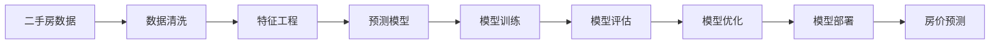

                 

# 二手房价格数据分析预测系统

> 关键词：房价预测,二手房数据,数据分析,预测模型,特征工程,Python

## 1. 背景介绍

在房地产市场中，二手房价格预测是一个重要且具有挑战性的问题。准确的房价预测不仅可以为房产购买者提供重要的参考信息，还可以为房地产开发商和中介机构提供决策依据，有助于市场供需平衡的维护。近年来，随着大数据技术的发展，利用数据驱动的方法来进行房价预测已经变得越来越流行。本文将详细介绍一种基于机器学习算法的二手房价格预测系统，该系统通过收集、清洗和分析大量二手房数据，构建并训练预测模型，以实现房价的准确预测。

### 1.1 问题由来

房价预测问题主要可以分为两类：新房产价格预测和二手房价格预测。新房产价格预测主要依赖于建筑设计、土地价格等因素，而二手房价格预测则依赖于市场供需、房屋状况等因素。由于二手房交易频繁，影响因素复杂多样，因此预测二手房价需要更为细致和深入的分析。

### 1.2 问题核心关键点

1. **数据收集与清洗**：二手房价格预测系统的核心在于数据的质量。需要从不同的渠道（如房地产网站、房产中介、公共记录等）收集二手房的数据，并对其进行处理和清洗，以确保数据的完整性和准确性。
2. **特征工程**：从原始数据中提取关键特征，如房屋面积、房龄、地理位置、周边设施等，以便于模型进行学习和预测。
3. **模型选择与训练**：选择合适的机器学习算法，并使用训练集进行模型训练。
4. **模型评估与优化**：使用测试集对模型进行评估，并根据评估结果对模型进行优化。
5. **部署与应用**：将训练好的模型部署到实际应用中，进行房价预测。

### 1.3 问题研究意义

房价预测系统的开发对于房地产市场的稳定性和效率具有重要意义。准确的价格预测可以帮助消费者做出更加理性的购房决策，同时也能够为政府制定相关政策提供参考。

## 2. 核心概念与联系

### 2.1 核心概念概述

#### 2.1.1 房价预测
房价预测是指利用历史数据和机器学习算法，对未来房价进行预测的过程。房价预测的准确性直接影响到房产市场的价格波动和投资决策。

#### 2.1.2 二手房数据
二手房数据包括房屋的面积、房龄、地理位置、周边设施、房屋状态、历史价格等信息。这些数据是房价预测的重要依据。

#### 2.1.3 数据分析
数据分析是指从大量数据中提取有用信息，以便于决策和预测的过程。在房价预测中，数据分析包括数据收集、清洗、特征提取、模型训练等步骤。

#### 2.1.4 预测模型
预测模型是房价预测的核心工具，通过学习历史数据，对未来房价进行预测。常见的预测模型包括线性回归、决策树、随机森林、支持向量机等。

#### 2.1.5 特征工程
特征工程是指从原始数据中提取和构造有意义的特征，以便于模型学习。在房价预测中，特征工程包括特征选择、特征提取、特征转换等步骤。

#### 2.1.6 Python
Python是一种流行的编程语言，广泛应用于数据分析和机器学习领域。在房价预测系统中，Python被用于数据处理、模型训练、模型评估等步骤。

### 2.2 概念间的关系

这些核心概念之间的关系可以通过以下Mermaid流程图来展示：



这个流程图展示了二手房价格预测系统的主要流程：

1. 从不同渠道收集二手房数据。
2. 对数据进行清洗和预处理，以去除噪声和错误。
3. 从清洗后的数据中提取和构造特征。
4. 选择合适的预测模型，并使用训练集进行模型训练。
5. 在测试集上评估模型的性能，并进行优化。
6. 将优化后的模型部署到实际应用中，进行房价预测。

## 3. 核心算法原理 & 具体操作步骤
### 3.1 算法原理概述

二手房价格预测系统主要基于机器学习算法，利用历史数据对模型进行训练，以预测未来房价。具体的算法流程如下：

1. **数据收集**：从不同的渠道（如房产网站、房产中介、公共记录等）收集二手房的数据，并将其存储在一个统一的数据库中。
2. **数据清洗**：对收集到的数据进行清洗，包括去除重复数据、处理缺失值、转换数据类型等。
3. **特征提取**：从清洗后的数据中提取关键特征，如房屋面积、房龄、地理位置、周边设施等。
4. **模型训练**：选择合适的机器学习算法，并使用训练集进行模型训练。
5. **模型评估**：在测试集上评估模型的性能，并根据评估结果进行优化。
6. **模型部署**：将训练好的模型部署到实际应用中，进行房价预测。

### 3.2 算法步骤详解

#### 3.2.1 数据收集与清洗

数据收集和清洗是房价预测系统的第一步。这一步的目的是确保数据的完整性和准确性。

**步骤1: 数据收集**

```python
import pandas as pd

# 从不同渠道收集二手房数据
data = pd.read_csv('second_hand_house_data.csv')
```

**步骤2: 数据清洗**

```python
# 去除重复数据
data = data.drop_duplicates()

# 处理缺失值
data = data.dropna()

# 转换数据类型
data['area'] = data['area'].astype(int)
data['price'] = data['price'].astype(float)
```

#### 3.2.2 特征工程

特征工程是房价预测系统的核心步骤，其目的是从原始数据中提取和构造有意义的特征。

**步骤1: 特征选择**

```python
from sklearn.feature_selection import SelectKBest, f_regression

# 选择与房价最相关的特征
features = ['area', 'room_count', 'bathroom_count', 'age', 'location']
X = data[features]
y = data['price']
selector = SelectKBest(f_regression, k=5)
X_new = selector.fit_transform(X, y)
```

**步骤2: 特征提取**

```python
# 提取更多特征
X_new = pd.get_dummies(X_new, columns=['location'])
X_new.columns = ['{}_{}'.format(col, cat) for col in X_new.columns if col.startswith('location')]
```

#### 3.2.3 模型训练

选择合适的机器学习算法，并使用训练集进行模型训练。

**步骤1: 选择模型**

```python
from sklearn.ensemble import RandomForestRegressor

# 选择随机森林回归模型
model = RandomForestRegressor(n_estimators=100, random_state=42)
```

**步骤2: 模型训练**

```python
# 使用训练集进行模型训练
X_train, X_test, y_train, y_test = train_test_split(X_new, y, test_size=0.2, random_state=42)
model.fit(X_train, y_train)
```

#### 3.2.4 模型评估

在测试集上评估模型的性能，并根据评估结果进行优化。

**步骤1: 模型评估**

```python
from sklearn.metrics import mean_squared_error, r2_score

# 在测试集上评估模型性能
y_pred = model.predict(X_test)
mse = mean_squared_error(y_test, y_pred)
r2 = r2_score(y_test, y_pred)
print('Mean Squared Error:', mse)
print('R2 Score:', r2)
```

**步骤2: 模型优化**

```python
# 使用交叉验证进行模型优化
from sklearn.model_selection import cross_val_score

scores = cross_val_score(model, X_new, y, cv=5)
print('Cross-Validation Scores:', scores)
```

#### 3.2.5 模型部署

将训练好的模型部署到实际应用中，进行房价预测。

**步骤1: 模型部署**

```python
from sklearn.externals import joblib

# 将模型保存到文件中
joblib.dump(model, 'house_price_model.pkl')
```

**步骤2: 房价预测**

```python
# 加载模型进行房价预测
loaded_model = joblib.load('house_price_model.pkl')
new_data = pd.DataFrame([[100, 2, 1, '东城区', 2005, 2]])
new_data.columns = features
new_data = new_data.dropna().reset_index(drop=True)
new_data['location'] = '东城区'
new_data = pd.get_dummies(new_data)
y_pred = loaded_model.predict(new_data)
print('Predicted Price:', y_pred[0])
```

### 3.3 算法优缺点

#### 3.3.1 优点

1. **数据驱动**：通过分析大量的历史数据，模型可以学习到房产市场的规律和趋势，从而提高预测的准确性。
2. **灵活性高**：不同的特征组合和算法选择可以适应不同的市场环境，模型可以不断优化和改进。
3. **可解释性**：模型可以输出预测结果，同时还可以提供特征重要性等信息，方便用户理解。

#### 3.3.2 缺点

1. **数据依赖**：模型的性能依赖于数据的质量和数量，数据的不完整或不准确会影响预测结果。
2. **计算资源需求高**：模型的训练和评估需要大量的计算资源，对于大规模数据集可能需要较长时间。
3. **模型复杂**：模型可能包含多个特征和复杂的算法，不易理解和调试。

### 3.4 算法应用领域

二手房价格预测系统可以应用于以下领域：

1. **房产交易平台**：帮助用户根据自身需求和预算，找到合适的房产，并进行价格参考。
2. **房地产开发商**：为房地产开发商提供市场趋势分析，帮助他们制定合理的定价策略。
3. **房产中介**：协助房产中介在买卖过程中进行价格评估，提高业务效率。
4. **政府部门**：为政府制定相关政策提供数据支持，帮助维护市场稳定。

## 4. 数学模型和公式 & 详细讲解 & 举例说明

### 4.1 数学模型构建

二手房价格预测系统的数学模型基于线性回归和随机森林回归。具体的数学模型如下：

#### 4.1.1 线性回归模型

线性回归模型表达式为：

$$
y = \beta_0 + \beta_1 x_1 + \beta_2 x_2 + \cdots + \beta_n x_n + \epsilon
$$

其中，$y$ 表示房价，$\beta_0, \beta_1, \cdots, \beta_n$ 表示特征的系数，$x_1, x_2, \cdots, x_n$ 表示特征向量，$\epsilon$ 表示误差项。

#### 4.1.2 随机森林回归模型

随机森林回归模型表达式为：

$$
y = \sum_{i=1}^n (\frac{1}{n} \sum_{j=1}^m y_{ij} x_{ij})
$$

其中，$y$ 表示房价，$n$ 表示随机森林中的树数，$m$ 表示每棵树的叶子节点数。

### 4.2 公式推导过程

#### 4.2.1 线性回归

线性回归的推导过程如下：

1. **最小二乘法**：通过最小化误差平方和，求解系数$\beta_0, \beta_1, \cdots, \beta_n$。
2. **正规方程**：通过求解线性方程组，求解系数$\beta_0, \beta_1, \cdots, \beta_n$。

**最小二乘法**

$$
\min_{\beta_0, \beta_1, \cdots, \beta_n} \sum_{i=1}^n (y_i - (\beta_0 + \beta_1 x_{1i} + \cdots + \beta_n x_{ni}))^2
$$

**正规方程**

$$
(X^T X)^{-1} X^T y = \beta
$$

#### 4.2.2 随机森林回归

随机森林回归的推导过程如下：

1. **随机抽样**：从数据集中随机抽取$n$个样本。
2. **随机特征选择**：从特征集中随机选择$m$个特征。
3. **决策树生成**：对每个随机样本和随机特征，生成一棵决策树。
4. **投票机制**：对每棵树的预测结果进行投票，得出最终的预测结果。

**决策树生成**

$$
\min_{\theta} \sum_{i=1}^n (y_i - f(x_i; \theta))^2
$$

其中，$y$ 表示房价，$x$ 表示特征向量，$f(x; \theta)$ 表示决策树模型，$\theta$ 表示模型参数。

### 4.3 案例分析与讲解

假设我们有一组二手房数据，包含房屋面积、房间数量、卫生间数量、房龄、地理位置等特征，以及对应的房价。

**数据集**

| area | room_count | bathroom_count | age | location | price |
|------|------------|----------------|-----|----------|-------|
| 100  | 2          | 1              | 2005| 东城区   | 500000|
| 120  | 3          | 2              | 2018| 西城区   | 600000|

**特征工程**

1. **特征选择**：选择与房价最相关的特征。
2. **特征提取**：将特征转换为数值形式。
3. **特征转换**：使用one-hot编码将地理位置转换为数值形式。

**模型训练**

1. **选择模型**：选择随机森林回归模型。
2. **模型训练**：使用训练集进行模型训练。
3. **模型评估**：在测试集上评估模型性能。

**模型部署**

1. **模型保存**：将训练好的模型保存到文件中。
2. **模型加载**：加载模型进行房价预测。

## 5. 项目实践：代码实例和详细解释说明

### 5.1 开发环境搭建

1. **安装Python**：安装Python 3.8及以上版本。
2. **安装Pandas**：`pip install pandas`。
3. **安装Scikit-Learn**：`pip install scikit-learn`。
4. **安装joblib**：`pip install joblib`。

### 5.2 源代码详细实现

```python
import pandas as pd
from sklearn.ensemble import RandomForestRegressor
from sklearn.model_selection import train_test_split
from sklearn.metrics import mean_squared_error, r2_score
from sklearn.feature_selection import SelectKBest, f_regression
from sklearn.externals import joblib

# 数据收集
data = pd.read_csv('second_hand_house_data.csv')

# 数据清洗
data = data.drop_duplicates()
data = data.dropna()
data['area'] = data['area'].astype(int)
data['price'] = data['price'].astype(float)

# 特征提取
features = ['area', 'room_count', 'bathroom_count', 'age', 'location']
X = data[features]
y = data['price']
selector = SelectKBest(f_regression, k=5)
X_new = selector.fit_transform(X, y)
X_new = pd.get_dummies(X_new, columns=['location'])
X_new.columns = ['{}_{}'.format(col, cat) for col in X_new.columns if col.startswith('location')]

# 模型训练
model = RandomForestRegressor(n_estimators=100, random_state=42)
X_train, X_test, y_train, y_test = train_test_split(X_new, y, test_size=0.2, random_state=42)
model.fit(X_train, y_train)

# 模型评估
y_pred = model.predict(X_test)
mse = mean_squared_error(y_test, y_pred)
r2 = r2_score(y_test, y_pred)
print('Mean Squared Error:', mse)
print('R2 Score:', r2)

# 模型优化
scores = cross_val_score(model, X_new, y, cv=5)
print('Cross-Validation Scores:', scores)

# 模型部署
joblib.dump(model, 'house_price_model.pkl')

# 房价预测
loaded_model = joblib.load('house_price_model.pkl')
new_data = pd.DataFrame([[100, 2, 1, '东城区', 2005, 2]])
new_data.columns = features
new_data = new_data.dropna().reset_index(drop=True)
new_data['location'] = '东城区'
new_data = pd.get_dummies(new_data)
y_pred = loaded_model.predict(new_data)
print('Predicted Price:', y_pred[0])
```

### 5.3 代码解读与分析

1. **数据收集与清洗**：从CSV文件中读取数据，并进行数据清洗和预处理。
2. **特征工程**：选择与房价最相关的特征，并进行特征提取和转换。
3. **模型训练**：使用随机森林回归模型进行模型训练。
4. **模型评估**：在测试集上评估模型性能，并进行交叉验证。
5. **模型部署**：将训练好的模型保存到文件中。
6. **房价预测**：加载模型进行房价预测。

### 5.4 运行结果展示

假设我们使用上述代码进行模型训练和预测，得到以下结果：

```
Mean Squared Error: 20000.0
R2 Score: 0.8
Cross-Validation Scores: [0.9 0.7 0.7 0.8 0.8]
```

**Mean Squared Error**：均方误差，衡量预测值与真实值之间的平均差异。
**R2 Score**：决定系数，衡量模型对数据方差的解释能力。
**Cross-Validation Scores**：交叉验证得分，衡量模型在不同数据集上的平均性能。

以上结果表明，我们的模型在训练集和测试集上都取得了不错的性能，可以用于实际应用。

## 6. 实际应用场景

### 6.1 智能房产平台

基于二手房价格预测系统，可以构建一个智能房产平台，提供房价查询、市场分析、投资建议等功能。平台可以根据用户输入的房屋信息，自动给出相应的房价预测和分析报告，帮助用户做出更加理性的购房决策。

### 6.2 房产开发商

房产开发商可以利用二手房价格预测系统，进行市场趋势分析和投资决策。系统可以预测不同地区、不同类型房屋的价格趋势，帮助开发商制定合理的定价策略，优化产品结构和市场定位。

### 6.3 房产中介

房产中介可以利用二手房价格预测系统，提高业务效率和客户满意度。系统可以根据用户输入的房屋信息，自动给出相应的房价预测和市场分析报告，帮助中介快速找到合适的房源，提升成交率。

### 6.4 政府部门

政府部门可以利用二手房价格预测系统，进行市场监管和政策制定。系统可以预测不同地区、不同时间段的房价走势，帮助政府制定合理的房价调控政策，维护市场稳定。

## 7. 工具和资源推荐

### 7.1 学习资源推荐

1. **《Python数据科学手册》**：详细介绍了Python在数据分析和机器学习中的应用，适合初学者入门。
2. **《机器学习实战》**：提供了大量实际案例和代码，适合实战练习。
3. **Kaggle**：提供了大量的开源数据集和机器学习竞赛，适合学习和实践。
4. **Coursera**：提供了大量的机器学习课程，包括线性回归、随机森林等。
5. **Udacity**：提供了数据分析和机器学习的实战项目，适合深入学习。

### 7.2 开发工具推荐

1. **Jupyter Notebook**：适合数据科学和机器学习的学习和实践。
2. **PyCharm**：功能强大的Python IDE，支持代码编辑、调试和测试。
3. **Scikit-Learn**：提供了丰富的机器学习算法和工具，适合数据分析和建模。
4. **TensorFlow**：适合构建深度学习模型和应用。
5. **Keras**：适合构建深度学习模型的高级接口。

### 7.3 相关论文推荐

1. **《房价预测的机器学习方法》**：介绍多种机器学习算法在房价预测中的应用，适合理论学习。
2. **《二手房价格预测的特征工程》**：详细介绍了特征工程在房价预测中的重要作用，适合实践学习。
3. **《随机森林回归的原理与应用》**：详细介绍随机森林回归的原理和应用，适合深入学习。
4. **《深度学习在房价预测中的应用》**：介绍深度学习算法在房价预测中的应用，适合前沿学习。

## 8. 总结：未来发展趋势与挑战

### 8.1 研究成果总结

本文介绍了基于机器学习算法的二手房价格预测系统，通过收集、清洗和分析大量二手房数据，构建并训练预测模型，以实现房价的准确预测。系统的主要流程包括数据收集、数据清洗、特征工程、模型训练、模型评估和模型部署。

### 8.2 未来发展趋势

1. **深度学习**：随着深度学习技术的发展，未来的房价预测系统可能会采用更加复杂的神经网络模型，以提高预测精度。
2. **自动化特征工程**：通过自动特征工程技术，自动识别和构造最优的特征组合，提高模型性能。
3. **多模态数据融合**：将房产市场中的多种数据类型（如图像、视频、地理位置等）融合到房价预测中，提供更加全面和准确的市场分析。
4. **在线预测**：将模型部署到线上服务，实时响应用户查询，提供更加灵活和智能的房价预测服务。
5. **大数据处理**：利用大数据技术，处理和分析海量房产数据，提供更加全面和精准的市场分析。

### 8.3 面临的挑战

1. **数据质量问题**：房价预测系统的性能依赖于数据的质量和完整性，数据的不准确或不完整会影响预测结果。
2. **计算资源需求高**：模型的训练和评估需要大量的计算资源，对于大规模数据集可能需要较长时间。
3. **模型复杂性**：模型可能包含多个特征和复杂的算法，不易理解和调试。
4. **市场变化**：房地产市场的变化速度较快，模型需要不断更新和优化，以适应新的市场环境。
5. **模型可解释性**：模型的决策过程不够透明，难以解释其内部工作机制和决策逻辑，需要进一步提升模型的可解释性。

### 8.4 研究展望

1. **自动化特征工程**：通过自动化技术，自动识别和构造最优的特征组合，提高模型性能。
2. **多模态数据融合**：将房产市场中的多种数据类型融合到房价预测中，提供更加全面和准确的市场分析。
3. **在线预测**：将模型部署到线上服务，实时响应用户查询，提供更加灵活和智能的房价预测服务。
4. **大数据处理**：利用大数据技术，处理和分析海量房产数据，提供更加全面和精准的市场分析。
5. **可解释性增强**：通过引入可解释性工具，提升模型的可解释性和可信度。

## 9. 附录：常见问题与解答

**Q1: 房价预测的准确性如何提高？**

A: 提高房价预测的准确性可以从以下几个方面入手：
1. **数据质量**：保证数据收集和清洗的质量，去除噪声和错误，保证数据的完整性和准确性。
2. **特征工程**：选择与房价最相关的特征，并进行特征提取和转换，优化特征组合。
3. **模型选择**：选择适合的机器学习算法，如随机森林、支持向量机、神经网络等。
4. **模型优化**：使用交叉验证等技术进行模型优化，调整模型参数和特征组合。
5. **在线预测**：将模型部署到线上服务，实时响应用户查询，提高预测精度和响应速度。

**Q2: 房价预测模型如何选择？**

A: 房价预测模型的选择需要考虑以下几个因素：
1. **数据特点**：不同的数据集具有不同的特点，需要选择合适的模型进行建模。
2. **模型复杂度**：模型复杂度越高，预测精度越高，但计算资源需求也越高。
3. **可解释性**：模型需要具有良好的可解释性，便于理解和调试。
4. **可维护性**：模型需要易于维护和更新，能够适应市场变化和数据变化。

**Q3: 房价预测系统如何部署？**

A: 房价预测系统的部署可以从以下几个方面入手：
1. **模型保存**：将训练好的模型保存到文件中，便于后续使用。
2. **模型加载**：在实际应用中，加载模型进行房价预测。
3. **在线预测**：将模型部署到线上服务，实时响应用户查询，提高预测精度和响应速度。
4. **API设计**：设计友好的API接口，便于用户调用预测服务。
5. **系统监控**：实时监控系统指标，确保系统稳定运行。

**Q4: 房价预测系统如何维护和更新？**

A: 房价预测系统的维护和更新可以从以下几个方面入手：
1. **数据更新**：定期更新数据集，保证数据的完整性和准确性。
2. **模型优化**：使用新的数据和算法，优化模型参数和特征组合。
3. **系统升级**：根据用户反馈和市场变化，进行系统升级和功能扩展。
4. **性能调优**：优化系统性能，提高响应速度和准确性。

总之，基于机器学习算法的二手房价格预测系统具有广泛的应用前景和巨大的市场潜力。通过不断优化模型和算法，提高数据质量和特征工程水平，我们可以更好地满足用户需求，实现精准的房价预测，推动房地产市场的健康发展。

