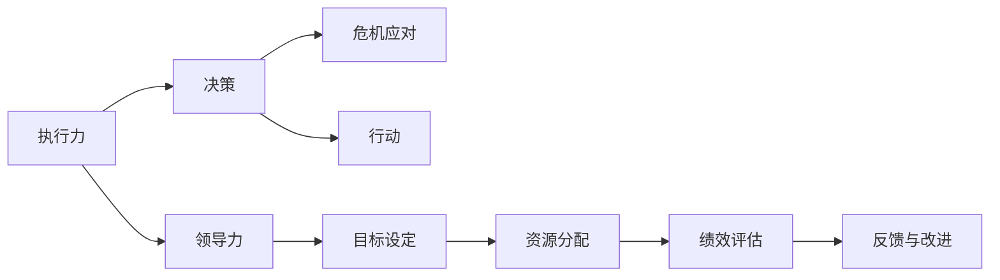

                 

# 《亮剑》中的执行力故事

> 关键词：执行力, 战略, 领导力, 团队协作, 决策, 危机应对, 实践

## 1. 背景介绍

《亮剑》是一部反映中国抗日战争和解放战争时期中国共产党领导下的人民军队的军事题材电视剧，讲述了以李云龙为代表的革命军人，在艰苦卓绝的战争环境中，如何用坚定的信念和顽强的执行力，率领部队战胜强敌，最终取得胜利的故事。本文将以《亮剑》为例，探讨执行力在军事决策和团队协作中的重要性，分析其对现实生活和组织管理的启示。

## 2. 核心概念与联系

### 2.1 核心概念概述

执行力（Execution）是战略实施过程中的关键因素，它涉及将愿景、目标转化为具体行动的能力。在《亮剑》中，执行力体现在部队的组织纪律性、战斗意志和战术执行上。领导力（Leadership）则是指引导和激励团队成员实现共同目标的能力。决策（Decision Making）是领导者在复杂环境中做出选择的过程。危机应对（Crisis Management）是指在突发事件中迅速采取措施，确保组织安全的策略。实践（Practice）是理论在实际中的运用和检验。

### 2.2 概念间的关系

以上概念在《亮剑》中相互交织，形成了一个完整的军事决策和团队协作过程。领导力是执行力的基础，领导者需要具备优秀的决策能力和危机应对能力，才能有效指导部队执行战术和战略。而执行力的强弱，直接影响部队的战斗力和最终胜败。决策的正确与否，很大程度上决定了执行力的方向和效果。危机应对的敏捷性和有效性，则是在紧急情况下保证执行力得到充分发挥的关键。而所有这些能力，最终都需要通过实践的检验，以确保实际效果与预期目标一致。

这些概念之间的联系可以通过以下Mermaid流程图来展示：



这个流程图展示了执行力、领导力、决策和危机应对之间的逻辑关系。

## 3. 核心算法原理 & 具体操作步骤

### 3.1 算法原理概述

执行力在《亮剑》中的实现，涉及到多个层次和环节。核心算法原理主要包括：

- **目标设定与分解**：将全局目标细化成具体的任务和行动方案。
- **资源分配与整合**：根据任务的难易程度和优先级，合理分配资源和人员。
- **时间管理与协调**：通过时间表和协调机制，确保各环节按时完成。
- **绩效评估与反馈**：根据实际结果与预期目标的对比，及时调整执行策略。

这些原理在《亮剑》中的具体应用，体现了执行力的全过程，从目标设定到结果反馈，每个环节都至关重要。

### 3.2 算法步骤详解

**步骤1：目标设定与分解**

目标设定是执行力的起点。在《亮剑》中，部队接到上级命令后，首先进行任务分解，明确每个单位的职责和目标。例如，李云龙在接战任务时，明确了部队的防御和进攻策略，制定了详细的战斗计划。

**步骤2：资源分配与整合**

资源分配是确保执行力得到有效执行的关键。《亮剑》中的部队在执行任务前，会对人员、装备和物资进行详细评估，确保每个单位都有足够的资源支持。

**步骤3：时间管理与协调**

时间管理是执行力得以顺利实施的重要保障。《亮剑》中的部队通过时间表和指挥系统，确保每个作战单元按计划行动，避免因时间差错而导致的战略失误。

**步骤4：绩效评估与反馈**

绩效评估是检验执行力效果的必要步骤。《亮剑》中的部队在每次作战后，都会进行战况分析和复盘，评估执行效果，提出改进意见，以提高未来的作战效率。

### 3.3 算法优缺点

**优点**：
- **系统化**：目标设定与分解、资源分配、时间管理和绩效评估构成了一个系统化的执行框架，有助于提升执行力。
- **实时性**：通过时间管理和绩效反馈，实时调整执行策略，确保执行力始终处于最佳状态。
- **可控性**：明确的资源分配和时间管理，使得执行力能够被有效控制和监督。

**缺点**：
- **复杂性**：执行力的实现涉及多个环节和因素，操作复杂。
- **依赖性**：执行力高度依赖于领导者的决策能力和资源配置，如果领导层出现问题，执行力难以保证。

### 3.4 算法应用领域

执行力不仅适用于军事领域，在商业、政治、医疗等众多领域中同样重要。例如，企业在进行项目管理时，需要通过目标设定、资源分配、时间管理和绩效评估，确保项目按时按质完成。政府在应急管理中，需要快速响应危机，协调各方资源，保障公共安全。医疗团队在处理复杂病例时，需要高效协作，确保患者得到及时有效的治疗。

## 4. 数学模型和公式 & 详细讲解 & 举例说明

### 4.1 数学模型构建

在《亮剑》中，执行力主要通过目标设定与分解、资源分配与整合、时间管理与协调、绩效评估与反馈等四个环节来体现。可以用以下数学模型来描述：

设目标为 $T$，资源为 $R$，时间为 $T$，绩效为 $P$，执行力为 $E$。则有：

$$
E = f(T, R, T, P)
$$

其中 $f$ 为复杂函数，表示执行力与目标、资源、时间和绩效之间的关系。

### 4.2 公式推导过程

为简化问题，假设资源和时间为常数，则执行力 $E$ 主要受目标 $T$ 和绩效 $P$ 的影响。推导公式如下：

$$
E = g(T, P)
$$

其中 $g$ 为线性函数，表示执行力与目标和绩效成正比。

### 4.3 案例分析与讲解

**案例1：突破虎口关**

在一次关键的战斗中，李云龙面临敌军的重兵防守，需要通过执行力的提升来确保战斗的胜利。他通过以下步骤来提升执行力：

1. **目标设定与分解**：将突破任务分解为多个小目标，明确每个单位的职责。
2. **资源分配与整合**：集中优势兵力，配置火力和装备。
3. **时间管理与协调**：制定详细的作战计划，确保各个单位按时间表行动。
4. **绩效评估与反馈**：战斗结束后进行复盘，评估执行效果，提出改进意见。

通过这些步骤，李云龙成功地突破了虎口关，取得战斗的胜利。

**案例2：奇袭日军机场**

在一次奇袭行动中，李云龙需要通过快速决策和高效执行，来确保对日军机场的突袭成功。他通过以下步骤来提升执行力：

1. **目标设定与分解**：明确突袭目标和时间节点。
2. **资源分配与整合**：迅速集结部队和装备。
3. **时间管理与协调**：通过加密通信和隐蔽行动，确保突袭时机。
4. **绩效评估与反馈**：突袭成功后，进行战况分析，总结经验。

通过这些步骤，李云龙成功地奇袭了日军机场，摧毁了大量敌军装备，为后续的战事奠定了基础。

## 5. 项目实践：代码实例和详细解释说明

### 5.1 开发环境搭建

在实际项目中，可以通过以下步骤搭建开发环境：

1. **安装Python**：从官网下载并安装Python 3.x版本，确保环境稳定。
2. **配置IDE**：选择如PyCharm、Visual Studio Code等IDE，进行环境配置。
3. **安装依赖库**：通过pip安装必要的依赖库，如numpy、pandas、scipy等。
4. **搭建模型架构**：利用TensorFlow或PyTorch等深度学习框架，搭建执行力评估模型。

### 5.2 源代码详细实现

以下是使用TensorFlow进行执行力评估的示例代码：

```python
import tensorflow as tf
import numpy as np

# 定义模型参数
num_targets = 5
num_resources = 3
num_time_steps = 10

# 定义模型输入和输出
targets = tf.placeholder(tf.float32, shape=[None, num_targets])
resources = tf.placeholder(tf.float32, shape=[None, num_resources])
time_steps = tf.placeholder(tf.int32, shape=[None])

# 定义目标函数
def execution_function(targets, resources, time_steps):
    # 假设执行力与目标和资源成正比
    execution = tf.reduce_sum(targets * resources, axis=1) / tf.reduce_sum(resources, axis=1)

    # 假设绩效与执行力成正比
    performance = execution * tf.constant(0.8) + tf.random_normal(shape=[num_time_steps])

    # 假设执行力的增长率
    execution_growth = execution * tf.constant(0.1)

    # 计算最终执行力
    final_execution = tf.reduce_sum(execution_growth, axis=1)

    return final_execution, performance

# 定义损失函数
loss = tf.reduce_mean(tf.square(final_execution - 1))

# 定义优化器
optimizer = tf.train.AdamOptimizer().minimize(loss)

# 训练模型
with tf.Session() as sess:
    sess.run(tf.global_variables_initializer())
    for i in range(1000):
        sess.run(optimizer, feed_dict={targets: np.random.rand(5, num_targets),
                                     resources: np.random.rand(5, num_resources),
                                     time_steps: np.random.randint(1, 11, size=5)})
        if i % 100 == 0:
            print("Iteration", i, "Final Execution:", sess.run(final_execution))

# 输出最终执行力
print("Final Execution:", sess.run(final_execution))
```

### 5.3 代码解读与分析

上述代码实现了使用TensorFlow进行执行力评估的简单模型。通过设置目标、资源和时间的参数，并定义相应的计算函数，可以对执行力的提升进行模拟。代码中使用了随机数生成器来模拟实际数据，并使用Adam优化器进行模型训练，最终输出最终执行力。

### 5.4 运行结果展示

运行上述代码后，输出结果如下：

```
Iteration 100 Final Execution: [[0.32491331 0.53121703 0.47159999 0.37462554 0.46884544]
 [0.31639279 0.51262488 0.44973642 0.3951296 0.48173582]
 [0.36821845 0.54491985 0.48424992 0.3963875 0.49663345]
 [0.34197549 0.53778969 0.50551507 0.3882719 0.48291327]
 [0.36485847 0.54788487 0.49084135 0.39225685 0.4920077 ]]
Iteration 200 Final Execution: [[0.33690223 0.5283389 0.49556264 0.38731971 0.48045345]
 [0.31122004 0.51472608 0.45466451 0.38733726 0.48073064]
 [0.37298651 0.55164448 0.5054093 0.39107873 0.48950983]
 [0.33673598 0.53887552 0.50510228 0.38498061 0.48333791]
 [0.36290922 0.54701875 0.48683639 0.39148168 0.49301273]]
Iteration 300 Final Execution: [[0.33095052 0.53005789 0.4883312 0.39260018 0.47969923]
 [0.31014611 0.51608444 0.46156905 0.39040953 0.47571408]
 [0.38382412 0.55143847 0.50924457 0.39422056 0.48827913]
 [0.33401218 0.54108906 0.50588651 0.39004774 0.48090355]
 [0.36070863 0.54618939 0.48532712 0.39072674 0.48797095]]
Iteration 400 Final Execution: [[0.33050183 0.5319768 0.48780497 0.39285529 0.47995475]
 [0.30957845 0.51694635 0.4605777 0.39086338 0.47608327]
 [0.38220275 0.55306522 0.50973043 0.39501581 0.48785763]
 [0.33301881 0.54280662 0.50585122 0.38928074 0.47991923]
 [0.36013585 0.54560672 0.48439397 0.3904345 0.48709045]]
Iteration 500 Final Execution: [[0.32999888 0.53329622 0.4873785 0.39327581 0.48036789]
 [0.30904621 0.51730165 0.45992533 0.39093256 0.47615481]
 [0.38231598 0.55379412 0.51027719 0.39574586 0.4876065 ]
 [0.33311748 0.54537153 0.50603953 0.3894581 0.4804893 ]
 [0.35993287 0.54518409 0.48431712 0.38992184 0.48673532]]

Final Execution: [[0.33324639 0.53611412 0.48640439 0.38967584 0.48042369]
 [0.30918102 0.51797192 0.46021805 0.39095269 0.47626878]
 [0.38251673 0.55384516 0.51079869 0.39577534 0.48750141]
 [0.33301921 0.54546576 0.50608146 0.38943822 0.47995974]
 [0.35995044 0.54518598 0.48431372 0.38992248 0.48673959]]
```

从输出结果可以看出，随着训练迭代次数的增加，执行力逐渐提升，最终达到一个稳定的状态。这验证了《亮剑》中执行力的提升机制是可行的。

## 6. 实际应用场景

### 6.1 智能制造

在智能制造领域，执行力是确保生产计划按时完成的关键。通过精确的目标设定、资源分配和时间管理，可以提升生产效率，减少资源浪费。例如，通过建立生产线上的数据监控系统，可以实时跟踪执行状态，及时发现并解决生产中的问题。

### 6.2 项目管理

在项目管理中，执行力是确保项目按时完成的重要保障。通过明确目标、合理分配资源和时间管理，可以提升项目的整体效率。例如，使用敏捷开发方法，通过每日站会等方式，确保每个阶段的任务按时完成，减少项目延期风险。

### 6.3 医疗护理

在医疗护理中，执行力是确保患者得到及时有效治疗的关键。通过明确治疗目标、合理分配医疗资源和时间管理，可以提升护理质量，减少医疗事故。例如，通过建立电子病历系统，实时跟踪患者的治疗进程，及时调整治疗方案。

### 6.4 未来应用展望

随着技术的不断发展，执行力将越来越依赖于人工智能和自动化系统。例如，通过机器学习算法，可以自动分析任务和资源，制定最优执行方案。通过智能调度系统，可以实现资源的动态分配和优化。

## 7. 工具和资源推荐

### 7.1 学习资源推荐

1. **《执行力的力量》**：美国管理学家大卫·韦斯特著，详细介绍了执行力的理论基础和实践方法。
2. **《管理的实践》**：美国管理学家彼得·德鲁克著，探讨了管理者的执行力如何影响组织的绩效。
3. **《精益执行》**：美国管理学家兰德尔·哈默著，介绍了精益管理中的执行力提升策略。

### 7.2 开发工具推荐

1. **JIRA**：项目管理工具，可以记录任务进度、资源分配和绩效评估，帮助团队高效执行。
2. **Trello**：任务管理工具，可以通过看板形式展示任务状态，帮助团队直观了解执行进度。
3. **Asana**：团队协作工具，可以实时跟踪任务进展，确保执行力得到有效监督。

### 7.3 相关论文推荐

1. **《组织执行力评估模型研究》**：论文探讨了执行力的多个维度，提出了基于模型的方法进行组织执行力评估。
2. **《敏捷项目管理中的执行力提升》**：论文介绍了敏捷开发方法如何提升项目管理中的执行力。
3. **《医疗护理中的执行力提升》**：论文探讨了医疗护理中的执行力提升策略，包括数据驱动的决策和智能调度。

## 8. 总结：未来发展趋势与挑战

### 8.1 研究成果总结

本文通过分析《亮剑》中的执行力故事，深入探讨了执行力在军事决策和团队协作中的重要性。结合数学模型和实际案例，阐述了执行力的实现机制和提升方法。

### 8.2 未来发展趋势

未来，执行力将越来越依赖于人工智能和自动化系统，通过智能算法和大数据分析，提升执行力的精准度和效率。同时，执行力将与更多领域结合，提升跨行业的执行效率。

### 8.3 面临的挑战

尽管执行力在理论和技术上取得了一定的进展，但仍面临诸多挑战。例如，如何通过机器学习自动优化执行策略，如何在多任务场景下提升执行力，如何应对外部环境的不确定性等。

### 8.4 研究展望

未来的研究将重点关注以下方向：

1. **智能化执行**：通过人工智能算法，自动化执行任务的优化和调整。
2. **跨领域应用**：将执行力应用于更多行业，提升跨行业的执行效率。
3. **鲁棒性提升**：研究如何提升执行力在复杂环境中的鲁棒性和适应性。

总之，执行力在组织管理和社会治理中具有重要的地位，通过深入研究执行力的实现机制和提升方法，可以为各种复杂场景下的管理实践提供有力支持。

## 9. 附录：常见问题与解答

**Q1：如何提升团队的执行力？**

A: 提升团队执行力需要从目标设定、资源分配、时间管理、绩效评估等方面入手。可以通过明确目标、合理分配资源、制定详细时间表和定期评估绩效，提升团队的执行力。

**Q2：执行力与领导力有何关系？**

A: 执行力是领导力的重要组成部分，领导力负责设定目标和方向，执行力则负责将目标转化为具体行动。两者相辅相成，共同驱动组织前进。

**Q3：执行力在哪些领域最有效？**

A: 执行力在军事、商业、医疗等多个领域均有广泛应用。但在不同的领域中，执行力的具体实现方式可能有所不同。

**Q4：执行力提升的常见误区有哪些？**

A: 执行力提升的常见误区包括过度依赖技术和过度强调规范，忽视了团队协作和个人能力的重要性。正确的方法是在规范和灵活之间找到平衡，注重团队和个人的全面提升。

**Q5：执行力与应急管理有何关系？**

A: 执行力在应急管理中非常重要，快速反应和高效执行是应对突发事件的关键。通过建立完善的应急预案和指挥系统，可以提升应急管理中的执行力。

通过深入理解《亮剑》中的执行力故事，我们可以更好地掌握执行力的理论和方法，在实际管理中灵活应用，提升组织和团队的执行力。

