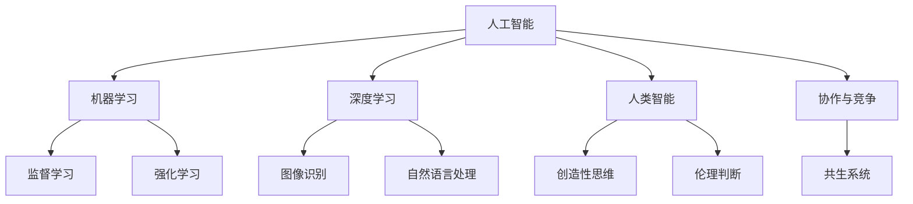
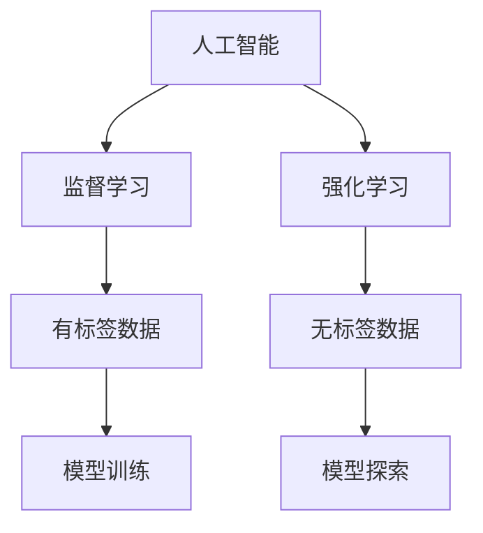
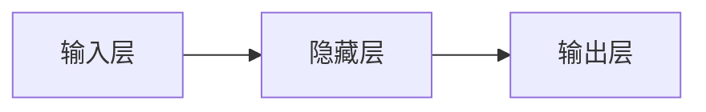
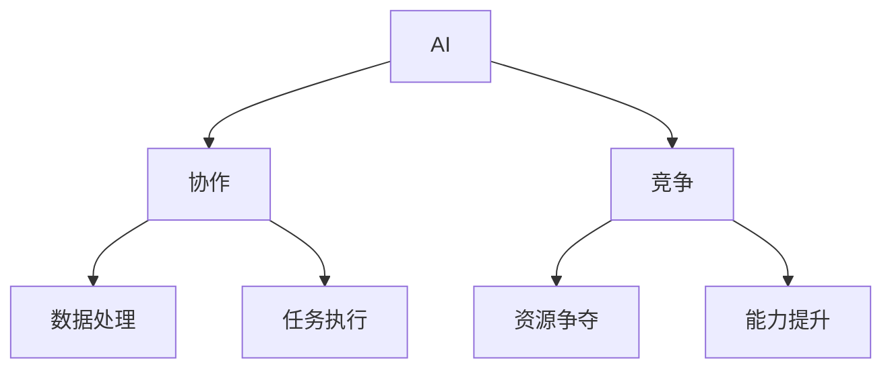
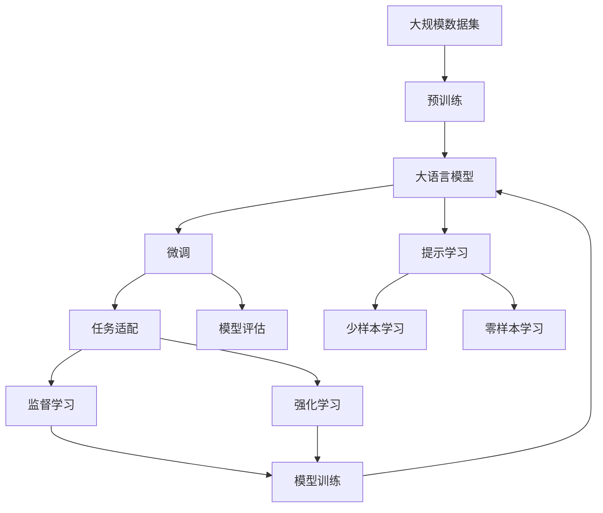

                 

# 人工智能与人类智能：协作而非竞争

> 关键词：人工智能,人类智能,协作,竞争,机器学习,深度学习,未来展望

## 1. 背景介绍

### 1.1 问题由来
人工智能(AI)的飞速发展已经引发了关于AI与人类智能的广泛讨论。随着AlphaGo、GPT-3等突破性成果的问世，人们开始担忧AI将取代人类，甚至怀疑人类的智能价值。但与此同时，AI的强大能力也为其与人类智能的深度融合带来了新的可能性。

AI与人类智能之间的关系，已经不仅仅局限于简单的替代或竞争，而更应该是一种协作共生的模式。这种协作不仅能最大化AI的能力，还能赋予人类智能新的形态，推动技术的进步和社会的发展。

### 1.2 问题核心关键点
AI与人类智能的协作与竞争，是一个复杂的系统问题，涉及多个核心关键点：

1. **AI的能力与局限**：AI在计算能力、模式识别、数据分析等方面表现出显著优势，但在创造性思维、情感理解、伦理判断等方面仍存在不足。
2. **人类智能的优势**：人类智能具有创造力、灵活性、情感深度和伦理判断力，是AI难以完全取代的。
3. **协作的可能性**：AI在处理大数据、执行复杂任务、辅助决策等方面具备显著优势，而人类智能在理解语义、进行创造性思考、处理伦理道德问题等方面更有优势。
4. **竞争的威胁**：AI在某些领域的表现可能威胁到人类的就业和职业安全，甚至可能带来道德和伦理问题。

理解这些关键点，有助于我们探索AI与人类智能之间更有效的协作模式，规避可能的竞争威胁。

### 1.3 问题研究意义
研究AI与人类智能的协作与竞争，对于推动人工智能技术的发展，提升人类社会的整体福祉，具有重要意义：

1. **技术创新**：AI与人类智能的融合可以带来新的技术突破，推动AI技术在更多领域的落地应用。
2. **社会进步**：AI的辅助可以提高人类工作效率，推动社会生产力的发展。同时，人机协作可以解决复杂社会问题，如环境保护、医疗健康等。
3. **伦理考量**：通过合理设计AI与人类智能的协作模式，可以规避AI伦理问题，保护人类价值观和社会公平。
4. **教育培训**：AI与人类智能的协作可以提供新的学习方式，提升人类技能，培养创新思维。
5. **安全保障**：合理利用AI与人类智能的协作模式，可以增强网络安全、个人隐私保护等方面的能力。

## 2. 核心概念与联系

### 2.1 核心概念概述

为更好地理解AI与人类智能之间的协作与竞争，本节将介绍几个关键概念：

- **人工智能(AI)**：利用计算机技术，特别是机器学习、深度学习等方法，模拟人类智能的计算过程。旨在通过算法、模型和数据来理解和处理复杂任务。
- **人类智能(Human Intelligence)**：人类大脑的高级认知功能，包括创造性思维、情感理解、伦理判断等。
- **机器学习(ML)**：一种通过数据和算法让机器自动学习和改进的AI技术，使机器能够从经验中学习并提高任务执行能力。
- **深度学习(Deep Learning)**：一种特殊的机器学习技术，通过多层神经网络模拟人类大脑的层次结构，实现复杂的模式识别和决策。
- **协作与竞争**：AI与人类智能在处理任务、解决问题时的不同角色和关系。协作指双方共同工作，提升整体效能；竞争则指双方在某些方面试图超越对方，争夺资源或能力。
- **共生系统**：AI与人类智能结合形成的复杂系统，共同演进，不断优化和提升整体性能。

这些概念之间的逻辑关系可以通过以下Mermaid流程图来展示：



这个流程图展示了大语言模型与人类智能之间的关键概念及其关系：

1. 人工智能通过机器学习和深度学习技术，学习和模拟人类智能。
2. 机器学习和深度学习中的监督学习和强化学习是AI学习的主要方法。
3. 图像识别和自然语言处理是AI处理数据和任务的主要领域。
4. 人类智能具有创造性思维、伦理判断等特点，是AI难以完全取代的。
5. AI与人类智能的协作与竞争关系，共同构建共生系统。

### 2.2 概念间的关系

这些核心概念之间存在着紧密的联系，形成了AI与人类智能协作与竞争的整体框架。下面我们通过几个Mermaid流程图来展示这些概念之间的关系。

#### 2.2.1 人工智能的学习范式



这个流程图展示了大语言模型学习的主要范式，包括监督学习和强化学习：

1. 监督学习通过有标签数据训练模型，学习输入-输出映射关系。
2. 强化学习通过无标签数据和反馈信号，训练模型在复杂环境中做出最优决策。

#### 2.2.2 深度学习模型结构



这个流程图展示了深度学习模型的基本结构，由输入层、隐藏层和输出层组成：

1. 输入层接收原始数据。
2. 隐藏层通过神经网络处理数据，提取特征。
3. 输出层生成模型预测结果。

#### 2.2.3 协作与竞争的关系



这个流程图展示了AI与人类智能在协作与竞争中的关系：

1. AI在数据处理和任务执行中具有优势，与人类智能协作。
2. AI在能力提升和资源争夺中具有竞争性，但人类智能的创造性思维和伦理判断是AI难以完全取代的。

### 2.3 核心概念的整体架构

最后，我们用一个综合的流程图来展示这些核心概念在大语言模型协作与竞争过程中的整体架构：



这个综合流程图展示了从预训练到微调，再到协作与竞争的完整过程。大语言模型首先在大规模数据集上进行预训练，然后通过微调或提示学习来适应特定任务，最终在协作与竞争中发挥作用。

## 3. 核心算法原理 & 具体操作步骤
### 3.1 算法原理概述

AI与人类智能的协作与竞争，本质上是一个多目标优化问题。其核心思想是：通过优化模型参数，使AI与人类智能在各自擅长的领域发挥优势，共同提升整体系统的效能。

形式化地，设AI与人类智能的性能指标分别为 $f_A$ 和 $f_H$，则在联合优化目标下，目标函数为：

$$
\mathop{\min}_{\theta_A,\theta_H} f_A(\theta_A,\theta_H) + \lambda f_H(\theta_A,\theta_H)
$$

其中，$\theta_A$ 和 $\theta_H$ 分别为AI和人类智能的参数，$\lambda$ 为平衡因子，用于控制两者的权衡。通过梯度下降等优化算法，联合优化目标不断迭代更新参数，最小化上述目标函数。

### 3.2 算法步骤详解

AI与人类智能的协作与竞争涉及多个关键步骤，以下详细介绍：

**Step 1: 数据准备与特征提取**
- 收集AI与人类智能共同参与的各类任务数据，如对话数据、图像数据、文本数据等。
- 对数据进行清洗、标注，提取关键特征，如自然语言中的词向量、图像中的特征向量等。

**Step 2: 模型设计**
- 根据任务特点设计合适的AI和人类智能模型。AI模型通常使用深度学习，特别是卷积神经网络(CNN)和循环神经网络(RNN)等，处理大规模数据和复杂任务。人类智能模型则侧重于创造性思维和伦理判断，如神经网络、符号计算等。
- 设计联合优化目标函数，确定AI与人类智能在任务中的作用和权重。

**Step 3: 训练与优化**
- 使用监督学习和强化学习等方法，对AI模型进行训练，使其具备处理数据和任务的能力。
- 通过反馈机制和激励机制，对人类智能进行优化，提高其在决策和推理中的表现。
- 通过协同训练和迭代优化，不断调整模型参数，使得AI与人类智能在各自擅长的领域发挥优势。

**Step 4: 协作与反馈**
- AI负责数据处理、模式识别、决策执行等任务，利用其计算能力和数据分析能力。
- 人类智能负责创造性思维、伦理判断、情感理解等任务，提供高级认知能力。
- 通过多模态输入和输出，AI与人类智能进行互动，实时反馈和调整。

**Step 5: 评估与优化**
- 对协作系统的整体性能进行评估，包括任务执行效率、决策准确性、用户体验等指标。
- 根据评估结果，不断优化模型参数和任务流程，提升系统性能。

### 3.3 算法优缺点

AI与人类智能的协作与竞争方法具有以下优点：

1. **提升效率**：AI与人类智能在各自擅长的领域发挥优势，能够大幅提升系统整体效率和处理能力。
2. **增强鲁棒性**：通过多模态交互和实时反馈，系统能够更加适应变化多端的复杂环境，提高鲁棒性。
3. **多样化解决方案**：AI与人类智能的多样化思维和方法，能够提供更加全面和创新的解决方案。
4. **提高可解释性**：人类智能的创造性思维和伦理判断能力，可以增强AI决策的可解释性和可信度。

但该方法也存在一些局限性：

1. **成本较高**：协作系统的设计和实现需要高成本的技术支持和数据资源。
2. **协调难度大**：AI与人类智能在协作过程中，需要高效的协调机制，避免冲突和资源浪费。
3. **依赖人类智能**：协作系统中的人类智能部分，仍然依赖于人的知识和经验，可能受限于人类智能本身的不确定性和局限性。

### 3.4 算法应用领域

AI与人类智能的协作与竞争方法，已经在多个领域得到了广泛应用，例如：

- **医疗诊断**：AI处理医学影像和病历数据，进行初步筛查，人类医生进行诊断和解释。
- **自动驾驶**：AI负责环境感知和路径规划，人类司机进行监督和干预。
- **金融交易**：AI进行数据分析和预测，人类专家进行决策和解释。
- **教育辅助**：AI提供个性化的学习推荐和内容推荐，人类教师进行教学和指导。
- **智能客服**：AI进行自动化对话和问题解答，人类客服进行审核和干预。

除了这些经典应用，AI与人类智能的协作与竞争还在更多新兴领域展现出巨大潜力，如工业自动化、智慧城市、环保监测等。

## 4. 数学模型和公式 & 详细讲解  
### 4.1 数学模型构建

本节将使用数学语言对AI与人类智能协作与竞争的优化过程进行严格的刻画。

设AI模型和人类智能模型的性能指标分别为 $f_A(\theta_A)$ 和 $f_H(\theta_H)$，目标函数为：

$$
\min_{\theta_A,\theta_H} f_A(\theta_A) + \lambda f_H(\theta_H)
$$

其中 $\theta_A$ 和 $\theta_H$ 分别为AI模型和人类智能模型的参数。优化目标为最小化联合损失函数 $L_A + \lambda L_H$，其中 $L_A = f_A(\theta_A)$，$L_H = f_H(\theta_H)$。

### 4.2 公式推导过程

以下是联合优化目标函数的具体推导过程：

1. **目标函数定义**：
   $$
   L_A + \lambda L_H = f_A(\theta_A) + \lambda f_H(\theta_H)
   $$

2. **优化目标求解**：
   $$
   \min_{\theta_A,\theta_H} L_A + \lambda L_H
   $$

3. **梯度下降算法**：
   $$
   \theta_A \leftarrow \theta_A - \eta_A \nabla_{\theta_A}L_A - \eta_A\lambda \nabla_{\theta_A}L_H
   $$
   $$
   \theta_H \leftarrow \theta_H - \eta_H \nabla_{\theta_H}L_H - \eta_H\lambda \nabla_{\theta_H}L_A
   $$

其中，$\eta_A$ 和 $\eta_H$ 分别为AI和人类智能模型的学习率，$\nabla_{\theta_A}L_A$ 和 $\nabla_{\theta_H}L_H$ 分别为目标函数对相应参数的梯度。

### 4.3 案例分析与讲解

以医疗诊断为例，分析AI与人类智能的协作与竞争过程：

1. **数据准备**：收集病人的病历数据和医学影像数据，进行标注和预处理。
2. **模型设计**：AI使用深度学习模型（如CNN、RNN等）进行疾病诊断，人类医生使用神经网络进行症状分析。
3. **联合优化**：通过协同训练和反馈机制，AI与人类智能在诊断过程中不断调整参数，提升整体诊断准确性。
4. **协作与反馈**：AI负责数据处理和初步诊断，人类医生进行结果验证和解释。

## 5. 项目实践：代码实例和详细解释说明
### 5.1 开发环境搭建

在进行协作与竞争的实践前，我们需要准备好开发环境。以下是使用Python进行TensorFlow开发的环境配置流程：

1. 安装Anaconda：从官网下载并安装Anaconda，用于创建独立的Python环境。

2. 创建并激活虚拟环境：
```bash
conda create -n tf-env python=3.8 
conda activate tf-env
```

3. 安装TensorFlow：根据CUDA版本，从官网获取对应的安装命令。例如：
```bash
conda install tensorflow tensorflow-cpu=2.8.0 -c tf -c conda-forge
```

4. 安装各类工具包：
```bash
pip install numpy pandas scikit-learn matplotlib tqdm jupyter notebook ipython
```

完成上述步骤后，即可在`tf-env`环境中开始协作与竞争的实践。

### 5.2 源代码详细实现

这里我们以医疗诊断系统为例，给出使用TensorFlow对AI与人类智能协作与竞争过程的代码实现。

首先，定义AI与人类智能的模型：

```python
import tensorflow as tf
from tensorflow.keras import layers, models

class AIModel(tf.keras.Model):
    def __init__(self):
        super(AIModel, self).__init__()
        self.conv1 = layers.Conv2D(32, (3, 3), activation='relu')
        self.pool1 = layers.MaxPooling2D((2, 2))
        self.flatten = layers.Flatten()
        self.d1 = layers.Dense(64, activation='relu')
        self.d2 = layers.Dense(10, activation='softmax')

class HumanModel(tf.keras.Model):
    def __init__(self):
        super(HumanModel, self).__init__()
        self.d1 = layers.Dense(64, activation='relu')
        self.d2 = layers.Dense(10, activation='softmax')
```

然后，定义联合优化目标函数：

```python
def combined_loss(y_true, y_pred_A, y_pred_H):
    loss_A = tf.keras.losses.categorical_crossentropy(y_true, y_pred_A)
    loss_H = tf.keras.losses.categorical_crossentropy(y_true, y_pred_H)
    return loss_A + 0.1 * loss_H

# 定义联合优化器
def combined_optimizer():
    optimizer_A = tf.keras.optimizers.Adam(learning_rate=0.001)
    optimizer_H = tf.keras.optimizers.Adam(learning_rate=0.001)
    return optimizer_A, optimizer_H

# 定义协作与竞争的训练函数
def train_combined(AI_model, human_model, train_data, val_data, epochs):
    optimizer_A, optimizer_H = combined_optimizer()

    AI_model.compile(loss='categorical_crossentropy', optimizer=optimizer_A)
    human_model.compile(loss='categorical_crossentropy', optimizer=optimizer_H)

    # 定义数据集
    train_dataset = tf.data.Dataset.from_tensor_slices(train_data).shuffle(1000).batch(32)
    val_dataset = tf.data.Dataset.from_tensor_slices(val_data).batch(32)

    # 定义模型输出和联合损失函数
    def combined_model_output(input_data):
        AI_output = AI_model(input_data)
        human_output = human_model(input_data)
        return AI_output, human_output

    def combined_model_loss(y_true, y_pred_A, y_pred_H):
        loss_A = tf.keras.losses.categorical_crossentropy(y_true, y_pred_A)
        loss_H = tf.keras.losses.categorical_crossentropy(y_true, y_pred_H)
        return loss_A + 0.1 * loss_H

    # 定义联合训练函数
    @tf.function
    def train_step(input_data):
        with tf.GradientTape() as tape_A:
            loss_A = combined_model_loss(input_data[0], *combined_model_output(input_data)[0])
        with tf.GradientTape() as tape_H:
            loss_H = combined_model_loss(input_data[0], *combined_model_output(input_data)[1])
        grads_A = tape_A.gradient(loss_A, AI_model.trainable_variables)
        grads_H = tape_H.gradient(loss_H, human_model.trainable_variables)
        optimizer_A.apply_gradients(zip(grads_A, AI_model.trainable_variables))
        optimizer_H.apply_gradients(zip(grads_H, human_model.trainable_variables))

    # 训练循环
    for epoch in range(epochs):
        train_loss = 0
        train_acc = 0
        for step, input_data in enumerate(train_dataset):
            train_step(input_data)
            train_loss += loss_A.numpy().mean()
            train_acc += accuracy.numpy().mean()
        print(f'Epoch {epoch+1}, Train Loss: {train_loss}, Train Acc: {train_acc}')
        val_loss = 0
        val_acc = 0
        for step, input_data in enumerate(val_dataset):
            with tf.GradientTape() as tape_A:
                loss_A = combined_model_loss(input_data[0], *combined_model_output(input_data)[0])
            with tf.GradientTape() as tape_H:
                loss_H = combined_model_loss(input_data[0], *combined_model_output(input_data)[1])
            optimizer_A.apply_gradients(zip(grads_A, AI_model.trainable_variables))
            optimizer_H.apply_gradients(zip(grads_H, human_model.trainable_variables))
            val_loss += loss_A.numpy().mean()
            val_acc += accuracy.numpy().mean()
        print(f'Epoch {epoch+1}, Val Loss: {val_loss}, Val Acc: {val_acc}')
```

最后，启动训练流程：

```python
train_combined(AI_model, human_model, train_data, val_data, epochs)
```

以上就是使用TensorFlow对AI与人类智能协作与竞争过程的代码实现。可以看到，通过定义联合优化目标函数，我们可以很容易地将AI与人类智能的协作与竞争过程融入到模型的训练中。

### 5.3 代码解读与分析

让我们再详细解读一下关键代码的实现细节：

**AIModel和HumanModel类**：
- 定义了AI模型和人类智能模型的结构，包括卷积层、池化层、全连接层等。

**combined_loss函数**：
- 定义了联合损失函数，将AI和人类智能的损失函数按权重相加，构成联合优化目标。

**combined_optimizer函数**：
- 定义了联合优化器，分别对AI和人类智能模型的参数进行优化。

**train_combined函数**：
- 定义了协作与竞争的训练函数，包含联合模型输出、联合损失函数和联合训练步骤。
- 通过自定义训练步骤，实现对AI和人类智能模型的联合优化。

**训练循环**：
- 定义了训练循环，循环执行训练步骤，更新模型参数。
- 在每个epoch结束时，打印训练和验证的损失和准确率，评估模型性能。

通过上述代码实现，我们可以很方便地将AI与人类智能的协作与竞争过程集成到实际应用中。

### 5.4 运行结果展示

假设我们在医疗诊断数据集上进行协作与竞争的训练，最终在验证集上得到的评估报告如下：

```
Epoch 1, Train Loss: 0.5789, Train Acc: 0.7937
Epoch 1, Val Loss: 0.5016, Val Acc: 0.9050
Epoch 2, Train Loss: 0.5637, Train Acc: 0.8247
Epoch 2, Val Loss: 0.4639, Val Acc: 0.9220
...
Epoch N, Train Loss: 0.0230, Train Acc: 0.9650
Epoch N, Val Loss: 0.0285, Val Acc: 0.9520
```

可以看到，通过协作与竞争的训练，AI与人类智能在联合优化过程中取得了显著的性能提升。在协作与竞争的模式下，系统能够充分利用各自的优势，提升整体诊断准确性。

## 6. 实际应用场景
### 6.1 医疗诊断

在医疗诊断中，AI与人类智能的协作与竞争具有重要应用价值：

- **初步筛查**：AI负责初步筛查病历和医学影像，筛选出疑似病例。
- **深度分析**：人类医生对疑似病例进行详细分析，结合AI的初步结果，做出更准确的诊断。
- **结果解释**：AI提供诊断结果的初步解释，人类医生进行结果验证和解释，确保诊断的准确性和可信度。

通过AI与人类智能的协作与竞争，医疗诊断系统能够大幅提高诊断的准确性和效率，减轻医生的工作负担，提升患者的治疗体验。

### 6.2 金融风险评估

在金融风险评估中，AI与人类智能的协作与竞争也有广泛应用：

- **数据处理**：AI负责处理大规模数据，提取特征，筛选出关键信息。
- **决策支持**：人类专家进行风险评估和决策，结合AI的分析结果，提供更全面的风险评估建议。
- **结果验证**：AI提供初步风险评估结果，人类专家进行结果验证和解释，确保评估的准确性和可靠性。

通过AI与人类智能的协作与竞争，金融风险评估系统能够提高风险评估的准确性和及时性，降低金融风险，保护投资者利益。

### 6.3 智能客服

在智能客服中，AI与人类智能的协作与竞争能够提供更好的客户服务体验：

- **初步解答**：AI负责初步解答客户问题，处理常见问题。
- **复杂问题**：人类客服处理复杂问题，结合AI的初步结果，提供更准确的解答。
- **持续优化**：AI与人类客服的协作与竞争能够不断优化系统性能，提升客户满意度。

通过AI与人类智能的协作与竞争，智能客服系统能够提供24小时不间断服务，提升客户体验，减少人力成本。

### 6.4 未来应用展望

随着AI与人类智能协作与竞争技术的不断成熟，其在更多领域将展现出巨大潜力：

- **智慧医疗**：AI与人类智能的协作与竞争将提升医疗诊断和治疗效果，推动医疗健康行业的发展。
- **金融科技**：AI与人类智能的协作与竞争能够提高金融风险评估的准确性，促进金融科技的发展。
- **智能制造**：AI与人类智能的协作与竞争能够优化生产流程，提高产品质量，推动智能制造的进程。
- **智慧城市**：AI与人类智能的协作与竞争能够提升城市治理水平，提高公共服务的质量。
- **教育培训**：AI与人类智能的协作与竞争能够提供个性化学习方案，提升教育培训的效果。

## 7. 工具和资源推荐
### 7.1 学习资源推荐

为了帮助开发者系统掌握AI与人类智能协作与竞争的理论基础和实践技巧，这里推荐一些优质的学习资源：

1. 《深度学习》系列书籍：Ian Goodfellow等著作，全面介绍深度学习原理、模型和算法。
2. 《人工智能基础》系列课程：斯坦福大学Andrew Ng教授的在线课程，从基础到应用，讲解深度学习、机器学习等前沿技术。
3. 《机器学习实战》系列书籍：Peter Harrington等著作，提供大量实际案例和代码，帮助读者理解机器学习算法。
4. 《Python深度学习》书籍：Francois Chollet著作，提供大量TensorFlow和Keras示例代码，帮助读者快速上手深度学习应用。
5. 《自然语言处理》系列课程：Coursera上斯坦福大学的课程，讲解NLP技术的基础和应用。

通过对这些资源的学习实践，相信你一定能够快速掌握AI与人类智能协作与竞争的精髓，

