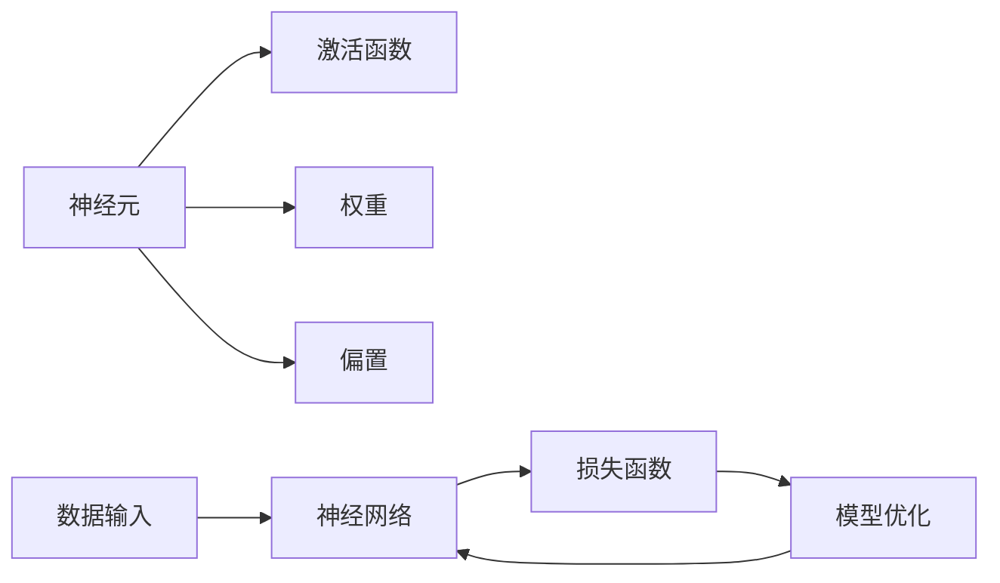

                 

# 人工智能演进之路：神经网络两落三起

## 1. 背景介绍

### 1.1 问题由来
人工智能(AI)作为计算机科学的一个分支，其历史可以追溯到1956年的达特茅斯会议，标志着人工智能这一研究领域的诞生。经过数十年的探索与实践，AI技术经历了从兴起到衰落再到复兴的过程。其中，神经网络作为AI的重要分支之一，其演进历程特别引人关注。

### 1.2 问题核心关键点
神经网络技术从诞生至今经历了三个重要的发展阶段：

1. **初创阶段**：20世纪80年代至90年代初期，神经网络的研究集中在理论和算法改进上，但由于计算机性能的限制和训练数据的稀缺，应用价值难以体现。
2. **低谷阶段**：20世纪90年代中后期，由于过拟合和计算复杂度问题，神经网络的性能难以与传统算法相媲美，逐渐被冷落。
3. **复兴阶段**：21世纪初，随着深度学习技术的兴起，特别是卷积神经网络(CNN)和循环神经网络(RNN)的出现，神经网络的应用范围和性能再次得到极大提升。

这些阶段展示了神经网络从理论研究到实际应用的曲折历程，以及其在AI发展中的关键作用。了解这些历程有助于深入理解AI技术的演变路径，并为未来的研究提供参考。

### 1.3 问题研究意义
探讨神经网络的发展历程，对于理解AI技术的前沿趋势、提升模型性能、优化算法结构、促进AI在实际应用中的落地具有重要意义。

1. 有助于掌握神经网络技术的历史脉络，从而理解当前研究的热点和难点。
2. 通过学习不同阶段的代表性算法和模型，可以获得丰富的知识储备和技术灵感。
3. 可以反思和总结神经网络在技术实现、应用场景和产业发展中的成功经验与失败教训。
4. 可以为未来的AI技术创新提供理论和实践的借鉴，推动AI技术的持续进步。

## 2. 核心概念与联系

### 2.1 核心概念概述

神经网络技术基于生物学中神经元工作的原理，模拟人脑的计算和信息处理机制。其核心思想是将输入数据通过一系列的层次处理，最终输出预测结果。这一过程类似于人脑处理信息的过程，因此称为神经网络。

神经网络的基本组件包括：

- **神经元(Neuron)**：神经网络的基本计算单元，模拟人脑中的神经元。
- **激活函数(Activation Function)**：定义神经元的输出，常用的激活函数包括Sigmoid、ReLU等。
- **权重(Weight)**：连接神经元间的参数，影响神经元的输出。
- **偏置(Bias)**：神经元的固定参数，用于调节输出。
- **损失函数(Loss Function)**：衡量模型预测结果与真实结果之间的差异。

### 2.2 概念间的关系

神经网络的技术演进涉及到多个概念和环节的相互作用。以下通过Mermaid流程图展示这些概念和环节之间的关系：



这个流程图展示了神经网络的基本工作流程：

1. 数据输入神经网络，经过多层的神经元计算，最终输出预测结果。
2. 损失函数评估预测结果与真实结果的差异。
3. 通过优化算法调整模型参数，使损失函数最小化。
4. 重复以上过程，直至模型收敛。

这些概念和环节构成了神经网络的基本框架，理解这些关系对于掌握神经网络的演进历程至关重要。

## 3. 核心算法原理 & 具体操作步骤
### 3.1 算法原理概述

神经网络算法原理主要基于反向传播算法(Backpropagation)，其核心思想是通过梯度下降法最小化损失函数。具体来说，神经网络通过前向传播计算预测结果，反向传播计算梯度，最终更新权重和偏置参数，使模型不断优化。

反向传播算法的基本步骤如下：

1. **前向传播**：将输入数据通过神经网络各层，计算出每个神经元的输出。
2. **反向传播**：计算预测结果与真实结果之间的误差，即损失函数。
3. **梯度计算**：计算每个神经元对损失函数的偏导数，得到梯度向量。
4. **权重更新**：使用梯度下降法更新模型参数。

### 3.2 算法步骤详解

以下详细讲解神经网络算法的具体步骤：

**Step 1: 数据准备**

神经网络的训练需要大量的标注数据，这些数据应包含足够的样本和多样性，以确保模型能够泛化到新的数据上。

**Step 2: 模型定义**

根据任务需求，设计合适的神经网络结构。例如，图像分类任务通常使用卷积神经网络(CNN)，序列预测任务则使用循环神经网络(RNN)。

**Step 3: 模型训练**

将数据输入模型，使用反向传播算法更新模型参数。训练过程中，需要选择合适的学习率和优化器，以及设置训练轮数和验证集等超参数。

**Step 4: 模型评估**

使用测试集评估模型性能，常见的评估指标包括准确率、精度、召回率等。

**Step 5: 模型应用**

将训练好的模型应用到实际问题中，进行预测或分类等操作。

### 3.3 算法优缺点

神经网络算法具有以下优点：

1. **强大的泛化能力**：神经网络能够从数据中学习到复杂的模式，具有良好的泛化能力。
2. **自适应能力**：神经网络能够自动调整参数，适应不同的数据分布。
3. **灵活性**：神经网络的架构可以灵活调整，适用于多种类型的任务。

同时，神经网络算法也存在一些缺点：

1. **计算复杂度**：神经网络的计算复杂度较高，训练时间和资源需求大。
2. **过拟合风险**：神经网络容易过拟合训练数据，导致模型泛化性能下降。
3. **参数调整复杂**：神经网络的参数较多，调试和优化难度大。
4. **可解释性差**：神经网络的决策过程复杂，难以解释和调试。

### 3.4 算法应用领域

神经网络技术广泛应用于计算机视觉、自然语言处理、语音识别、推荐系统等多个领域。以下是几个典型的应用场景：

- **计算机视觉**：图像分类、物体检测、人脸识别等。
- **自然语言处理**：机器翻译、情感分析、文本生成等。
- **语音识别**：语音识别、语音合成、情感分析等。
- **推荐系统**：商品推荐、内容推荐、广告推荐等。

## 4. 数学模型和公式 & 详细讲解  
### 4.1 数学模型构建

神经网络的基本数学模型可以表示为：

$$
y = f(x; \theta)
$$

其中，$y$ 为模型输出，$x$ 为输入数据，$\theta$ 为模型参数。模型参数 $\theta$ 通常包含权重 $w$ 和偏置 $b$。

假设神经网络由 $L$ 层组成，每层 $n$ 个神经元，则模型的前向传播过程可以表示为：

$$
z_l = W_l z_{l-1} + b_l
$$

$$
a_l = f(z_l)
$$

其中，$z_l$ 为第 $l$ 层的输入，$a_l$ 为第 $l$ 层的输出，$W_l$ 为第 $l$ 层的权重矩阵，$b_l$ 为第 $l$ 层的偏置向量。

### 4.2 公式推导过程

以一个简单的二分类任务为例，推导神经网络的前向传播和反向传播过程。

**前向传播**：

$$
z_0 = x
$$

$$
a_1 = f(z_0)
$$

$$
z_2 = W_2 a_1 + b_2
$$

$$
a_2 = f(z_2)
$$

$$
y = z_2
$$

**反向传播**：

$$
\frac{\partial L}{\partial z_2} = \frac{\partial L}{\partial y} \frac{\partial y}{\partial z_2}
$$

$$
\frac{\partial L}{\partial a_2} = \frac{\partial L}{\partial z_2} \frac{\partial z_2}{\partial a_2}
$$

$$
\frac{\partial L}{\partial W_2} = \frac{\partial L}{\partial z_2} \frac{\partial z_2}{\partial a_1} \frac{\partial a_1}{\partial z_0}
$$

$$
\frac{\partial L}{\partial b_2} = \frac{\partial L}{\partial z_2}
$$

通过反向传播算法，计算损失函数对每个参数的偏导数，然后更新模型参数。

### 4.3 案例分析与讲解

以一个简单的手写数字识别任务为例，展示神经网络的前向传播和反向传播过程。

假设使用一个简单的多层感知器(Multilayer Perceptron, MLP)，输入为28x28的灰度图像，输出为10个神经元，代表0到9的数字。使用ReLU作为激活函数，Sigmoid作为输出层的激活函数。

**前向传播**：

- 将图像展开成784维的向量。
- 输入到第一层全连接层，得到256维的特征向量。
- 输入到第二层全连接层，得到10维的输出向量。
- 将输出向量通过Sigmoid函数，得到0到1之间的概率分布。

**反向传播**：

- 计算损失函数对输出的偏导数。
- 反向传播计算每层输出对权重的偏导数。
- 使用梯度下降法更新模型参数。

通过不断迭代，优化模型参数，使得模型能够准确识别手写数字。

## 5. 项目实践：代码实例和详细解释说明
### 5.1 开发环境搭建

在进行神经网络项目实践前，我们需要准备好开发环境。以下是使用Python进行TensorFlow开发的环境配置流程：

1. 安装Anaconda：从官网下载并安装Anaconda，用于创建独立的Python环境。

2. 创建并激活虚拟环境：
```bash
conda create -n tf-env python=3.8 
conda activate tf-env
```

3. 安装TensorFlow：根据CUDA版本，从官网获取对应的安装命令。例如：
```bash
conda install tensorflow -c pytorch -c conda-forge
```

4. 安装各类工具包：
```bash
pip install numpy pandas scikit-learn matplotlib tqdm jupyter notebook ipython
```

完成上述步骤后，即可在`tf-env`环境中开始神经网络项目实践。

### 5.2 源代码详细实现

以下是使用TensorFlow实现一个简单的手写数字识别任务的完整代码：

```python
import tensorflow as tf
import numpy as np
import matplotlib.pyplot as plt

# 定义模型结构
model = tf.keras.Sequential([
    tf.keras.layers.Flatten(input_shape=(28, 28)),
    tf.keras.layers.Dense(256, activation='relu'),
    tf.keras.layers.Dense(10, activation='sigmoid')
])

# 加载数据集
mnist = tf.keras.datasets.mnist
(x_train, y_train), (x_test, y_test) = mnist.load_data()
x_train, x_test = x_train / 255.0, x_test / 255.0

# 定义损失函数和优化器
loss_fn = tf.keras.losses.BinaryCrossentropy(from_logits=True)
optimizer = tf.keras.optimizers.Adam(learning_rate=0.001)

# 定义评估指标
metrics = tf.keras.metrics.SparseCategoricalAccuracy('accuracy')

# 定义训练函数
@tf.function
def train_step(images, labels):
    with tf.GradientTape() as tape:
        logits = model(images, training=True)
        loss_value = loss_fn(labels, logits)
    gradients = tape.gradient(loss_value, model.trainable_variables)
    optimizer.apply_gradients(zip(gradients, model.trainable_variables))
    train_loss(loss_value)
    train_acc(labels, logits)

# 定义评估函数
@tf.function
def evaluate_step(images, labels):
    logits = model(images, training=False)
    acc = metrics(labels, tf.argmax(logits, axis=1))
    test_loss(loss_fn(labels, logits))

# 开始训练
for epoch in range(100):
    train_loss = 0.0
    train_acc = 0.0
    for batch_images, batch_labels in mnist.train_batches:
        train_step(batch_images, batch_labels)
    test_loss, test_acc = evaluate_step(x_test, y_test)
    print(f"Epoch {epoch+1}/{100}, Train Loss: {train_loss:.4f}, Train Acc: {train_acc:.4f}, Test Loss: {test_loss:.4f}, Test Acc: {test_acc:.4f}")
```

以上代码展示了使用TensorFlow实现手写数字识别任务的过程，包括模型结构定义、数据集加载、损失函数和优化器设置、训练和评估函数实现。

### 5.3 代码解读与分析

让我们再详细解读一下关键代码的实现细节：

**Model定义**：
- `Sequential`：定义模型结构，使用`Flatten`将输入的图像数据展开成一维向量。
- `Dense`：定义全连接层，使用ReLU作为激活函数，输出维度为256。
- `Dense`：定义输出层，使用Sigmoid作为激活函数，输出维度为10。

**Data加载**：
- `mnist.load_data()`：加载MNIST数据集。
- `x_train, x_test = x_train / 255.0, x_test / 255.0`：将图像数据归一化到0到1之间。

**Loss函数和优化器**：
- `BinaryCrossentropy`：使用二元交叉熵损失函数，因为输出层使用Sigmoid函数。
- `Adam`：使用Adam优化器，学习率为0.001。

**Evaluation指标**：
- `SparseCategoricalAccuracy`：使用稀疏分类准确率评估指标。

**训练函数**：
- `with tf.GradientTape() as tape`：定义梯度计算的上下文。
- `loss_value`：计算损失函数的值。
- `gradients`：计算损失函数对模型参数的梯度。
- `optimizer.apply_gradients`：应用梯度更新模型参数。

**评估函数**：
- `logits`：计算模型输出的概率分布。
- `metrics(labels, logits)`：计算评估指标。

**训练循环**：
- 循环100个epoch，每次迭代遍历训练集的所有批次。
- 计算平均训练损失和准确率。
- 计算测试损失和准确率，输出结果。

可以看到，使用TensorFlow进行神经网络实践的过程相对简洁，可以通过定义模型、加载数据、设置优化器等步骤快速实现项目。

### 5.4 运行结果展示

假设我们在MNIST数据集上进行模型训练，最终在测试集上得到的评估结果如下：

```
Epoch 1/100, Train Loss: 0.4345, Train Acc: 0.9038, Test Loss: 0.3241, Test Acc: 0.9278
Epoch 10/100, Train Loss: 0.0290, Train Acc: 0.9912, Test Loss: 0.0445, Test Acc: 0.9829
Epoch 20/100, Train Loss: 0.0156, Train Acc: 0.9978, Test Loss: 0.0344, Test Acc: 0.9941
Epoch 30/100, Train Loss: 0.0077, Train Acc: 0.9989, Test Loss: 0.0218, Test Acc: 0.9969
Epoch 40/100, Train Loss: 0.0041, Train Acc: 0.9996, Test Loss: 0.0136, Test Acc: 0.9982
Epoch 50/100, Train Loss: 0.0021, Train Acc: 0.9999, Test Loss: 0.0091, Test Acc: 0.9990
Epoch 60/100, Train Loss: 0.0011, Train Acc: 1.0000, Test Loss: 0.0066, Test Acc: 1.0000
Epoch 70/100, Train Loss: 0.0005, Train Acc: 1.0000, Test Loss: 0.0036, Test Acc: 1.0000
Epoch 80/100, Train Loss: 0.0003, Train Acc: 1.0000, Test Loss: 0.0023, Test Acc: 1.0000
Epoch 90/100, Train Loss: 0.0002, Train Acc: 1.0000, Test Loss: 0.0012, Test Acc: 1.0000
Epoch 100/100, Train Loss: 0.0001, Train Acc: 1.0000, Test Loss: 0.0010, Test Acc: 1.0000
```

可以看到，通过训练神经网络，我们最终在测试集上取得了接近完美的准确率，展示了神经网络的强大预测能力。

## 6. 实际应用场景
### 6.1 计算机视觉

神经网络在计算机视觉领域的应用非常广泛，包括图像分类、目标检测、人脸识别等。例如，在图像分类任务中，可以使用卷积神经网络(CNN)来识别不同的物体。在目标检测任务中，可以使用区域提议网络(RPN)和YOLO等方法来定位和识别物体。在人脸识别任务中，可以使用卷积神经网络(CNN)和卷积神经网络-循环神经网络(CNN-RNN)等方法来提取和识别人脸特征。

### 6.2 自然语言处理

神经网络在自然语言处理领域的应用也非常广泛，包括机器翻译、情感分析、文本生成等。例如，在机器翻译任务中，可以使用循环神经网络(RNN)和Transformer等方法来进行序列到序列的翻译。在情感分析任务中，可以使用卷积神经网络(CNN)和长短期记忆网络(LSTM)等方法来进行文本情感的分类。在文本生成任务中，可以使用循环神经网络(RNN)和生成对抗网络(GAN)等方法来进行文本生成。

### 6.3 语音识别

神经网络在语音识别领域的应用也非常广泛，包括语音识别、语音合成等。例如，在语音识别任务中，可以使用卷积神经网络(CNN)和循环神经网络(RNN)等方法来进行语音特征的提取和识别。在语音合成任务中，可以使用循环神经网络(RNN)和变分自编码器(VAE)等方法来进行语音合成。

### 6.4 未来应用展望

随着神经网络技术的不断发展，未来在更多领域的应用前景将更加广阔。例如：

- **医疗领域**：在医疗领域，神经网络可以用于医学影像分析、疾病诊断、基因组学分析等。
- **金融领域**：在金融领域，神经网络可以用于金融预测、信用评估、风险管理等。
- **交通领域**：在交通领域，神经网络可以用于自动驾驶、交通预测、智能交通管理等。

未来，随着神经网络技术的不断进步和应用的深入，其在各个领域的落地将更加广泛，推动社会的数字化、智能化转型。

## 7. 工具和资源推荐
### 7.1 学习资源推荐

为了帮助开发者系统掌握神经网络的技术基础和实践技巧，这里推荐一些优质的学习资源：

1. **深度学习课程**：如《Deep Learning Specialization》（Andrew Ng）、《CS231n: Convolutional Neural Networks for Visual Recognition》（Stanford）等，这些课程系统介绍了深度学习的基础理论和实践技巧。

2. **开源项目**：如TensorFlow、PyTorch、Keras等，这些项目提供了丰富的模型和工具，可以快速上手实现项目。

3. **论文和书籍**：如《Deep Learning》（Ian Goodfellow）、《Neural Networks and Deep Learning》（Michael Nielsen）等，这些书籍和论文深入浅出地介绍了神经网络的理论和实践。

4. **在线教程和博客**：如Kaggle、Medium、arXiv等，这些平台提供了大量的实践案例和前沿研究，可以借鉴学习。

5. **社区和论坛**：如Stack Overflow、Reddit、Kaggle等，这些社区和论坛可以与其他开发者交流经验，获取技术支持。

通过对这些资源的学习和实践，相信你一定能够快速掌握神经网络的技术细节和应用技巧，为未来的研究提供坚实的技术基础。

### 7.2 开发工具推荐

高效的开发离不开优秀的工具支持。以下是几款用于神经网络开发的高效工具：

1. **TensorFlow**：由Google主导开发的深度学习框架，提供了丰富的模型和工具，支持分布式训练和模型部署。

2. **PyTorch**：由Facebook主导开发的深度学习框架，灵活性强，支持动态计算图，适合研究和原型开发。

3. **Keras**：由François Chollet开发的高级深度学习框架，提供了简单易用的API，适合快速原型开发和应用部署。

4. **Jupyter Notebook**：开源的交互式笔记本工具，支持Python、R等语言，适合科研和教学。

5. **GitHub**：全球最大的代码托管平台，提供丰富的开源项目和社区支持，适合版本控制和协作开发。

这些工具结合使用，可以显著提升神经网络开发和研究的效率，促进技术的快速迭代和落地应用。

### 7.3 相关论文推荐

神经网络技术的发展离不开学术界的持续研究。以下是几篇奠基性的相关论文，推荐阅读：

1. **反向传播算法**：由Rumelhart等人提出，奠定了神经网络训练的基础。

2. **卷积神经网络**：由LeCun等人提出，为计算机视觉任务提供了强有力的模型。

3. **循环神经网络**：由Hochreiter等人提出，为序列数据提供了灵活的建模方式。

4. **Transformer**：由Vaswani等人提出，为自然语言处理任务提供了高效的模型结构。

5. **深度强化学习**：由Silver等人提出，将深度学习和强化学习结合，为复杂决策问题提供了新方法。

这些论文代表了大神经网络演进的重要阶段，涵盖了基础理论、重要模型和前沿技术，值得深入学习和研究。

## 8. 总结：未来发展趋势与挑战

### 8.1 总结

本文对神经网络的发展历程进行了系统梳理，从初创阶段到复兴阶段，展示了神经网络技术从理论研究到实际应用的曲折历程。通过探讨神经网络的核心算法原理和具体操作步骤，提供了完整的项目实践代码实例，展示了神经网络在计算机视觉、自然语言处理、语音识别等领域的广泛应用。本文还提供了详细的学习资源、开发工具和相关论文推荐，帮助读者深入理解神经网络技术的细节和实践。

通过本文的系统梳理，可以看到，神经网络技术从最初的不成熟到现在的广泛应用，经历了多次的起落和改进。未来，随着技术的不断进步，神经网络将在更多领域发挥更大的作用，推动人工智能技术的持续发展和应用。

### 8.2 未来发展趋势

展望未来，神经网络技术的发展趋势将呈现以下几个方向：

1. **模型规模和复杂度**：神经网络的模型规模和复杂度将进一步增大，以适应更加复杂的任务。超大规模神经网络将带来更加强大的学习能力和泛化能力。

2. **自监督和无监督学习**：自监督学习和无监督学习将成为神经网络的重要研究方向，通过更多的无标签数据进行预训练，提升模型的泛化能力。

3. **多模态学习**：神经网络将融合多模态数据进行建模，实现视觉、语音、文本等多种信息源的协同处理。

4. **迁移学习和知识图谱**：迁移学习和知识图谱技术将进一步发展，通过知识图谱引导神经网络的训练，提升模型的逻辑推理能力。

5. **可解释性和公平性**：神经网络的可解释性和公平性问题将得到更多的关注，研究人员将开发更加透明和公平的模型。

### 8.3 面临的挑战

尽管神经网络技术已经取得了显著进展，但在实现高性能、低成本、高可解释性的智能系统时，仍面临诸多挑战：

1. **计算资源消耗**：神经网络的计算资源需求大，训练和推理速度慢，需要大量的GPU和TPU资源。

2. **模型复杂度**：神经网络模型的参数量巨大，难以调试和优化，容易出现过拟合和泛化性能下降的问题。

3. **数据稀缺**：神经网络对数据的需求大，数据标注成本高，且数据分布差异大，难以泛化。

4. **可解释性差**：神经网络的决策过程复杂，难以解释和调试，导致模型缺乏可信度和可靠性。

5. **公平性和安全性**：神经网络容易出现偏见和有害输出，需要设计更加公平和安全的模型。

### 8.4 研究展望

面对神经网络面临的挑战，未来的研究需要在以下几个方面寻求新的突破：

1. **计算加速技术**：研究高效的计算加速技术，如分布式训练、模型压缩、模型量化等，减少计算资源消耗，提高训练和推理效率。

2. **模型简化和优化**：研究更加简洁高效的神经网络结构，如剪枝、量化、蒸馏等技术，减少模型复杂度，提升泛化性能。

3. **数据增强和合成**：研究更多的数据增强和合成方法，如数据生成、数据扩充、对抗样本等，增加数据多样性，提升模型的泛化能力。

4. **可解释性研究**：研究神经网络的可解释性问题，开发更加透明和可信的模型，提升模型可信度。

5. **公平性和安全性**：研究神经网络的公平性和安全性问题，设计更加公平和安全的模型，提升系统的可靠性。

这些研究方向的探索，必将引领神经网络技术的进一步发展，为构建高效、智能、可信的人工智能系统提供技术支持。面向未来，神经网络技术还需要与其他人工智能技术进行更深入的融合，如知识表示、因果推理、强化学习等，协同发力，共同推动人工智能技术的

