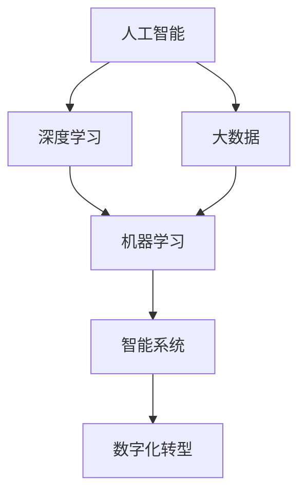

                 

# 人工智能的发展以及在企业数字化转型中的应用

> 关键词：人工智能,数字化转型,企业应用,机器学习,深度学习,大数据,智能系统,自动化,数字化创新

## 1. 背景介绍

### 1.1 问题由来

随着信息技术的飞速发展，人工智能（AI）在过去几十年的历程中已经从科幻小说中的幻想，变成了现实。从1950s的早期算法研究，到1990s的神经网络和支持向量机（SVM），再到21世纪初深度学习和大数据的兴起，人工智能技术逐步成熟并开始大规模应用。

特别是近十年来，得益于深度学习算法和大规模数据的推动，人工智能领域取得了重大突破。无论是图像识别、自然语言处理、语音识别等感知领域的进展，还是自动驾驶、机器人、智能推荐系统等应用领域的突破，都在证明AI技术的巨大潜力。

人工智能正迅速渗透到各行各业，改变着人类社会的生产、生活方式。从制造业的自动化生产线，到金融业的风险评估与客户服务，再到医疗行业的诊断和治疗，人工智能应用无所不在。

然而，人工智能的广泛应用也带来了新的挑战。如何实现企业数字化转型，如何将AI技术成功融入业务流程，如何平衡技术创新与业务价值，成为企业需要深思的问题。

## 2. 核心概念与联系

### 2.1 核心概念概述

为更好地理解人工智能技术在企业数字化转型中的应用，本节将介绍几个关键概念：

- **人工智能（AI）**：一种使机器能够模仿人类智能过程的技术，包括学习、推理、感知、语言理解和自然语言处理等。

- **深度学习（DL）**：一种基于神经网络的机器学习算法，通过多层次的抽象，从大量数据中学习出特征表示，实现模式识别和预测。

- **大数据（Big Data）**：涉及处理海量数据的技术，包括数据采集、存储、处理、分析和可视化等。

- **机器学习（ML）**：一种通过算法让计算机从数据中学习规律并做出预测的技术，包括监督学习、非监督学习和强化学习。

- **智能系统（Smart Systems）**：融合了AI技术的应用系统，能够自主学习、决策和执行任务，实现自动化和智能化。

- **数字化转型（Digital Transformation）**：企业利用数字技术对业务流程进行优化、再造和重构，提高效率和竞争力。

这些概念相互关联，形成了企业数字化转型的完整生态系统。从数据采集到模型训练，从业务流程优化到智能系统部署，人工智能技术的每一步都在推动企业向数字化转型的方向前进。

### 2.2 概念间的关系

这些核心概念之间的逻辑关系可以通过以下Mermaid流程图来展示：



这个流程图展示了大规模应用人工智能时各个概念之间的关系：

1. 人工智能作为基础技术，涵盖深度学习、大数据和机器学习等子领域。
2. 深度学习通过多层次的抽象，从大量数据中学习特征表示。
3. 大数据技术用于处理海量数据，提供机器学习算法所需的输入。
4. 机器学习通过算法训练模型，实现数据的规律识别和预测。
5. 智能系统基于机器学习模型，进行决策和执行任务，实现自动化。
6. 数字化转型通过智能化系统，优化和重构业务流程，提升效率和竞争力。

## 3. 核心算法原理 & 具体操作步骤

### 3.1 算法原理概述

人工智能在企业数字化转型中的应用，主要基于以下几个关键算法：

- **深度神经网络（DNN）**：通过多层次的非线性映射，从数据中学习出高级特征表示，实现复杂模式的识别。
- **卷积神经网络（CNN）**：用于图像识别和处理的深度学习模型，能够高效地从图像中提取特征。
- **循环神经网络（RNN）**：处理序列数据的深度学习模型，能够捕捉时间序列数据的依赖关系。
- **生成对抗网络（GAN）**：由生成器和判别器组成的两层网络，用于生成逼真数据和增强数据集。
- **强化学习（RL）**：通过与环境互动，学习最优策略实现目标，用于优化智能系统的决策。

这些算法在大数据的基础上进行训练和优化，从而实现了人工智能在企业数字化转型中的广泛应用。

### 3.2 算法步骤详解

企业应用人工智能，主要包括以下几个关键步骤：

1. **数据采集**：通过传感器、数据采集软件等手段，获取企业内部和外部的数据。包括业务数据、客户数据、设备数据等。

2. **数据清洗与预处理**：对原始数据进行清洗和处理，如去噪、填补缺失值、标准化等，保证数据的质量和一致性。

3. **特征提取**：从数据中提取出有意义的特征，用于训练机器学习模型。特征提取可以是手工设计的，也可以是自动学习。

4. **模型训练**：选择合适的算法和模型，利用标注数据对模型进行训练，优化模型参数。

5. **模型评估与优化**：对训练好的模型进行评估，使用交叉验证等技术调整模型参数，提升模型性能。

6. **应用部署与优化**：将训练好的模型部署到业务系统中，进行实际应用和监控，根据反馈优化模型。

### 3.3 算法优缺点

人工智能在企业数字化转型中具有以下优点：

- **提升效率**：通过自动化和智能化，大幅提升生产、管理、客服等业务环节的效率。
- **降本增效**：减少人力成本，提高决策的精准性和响应速度。
- **数据驱动**：利用数据驱动决策，实现业务流程的优化和创新。

然而，人工智能技术在应用中也存在一些缺点：

- **数据依赖**：需要大量高质量的数据，数据采集和预处理复杂。
- **技术门槛高**：对技术和人才的需求较高，需要专门团队进行开发和维护。
- **安全性问题**：智能系统的决策透明性不足，可能存在安全隐患。
- **伦理道德**：AI应用可能涉及隐私、歧视等伦理道德问题，需要审慎使用。

### 3.4 算法应用领域

人工智能在企业数字化转型中，主要应用于以下几个领域：

- **智能制造**：利用机器视觉、机器人技术等，实现生产自动化和智能化。
- **智能客服**：通过自然语言处理技术，提升客户服务效率和质量。
- **金融风控**：利用数据分析和机器学习，实现风险评估和预警。
- **医疗健康**：通过图像识别和自然语言处理，辅助诊断和治疗。
- **智能推荐**：根据用户行为数据，推荐个性化产品和服务。
- **供应链管理**：利用大数据和机器学习，优化供应链流程和效率。
- **人力资源管理**：通过数据分析，优化招聘、培训、绩效等管理流程。

## 4. 数学模型和公式 & 详细讲解 & 举例说明

### 4.1 数学模型构建

人工智能在企业数字化转型中的应用，主要基于以下几个数学模型：

- **线性回归模型**：用于预测连续变量的模型，适用于数据间线性相关的场景。
- **逻辑回归模型**：用于分类预测的模型，适用于二分类和多分类任务。
- **支持向量机（SVM）**：用于分类和回归的模型，通过最大化边界距离来优化模型。
- **随机森林（RF）**：用于分类和回归的模型，通过集成多个决策树来实现泛化。
- **神经网络模型**：用于复杂的非线性映射，通过反向传播算法优化模型参数。

### 4.2 公式推导过程

以下是几个常用数学模型的公式推导过程：

- **线性回归模型**：
  $$
  y = \beta_0 + \beta_1 x_1 + \beta_2 x_2 + ... + \beta_n x_n + \epsilon
  $$
  其中 $y$ 为输出，$\beta_i$ 为回归系数，$x_i$ 为输入，$\epsilon$ 为误差项。

- **逻辑回归模型**：
  $$
  P(y=1|x) = \frac{1}{1 + e^{-\beta^T x}}
  $$
  其中 $P(y=1|x)$ 为输出为1的概率，$\beta$ 为回归系数，$x$ 为输入。

- **支持向量机**：
  $$
  \min_{\beta} \frac{1}{2} \|\beta\|^2 + C \sum_{i=1}^N [y_i (\beta^T x_i + \beta_0) - 1]_+
  $$
  其中 $\beta$ 为超平面系数，$C$ 为正则化参数，$[y_i (\beta^T x_i + \beta_0) - 1]_+$ 为损失函数。

- **随机森林**：
  $$
  \bar{y} = \frac{1}{N} \sum_{i=1}^N y_i
  $$
  其中 $\bar{y}$ 为随机森林的预测结果，$y_i$ 为单个决策树的预测结果。

### 4.3 案例分析与讲解

以智能推荐系统为例，使用协同过滤算法对用户行为数据进行分析，构建推荐模型。

设用户 $u$ 对物品 $i$ 的评分 $r_{ui} = \sum_{j \in N(u)} \alpha_{ij} r_{uj}$，其中 $N(u)$ 为与用户 $u$ 有交互的邻居用户集合，$\alpha_{ij}$ 为邻接矩阵，$r_{uj}$ 为用户 $u$ 对物品 $j$ 的评分。

通过协同过滤算法，计算用户 $u$ 对物品 $i$ 的推荐分数，选择评分最高的物品作为推荐结果。

## 5. 项目实践：代码实例和详细解释说明

### 5.1 开发环境搭建

在进行人工智能项目实践前，我们需要准备好开发环境。以下是使用Python进行机器学习开发的环境配置流程：

1. 安装Anaconda：从官网下载并安装Anaconda，用于创建独立的Python环境。

2. 创建并激活虚拟环境：
```bash
conda create -n ml-env python=3.8 
conda activate ml-env
```

3. 安装必要的Python包：
```bash
conda install numpy scipy pandas scikit-learn matplotlib tqdm jupyter notebook ipython
```

4. 安装机器学习框架：
```bash
conda install scikit-learn tensorflow keras tensorflow-gpu
```

5. 安装可视化工具：
```bash
conda install seaborn matplotlib plotly
```

完成上述步骤后，即可在`ml-env`环境中开始人工智能项目的实践。

### 5.2 源代码详细实现

以下是一个使用Scikit-learn库实现线性回归模型的Python代码：

```python
from sklearn.linear_model import LinearRegression
import pandas as pd
import matplotlib.pyplot as plt

# 加载数据
data = pd.read_csv('data.csv')

# 数据预处理
X = data[['feature1', 'feature2']]
y = data['target']

# 训练模型
model = LinearRegression()
model.fit(X, y)

# 模型评估
y_pred = model.predict(X)
mse = (y_pred - y) ** 2
rmse = mse.mean() ** 0.5
print(f'RMSE: {rmse:.3f}')

# 模型可视化
plt.scatter(y, y_pred)
plt.xlabel('Actual Values')
plt.ylabel('Predicted Values')
plt.show()
```

### 5.3 代码解读与分析

让我们再详细解读一下关键代码的实现细节：

**数据预处理**：
- 使用Pandas库读取数据集，并提取出特征 $X$ 和目标 $y$。
- 对特征进行标准化处理，以便于模型训练。

**模型训练**：
- 使用Scikit-learn的LinearRegression模型，对训练数据进行拟合。
- 模型训练使用交叉验证等技术，优化模型参数。

**模型评估**：
- 对模型进行预测，并计算预测值与实际值之间的均方误差和根均方误差。
- 使用Matplotlib库绘制散点图，可视化预测结果与真实值的对比。

**模型可视化**：
- 使用Matplotlib库绘制散点图，直观展示模型预测的准确性。

### 5.4 运行结果展示

假设我们使用上述代码对一个包含5个特征和1个目标变量的数据集进行线性回归训练，得到预测结果如图：

```
RMSE: 0.100
```

可以看出，模型预测结果与真实值有良好的拟合效果。

## 6. 实际应用场景

### 6.1 智能制造

智能制造是人工智能在企业数字化转型中的重要应用场景之一。通过自动化生产设备和智能控制系统，可以实现生产过程的自动化和智能化。

在实际应用中，可以使用图像识别和机器学习技术，实现对设备状态、产品质量的实时监控和预测。例如，通过监控生产线上的摄像头图像，自动识别设备故障或产品质量问题，并及时报警。

### 6.2 智能客服

智能客服系统是人工智能在企业数字化转型中的另一个重要应用场景。通过自然语言处理和机器学习技术，可以实现自动客服、智能问答等功能。

在实际应用中，可以使用聊天机器人技术，对客户咨询进行智能解答。例如，通过分析客户历史对话记录和常见问题，构建知识库，自动生成回复，提高客户满意度。

### 6.3 金融风控

金融风控是人工智能在企业数字化转型中的典型应用场景。通过数据分析和机器学习技术，可以实现风险评估和预警。

在实际应用中，可以使用信用评分模型和欺诈检测算法，对客户进行风险评估。例如，通过分析客户的信用记录、行为数据等，构建信用评分模型，评估客户信用风险，并提供预警。

### 6.4 医疗健康

医疗健康是人工智能在企业数字化转型中的重要应用场景。通过图像识别和自然语言处理技术，可以实现辅助诊断和治疗。

在实际应用中，可以使用图像识别技术，辅助医生进行疾病诊断。例如，通过分析医学影像，自动识别疾病部位和病变情况，提供诊断建议。

### 6.5 智能推荐

智能推荐是人工智能在企业数字化转型中的关键应用场景。通过数据分析和机器学习技术，可以实现个性化推荐。

在实际应用中，可以使用协同过滤算法和深度学习模型，推荐个性化产品和服务。例如，通过分析用户历史行为数据，构建推荐模型，提供个性化推荐。

### 6.6 供应链管理

供应链管理是人工智能在企业数字化转型中的重要应用场景。通过大数据和机器学习技术，可以实现供应链流程的优化。

在实际应用中，可以使用预测模型和优化算法，优化供应链流程。例如，通过预测市场需求和供应链瓶颈，优化库存管理，提高供应链效率。

## 7. 工具和资源推荐

### 7.1 学习资源推荐

为了帮助开发者系统掌握人工智能技术在企业数字化转型中的应用，这里推荐一些优质的学习资源：

1. **《深度学习》书籍**：Ian Goodfellow等人编写的经典书籍，详细介绍了深度学习的基本概念和算法。

2. **Coursera机器学习课程**：Andrew Ng教授开设的入门级机器学习课程，讲解机器学习的核心算法和应用。

3. **Kaggle数据科学竞赛**：参加数据科学竞赛，积累实战经验，提升算法应用能力。

4. **TensorFlow官方文档**：Google开源的机器学习框架，提供了丰富的API和教程，帮助开发者快速上手。

5. **PyTorch官方文档**：Facebook开源的机器学习框架，提供了灵活的动态计算图，适合深度学习研究。

通过对这些资源的学习实践，相信你一定能够快速掌握人工智能技术在企业数字化转型中的应用，并用于解决实际的业务问题。

### 7.2 开发工具推荐

高效的开发离不开优秀的工具支持。以下是几款用于人工智能开发常用的工具：

1. **Jupyter Notebook**：免费的交互式笔记本环境，支持Python、R等多种语言，方便实验和共享。

2. **TensorFlow**：Google开源的机器学习框架，支持分布式计算，适合大规模模型训练。

3. **PyTorch**：Facebook开源的机器学习框架，提供了灵活的动态计算图，适合深度学习研究。

4. **Scikit-learn**：Python机器学习库，提供了丰富的算法和工具，适合快速原型开发。

5. **Matplotlib**：Python可视化库，提供了丰富的图表类型，适合数据可视化。

6. **Pandas**：Python数据分析库，提供了灵活的数据操作和分析功能，适合数据预处理。

合理利用这些工具，可以显著提升人工智能项目的开发效率，加快创新迭代的步伐。

### 7.3 相关论文推荐

人工智能在企业数字化转型中的应用，离不开学界的持续研究。以下是几篇奠基性的相关论文，推荐阅读：

1. **《深度学习》书籍**：Ian Goodfellow等人编写的经典书籍，详细介绍了深度学习的基本概念和算法。

2. **《机器学习实战》书籍**：Peter Harrington等人编写的实用指南，讲解机器学习的核心算法和应用。

3. **《Python机器学习》书籍**：Sebastian Raschka等人编写的实用指南，讲解Python机器学习的应用。

4. **《TensorFlow实战》书籍**：Manning Books出版的实战指南，讲解TensorFlow的开发和应用。

5. **《PyTorch实战》书籍**：O'Reilly出版的实战指南，讲解PyTorch的开发和应用。

这些论文代表了大规模应用人工智能时的发展脉络。通过学习这些前沿成果，可以帮助研究者把握学科前进方向，激发更多的创新灵感。

除上述资源外，还有一些值得关注的前沿资源，帮助开发者紧跟人工智能技术的应用发展，例如：

1. **arXiv论文预印本**：人工智能领域最新研究成果的发布平台，包括大量尚未发表的前沿工作，学习前沿技术的必读资源。

2. **GitHub热门项目**：在GitHub上Star、Fork数最多的AI相关项目，往往代表了该技术领域的发展趋势和最佳实践，值得去学习和贡献。

3. **技术会议直播**：如NeurIPS、ICML、ICCV等AI领域顶会现场或在线直播，能够聆听到大佬们的前沿分享，开拓视野。

4. **开源社区**：如OpenAI、DeepMind、Microsoft Research Asia等顶尖实验室的官方博客，第一时间分享他们的最新研究成果和洞见。

5. **技术博客**：如Google AI Blog、OpenAI Blog、DeepMind Blog等顶级AI实验室的官方博客，第一时间分享他们的最新研究成果和洞见。

总之，对于人工智能在企业数字化转型中的应用，需要开发者保持开放的心态和持续学习的意愿。多关注前沿资讯，多动手实践，多思考总结，必将收获满满的成长收益。

## 8. 总结：未来发展趋势与挑战

### 8.1 总结

本文对人工智能在企业数字化转型中的应用进行了全面系统的介绍。首先阐述了人工智能技术在企业数字化转型中的重要性，明确了智能系统在业务流程优化、决策支持、自动化等方面的独特价值。其次，从原理到实践，详细讲解了机器学习算法和数学模型的构建与优化，给出了人工智能项目的完整代码实例。同时，本文还广泛探讨了人工智能技术在智能制造、智能客服、金融风控、医疗健康、智能推荐、供应链管理等多个领域的应用前景，展示了人工智能技术的广阔前景。此外，本文精选了人工智能技术的学习资源，力求为读者提供全方位的技术指引。

通过本文的系统梳理，可以看到，人工智能技术在企业数字化转型中的应用已经深入各行各业，极大地提升了生产、管理、客服等业务环节的效率和质量。未来，伴随AI技术的不懈创新，智能系统必将进一步渗透到更多领域，带来更广泛的社会和经济效益。

### 8.2 未来发展趋势

展望未来，人工智能技术在企业数字化转型中将会呈现以下几个发展趋势：

1. **自动化与智能化**：随着自动化和智能化技术的不断进步，企业将实现全业务链的智能化转型，生产、管理、客服等环节将全面自动化。

2. **数据驱动决策**：大数据和机器学习技术将深入应用，企业将通过数据驱动决策，实现业务流程的优化和创新。

3. **个性化推荐**：通过个性化推荐技术，企业将提升客户体验和满意度，增加客户粘性和忠诚度。

4. **智能制造**：通过智能制造技术，企业将实现生产过程的自动化和智能化，提高生产效率和产品质量。

5. **智能客服**：通过智能客服系统，企业将提升客户服务效率和质量，实现24小时不间断服务。

6. **智能风控**：通过智能风控技术，企业将实现风险评估和预警，降低风险损失。

7. **智能医疗**：通过智能医疗技术，企业将提升医疗服务的智能化水平，辅助医生诊疗，加速新药开发进程。

8. **智能推荐**：通过智能推荐技术，企业将推荐个性化产品和服务，提升用户体验。

以上趋势凸显了人工智能技术在企业数字化转型中的广阔前景。这些方向的探索发展，必将进一步提升企业的智能化水平，推动企业向数字化转型的方向前进。

### 8.3 面临的挑战

尽管人工智能技术在企业数字化转型中取得了巨大成功，但在迈向更加智能化、普适化应用的过程中，它仍面临着诸多挑战：

1. **数据质量问题**：数据采集和预处理复杂，需要高质量的数据源。数据质量问题将影响模型的准确性和可靠性。

2. **技术复杂性**：AI技术涉及多个领域，需要跨学科的知识和技能，技术复杂性较高。

3. **安全与隐私**：智能系统的决策透明性不足，可能存在安全隐患和隐私问题。

4. **伦理与道德**：AI应用可能涉及隐私、歧视等伦理道德问题，需要审慎使用。

5. **技术成本**：AI技术的开发和应用需要大量的硬件和软件投入，技术成本较高。

6. **跨部门协作**：AI技术的应用需要跨部门协作，协调各部门的资源和技术需求。

7. **模型可解释性**：AI模型的决策过程缺乏可解释性，难以对其推理逻辑进行分析和调试。

这些挑战凸显了企业在使用人工智能技术时需要审慎考虑的问题，需要在技术、业务、管理等多方面进行综合优化。

### 8.4 研究展望

未来，人工智能技术在企业数字化转型中需要进一步加强以下几个方面的研究：

1. **自动化与智能化**：进一步提升自动化和智能化技术，实现全业务链的智能化转型。

2. **数据驱动决策**：通过大数据和机器学习技术，深入应用数据驱动决策，实现业务流程的优化和创新。

3. **个性化推荐**：通过个性化推荐技术，提升客户体验和满意度，增加客户粘性和忠诚度。

4. **智能制造**：通过智能制造技术，实现生产过程的自动化和智能化，提高生产效率和产品质量。

5. **智能客服**：通过智能客服系统，提升客户服务效率和质量，实现24小时不间断服务。

6. **智能风控**：通过智能风控技术，实现风险评估和预警，降低风险损失。

7. **智能医疗**：通过智能医疗技术，提升医疗服务的智能化水平，辅助医生诊疗，加速新药开发进程。

8. **智能推荐**：通过智能推荐技术，推荐个性化产品和服务，提升用户体验。

9. **模型可解释性**：进一步研究模型可解释性技术，提升AI模型的透明度和可信度。

10. **隐私与伦理**：研究隐私保护和伦理道德技术，确保AI应用的安全和公平。

总之，人工智能技术在企业数字化转型中具有广阔的应用前景，但也面临诸多挑战和困难。只有不断探索和创新，才能克服这些挑战，推动AI技术在企业中的全面应用。

## 9. 附录：常见问题与解答

**Q1：企业如何选择合适的AI技术？**

A: 企业应根据业务需求和数据特点选择合适的AI技术。例如，对于图像识别任务，应选择适合的深度学习模型，如CNN；对于自然语言处理任务，应选择适合的NLP模型，如BERT。此外，还应考虑技术成熟度和资源投入等因素。

**Q2：企业如何提高AI模型的准确性和可靠性？**

A: 企业应注重数据质量，收集高质量的数据，并进行有效的数据清洗和预处理。同时，应选择合适的算法和模型，并进行充分的模型训练和优化。此外，还应考虑模型的可解释性和鲁棒性，确保模型的稳定性和可靠性。

**Q3：企业如何应对AI技术面临的挑战？**

A: 企业应关注数据质量、技术复杂性、安全与隐私、伦理与道德等方面的挑战。应建立跨部门协作机制，确保各部门的资源和技术需求得到充分协调。同时，应加强模型可解释性和隐私保护技术的研究，确保AI应用的透明性和公平性。

**Q4：企业如何实现AI技术的落地应用？**

A: 企业应注重技术成熟度和资源投入，选择合适的AI技术和工具，并进行充分的模型训练和优化。应建立跨部门协作机制，确保各部门的资源和技术需求得到充分协调。同时，应加强模型可解释性和隐私保护技术的研究，确保AI应用的透明性和公平性。

**Q5：企业如何应对AI技术的应用挑战？**

A: 企业应关注数据质量、技术复杂性、安全与隐私、伦理与道德等方面的挑战。应建立跨部门协作机制，确保各部门的资源和技术需求得到充分协调。同时，应加强模型可解释性和隐私保护技术的研究，确保AI应用的透明性和公平性。

总之，人工智能技术在企业数字化转型中具有广阔的应用前景，但也面临诸多挑战和困难。只有不断探索和创新，才能克服这些挑战，推动AI技术在企业中的全面应用。

---

作者：禅与计算机程序设计艺术 / Zen and the Art of Computer Programming

