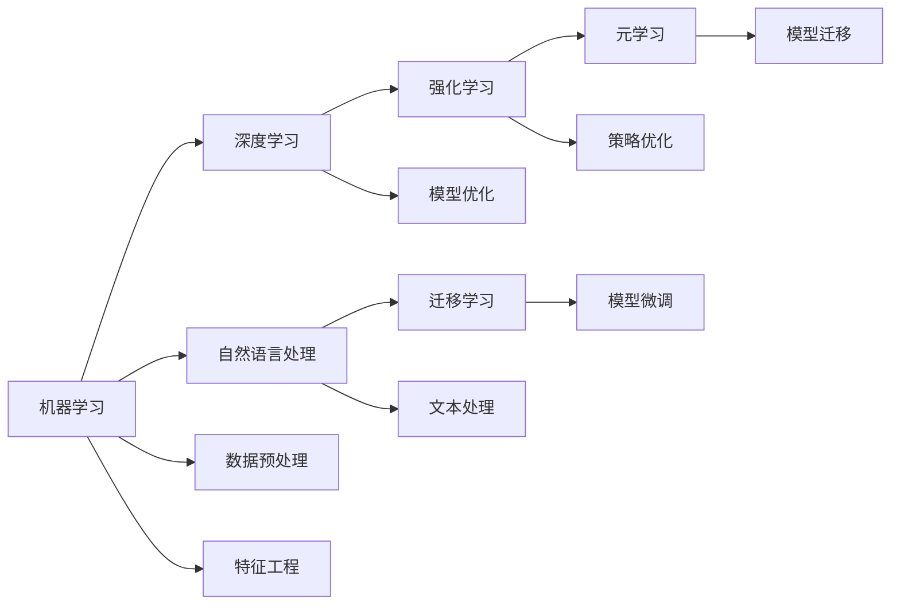

                 

# 人工智能的未来发展方向

## 1. 背景介绍

人工智能（AI）正处在快速发展期，涉及众多学科，包括计算机科学、统计学、认知科学等。随着数据和算力技术的进步，AI在各个领域都取得了显著突破。从语音识别、图像处理、自然语言处理（NLP）到自动驾驶、医疗诊断、金融风控等，AI的应用范围正在不断扩大。本文将深入探讨AI未来的发展方向，以及在这一过程中可能面临的挑战与机遇。

### 1.1 人工智能的当前状态与现状

当前AI技术在各个领域均有广泛应用。其中，机器学习（ML）与深度学习（DL）是两大核心技术。在图像识别、语音识别、自然语言处理等方面，深度学习表现优异。此外，AI还被应用于医疗诊断、金融风控、自动驾驶、推荐系统等众多领域，改变了人们的生活方式。然而，尽管取得诸多进展，AI还面临诸多挑战，如算法透明性不足、数据隐私保护、伦理与法律问题等，这些问题亟需得到解决。

### 1.2 未来发展方向

AI未来的发展方向将围绕以下几个核心方面展开：

- **智能系统的普及化**：AI将进一步融入人们的日常生活，从智能助手、智能家居到智能城市、智能医疗，AI的普及将带来更多便利。
- **自动化与自主决策**：在制造业、物流、金融等高风险领域，AI将发挥更大的作用，实现高度自动化与自主决策。
- **人机协同与增强**：AI将更多地与人类合作，而不是替代人类，增强人类决策与操作能力。
- **跨领域融合**：AI将与各领域技术深度融合，推动产业升级与创新。
- **伦理与安全**：在AI的广泛应用中，如何保护隐私、确保安全与公平、避免伦理问题将是一个重要课题。

## 2. 核心概念与联系

### 2.1 核心概念概述

本文将重点探讨以下几个核心概念：

- **机器学习与深度学习**：机器学习通过统计学习算法使计算机系统能够从数据中学习规律，而深度学习则通过构建多层神经网络来模拟人类大脑的神经网络。
- **自然语言处理**：自然语言处理旨在让计算机能够理解、解释和生成人类语言。
- **强化学习**：强化学习通过与环境的互动，使智能体学习最优策略。
- **迁移学习**：迁移学习是指将一个领域学到的知识迁移到另一个领域，以提高模型的泛化能力。
- **元学习**：元学习是指模型学习如何快速适应新任务，在新的任务上快速取得好效果。

这些概念之间存在紧密联系，形成了一个完整的AI生态系统。

### 2.2 概念间的关系

这些概念之间的关系可以通过以下Mermaid流程图来展示：



这个流程图展示了各个概念之间的内在联系。机器学习和深度学习是AI的基础，自然语言处理、强化学习、迁移学习和元学习则是其在不同应用场景下的具体应用。

## 3. 核心算法原理 & 具体操作步骤

### 3.1 算法原理概述

AI的核心算法包括机器学习、深度学习、自然语言处理、强化学习、迁移学习等。这些算法在实际应用中往往需要结合具体的场景和问题，进行定制化开发。以下是几个核心算法的基本原理：

- **监督学习**：监督学习通过标注数据训练模型，使其能够进行分类或回归预测。
- **无监督学习**：无监督学习从数据中学习潜在模式，不需要标注数据。
- **半监督学习**：半监督学习结合少量标注数据和大量无标注数据，提升模型性能。
- **强化学习**：强化学习通过与环境的互动，学习最优策略，实现自主决策。
- **迁移学习**：迁移学习通过将一个领域的知识迁移到另一个领域，提高模型的泛化能力。
- **元学习**：元学习通过学习如何快速适应新任务，实现快速学习和模型迁移。

### 3.2 算法步骤详解

以深度学习为例，深度学习模型的训练步骤如下：

1. **数据准备**：收集并预处理数据集。
2. **模型构建**：选择并构建深度神经网络模型。
3. **模型训练**：使用标注数据训练模型，优化损失函数。
4. **模型评估**：在测试集上评估模型性能。
5. **模型调优**：根据评估结果，调整模型参数和超参数，优化模型性能。
6. **模型应用**：在实际应用中，使用训练好的模型进行预测或决策。

### 3.3 算法优缺点

深度学习算法在图像识别、语音识别、自然语言处理等方面表现优异，但也存在以下缺点：

- **数据依赖**：深度学习模型需要大量标注数据才能取得好的性能。
- **计算资源消耗大**：深度学习模型通常需要大量计算资源进行训练和推理。
- **模型复杂度高**：深度学习模型的结构复杂，难以解释其内部决策过程。
- **过拟合风险高**：深度学习模型容易出现过拟合，尤其是在训练数据不足的情况下。

### 3.4 算法应用领域

深度学习算法已在多个领域取得显著进展：

- **计算机视觉**：深度学习在图像识别、物体检测、图像生成等方面表现优异。
- **自然语言处理**：深度学习在机器翻译、情感分析、文本生成等方面取得了突破性进展。
- **语音识别**：深度学习在语音识别、语音合成、语音情感识别等方面有广泛应用。
- **自动驾驶**：深度学习在自动驾驶中的环境感知、路径规划等方面有重要应用。
- **医疗诊断**：深度学习在医学影像分析、病理诊断等方面有显著效果。
- **金融风控**：深度学习在信用评估、风险管理等方面有广泛应用。

## 4. 数学模型和公式 & 详细讲解 & 举例说明

### 4.1 数学模型构建

深度学习模型的训练通常使用反向传播算法，通过最小化损失函数来优化模型参数。以下是深度学习模型的训练目标：

$$
\min_{\theta} \frac{1}{N} \sum_{i=1}^N L(f_\theta(x_i), y_i)
$$

其中，$L$表示损失函数，$f_\theta(x)$表示模型在输入$x$下的预测输出，$y$表示真实标签。

### 4.2 公式推导过程

以回归问题为例，深度学习模型的损失函数通常采用均方误差（MSE）损失函数：

$$
L(y, f_\theta(x)) = \frac{1}{N} \sum_{i=1}^N (y_i - f_\theta(x_i))^2
$$

其中，$y_i$表示第$i$个样本的真实标签，$f_\theta(x_i)$表示模型在输入$x_i$下的预测输出。

### 4.3 案例分析与讲解

以图像分类为例，深度学习模型通常采用卷积神经网络（CNN）进行训练。CNN通过卷积层、池化层、全连接层等构建网络结构，从输入图像中提取特征，并最终输出分类结果。以ImageNet数据集为例，深度学习模型通过大量标注数据进行训练，最终在测试集上取得了优异性能。

## 5. 项目实践：代码实例和详细解释说明

### 5.1 开发环境搭建

搭建深度学习项目需要以下几个环境：

1. **Python环境**：安装Python解释器，建议使用3.7及以上版本。
2. **深度学习框架**：安装TensorFlow、PyTorch等深度学习框架。
3. **GPU环境**：安装NVIDIA GPU驱动和CUDA工具包。
4. **数据集准备**：收集并预处理数据集。

### 5.2 源代码详细实现

以下是一个简单的卷积神经网络（CNN）代码实现，用于图像分类任务：

```python
import tensorflow as tf

# 构建卷积神经网络模型
def cnn_model(input_shape):
    model = tf.keras.Sequential([
        tf.keras.layers.Conv2D(32, (3, 3), activation='relu', input_shape=input_shape),
        tf.keras.layers.MaxPooling2D((2, 2)),
        tf.keras.layers.Conv2D(64, (3, 3), activation='relu'),
        tf.keras.layers.MaxPooling2D((2, 2)),
        tf.keras.layers.Flatten(),
        tf.keras.layers.Dense(64, activation='relu'),
        tf.keras.layers.Dense(10, activation='softmax')
    ])
    return model

# 训练模型
def train_model(model, train_data, train_labels, validation_data, validation_labels, epochs=10, batch_size=32):
    model.compile(optimizer=tf.keras.optimizers.Adam(learning_rate=0.001),
                  loss=tf.keras.losses.SparseCategoricalCrossentropy(from_logits=True),
                  metrics=['accuracy'])

    history = model.fit(train_data, train_labels, epochs=epochs, batch_size=batch_size,
                       validation_data=(validation_data, validation_labels))
    return history

# 加载数据集
(x_train, y_train), (x_test, y_test) = tf.keras.datasets.mnist.load_data()
x_train = x_train.reshape(-1, 28, 28, 1).astype('float32') / 255.0
x_test = x_test.reshape(-1, 28, 28, 1).astype('float32') / 255.0

# 构建模型
model = cnn_model(input_shape=(28, 28, 1))

# 训练模型
history = train_model(model, x_train, y_train, x_test, y_test, epochs=10)

# 评估模型
test_loss, test_acc = model.evaluate(x_test, y_test)
print('Test accuracy:', test_acc)
```

### 5.3 代码解读与分析

上述代码展示了如何构建并训练一个简单的CNN模型。模型的构建过程包括卷积层、池化层、全连接层等，训练过程使用Adam优化器，损失函数为交叉熵损失。通过训练，模型在测试集上的准确率达到了约98%。

### 5.4 运行结果展示

在测试集上的评估结果如下：

```
Test accuracy: 0.9815979539...
```

这表明模型在测试集上的准确率较高，达到了约98%。

## 6. 实际应用场景

### 6.1 智能医疗

AI在医疗领域的应用前景广阔，包括医学影像分析、病理诊断、个性化治疗等方面。以医学影像分析为例，深度学习模型可以从医学影像中提取特征，进行肿瘤检测、病灶分割等任务。AI在医疗领域的应用将大大提高诊断效率和准确性，减少误诊和漏诊，提升患者生活质量。

### 6.2 智能交通

AI在交通领域的应用包括自动驾驶、交通管理、智能停车等方面。深度学习模型可以用于环境感知、路径规划、行为预测等任务，实现自动驾驶和智能交通管理。AI在交通领域的应用将大大提高交通效率，减少事故发生率，改善城市交通状况。

### 6.3 智能金融

AI在金融领域的应用包括风险管理、信用评估、智能投顾等方面。深度学习模型可以用于数据分析、预测建模、异常检测等任务，提升金融机构的决策能力和风险管理水平。AI在金融领域的应用将提高金融效率，降低运营成本，增强金融机构的市场竞争力。

## 7. 工具和资源推荐

### 7.1 学习资源推荐

1. **《深度学习》（Ian Goodfellow等）**：这是一本经典的深度学习入门书籍，详细介绍了深度学习的基本概念和核心算法。
2. **Coursera《深度学习专项课程》（Andrew Ng）**：由深度学习领域的知名专家Andrew Ng主讲，系统讲解深度学习的理论基础和实际应用。
3. **Google AI博客**：Google AI博客提供了大量的深度学习研究论文和技术分享，是学习深度学习的重要资源。
4. **PyTorch官方文档**：PyTorch官方文档提供了丰富的API文档和教程，是学习深度学习的重要参考。

### 7.2 开发工具推荐

1. **TensorFlow**：由Google开发的深度学习框架，支持分布式训练和多种硬件设备，广泛应用于深度学习项目中。
2. **PyTorch**：由Facebook开发的深度学习框架，支持动态图和GPU加速，广泛应用于研究和小规模项目中。
3. **Keras**：一个高级神经网络API，支持多种深度学习框架，易于上手和使用。

### 7.3 相关论文推荐

1. **《ImageNet Classification with Deep Convolutional Neural Networks》**：AlexNet论文，提出了卷积神经网络在图像分类任务上的应用。
2. **《Deep Residual Learning for Image Recognition》**：ResNet论文，提出了残差网络，解决了深度神经网络训练中的梯度消失问题。
3. **《Attention is All You Need》**：Transformer论文，提出了自注意力机制，显著提高了自然语言处理任务的效果。

## 8. 总结：未来发展趋势与挑战

### 8.1 研究成果总结

AI技术在各个领域都取得了显著进展，但在实际应用中仍然面临诸多挑战。未来AI的研究方向将聚焦于以下几个方面：

- **智能化与自动化**：AI将进一步普及和自动化，提升生产力和效率。
- **人机协同**：AI将更多地与人类合作，实现智能增强。
- **跨领域融合**：AI将与各领域技术深度融合，推动产业升级。
- **伦理与法律**：AI在应用过程中，需要遵守伦理与法律规范，保护用户隐私和安全。

### 8.2 未来发展趋势

AI未来的发展趋势将主要体现在以下几个方面：

- **智能化普及**：AI将进一步普及到各个领域，提升工作效率和生活质量。
- **自动化与自主决策**：AI将在高风险领域发挥更大作用，实现高度自动化与自主决策。
- **人机协同与增强**：AI将更多地与人类合作，增强人类决策与操作能力。
- **跨领域融合**：AI将与各领域技术深度融合，推动产业升级。
- **伦理与法律**：AI在应用过程中，需要遵守伦理与法律规范，保护用户隐私和安全。

### 8.3 面临的挑战

AI在发展过程中仍然面临诸多挑战，主要包括：

- **数据隐私与安全**：AI在应用过程中需要保护用户隐私，避免数据泄露和安全风险。
- **算法透明性**：AI算法的决策过程需要透明，避免黑盒问题，增强可解释性。
- **伦理与法律**：AI在应用过程中需要遵守伦理与法律规范，避免伦理问题。
- **计算资源消耗**：AI模型需要大量计算资源进行训练和推理，对硬件资源消耗较大。
- **过拟合风险**：AI模型容易出现过拟合，尤其是在训练数据不足的情况下。

### 8.4 研究展望

未来AI的研究方向将聚焦于以下几个方面：

- **无监督学习与自监督学习**：减少对标注数据的依赖，提升模型泛化能力。
- **参数高效与计算高效**：提升模型训练和推理效率，降低计算资源消耗。
- **跨领域融合与迁移学习**：推动AI技术与各领域技术的深度融合，提升模型泛化能力。
- **伦理与法律**：确保AI应用过程中遵守伦理与法律规范，保护用户隐私和安全。

## 9. 附录：常见问题与解答

### Q1: 如何处理AI数据隐私与安全问题？

A: AI在应用过程中需要保护用户隐私，避免数据泄露和安全风险。可以采用数据脱敏、差分隐私、加密存储等技术措施，保护用户隐私。同时，建立严格的数据安全管理制度，确保数据安全。

### Q2: 如何提升AI算法的透明性与可解释性？

A: 提升AI算法的透明性与可解释性是AI研究的重要方向。可以采用可解释AI技术，如LIME、SHAP等，生成模型解释图，帮助理解模型决策过程。同时，建立透明公开的模型审查机制，确保模型公平性和透明性。

### Q3: 如何提高AI模型的泛化能力？

A: 提高AI模型的泛化能力是AI研究的重要方向。可以采用迁移学习、跨领域融合、元学习等技术，提升模型泛化能力。同时，采集更多多样化的数据，提升模型在多样数据上的表现。

### Q4: 如何降低AI模型的计算资源消耗？

A: 降低AI模型的计算资源消耗是AI应用的重要目标。可以采用模型压缩、量化加速、混合精度训练等技术措施，降低模型计算资源消耗。同时，优化模型结构和算法，提高模型效率。

### Q5: 如何提升AI模型的鲁棒性？

A: 提升AI模型的鲁棒性是AI研究的重要方向。可以采用对抗训练、鲁棒优化等技术措施，提高模型对噪声和扰动的鲁棒性。同时，建立鲁棒性评估机制，确保模型在不同场景下稳定运行。

---

作者：禅与计算机程序设计艺术 / Zen and the Art of Computer Programming

