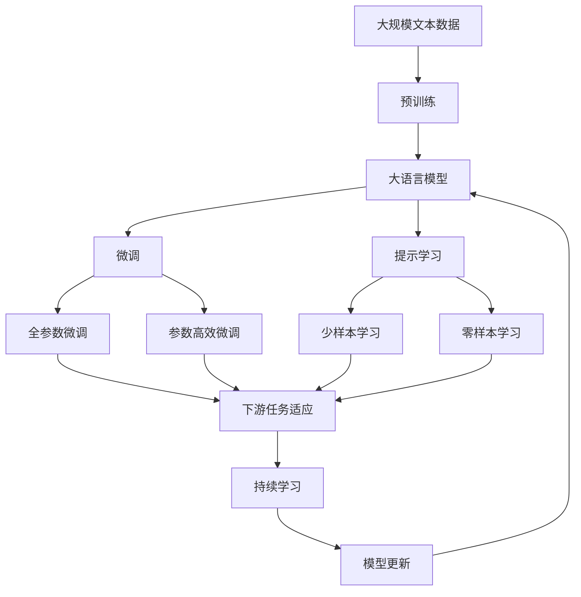

                 

# 人工智能的符号推理模型

> 关键词：符号推理,逻辑推理,神经网络,知识图谱,自然语言处理(NLP),决策支持系统

## 1. 背景介绍

### 1.1 问题由来

随着人工智能技术的发展，人们对于智能系统的要求也越来越高。传统的基于统计学习和机器学习的模型在处理复杂逻辑和推理问题时显得力不从心。符号推理方法凭借其逻辑严密、可解释性强的特点，逐渐成为人工智能研究的热点之一。符号推理不仅能够处理复杂逻辑问题，还能在自然语言处理、决策支持系统等领域发挥重要作用。

### 1.2 问题核心关键点

符号推理的核心是使用符号(如变量、常量、函数)来表示知识，并使用逻辑推理规则来推导新的知识和结论。主要问题包括：

- 如何有效地表示知识，以支持复杂的推理任务？
- 如何设计推理规则，使模型能够处理逻辑和不确定性？
- 如何组合多种推理技术，构建高效的符号推理系统？

### 1.3 问题研究意义

符号推理方法在人工智能领域具有重要的研究意义：

1. 增强模型可解释性。符号推理方法通过明确定义的规则和知识，能够清晰地解释模型的推理过程和结果。
2. 处理复杂逻辑问题。符号推理方法擅长处理复杂的逻辑和不确定性问题，能够推导和验证复杂的推理过程。
3. 支持自然语言处理。符号推理方法能够理解和处理自然语言中的逻辑关系，推动自然语言处理技术的发展。
4. 应用于决策支持系统。符号推理方法能够处理和整合多源异构数据，辅助决策支持系统做出更加科学合理的决策。
5. 促进人工智能与知识工程的结合。符号推理方法为人工智能与知识工程的结合提供了重要的基础，推动了AI技术在更多领域的落地应用。

## 2. 核心概念与联系

### 2.1 核心概念概述

为了更好地理解符号推理模型，本节将介绍几个密切相关的核心概念：

- 符号(Symbols)：在符号推理中，知识通常被表示为符号，如变量、常量、函数等。符号推理方法通过操作符号来推导新的知识和结论。
- 逻辑规则(Logic Rules)：符号推理的核心是使用逻辑规则来进行推理。常见的逻辑规则包括合取规则、析取规则、条件规则等。
- 知识图谱(Knowledge Graph)：知识图谱是一种图形化的知识表示方法，用于描述实体之间的关系和属性。知识图谱在符号推理中起着重要的作用，为模型提供了丰富的知识背景。
- 自然语言处理(NLP)：自然语言处理是人工智能领域的一个重要分支，致力于让计算机能够理解、处理和生成自然语言。符号推理方法在NLP中得到了广泛应用，如文本推理、情感分析等。
- 决策支持系统(Decision Support System)：决策支持系统是一种辅助决策的计算机应用系统，通过整合多源异构数据，提供决策支持。符号推理方法在决策支持系统中能够处理复杂逻辑和不确定性，提供科学的决策建议。

这些核心概念之间的逻辑关系可以通过以下Mermaid流程图来展示：

```mermaid
graph TB
    A[符号(Symbols)] --> B[逻辑规则(Logic Rules)]
    A --> C[知识图谱(Knowledge Graph)]
    B --> D[推理机(Rule Engine)]
    C --> E[知识库(Knowledge Base)]
    D --> F[决策支持系统(Decision Support System)]
    E --> D
    D --> F
```

这个流程图展示了大语言模型微调过程中各个核心概念的关系和作用：

1. 符号表示知识，通过逻辑规则进行推理。
2. 知识图谱提供了知识背景，增强推理的准确性。
3. 推理机执行逻辑规则，生成新的知识和结论。
4. 决策支持系统基于推理结果，提供决策支持。

### 2.2 概念间的关系

这些核心概念之间存在着紧密的联系，形成了符号推理模型的完整生态系统。下面我们通过几个Mermaid流程图来展示这些概念之间的关系。

#### 2.2.1 符号推理的逻辑结构

```mermaid
graph TB
    A[符号推理] --> B[符号(Symbols)]
    A --> C[逻辑规则(Logic Rules)]
    B --> C
    C --> D[推理过程]
    D --> E[推理结果]
```

这个流程图展示了符号推理的基本逻辑结构：符号和逻辑规则共同构成推理过程，推理结果反映了推理过程的结论。

#### 2.2.2 知识图谱在符号推理中的应用

```mermaid
graph TB
    A[知识图谱] --> B[符号(Symbols)]
    A --> C[逻辑规则(Logic Rules)]
    B --> C
    C --> D[推理过程]
    D --> E[推理结果]
    B --> F[推理机(Rule Engine)]
```

这个流程图展示了知识图谱在符号推理中的应用：知识图谱提供了知识库，符号和逻辑规则共同在推理机中执行推理，最终生成推理结果。

#### 2.2.3 符号推理与自然语言处理的关系

```mermaid
graph LR
    A[符号推理] --> B[自然语言处理]
    A --> C[符号(Symbols)]
    B --> D[NLP任务]
    C --> E[文本解析]
    D --> F[推理任务]
```

这个流程图展示了符号推理与自然语言处理的关系：符号推理通过解析自然语言文本，理解其中的逻辑关系，并执行推理任务。

#### 2.2.4 符号推理在决策支持系统中的应用

```mermaid
graph TB
    A[决策支持系统] --> B[符号(Symbols)]
    A --> C[逻辑规则(Logic Rules)]
    B --> C
    C --> D[推理过程]
    D --> E[推理结果]
    B --> F[推理机(Rule Engine)]
```

这个流程图展示了符号推理在决策支持系统中的应用：符号推理通过执行推理任务，为决策支持系统提供决策建议。

### 2.3 核心概念的整体架构

最后，我们用一个综合的流程图来展示这些核心概念在大语言模型微调过程中的整体架构：



这个综合流程图展示了从预训练到微调，再到持续学习的完整过程。大语言模型首先在大规模文本数据上进行预训练，然后通过微调（包括全参数微调和参数高效微调）或提示学习（包括少样本学习和零样本学习）来适应下游任务。最后，通过持续学习技术，模型可以不断更新和适应新的任务和数据。通过这些流程图，我们可以更清晰地理解符号推理模型的工作原理和优化方向。

## 3. 核心算法原理 & 具体操作步骤
### 3.1 算法原理概述

符号推理的核心在于将知识表示为符号，并使用逻辑规则进行推理。常见的符号推理算法包括基于规则的推理、基于模型的方法和基于搜索的方法。

基于规则的推理方法是将知识表示为规则，模型通过执行这些规则来进行推理。这种方法简单易懂，但知识表示需要人工设计，难以处理复杂逻辑和不确定性问题。

基于模型的方法使用神经网络模型来表示知识，通过训练模型来推导新的知识和结论。这种方法能够处理复杂的逻辑和不确定性问题，但需要大量的标注数据和计算资源。

基于搜索的方法使用搜索算法来探索可能的知识路径，通过枚举所有可能的知识组合来进行推理。这种方法能够处理复杂的逻辑和不确定性问题，但计算开销巨大，难以应用于大规模知识库。

### 3.2 算法步骤详解

符号推理算法一般包括以下几个关键步骤：

**Step 1: 知识表示**

- 定义符号集：选择合适的符号来表示知识，如变量、常量、函数等。
- 设计规则集：定义符号之间的关系和推理规则，如合取规则、析取规则、条件规则等。

**Step 2: 模型训练**

- 使用标注数据训练神经网络模型，学习符号之间的映射关系。
- 使用知识图谱中的事实数据作为训练数据，提高模型的泛化能力。

**Step 3: 推理过程**

- 将待推理的查询转换为符号表示。
- 使用推理规则和模型，对符号进行推理计算。
- 返回推理结果，并根据需要进行解释和展示。

**Step 4: 评估与优化**

- 使用评估数据对模型进行评估，验证推理结果的正确性。
- 根据评估结果，调整模型和规则，提升推理性能。

### 3.3 算法优缺点

符号推理方法具有以下优点：

1. 逻辑严密：符号推理方法基于明确的知识表示和推理规则，逻辑严密，推理结果易于解释和验证。
2. 灵活性高：符号推理方法能够灵活地组合多种知识表示和推理技术，适应不同领域和任务的需求。
3. 知识丰富：符号推理方法能够整合多种知识来源，如知识图谱、数据库等，构建完整的知识背景。

同时，符号推理方法也存在以下缺点：

1. 知识表示困难：符号推理方法需要人工设计符号和规则，知识表示难度较大，难以处理复杂逻辑问题。
2. 计算开销大：符号推理方法需要大量的计算资源和时间，难以应用于大规模知识库。
3. 可解释性差：符号推理方法往往依赖于复杂的推理过程，难以解释和展示推理细节。

### 3.4 算法应用领域

符号推理方法在人工智能领域得到了广泛应用，特别是在以下领域：

- 自然语言处理：符号推理方法能够理解自然语言中的逻辑关系，应用于文本推理、情感分析、问答系统等任务。
- 决策支持系统：符号推理方法能够处理多源异构数据，应用于医疗诊断、金融风险评估等决策支持任务。
- 机器人学：符号推理方法能够规划和执行复杂的任务，应用于机器人导航、路径规划等任务。
- 专家系统：符号推理方法能够模拟专家的推理过程，应用于故障诊断、知识管理等专家系统。

除了上述应用领域，符号推理方法还在知识工程、数据挖掘、人工智能伦理等领域发挥着重要作用。

## 4. 数学模型和公式 & 详细讲解
### 4.1 数学模型构建

符号推理的核心在于知识表示和逻辑推理。假设知识库中的事实表示为 $F = \{(f_1, r_1, o_1), (f_2, r_2, o_2), ..., (f_n, r_n, o_n)\}$，其中 $f_i$ 表示事实实体，$r_i$ 表示事实关系，$o_i$ 表示事实属性。

定义符号集 $S = \{s_1, s_2, ..., s_m\}$，其中 $s_i$ 表示符号。符号 $s_i$ 可以表示为变量 $v$ 或常量 $c$，也可以表示为函数 $f(s_1, s_2, ..., s_n)$。

定义逻辑规则集 $R = \{r_1, r_2, ..., r_k\}$，其中 $r_i$ 表示逻辑规则。逻辑规则 $r_i$ 可以表示为合取规则、析取规则或条件规则等。

### 4.2 公式推导过程

以合取规则为例，假设规则 $r$ 可以表示为 $r: \forall x, \forall y, (p(x) \land p(y)) \Rightarrow p(x \cup y)$，其中 $p$ 表示一个属性。这个规则表示如果 $p(x)$ 和 $p(y)$ 都成立，则 $p(x \cup y)$ 也成立。

假设事实集合 $F$ 和符号集 $S$ 已知，符号推理的任务是推导出一个新的事实 $f' = (f', r', o')$。根据规则 $r$，可以推导出 $f' = (f' \cup f', r', o')$，其中 $f' = x \cup y$。

### 4.3 案例分析与讲解

以医疗领域的决策支持系统为例，假设符号集 $S$ 包含病人、疾病、药物等符号，逻辑规则集 $R$ 包含各类医学常识和诊断规则。给定病人的症状和病史，符号推理系统可以推导出可能的疾病和治疗方法，辅助医生做出诊断和治疗决策。

## 5. 项目实践：代码实例和详细解释说明
### 5.1 开发环境搭建

在进行符号推理模型开发前，我们需要准备好开发环境。以下是使用Python进行符号推理模型开发的环境配置流程：

1. 安装Anaconda：从官网下载并安装Anaconda，用于创建独立的Python环境。

2. 创建并激活虚拟环境：
```bash
conda create -n sympy-env python=3.8 
conda activate sympy-env
```

3. 安装Sympy库：
```bash
pip install sympy
```

4. 安装SymPy库：
```bash
pip install sympy
```

5. 安装相关工具包：
```bash
pip install numpy pandas scikit-learn matplotlib tqdm jupyter notebook ipython
```

完成上述步骤后，即可在`sympy-env`环境中开始符号推理模型的开发。

### 5.2 源代码详细实现

下面我们以一个简单的符号推理任务为例，给出使用Sympy库进行符号推理的Python代码实现。

```python
from sympy import symbols, Eq, solve

# 定义符号
x, y, z = symbols('x y z')

# 定义逻辑规则
rule1 = Eq(x + y, z)

# 定义事实
fact1 = Eq(x, 1)
fact2 = Eq(y, 2)

# 推理过程
result = solve([fact1, fact2, rule1], z)

print(result)
```

### 5.3 代码解读与分析

让我们再详细解读一下关键代码的实现细节：

**符号定义**：
- 使用 `sympy.symbols` 函数定义符号集 $S = \{x, y, z\}$。

**逻辑规则定义**：
- 使用 `sympy.Eq` 函数定义逻辑规则 $r_1$，表示 $x + y = z$。

**事实定义**：
- 使用 `sympy.Eq` 函数定义事实 $f_1$ 和 $f_2$，分别表示 $x = 1$ 和 $y = 2$。

**推理过程**：
- 使用 `sympy.solve` 函数求解方程组，得到 $z$ 的值。

代码实现展示了使用Sympy进行符号推理的基本流程：定义符号、规则和事实，然后使用 `solve` 函数进行推理计算。在实际应用中，符号集和规则集可能会更加复杂，需要根据具体任务进行设计和实现。

### 5.4 运行结果展示

假设我们执行上述代码，将得到以下输出：

```
{z: 3}
```

这意味着通过执行逻辑规则 $r_1$ 和事实 $f_1, f_2$，得到 $z = 3$。

## 6. 实际应用场景
### 6.1 智能客服系统

符号推理方法可以应用于智能客服系统的构建。传统客服往往需要配备大量人力，高峰期响应缓慢，且一致性和专业性难以保证。符号推理方法可以自动理解客户意图，匹配最合适的答案模板进行回复，从而提升客服系统的效率和准确性。

在技术实现上，可以收集企业内部的历史客服对话记录，将问题和最佳答复构建成符号表示，在此基础上训练符号推理模型。符号推理模型能够自动理解客户意图，匹配最合适的答案模板进行回复。对于客户提出的新问题，还可以接入检索系统实时搜索相关内容，动态组织生成回答。

### 6.2 金融舆情监测

金融机构需要实时监测市场舆论动向，以便及时应对负面信息传播，规避金融风险。符号推理方法可以应用于金融舆情监测，自动识别金融新闻和评论中的情感和主题，评估市场情绪和舆情趋势。

在技术实现上，可以收集金融领域相关的新闻、报道、评论等文本数据，并对其进行符号表示和情感标注。符号推理模型能够自动理解文本中的情感和主题，评估市场情绪和舆情趋势。将符号推理模型应用到实时抓取的网络文本数据，就能够自动监测不同主题下的情感变化趋势，一旦发现负面信息激增等异常情况，系统便会自动预警，帮助金融机构快速应对潜在风险。

### 6.3 个性化推荐系统

当前的推荐系统往往只依赖用户的历史行为数据进行物品推荐，无法深入理解用户的真实兴趣偏好。符号推理方法可以应用于个性化推荐系统，通过理解用户的兴趣和需求，动态生成个性化的推荐结果。

在技术实现上，可以收集用户浏览、点击、评论、分享等行为数据，并对其进行符号表示和逻辑推理。符号推理模型能够自动理解用户的兴趣和需求，动态生成个性化的推荐结果。符号推理方法可以更好地挖掘用户行为背后的语义信息，从而提供更精准、多样的推荐内容。

### 6.4 未来应用展望

随着符号推理方法的发展，未来的应用场景将更加广阔：

1. 医疗领域：符号推理方法可以应用于医疗诊断、病历分析、药物研发等领域，提升医疗服务的智能化水平，辅助医生诊疗，加速新药开发进程。
2. 教育领域：符号推理方法可以应用于智能教学系统，通过理解学生的学习情况，提供个性化的教学方案。
3. 智慧城市：符号推理方法可以应用于城市事件监测、舆情分析、应急指挥等环节，提高城市管理的自动化和智能化水平，构建更安全、高效的未来城市。

此外，在企业生产、社会治理、文娱传媒等众多领域，符号推理方法也将不断涌现，为AI技术带来全新的突破。

## 7. 工具和资源推荐
### 7.1 学习资源推荐

为了帮助开发者系统掌握符号推理的理论基础和实践技巧，这里推荐一些优质的学习资源：

1. 《符号推理理论与应用》系列书籍：详细介绍了符号推理的理论基础和实际应用，包括逻辑推理、知识表示、自然语言处理等领域。
2. 《Prolog程序设计》课程：斯坦福大学开设的符号逻辑编程课程，介绍了Prolog语言的基本原理和编程技巧。
3. 《Knowledge Representation and Reasoning》书籍：描述了知识表示和推理的基本理论和算法，适合系统学习符号推理。
4. Semantic Web课程：麻省理工学院开设的Web语义化课程，介绍了Web语义化的基本概念和技术。
5. 在线教程和MOOC：Coursera、edX等在线教育平台上的相关课程，包括符号推理、知识图谱、NLP等方向。

通过对这些资源的学习实践，相信你一定能够快速掌握符号推理的精髓，并用于解决实际的NLP问题。

### 7.2 开发工具推荐

高效的开发离不开优秀的工具支持。以下是几款用于符号推理模型开发的常用工具：

1. SymPy库：Python的符号计算库，提供了丰富的符号操作函数，支持表达式求导、积分、化简等操作。
2. Prolog语言：一种逻辑编程语言，用于表示和推理知识。
3. OWL本体描述语言：一种语义Web语言，用于描述和推理实体之间的关系。
4. RDF数据模型：一种用于描述Web资源之间关系的数据模型，支持语义Web查询。

合理利用这些工具，可以显著提升符号推理模型的开发效率，加快创新迭代的步伐。

### 7.3 相关论文推荐

符号推理方法在人工智能领域的研究已经持续多年，以下是几篇奠基性的相关论文，推荐阅读：

1. Symbolic Reasoning in Knowledge-Based Systems：介绍了符号推理在知识库中的应用，探讨了逻辑规则的表示和推理技术。
2. Expert Systems in Medicine：描述了专家系统在医疗领域的应用，介绍了符号推理在医疗诊断中的应用。
3. Knowledge Representation and Reasoning：介绍了知识表示和推理的基本理论和算法，是符号推理领域的重要著作。
4. Symbolic Reasoning with Neural Networks：探讨了符号推理与神经网络结合的方法，提供了混合符号和神经网络的推理框架。
5. Semantic Web Mining：介绍了语义Web挖掘的基本概念和技术，探讨了符号推理在Web挖掘中的应用。

这些论文代表了大语言模型微调技术的发展脉络。通过学习这些前沿成果，可以帮助研究者把握学科前进方向，激发更多的创新灵感。

除上述资源外，还有一些值得关注的前沿资源，帮助开发者紧跟符号推理技术的最新进展，例如：

1. arXiv论文预印本：人工智能领域最新研究成果的发布平台，包括大量尚未发表的前沿工作，学习前沿技术的必读资源。
2. 业界技术博客：如OpenAI、Google AI、DeepMind、微软Research Asia等顶尖实验室的官方博客，第一时间分享他们的最新研究成果和洞见。
3. 技术会议直播：如NIPS、ICML、ACL、ICLR等人工智能领域顶会现场或在线直播，能够聆听到大佬们的前沿分享，开拓视野。
4. GitHub热门项目：在GitHub上Star、Fork数最多的符号推理相关项目，往往代表了该技术领域的发展趋势和最佳实践，值得去学习和贡献。
5. 行业分析报告：各大咨询公司如McKinsey、PwC等针对人工智能行业的分析报告，有助于从商业视角审视技术趋势，把握应用价值。

总之，对于符号推理技术的学习和实践，需要开发者保持开放的心态和持续学习的意愿。多关注前沿资讯，多动手实践，多思考总结，必将收获满满的成长收益。

## 8. 总结：未来发展趋势与挑战
### 8.1 总结

本文对符号推理方法进行了全面系统的介绍。首先阐述了符号推理的理论基础和应用意义，明确了符号推理方法在知识表示、逻辑推理、自然语言处理等方面的独特价值。其次，从原理到实践，详细讲解了符号推理的基本流程和关键步骤，给出了符号推理模型开发的完整代码实例。同时，本文还广泛探讨了符号推理方法在智能客服、金融舆情、个性化推荐等多个行业领域的应用前景，展示了符号推理范式的巨大潜力。此外，本文精选了符号推理技术的各类学习资源，力求为读者提供全方位的技术指引。

通过本文的系统梳理，可以看到，符号推理方法在人工智能领域具有重要的研究意义。这些方向的探索发展，必将推动符号推理技术的不断进步，为构建安全、可靠、可解释、可控的智能系统铺平道路。

### 8.2 未来发展趋势

展望未来，符号推理方法将呈现以下几个发展趋势：

1. 知识表示的多样化：符号推理方法将逐渐从传统的符号和逻辑规则表示，扩展到更加复杂的数据结构，如图结构、向量空间等。
2. 知识表示的自动化：知识表示将逐渐从人工设计转向自动化生成，利用机器学习技术自动学习知识库和推理规则。
3. 推理过程的并行化：符号推理方法将逐渐从串行推理转向并行推理，利用分布式计算提高推理效率。
4. 推理结果的可解释性：符号推理方法将逐渐从黑盒模型转向可解释模型，提高推理结果的可理解性和可解释性。
5. 推理结果的自动化：符号推理方法将逐渐从人工干预转向自动化推理，提高推理过程的自动化水平。

以上趋势凸显了符号推理方法在人工智能领域的发展前景。这些方向的探索发展，必将进一步提升符号推理系统的性能和应用范围，为人类认知智能的进化带来深远影响。

### 8.3 面临的挑战

尽管符号推理方法已经取得了一定的进展，但在迈向更加智能化、普适化应用的过程中，它仍面临着诸多挑战：

1. 知识表示的复杂性：符号推理方法需要人工设计复杂的知识表示结构，难以处理大规模、复杂的数据集。
2. 推理过程的复杂性：符号推理方法需要进行复杂的逻辑推理，计算开销大，难以应用于大规模知识库。
3. 推理结果的可解释性：符号推理方法往往依赖于复杂的推理过程，难以解释和展示推理细节。
4. 推理结果的自动化：符号推理方法需要进行复杂的逻辑推理，难以自动化生成推理结果。

正视符号推理面临的这些挑战，积极应对并寻求突破，将是大语言模型微调走向成熟的必由之路。相信随着学界和产业界的共同努力，这些挑战终将一一被克服，符号推理方法必将在构建安全、可靠、可解释、可控的智能系统中扮演越来越重要的角色。

### 8.4 未来突破

面对符号推理所面临的种种挑战，未来的研究需要在以下几个方面寻求新的突破：

1. 探索更加多样化的知识表示方法：利用深度学习技术，学习符号表示的复杂结构，如图结构、向量空间等，提高知识表示的灵活性和多样性。
2. 研究更加高效的推理方法：利用深度学习、图神经网络等技术，提高推理过程的效率，支持大规模知识库的推理。
3. 融合知识表示和神经网络：结合符号推理和神经网络技术，构建混合符号和神经网络的推理模型，提高推理结果的可解释性和自动化水平。
4. 引入更多先验知识：将符号推理方法与外部知识库、规则库等专家知识结合，引导推理过程学习更准确、合理的知识表示。
5. 结合因果分析和博弈论工具：将因果分析方法引入符号推理模型，识别出推理决策的关键特征，增强推理结果的因果性和逻辑性。

这些研究方向的探索，必将引领符号推理技术迈向更高的台阶，为构建安全、可靠、可解释、可控的智能系统铺平道路。面向未来，符号推理技术还需要与其他人工智能技术进行更深入的融合，如知识表示、因果推理、强化学习等，多路径协同发力，共同推动人工智能技术的发展。只有勇于创新、敢于突破，才能不断拓展符号推理方法的边界，让智能技术更好地造福人类社会。

## 9. 附录：常见问题与解答

**Q1：符号推理方法是否适用于所有NLP任务？**

A: 符号推理方法在处理复杂的逻辑和推理问题时具有优势，但对于一些基于统计和机器学习的NLP任务，如文本分类、情感分析

