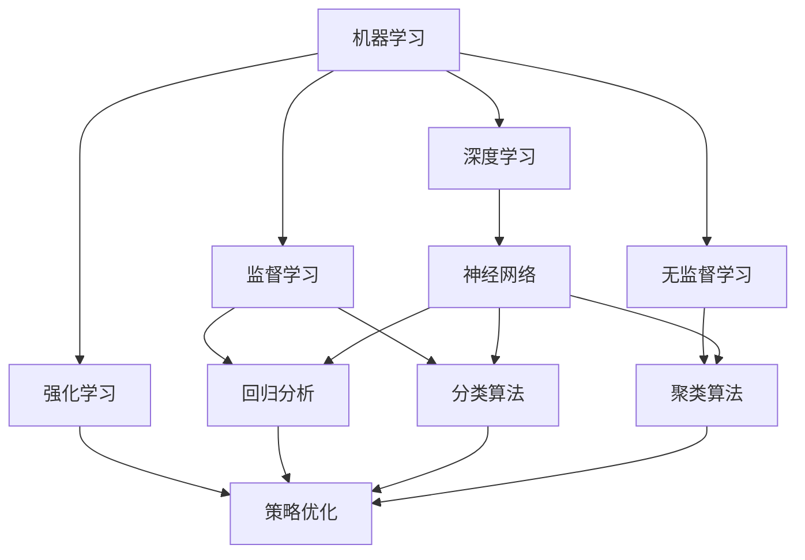
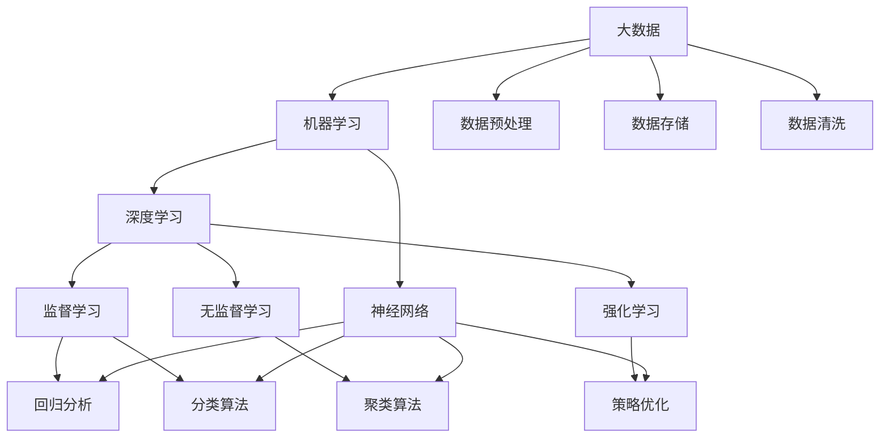

                 

# 人工智能研究的七大领域

## 1. 背景介绍

### 1.1 问题由来

人工智能（AI）作为当前科技领域最前沿的研究方向之一，其研究范围涵盖了多个领域，包括机器学习、自然语言处理、计算机视觉、知识图谱、强化学习、机器人学和认知计算等。这些领域之间相互交织、相互促进，共同构建了人工智能这一复杂的学科体系。

### 1.2 问题核心关键点

人工智能研究的七大领域各自关注的问题不同，但都围绕着如何使计算机具备类似于人类的智能能力这一核心目标展开。本文将从这七个领域的研究内容、核心算法、应用场景以及未来发展趋势等方面进行系统阐述。

### 1.3 问题研究意义

对人工智能研究的七大领域进行深入探讨，对于推动科技发展、改善人类生活、提升生产效率等方面具有重要意义。

1. **推动科技发展**：人工智能研究不断突破技术壁垒，推动计算机科学、数学、神经科学等多学科的交叉融合，为人类认知提供新的视角。
2. **改善人类生活**：通过机器学习、自然语言处理等技术，人工智能可以应用于医疗、教育、交通等领域，提升生活质量，解决人类面临的诸多问题。
3. **提升生产效率**：智能机器人、自动化系统等技术的应用，可以大幅提升工业、农业等生产领域的工作效率和生产力。
4. **促进产业升级**：人工智能技术在金融、零售、制造等行业的应用，推动了传统行业的数字化转型和产业升级。

## 2. 核心概念与联系

### 2.1 核心概念概述

人工智能的七大领域中，每个领域都有其独特的核心概念和技术。以下是各领域的核心概念概述：

- **机器学习（Machine Learning, ML）**：通过数据训练模型，使计算机能够从数据中学习规律并做出预测。核心概念包括监督学习、无监督学习、强化学习、深度学习等。
- **自然语言处理（Natural Language Processing, NLP）**：使计算机能够理解和处理人类语言。核心概念包括分词、词性标注、句法分析、语义理解等。
- **计算机视觉（Computer Vision, CV）**：使计算机能够“看”和“理解”图像和视频。核心概念包括特征提取、目标检测、图像分割、语义分割等。
- **知识图谱（Knowledge Graph, KG）**：构建和应用知识网络，使计算机能够理解和推理复杂的知识结构。核心概念包括实体抽取、关系抽取、知识融合、知识推理等。
- **强化学习（Reinforcement Learning, RL）**：通过与环境交互，使智能体（agent）学会在特定环境下采取最优行动。核心概念包括马尔可夫决策过程、策略优化、奖励函数等。
- **机器人学（Robotics）**：研究如何构建能够自主行动、感知和决策的机器人。核心概念包括运动控制、传感器融合、路径规划、多模态感知等。
- **认知计算（Cognitive Computing）**：模拟人类认知过程，使计算机具备感知、学习、推理等能力。核心概念包括符号推理、联想记忆、认知模型等。

这些核心概念之间存在着密切的联系和相互影响，共同构成了人工智能的研究体系。

### 2.2 概念间的关系

以下通过几个Mermaid流程图来展示这些核心概念之间的关系：

该流程图展示了大数据、深度学习和人工智能之间的关系：

- 大数据为深度学习提供了丰富的数据源，而深度学习是机器学习的重要分支。
- 监督学习、无监督学习和强化学习是机器学习的三个主要分支，分别通过标注数据、未标注数据和交互数据来训练模型。
- 神经网络是深度学习的基本组成单元，负责模拟人脑的神经元连接。
- 回归分析和分类算法是监督学习的具体实现，聚类算法是无监督学习的具体实现，策略优化是强化学习的具体实现。

### 2.3 核心概念的整体架构

最后，用一个综合的流程图来展示这些核心概念在大数据和人工智能领域中的整体架构：

该流程图展示了从大数据到人工智能的整体流程：

- 大数据首先经过数据预处理、清洗和存储，提供训练数据。
- 机器学习包括深度学习、监督学习、无监督学习和强化学习等分支，通过训练数据来构建模型。
- 监督学习中的回归分析和分类算法，无监督学习中的聚类算法，强化学习中的策略优化，都是具体的模型实现方式。
- 神经网络是深度学习的核心组件，负责特征提取和模型构建。

## 3. 核心算法原理 & 具体操作步骤

### 3.1 算法原理概述

人工智能的七大领域中的每个领域都有其独特的算法原理和操作步骤。以下简要介绍各领域的核心算法原理：

- **机器学习**：主要通过监督学习、无监督学习和强化学习三种方式，使计算机能够从数据中学习规律并进行预测。其核心算法包括梯度下降、随机森林、支持向量机等。
- **自然语言处理**：主要通过分词、词性标注、句法分析、语义理解等步骤，使计算机能够理解和处理人类语言。核心算法包括基于规则的方法、统计方法、神经网络方法等。
- **计算机视觉**：主要通过特征提取、目标检测、图像分割、语义分割等步骤，使计算机能够“看”和“理解”图像和视频。核心算法包括卷积神经网络（CNN）、区域提议网络（RPN）、语义分割网络（U-Net）等。
- **知识图谱**：主要通过实体抽取、关系抽取、知识融合、知识推理等步骤，构建和应用知识网络。核心算法包括RDF、OWL、K-Gram等。
- **强化学习**：主要通过与环境交互，使智能体（agent）学会在特定环境下采取最优行动。核心算法包括Q-learning、策略梯度、蒙特卡罗树搜索等。
- **机器人学**：主要通过运动控制、传感器融合、路径规划、多模态感知等步骤，构建能够自主行动、感知和决策的机器人。核心算法包括路径规划算法、SLAM、多模态感知算法等。
- **认知计算**：主要通过符号推理、联想记忆、认知模型等步骤，模拟人类认知过程，使计算机具备感知、学习、推理等能力。核心算法包括Prolog、认知图灵机、联想记忆模型等。

### 3.2 算法步骤详解

以下对各领域中的核心算法进行详细步骤详解：

#### 3.2.1 机器学习

**步骤一**：数据预处理
- 清洗数据：去除缺失值、异常值等。
- 特征工程：提取、选择和转换特征。
- 数据分割：将数据分为训练集、验证集和测试集。

**步骤二**：模型训练
- 选择模型：如线性回归、决策树、神经网络等。
- 设定超参数：如学习率、正则化参数等。
- 模型训练：使用训练集进行模型训练。

**步骤三**：模型评估
- 计算指标：如准确率、召回率、F1分数等。
- 模型调优：根据评估结果调整超参数。

**步骤四**：模型应用
- 使用模型：对新数据进行预测或分类。

#### 3.2.2 自然语言处理

**步骤一**：分词
- 使用分词工具：如jieba、NLTK等。
- 分词规则：如基于规则的分词、基于统计的分词等。

**步骤二**：词性标注
- 使用标注工具：如POS-Tagger、spaCy等。
- 标注方法：如最大熵模型、条件随机场等。

**步骤三**：句法分析
- 使用分析工具：如Stanford Parser、SPARQL等。
- 分析方法：如依存句法分析、统计句法分析等。

**步骤四**：语义理解
- 使用理解工具：如BERT、GPT等。
- 理解方法：如词向量、预训练模型等。

#### 3.2.3 计算机视觉

**步骤一**：图像预处理
- 图像增强：如调整亮度、对比度等。
- 数据增强：如旋转、平移等。

**步骤二**：特征提取
- 使用特征提取器：如SIFT、HOG等。
- 特征融合：如将SIFT、HOG特征融合为CNN的输入。

**步骤三**：目标检测
- 使用检测器：如RCNN、Faster R-CNN等。
- 检测算法：如滑动窗口、区域提议网络等。

**步骤四**：图像分割
- 使用分割器：如U-Net、FCN等。
- 分割算法：如像素级别的分割、区域级别的分割等。

#### 3.2.4 知识图谱

**步骤一**：实体抽取
- 使用抽取工具：如OpenIE、SPARQL等。
- 抽取方法：如基于规则的抽取、基于机器学习的抽取等。

**步骤二**：关系抽取
- 使用抽取工具：如Propon、IE-2等。
- 抽取方法：如基于规则的抽取、基于机器学习的抽取等。

**步骤三**：知识融合
- 使用融合工具：如RDF、OWL等。
- 融合方法：如层次融合、融合图算法等。

**步骤四**：知识推理
- 使用推理工具：如Wikidata、Geonames等。
- 推理方法：如基于规则的推理、基于模型的推理等。

#### 3.2.5 强化学习

**步骤一**：环境建模
- 描述环境：如马尔可夫决策过程等。
- 设计奖励函数：如奖励累积、即时奖励等。

**步骤二**：智能体设计
- 选择智能体：如Q-learning智能体、策略梯度智能体等。
- 设计策略：如贪心策略、蒙特卡罗策略等。

**步骤三**：策略优化
- 使用优化算法：如梯度下降、策略迭代等。
- 优化目标：如最大化累积奖励、最小化策略损失等。

**步骤四**：策略评估
- 评估策略：如蒙特卡罗模拟、Q-learning等。
- 调整策略：根据评估结果调整策略参数。

#### 3.2.6 机器人学

**步骤一**：传感器设计
- 选择传感器：如摄像头、激光雷达等。
- 传感器融合：如多传感器数据融合等。

**步骤二**：路径规划
- 设计路径规划算法：如A*算法、D*算法等。
- 融合感知数据：如基于SLAM的路径规划等。

**步骤三**：运动控制
- 设计控制算法：如PID控制、运动学逆解等。
- 控制策略：如轨迹跟踪、避障策略等。

**步骤四**：多模态感知
- 设计感知算法：如视觉感知、听觉感知等。
- 感知融合：如多模态融合算法等。

#### 3.2.7 认知计算

**步骤一**：符号推理
- 设计推理规则：如Prolog规则。
- 推理算法：如forward chaining、backward chaining等。

**步骤二**：联想记忆
- 设计联想记忆模型：如联想记忆模型。
- 联想记忆算法：如联想记忆算法等。

**步骤三**：认知模型
- 设计认知模型：如认知图灵机模型。
- 认知推理：如认知推理算法等。

### 3.3 算法优缺点

#### 3.3.1 机器学习

**优点**：
- 数据驱动：模型能够从大量数据中学习规律，适应性强。
- 可解释性强：模型通常可以解释其决策过程。

**缺点**：
- 数据依赖：模型性能高度依赖于训练数据的数量和质量。
- 过拟合风险：模型容易在训练集上过拟合，泛化能力不足。

#### 3.3.2 自然语言处理

**优点**：
- 适用性强：可以应用于多种语言处理任务。
- 精度高：自然语言处理技术在理解和生成文本方面精度较高。

**缺点**：
- 数据量大：处理自然语言需要大量的数据。
- 复杂度高：自然语言处理任务往往涉及多层次的语义分析。

#### 3.3.3 计算机视觉

**优点**：
- 直观性强：图像和视频可以直观展示复杂现象。
- 应用广泛：计算机视觉技术在多个领域有广泛应用。

**缺点**：
- 数据量大：图像和视频数据量巨大，处理复杂。
- 计算资源需求高：深度学习模型对计算资源需求较高。

#### 3.3.4 知识图谱

**优点**：
- 结构化强：知识图谱能够构建结构化知识网络。
- 推理能力强：知识图谱能够进行高效的推理和查询。

**缺点**：
- 数据获取难：构建知识图谱需要大量的结构化数据。
- 推理复杂：知识推理过程复杂，需要高度精密的算法。

#### 3.3.5 强化学习

**优点**：
- 自主学习：智能体能够在环境中自主学习最优策略。
- 适应性强：智能体能够适应动态环境变化。

**缺点**：
- 环境建模难：需要准确描述环境模型，才能进行有效学习。
- 奖励设计难：设计合理的奖励函数是强化学习成功的关键。

#### 3.3.6 机器人学

**优点**：
- 自主性高：机器人能够在无人干预下完成复杂任务。
- 可控性强：机器人可以通过远程控制完成特定任务。

**缺点**：
- 硬件复杂：机器人需要复杂的硬件系统支持。
- 传感器限制：传感器性能对机器人性能有很大影响。

#### 3.3.7 认知计算

**优点**：
- 模拟人类思维：认知计算能够模拟人类思维过程。
- 知识共享：认知计算能够共享和传递知识。

**缺点**：
- 数据量要求高：认知计算需要大量的符号数据。
- 计算复杂度高：符号推理和联想记忆过程复杂。

### 3.4 算法应用领域

以下对各领域的主要应用场景进行介绍：

#### 3.4.1 机器学习

**应用场景**：
- 推荐系统：如电商平台推荐商品、音乐平台推荐歌曲等。
- 金融风险预测：如股票价格预测、信用风险评估等。
- 医疗诊断：如疾病诊断、药物研发等。

#### 3.4.2 自然语言处理

**应用场景**：
- 机器翻译：如英中翻译、日中翻译等。
- 情感分析：如用户情感分析、舆情分析等。
- 智能客服：如智能客服系统、智能助手等。

#### 3.4.3 计算机视觉

**应用场景**：
- 图像识别：如面部识别、车辆识别等。
- 医疗影像分析：如病灶检测、手术辅助等。
- 自动驾驶：如道路标识识别、交通信号识别等。

#### 3.4.4 知识图谱

**应用场景**：
- 搜索引擎：如Google、百度等。
- 推荐系统：如Netflix、Amazon等。
- 智能问答：如智能客服系统、智能助手等。

#### 3.4.5 强化学习

**应用场景**：
- 游戏AI：如AlphaGo、Dota2 AI等。
- 自动驾驶：如无人驾驶汽车、无人船等。
- 机器人控制：如工业机器人、服务机器人等。

#### 3.4.6 机器人学

**应用场景**：
- 自动化生产：如工厂自动化、农业自动化等。
- 家庭服务：如扫地机器人、智能家电等。
- 医疗辅助：如手术机器人、护理机器人等。

#### 3.4.7 认知计算

**应用场景**：
- 知识管理：如企业知识管理、学术知识管理等。
- 教育培训：如智能辅导系统、智能测评系统等。
- 法律咨询：如法律智能助理、智能合同等。

## 4. 数学模型和公式 & 详细讲解 & 举例说明

### 4.1 数学模型构建

人工智能的各个领域都需要构建相应的数学模型。以下简要介绍各领域的数学模型构建：

#### 4.1.1 机器学习

**模型构建**：
- 监督学习：$y = f(x; \theta)$，其中 $x$ 为输入，$y$ 为输出，$\theta$ 为模型参数。
- 无监督学习：$y = f(x; \theta)$，其中 $x$ 为输入，$y$ 为输出，$\theta$ 为模型参数。
- 强化学习：$Q(s, a) = r + \gamma \max Q(s', a'); Q(s, a) = f(s, a; \theta)$，其中 $s$ 为状态，$a$ 为动作，$Q$ 为Q值，$r$ 为奖励，$\gamma$ 为折扣因子。

#### 4.1.2 自然语言处理

**模型构建**：
- 分词模型：$P(w_i|w_{i-1})$，其中 $w_i$ 为单词，$P$ 为概率分布。
- 词性标注模型：$P(t_i|w_i)$，其中 $t_i$ 为词性，$P$ 为概率分布。
- 语义理解模型：$P(y|x; \theta)$，其中 $x$ 为输入文本，$y$ 为输出标签，$\theta$ 为模型参数。

#### 4.1.3 计算机视觉

**模型构建**：
- 特征提取模型：$f(x; \theta)$，其中 $x$ 为输入图像，$\theta$ 为模型参数。
- 目标检测模型：$f(x; \theta)$，其中 $x$ 为输入图像，$\theta$ 为模型参数。
- 图像分割模型：$f(x; \theta)$，其中 $x$ 为输入图像，$\theta$ 为模型参数。

#### 4.1.4 知识图谱

**模型构建**：
- 实体抽取模型：$P(e_i|c_j)$，其中 $e_i$ 为实体，$c_j$ 为上下文，$P$ 为概率分布。
- 关系抽取模型：$P(r_i|e_j, e_k)$，其中 $r_i$ 为关系，$e_j$ 和 $e_k$ 为实体，$P$ 为概率分布。
- 知识推理模型：$P(y|e_j, e_k)$，其中 $y$ 为推理结果，$e_j$ 和 $e_k$ 为实体，$P$ 为概率分布。

#### 4.1.5 强化学习

**模型构建**：
- Q值模型：$Q(s, a) = f(s, a; \theta)$，其中 $s$ 为状态，$a$ 为动作，$Q$ 为Q值，$\theta$ 为模型参数。
- 策略模型：$\pi(a|s) = f(s; \theta)$，其中 $\pi$ 为策略，$s$ 为状态，$\theta$ 为模型参数。

#### 4.1.6 机器人学

**模型构建**：
- 路径规划模型：$f(p|s, a)$，其中 $p$ 为路径，$s$ 为状态，$a$ 为动作，$f$ 为路径规划函数。
- 运动控制模型：$f(v|u, t)$，其中 $v$ 为速度，$u$ 为控制输入，$t$ 为时间，$f$ 为运动控制函数。
- 感知模型：$f(s|r)$，其中 $s$ 为感知结果，$r$ 为传感器输入，$f$ 为感知函数。

#### 4.1.7 认知计算

**模型构建**：
- 符号推理模型：$P(y|x, k)$，其中 $x$ 为输入符号，$y$ 为输出符号，$k$ 为知识库，$P$ 为概率分布。
- 联想记忆模型：$f(m|i, t)$，其中 $m$ 为联想记忆，$i$ 为输入，$t$ 为时间，$f$ 为联想记忆函数。
- 认知模型：$P(y|x, k)$，其中 $x$ 为输入，$y$ 为输出，$k$ 为知识库，$P$ 为概率分布。

### 4.2 公式推导过程

#### 4.2.1 机器学习

**公式推导**：
- 梯度下降算法：$\theta = \theta - \eta \nabla_{\theta}L(\theta)$，其中 $\eta$ 为学习率，$L(\theta)$ 为损失函数。
- 随机森林算法：$f(x; \theta) = \sum_{t=1}^{T} \alpha_t f_t(x; \theta_t)$，其中 $f_t$ 为基学习器，$\alpha_t$ 为系数。

#### 4.2.2 自然语言处理

**公式推导**：
- 词向量模型：$P(w_i|w_{i-1}) = \frac{e^{z_i}}{\sum_{j} e^{z_j}}$，其中 $z_i$ 为单词向量，$P$ 为概率分布。
- 神经网络模型：$P(y|x; \theta) = softmax(Wx + b)$，其中 $W$ 为权重矩阵，$b$ 为偏置向量，$softmax$ 为激活函数。

#### 4.2.3 计算机视觉

**公式推导**：
- 卷积神经网络：$C(x; \theta) = \sum_{i} \sum_{j} C_{i,j} x_{i,j}$，其中 $C$ 为卷积函数，$x$ 为输入图像，$\theta$ 为模型参数。
- 目标检测算法：$P(b_i|x)$，其中 $b_i$ 为边界框，$x$ 为输入图像，$P$ 为概率分布。

#### 4.2.4 知识图谱

**公式推导**：
- RDF模型：$P(e_i|c_j) = \frac{e^{z_i}}{\sum_{k} e^{z_k}}$，其中 $e_i$ 为实体，$c_j$ 为上下文，$z_i$ 为实体向量。
- OWL模型：$P(r_i|e_j, e_k) = \frac{e^{z_i}}{\sum_{l} e^{z_l}}$，其中 $r_i$ 为关系，$e_j$ 和 $e_k$ 为实体，$z_i$ 为关系向量。

#### 4.2.5 强化学习

**公式推导**：
- Q值算法：$Q(s, a) = r + \gamma \max_{a'} Q(s', a'); Q(s, a) = W^T A(s, a) + b$，其中 $Q$ 为Q值，$r$ 为奖励，$\gamma$ 为折扣因子，$W$ 为权重矩阵，$A$ 为特征矩阵，$b$ 为偏置向量。
- 策略梯度算法：$\pi(a|s) = \frac{e^{z}}{\sum_{a} e^{z}}$，其中 $z$ 为策略向量。

#### 4.2.6 机器人学

**公式推导**：
- 路径规划算法：$P(p|s, a) = \frac{e^{z_p}}{\sum_{q} e^{z_q}}$，其中 $p$ 为路径，$s$ 为状态，$a$ 为动作，$z_p$ 为路径向量。
- 运动控制算法：$v = f(u, t)$，其中 $v$ 为速度，$u$ 为控制输入，$t$ 为时间，$f$ 为运动控制函数。

#### 4.2.7 认知计算

**公式推导**：
- 符号推理算法：$P(y|x, k) = \frac{e^{z_y}}{\sum_{z} e^{z_z}}$，其中 $y$ 为推理结果，$x$ 为输入符号，$k$ 为知识库，$z_y$ 为推理向量。
- 联想记忆算法：$m = f(i, t)$，其中 $m$ 为联想记忆，$i$ 为输入，$t$ 为时间，$f$ 为联想记忆函数。

### 4

