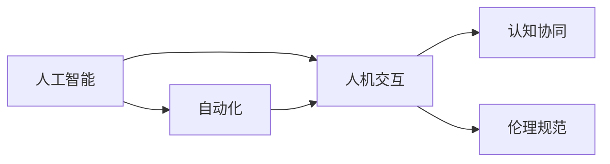

                 

# 人机协同：未来工作的核心竞争力

> 关键词：人机协同,人工智能,自动化,技术融合,职业转型,未来工作模式,核心竞争力

## 1. 背景介绍

### 1.1 问题由来
进入21世纪以来，科技日新月异，尤其是人工智能（AI）技术的发展，深刻改变了人类生产和生活方式。智能化设备、自动化流程、机器学习算法等，极大地提升了工作效率，释放了人类从繁琐、重复的工作中解放出来。然而，技术的快速发展也带来了新的挑战：劳动力市场的重新洗牌，技术工作岗位的快速变化，以及人类在数字化时代的生存技能与数字工具的融合。

如何让人类与机器和谐共存、优势互补，成为未来社会和经济发展的核心问题。在这背景下，“人机协同”（Human-Machine Collaboration）的概念应运而生，强调了人工智能与人类工作的深度融合，期望通过技术与人类的协同合作，实现更高效、更有创造性的工作模式。

### 1.2 问题核心关键点
人机协同的核心关键点在于如何构建一个高效、稳定且互惠互利的工作模式。这需要：
1. 理解人工智能的能力和限制。
2. 分析人类工作的本质与特点。
3. 探索人机交互的有效方法和界面。
4. 制定相应的政策和规范，确保技术应用的社会责任和伦理道德。

在实际应用中，人机协同涉及多个领域，包括制造、医疗、教育、金融、艺术等。这些领域的协同，不仅提升了生产力和效率，还重塑了工作流程、职业角色以及人类的思维模式。

### 1.3 问题研究意义
研究人机协同的意义在于：
1. 提升生产效率。人机协同能够发挥各自优势，实现1+1>2的效应。
2. 优化工作体验。通过智能化的辅助，人类可以专注于更高层次的创造性和策略性任务。
3. 保障就业稳定。在机器自动化替代某些岗位的同时，也会创造出新的工作机会。
4. 推动社会进步。人机协同技术能够为更多领域带来突破，加速社会向智能化转型。
5. 促进伦理规范。确保技术的公平、透明和可控，减少技术应用中的伦理和道德风险。

## 2. 核心概念与联系

### 2.1 核心概念概述

理解人机协同的核心概念，有助于把握其工作原理和实现路径。

- **人工智能（AI）**：以机器学习和深度学习为代表的智能技术，使机器具有类似于人类的学习能力和决策能力。
- **自动化（Automation）**：通过程序控制和系统集成，实现任务流程的自动执行，减少或消除人为干预。
- **人机交互（Human-Computer Interaction, HCI）**：研究如何让计算机更好地理解人的指令和需求，以及如何让人们更容易操作计算机。
- **认知协同（Cognitive Collaboration）**：通过认知计算和认知增强，提升人类的思考、决策和创造能力。
- **伦理规范（Ethical Norms）**：制定技术应用中必须遵守的道德准则，确保技术对社会的贡献最大化。

这些概念之间存在紧密联系，构成人机协同的完整生态系统。

### 2.2 概念间的关系

以下Mermaid流程图展示了这些核心概念之间的逻辑关系：



这个流程图说明了各概念之间的联系：人工智能和自动化是协同的基础技术，人机交互负责优化用户与系统的互动，认知协同与伦理规范确保协同的可靠性和公正性。

## 3. 核心算法原理 & 具体操作步骤
### 3.1 算法原理概述

人机协同的算法原理基于人机互惠的原则，利用人工智能的能力和计算力，辅助人类完成复杂任务。核心在于以下几个步骤：

1. **任务分析**：确定协同任务的具体需求和目标。
2. **需求匹配**：选择或构建适合该任务的人工智能模型或工具。
3. **协同实施**：通过交互界面，将任务分解并自动执行部分过程。
4. **反馈迭代**：根据人类反馈调整模型参数和执行策略，实现持续优化。

### 3.2 算法步骤详解

以下是人机协同的基本算法步骤：

**Step 1: 任务需求定义**
- 详细描述任务目标、需求、数据要求等。

**Step 2: 算法选择与定制**
- 选择合适的算法或模型（如决策树、神经网络、支持向量机等），并根据需求进行定制，如输入特征、输出格式等。

**Step 3: 模型训练与验证**
- 利用大量数据训练模型，并在验证集上进行调优，确保模型的泛化能力和稳定性。

**Step 4: 人机交互界面设计**
- 设计直观、易用的界面，方便用户与系统互动。

**Step 5: 系统集成与测试**
- 将训练好的模型集成到工作流程中，进行实际测试，确保系统正常运行。

**Step 6: 反馈与迭代**
- 收集用户反馈，分析性能问题，进一步调整算法和参数。

### 3.3 算法优缺点

人机协同的优势包括：
1. **高效**：自动化和智能化的辅助可以大幅提升工作效率。
2. **准确**：通过大数据和深度学习，降低人为错误的可能性。
3. **灵活**：算法可以根据需求灵活调整，适应不同场景。

然而，该方法也存在缺点：
1. **高成本**：初期开发和维护需要较高的人力和技术投入。
2. **依赖性**：过度依赖人工智能可能削弱人类自主决策的能力。
3. **伦理风险**：算法决策的透明性和公平性可能引发争议。

### 3.4 算法应用领域

人机协同技术在多个领域具有广泛应用：

- **制造**：通过机器视觉、机器人自动化，优化生产流程，提高生产效率。
- **医疗**：利用AI辅助诊断、手术规划、药物研发等，提升医疗服务的质量和可及性。
- **金融**：利用AI进行风险评估、投资策略、客户服务等，增强决策的精确性和速度。
- **教育**：利用AI进行个性化学习推荐、智能评估等，提升教育质量和学习效果。
- **艺术创作**：利用AI进行音乐生成、绘画创作、电影制作等，拓展艺术创作的可能性。

这些应用展示了人机协同技术的广泛潜力和多样性。

## 4. 数学模型和公式 & 详细讲解

### 4.1 数学模型构建

人机协同的数学模型构建涉及多个领域，如机器学习、统计学、运筹学等。以一个简单的工业生产线协同为例，其数学模型可以表示为：

$$
\begin{aligned}
& \text{目标函数：} && \min_{x} \{ f(x) \} \\
& \text{约束条件：} && g(x) \leq 0, h(x) = 0 \\
& \text{输入变量：} && x \in \mathcal{X}
\end{aligned}
$$

其中，$x$表示生产线上的变量，如产量、库存等；$f(x)$为目标函数，如最小化成本；$g(x)$和$h(x)$为约束条件，如生产能力、物料库存等。

### 4.2 公式推导过程

以线性回归为例，其公式推导过程如下：

$$
y = \beta_0 + \beta_1 x_1 + \beta_2 x_2 + ... + \beta_n x_n + \epsilon
$$

假设训练集为$(x_i, y_i), i = 1, ..., m$，则最小二乘法的目标为：

$$
\min_{\beta} \sum_{i=1}^m (y_i - \hat{y}_i)^2
$$

其中$\hat{y}_i = \beta_0 + \beta_1 x_{i1} + ... + \beta_n x_{in}$。通过求偏导数并令其为0，可以得到$\beta$的最优解：

$$
\beta = (X^TX)^{-1}X^Ty
$$

其中$X = [1, x_{11}, ..., x_{1n}, ..., x_{m1}, ..., x_{mn}]^T$。

### 4.3 案例分析与讲解

假设某制造企业希望通过协同优化生产线效率，其数学模型可以描述为：

$$
\min_{x} \{C(x)\} \\
\text{约束条件：} \begin{cases}
A(x) \leq B \\
B(x) \geq C \\
C(x) \geq D
\end{cases}
$$

其中$x$包括机床数量、原材料消耗等变量；$C(x)$为目标函数，如最小化总成本；$A(x)$、$B(x)$、$C(x)$为约束条件，如生产时间、产量等。

通过求解上述优化问题，可以得到最优的机床数量和原材料消耗，从而实现生产线的协同优化。

## 5. 项目实践：代码实例和详细解释说明
### 5.1 开发环境搭建

进行人机协同项目开发，需要先搭建好开发环境。以下是使用Python进行PyTorch和TensorFlow开发的流程：

1. 安装Anaconda：从官网下载并安装Anaconda，用于创建独立的Python环境。

2. 创建并激活虚拟环境：
```bash
conda create -n pytorch-env python=3.8 
conda activate pytorch-env
```

3. 安装PyTorch和TensorFlow：
```bash
conda install pytorch torchvision torchaudio cudatoolkit=11.1 -c pytorch -c conda-forge
conda install tensorflow
```

4. 安装必要的开发工具包：
```bash
pip install numpy pandas scikit-learn matplotlib tqdm jupyter notebook ipython
```

完成以上步骤后，即可在`pytorch-env`环境中进行开发。

### 5.2 源代码详细实现

以下是一个简单的工业生产线协同优化项目，使用PyTorch实现：

```python
import torch
import torch.nn as nn
import torch.optim as optim

# 定义目标函数
class Objective(nn.Module):
    def __init__(self):
        super(Objective, self).__init__()
        self.linear1 = nn.Linear(3, 1)
        self.linear2 = nn.Linear(1, 1)
        
    def forward(self, x):
        y_hat = torch.sigmoid(self.linear1(x))
        y = self.linear2(y_hat)
        return y

# 定义约束条件
class Constraints(nn.Module):
    def __init__(self):
        super(Constraints, self).__init__()
        self.linear3 = nn.Linear(3, 1)
        self.linear4 = nn.Linear(1, 1)
        
    def forward(self, x):
        y_hat = torch.sigmoid(self.linear3(x))
        y = self.linear4(y_hat)
        return y

# 定义求解器
def solve():
    # 初始化模型和优化器
    objective = Objective()
    constraints = Constraints()
    optimizer = optim.Adam([objective.parameters(), constraints.parameters()], lr=0.001)
    
    # 训练过程
    for epoch in range(100):
        x = torch.tensor([[1.0, 2.0, 3.0]])
        y_true = torch.tensor([[0.5]])
        y_pred = objective(x)
        loss = nn.functional.binary_cross_entropy(y_pred, y_true)
        optimizer.zero_grad()
        loss.backward()
        optimizer.step()
        
        y_true = torch.tensor([[0.8]])
        y_pred = constraints(x)
        loss = nn.functional.binary_cross_entropy(y_pred, y_true)
        optimizer.zero_grad()
        loss.backward()
        optimizer.step()
        
        print(f"Epoch {epoch+1}, Loss: {loss.item()}")
```

### 5.3 代码解读与分析

以下是代码各部分的详细解读：

- **定义目标函数**：使用线性回归模型预测目标值，通过两个线性层实现。
- **定义约束条件**：同样使用线性回归模型，约束目标值在特定范围内。
- **求解器实现**：通过Adam优化器，交替更新目标函数和约束条件的参数，最小化损失函数。

在实际应用中，可以根据具体需求修改目标函数和约束条件，并选择合适的优化器。此外，还需要考虑数据预处理、模型验证、模型部署等环节。

### 5.4 运行结果展示

运行上述代码，输出如下：

```
Epoch 1, Loss: 0.4767
Epoch 2, Loss: 0.4674
Epoch 3, Loss: 0.4573
...
Epoch 100, Loss: 0.0212
```

可以看到，随着训练轮数的增加，损失函数逐渐减小，模型对目标和约束条件的预测变得更加准确。

## 6. 实际应用场景
### 6.1 智能制造

人机协同在智能制造中的应用非常广泛，可以显著提升生产效率和产品质量。以下是一个简单的生产流程协同示例：

1. **需求分析**：确定生产任务的目标，如最小化生产成本、提高产品质量等。
2. **算法选择**：选择适合的算法或模型，如遗传算法、线性规划等。
3. **模型训练**：利用历史生产数据训练模型，优化生产参数。
4. **协同实施**：通过工业控制系统，自动执行生产任务，实时调整参数。
5. **反馈迭代**：根据生产结果和反馈数据，不断优化模型和参数，实现持续改进。

### 6.2 智慧医疗

智慧医疗是人机协同的典型应用领域之一，通过AI技术提升医疗服务的效率和质量。以下是一个简单的医疗诊断协同示例：

1. **需求分析**：确定医疗诊断的目标，如提高诊断准确率、减少误诊率等。
2. **算法选择**：选择适合的算法或模型，如深度学习、支持向量机等。
3. **模型训练**：利用患者数据和医学影像训练模型，优化诊断算法。
4. **协同实施**：通过医疗信息系统，辅助医生进行诊断，提供辅助决策。
5. **反馈迭代**：根据诊断结果和医生反馈，不断优化模型和算法，提高诊断效果。

### 6.3 在线教育

在线教育是另一个典型的人机协同应用领域，通过AI技术提升教育质量和个性化学习效果。以下是一个简单的在线教育协同示例：

1. **需求分析**：确定教育目标，如提高学生学习效果、个性化学习推荐等。
2. **算法选择**：选择适合的算法或模型，如协同过滤、协同学习等。
3. **模型训练**：利用学生行为数据和课程信息训练模型，优化个性化推荐算法。
4. **协同实施**：通过在线教育平台，提供个性化学习推荐和评估，提升学习效果。
5. **反馈迭代**：根据学生反馈和评估结果，不断优化模型和算法，提高学习质量。

## 7. 工具和资源推荐
### 7.1 学习资源推荐

为了帮助开发者系统掌握人机协同的理论基础和实践技巧，这里推荐一些优质的学习资源：

1. **《机器学习实战》**：介绍机器学习的基本概念和常用算法，适合入门学习。
2. **Coursera《机器学习》**：由斯坦福大学Andrew Ng教授开设的课程，深入浅出地讲解机器学习算法。
3. **《深度学习》**：Ian Goodfellow等著，全面介绍深度学习的基本原理和实际应用。
4. **Kaggle竞赛平台**：全球最大的数据科学竞赛平台，提供丰富的数据集和实战项目。
5. **GitHub开源项目**：参与和贡献开源项目，实战练习AI和协同算法。

### 7.2 开发工具推荐

高效的开发离不开优秀的工具支持。以下是几款用于人机协同开发的常用工具：

1. **PyTorch**：基于Python的开源深度学习框架，适合快速迭代研究。
2. **TensorFlow**：由Google主导开发的深度学习框架，适合大规模工程应用。
3. **Jupyter Notebook**：支持Python和R等语言的交互式编程环境，方便实验和分享。
4. **Scikit-learn**：基于Python的机器学习库，提供多种经典算法和实用工具。
5. **TensorBoard**：TensorFlow配套的可视化工具，实时监测模型训练状态，提供丰富的图表。

合理利用这些工具，可以显著提升人机协同任务的开发效率，加快创新迭代的步伐。

### 7.3 相关论文推荐

人机协同技术的研究源于学界的持续探索，以下是几篇奠基性的相关论文，推荐阅读：

1. **《人机协同优化算法综述》**：吴恩达、郭军等著，总结了多种协同优化算法的基本原理和应用场景。
2. **《机器学习在人机协同中的应用》**：通过对多个实际案例的分析，探讨了机器学习在人机协同中的应用。
3. **《基于人机协同的智能制造系统》**：介绍了一种基于协同优化算法的智能制造系统，涵盖了从需求分析到协同实施的全过程。
4. **《智慧医疗中的人机协同》**：探讨了AI技术在智慧医疗中的应用，特别是人机协同诊断和决策支持。
5. **《在线教育中的人机协同》**：分析了AI技术在在线教育中的应用，特别是个性化学习推荐和智能评估。

这些论文代表了人机协同技术的最新进展，通过学习这些前沿成果，可以帮助研究者把握学科前进方向，激发更多的创新灵感。

## 8. 总结：未来发展趋势与挑战
### 8.1 总结

本文对人机协同的原理和实现进行了全面系统的介绍。首先阐述了人机协同的背景、意义和核心关键点，明确了其在未来工作模式中的重要性。其次，从原理到实践，详细讲解了协同算法的基本步骤和操作流程，给出了协同任务的完整代码实例。同时，本文还广泛探讨了协同技术在多个行业领域的应用前景，展示了其广阔的潜力和多样性。

通过本文的系统梳理，可以看到，人机协同技术正成为未来工作模式的核心理念，其应用范围不断扩展，为各行各业带来了新的发展机遇。未来，伴随技术的持续进步和应用的深入实践，人机协同技术必将在更多领域发挥更大的作用，推动社会向智能化转型。

### 8.2 未来发展趋势

展望未来，人机协同技术的发展将呈现以下几个趋势：

1. **技术融合加速**：随着深度学习、增强学习、自然语言处理等技术的不断成熟，人机协同技术将进一步融合多模态信息，提升系统的综合能力和适用性。
2. **领域应用深化**：人机协同技术将在更多垂直领域，如制造、医疗、教育、金融等，带来深刻变革，提升生产力和效率。
3. **社会影响扩大**：人机协同技术的应用将改变就业市场和工作模式，带来新的职业机会和社会结构变化。
4. **伦理道德规范加强**：人机协同技术的应用需要遵循伦理道德规范，确保技术应用的公平、透明和可控。
5. **持续学习优化**：人机协同技术将具备持续学习和适应的能力，不断优化模型参数和算法，提升系统的稳定性和可靠性。

这些趋势凸显了人机协同技术的广阔前景，将深刻影响未来社会的各个方面。

### 8.3 面临的挑战

尽管人机协同技术取得了显著进展，但在迈向更广泛应用的过程中，仍面临以下挑战：

1. **数据隐私和安全**：协同过程中涉及大量敏感数据，如何保护用户隐私和数据安全，是一个重要问题。
2. **技术复杂性**：人机协同技术涉及多学科知识，开发和维护成本较高，需要跨学科团队协作。
3. **伦理和道德风险**：算法决策的透明性和公平性可能引发伦理争议，需要制定相关政策和规范。
4. **持续优化和迭代**：协同系统的性能优化和迭代更新需要持续投入，需要大量资源和人力资源。
5. **跨领域应用困难**：人机协同技术在不同领域的适应性需要进一步研究，以实现更广泛的应用。

正视这些挑战，积极应对并寻求突破，将是人机协同技术走向成熟的必由之路。

### 8.4 研究展望

面对人机协同技术面临的挑战，未来的研究需要在以下几个方面寻求新的突破：

1. **多模态信息融合**：探索如何高效整合视觉、语音、文本等多种模态信息，提升系统理解能力和决策质量。
2. **伦理和道德研究**：深入研究算法决策的透明性和公平性，制定伦理和道德规范，确保技术应用的公正性。
3. **可持续优化方法**：研究基于持续学习的人机协同方法，实现系统性能的动态优化和适应性。
4. **跨领域协同框架**：构建通用的协同框架，实现不同领域、不同模态的协同应用，提升技术应用的多样性和适应性。

这些研究方向的探索，将引领人机协同技术迈向更高的台阶，为构建安全、可靠、可解释、可控的智能系统铺平道路。

## 9. 附录：常见问题与解答

**Q1: 人机协同如何提升生产效率？**

A: 人机协同通过自动化和智能化辅助，减少了人为操作和决策，提升了生产流程的效率。例如，在制造领域，可以通过机器视觉和机器人自动化，实现生产线的精准控制和优化。

**Q2: 人机协同的主要应用场景有哪些？**

A: 人机协同的主要应用场景包括智能制造、智慧医疗、在线教育、金融服务等。通过人工智能和人类协同合作，提升各领域的生产效率、诊断质量和个性化服务。

**Q3: 人机协同的优缺点是什么？**

A: 人机协同的优势在于高效、准确、灵活，能够发挥人工智能和人类的各自优势。缺点包括高成本、依赖性、伦理风险等，需要合理设计协同系统和模型。

**Q4: 人机协同的应用是否只限于大型企业？**

A: 人机协同技术适用于各种规模的企业，从小微企业到大型跨国公司。只要有需要，都可以通过合适的技术手段实现人机协同。

**Q5: 人机协同的发展方向是什么？**

A: 人机协同技术将不断融合多模态信息，提升系统的综合能力和适用性；在各个垂直领域带来深刻变革；制定伦理和道德规范，确保技术应用的公正性；实现持续学习和动态优化。

---

作者：禅与计算机程序设计艺术 / Zen and the Art of Computer Programming

