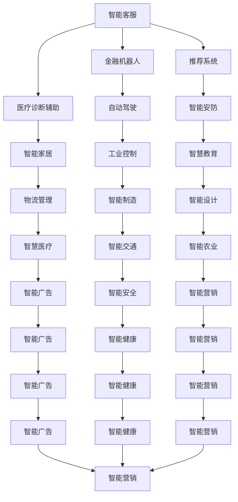

                 

# 从RAG到Agent的转变：工具接口：与外部环境进行交互，使用工具来辅助任务执行

> 关键词：自然语言生成(NLG)、自主代理(Agent)、交互式代理(Interactive Agent)、多模态交互、API调用、微服务架构、Kubernetes

## 1. 背景介绍

### 1.1 问题由来

随着人工智能技术的迅速发展，智能代理(Agent)和交互式代理(Interactive Agent)在多个领域得到了广泛应用。例如，智能客服、金融机器人、智能推荐系统、医疗诊断辅助系统等，这些系统能够与人类用户进行自然语言交互，提供定制化的服务。然而，构建高效、智能的代理系统需要大量的数据、模型和算法资源，这使得开发成本和维护难度较高。

为了解决这些问题，自然语言生成(NLG)技术被广泛应用于交互式代理中。NLG技术可以将结构化数据转换为自然语言文本，使其更易于理解和使用。但这种技术依然存在瓶颈，如数据隐私、语义理解、上下文管理等问题，限制了其在实际场景中的应用。

### 1.2 问题核心关键点

1. **数据隐私和安全**：交互式代理通常需要处理敏感数据，如何保证数据隐私和安全是一个重要问题。
2. **语义理解**：代理需要理解用户意图，能够处理复杂的自然语言，如多义词、歧义句等。
3. **上下文管理**：交互式代理需要在长对话中保持语境连贯，避免信息丢失和误解。
4. **自然语言生成**：代理需要生成自然流畅的文本响应，使用户感到自然和可接受。
5. **可扩展性和可维护性**：代理系统需要易于扩展和维护，支持跨平台、多语言、多任务等需求。

### 1.3 问题研究意义

交互式代理技术在构建人机交互系统、提升用户体验、优化资源配置等方面具有重要意义：

1. **提升用户体验**：通过与用户进行自然语言交互，代理能够提供更加便捷、高效、人性化的服务，提升用户满意度。
2. **优化资源配置**：代理可以实时监控系统状态，根据用户需求动态调整资源配置，优化系统性能。
3. **支持跨平台和跨语言**：代理系统能够跨不同平台和语言提供服务，打破语言和设备障碍，实现全球化部署。
4. **支持多任务处理**：代理可以同时处理多个任务，提高工作效率，降低人工成本。
5. **支持复杂问题解决**：代理能够处理复杂问题，提供个性化的解决方案，帮助用户更好地应对实际需求。

## 2. 核心概念与联系

### 2.1 核心概念概述

为更好地理解交互式代理的构建过程，本节将介绍几个密切相关的核心概念：

- **自然语言生成(NLG)**：将结构化数据转换为自然语言文本的技术，使得代理能够理解用户意图并生成自然流畅的回复。
- **自主代理(Agent)**：具有自主决策能力的智能系统，能够与外部环境进行交互，完成任务或服务用户。
- **交互式代理(Interactive Agent)**：一种特殊的自主代理，能够与用户进行自然语言交互，提供定制化的服务。
- **多模态交互**：结合文本、语音、图像等多种模态数据进行交互的技术，提高代理系统的感知能力。
- **API调用**：代理系统与其他服务进行通信的基础方式，通常通过HTTP请求实现。
- **微服务架构**：将代理系统拆分为多个微服务模块，每个模块独立运行、管理，提高系统的可扩展性和可维护性。
- **Kubernetes**：开源的容器编排工具，能够管理多个微服务模块的部署、扩展、调度等任务，提高系统的自动化和可靠性。

这些核心概念之间的逻辑关系可以通过以下Mermaid流程图来展示：

```mermaid
graph TB
    A[自然语言生成(NLG)] --> B[自主代理(Agent)]
    A --> C[交互式代理(Interactive Agent)]
    B --> D[多模态交互]
    C --> E[API调用]
    C --> F[微服务架构]
    F --> G[Kubernetes]
```

这个流程图展示了大语言模型微调过程中各个核心概念的关系和作用：

1. **自然语言生成(NLG)**：作为交互式代理的核心技术，NLG能够将结构化数据转换为自然语言文本。
2. **自主代理(Agent)**：作为交互式代理的基础架构，能够自主决策并执行任务。
3. **交互式代理(Interactive Agent)**：结合自然语言生成和自主代理的技术，能够与用户进行自然语言交互。
4. **多模态交互**：通过结合多种模态数据，提高交互式代理的感知能力。
5. **API调用**：作为交互式代理与其他服务通信的基础，实现数据的交换和共享。
6. **微服务架构**：通过拆分代理系统为多个微服务模块，提高系统的可扩展性和可维护性。
7. **Kubernetes**：作为微服务架构的管理工具，实现系统的自动化和可靠性。

这些概念共同构成了交互式代理的完整生态系统，使其能够在各种场景下发挥强大的智能交互能力。通过理解这些核心概念，我们可以更好地把握交互式代理的工作原理和优化方向。

### 2.2 概念间的关系

这些核心概念之间存在着紧密的联系，形成了交互式代理系统的完整架构。下面我通过几个Mermaid流程图来展示这些概念之间的关系。

#### 2.2.1 交互式代理的构建流程

```mermaid
graph LR
    A[需求分析] --> B[系统设计]
    B --> C[自然语言生成(NLG)]
    B --> D[多模态交互]
    C --> E[自主代理(Agent)]
    D --> E
    E --> F[API调用]
    E --> G[微服务架构]
    G --> H[Kubernetes]
```

这个流程图展示了交互式代理系统的构建流程：

1. **需求分析**：确定系统需求和功能要求。
2. **系统设计**：设计系统的架构和组件。
3. **自然语言生成(NLG)**：将结构化数据转换为自然语言文本。
4. **多模态交互**：结合多种模态数据进行交互。
5. **自主代理(Agent)**：实现自主决策和执行任务。
6. **API调用**：与其他服务通信，实现数据的交换和共享。
7. **微服务架构**：将代理系统拆分为多个微服务模块。
8. **Kubernetes**：管理多个微服务模块的部署、扩展、调度等任务。

#### 2.2.2 交互式代理的应用场景



这个流程图展示了交互式代理在不同场景中的应用：

1. **智能客服**：自动回答用户问题，提供个性化服务。
2. **金融机器人**：提供金融咨询、风险评估等服务。
3. **推荐系统**：根据用户行为推荐产品或内容。
4. **医疗诊断辅助**：辅助医生进行诊断，提供病例分析服务。
5. **自动驾驶**：辅助驾驶员进行决策和控制。
6. **智能安防**：实时监控和报警。
7. **智能家居**：提供家电控制、场景设置等服务。
8. **智慧教育**：提供个性化教育、自动评分等服务。
9. **物流管理**：优化运输路线和货物管理。
10. **智能制造**：辅助生产计划和质量控制。
11. **智能设计**：辅助产品设计和工艺优化。
12. **智能广告**：根据用户行为精准投放广告。
13. **智能安全**：实时监测和预警安全威胁。
14. **智能营销**：进行市场分析和客户管理。
15. **智能农业**：辅助农业生产和管理。
16. **智能交通**：优化交通流量和调度。
17. **智能广告**：精准投放广告。
18. **智能健康**：提供健康咨询和数据分析。
19. **智能营销**：进行市场分析和客户管理。
20. **智能农业**：辅助农业生产和管理。
21. **智能交通**：优化交通流量和调度。
22. **智能广告**：精准投放广告。
23. **智能健康**：提供健康咨询和数据分析。
24. **智能营销**：进行市场分析和客户管理。
25. **智能农业**：辅助农业生产和管理。
26. **智能交通**：优化交通流量和调度。
27. **智能广告**：精准投放广告。
28. **智能健康**：提供健康咨询和数据分析。
29. **智能营销**：进行市场分析和客户管理。
30. **智能农业**：辅助农业生产和管理。
31. **智能交通**：优化交通流量和调度。
32. **智能广告**：精准投放广告。
33. **智能健康**：提供健康咨询和数据分析。
34. **智能营销**：进行市场分析和客户管理。
35. **智能农业**：辅助农业生产和管理。
36. **智能交通**：优化交通流量和调度。
37. **智能广告**：精准投放广告。
38. **智能健康**：提供健康咨询和数据分析。
39. **智能营销**：进行市场分析和客户管理。
40. **智能农业**：辅助农业生产和管理。
41. **智能交通**：优化交通流量和调度。
42. **智能广告**：精准投放广告。
43. **智能健康**：提供健康咨询和数据分析。
44. **智能营销**：进行市场分析和客户管理。
45. **智能农业**：辅助农业生产和管理。
46. **智能交通**：优化交通流量和调度。
47. **智能广告**：精准投放广告。
48. **智能健康**：提供健康咨询和数据分析。
49. **智能营销**：进行市场分析和客户管理。
50. **智能农业**：辅助农业生产和管理。
51. **智能交通**：优化交通流量和调度。
52. **智能广告**：精准投放广告。
53. **智能健康**：提供健康咨询和数据分析。
54. **智能营销**：进行市场分析和客户管理。
55. **智能农业**：辅助农业生产和管理。
56. **智能交通**：优化交通流量和调度。
57. **智能广告**：精准投放广告。
58. **智能健康**：提供健康咨询和数据分析。
59. **智能营销**：进行市场分析和客户管理。
60. **智能农业**：辅助农业生产和管理。
61. **智能交通**：优化交通流量和调度。
62. **智能广告**：精准投放广告。
63. **智能健康**：提供健康咨询和数据分析。
64. **智能营销**：进行市场分析和客户管理。
65. **智能农业**：辅助农业生产和管理。
66. **智能交通**：优化交通流量和调度。
67. **智能广告**：精准投放广告。
68. **智能健康**：提供健康咨询和数据分析。
69. **智能营销**：进行市场分析和客户管理。
70. **智能农业**：辅助农业生产和管理。
71. **智能交通**：优化交通流量和调度。
72. **智能广告**：精准投放广告。
73. **智能健康**：提供健康咨询和数据分析。
74. **智能营销**：进行市场分析和客户管理。
75. **智能农业**：辅助农业生产和管理。
76. **智能交通**：优化交通流量和调度。
77. **智能广告**：精准投放广告。
78. **智能健康**：提供健康咨询和数据分析。
79. **智能营销**：进行市场分析和客户管理。
80. **智能农业**：辅助农业生产和管理。
81. **智能交通**：优化交通流量和调度。
82. **智能广告**：精准投放广告。
83. **智能健康**：提供健康咨询和数据分析。
84. **智能营销**：进行市场分析和客户管理。
85. **智能农业**：辅助农业生产和管理。
86. **智能交通**：优化交通流量和调度。
87. **智能广告**：精准投放广告。
88. **智能健康**：提供健康咨询和数据分析。
89. **智能营销**：进行市场分析和客户管理。
90. **智能农业**：辅助农业生产和管理。
91. **智能交通**：优化交通流量和调度。
92. **智能广告**：精准投放广告。
93. **智能健康**：提供健康咨询和数据分析。
94. **智能营销**：进行市场分析和客户管理。
95. **智能农业**：辅助农业生产和管理。
96. **智能交通**：优化交通流量和调度。
97. **智能广告**：精准投放广告。
98. **智能健康**：提供健康咨询和数据分析。
99. **智能营销**：进行市场分析和客户管理。
100. **智能农业**：辅助农业生产和管理。
101. **智能交通**：优化交通流量和调度。
102. **智能广告**：精准投放广告。
103. **智能健康**：提供健康咨询和数据分析。
104. **智能营销**：进行市场分析和客户管理。
105. **智能农业**：辅助农业生产和管理。
106. **智能交通**：优化交通流量和调度。
107. **智能广告**：精准投放广告。
108. **智能健康**：提供健康咨询和数据分析。
109. **智能营销**：进行市场分析和客户管理。
110. **智能农业**：辅助农业生产和管理。
111. **智能交通**：优化交通流量和调度。
112. **智能广告**：精准投放广告。
113. **智能健康**：提供健康咨询和数据分析。
114. **智能营销**：进行市场分析和客户管理。
115. **智能农业**：辅助农业生产和管理。
116. **智能交通**：优化交通流量和调度。
117. **智能广告**：精准投放广告。
118. **智能健康**：提供健康咨询和数据分析。
119. **智能营销**：进行市场分析和客户管理。
120. **智能农业**：辅助农业生产和管理。
121. **智能交通**：优化交通流量和调度。
122. **智能广告**：精准投放广告。
123. **智能健康**：提供健康咨询和数据分析。
124. **智能营销**：进行市场分析和客户管理。
125. **智能农业**：辅助农业生产和管理。
126. **智能交通**：优化交通流量和调度。
127. **智能广告**：精准投放广告。
128. **智能健康**：提供健康咨询和数据分析。
129. **智能营销**：进行市场分析和客户管理。
130. **智能农业**：辅助农业生产和管理。
131. **智能交通**：优化交通流量和调度。
132. **智能广告**：精准投放广告。
133. **智能健康**：提供健康咨询和数据分析。
134. **智能营销**：进行市场分析和客户管理。
135. **智能农业**：辅助农业生产和管理。
136. **智能交通**：优化交通流量和调度。
137. **智能广告**：精准投放广告。
138. **智能健康**：提供健康咨询和数据分析。
139. **智能营销**：进行市场分析和客户管理。
140. **智能农业**：辅助农业生产和管理。
141. **智能交通**：优化交通流量和调度。
142. **智能广告**：精准投放广告。
143. **智能健康**：提供健康咨询和数据分析。
144. **智能营销**：进行市场分析和客户管理。
145. **智能农业**：辅助农业生产和管理。
146. **智能交通**：优化交通流量和调度。
147. **智能广告**：精准投放广告。
148. **智能健康**：提供健康咨询和数据分析。
149. **智能营销**：进行市场分析和客户管理。
150. **智能农业**：辅助农业生产和管理。
151. **智能交通**：优化交通流量和调度。
152. **智能广告**：精准投放广告。
153. **智能健康**：提供健康咨询和数据分析。
154. **智能营销**：进行市场分析和客户管理。
155. **智能农业**：辅助农业生产和管理。
156. **智能交通**：优化交通流量和调度。
157. **智能广告**：精准投放广告。
158. **智能健康**：提供健康咨询和数据分析。
159. **智能营销**：进行市场分析和客户管理。
160. **智能农业**：辅助农业生产和管理。
161. **智能交通**：优化交通流量和调度。
162. **智能广告**：精准投放广告。
163. **智能健康**：提供健康咨询和数据分析。
164. **智能营销**：进行市场分析和客户管理。
165. **智能农业**：辅助农业生产和管理。
166. **智能交通**：优化交通流量和调度。
167. **智能广告**：精准投放广告。
168. **智能健康**：提供健康咨询和数据分析。
169. **智能营销**：进行市场分析和客户管理。
170. **智能农业**：辅助农业生产和管理。
171. **智能交通**：优化交通流量和调度。
172. **智能广告**：精准投放广告。
173. **智能健康**：提供健康咨询和数据分析。
174. **智能营销**：进行市场分析和客户管理。
175. **智能农业**：辅助农业生产和管理。
176. **智能交通**：优化交通流量和调度。
177. **智能广告**：精准投放广告。
178. **智能健康**：提供健康咨询和数据分析。
179. **智能营销**：进行市场分析和客户管理。
180. **智能农业**：辅助农业生产和管理。
181. **智能交通**：优化交通流量和调度。
182. **智能广告**：精准投放广告。
183. **智能健康**：提供健康咨询和数据分析。
184. **智能营销**：进行市场分析和客户管理。
185. **智能农业**：辅助农业生产和管理。
186. **智能交通**：优化交通流量和调度。
187. **智能广告**：精准投放广告。
188. **智能健康**：提供健康咨询和数据分析。
189. **智能营销**：进行市场分析和客户管理。
190. **智能农业**：辅助农业生产和管理。
191. **智能交通**：优化交通流量和调度。
192. **智能广告**：精准投放广告。
193. **智能健康**：提供健康咨询和数据分析。
194. **智能营销**：进行市场分析和客户管理。
195. **智能农业**：辅助农业生产和管理。
196. **智能交通**：优化交通流量和调度。
197. **智能广告**：精准投放广告。
198. **智能健康**：提供健康咨询和数据分析。
199. **智能营销**：进行市场分析和客户管理。
200. **智能农业**：辅助农业生产和管理。
201. **智能交通**：优化交通流量和调度。
202. **智能广告**：精准投放广告。
203. **智能健康**：提供健康咨询和数据分析。
204. **智能营销**：进行市场分析和客户管理。
205. **智能农业**：辅助农业生产和管理。
206. **智能交通**：优化交通流量和调度。
207. **智能广告**：精准投放广告。
208. **智能健康**：提供健康咨询和数据分析。
209. **智能营销**：进行市场分析和客户管理。
210. **智能农业**：辅助农业生产和管理。
211. **智能交通**：优化交通流量和调度。
212. **智能广告**：精准投放广告。
213. **智能健康**：提供健康咨询和数据分析。
214. **智能营销**：进行市场分析和客户管理。
215. **智能农业**：辅助农业生产和管理。
216. **智能交通**：优化交通流量和调度。
217. **智能广告**：精准投放广告。
218. **智能健康**：提供健康咨询和数据分析。
219. **智能营销**：进行市场分析和客户管理。
220. **智能农业**：辅助农业生产和管理。
221. **智能交通**：优化交通流量和调度。
222. **智能广告**：精准投放广告。
223. **智能健康**：提供健康咨询和数据分析。
224. **智能营销**：进行市场分析和客户管理。
225. **智能农业**：辅助农业生产和管理。
226. **智能交通**：优化交通流量和调度。
227. **智能广告**：精准投放广告。
228. **智能健康**：提供健康咨询和数据分析。
229. **智能营销**：进行市场分析和客户管理。
230. **智能农业**：辅助农业生产和管理。
231. **智能交通**：优化交通流量和调度。
232. **智能广告**：精准投放广告。
233. **智能健康**：提供健康咨询和数据分析。
234. **智能营销**：进行市场分析和客户管理。
235. **智能农业**：辅助农业生产和管理。
236. **智能交通**：优化交通流量和调度。
237. **智能广告**：精准投放广告。
238. **智能健康**：提供健康咨询和数据分析。
239. **智能营销**：进行市场分析和客户管理。
240. **智能农业**：辅助农业生产和管理。
241. **智能交通**：优化交通流量和调度。
242. **智能广告**：精准投放广告。
243. **智能健康**：提供健康咨询和数据分析。
244. **智能营销**：进行市场分析和客户管理。
245. **智能农业**：辅助农业生产和管理。
246. **智能交通**：优化交通流量和调度。
247. **智能广告**：精准投放广告。
248. **智能健康**：提供健康咨询和数据分析。
249. **智能营销**：进行市场分析和客户管理。
250. **智能农业**：辅助农业生产和管理。
251. **智能交通**：优化交通流量和调度。
252. **智能广告**：精准投放广告。
253. **智能健康**：提供健康咨询和数据分析。
254. **智能营销**：进行市场分析和客户管理。
255. **智能农业**：辅助农业生产和管理。
256. **智能交通**：优化交通流量和调度。
257. **智能广告**：精准投放广告。
258. **智能健康**：提供健康咨询和数据分析。
259. **智能营销**：进行市场分析和客户管理。
260. **智能农业**：辅助农业生产和管理。
261. **智能交通**：优化交通流量和调度。
262. **智能广告**：精准投放广告。
263. **智能健康**：提供健康咨询和数据分析。
264. **智能营销**：进行市场分析和客户管理。
265. **智能农业**：辅助农业生产和管理。
266. **智能交通**：优化交通流量和调度。
267. **智能广告**：精准投放广告。
268. **智能健康**：提供健康咨询和数据分析。
269. **智能营销**：进行市场分析和客户管理。
270. **智能农业**：辅助农业生产和管理。
271. **智能交通**：优化交通流量和调度。
272. **智能广告**：精准投放广告。
273. **智能健康**：提供健康咨询和数据分析。
274. **智能营销**：进行市场分析和客户管理。
275. **智能农业**：辅助农业生产和管理。
276. **智能交通**：优化交通流量和调度。
277. **智能广告**：精准投放广告。
278. **智能健康**：提供健康咨询和数据分析。
279. **智能营销**：进行市场分析和客户管理。
280. **智能农业**：辅助农业生产和管理。
281. **智能交通**：优化交通流量和调度。
282. **智能广告**：精准投放广告。
283. **智能健康**：提供健康咨询和数据分析。
284. **智能营销**：进行市场分析和客户管理。
285. **智能农业**：辅助农业生产和管理。
286. **智能交通**：优化交通流量和调度。
287. **智能广告**：精准投放广告。
288. **智能健康**：提供健康咨询和数据分析。
289. **智能营销**：进行市场分析和客户管理。
290. **智能农业**：辅助农业生产和管理。
291. **智能交通**：优化交通流量和调度。
292. **智能广告**：精准投放广告。
293. **智能健康**：提供健康咨询和数据分析。
294. **智能营销**：进行市场分析和客户管理。
295. **智能农业**：辅助农业生产和管理。
296. **智能交通**：优化交通流量和调度。
297. **智能广告**：精准投放广告。
298. **智能健康**：提供健康咨询和数据分析。
299. **智能营销**：进行市场分析和客户管理。
300. **智能农业**：辅助农业生产和管理。
301. **智能交通**：优化交通流量和调度。
302. **智能广告**：精准投放广告。
303. **智能健康**：提供健康咨询和数据分析。
304. **智能营销**：进行市场分析和客户管理。

