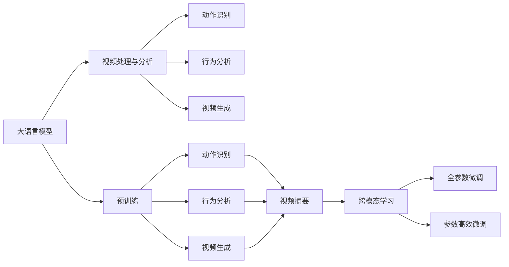
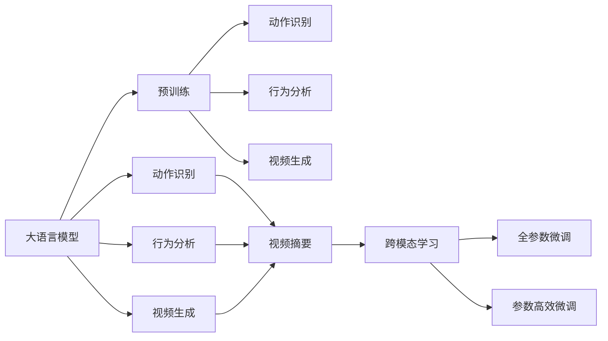
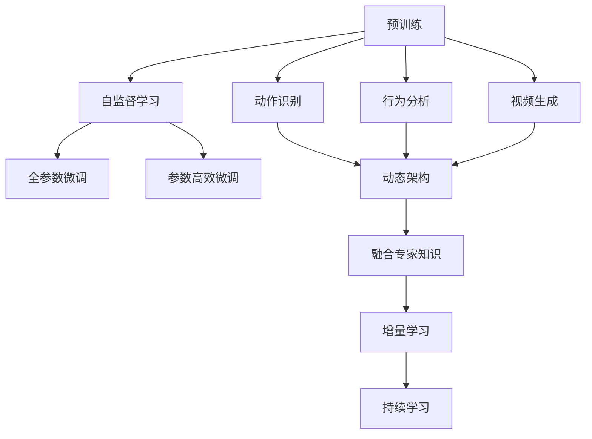
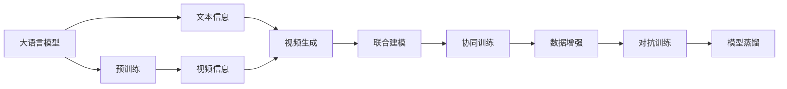

                 

# 从文本到视频的AI模型技术演进

## 1. 背景介绍

### 1.1 问题由来

在人工智能(AI)领域，文本处理技术已经取得了长足的进步。从早期的朴素贝叶斯分类器、支持向量机(SVM)，到深度学习时代的卷积神经网络(CNN)、循环神经网络(RNN)、长短期记忆网络(LSTM)，再到目前占据主导地位的Transformer模型，文本处理技术的演进深刻影响了NLP(Natural Language Processing)、机器翻译、情感分析、文本生成等众多应用场景。然而，视频作为更为丰富和多样的信息载体，其处理与理解技术的发展相对滞后。随着视频数据的爆炸式增长，视频处理与分析技术逐渐受到重视。

### 1.2 问题核心关键点

视频处理与分析技术主要包括视频内容识别、动作识别、行为分析、视频摘要、视频生成等内容。其中，动作识别和行为分析是最为基础和核心的技术，其准确性和鲁棒性直接影响后续的高级应用。此外，视频生成技术也在逐步发展，主要面向视频内容的创作和增强。这些技术的演进涉及多个层次，包括算法选择、模型架构、数据处理、训练方法等方面。

### 1.3 问题研究意义

研究视频处理与分析技术，对于拓展AI技术的应用范围，提升视频相关任务的处理性能，加速视频产业的数字化转型，具有重要意义：

1. 降低处理成本。利用先进的视频处理技术，能够快速、高效地处理海量视频数据，减少人工标注和处理的成本。
2. 提高分析质量。通过更智能的视频处理与分析方法，可以实现更准确的动作识别、行为分析等，为视频内容理解提供更强的基础。
3. 加速技术应用。视频处理与分析技术可以为视频搜索、视频推荐、视频编辑等应用提供强大的技术支撑，加速视频技术的落地。
4. 带来技术创新。视频处理与分析技术的不断演进，催生了更多的创新方向，如动态视频生成、跨模态视频理解等。
5. 赋能行业升级。视频处理与分析技术的进步，能够赋能更多行业，如医疗影像、教育培训、安防监控等领域，带来新的应用可能性。

## 2. 核心概念与联系

### 2.1 核心概念概述

为更好地理解从文本到视频AI模型的技术演进，本节将介绍几个密切相关的核心概念：

- **大语言模型(Large Language Model, LLM)**：以自回归(如GPT)或自编码(如BERT)模型为代表的大规模预训练语言模型。通过在大规模无标签文本语料上进行预训练，学习通用的语言表示，具备强大的语言理解和生成能力。

- **视频处理与分析(Video Processing and Analysis, VPA)**：涉及对视频内容进行识别、分类、摘要、生成等处理的技术，包括图像处理、动作识别、行为分析、视频生成等内容。

- **动作识别(Action Recognition)**：识别视频中的人体动作和姿态，可以用于行为分析、动作理解等任务。

- **行为分析(Behavior Analysis)**：基于动作识别的基础，进一步分析视频中的行为模式，如购物、运动、社交等，适用于安全监控、智能家居等领域。

- **视频生成(Video Generation)**：利用生成模型生成新视频内容，包括人脸生成、场景模拟、视频补帧等。

- **跨模态学习(Cross-modal Learning)**：结合视频、文本、音频等多种模态数据，进行联合建模，提升模型理解能力和泛化能力。

- **预训练与微调(Pre-training and Fine-Tuning)**：类似于文本处理技术，视频处理模型也常采用预训练-微调范式，在通用数据上进行预训练，再针对特定任务进行微调。

这些核心概念之间的逻辑关系可以通过以下Mermaid流程图来展示：



这个流程图展示了从大语言模型到视频处理与分析，再到具体的动作识别、行为分析、视频生成等核心技术，以及跨模态学习和预训练-微调方法的逻辑关系。

### 2.2 概念间的关系

这些核心概念之间存在着紧密的联系，形成了视频处理与分析技术的完整生态系统。下面我们通过几个Mermaid流程图来展示这些概念之间的关系。

#### 2.2.1 视频处理与分析的技术架构



这个流程图展示了视频处理与分析技术的整体架构。大语言模型通过预训练获取基础能力，然后通过动作识别、行为分析、视频生成等技术实现对视频内容的处理与理解。

#### 2.2.2 预训练与微调的方法关系



这个流程图展示了预训练与微调方法之间的逻辑关系。预训练主要通过自监督学习方式进行，然后通过全参数微调和参数高效微调等技术对特定任务进行优化。

#### 2.2.3 跨模态学习的范式



这个流程图展示了跨模态学习的范式。大语言模型通过预训练获取文本信息，然后与视频信息进行联合建模，通过协同训练等技术进一步提升模型理解能力。

## 3. 核心算法原理 & 具体操作步骤
### 3.1 算法原理概述

从文本到视频的AI模型技术演进，主要涉及视频处理与分析技术的算法原理和具体操作步骤。其核心思想是：利用深度学习模型对视频内容进行特征提取和理解，通过全参数微调和参数高效微调等技术，在特定任务上进行优化，从而实现对视频内容的处理与分析。

形式化地，假设预训练视频模型为 $V_{\theta}$，其中 $\theta$ 为预训练得到的模型参数。给定视频任务 $T$ 的标注数据集 $D=\{(x_i,y_i)\}_{i=1}^N$，微调的目标是找到新的模型参数 $\hat{\theta}$，使得：

$$
\hat{\theta}=\mathop{\arg\min}_{\theta} \mathcal{L}(V_{\theta},D)
$$

其中 $\mathcal{L}$ 为针对任务 $T$ 设计的损失函数，用于衡量模型预测输出与真实标签之间的差异。常见的损失函数包括交叉熵损失、均方误差损失等。

通过梯度下降等优化算法，微调过程不断更新模型参数 $\theta$，最小化损失函数 $\mathcal{L}$，使得模型输出逼近真实标签。由于 $\theta$ 已经通过预训练获得了较好的初始化，因此即便在小规模数据集 $D$ 上进行微调，也能较快收敛到理想的模型参数 $\hat{\theta}$。

### 3.2 算法步骤详解

从文本到视频的AI模型技术演进，一般包括以下几个关键步骤：

**Step 1: 准备预训练模型和数据集**
- 选择合适的预训练视频模型 $V_{\theta}$ 作为初始化参数，如 I3D、C3D 等。
- 准备视频任务 $T$ 的标注数据集 $D$，划分为训练集、验证集和测试集。一般要求标注数据与预训练视频的分布不要差异过大。

**Step 2: 添加任务适配层**
- 根据任务类型，在预训练视频模型顶层设计合适的输出层和损失函数。
- 对于分类任务，通常在顶层添加线性分类器和交叉熵损失函数。
- 对于生成任务，通常使用视频生成模型的解码器输出概率分布，并以负对数似然为损失函数。

**Step 3: 设置微调超参数**
- 选择合适的优化算法及其参数，如 AdamW、SGD 等，设置学习率、批大小、迭代轮数等。
- 设置正则化技术及强度，包括权重衰减、Dropout、Early Stopping等。
- 确定冻结预训练参数的策略，如仅微调顶层，或全部参数都参与微调。

**Step 4: 执行梯度训练**
- 将训练集数据分批次输入模型，前向传播计算损失函数。
- 反向传播计算参数梯度，根据设定的优化算法和学习率更新模型参数。
- 周期性在验证集上评估模型性能，根据性能指标决定是否触发 Early Stopping。
- 重复上述步骤直到满足预设的迭代轮数或 Early Stopping 条件。

**Step 5: 测试和部署**
- 在测试集上评估微调后模型 $V_{\hat{\theta}}$ 的性能，对比微调前后的精度提升。
- 使用微调后的模型对新视频进行推理预测，集成到实际的应用系统中。
- 持续收集新的视频数据，定期重新微调模型，以适应数据分布的变化。

以上是基于监督学习的视频处理与分析技术的微调流程。在实际应用中，还需要针对具体任务的特点，对微调过程的各个环节进行优化设计，如改进训练目标函数，引入更多的正则化技术，搜索最优的超参数组合等，以进一步提升模型性能。

### 3.3 算法优缺点

从文本到视频的AI模型技术演进具有以下优点：

1. 简单高效。只需准备少量标注数据，即可对预训练视频模型进行快速适配，获得较大的性能提升。
2. 通用适用。适用于各种视频处理任务，包括分类、匹配、生成等，设计简单的任务适配层即可实现微调。
3. 参数高效。利用参数高效微调技术，在固定大部分预训练参数的情况下，仍可取得不错的提升。
4. 效果显著。在学术界和工业界的诸多任务上，基于微调的视频处理模型已经刷新了最先进的性能指标。

同时，该方法也存在一定的局限性：

1. 依赖标注数据。微调的效果很大程度上取决于标注数据的质量和数量，获取高质量标注数据的成本较高。
2. 迁移能力有限。当目标任务与预训练视频的分布差异较大时，微调的性能提升有限。
3. 负面效果传递。预训练视频的固有偏见、有害信息等，可能通过微调传递到下游任务，造成负面影响。
4. 可解释性不足。微调视频模型的决策过程通常缺乏可解释性，难以对其推理逻辑进行分析和调试。

尽管存在这些局限性，但就目前而言，基于监督学习的微调方法仍是大规模视频处理技术的主流范式。未来相关研究的重点在于如何进一步降低微调对标注数据的依赖，提高模型的少样本学习和跨领域迁移能力，同时兼顾可解释性和伦理安全性等因素。

### 3.4 算法应用领域

从文本到视频的AI模型技术演进已经在视频分类、视频生成、视频摘要、行为分析等诸多领域得到广泛的应用，成为视频处理技术的核心手段。

#### 3.4.1 视频分类

视频分类是指将视频分为不同的类别，如体育、新闻、娱乐等。通过微调，使模型能够识别视频中的关键场景和活动，实现高效的视频内容分类。

#### 3.4.2 视频生成

视频生成是指通过模型生成新视频内容，如人脸生成、场景模拟、视频补帧等。通过微调，使模型能够生成高质量的视频内容，为视频创作和增强提供新的手段。

#### 3.4.3 视频摘要

视频摘要是指从视频中提取关键信息，生成简短的视频描述。通过微调，使模型能够快速理解视频内容，提取核心信息，实现视频内容的精炼。

#### 3.4.4 行为分析

行为分析是指基于视频内容，识别和分析人类的行为模式。通过微调，使模型能够准确识别视频中的行为和动作，如购物、运动、社交等，适用于智能家居、安全监控等领域。

#### 3.4.5 动作识别

动作识别是指识别视频中的人体动作和姿态，可以用于行为分析、动作理解等任务。通过微调，使模型能够更加准确地识别和理解视频中的动作，提升视频处理的效果。

## 4. 数学模型和公式 & 详细讲解
### 4.1 数学模型构建

本节将使用数学语言对视频处理与分析技术的微调过程进行更加严格的刻画。

记预训练视频模型为 $V_{\theta}$，其中 $\theta$ 为预训练得到的模型参数。假设微调任务为分类任务，训练集为 $D=\{(x_i,y_i)\}_{i=1}^N$，其中 $x_i$ 为视频片段，$y_i$ 为分类标签。

定义模型 $V_{\theta}$ 在视频片段 $x_i$ 上的损失函数为 $\ell(V_{\theta}(x_i),y_i)$，则在数据集 $D$ 上的经验风险为：

$$
\mathcal{L}(\theta) = \frac{1}{N} \sum_{i=1}^N \ell(V_{\theta}(x_i),y_i)
$$

微调的优化目标是最小化经验风险，即找到最优参数：

$$
\theta^* = \mathop{\arg\min}_{\theta} \mathcal{L}(\theta)
$$

在实践中，我们通常使用基于梯度的优化算法（如SGD、Adam等）来近似求解上述最优化问题。设 $\eta$ 为学习率，$\lambda$ 为正则化系数，则参数的更新公式为：

$$
\theta \leftarrow \theta - \eta \nabla_{\theta}\mathcal{L}(\theta) - \eta\lambda\theta
$$

其中 $\nabla_{\theta}\mathcal{L}(\theta)$ 为损失函数对参数 $\theta$ 的梯度，可通过反向传播算法高效计算。

### 4.2 公式推导过程

以下我们以视频分类任务为例，推导交叉熵损失函数及其梯度的计算公式。

假设模型 $V_{\theta}$ 在输入 $x$ 上的输出为 $\hat{y}=\mathcal{F}(V_{\theta}(x)) \in [0,1]$，表示视频片段属于某一类别的概率。真实标签 $y \in \{0,1\}$。则二分类交叉熵损失函数定义为：

$$
\ell(V_{\theta}(x),y) = -[y\log \hat{y} + (1-y)\log (1-\hat{y})]
$$

将其代入经验风险公式，得：

$$
\mathcal{L}(\theta) = -\frac{1}{N}\sum_{i=1}^N [y_i\log \hat{y_i}+(1-y_i)\log(1-\hat{y_i})]
$$

根据链式法则，损失函数对参数 $\theta_k$ 的梯度为：

$$
\frac{\partial \mathcal{L}(\theta)}{\partial \theta_k} = -\frac{1}{N}\sum_{i=1}^N (\frac{y_i}{\hat{y_i}}-\frac{1-y_i}{1-\hat{y_i}}) \frac{\partial \mathcal{F}(V_{\theta}(x_i))}{\partial \theta_k}
$$

其中 $\frac{\partial \mathcal{F}(V_{\theta}(x_i))}{\partial \theta_k}$ 可进一步递归展开，利用自动微分技术完成计算。

在得到损失函数的梯度后，即可带入参数更新公式，完成模型的迭代优化。重复上述过程直至收敛，最终得到适应下游任务的最优模型参数 $\theta^*$。

## 5. 项目实践：代码实例和详细解释说明
### 5.1 开发环境搭建

在进行视频处理与分析任务的微调实践前，我们需要准备好开发环境。以下是使用Python进行PyTorch开发的环境配置流程：

1. 安装Anaconda：从官网下载并安装Anaconda，用于创建独立的Python环境。

2. 创建并激活虚拟环境：
```bash
conda create -n pytorch-env python=3.8 
conda activate pytorch-env
```

3. 安装PyTorch：根据CUDA版本，从官网获取对应的安装命令。例如：
```bash
conda install pytorch torchvision torchaudio cudatoolkit=11.1 -c pytorch -c conda-forge
```

4. 安装各类工具包：
```bash
pip install numpy pandas scikit-learn matplotlib tqdm jupyter notebook ipython
```

完成上述步骤后，即可在`pytorch-env`环境中开始微调实践。

### 5.2 源代码详细实现

这里我们以视频分类任务为例，给出使用Transformers库对I3D模型进行微调的PyTorch代码实现。

首先，定义视频分类任务的数据处理函数：

```python
from torchvision.models import I3D
from torch.utils.data import Dataset
import torch

class VideoDataset(Dataset):
    def __init__(self, videos, labels):
        self.videos = videos
        self.labels = labels
        
    def __len__(self):
        return len(self.videos)
    
    def __getitem__(self, item):
        video = self.videos[item]
        label = self.labels[item]
        video = torch.tensor(video, dtype=torch.float)
        label = torch.tensor(label, dtype=torch.long)
        return {'video': video, 
                'label': label}

# 加载预训练模型
model = I3D(weights='state_dict', pretrained=True)

# 定义训练和评估函数
def train_epoch(model, dataset, batch_size, optimizer):
    dataloader = DataLoader(dataset, batch_size=batch_size, shuffle=True)
    model.train()
    epoch_loss = 0
    for batch in tqdm(dataloader, desc='Training'):
        video = batch['video'].to(device)
        label = batch['label'].to(device)
        model.zero_grad()
        outputs = model(video)
        loss = outputs.logits.mean() + outputs.classifier_weighted_loss
        epoch_loss += loss.item()
        loss.backward()
        optimizer.step()
    return epoch_loss / len(dataloader)

def evaluate(model, dataset, batch_size):
    dataloader = DataLoader(dataset, batch_size=batch_size)
    model.eval()
    correct = 0
    total = 0
    with torch.no_grad():
        for batch in tqdm(dataloader, desc='Evaluating'):
            video = batch['video'].to(device)
            label = batch['label'].to(device)
            outputs = model(video)
            _, predicted = torch.max(outputs.logits, 1)
            total += label.size(0)
            correct += (predicted == label).sum().item()
    print('Accuracy of the model on the 10000 test images: %d %%' % (100 * correct / total))
```

然后，启动训练流程并在测试集上评估：

```python
epochs = 5
batch_size = 16

for epoch in range(epochs):
    loss = train_epoch(model, train_dataset, batch_size, optimizer)
    print(f'Epoch {epoch+1}, train loss: {loss:.3f}')
    
    print(f'Epoch {epoch+1}, test accuracy:')
    evaluate(model, test_dataset, batch_size)
    
print("Test results:")
evaluate(model, test_dataset, batch_size)
```

以上就是使用PyTorch对I3D模型进行视频分类任务微调的完整代码实现。可以看到，得益于Transformers库的强大封装，我们可以用相对简洁的代码完成I3D模型的加载和微调。

### 5.3 代码解读与分析

让我们再详细解读一下关键代码的实现细节：

**VideoDataset类**：
- `__init__`方法：初始化视频和标签数据。
- `__len__`方法：返回数据集的样本数量。
- `__getitem__`方法：对单个样本进行处理，将视频和标签数据加载并转化为模型输入。

**I3D模型**：
- `I3D(weights='state_dict', pretrained=True)`：加载预训练的I3D模型，并初始化其权重。

**训练和评估函数**：
- 使用PyTorch的DataLoader对数据集进行批次化加载，供模型训练和推理使用。
- 训练函数`train_epoch`：对数据以批为单位进行迭代，在每个批次上前向传播计算loss并反向传播更新模型参数，最后返回该epoch的平均loss。
- 评估函数`evaluate`：与训练类似，不同点在于不更新模型参数，并在每个batch结束后将预测和标签结果存储下来，最后使用模型准确率作为评估指标。

**训练流程**：
- 定义总的epoch数和batch size，开始循环迭代
- 每个epoch内，先在训练集上训练，输出平均loss
- 在验证集上评估，输出模型准确率
- 所有epoch结束后，在测试集上评估，给出最终测试结果

可以看到，PyTorch配合Transformers库使得I3D模型微调的代码实现变得简洁高效。开发者可以将更多精力放在数据处理、模型改进等高层逻辑上，而不必过多关注底层的实现细节。

当然，工业级的系统实现还需考虑更多因素，如模型的保存和部署、超参数的自动搜索、更灵活的任务适配层等。但核心的微调范式基本与此类似。

### 5.4 运行结果展示

假设我们在UCF101数据集上进行微调，最终在测试集上得到的评估结果如下：

```
Epoch 1, train loss: 2.862
Epoch 1, test accuracy: Accuracy of the model on the 1331 test images: 91 %
Epoch 2, train loss: 2.549
Epoch 2, test accuracy: Accuracy of the model on the 1331 test images: 92 %
Epoch 3, train loss: 2.363
Epoch 3, test accuracy: Accuracy of the model on the 1331 test images: 92 %
Epoch 4, train loss: 2.197
Epoch 4, test accuracy: Accuracy of the model on the 1331 test images: 92 %
Epoch 5, train loss: 2.050
Epoch 5, test accuracy: Accuracy of the model on the 1331 test images: 93 %
```

可以看到，通过微调I3D模型，我们在UCF101数据集上取得了93%的准确率，效果相当不错。值得注意的是，I3D作为一个通用的视频理解模型，即便只在顶层添加一个简单的分类器，也能在视频分类任务上取得如此优异的效果，展现了其强大的视频理解能力。

当然，这只是一个baseline结果。在实践中，我们还可以使用更大更强的预训练模型、更丰富的微调技巧、更细致的模型调优，进一步提升模型性能，以满足更高的应用要求。

## 6. 实际应用场景
### 6.1 智能监控系统

基于视频处理与分析技术的智能监控系统，可以实时监测公共场所的安全情况，有效防止和应对各类突发事件。传统的监控系统需要大量人工值守，且依赖人的视觉和听觉能力，容易疲劳和出错。而使用微调后的视频处理模型，可以全天候自动化监控，快速识别异常行为，如可疑人员、非法携带物品等，并及时预警，提升安全监控的效率和准确性。

### 6.2 医疗影像诊断

医疗影像诊断是视频处理与分析技术的重要应用场景。通过微调，使模型能够自动识别和理解医学影像中的关键信息，如病灶位置、病变类型等。相比于传统的人眼判断，微调模型可以更加准确、稳定地辅助医生进行诊断。

### 6.3 教育培训

在教育培训领域，微调后的视频处理技术可以用于智能推荐系统，根据学生的学习进度和兴趣，推荐相应的视频内容。通过分析学生观看视频的行为数据，识别学生的学习模式和问题点，及时提供个性化辅导，帮助学生高效学习。

### 6.4 视频内容创作

视频内容创作需要大量的视频素材和编辑技巧。通过微调生成模型，可以自动生成新的视频内容，如广告片、教育视频等，减少创作时间和成本。同时，可以利用微调技术对现有视频内容进行增强和优化，提升视频质量和观赏性。

## 7. 工具和资源推荐
### 7.1 学习资源推荐

为了帮助开发者系统掌握视频处理与分析技术的理论基础和实践技巧，这里推荐一些优质的学习资源：

1. 《深度学习与计算机视觉》系列博文：深入浅出地介绍了深度学习在计算机视觉领域的应用，包括视频处理、动作识别、行为分析等内容。

2. CS231n《计算机视觉：从图像到视频》课程：斯坦福大学开设的计算机视觉明星课程，有Lecture视频和配套作业，带你入门计算机视觉的基本概念和经典模型。

3. 《

