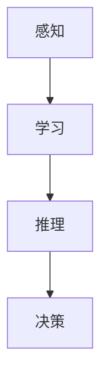

                 

# 从简单到深刻的认知历程

## 1. 背景介绍

人工智能(AI)作为21世纪最激动人心的技术领域之一，正深刻地改变着人类的生产和生活方式。从简单的图像识别、语音交互，到复杂的自然语言处理、自动驾驶，AI技术正在不断突破自身的极限，为人类社会带来前所未有的变革。在这场技术革命的浪潮中，“认知”成为其中一个重要的研究方向。

认知科学，简而言之，是研究人、动物和机器如何获取、处理、存储、利用信息的过程。从最基础的神经科学、心理学研究，到计算机视觉、自然语言处理等AI领域，认知科学正不断为我们揭示大脑和机器的运作机制，并推动技术创新。本文将从认知科学的基础理论出发，探讨其如何在AI中应用，并展望未来发展趋势。

## 2. 核心概念与联系

### 2.1 核心概念概述

在进行深入讨论之前，我们先明确几个关键概念：

- **感知**（Perception）：是指从环境中接收和解释信息的过程。在AI中，这对应于计算机视觉、听觉、语言理解等技术。
- **认知**（Cognition）：包括注意力、记忆、推理等高级心理过程。AI中的认知模型，如神经网络和深度学习模型，试图模仿人类的认知机制。
- **学习**（Learning）：通过经验不断调整模型参数，从而提高任务性能的过程。AI模型通常通过大量标注数据进行监督学习或无监督学习。
- **推理**（Reasoning）：从已知信息推断未知信息的能力。AI中的推理模型，如逻辑推理、自然语言推理等，能够根据给定事实得出结论。
- **决策**（Decision Making）：在多个选项中做出选择的心理过程。AI模型常用于辅助或自动决策系统，如推荐系统、智能投顾等。

这些概念构成了认知科学的基石，并通过AI技术逐步实现了其自动化和智能化。

### 2.2 核心概念的联系

认知科学的各概念之间存在着紧密的联系。感知是认知的基础，学习是认知的提升，推理和决策是认知的应用。通过模拟人类的感知和认知过程，AI技术不断拓展其能力边界，从简单的任务执行，到复杂的自主决策。下面将通过一个简单的认知流程，来展示这些概念的联系。



这个流程图展示了从感知输入到决策输出的全过程。首先，AI系统通过传感器或输入接口，接收环境信息（A）。接着，通过学习算法（B），系统将感知信息转换为内部表示，并不断优化以提升精度。然后，基于这些表示，系统进行推理（C），得出结论或预测。最终，系统根据推理结果做出决策（D），驱动行为或输出结果。

## 3. 核心算法原理 & 具体操作步骤

### 3.1 算法原理概述

认知过程的计算模型，通常基于人工神经网络（ANN）或深度学习模型（DL）。这些模型通过多层非线性变换，从原始感知数据中提取特征，并通过反向传播算法进行训练。具体而言，从输入到输出的全过程可以分为以下几个步骤：

1. **前向传播**（Forward Propagation）：输入数据经过多层神经网络，逐步传递，每层进行非线性变换，最终输出结果。
2. **损失计算**（Loss Calculation）：将输出结果与实际标签进行对比，计算损失函数值。
3. **反向传播**（Backpropagation）：通过链式法则，反向传播误差，更新网络参数。
4. **参数优化**（Parameter Optimization）：通过梯度下降等优化算法，最小化损失函数，调整模型参数。

这个过程中，感知、学习、推理和决策的各个环节紧密相连，最终形成一个完整的认知模型。

### 3.2 算法步骤详解

以图像识别为例，详细阐述AI系统中从感知到决策的全过程。

**步骤1：输入处理**（Input Processing）

首先，将图像数据输入模型。在卷积神经网络（CNN）中，图像数据经过多个卷积层、池化层等操作，逐步减小尺寸，提取出图像的关键特征。

**步骤2：特征提取**（Feature Extraction）

经过多次卷积和池化操作，模型提取出了图像的高级特征，如边缘、纹理等。这些特征通过全连接层传递到分类器，用于判断图像的类别。

**步骤3：分类推理**（Classification Inference）

分类器通过softmax函数计算每个类别的概率分布，并输出概率最大的类别作为识别结果。这个过程中，模型进行了推理，从输入数据中得出了最终的类别预测。

**步骤4：决策输出**（Decision Output）

最后，系统根据分类器输出，做出最终的决策。例如，在自动驾驶中，模型输出“直行”或“左转”指令；在医疗诊断中，输出“健康”或“疾病”标签。

### 3.3 算法优缺点

**优点**：
- **高效性**：深度学习模型能够自动提取特征，避免了手工设计特征的复杂过程。
- **适应性强**：模型可以通过大量标注数据进行训练，适应各种复杂的感知和认知任务。
- **可扩展性**：模型的层次结构使得不同层次的特征可以独立设计和训练。

**缺点**：
- **资源消耗大**：模型参数量巨大，训练和推理需要大量计算资源。
- **模型复杂性**：模型结构复杂，难以理解和调试。
- **过拟合风险**：模型容易过拟合训练数据，泛化性能较差。

### 3.4 算法应用领域

认知模型在多个领域得到了广泛应用，以下是几个典型例子：

- **计算机视觉**：图像分类、目标检测、人脸识别等任务。
- **自然语言处理**：机器翻译、情感分析、文本摘要等任务。
- **语音识别**：语音转文本、情感识别、语音生成等任务。
- **自动驾驶**：环境感知、路径规划、决策控制等任务。
- **医疗诊断**：影像分析、病理学诊断、基因分析等任务。

## 4. 数学模型和公式 & 详细讲解

### 4.1 数学模型构建

以图像分类为例，构建一个简单的卷积神经网络模型：

```python
import torch
import torch.nn as nn
import torchvision.transforms as transforms

class ConvNet(nn.Module):
    def __init__(self):
        super(ConvNet, self).__init__()
        self.conv1 = nn.Conv2d(3, 32, 3, 1)
        self.conv2 = nn.Conv2d(32, 64, 3, 1)
        self.dropout1 = nn.Dropout2d(0.25)
        self.dropout2 = nn.Dropout2d(0.5)
        self.fc1 = nn.Linear(9216, 128)
        self.fc2 = nn.Linear(128, 10)

    def forward(self, x):
        x = self.conv1(x)
        x = nn.functional.relu(x)
        x = nn.functional.max_pool2d(x, 2)
        x = self.dropout1(x)
        x = self.conv2(x)
        x = nn.functional.relu(x)
        x = nn.functional.max_pool2d(x, 2)
        x = self.dropout2(x)
        x = x.view(-1, 9216)
        x = self.fc1(x)
        x = nn.functional.relu(x)
        x = self.dropout2(x)
        x = self.fc2(x)
        output = nn.functional.log_softmax(x, dim=1)
        return output
```

该模型包含两个卷积层、两个全连接层，以及两个Dropout层，用于减少过拟合。其中，前向传播过程由`forward`函数实现，计算输出结果。

### 4.2 公式推导过程

假设模型输出为 $y = Wz + b$，其中 $W$ 为权重矩阵，$z$ 为输入，$b$ 为偏置。损失函数通常采用交叉熵损失（Cross-Entropy Loss）：

$$
L(y, t) = -\frac{1}{N}\sum_{i=1}^{N}\sum_{j=1}^{C}t_{ij}\log y_{ij}
$$

其中，$N$ 为样本数量，$C$ 为类别数量，$t_{ij}$ 为真实标签，$y_{ij}$ 为模型预测概率。

模型参数更新采用梯度下降法，通过反向传播计算梯度：

$$
\frac{\partial L}{\partial W} = -\frac{1}{N}\sum_{i=1}^{N}(\frac{\partial L}{\partial y_i}\frac{\partial y_i}{\partial W})
$$

$$
\frac{\partial L}{\partial b} = -\frac{1}{N}\sum_{i=1}^{N}\frac{\partial L}{\partial y_i}
$$

其中，$\frac{\partial L}{\partial y_i}$ 为损失函数对输出 $y_i$ 的梯度，可以通过链式法则计算。

### 4.3 案例分析与讲解

以CIFAR-10数据集为例，分析一个简单的卷积神经网络模型。

**数据准备**：

```python
import torchvision.datasets as datasets
import torchvision.transforms as transforms

train_dataset = datasets.CIFAR10(root='./data', train=True,
                                transform=transforms.ToTensor(),
                                download=True)

test_dataset = datasets.CIFAR10(root='./data', train=False,
                               transform=transforms.ToTensor())

train_loader = torch.utils.data.DataLoader(train_dataset, batch_size=4,
                                          shuffle=True, num_workers=2)

test_loader = torch.utils.data.DataLoader(test_dataset, batch_size=4,
                                         shuffle=False, num_workers=2)
```

**模型训练**：

```python
import torch.optim as optim

device = torch.device('cuda:0' if torch.cuda.is_available() else 'cpu')
model = ConvNet().to(device)
criterion = nn.CrossEntropyLoss()
optimizer = optim.SGD(model.parameters(), lr=0.001, momentum=0.9)

for epoch in range(2):
    running_loss = 0.0
    for i, data in enumerate(train_loader, 0):
        inputs, labels = data[0].to(device), data[1].to(device)
        optimizer.zero_grad()
        outputs = model(inputs)
        loss = criterion(outputs, labels)
        loss.backward()
        optimizer.step()

        running_loss += loss.item()
        if i % 2000 == 1999:
            print('[%d, %5d] loss: %.3f' %
                  (epoch + 1, i + 1, running_loss / 2000))
            running_loss = 0.0

print('Finished Training')
```

**模型评估**：

```python
correct = 0
total = 0
with torch.no_grad():
    for data in test_loader:
        images, labels = data[0].to(device), data[1].to(device)
        outputs = model(images)
        _, predicted = torch.max(outputs.data, 1)
        total += labels.size(0)
        correct += (predicted == labels).sum().item()

print('Accuracy of the network on the 10000 test images: %d %%' % (
    100 * correct / total))
```

通过上述代码，我们可以看到模型从数据输入、特征提取、分类推理到最终输出的全过程，以及如何通过损失函数和梯度下降法进行模型优化。

## 5. 项目实践：代码实例和详细解释说明

### 5.1 开发环境搭建

本节我们将搭建一个基本的AI开发环境，用于进行模型训练和推理。

**1. 安装Python和相关库**：

```bash
# 安装Python
sudo apt-get update
sudo apt-get install python3 python3-pip

# 安装TensorFlow和Keras
pip install tensorflow keras
```

**2. 安装Jupyter Notebook**：

```bash
pip install jupyter notebook
```

**3. 创建虚拟环境**：

```bash
python3 -m venv myenv
source myenv/bin/activate
```

### 5.2 源代码详细实现

在本节，我们将实现一个简单的图像分类器，使用Keras框架。

**定义模型**：

```python
from tensorflow.keras import layers, models

model = models.Sequential()
model.add(layers.Conv2D(32, (3, 3), activation='relu', input_shape=(32, 32, 3)))
model.add(layers.MaxPooling2D((2, 2)))
model.add(layers.Conv2D(64, (3, 3), activation='relu'))
model.add(layers.MaxPooling2D((2, 2)))
model.add(layers.Conv2D(64, (3, 3), activation='relu'))
model.add(layers.Flatten())
model.add(layers.Dense(64, activation='relu'))
model.add(layers.Dense(10))
```

**训练模型**：

```python
import numpy as np
from tensorflow.keras.datasets import cifar10
from tensorflow.keras.utils import to_categorical

(x_train, y_train), (x_test, y_test) = cifar10.load_data()

x_train = x_train.astype('float32') / 255.0
x_test = x_test.astype('float32') / 255.0

y_train = to_categorical(y_train, 10)
y_test = to_categorical(y_test, 10)

model.compile(optimizer='adam',
              loss='categorical_crossentropy',
              metrics=['accuracy'])

model.fit(x_train, y_train, epochs=10, batch_size=64, validation_data=(x_test, y_test))
```

**推理测试**：

```python
predictions = model.predict(x_test)
predicted_labels = np.argmax(predictions, axis=1)

print('Accuracy:', np.mean(predicted_labels == y_test.argmax(axis=1)))
```

### 5.3 代码解读与分析

**模型定义**：

在代码中，我们定义了一个简单的卷积神经网络，包含三个卷积层和两个全连接层。每个卷积层后面接一个池化层，用于减小特征图尺寸。最后，通过两个全连接层输出分类结果。

**数据预处理**：

将图像数据标准化为0到1之间，并将标签转换为one-hot编码形式，以便于模型的训练和评估。

**模型训练**：

使用`compile`方法设置模型的优化器和损失函数，`fit`方法开始训练模型。在每个epoch中，模型使用训练集进行前向传播和反向传播，更新参数。

**模型评估**：

通过`predict`方法对测试集进行推理，并计算预测准确率。

## 6. 实际应用场景

### 6.1 计算机视觉

计算机视觉是认知模型在感知和认知处理中最典型的应用之一。通过图像分类、目标检测、人脸识别等技术，AI系统能够理解和分析视觉信息，广泛应用于自动驾驶、智能监控、医疗影像分析等领域。

### 6.2 自然语言处理

自然语言处理是认知模型在语言理解方面的重要应用。通过文本分类、情感分析、机器翻译等技术，AI系统能够处理和生成人类语言，广泛应用于智能客服、智能助理、文本摘要等场景。

### 6.3 语音识别

语音识别是认知模型在听觉处理方面的应用。通过语音转文本、语音情感识别、语音生成等技术，AI系统能够理解和生成语音信息，广泛应用于智能家居、语音助手、自动字幕生成等领域。

## 7. 工具和资源推荐

### 7.1 学习资源推荐

- **Coursera的深度学习课程**：由斯坦福大学的Andrew Ng教授主讲，系统介绍深度学习的基本概念和算法。
- **Udacity的AI课程**：涵盖深度学习、计算机视觉、自然语言处理等多个方向，提供实战项目和课程考核。
- **Arxiv预印本**：了解最新的AI研究成果，包括认知科学的最新进展。
- **Medium博客**：许多AI从业者在上面分享技术心得和项目经验，值得关注。

### 7.2 开发工具推荐

- **PyTorch**：灵活高效的深度学习框架，提供动态计算图和丰富的模型库。
- **TensorFlow**：由Google开发，生产部署方便，支持分布式训练和推理。
- **Keras**：高级神经网络API，提供了简单易用的模型构建接口。
- **Jupyter Notebook**：强大的交互式编程环境，支持代码编写、数据可视化和项目协作。

### 7.3 相关论文推荐

- **ImageNet Large Scale Visual Recognition Challenge (ILSVRC)**：2012年提出的视觉识别竞赛，推动了深度学习在图像处理领域的应用。
- **Natural Language Processing (NLP)**：使用深度学习技术处理和生成自然语言的研究方向，涵盖文本分类、机器翻译、情感分析等任务。
- **Speech Recognition**：研究如何通过深度学习技术实现语音识别和转写，广泛应用于语音助手、自动字幕生成等领域。

## 8. 总结：未来发展趋势与挑战

### 8.1 研究成果总结

本文从认知科学的基础理论出发，探讨了其在AI中的应用，并给出了具体示例。通过分析认知模型的全过程，我们看到了深度学习在感知、学习、推理和决策等方面的强大能力。

### 8.2 未来发展趋势

未来的认知模型将更加智能化和自动化，具备更强的感知、学习、推理和决策能力。以下是几个趋势：

- **多模态融合**：认知模型将融合视觉、听觉、语言等多种模态信息，实现更加全面和准确的信息处理。
- **自适应学习**：认知模型将能够根据环境变化，动态调整模型参数，提高泛化性能。
- **弱监督学习**：在缺乏大量标注数据的情况下，通过弱监督学习、主动学习等方法，实现模型训练。
- **模型压缩与优化**：通过模型压缩、量化加速等技术，提升模型推理速度和资源利用率。

### 8.3 面临的挑战

认知模型在快速发展的同时，也面临一些挑战：

- **资源消耗大**：大规模深度学习模型的训练和推理需要大量的计算资源，限制了其在某些应用场景中的应用。
- **模型可解释性差**：深度学习模型通常被视为"黑盒"，难以解释其内部决策过程，影响了其在医疗、金融等高风险领域的应用。
- **数据隐私和安全**：模型训练过程中需要大量数据，如何保护用户隐私和数据安全是一个重要问题。
- **伦理和社会责任**：AI系统在决策过程中可能存在偏见，如何确保其公平性和透明度，是未来的重要研究方向。

### 8.4 研究展望

未来的研究需要在以下几个方面进一步深入：

- **跨学科融合**：将认知科学与其他学科，如心理学、社会学、经济学等结合，推动认知模型的应用创新。
- **模型公平性与透明性**：开发公平透明的AI系统，确保其在决策过程中的公正性和透明性。
- **伦理与社会责任**：探讨AI系统的伦理问题，确保其在社会中的良性应用。
- **人机协作**：研究如何构建人机协作系统，提高AI系统的可解释性和可靠性。

## 9. 附录：常见问题与解答

**Q1：认知科学在AI中具体有哪些应用？**

A: 认知科学在AI中的应用非常广泛，包括计算机视觉、自然语言处理、语音识别等感知任务，以及决策树、逻辑推理、符号计算等认知任务。通过模拟人类的感知和认知过程，AI系统能够理解和处理各种复杂的信息。

**Q2：深度学习模型在训练过程中如何防止过拟合？**

A: 过拟合是深度学习模型训练过程中常见的问题，可以通过以下方法防止：
- **正则化**：通过L1、L2正则化等方法，约束模型参数，避免过拟合。
- **Dropout**：随机丢弃一部分神经元，强制模型学习到鲁棒的特征。
- **数据增强**：通过旋转、缩放、平移等方法，扩充训练数据集，提高模型的泛化能力。

**Q3：如何理解深度学习模型的“黑盒”特性？**

A: 深度学习模型由于其复杂的结构和大量参数，通常难以解释其内部决策过程。这种特性被称为"黑盒"特性。为了提高模型的可解释性，研究人员正在开发一些解释工具，如注意力机制、可解释的特征图等。

**Q4：AI系统的伦理问题有哪些？**

A: AI系统的伦理问题主要包括以下几个方面：
- **公平性**：确保模型在处理不同群体数据时，不会产生歧视性结果。
- **透明性**：确保模型在做出决策时，用户能够理解和信任其决策过程。
- **安全性**：确保模型在处理敏感数据时，不会泄露用户隐私。
- **社会责任**：确保模型在影响社会时，不会产生负面影响。

通过解决这些伦理问题，AI系统才能真正造福人类社会，实现可持续发展。

作者：禅与计算机程序设计艺术 / Zen and the Art of Computer Programming

