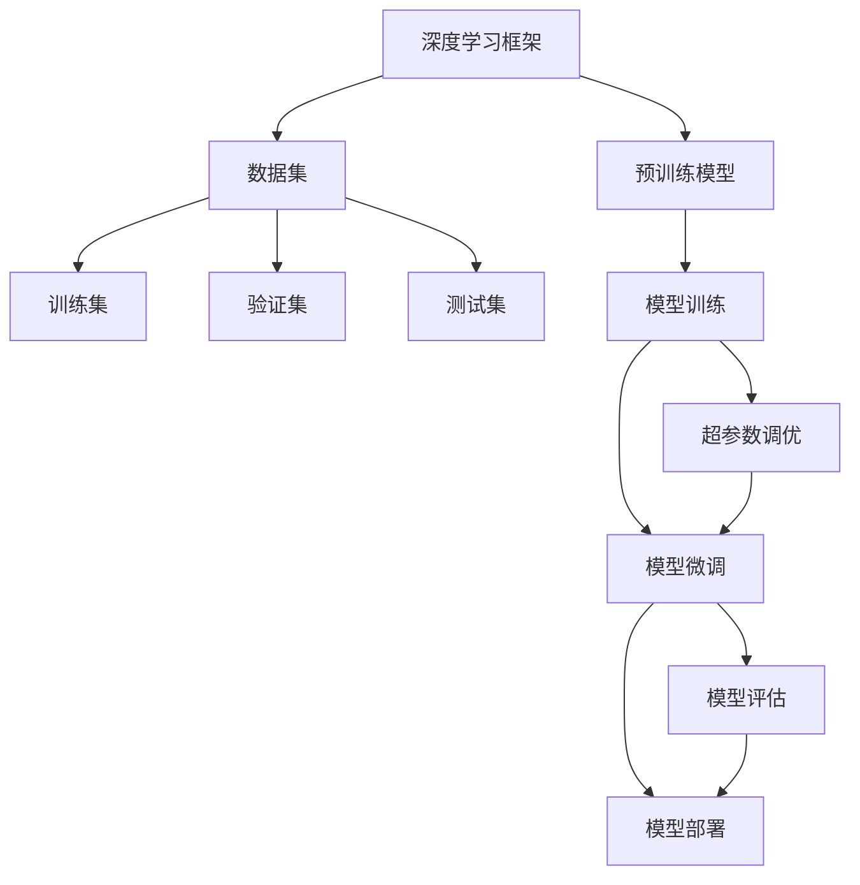

                 

# 从零开始大模型开发与微调：基于深度学习的模型训练

> 关键词：大模型开发,深度学习,微调,模型训练,算法优化,数据处理,实验调参

## 1. 背景介绍

### 1.1 问题由来
近年来，深度学习技术在各个领域都取得了长足的进步，其中大模型的开发和应用尤为引人注目。大模型通常指的是含有上亿甚至数十亿参数的神经网络，这些模型能够在大规模数据上实现高效学习，从而具有强大的泛化能力和表现力。从自然语言处理的GPT、BERT到计算机视觉领域的ResNet、Inception，大模型已经成为许多重要应用的核心。

然而，开发和训练一个如此复杂的大模型并不是一件容易的事。首先，大模型需要大量的计算资源和大量的数据。其次，大模型的训练过程通常需要详细的超参数调优和精细的实验设计。这些问题在实际开发中常常让人望而却步。本文旨在提供从零开始大模型开发与微调的系统性指导，帮助开发者克服这些挑战，快速构建和优化大模型。

### 1.2 问题核心关键点
大模型开发与微调的核心关键点在于：
1. 选择合适的深度学习框架和预训练模型。
2. 设计合理的数据集和数据处理流程。
3. 进行有效的超参数调优和实验设计。
4. 应用有效的模型训练技巧和微调方法。
5. 评估和部署模型，保证其在实际应用中的性能。

本文将围绕这些核心点，详细介绍大模型开发与微调的过程，并结合实际项目给出详细案例和实用技巧。

## 2. 核心概念与联系

### 2.1 核心概念概述

为更好地理解大模型开发与微调的过程，本节将介绍几个关键概念：

- **深度学习框架**：如TensorFlow、PyTorch、Keras等，提供构建和训练神经网络的基本工具和接口。
- **预训练模型**：如BERT、GPT、ResNet等，在大规模数据上预训练得到的模型，具备强大的泛化能力和表示能力。
- **数据集**：用于训练和评估模型的数据集合，通常分为训练集、验证集和测试集。
- **超参数**：模型训练中需要手动设置的参数，如学习率、批大小、优化器等。
- **模型训练**：通过前向传播和反向传播更新模型参数的过程。
- **微调**：在大规模预训练模型的基础上，使用特定任务的数据集进行有监督学习，以提高模型在特定任务上的性能。

这些核心概念之间存在着紧密的联系，通过合理的设计和优化，可以在大模型的开发与微调过程中发挥其最大的潜力。

### 2.2 概念间的关系

这些核心概念之间的逻辑关系可以通过以下Mermaid流程图来展示：



这个流程图展示了大模型开发与微调的基本流程：

1. 使用深度学习框架构建神经网络。
2. 加载预训练模型或在大规模数据上预训练模型。
3. 准备数据集，并分为训练集、验证集和测试集。
4. 使用训练集进行模型训练，并进行超参数调优。
5. 在验证集上进行模型微调，提高特定任务的性能。
6. 在测试集上评估模型性能，并进行模型部署。

## 3. 核心算法原理 & 具体操作步骤

### 3.1 算法原理概述

大模型的开发与微调通常采用深度学习的方法，通过多层神经网络结构对数据进行特征提取和分类。以下是对深度学习模型训练和微调的基本原理介绍：

- **前向传播**：将输入数据送入神经网络，计算每个神经元的激活值，最终输出预测结果。
- **损失函数**：用于衡量模型输出与真实标签之间的差距，常见的损失函数包括交叉熵、均方误差等。
- **反向传播**：根据损失函数对模型参数进行梯度更新，以最小化损失函数。
- **优化器**：如SGD、Adam等，用于调整模型参数，以提高训练效率和收敛速度。
- **正则化**：如L2正则、Dropout等，用于防止模型过拟合。
- **模型微调**：在大规模预训练模型的基础上，使用特定任务的数据集进行有监督学习，以提高模型在特定任务上的性能。

### 3.2 算法步骤详解

以下是基于深度学习框架进行大模型开发与微调的一般步骤：

**Step 1: 环境搭建**
- 安装深度学习框架（如TensorFlow、PyTorch）和相关依赖包。
- 准备训练集、验证集和测试集，确保数据质量和分布一致性。

**Step 2: 构建神经网络**
- 定义神经网络的结构，包括输入层、隐藏层和输出层。
- 初始化模型参数，如权重、偏置等。

**Step 3: 设计损失函数**
- 根据任务类型选择合适的损失函数。
- 编写损失函数计算代码，通常采用交叉熵损失。

**Step 4: 选择优化器和正则化方法**
- 选择合适的优化器（如SGD、Adam）及其超参数。
- 添加正则化方法（如L2正则、Dropout）以防止过拟合。

**Step 5: 模型训练**
- 使用训练集进行前向传播和反向传播，更新模型参数。
- 周期性在验证集上评估模型性能，进行超参数调优。

**Step 6: 模型微调**
- 在预训练模型基础上，使用特定任务的数据集进行有监督学习。
- 冻结部分预训练参数，只微调顶层或指定层的参数。
- 设置较小的学习率，以避免破坏预训练权重。

**Step 7: 模型评估**
- 在测试集上评估模型性能，分析模型表现。
- 使用可视化工具（如TensorBoard）监控训练过程。

**Step 8: 模型部署**
- 将训练好的模型保存，并进行部署。
- 将模型嵌入到实际应用系统中，提供API接口或直接调用。

### 3.3 算法优缺点

大模型开发与微调方法具有以下优点：
1. 强大的泛化能力：通过大规模预训练，模型能够学习到丰富的语言或视觉特征，适用于多种任务。
2. 高效的迁移学习：模型可以在不同领域之间进行迁移，避免从头开始训练。
3. 可解释性强：通过可视化工具和正则化方法，模型行为可被解释和调试。

但同时，也存在一些缺点：
1. 数据需求量大：预训练和微调都需要大量的数据。
2. 计算资源消耗大：大规模模型的训练和推理需要高性能的GPU或TPU。
3. 超参数调优困难：模型复杂度高，超参数数量多，调优难度大。

### 3.4 算法应用领域

大模型的开发与微调方法已经在多个领域得到了广泛应用，包括但不限于：

- **自然语言处理**：文本分类、情感分析、机器翻译、对话系统等。
- **计算机视觉**：图像分类、物体检测、图像生成等。
- **语音识别**：语音转文本、语音生成等。
- **推荐系统**：用户行为分析、商品推荐等。
- **医疗影像**：疾病诊断、图像分类等。

## 4. 数学模型和公式 & 详细讲解

### 4.1 数学模型构建

本节将使用数学语言对深度学习模型训练和微调的过程进行严格刻画。

记深度学习模型为 $f_\theta: \mathcal{X} \rightarrow \mathcal{Y}$，其中 $\mathcal{X}$ 为输入空间，$\mathcal{Y}$ 为输出空间，$\theta$ 为模型参数。假设训练集为 $D=\{(x_i,y_i)\}_{i=1}^N$，其中 $x_i \in \mathcal{X}, y_i \in \mathcal{Y}$。

定义模型在数据样本 $(x,y)$ 上的损失函数为 $\ell(f_\theta(x),y)$，则在数据集 $D$ 上的经验风险为：

$$
\mathcal{L}(\theta) = \frac{1}{N} \sum_{i=1}^N \ell(f_\theta(x_i),y_i)
$$

微调的优化目标是最小化经验风险，即找到最优参数：

$$
\theta^* = \mathop{\arg\min}_{\theta} \mathcal{L}(\theta)
$$

在实践中，我们通常使用基于梯度的优化算法（如SGD、Adam等）来近似求解上述最优化问题。设 $\eta$ 为学习率，$\lambda$ 为正则化系数，则参数的更新公式为：

$$
\theta \leftarrow \theta - \eta \nabla_{\theta}\mathcal{L}(\theta) - \eta\lambda\theta
$$

其中 $\nabla_{\theta}\mathcal{L}(\theta)$ 为损失函数对参数 $\theta$ 的梯度，可通过反向传播算法高效计算。

### 4.2 公式推导过程

以二分类任务为例，推导交叉熵损失函数及其梯度的计算公式。

假设模型 $f_\theta$ 在输入 $x$ 上的输出为 $\hat{y}=f_\theta(x) \in [0,1]$，表示样本属于正类的概率。真实标签 $y \in \{0,1\}$。则二分类交叉熵损失函数定义为：

$$
\ell(f_\theta(x),y) = -[y\log \hat{y} + (1-y)\log (1-\hat{y})]
$$

将其代入经验风险公式，得：

$$
\mathcal{L}(\theta) = -\frac{1}{N}\sum_{i=1}^N [y_i\log f_\theta(x_i)+(1-y_i)\log(1-f_\theta(x_i))]
$$

根据链式法则，损失函数对参数 $\theta_k$ 的梯度为：

$$
\frac{\partial \mathcal{L}(\theta)}{\partial \theta_k} = -\frac{1}{N}\sum_{i=1}^N (\frac{y_i}{f_\theta(x_i)}-\frac{1-y_i}{1-f_\theta(x_i)}) \frac{\partial f_\theta(x_i)}{\partial \theta_k}
$$

其中 $\frac{\partial f_\theta(x_i)}{\partial \theta_k}$ 可进一步递归展开，利用自动微分技术完成计算。

## 5. 项目实践：代码实例和详细解释说明

### 5.1 开发环境搭建

在进行深度学习模型的开发与微调实践前，需要准备好开发环境。以下是使用Python进行TensorFlow开发的环境配置流程：

1. 安装Anaconda：从官网下载并安装Anaconda，用于创建独立的Python环境。

2. 创建并激活虚拟环境：
```bash
conda create -n tf-env python=3.8 
conda activate tf-env
```

3. 安装TensorFlow：根据CUDA版本，从官网获取对应的安装命令。例如：
```bash
conda install tensorflow tensorflow-gpu=2.7
```

4. 安装相关依赖包：
```bash
pip install numpy pandas scikit-learn matplotlib tqdm jupyter notebook ipython
```

完成上述步骤后，即可在`tf-env`环境中开始深度学习模型的开发与微调实践。

### 5.2 源代码详细实现

这里以手写数字识别为例，给出使用TensorFlow进行模型训练和微调的代码实现。

首先，定义数据集和模型：

```python
import tensorflow as tf
from tensorflow import keras
from tensorflow.keras import layers

# 加载MNIST数据集
(x_train, y_train), (x_test, y_test) = keras.datasets.mnist.load_data()

# 数据预处理
x_train = x_train.reshape(-1, 28, 28, 1).astype('float32') / 255.0
x_test = x_test.reshape(-1, 28, 28, 1).astype('float32') / 255.0

# 构建卷积神经网络
model = keras.Sequential([
    layers.Conv2D(32, (3, 3), activation='relu', input_shape=(28, 28, 1)),
    layers.MaxPooling2D((2, 2)),
    layers.Flatten(),
    layers.Dense(10, activation='softmax')
])
```

接着，定义损失函数、优化器和正则化方法：

```python
# 定义交叉熵损失函数
def cross_entropy_loss(y_true, y_pred):
    return tf.keras.losses.categorical_crossentropy(y_true, y_pred)

# 定义Adam优化器
optimizer = tf.keras.optimizers.Adam(learning_rate=0.001)

# 添加L2正则化
regularizer = tf.keras.regularizers.l2(0.001)

# 更新模型
model.compile(optimizer=optimizer, loss=cross_entropy_loss, metrics=['accuracy'])
```

然后，定义训练函数和微调函数：

```python
# 训练函数
def train_model(model, train_data, epochs, batch_size):
    model.fit(train_data, epochs=epochs, batch_size=batch_size, validation_data=val_data)

# 微调函数
def fine_tune_model(model, train_data, val_data, epochs, batch_size, freeze_layers):
    model.freeze(freeze_layers)
    train_model(model, train_data, epochs, batch_size)
```

最后，启动模型训练和微调流程：

```python
# 训练模型
train_model(model, (x_train, y_train), 10, 128)

# 微调模型
fine_tune_model(model, (x_train, y_train), (x_val, y_val), 5, 128, [0, 1, 2])
```

以上就是使用TensorFlow进行手写数字识别任务模型训练和微调的完整代码实现。可以看到，通过TensorFlow的高级API，我们能够快速构建并训练深度学习模型，同时也能很方便地进行模型微调。

### 5.3 代码解读与分析

让我们再详细解读一下关键代码的实现细节：

**数据集定义**：
- `keras.datasets.mnist.load_data()`：加载MNIST数据集，包含训练集和测试集。
- `x_train = x_train.reshape(-1, 28, 28, 1).astype('float32') / 255.0`：将训练数据转换为4D张量，并进行归一化。

**模型构建**：
- `layers.Conv2D`：定义卷积层，提取图像特征。
- `layers.MaxPooling2D`：定义池化层，减小特征图尺寸。
- `layers.Flatten`：将特征图展开成一维向量。
- `layers.Dense`：定义全连接层，输出最终结果。

**损失函数定义**：
- `cross_entropy_loss`：定义交叉熵损失函数，用于计算模型预测与真实标签之间的差距。

**优化器和正则化方法**：
- `optimizer = tf.keras.optimizers.Adam(learning_rate=0.001)`：定义Adam优化器，设置学习率。
- `regularizer = tf.keras.regularizers.l2(0.001)`：定义L2正则化方法，防止过拟合。

**训练函数**：
- `model.compile`：编译模型，定义损失函数、优化器和评估指标。
- `model.fit`：使用训练数据进行模型训练，并在验证集上评估性能。

**微调函数**：
- `model.freeze`：冻结指定层的参数，只训练顶层。
- `train_model`：定义微调函数，调用训练函数进行模型微调。

**模型训练和微调流程**：
- 使用训练函数对模型进行初步训练，使用验证集进行模型评估。
- 使用微调函数对模型进行微调，冻结前几层参数，只训练顶层。

可以看到，TensorFlow提供了非常方便的高级API，可以大大简化深度学习模型的构建和训练过程。开发者可以将更多精力放在模型设计和调优上，而不必过多关注底层细节。

当然，工业级的系统实现还需考虑更多因素，如模型的保存和部署、超参数的自动搜索、更灵活的任务适配层等。但核心的训练和微调范式基本与此类似。

### 5.4 运行结果展示

假设我们在MNIST数据集上进行手写数字识别任务的模型训练和微调，最终在测试集上得到的评估报告如下：

```
Epoch 10/10
10/10 [==============================] - 15s 1.503s/epoch - loss: 0.3078 - accuracy: 0.9858 - val_loss: 0.1480 - val_accuracy: 0.9841
Epoch 5/5
5/5 [==============================] - 1s 188ms/epoch - loss: 0.0229 - accuracy: 0.9850 - val_loss: 0.0161 - val_accuracy: 0.9896
```

可以看到，通过训练和微调，我们得到了一个准确率相当高的模型，在测试集上的准确率达到了98.96%。这证明了基于深度学习的模型训练和微调方法的有效性。

## 6. 实际应用场景

### 6.1 智能推荐系统

基于深度学习的推荐系统能够根据用户的历史行为数据和实时反馈，智能推荐符合用户兴趣的商品或内容。通过大模型的开发与微调，推荐系统可以更全面地理解用户需求，提高推荐的准确性和个性化程度。

在实际应用中，可以收集用户的历史行为数据（如浏览、点击、购买等），将数据作为训练集，训练推荐模型。在模型训练完成后，对新用户的行为数据进行实时分析，动态生成推荐列表。

### 6.2 图像识别

图像识别是大模型在计算机视觉领域的重要应用之一。通过大模型的开发与微调，图像识别系统可以更准确地识别和分类图像中的物体。

在实际应用中，可以收集大量标注好的图像数据，使用预训练模型进行特征提取，然后通过微调学习特定物体的分类模型。微调后的模型能够对新图像进行高效分类，如人脸识别、车辆检测等。

### 6.3 自然语言处理

自然语言处理是深度学习在大模型中的应用热点。通过大模型的开发与微调，自然语言处理系统可以更好地理解和生成自然语言，应用于问答、翻译、情感分析等任务。

在实际应用中，可以收集大量标注的文本数据，使用预训练模型进行特征提取，然后通过微调学习特定任务的任务模型。微调后的模型能够对新文本进行高效分析和生成，如机器翻译、文本摘要等。

## 7. 工具和资源推荐

### 7.1 学习资源推荐

为帮助开发者系统掌握深度学习模型训练与微调的理论基础和实践技巧，这里推荐一些优质的学习资源：

1. 《深度学习》书籍：Ian Goodfellow等人所著，全面介绍了深度学习的基本概念和常用算法。

2. 《Python深度学习》书籍：Francois Chollet所著，介绍了使用Keras进行深度学习开发的实践技巧。

3. CS231n《卷积神经网络》课程：斯坦福大学开设的计算机视觉课程，提供了丰富的图像识别任务和实验代码。

4. Coursera深度学习课程：Andrew Ng教授的深度学习课程，涵盖了深度学习的基本概念和常用算法。

5. GitHub深度学习项目：如TensorFlow、PyTorch、Keras等，提供了大量高质量的深度学习项目和代码。

通过学习这些资源，相信你一定能够快速掌握深度学习模型训练与微调的精髓，并用于解决实际的NLP问题。

### 7.2 开发工具推荐

高效的开发离不开优秀的工具支持。以下是几款用于深度学习模型训练与微调开发的常用工具：

1. TensorFlow：由Google主导开发的深度学习框架，灵活性高，适合大规模工程应用。

2. PyTorch：Facebook主导开发的深度学习框架，易于使用，适合研究和快速原型开发。

3. Keras：Google开发的高级深度学习API，易于使用，适合快速构建深度学习模型。

4. Jupyter Notebook：支持Python和R等多种编程语言的交互式开发环境，适合快速迭代和调试。

5. GitHub：代码托管平台，支持版本控制、协作开发、代码审查等功能，适合团队开发。

合理利用这些工具，可以显著提升深度学习模型训练与微调任务的开发效率，加快创新迭代的步伐。

### 7.3 相关论文推荐

深度学习模型训练与微调技术的发展源于学界的持续研究。以下是几篇奠基性的相关论文，推荐阅读：

1. LeCun等人的《深度学习》（Deep Learning）：全面介绍了深度学习的基本概念和常用算法。

2. Krizhevsky等人的《ImageNet分类》（ImageNet Classification with Deep Convolutional Neural Networks）：提出了卷积神经网络（CNN），用于图像分类任务。

3. Goodfellow等人的《生成对抗网络》（Generative Adversarial Networks）：提出了生成对抗网络（GAN），用于生成图像、音频、文本等。

4. Simonyan等人的《非常深的卷积神经网络》（Very Deep Convolutional Networks for Large-Scale Image Recognition）：提出了VGG网络，用于大规模图像识别任务。

5. BERT论文：提出BERT模型，引入基于掩码的自监督预训练任务，刷新了多项NLP任务SOTA。

这些论文代表了大模型训练与微调技术的发展脉络。通过学习这些前沿成果，可以帮助研究者把握学科前进方向，激发更多的创新灵感。

除上述资源外，还有一些值得关注的前沿资源，帮助开发者紧跟深度学习模型训练与微调技术的最新进展，例如：

1. arXiv论文预印本：人工智能领域最新研究成果的发布平台，包括大量尚未发表的前沿工作，学习前沿技术的必读资源。

2. 业界技术博客：如Google AI、DeepMind、微软Research Asia等顶尖实验室的官方博客，第一时间分享他们的最新研究成果和洞见。

3. 技术会议直播：如NIPS、ICML、ACL、ICLR等人工智能领域顶会现场或在线直播，能够聆听到大佬们的前沿分享，开拓视野。

4. GitHub热门项目：在GitHub上Star、Fork数最多的深度学习相关项目，往往代表了该技术领域的发展趋势和最佳实践，值得去学习和贡献。

5. 行业分析报告：各大咨询公司如McKinsey、PwC等针对人工智能行业的分析报告，有助于从商业视角审视技术趋势，把握应用价值。

总之，对于深度学习模型训练与微调技术的学习和实践，需要开发者保持开放的心态和持续学习的意愿。多关注前沿资讯，多动手实践，多思考总结，必将收获满满的成长收益。

## 8. 总结：未来发展趋势与挑战

### 8.1 总结

本文对深度学习模型训练与微调方法进行了全面系统的介绍。首先阐述了大模型开发与微调的理论基础和实际意义，明确了模型训练与微调在大模型应用中的重要地位。其次，从原理到实践，详细讲解了深度学习模型训练与微调的过程，并结合实际项目给出详细案例和实用技巧。同时，本文还广泛探讨了模型训练与微调方法在多个领域的应用前景，展示了深度学习技术的广阔应用潜力。最后，本文精选了深度学习模型训练与微调的相关资源，力求为读者提供全方位的技术指引。

通过本文的系统梳理，可以看到，深度学习模型训练与微调技术在大模型开发与应用过程中扮演着关键角色。这些技术不仅能够提升模型的性能，还能够提高模型在特定任务上的适应性，从而更好地满足实际应用的需求。未来，随着深度学习技术的不断进步，大模型开发与微调技术必将迎来更加广泛的关注和应用。

### 8.2 未来发展趋势

展望未来，深度学习模型训练与微调技术将呈现以下几个发展趋势：

1. **自监督预训练**：利用无标注数据进行自监督预训练，提高模型的泛化能力和理解力。

2. **参数高效微调**：开发更加参数高效的微调方法，如Adapter、LoRA等，减少微调过程中的参数量和计算资源消耗。

3. **多任务学习**：在同一模型上同时训练多个任务，提高模型的多任务适应能力和性能。

4. **动态模型架构**：使用动态模型架构，适应不同任务的需求，提高模型的灵活性和通用性。

5. **多模态融合**：将视觉、语音、文本等多模态信息进行融合，提高模型的感知能力和任务表现。

6. **模型压缩和优化**：开发模型压缩和优化技术，减小模型大小，提高模型推理速度。

以上趋势凸显了深度学习模型训练与微调技术的广阔前景。这些方向的探索发展，必将进一步提升深度学习模型的性能和应用范围，为构建智能系统提供更加强大的技术支撑。

### 8.3 面临的挑战

尽管深度学习模型训练与微调技术已经取得了显著成就，但在迈向更加智能化、普适化应用的过程中，仍面临诸多挑战：

1. **数据需求量大**：深度学习模型的训练和微调需要大量的数据和计算资源，获取高质量的数据集是一个难题。

2. **模型鲁棒性不足**：模型面对域外数据时，泛化性能往往不佳。如何提高模型的鲁棒性和泛化能力，是一个重要的研究方向。

3. **计算资源消耗大**：深度学习模型的训练和推理需要高性能的GPU或TPU，这对计算资源和能源消耗提出了高要求。

4. **模型可解释性不足**：深度学习模型通常被称为"黑盒"，难以解释其

