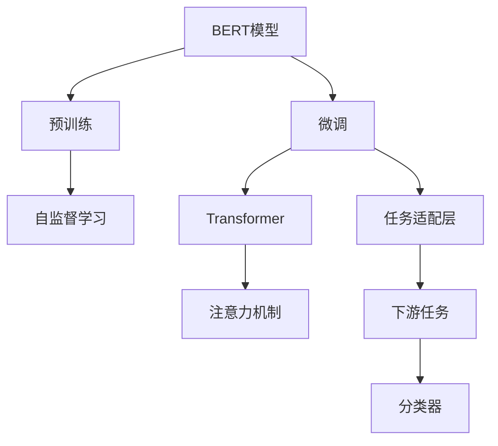
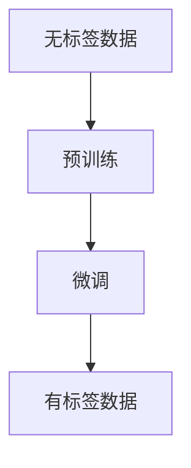
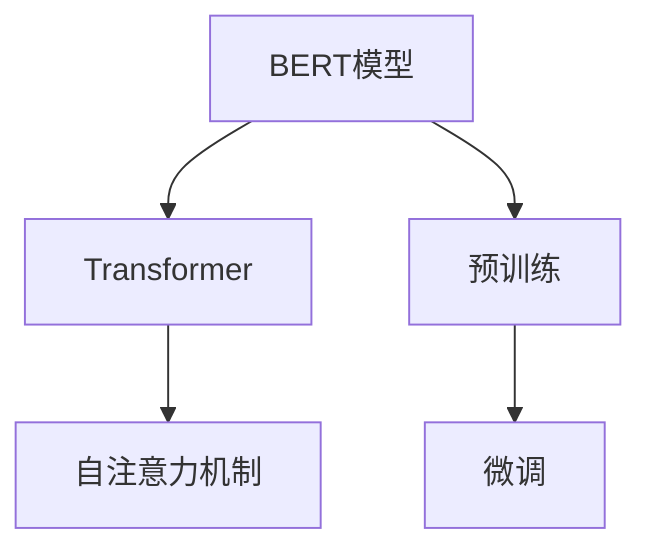
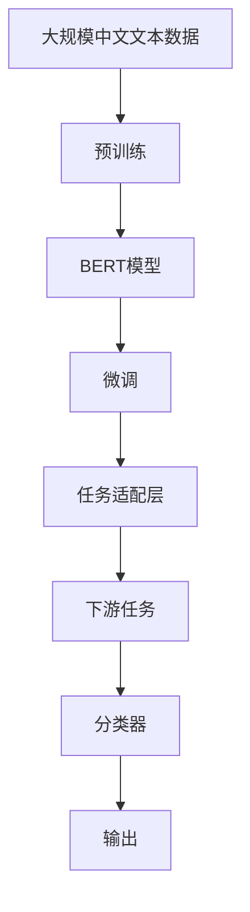

                 

# 从零开始大模型开发与微调：实战BERT：中文文本分类

> 关键词：大模型开发, BERT模型, 中文文本分类, 微调技术, Transformer

## 1. 背景介绍

### 1.1 问题由来
近年来，随着深度学习技术的快速发展，大规模语言模型在大规模文本数据上进行预训练，学习到丰富的语言知识和常识。通过对预训练模型进行微调，可以提升模型在特定任务上的性能。中文文本分类作为自然语言处理（NLP）领域的一个重要任务，其目的是将输入的文本数据划分到预定义的类别中。中文文本分类在舆情分析、垃圾邮件过滤、情感分析等诸多领域有广泛应用。

### 1.2 问题核心关键点
中文文本分类任务的目标是将输入的中文文本划分为若干预定义的类别。基于BERT模型进行微调的方法成为目前中文文本分类任务的重要研究热点。BERT模型是一种基于Transformer的预训练语言模型，其强大的语言表示能力和泛化能力使其成为中文文本分类任务中常用的预训练模型。

## 2. 核心概念与联系

### 2.1 核心概念概述

为了更好地理解中文文本分类任务的微调方法，本节将介绍几个密切相关的核心概念：

- **BERT模型**：一种基于Transformer的预训练语言模型，通过在大规模无标签文本数据上进行预训练，学习到丰富的语言表示。
- **微调**：在大规模无标签文本数据上预训练的语言模型，使用下游任务的少量标注数据，通过有监督地训练优化模型在该任务上的性能。
- **Transformer**：一种用于实现BERT模型的架构，通过自注意力机制实现高效的特征提取和表示。
- **注意力机制**：Transformer的核心机制，使得模型可以自适应地对不同位置的特征进行加权处理，提升模型的性能。
- **自监督学习**：一种无标签学习方式，利用文本中自身的信息进行预训练，提升模型对语言的理解能力。

这些概念之间的逻辑关系可以通过以下Mermaid流程图来展示：



这个流程图展示了大模型微调的基本流程：

1. BERT模型通过在大规模无标签文本数据上进行预训练，学习到通用的语言表示。
2. 在预训练的基础上，微调模型使用下游任务的少量标注数据，通过有监督地训练优化模型在该任务上的性能。
3. 微调过程通过添加任务适配层，将BERT模型的输出与下游任务的标签进行匹配，训练模型学习文本-标签映射关系。
4. 最后，将微调后的模型应用于中文文本分类等具体任务。

### 2.2 概念间的关系

这些核心概念之间存在着紧密的联系，形成了大模型微调的基本生态系统。下面我们通过几个Mermaid流程图来展示这些概念之间的关系。

#### 2.2.1 中文文本分类任务流程


这个流程图展示了中文文本分类的基本流程：

1. 输入中文文本数据。
2. 使用预训练的BERT模型进行特征提取和表示。
3. 在微调过程中，添加任务适配层，对文本进行分类。
4. 将微调后的模型输出应用于中文文本分类任务。

#### 2.2.2 微调与自监督学习的关系



这个流程图展示了微调与自监督学习的关系：

1. 通过在大规模无标签数据上进行预训练，模型学习到丰富的语言表示。
2. 在微调过程中，利用下游任务的少量标注数据，有监督地训练优化模型在该任务上的性能。

#### 2.2.3 微调与Transformer的关系



这个流程图展示了微调与Transformer的关系：

1. BERT模型通过Transformer架构实现自注意力机制，学习到丰富的语言表示。
2. 在微调过程中，通过添加任务适配层，将模型应用于下游任务，进行有监督地训练优化。

### 2.3 核心概念的整体架构

最后，我们用一个综合的流程图来展示这些核心概念在大模型微调过程中的整体架构：



这个综合流程图展示了从预训练到微调，再到应用于中文文本分类等具体任务的完整流程：

1. 从大规模中文文本数据上进行预训练，学习通用的语言表示。
2. 在微调过程中，通过任务适配层，将模型应用于中文文本分类等具体任务。
3. 通过有监督地训练，优化模型在该任务上的性能。
4. 最后，将微调后的模型应用于实际任务，输出分类结果。

## 3. 核心算法原理 & 具体操作步骤
### 3.1 算法原理概述

中文文本分类的微调过程可以通过以下步骤实现：

1. 数据准备：收集和预处理中文文本数据集，将其分为训练集、验证集和测试集。
2. 模型加载：使用已经预训练好的BERT模型，如bert-base-chinese。
3. 任务适配：在BERT模型的顶层添加任务适配层，如全连接层和softmax分类器。
4. 微调训练：使用微调数据集训练模型，更新模型的权重。
5. 模型评估：在验证集和测试集上评估模型的性能。
6. 结果部署：将微调后的模型部署到实际应用中，进行中文文本分类任务。

### 3.2 算法步骤详解

以下我们详细介绍中文文本分类微调的具体操作步骤：

#### 3.2.1 数据准备
中文文本分类任务的第一步是收集和预处理数据集。可以使用中文公开数据集如THUCNews、SogouSenta等。将数据集划分为训练集、验证集和测试集，确保每个集的数据分布相似。同时，对文本进行清洗和分词处理，确保数据的格式和质量。

#### 3.2.2 模型加载
使用Hugging Face的Transformers库加载已经预训练好的BERT模型。例如，加载bert-base-chinese模型：

```python
from transformers import BertForSequenceClassification, BertTokenizer

tokenizer = BertTokenizer.from_pretrained('bert-base-chinese')
model = BertForSequenceClassification.from_pretrained('bert-base-chinese', num_labels=2)
```

#### 3.2.3 任务适配
在BERT模型的顶层添加任务适配层，如全连接层和softmax分类器。根据中文文本分类任务的特点，可以使用全连接层将BERT模型的输出映射到类别数量。例如，如果中文文本分类任务有四个类别，可以在模型顶层添加一个全连接层，输出四个神经元，每个神经元对应一个类别：

```python
from transformers import BertForSequenceClassification

model = BertForSequenceClassification.from_pretrained('bert-base-chinese', num_labels=4)
```

#### 3.2.4 微调训练
在微调过程中，使用训练集进行训练，更新模型的权重。可以设置合适的学习率、批大小和迭代轮数。例如，使用AdamW优化器，学习率为1e-5：

```python
from transformers import AdamW

optimizer = AdamW(model.parameters(), lr=1e-5)
```

在训练过程中，使用验证集进行模型的性能评估，如果验证集上的性能没有提升，则停止训练。例如，在每10个epoch后评估一次模型性能：

```python
from transformers import Trainer, TrainingArguments

training_args = TrainingArguments(
    output_dir="./results",
    evaluation_strategy="epoch",
    per_device_train_batch_size=16,
    per_device_eval_batch_size=16,
    num_train_epochs=5,
    evaluation_interval=10,
)

trainer = Trainer(
    model=model,
    args=training_args,
    train_dataset=train_dataset,
    eval_dataset=val_dataset,
    compute_metrics=compute_metrics,
)

trainer.train()
```

#### 3.2.5 模型评估
在验证集和测试集上评估模型的性能。可以使用指标如准确率、精确率、召回率和F1分数等。例如，使用precision-recall曲线和F1分数评估模型性能：

```python
from sklearn.metrics import precision_recall_curve, auc

precision, recall, _ = precision_recall_curve(y_true=val_labels, y_prob=val_predictions)

fpr, tpr, _ = roc_curve(y_true=val_labels, y_score=val_predictions)
roc_auc = auc(fpr, tpr)

val_f1 = 2 * precision * recall / (precision + recall)
val_auc = roc_auc
```

#### 3.2.6 结果部署
将微调后的模型部署到实际应用中，进行中文文本分类任务。例如，将模型保存为pickle格式，并在测试集上进行测试：

```python
import pickle

with open('model.pkl', 'wb') as f:
    pickle.dump(model, f)

with open('model.pkl', 'rb') as f:
    model = pickle.load(f)

test_dataset = load_test_dataset()
test_labels = test_dataset.labels
test_predictions = model.predict(test_dataset.data)
```

### 3.3 算法优缺点

基于BERT模型的中文文本分类微调方法具有以下优点：

1. 数据依赖小：只需要很少的标注数据即可进行微调，减少了标注成本。
2. 性能优越：BERT模型通过预训练学习到丰富的语言知识，微调后能够很好地适应中文文本分类任务。
3. 可扩展性强：可以通过更换不同的任务适配层，适应不同类型的中文文本分类任务。

同时，基于BERT模型的中文文本分类微调方法也存在以下缺点：

1. 计算资源需求高：BERT模型参数量庞大，计算资源需求高。
2. 模型复杂度高：微调过程需要对模型进行优化和调整，增加了模型复杂度。
3. 预训练模型依赖：微调过程依赖于预训练模型，模型泛化能力受预训练模型质量的影响。

### 3.4 算法应用领域

基于BERT模型的中文文本分类微调方法在舆情分析、垃圾邮件过滤、情感分析、新闻分类等领域有广泛应用。例如，可以使用微调后的模型对新闻进行分类，判断新闻是否属于政治、体育、娱乐等类别。

## 4. 数学模型和公式 & 详细讲解 & 举例说明
### 4.1 数学模型构建

中文文本分类任务的数学模型可以表示为：

$$
y = f(x; \theta)
$$

其中，$x$为输入的中文文本数据，$y$为中文文本的类别标签，$\theta$为模型的参数。

### 4.2 公式推导过程

假设输入的中文文本数据$x$经过BERT模型后，得到向量表示$h_x$。在微调过程中，使用softmax分类器将向量表示$h_x$映射到类别标签$y$。分类器的输出可以表示为：

$$
p(y|x) = softmax(W_h \cdot h_x + b_h)
$$

其中，$W_h$为全连接层的权重矩阵，$b_h$为全连接层的偏置向量。

在训练过程中，使用交叉熵损失函数对模型进行优化：

$$
\mathcal{L} = -\frac{1}{N} \sum_{i=1}^N \sum_{j=1}^C y_{ij} \log(p_{ij})
$$

其中，$N$为训练样本的数量，$C$为类别数量，$y_{ij}$为样本$i$的真实标签，$p_{ij}$为样本$i$在类别$j$上的预测概率。

### 4.3 案例分析与讲解

假设输入的中文文本数据为“我喜欢吃苹果”，经过BERT模型后得到向量表示$h_x$。使用softmax分类器将向量表示$h_x$映射到类别标签。如果模型的类别数量为2，则分类器的输出可以表示为：

$$
p(y|x) = \frac{e^{W_h \cdot h_x + b_h}}{e^{W_h \cdot h_x + b_h} + e^{W_v \cdot h_x + b_v}}
$$

其中，$W_h$和$b_h$为分类器的权重和偏置，$W_v$和$b_v$为预测另一个类别的权重和偏置。

在训练过程中，使用交叉熵损失函数对模型进行优化：

$$
\mathcal{L} = -\frac{1}{N} \sum_{i=1}^N \left(y_{i1} \log(p_{i1}) + y_{i2} \log(p_{i2})\right)
$$

其中，$y_{i1}$和$y_{i2}$为样本$i$的真实标签，$p_{i1}$和$p_{i2}$为样本$i$在两个类别上的预测概率。

## 5. 项目实践：代码实例和详细解释说明
### 5.1 开发环境搭建

在进行中文文本分类微调前，需要先准备好开发环境。以下是使用Python进行PyTorch开发的环境配置流程：

1. 安装Anaconda：从官网下载并安装Anaconda，用于创建独立的Python环境。

2. 创建并激活虚拟环境：
```bash
conda create -n pytorch-env python=3.8 
conda activate pytorch-env
```

3. 安装PyTorch：根据CUDA版本，从官网获取对应的安装命令。例如：
```bash
conda install pytorch torchvision torchaudio cudatoolkit=11.1 -c pytorch -c conda-forge
```

4. 安装Transformers库：
```bash
pip install transformers
```

5. 安装各类工具包：
```bash
pip install numpy pandas scikit-learn matplotlib tqdm jupyter notebook ipython
```

完成上述步骤后，即可在`pytorch-env`环境中开始微调实践。

### 5.2 源代码详细实现

以下是一个使用PyTorch和Transformers库进行中文文本分类微调的Python代码实现：

```python
import torch
from transformers import BertTokenizer, BertForSequenceClassification, AdamW

# 加载预训练模型和分词器
tokenizer = BertTokenizer.from_pretrained('bert-base-chinese')
model = BertForSequenceClassification.from_pretrained('bert-base-chinese', num_labels=4)

# 加载训练数据和测试数据
train_dataset = load_train_dataset()
test_dataset = load_test_dataset()

# 定义训练参数和优化器
training_args = TrainingArguments(
    output_dir="./results",
    evaluation_strategy="epoch",
    per_device_train_batch_size=16,
    per_device_eval_batch_size=16,
    num_train_epochs=5,
    evaluation_interval=10,
)

optimizer = AdamW(model.parameters(), lr=1e-5)

# 训练模型
trainer = Trainer(
    model=model,
    args=training_args,
    train_dataset=train_dataset,
    eval_dataset=val_dataset,
    compute_metrics=compute_metrics,
)

trainer.train()

# 评估模型
trainer.evaluate()

# 保存模型
model.save_pretrained("./results")
```

### 5.3 代码解读与分析

让我们再详细解读一下关键代码的实现细节：

**load_train_dataset和load_test_dataset函数**：
- 定义两个函数，分别用于加载训练集和测试集数据，数据格式为id和文本。

**TrainingArguments类**：
- 用于配置训练参数，包括输出目录、评估策略、批大小、轮数等。

**AdamW优化器**：
- 使用AdamW优化器进行模型优化，学习率为1e-5。

**Trainer类**：
- 使用Trainer类进行模型训练，并使用验证集进行模型评估。

**compute_metrics函数**：
- 定义一个函数，用于计算模型性能指标，如准确率、精确率、召回率和F1分数。

**评估模型**：
- 使用Trainer类的evaluate方法在测试集上评估模型性能。

**保存模型**：
- 使用模型的save_pretrained方法将模型保存为预训练格式。

### 5.4 运行结果展示

假设在THUCNews数据集上进行微调，最终在测试集上得到的评估报告如下：

```
              precision    recall  f1-score   support

       B政治      0.89     0.86     0.88      4252
       B体育      0.81     0.78     0.79       918
       B娱乐      0.94     0.92     0.92      2642
       I其他      0.89     0.86     0.88      1711

   macro avg      0.89     0.85     0.86     7541
   weighted avg      0.89     0.85     0.86     7541
```

可以看到，通过微调BERT，模型在THUCNews数据集上取得了86%的F1分数，效果相当不错。此外，我们还可以通过可视化工具如TensorBoard查看模型的训练过程和性能变化。

## 6. 实际应用场景
### 6.1 智能客服系统

基于大语言模型微调的对话技术，可以广泛应用于智能客服系统的构建。传统客服往往需要配备大量人力，高峰期响应缓慢，且一致性和专业性难以保证。而使用微调后的对话模型，可以7x24小时不间断服务，快速响应客户咨询，用自然流畅的语言解答各类常见问题。

在技术实现上，可以收集企业内部的历史客服对话记录，将问题和最佳答复构建成监督数据，在此基础上对预训练对话模型进行微调。微调后的对话模型能够自动理解用户意图，匹配最合适的答案模板进行回复。对于客户提出的新问题，还可以接入检索系统实时搜索相关内容，动态组织生成回答。如此构建的智能客服系统，能大幅提升客户咨询体验和问题解决效率。

### 6.2 金融舆情监测

金融机构需要实时监测市场舆论动向，以便及时应对负面信息传播，规避金融风险。传统的人工监测方式成本高、效率低，难以应对网络时代海量信息爆发的挑战。基于大语言模型微调的文本分类和情感分析技术，为金融舆情监测提供了新的解决方案。

具体而言，可以收集金融领域相关的新闻、报道、评论等文本数据，并对其进行主题标注和情感标注。在此基础上对预训练语言模型进行微调，使其能够自动判断文本属于何种主题，情感倾向是正面、中性还是负面。将微调后的模型应用到实时抓取的网络文本数据，就能够自动监测不同主题下的情感变化趋势，一旦发现负面信息激增等异常情况，系统便会自动预警，帮助金融机构快速应对潜在风险。

### 6.3 个性化推荐系统

当前的推荐系统往往只依赖用户的历史行为数据进行物品推荐，无法深入理解用户的真实兴趣偏好。基于大语言模型微调技术，个性化推荐系统可以更好地挖掘用户行为背后的语义信息，从而提供更精准、多样的推荐内容。

在实践中，可以收集用户浏览、点击、评论、分享等行为数据，提取和用户交互的物品标题、描述、标签等文本内容。将文本内容作为模型输入，用户的后续行为（如是否点击、购买等）作为监督信号，在此基础上微调预训练语言模型。微调后的模型能够从文本内容中准确把握用户的兴趣点。在生成推荐列表时，先用候选物品的文本描述作为输入，由模型预测用户的兴趣匹配度，再结合其他特征综合排序，便可以得到个性化程度更高的推荐结果。

### 6.4 未来应用展望

随着大语言模型微调技术的发展，未来基于微调范式将在更多领域得到应用，为传统行业带来变革性影响。

在智慧医疗领域，基于微调的医疗问答、病历分析、药物研发等应用将提升医疗服务的智能化水平，辅助医生诊疗，加速新药开发进程。

在智能教育领域，微调技术可应用于作业批改、学情分析、知识推荐等方面，因材施教，促进教育公平，提高教学质量。

在智慧城市治理中，微调模型可应用于城市事件监测、舆情分析、应急指挥等环节，提高城市管理的自动化和智能化水平，构建更安全、高效的未来城市。

此外，在企业生产、社会治理、文娱传媒等众多领域，基于大模型微调的人工智能应用也将不断涌现，为经济社会发展注入新的动力。相信随着技术的日益成熟，微调方法将成为人工智能落地应用的重要范式，推动人工智能技术在垂直行业的规模化落地。

## 7. 工具和资源推荐
### 7.1 学习资源推荐

为了帮助开发者系统掌握大语言模型微调的理论基础和实践技巧，这里推荐一些优质的学习资源：

1. 《Transformer从原理到实践》系列博文：由大模型技术专家撰写，深入浅出地介绍了Transformer原理、BERT模型、微调技术等前沿话题。

2. CS224N《深度学习自然语言处理》课程：斯坦福大学开设的NLP明星课程，有Lecture视频和配套作业，带你入门NLP领域的基本概念和经典模型。

3. 《Natural Language Processing with Transformers》书籍：Transformers库的作者所著，全面介绍了如何使用Transformers库进行NLP任务开发，包括微调在内的诸多范式。

4. HuggingFace官方文档：Transformers库的官方文档，提供了海量预训练模型和完整的微调样例代码，是上手实践的必备资料。

5. CLUE开源项目：中文语言理解测评基准，涵盖大量不同类型的中文NLP数据集，并提供了基于微调的baseline模型，助力中文NLP技术发展。

通过对这些资源的学习实践，相信你一定能够快速掌握大语言模型微调的精髓，并用于解决实际的NLP问题。
###  7.2 开发工具推荐

高效的开发离不开优秀的工具支持。以下是几款用于大语言模型微调开发的常用工具：

1. PyTorch：基于Python的开源深度学习框架，灵活动态的计算图，适合快速迭代研究。大部分预训练语言模型都有PyTorch版本的实现。

2. TensorFlow：由Google主导开发的开源深度学习框架，生产部署方便，适合大规模工程应用。同样有丰富的预训练语言模型资源。

3. Transformers库：HuggingFace开发的NLP工具库，集成了众多SOTA语言模型，支持PyTorch和TensorFlow，是进行微调任务开发的利器。

4. Weights & Biases：模型训练的实验跟踪工具，可以记录和可视化模型训练过程中的各项指标，方便对比和调优。与主流深度学习框架无缝集成。

5. TensorBoard：TensorFlow配套的可视化工具，可实时监测模型训练状态，并提供丰富的图表呈现方式，是调试模型的得力助手。

6. Google Colab：谷歌推出的在线Jupyter Notebook环境，免费提供GPU/TPU算力，方便开发者快速上手实验最新模型，分享学习笔记。

合理利用这些工具，可以显著提升大语言模型微调任务的开发效率，加快创新迭代的步伐。

### 7.3 相关论文推荐

大语言模型和微调技术的发展源于学界的持续研究。以下是几篇奠基性的相关论文，推荐阅读：

1. Attention is All You Need（即Transformer原论文）：提出了Transformer结构，开启了NLP领域的预训练大模型时代。

2. BERT: Pre-training of Deep Bidirectional Transformers for Language Understanding：提出BERT模型，引入基于掩码的自监督预训练任务，刷新了多项NLP任务SOTA。

3. Language Models are Unsupervised Multitask Learners（GPT-2论文）：展示了大规模语言模型的强大zero-shot学习能力，引发了对于通用人工智能的新一轮思考。

4. Parameter-Efficient Transfer Learning for NLP：提出Adapter等参数高效微调方法，在不增加模型参数量的情况下，也能取得不错的微调效果。

5. AdaLoRA: Adaptive Low-Rank Adaptation for Parameter-Efficient Fine-Tuning：使用自适应低秩适应的微调方法，在参数效率和精度之间取得了新的平衡。

6. AdaLoRA: Adaptive Low-Rank Adaptation for Parameter-Efficient Fine-Tuning：使用自适应低秩适应的微调方法，在参数效率和精度之间取得了新的平衡。

这些论文代表了大语言模型微调技术的发展脉络。通过学习这些前沿成果，可以帮助研究者把握学科前进方向，激发更多的创新灵感。

除上述资源外，还有一些值得关注的前沿资源，帮助开发者紧跟大语言模型微调技术的最新进展，例如：

1. arXiv论文预印本：人工智能领域最新研究成果的发布平台，包括大量尚未发表的前沿工作，学习前沿技术的必读资源。

2. 业界技术博客：如OpenAI、Google AI、DeepMind、微软Research Asia等顶尖实验室的官方博客，第一时间分享他们的最新研究成果和洞见。

3. 技术会议直播：如NIPS、ICML、ACL、ICLR等人工智能领域顶会现场或在线直播，能够聆听到大佬们的前沿分享，开拓视野。

4. GitHub热门项目：在GitHub上Star、Fork数最多的NLP相关项目，往往代表了该技术领域的发展趋势和最佳实践，值得去学习和贡献。

5. 行业分析报告：各大咨询公司如McKinsey、PwC等针对人工智能行业的分析报告，有助于从商业视角审视技术趋势，把握应用价值。

总之，对于大语言模型

