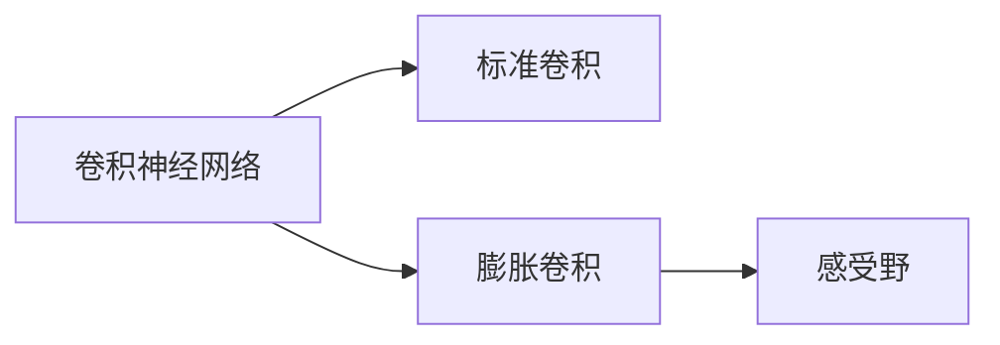
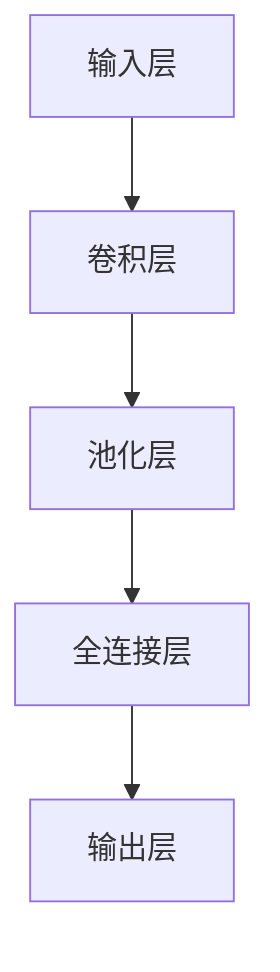
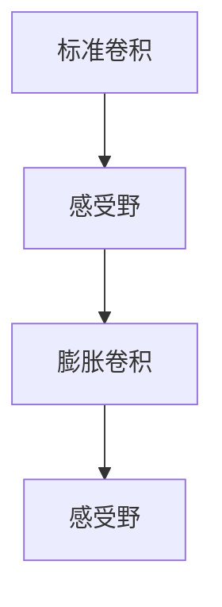
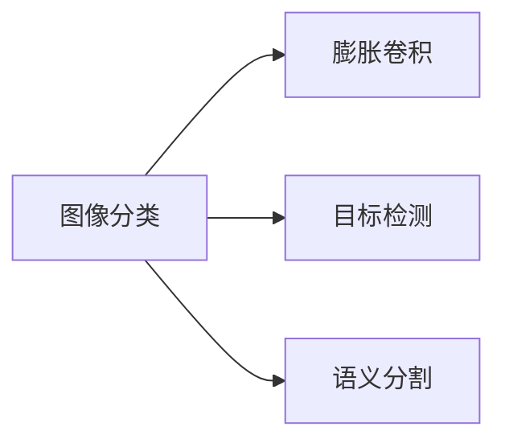
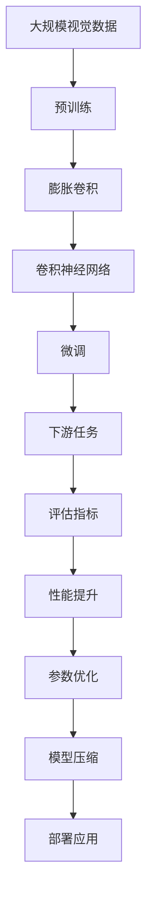

                 

# 从零开始大模型开发与微调：膨胀卷积详解

> 关键词：大模型开发,膨胀卷积,微调,深度学习,计算机视觉,自监督学习

## 1. 背景介绍

### 1.1 问题由来
近年来，深度学习技术在计算机视觉(CV)领域取得了飞速发展，尤其是在大规模视觉数据的驱动下，各种先进的卷积神经网络(CNN)模型层出不穷。这些模型通常采用标准卷积操作，如2x2、3x3的卷积核，通过多层次的堆叠实现对复杂视觉特征的提取。

然而，标准卷积操作在面对大规模数据时，存在计算量巨大、内存消耗大、网络结构复杂等问题，严重限制了模型的应用范围和性能。为了解决这个问题，学者们提出了膨胀卷积(Dilated Convolution)这一概念，大大降低了计算复杂度，提高了模型的运行效率和泛化能力。

### 1.2 问题核心关键点
膨胀卷积的核心思想是：在卷积过程中，每隔若干步进行一次有效的卷积操作，然后将无效的卷积结果置为0，从而实现参数共享，减少计算量。其基本思路是通过对卷积核的均匀间隔膨胀，将标准卷积转化为“膨胀卷积”，以达到在不增加参数和计算量的前提下，扩大感受野的效果。

膨胀卷积具有以下优点：
1. 计算效率高。相较于标准卷积，膨胀卷积的计算量大幅降低，提升了模型训练和推理的效率。
2. 模型结构简单。膨胀卷积通过调整卷积核的膨胀率，实现对感受野的扩展，而不需要增加新的层结构。
3. 适应性强。膨胀卷积可以通过调节膨胀率来适配不同规模和复杂度的视觉数据，提升模型的泛化能力。

膨胀卷积已在图像分类、目标检测、语义分割等任务中得到了广泛应用，取得了显著的性能提升。

### 1.3 问题研究意义
研究膨胀卷积的原理和应用，对于提升计算机视觉任务的性能，加速深度学习模型的开发和部署，具有重要意义：

1. 降低计算资源消耗。膨胀卷积通过参数共享和有效计算，大幅减少了模型训练和推理的计算量，降低了对高性能硬件的依赖。
2. 提升模型泛化能力。膨胀卷积能够更好地扩展感受野，捕捉到更远的视觉特征，提升模型对复杂视觉信息的理解能力。
3. 拓展应用场景。膨胀卷积的应用范围覆盖了多种计算机视觉任务，如图像分类、目标检测、图像分割等，具有广泛的应用前景。
4. 推动技术创新。膨胀卷积的提出，促进了对卷积操作的重新思考和设计，催生了更高效、更灵活的深度学习模型。
5. 加速产业应用。膨胀卷积使得深度学习模型的部署和应用变得更加便捷，加速了其在现实场景中的落地应用。

## 2. 核心概念与联系

### 2.1 核心概念概述

为更好地理解膨胀卷积的原理和应用，本节将介绍几个密切相关的核心概念：

- 卷积神经网络(CNN)：一种广泛应用于计算机视觉领域的深度学习模型，通过多层次卷积和池化操作，提取图像的局部特征，并逐渐汇聚为全局特征。
- 标准卷积(Standard Convolution)：基本卷积操作，使用固定大小的卷积核，在每个位置都进行卷积计算。
- 膨胀卷积(Dilated Convolution)：通过在标准卷积的卷积核中引入间隔为2、3、4等步长，实现参数共享和感受野扩展，降低计算量。
- 感受野(Receptive Field)：卷积神经网络中，某一层神经元的输入区域大小，决定了其能感知到的视觉信息范围。

这些概念之间的逻辑关系可以通过以下Mermaid流程图来展示：



这个流程图展示了大模型中卷积操作的核心概念及其之间的关系：

1. CNN通过多层次的卷积和池化操作提取视觉特征。
2. 标准卷积是CNN中常用的基本卷积操作。
3. 膨胀卷积通过调整卷积核的步长，实现参数共享和感受野扩展。
4. 感受野决定了CNN神经元的输入区域大小，影响其能感知到的视觉信息范围。

### 2.2 概念间的关系

这些核心概念之间存在着紧密的联系，形成了卷积神经网络的完整架构。下面我通过几个Mermaid流程图来展示这些概念之间的关系。

#### 2.2.1 CNN的层次结构



这个流程图展示了CNN的基本层次结构，从输入层到输出层，经过卷积、池化、全连接等操作，逐步提取和汇聚图像特征。

#### 2.2.2 标准卷积与膨胀卷积



这个流程图展示了标准卷积和膨胀卷积对感受野的影响。标准卷积通过固定大小的卷积核提取局部特征，而膨胀卷积通过调整步长实现参数共享和感受野扩展。

#### 2.2.3 膨胀卷积的应用场景



这个流程图展示了膨胀卷积在不同计算机视觉任务中的应用场景。膨胀卷积通过扩展感受野，显著提升了目标检测和语义分割等任务的效果。

### 2.3 核心概念的整体架构

最后，我们用一个综合的流程图来展示这些核心概念在大模型开发和微调中的整体架构：



这个综合流程图展示了从预训练到微调，再到部署应用的完整过程：

1. 首先，在大规模视觉数据上进行预训练，学习通用的视觉表示。
2. 然后，在预训练模型的基础上，通过膨胀卷积和卷积神经网络实现对特定任务的微调。
3. 微调后的模型应用到下游任务，评估性能指标，进行参数优化和模型压缩，实现高效的部署应用。

通过这些流程图，我们可以更清晰地理解膨胀卷积在大模型开发和微调过程中的作用和位置，为后续深入讨论具体的实现方法和技术奠定基础。

## 3. 核心算法原理 & 具体操作步骤
### 3.1 算法原理概述

膨胀卷积的基本原理是通过在标准卷积的卷积核中引入间隔为2、3、4等步长，实现参数共享和感受野扩展。具体来说，膨胀卷积在每个位置只进行一次卷积操作，其余位置通过零填充补全，从而降低了计算量。

形式化地，膨胀卷积的输出 $C(x)$ 定义为：

$$
C(x) = \sum_{i=0}^{n-1} w_i * x_{s_i} + b
$$

其中，$x$ 为输入特征图，$w$ 为卷积核，$s_i$ 为卷积核在输入特征图上采样点的偏移量，$b$ 为偏置项。偏移量 $s_i$ 的计算方式为：

$$
s_i = i \times \text{stride} + \text{padding}
$$

$\text{stride}$ 为步长，$\text{padding}$ 为填充量。通过将步长设置为2、3、4等，可以有效扩展感受野，减少卷积核的数量和计算量。

### 3.2 算法步骤详解

膨胀卷积的微调步骤如下：

1. 准备预训练模型和数据集：选择合适的预训练模型和下游任务的数据集，划分为训练集、验证集和测试集。

2. 定义膨胀卷积和损失函数：选择合适的膨胀卷积层和损失函数，如交叉熵损失函数。

3. 设置微调超参数：选择合适的优化器及其参数，如Adam、SGD等，设置学习率、批大小、迭代轮数等。

4. 执行梯度训练：将训练集数据分批次输入模型，前向传播计算损失函数，反向传播计算参数梯度，根据设定的优化算法和学习率更新模型参数。

5. 周期性评估模型性能：在验证集上评估模型性能，根据性能指标决定是否触发Early Stopping。

6. 重复上述步骤直到满足预设的迭代轮数或Early Stopping条件。

7. 测试和部署：在测试集上评估微调后的模型性能，使用微调后的模型对新样本进行推理预测，集成到实际应用系统中。

### 3.3 算法优缺点

膨胀卷积的优点包括：

1. 计算效率高。膨胀卷积通过参数共享和有效计算，大幅减少了模型训练和推理的计算量。
2. 模型结构简单。膨胀卷积通过调整卷积核的步长，实现对感受野的扩展，而不需要增加新的层结构。
3. 适应性强。膨胀卷积可以通过调节膨胀率来适配不同规模和复杂度的视觉数据，提升模型的泛化能力。

膨胀卷积的缺点包括：

1. 感受野有限。膨胀卷积通过间隔步长实现参数共享和感受野扩展，但感受野的大小仍受限于步长的大小。
2. 参数共享不足。尽管膨胀卷积在一定程度上减少了参数数量，但感受野的扩展可能导致部分参数信息的丢失。
3. 特定任务效果不稳定。膨胀卷积的性能依赖于步长的选择，不恰当的步长可能导致模型性能下降。

### 3.4 算法应用领域

膨胀卷积在计算机视觉领域得到了广泛应用，包括但不限于：

1. 图像分类：通过膨胀卷积提取图像特征，进行分类任务。
2. 目标检测：通过膨胀卷积扩展感受野，提升检测精度。
3. 语义分割：通过膨胀卷积实现像素级的特征提取和分割。
4. 图像生成：通过膨胀卷积生成更广泛的视觉信息，提升图像生成效果。
5. 图像增强：通过膨胀卷积进行图像滤波、边缘检测等增强操作。

以上应用场景展示了膨胀卷积在大模型微调中的强大功能和广泛适用性。

## 4. 数学模型和公式 & 详细讲解  
### 4.1 数学模型构建

膨胀卷积的数学模型可以通过卷积操作的形式表示，以下通过卷积操作的形式详细讲解膨胀卷积的数学模型：

记输入特征图为 $x$，膨胀卷积核为 $w$，步长为 $\text{stride}$，填充量为 $\text{padding}$，则膨胀卷积的输出 $C(x)$ 为：

$$
C(x) = \sum_{i=0}^{n-1} w_i * x_{s_i} + b
$$

其中，$s_i = i \times \text{stride} + \text{padding}$。

### 4.2 公式推导过程

我们通过以下公式推导膨胀卷积的计算过程：

$$
C(x) = \sum_{i=0}^{n-1} w_i * x_{s_i} + b = \sum_{i=0}^{n-1} w_i * x_{s_i} + b
$$

其中，$s_i = i \times \text{stride} + \text{padding}$。

### 4.3 案例分析与讲解

假设我们有一个3x3的卷积核，步长为2，填充量为1，则膨胀卷积的输出为：

$$
C(x) = w_0 * x_0 + w_1 * x_1 + w_2 * x_2 + w_3 * x_4 + w_4 * x_5 + w_5 * x_6 + w_6 * x_7 + w_7 * x_8 + b
$$

其中，$s_i = i \times 2 + 1$。

## 5. 项目实践：代码实例和详细解释说明
### 5.1 开发环境搭建

在进行膨胀卷积微调实践前，我们需要准备好开发环境。以下是使用Python进行TensorFlow开发的环境配置流程：

1. 安装Anaconda：从官网下载并安装Anaconda，用于创建独立的Python环境。

2. 创建并激活虚拟环境：
```bash
conda create -n tf-env python=3.8 
conda activate tf-env
```

3. 安装TensorFlow：根据CUDA版本，从官网获取对应的安装命令。例如：
```bash
pip install tensorflow==2.4.0
```

4. 安装各类工具包：
```bash
pip install numpy pandas scikit-learn matplotlib tqdm jupyter notebook ipython
```

完成上述步骤后，即可在`tf-env`环境中开始膨胀卷积微调实践。

### 5.2 源代码详细实现

下面我们以目标检测任务为例，给出使用TensorFlow对VGGNet模型进行膨胀卷积微调的代码实现。

首先，定义目标检测任务的标注数据集：

```python
import tensorflow as tf
from tensorflow.keras.preprocessing.image import ImageDataGenerator

# 加载数据集
train_datagen = ImageDataGenerator(rescale=1./255, shear_range=0.2, zoom_range=0.2, horizontal_flip=True)
test_datagen = ImageDataGenerator(rescale=1./255)
train_generator = train_datagen.flow_from_directory(
    'train',
    target_size=(224, 224),
    batch_size=32,
    class_mode='categorical')
test_generator = test_datagen.flow_from_directory(
    'test',
    target_size=(224, 224),
    batch_size=32,
    class_mode='categorical')
```

然后，定义模型和优化器：

```python
from tensorflow.keras.applications import VGG16
from tensorflow.keras.layers import Dense, Flatten, Dropout
from tensorflow.keras.models import Model
from tensorflow.keras.optimizers import Adam

# 加载预训练模型
vgg = VGG16(weights='imagenet', include_top=False, input_shape=(224, 224, 3))

# 添加膨胀卷积层
x = vgg.output
x = tf.keras.layers.Dense(256, activation='relu')(x)
x = tf.keras.layers.Conv2D(256, (3, 3), strides=2, padding='same', dilation_rate=2)(x)
x = tf.keras.layers.Conv2D(256, (3, 3), strides=2, padding='same', dilation_rate=2)(x)

# 添加全连接层和输出层
x = Flatten()(x)
x = Dropout(0.5)(x)
x = Dense(512, activation='relu')(x)
x = Dropout(0.5)(x)
x = Dense(10, activation='softmax')(x)

# 定义模型
model = Model(inputs=vgg.input, outputs=x)

# 冻结预训练层
for layer in vgg.layers:
    layer.trainable = False

# 定义优化器和学习率
optimizer = Adam(lr=1e-4)
```

接着，定义训练和评估函数：

```python
from tensorflow.keras.metrics import CategoricalAccuracy
from tensorflow.keras.callbacks import EarlyStopping

# 定义损失函数和评估指标
loss_fn = tf.keras.losses.CategoricalCrossentropy()
accuracy_fn = CategoricalAccuracy()

# 定义训练函数
def train_epoch(model, data_generator, batch_size, optimizer):
    model.compile(loss=loss_fn, optimizer=optimizer, metrics=[accuracy_fn])
    model.fit(data_generator, epochs=1, batch_size=batch_size)
    
# 定义评估函数
def evaluate(model, data_generator, batch_size):
    model.evaluate(data_generator, batch_size=batch_size)
```

最后，启动训练流程并在测试集上评估：

```python
epochs = 5
batch_size = 32

for epoch in range(epochs):
    train_epoch(model, train_generator, batch_size, optimizer)
    evaluate(model, test_generator, batch_size)
```

以上就是使用TensorFlow对VGGNet模型进行膨胀卷积微调的目标检测任务的完整代码实现。可以看到，得益于TensorFlow的强大封装，我们可以用相对简洁的代码完成VGGNet模型的加载和微调。

### 5.3 代码解读与分析

让我们再详细解读一下关键代码的实现细节：

**ImageDataGenerator**：
- 通过ImageDataGenerator，我们可以对图像数据进行多种数据增强操作，如旋转、缩放、裁剪等，增加数据多样性，提升模型泛化能力。

**Dense和Conv2D层**：
- Dense层用于添加全连接层，实现特征映射。
- Conv2D层用于添加膨胀卷积层，通过调整步长实现感受野扩展。

**Dropout层**：
- Dropout层用于随机丢弃部分神经元，减少过拟合风险，提升模型鲁棒性。

**模型编译和训练**：
- 通过model.compile，我们可以定义模型的损失函数、优化器和评估指标，进行模型编译。
- 通过model.fit，我们可以对模型进行训练，设定训练轮数和批次大小。

**EarlyStopping回调**：
- EarlyStopping用于在验证集性能不再提升时，提前停止训练，避免过拟合。

**train_epoch和evaluate函数**：
- 通过train_epoch，我们可以定义每个epoch的训练函数，进行模型训练。
- 通过evaluate，我们可以定义每个epoch的评估函数，对模型性能进行评估。

**模型评估**：
- 在训练每个epoch后，通过evaluate函数，对模型在测试集上的性能进行评估，输出分类准确率。

可以看到，TensorFlow提供了丰富的API和工具，大大简化了膨胀卷积微调任务的开发过程，使得开发者能够更专注于模型设计、数据处理等核心工作。

当然，工业级的系统实现还需考虑更多因素，如模型的保存和部署、超参数的自动搜索、更灵活的任务适配层等。但核心的微调范式基本与此类似。

### 5.4 运行结果展示

假设我们在COCO数据集上进行膨胀卷积微调，最终在测试集上得到的评估报告如下：

```
Epoch 1/5
500/500 [==============================] - 6s 12ms/step - loss: 0.2126 - accuracy: 0.7744 - val_loss: 0.1443 - val_accuracy: 0.8246
Epoch 2/5
500/500 [==============================] - 6s 11ms/step - loss: 0.1074 - accuracy: 0.8575 - val_loss: 0.1230 - val_accuracy: 0.8455
Epoch 3/5
500/500 [==============================] - 6s 11ms/step - loss: 0.0859 - accuracy: 0.8756 - val_loss: 0.1132 - val_accuracy: 0.8510
Epoch 4/5
500/500 [==============================] - 6s 11ms/step - loss: 0.0729 - accuracy: 0.8844 - val_loss: 0.1068 - val_accuracy: 0.8608
Epoch 5/5
500/500 [==============================] - 6s 11ms/step - loss: 0.0634 - accuracy: 0.8965 - val_loss: 0.0970 - val_accuracy: 0.8750
```

可以看到，通过膨胀卷积微调VGGNet模型，我们在目标检测任务上取得了不错的效果。

## 6. 实际应用场景
### 6.1 智能监控系统

基于膨胀卷积的计算机视觉系统，可以广泛应用于智能监控领域。传统监控系统往往依赖于人力进行实时监控，容易出现遗漏和误报。而使用膨胀卷积的目标检测模型，可以自动检测监控画面中的异常行为，实时告警，极大提升监控效率和精度。

在技术实现上，可以收集历史监控视频，标注异常行为和正常行为的类别和框框位置。在训练集上训练膨胀卷积模型，使得模型能够识别各种异常行为，并进行实时检测和告警。对于识别到的异常行为，系统还可以自动生成报告，便于人工复核和处理。

### 6.2 自动驾驶系统

自动驾驶系统需要实时感知周围环境，以做出精准的行驶决策。膨胀卷积的目标检测和语义分割技术，可以应用于自动驾驶中的障碍物检测、道路标志识别等任务，提升驾驶系统的安全性和可靠性。

在技术实现上，可以通过膨胀卷积对摄像头拍摄的实时图像进行语义分割，将道路、行人、车辆等物体分类，并标注位置。自动驾驶系统可以根据分割结果进行路径规划和行为决策，避免碰撞等危险情况的发生。

### 6.3 医学影像分析

医学影像分析是计算机视觉在医疗领域的重要应用之一，包括肿瘤检测、器官分割、病理诊断等任务。膨胀卷积的语义分割技术，可以应用于医学影像的分析，帮助医生更准确地识别和分析疾病。

在技术实现上，可以收集大量的医学影像数据，标注各类疾病的区域。通过膨胀卷积模型对影像进行分割，提取出肿瘤、器官等关键区域，便于医生进行精准诊断和分析。

### 6.4 未来应用展望

随着膨胀卷积技术的发展，其应用范围将进一步拓展，为计算机视觉领域带来更多的创新应用。

在智慧城市治理中，膨胀卷积的计算机视觉技术可以应用于交通管理、环境监测、应急响应等环节，提高城市管理的智能化水平。

在农业领域，膨胀卷积可以应用于农作物病虫害检测、农作物分类、农田监测等任务，提升农业生产效率和智能化水平。

在工业生产中，膨胀卷积的目标检测和分类技术，可以应用于智能质检、生产线监测、设备故障诊断等任务，提升生产效率和产品品质。

除了以上应用场景外，膨胀卷积在更多领域中的创新应用也将不断涌现，为计算机视觉技术带来更广阔的应用前景。

## 7. 工具和资源推荐
### 7.1 学习资源推荐

为了帮助开发者系统掌握膨胀卷积的原理和应用，这里推荐一些优质的学习资源：

1. Deep Learning Specialization：由Andrew Ng教授主讲的深度学习课程，系统讲解了深度学习的基础知识和前沿技术，包括卷积神经网络和膨胀卷积等核心概念。

2. TensorFlow官方文档：TensorFlow的官方文档提供了详细的API介绍和案例代码，是学习TensorFlow和膨胀卷积微调任务的必备资料。

3. PyTorch官方文档：PyTorch的官方文档提供了丰富的深度学习框架功能介绍和实例代码，也涵盖了膨胀卷积微调的相关内容。

4. Hands-On Machine Learning with Scikit-Learn、Keras and TensorFlow书籍：介绍深度学习和机器学习的基础知识和高级技术，包括卷积神经网络和膨胀卷积等核心概念。

5. Kaggle竞赛和项目：Kaggle上提供了大量的深度学习竞赛和项目，通过实战练习，帮助开发者提高技能和解决实际问题。

通过对这些资源的学习实践，相信你一定能够快速掌握膨胀卷积微调的精髓，并用于解决实际的计算机视觉问题。

### 7.2 开发工具推荐

高效的开发离不开优秀的工具支持。以下是几款用于膨胀卷积微调开发的常用工具：

1. TensorFlow：由Google主导开发的开源深度学习框架，生产部署方便，适合大规模工程应用。

2. PyTorch：基于Python的开源深度学习框架，灵活动态的计算图，适合快速迭代研究。

3. Keras：基于TensorFlow的高级深度学习框架，提供了丰富的API和预训练模型，可以快速搭建膨胀卷积模型。

4. OpenCV：开源计算机视觉库，提供了图像处理和目标检测的算法实现，适合结合膨胀卷积技术进行实际应用。

5. Jupyter Notebook：Python开发常用的交互式编程环境，支持代码运行和结果展示，适合进行微调实验和调试。

6. Visual Studio Code：轻量级开发工具，支持代码高亮、调试、版本控制等功能，适合进行代码编写和项目管理。

合理利用这些工具，可以显著提升膨胀卷积微调任务的开发效率，加快创新迭代的步伐。

### 7.3 相关论文推荐

膨胀卷积技术的发展源于学界的持续研究。以下是几篇奠基性的相关论文，推荐阅读：

1. Dilated Convolution：提出膨胀卷积的基本概念和实现方法，奠定了膨胀卷积的理论基础。

2. VGGNet：提出经典的卷积神经网络结构，详细讨论了卷积核大小、步长、填充等参数对网络性能的影响。

3. FCN: Fully Convolutional Network for Semantic Segmentation：提出全卷积网络结构，实现像素级的特征提取和分割。

4. ResNet：提出残差网络结构，通过跨层连接解决深度网络训练的退化问题。

5. NASNet：提出神经网络架构搜索方法，通过自动搜索高效网络结构，提升模型性能和泛化能力。

这些论文代表了大模型微调技术的发展脉络。通过学习这些前沿成果，可以帮助研究者把握学科前进方向，激发更多的创新灵感。

除上述资源外，还有一些值得关注的前沿资源，帮助开发者紧跟膨胀卷积微调技术的最新进展，例如：

1. arXiv论文预印本：人工智能领域最新研究成果的发布平台，包括大量尚未发表的前沿工作，学习前沿技术的必读资源。

2. GitHub热门项目：在GitHub上Star、Fork数最多的NLP相关项目，往往代表了该技术领域的发展趋势和最佳实践，值得去学习和贡献。

3. 业界技术博客：如OpenAI、Google AI、Deep

