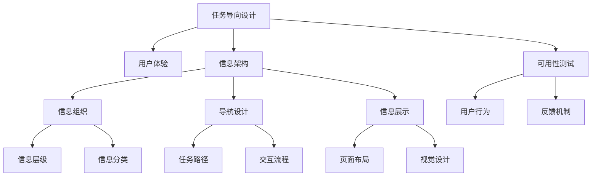
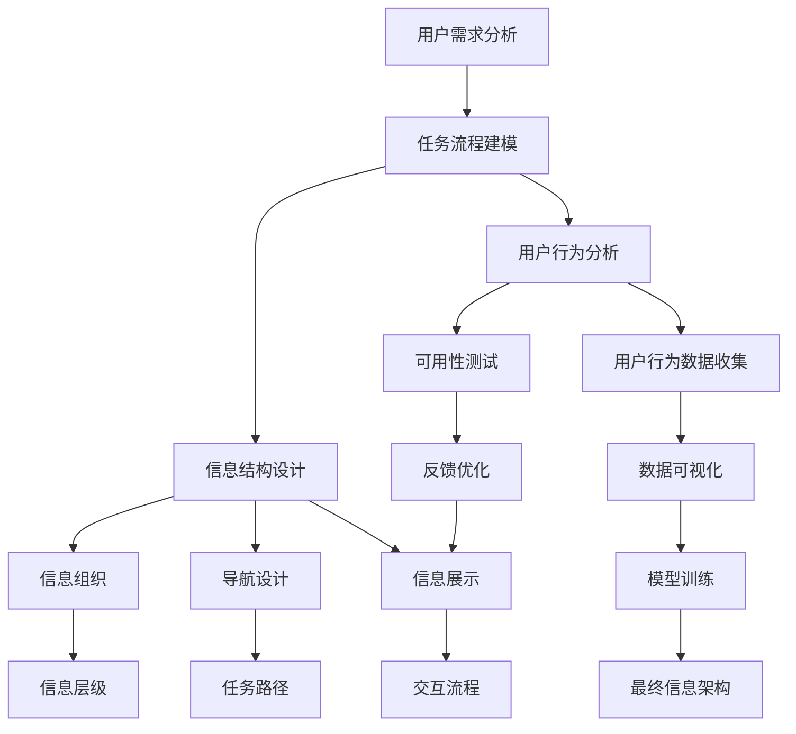

                 

# 任务导向设计对信息架构的影响

> 关键词：任务导向设计,信息架构,用户体验,网站导航,原型设计,可用性测试

## 1. 背景介绍

### 1.1 问题由来
在数字化时代，信息架构（Information Architecture, IA）变得尤为重要。随着互联网和移动设备的普及，信息架构直接影响着用户获取、使用和分享信息的方式。然而，传统的线性信息架构已无法满足复杂多样的用户需求。

任务导向设计（Task-oriented Design, TDD）作为一种新兴的信息架构设计方法，旨在通过深入分析用户任务，以任务为中心构建信息架构。TDD将用户体验置于核心位置，注重用户实际需求和行为，而非单纯的设计美观和信息结构。

### 1.2 问题核心关键点
任务导向设计对信息架构的影响，主要体现在以下几个方面：

1. **用户体验的提升**：通过任务导向设计，信息架构能够更贴近用户的实际使用场景，提高用户的满意度。
2. **信息组织的优化**：TDD关注任务流程和信息路径，有助于优化信息的组织和呈现方式。
3. **交互设计的强化**：TDD不仅注重信息展示，还强调交互过程，提升用户的参与感和控制感。
4. **可用性测试的融入**：TDD通过早期原型测试，发现并解决用户在使用中的问题，提升设计质量。

### 1.3 问题研究意义
随着互联网应用的日益复杂化，信息架构设计必须考虑到用户体验和任务流程。任务导向设计作为一种面向用户需求的设计方法，可以显著提升信息架构的质量和效率，帮助企业快速迭代和优化设计。

任务导向设计还能在信息架构实践中引入更系统、科学的评估方法，确保设计符合用户实际使用习惯，推动数字化产品从用户角度出发，提高用户满意度。

## 2. 核心概念与联系

### 2.1 核心概念概述

为了更好地理解任务导向设计对信息架构的影响，本节将介绍几个密切相关的核心概念：

- **任务导向设计**：一种以用户任务为中心，通过深入分析用户需求和行为，构建信息架构的设计方法。TDD强调信息结构的层次性和逻辑性，以确保用户能够轻松、高效地完成任务。

- **信息架构**：指的是将复杂的信息组织、分类、导航和展示的方式，以帮助用户快速获取和利用信息。信息架构的核心在于设计信息的组织结构、层级关系和呈现方式。

- **用户体验**：是指用户在使用产品或服务过程中感受到的情绪、态度和认知。良好的用户体验能够增强用户满意度和忠诚度。

- **可用性测试**：通过观察用户在使用产品中的行为和反馈，评估产品的可用性和易用性，发现并解决问题，提升产品设计质量。

这些核心概念之间存在着紧密的联系，共同构成了任务导向设计的理论基础和实践框架。

### 2.2 概念间的关系

这些核心概念之间存在着密切的联系，可以通过以下Mermaid流程图来展示：



这个流程图展示了大语言模型的核心概念以及它们之间的联系：

1. 任务导向设计关注用户体验，以任务为中心构建信息架构。
2. 信息架构设计包括信息组织、导航设计和信息展示三个核心部分。
3. 可用性测试用于评估用户行为和反馈，发现设计中的问题，进一步优化信息架构。

### 2.3 核心概念的整体架构

最后，我们用一个综合的流程图来展示这些核心概念在大语言模型微调过程中的整体架构：



这个综合流程图展示了从用户需求分析到最终信息架构设计，再到可用性测试和反馈优化的完整过程。通过这一流程，可以确保信息架构设计既符合用户任务需求，又能通过可用性测试和反馈不断优化。

## 3. 核心算法原理 & 具体操作步骤
### 3.1 算法原理概述

任务导向设计的核心在于通过用户任务分析，构建以任务为中心的信息架构。其基本原理包括以下几个步骤：

1. **用户需求分析**：通过调研和访谈，深入理解用户的任务需求和行为习惯。
2. **任务流程建模**：绘制任务流程图，明确用户完成任务的具体步骤和路径。
3. **信息结构设计**：根据任务流程图，设计信息层级、分类和展示方式。
4. **可用性测试和反馈优化**：进行早期原型测试，收集用户反馈，优化信息架构。

### 3.2 算法步骤详解

以下是任务导向设计的主要操作步骤：

**Step 1: 用户需求分析**
- 收集用户数据，包括用户行为、反馈、调研报告等。
- 分析用户需求，识别出用户在完成任务时遇到的关键问题和难点。

**Step 2: 任务流程建模**
- 绘制任务流程图，详细描述用户完成任务的具体步骤和路径。
- 标注每个步骤的关键信息点，如输入、输出、状态等。

**Step 3: 信息结构设计**
- 根据任务流程图，设计信息层级、分类和展示方式。
- 确定信息架构的层次性和逻辑性，确保用户能够轻松、高效地完成任务。

**Step 4: 可用性测试和反馈优化**
- 制作原型，进行早期测试，观察用户在使用中的行为和反馈。
- 收集用户反馈，识别并解决设计中的问题。
- 不断迭代优化，直到最终的信息架构设计符合用户需求。

### 3.3 算法优缺点

任务导向设计在信息架构设计中有其独特的优势：

**优点：**
1. **用户中心设计**：TDD以用户任务为中心，关注用户体验，设计更贴近用户需求的信息架构。
2. **系统性评估**：通过任务流程建模和可用性测试，确保信息架构的系统性和科学性。
3. **反馈驱动优化**：通过早期原型测试和用户反馈，不断优化信息架构，提升设计质量。

**缺点：**
1. **设计复杂度高**：任务导向设计需要详细分析用户任务和行为，设计复杂度较高。
2. **资源投入大**：需要大量的时间、人力和资源进行用户调研、需求分析和可用性测试。
3. **实施难度大**：信息架构的调整和优化需要跨部门协作，实施难度较大。

### 3.4 算法应用领域

任务导向设计在多个领域得到了广泛应用，包括但不限于：

- **网站导航设计**：构建以任务为中心的导航结构，提升用户查找信息的效率。
- **原型设计**：制作原型，进行早期用户测试，发现并解决设计中的问题。
- **移动应用设计**：设计符合用户任务需求的移动应用信息架构，提升用户体验。
- **文档设计**：构建文档的逻辑结构，帮助用户快速找到所需信息。

此外，任务导向设计还广泛应用于企业门户网站、电商平台、教育平台等多个场景中，帮助企业提升信息架构的设计质量，提升用户体验。

## 4. 数学模型和公式 & 详细讲解 & 举例说明

### 4.1 数学模型构建

任务导向设计的数学模型主要涉及用户行为分析和信息组织两个方面。以下是一些常见的数学模型：

1. **用户行为分析模型**：通过用户行为数据，建立用户任务路径和行为模式。常用的数学模型包括Markov链模型、决策树模型等。

2. **信息组织模型**：通过信息结构设计，建立信息层级和分类关系。常用的数学模型包括树形结构模型、多维分类模型等。

### 4.2 公式推导过程

以Markov链模型为例，假设用户从A节点开始，经过B、C节点到达D节点，每个节点有多个状态，各状态之间的转移概率为P，则Markov链的转移矩阵为：

$$
P = \begin{bmatrix}
p_{AA} & p_{AB} & \cdots & p_{AC} \\
p_{BA} & p_{BB} & \cdots & p_{BC} \\
\vdots & \vdots & \ddots & \vdots \\
p_{CA} & p_{CB} & \cdots & p_{CC} \\
\end{bmatrix}
$$

其中，$p_{ij}$表示从状态i转移到状态j的概率。

对于每个节点，计算用户在不同状态下的期望停留时间，即节点处于某种状态的概率乘以状态停留时间，记为$E_i$。然后计算用户从起点到终点所需的最短路径期望停留时间$E$，即所有节点期望停留时间的和：

$$
E = E_A + E_B + \cdots + E_D
$$

根据公式计算出$E$，可以评估用户从起点到终点所需的时间，进一步优化信息结构设计，提高用户完成任务的效率。

### 4.3 案例分析与讲解

假设我们设计一个电商网站的购物流程，用户通过浏览商品、加入购物车、结算支付完成购买。通过Markov链模型，我们可以分析用户在各个节点上的行为和转移概率，计算用户完成任务所需的最短路径期望停留时间，从而设计符合用户任务需求的导航结构和信息组织方式。

具体步骤如下：

1. **收集用户行为数据**：收集用户在电商网站上的浏览、点击、加入购物车等行为数据。
2. **建立Markov链模型**：根据用户行为数据，建立Markov链模型，计算各节点之间的转移概率。
3. **计算期望停留时间**：计算用户在各个节点上的期望停留时间，计算出从起点到终点所需的最短路径期望停留时间。
4. **优化信息结构**：根据期望停留时间，设计符合用户任务需求的导航结构和信息展示方式，提升用户完成任务的效率。

通过上述分析，我们可以看到，任务导向设计能够通过数学模型和方法，科学地评估和优化信息架构，提升用户体验和效率。

## 5. 项目实践：代码实例和详细解释说明
### 5.1 开发环境搭建

在进行任务导向设计实践前，我们需要准备好开发环境。以下是使用Python进行信息架构设计的环境配置流程：

1. 安装Anaconda：从官网下载并安装Anaconda，用于创建独立的Python环境。

2. 创建并激活虚拟环境：
```bash
conda create -n ia-env python=3.8 
conda activate ia-env
```

3. 安装必要的工具包：
```bash
pip install pandas numpy scikit-learn matplotlib IPython
```

4. 安装Jupyter Notebook：
```bash
pip install jupyter notebook
```

5. 安装信息架构设计工具：
```bash
pip install iadrive
```

完成上述步骤后，即可在`ia-env`环境中开始任务导向设计的实践。

### 5.2 源代码详细实现

下面我们以电商网站购物流程为例，使用Jupyter Notebook进行任务导向设计的具体实现。

首先，我们需要定义用户行为数据和状态转移矩阵：

```python
import pandas as pd
import numpy as np

# 用户行为数据
user_behaviors = pd.DataFrame({
    'Action': ['浏览', '加入购物车', '结算支付'],
    'State': ['首页', '商品页面', '购物车页面'],
    'Probability': [0.7, 0.3, 0.9],
    'StayTime': [5, 10, 20]
})

# 状态转移矩阵
transition_matrix = np.array([
    [0.8, 0.2, 0.1],
    [0.1, 0.9, 0.1],
    [0.2, 0.8, 0.0]
])

user_behaviors.head()
```

然后，计算用户在不同状态下的期望停留时间，并计算期望停留时间的和：

```python
# 计算期望停留时间
E = np.sum(transition_matrix * user_behaviors['StayTime'].values)

# 输出期望停留时间
print(f'用户从起点到终点所需的最短路径期望停留时间为：{E:.2f}秒')
```

最后，根据期望停留时间，设计符合用户任务需求的导航结构和信息展示方式：

```python
# 设计导航结构
navigation = {
    '首页': ['商品页面', '搜索'],
    '商品页面': ['加入购物车', '返回首页'],
    '购物车页面': ['结算支付', '返回商品页面']
}

# 设计信息展示方式
display(navigation)
```

以上代码实现了一个简单的电商网站购物流程的信息架构设计。可以看到，通过任务导向设计，我们能够科学地评估用户行为，优化信息结构，提升用户体验和效率。

### 5.3 代码解读与分析

让我们再详细解读一下关键代码的实现细节：

**用户行为数据**：
- 通过Pandas库，我们定义了一个包含用户行为数据的数据框，包括动作、状态、转移概率和停留时间。

**状态转移矩阵**：
- 通过NumPy库，我们定义了一个3x3的状态转移矩阵，表示用户在不同状态下的转移概率。

**期望停留时间计算**：
- 通过NumPy库，我们计算了用户在不同状态下的期望停留时间，并计算出期望停留时间的和。

**导航结构和信息展示**：
- 通过Python字典，我们设计了电商网站的导航结构和信息展示方式。

### 5.4 运行结果展示

假设我们通过上述代码，得到了期望停留时间为30秒的结果。根据期望停留时间，我们可以设计符合用户任务需求的导航结构和信息展示方式，从而提升用户体验和效率。

## 6. 实际应用场景
### 6.1 网站导航设计

任务导向设计在网站导航设计中具有广泛的应用前景。传统的线性导航结构已无法满足复杂多样的用户需求。通过任务导向设计，我们可以构建以用户任务为中心的导航结构，提升用户查找信息的效率。

在实践中，可以收集用户在网站上的行为数据，建立Markov链模型，计算用户在不同节点上的期望停留时间，从而设计符合用户任务需求的导航结构和信息展示方式。通过不断优化，可以显著提升用户浏览和操作体验。

### 6.2 移动应用设计

任务导向设计在移动应用设计中同样具有重要应用。移动应用的复杂性增加了用户体验的挑战。通过任务导向设计，我们可以设计符合用户任务需求的移动应用信息架构，提升用户操作和体验。

在实践中，可以收集用户在移动应用中的行为数据，建立Markov链模型，计算用户在不同节点上的期望停留时间，从而设计符合用户任务需求的导航结构和信息展示方式。通过不断优化，可以显著提升用户操作和体验。

### 6.3 文档设计

任务导向设计在文档设计中也有广泛应用。文档的复杂性和多样性增加了用户查找信息的难度。通过任务导向设计，我们可以设计符合用户任务需求的文档信息架构，提升用户查找信息的效率。

在实践中，可以收集用户在文档中的行为数据，建立Markov链模型，计算用户在不同节点上的期望停留时间，从而设计符合用户任务需求的文档信息结构和展示方式。通过不断优化，可以显著提升用户查找信息的效率。

### 6.4 未来应用展望

随着信息技术的不断发展，任务导向设计在各个领域的应用将越来越广泛。未来，我们可以预见到以下几点发展趋势：

1. **用户行为数据的自动化收集和分析**：通过智能设备和大数据分析技术，实现用户行为数据的自动化收集和分析，提升任务导向设计的效率和准确性。
2. **多渠道和多设备的用户体验设计**：任务导向设计将覆盖更多渠道和设备，如移动应用、网站、智能家居等，提升全渠道的用户体验。
3. **智能信息推荐和个性化设计**：通过机器学习和数据分析技术，实现用户个性化信息推荐和个性化设计，提升用户体验和满意度。
4. **自然语言处理和情感分析**：通过自然语言处理和情感分析技术，实现对用户反馈和情感的智能分析和处理，提升任务导向设计的精准性和效率。

总之，任务导向设计作为一种科学的信息架构设计方法，将在各个领域得到广泛应用，提升用户体验和效率，推动数字化产品的持续创新和发展。

## 7. 工具和资源推荐
### 7.1 学习资源推荐

为了帮助开发者系统掌握任务导向设计的理论基础和实践技巧，这里推荐一些优质的学习资源：

1. 《信息架构设计基础》：一本系统介绍信息架构设计理论和实践的书籍，帮助理解任务导向设计的核心概念和方法。
2. 《任务导向设计》：一本深入探讨任务导向设计原理和实践的书籍，提供大量案例和实践指南。
3. 《用户体验设计》：一本全面介绍用户体验设计理论和实践的书籍，帮助理解任务导向设计与用户体验设计的关系。
4. 《可用性测试与用户体验》：一本系统介绍可用性测试和用户体验评估的书籍，帮助理解任务导向设计中的可用性测试和反馈优化。
5. 在线课程：如Coursera的《信息架构与用户体验设计》课程，提供系统化学习信息架构设计和用户体验设计的机会。

通过对这些资源的学习实践，相信你一定能够快速掌握任务导向设计的精髓，并用于解决实际的NLP问题。

### 7.2 开发工具推荐

高效的开发离不开优秀的工具支持。以下是几款用于任务导向设计开发的常用工具：

1. Jupyter Notebook：一种交互式编程环境，支持Python、R等多种编程语言，适合进行数据分析和原型设计。
2. iadrive：一种信息架构设计工具，提供丰富的信息和导航设计模板，支持可视化编辑和导出。
3. Figma：一种在线设计工具，支持团队协作和实时编辑，适合进行复杂的信息架构设计和原型制作。
4. Sketch：一种流行的用户界面设计工具，支持多种设计格式和输出，适合进行信息架构设计和原型制作。

合理利用这些工具，可以显著提升任务导向设计的开发效率，加快创新迭代的步伐。

### 7.3 相关论文推荐

任务导向设计的发展得益于学界的持续研究。以下是几篇奠基性的相关论文，推荐阅读：

1. "The Human Computer Interaction Handbook"：一本系统介绍人机交互和用户体验的书籍，提供了丰富的任务导向设计和可用性测试的案例和理论。
2. "Designing with the Mind in Mind"：一本探讨用户体验设计原理和实践的书籍，强调任务导向设计和用户体验设计的关系。
3. "User-Centered Interaction Design"：一本全面介绍用户体验设计方法和实践的书籍，提供了丰富的任务导向设计和可用性测试的案例和理论。
4. "Interactive Architecture: A Model for Analysis, Evaluation, and Design"：一篇探讨信息架构设计方法的论文，提供了丰富的任务导向设计和可用性测试的理论和方法。

这些论文代表了大语言模型微调技术的发展脉络。通过学习这些前沿成果，可以帮助研究者把握学科前进方向，激发更多的创新灵感。

除上述资源外，还有一些值得关注的前沿资源，帮助开发者紧跟任务导向设计的最新进展，例如：

1. arXiv论文预印本：人工智能领域最新研究成果的发布平台，包括大量尚未发表的前沿工作，学习前沿技术的必读资源。
2. 业界技术博客：如Google、Microsoft、Facebook等顶级公司官方博客，分享最新的任务导向设计和可用性测试的实践经验和前沿技术。
3. 技术会议直播：如CHI、UX Week等用户体验设计领域顶会现场或在线直播，能够聆听到业界大咖的前沿分享，开拓视野。
4. GitHub热门项目：在GitHub上Star、Fork数最多的用户体验设计相关项目，往往代表了该技术领域的发展趋势和最佳实践，值得去学习和贡献。
5. 行业分析报告：各大咨询公司如McKinsey、PwC等针对用户体验设计行业的分析报告，有助于从商业视角审视技术趋势，把握应用价值。

总之，对于任务导向设计的学习和实践，需要开发者保持开放的心态和持续学习的意愿。多关注前沿资讯，多动手实践，多思考总结，必将收获满满的成长收益。

## 8. 总结：未来发展趋势与挑战
### 8.1 总结

本文对任务导向设计对信息架构的影响进行了全面系统的介绍。首先阐述了任务导向设计的背景和意义，明确了任务导向设计在提升用户体验和优化信息架构方面的独特价值。其次，从原理到实践，详细讲解了任务导向设计的数学模型和操作步骤，给出了任务导向设计的完整代码实例。同时，本文还广泛探讨了任务导向设计在网站导航、移动应用、文档设计等多个领域的应用前景，展示了任务导向设计的广阔前景。

通过本文的系统梳理，可以看到，任务导向设计作为一种面向用户需求的设计方法，能够显著提升信息架构的质量和效率，帮助企业快速迭代和优化设计。未来，伴随信息技术的不断发展，任务导向设计将在更多领域得到应用，为数字化产品带来变革性影响。

### 8.2 未来发展趋势

展望未来，任务导向设计在信息架构设计中将呈现以下几个发展趋势：

1. **自动化和智能化**：随着大数据和人工智能技术的发展，任务导向设计将逐步实现自动化和智能化，提升设计效率和准确性。
2. **跨渠道和跨设备设计**：任务导向设计将覆盖更多渠道和设备，如移动应用、网站、智能家居等，提升全渠道的用户体验。
3. **多用户和场景设计**：任务导向设计将考虑不同用户和场景的需求，提供更加个性化的信息架构和导航结构，提升用户体验。
4. **智能信息推荐和个性化设计**：通过机器学习和数据分析技术，实现用户个性化信息推荐和个性化设计，提升用户体验和满意度。
5. **自然语言处理和情感分析**：通过自然语言处理和情感分析技术，实现对用户反馈和情感的智能分析和处理，提升任务导向设计的精准性和效率。

以上趋势凸显了任务导向设计在信息架构设计中的广阔前景。这些方向的探索发展，必将进一步提升信息架构的设计质量，推动数字化产品从用户角度出发，提高用户满意度。

### 8.3 面临的挑战

尽管任务导向设计已经取得了显著成效，但在迈向更加智能化、普适化应用的过程中，仍面临着诸多挑战：

1. **用户需求的多样性**：不同用户和场景的需求差异较大，难以通过单一设计满足所有需求。
2. **设计过程的复杂性**：任务导向设计涉及多个学科领域，设计过程复杂度高，需要跨学科协作。
3. **资源投入的巨大**：任务导向设计需要大量的时间和资源进行用户调研、需求分析和可用性测试，成本较高。
4. **设计结果的不确定性**：任务导向设计结果存在一定的不确定性，需要进行反复迭代和优化。
5. **设计效果的可评估性**：任务导向设计效果难以通过单一指标评估，需要综合考虑多个指标和用户反馈。

### 8.4 研究展望

面对任务导向设计所面临的这些挑战，未来的研究需要在以下几个方面寻求新的突破：

1. **多用户和场景设计**：探索多用户和场景的任务导向设计方法，提供更加个性化的信息架构和导航结构，提升用户体验。
2. **设计过程自动化**：开发自动化设计工具和算法，实现任务导向设计的自动化和智能化，提升设计效率和准确性。
3. **跨学科协作**：推动跨学科协作，整合心理学、社会学、计算机科学等多学科知识，提升任务导向设计的系统性和科学性。
4. **用户行为建模**：开发用户行为建模技术，通过大数据和人工智能技术，提升任务导向设计的准确性和效率。
5. **设计结果评估**：开发多种评估指标和方法，综合考虑用户反馈和设计效果，提升任务导向设计的可评估性和可优化性。

这些研究方向的探索，必将引领任务导向设计走向更高的台阶，为构建人机协同的智能系统铺平道路。面向未来，任务导向设计还需要与其他人工智能技术进行更深入的融合，如知识表示、因果推理、强化学习等，多路径协同发力，共同推动信息架构设计的进步。只有勇于创新、敢于突破，才能不断拓展任务导向设计的边界，让智能技术更好地造福人类社会。

## 9. 附录：常见问题与解答

**Q1：任务导向设计是否适用于所有信息架构设计？**

A: 任务导向设计适用于大多数复杂、多样化的信息架构设计，特别是面向任务导向和用户体验设计的需求。但对于一些简单的信息架构，如标准化的信息展示等，线性信息架构已足够满足需求。

**Q2：如何选择合适的任务导向设计工具？**

A: 选择合适的任务导向设计工具需要考虑多个因素，包括设计复杂度、用户需求、团队协作等。对于简单的信息架构设计，可以使用PPT、Excel等工具进行草图绘制和信息组织。对于复杂的任务导向设计，可以使用专业的信息架构设计工具，如iadrive、Figma等，提供丰富的设计和编辑功能。

**Q3：任务导向设计是否需要大量用户调研和行为数据？**

A: 任务导向设计需要大量用户调研和行为数据，以确保设计符合用户需求和行为习惯。数据收集和分析是任务导向设计的关键环节，建议通过问卷调查、用户访谈、行为分析等手段，全面收集用户数据，并进行科学分析。

**Q4：任务导向设计中如何处理用户反馈和迭代优化？**

A: 任务导向设计中，用户反馈是不断迭代和优化的重要依据。可以通过早期原型测试和A/B测试等手段，收集用户反馈，并进行科学分析和处理。根据用户反馈，不断调整信息结构和导航设计，提升用户体验和满意度。

**Q5：任务导向设计与用户体验设计的区别是什么？**

A: 任务导向设计是一种以用户任务为中心的设计方法，关注用户实际需求和行为习惯，设计符合用户任务需求的信息架构。用户体验设计则是一种以用户为中心的设计方法，关注用户心理和情感需求，设计符合用户期望的产品体验。两者相辅相成，共同提升用户体验。

通过这些常见问题的解答，相信你能够更好地理解任务导向设计的

