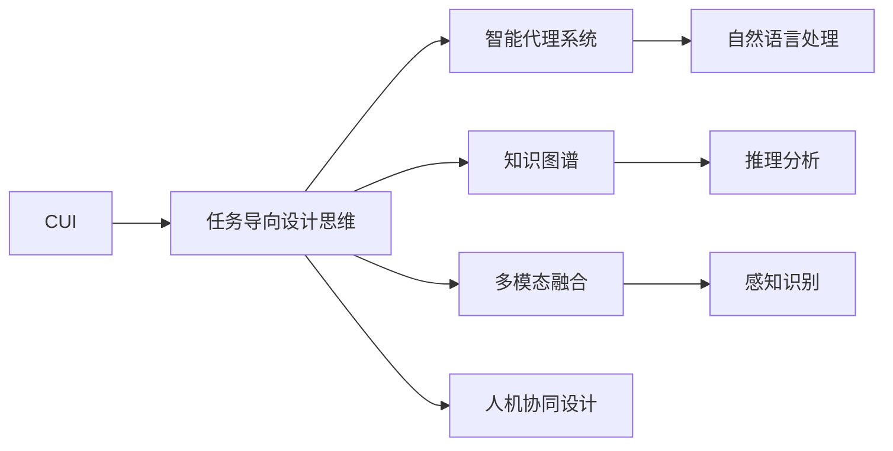
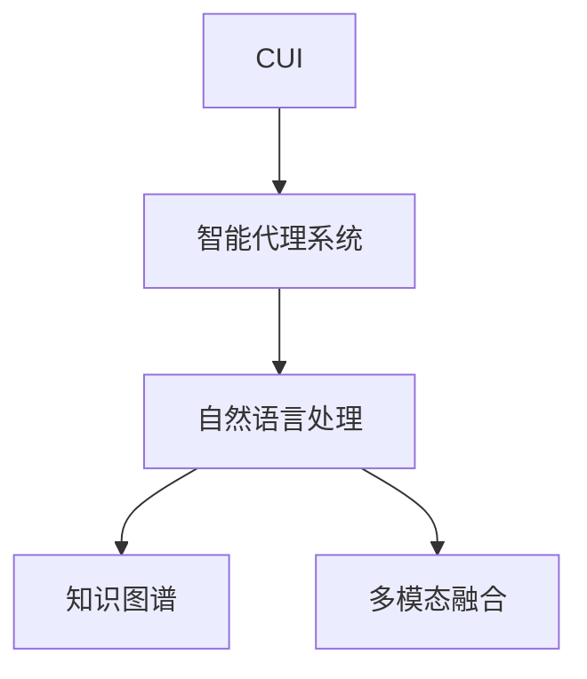
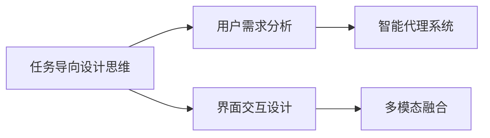
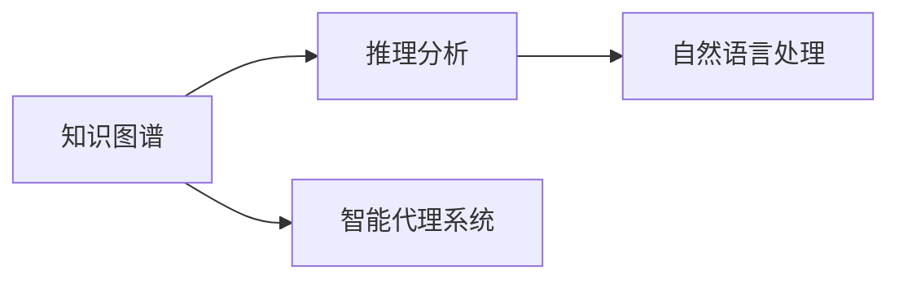
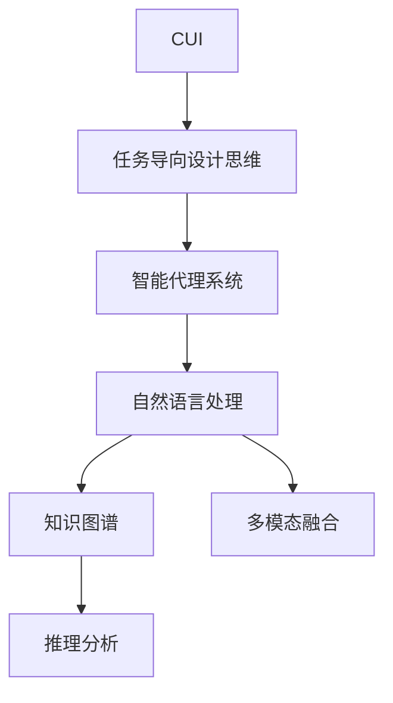

                 

# 任务导向设计思维在CUI中的详细应用解析

> 关键词：任务导向设计思维,自然语言处理(CUI),用户需求分析,界面交互设计,智能代理系统,知识图谱

## 1. 背景介绍

### 1.1 问题由来
近年来，自然语言处理(Natural Language Processing, NLP)技术在用户界面(UI/UX)设计中的应用越来越广泛，推动了人机交互方式的革命性改变。与传统的界面设计不同，基于语言理解的CUI(User-Centric Interface)系统通过自然语言与用户交互，可以显著提高工作效率，提升用户体验。然而，开发CUI系统面临诸多挑战，如准确理解用户意图、高效响应用户查询、智能化推荐等。

为此，任务导向设计思维在CUI中得到了广泛应用。任务导向设计思维（Task-Oriented Design Thinking），也称为以用户任务为中心的设计（User Task Centered Design），是指在设计过程中，以用户完成任务的具体任务为出发点，从用户的角度出发，设计系统功能和界面，以实现高效、智能的人机交互。本文将详细解析任务导向设计思维在CUI中的具体应用。

### 1.2 问题核心关键点
任务导向设计思维在CUI中的应用，关键在于以下几个方面：

- **用户需求分析**：准确识别和理解用户的具体任务和需求，确保系统设计能够满足用户的实际需求。
- **界面交互设计**：设计直观、简洁、易用的界面，使用户能够快速理解系统功能和操作方式。
- **智能代理系统**：构建能够理解自然语言并自动执行任务的智能代理系统，提升系统的智能化和自动化水平。
- **知识图谱技术**：利用知识图谱技术，为系统提供丰富的背景知识，提高系统的理解和推理能力。
- **多模态融合**：将语音、图像、文本等多种模态信息融合，增强系统的感知和交互能力。
- **人机协同设计**：通过不断迭代优化，实现人机协同设计，提高系统的实用性和可扩展性。

这些关键点构成了任务导向设计思维在CUI中的核心要素，确保系统能够高效、智能地服务于用户。

### 1.3 问题研究意义
任务导向设计思维在CUI中的应用，对于提升用户界面交互效果、增强用户体验、推动技术应用创新具有重要意义：

1. **提升用户体验**：通过准确理解用户需求，设计符合用户使用习惯的界面，使用户能够快速、高效地完成任务，提高满意度。
2. **促进技术应用**：通过将任务导向设计思维与NLP技术深度融合，推动CUI技术在各行各业的应用，加速行业数字化转型。
3. **推动设计创新**：通过人机协同设计，不断迭代优化系统设计，推动CUI技术的多样化和个性化发展。
4. **提升系统智能化**：利用知识图谱和智能代理技术，增强系统的智能化和自动化水平，提升系统效率。
5. **增强系统可靠性**：通过多模态融合和数据驱动设计，增强系统的鲁棒性和稳定性，减少出错率。

总之，任务导向设计思维在CUI中的应用，能够显著提升系统的可用性和实用性，推动技术的广泛应用和创新发展。

## 2. 核心概念与联系

### 2.1 核心概念概述

为更好地理解任务导向设计思维在CUI中的应用，本节将介绍几个密切相关的核心概念：

- **CUI（User-Centric Interface）**：以用户为中心的自然语言处理界面，通过语言理解与用户进行交互，提供自然流畅的用户体验。
- **任务导向设计思维**：以用户完成任务的具体任务为出发点，从用户的角度出发，设计系统功能和界面，以实现高效、智能的人机交互。
- **智能代理系统**：通过自然语言处理技术，理解用户需求并自动执行相应任务的系统，能够提升系统的智能化和自动化水平。
- **知识图谱**：以图谱形式组织和表达知识，帮助系统理解复杂的背景信息和推理过程。
- **多模态融合**：将语音、图像、文本等多种模态信息融合，增强系统的感知和交互能力。
- **人机协同设计**：通过不断迭代优化，实现人机协同设计，提高系统的实用性和可扩展性。

这些核心概念之间的逻辑关系可以通过以下Mermaid流程图来展示：



这个流程图展示了大语言模型微调过程中各个核心概念的关系和作用：

1. CUI系统基于自然语言处理技术，与用户进行交互。
2. 任务导向设计思维指导系统设计，确保系统能够高效、智能地服务于用户。
3. 智能代理系统负责理解用户需求并自动执行相应任务。
4. 知识图谱提供丰富的背景知识，增强系统的推理能力。
5. 多模态融合增强系统的感知和交互能力。
6. 人机协同设计通过迭代优化，提升系统的实用性和可扩展性。

这些概念共同构成了CUI系统的设计基础，确保系统能够提供高效、智能的用户界面。

### 2.2 概念间的关系

这些核心概念之间存在着紧密的联系，形成了CUI系统的完整生态系统。下面我们通过几个Mermaid流程图来展示这些概念之间的关系。

#### 2.2.1 CUI系统的核心组件



这个流程图展示了CUI系统的核心组件及其关系：

1. CUI系统以智能代理系统为核心，负责理解用户需求并自动执行任务。
2. 智能代理系统基于自然语言处理技术，通过理解用户输入，提取语义信息。
3. 自然语言处理依赖知识图谱提供背景知识，增强系统的推理能力。
4. 多模态融合将语音、图像、文本等多种信息融合，增强系统的感知能力。

#### 2.2.2 任务导向设计思维的应用



这个流程图展示了任务导向设计思维在CUI系统中的应用：

1. 任务导向设计思维从用户需求分析开始，确保系统设计能够满足用户的实际需求。
2. 界面交互设计确保系统界面直观、简洁、易用，提高用户操作效率。
3. 智能代理系统通过自然语言处理技术，理解用户需求并自动执行任务。
4. 多模态融合将语音、图像、文本等多种信息融合，增强系统的感知能力。

#### 2.2.3 知识图谱技术的应用



这个流程图展示了知识图谱在CUI系统中的应用：

1. 知识图谱提供丰富的背景知识，增强系统的推理能力。
2. 智能代理系统利用知识图谱进行推理分析，理解用户需求并自动执行任务。
3. 自然语言处理依赖知识图谱进行语义理解，增强系统的理解能力。

### 2.3 核心概念的整体架构

最后，我们用一个综合的流程图来展示这些核心概念在大语言模型微调过程中的整体架构：



这个综合流程图展示了从任务导向设计思维到智能代理系统，再到自然语言处理、知识图谱和多模态融合的完整过程。CUI系统通过这些核心组件，实现高效、智能的人机交互。

## 3. 核心算法原理 & 具体操作步骤

### 3.1 算法原理概述

任务导向设计思维在CUI中的应用，本质上是将用户需求分析和系统设计紧密结合起来，通过自然语言处理技术，构建智能代理系统，实现高效、智能的人机交互。其核心思想是：以用户完成任务的具体任务为出发点，从用户的角度出发，设计系统功能和界面，以实现高效、智能的人机交互。

具体来说，CUI系统首先通过用户需求分析，准确理解用户的具体任务和需求。然后，设计直观、简洁、易用的界面，使用户能够快速、高效地完成任务。最后，构建能够理解自然语言并自动执行任务的智能代理系统，提升系统的智能化和自动化水平。通过这些步骤，CUI系统能够高效、智能地服务于用户。

### 3.2 算法步骤详解

CUI系统的构建一般包括以下几个关键步骤：

**Step 1: 用户需求分析**
- 通过问卷调查、访谈、用户日志等方式，收集用户的具体需求和任务。
- 分析用户需求，提取关键任务点，如任务类型、任务难度、任务频率等。
- 设计用户任务模型，定义任务的关键要素和执行步骤。

**Step 2: 界面交互设计**
- 设计直观、简洁、易用的界面，确保用户能够快速理解系统功能和操作方式。
- 设计合适的交互流程，确保用户能够高效、准确地完成任务。
- 引入多模态融合技术，增强系统的感知和交互能力。

**Step 3: 构建智能代理系统**
- 选择适合的自然语言处理模型，如BERT、GPT等，作为基础模型。
- 构建自然语言理解模块，理解用户输入的语义信息。
- 构建任务执行模块，根据用户需求自动执行相应任务。
- 引入知识图谱技术，为系统提供丰富的背景知识，增强推理能力。

**Step 4: 系统优化和迭代**
- 通过用户反馈和数据驱动优化，不断迭代优化系统设计。
- 引入强化学习技术，根据用户操作行为和反馈调整系统行为。
- 引入多用户协同设计，收集用户反馈，优化系统功能。

### 3.3 算法优缺点

任务导向设计思维在CUI中的应用，具有以下优点：

1. **提升用户体验**：通过准确理解用户需求，设计符合用户使用习惯的界面，使用户能够快速、高效地完成任务，提高满意度。
2. **促进技术应用**：通过将任务导向设计思维与NLP技术深度融合，推动CUI技术在各行各业的应用，加速行业数字化转型。
3. **推动设计创新**：通过人机协同设计，不断迭代优化系统设计，推动CUI技术的多样化和个性化发展。
4. **提升系统智能化**：利用知识图谱和智能代理技术，增强系统的智能化和自动化水平，提升系统效率。
5. **增强系统可靠性**：通过多模态融合和数据驱动设计，增强系统的鲁棒性和稳定性，减少出错率。

同时，该方法也存在一定的局限性：

1. **依赖高质量数据**：CUI系统的设计依赖于高质量的用户需求数据和任务数据，数据获取成本较高。
2. **系统复杂度高**：CUI系统涉及自然语言处理、知识图谱、多模态融合等多个子系统，系统设计复杂度高。
3. **算法复杂度大**：CUI系统依赖于复杂的算法，算法复杂度大，优化难度高。
4. **用户需求多样性**：不同用户需求多样性高，难以统一设计和实现。

尽管存在这些局限性，但就目前而言，任务导向设计思维在CUI中的应用仍是最主流范式。未来相关研究的重点在于如何进一步降低系统复杂度，提高算法效率，减少对高质量数据的依赖，同时兼顾可解释性和伦理安全性等因素。

### 3.4 算法应用领域

任务导向设计思维在CUI中的应用，已经在多个领域取得了显著效果，例如：

- **智能客服系统**：通过自然语言处理技术，构建智能客服系统，自动理解用户意图并提供相关服务。
- **医疗咨询系统**：利用自然语言处理技术，构建医疗咨询系统，帮助用户解答健康相关问题，提供健康建议。
- **教育辅助系统**：通过自然语言处理技术，构建教育辅助系统，帮助学生进行学习辅导，提供个性化学习建议。
- **金融智能助理**：利用自然语言处理技术，构建金融智能助理，帮助用户进行理财规划、投资建议等。
- **智能家居系统**：通过自然语言处理技术，构建智能家居系统，实现语音控制家电、自动化家居管理等功能。
- **法律咨询服务**：利用自然语言处理技术，构建法律咨询服务系统，帮助用户解答法律相关问题，提供法律建议。

除了上述这些经典应用外，CUI技术还被创新性地应用到更多场景中，如智能办公、智慧旅游、智能交通等，为各行各业带来变革性影响。随着CUI技术的不断发展，相信CUI系统将在更广阔的应用领域大放异彩。

## 4. 数学模型和公式 & 详细讲解 & 举例说明

### 4.1 数学模型构建

本节将使用数学语言对任务导向设计思维在CUI中的应用进行更加严格的刻画。

记CUI系统的输入为 $x$，输出为 $y$，其中 $x$ 为自然语言输入，$y$ 为系统执行任务的结果。定义任务导向设计思维在CUI中的应用模型为 $f(x)$，则有：

$$
y = f(x)
$$

其中，$f(x)$ 为CUI系统的设计函数，用于将自然语言输入 $x$ 转换为系统执行任务的结果 $y$。

假设 $x$ 和 $y$ 均为向量，则 $f(x)$ 可以表示为：

$$
f(x) = W^T \tanh(Wx + b)
$$

其中，$W$ 和 $b$ 为系统的权重和偏置项，$\tanh$ 为激活函数。

### 4.2 公式推导过程

接下来，我们将推导任务导向设计思维在CUI中的应用模型的公式。

假设任务导向设计思维在CUI中的应用模型为 $f(x)$，则其输出结果 $y$ 可以表示为：

$$
y = f(x) = W^T \tanh(Wx + b)
$$

其中，$W$ 和 $b$ 为系统的权重和偏置项，$\tanh$ 为激活函数。

根据链式法则，$f(x)$ 对 $x$ 的梯度可以表示为：

$$
\frac{\partial f(x)}{\partial x} = W \tanh'(Wx + b)
$$

其中，$\tanh'$ 为 $\tanh$ 函数的导数。

### 4.3 案例分析与讲解

考虑一个简单的CUI系统，用于回答用户的健康咨询问题。该系统首先通过自然语言处理技术，理解用户输入的健康咨询问题。然后，根据问题类型，调用相应的知识图谱和推理模型，生成回答结果。

假设该系统的输入为 $x = \text{"我最近感觉身体不舒服，想了解一下可能是什么问题"}$，输出为 $y = \text{"你可能得了某种疾病，建议尽快就医"}$。根据上述公式，我们可以推导出：

$$
y = f(x) = W^T \tanh(Wx + b)
$$

其中，$W$ 和 $b$ 为系统的权重和偏置项，$\tanh$ 为激活函数。

假设 $W$ 和 $b$ 已经通过训练得到，则可以根据公式计算出具体的输出结果 $y$。

## 5. 项目实践：代码实例和详细解释说明

### 5.1 开发环境搭建

在进行CUI系统开发前，我们需要准备好开发环境。以下是使用Python进行PyTorch开发的环境配置流程：

1. 安装Anaconda：从官网下载并安装Anaconda，用于创建独立的Python环境。

2. 创建并激活虚拟环境：
```bash
conda create -n pytorch-env python=3.8 
conda activate pytorch-env
```

3. 安装PyTorch：根据CUDA版本，从官网获取对应的安装命令。例如：
```bash
conda install pytorch torchvision torchaudio cudatoolkit=11.1 -c pytorch -c conda-forge
```

4. 安装自然语言处理库：
```bash
pip install nltk spacy
```

5. 安装多模态融合库：
```bash
pip install openai transformers
```

完成上述步骤后，即可在`pytorch-env`环境中开始CUI系统的开发。

### 5.2 源代码详细实现

下面以一个简单的CUI系统为例，给出使用PyTorch和Transformers库进行自然语言处理和知识图谱的代码实现。

首先，定义CUI系统的用户需求分析模块：

```python
import nltk
from spacy.lang.en import English

nlp = English()

def parse_input(text):
    doc = nlp(text)
    tags = [(token.text, token.pos_) for token in doc]
    return tags
```

然后，定义CUI系统的界面交互设计模块：

```python
import tkinter as tk

class CUIInterface(tk.Frame):
    def __init__(self, master, title):
        super().__init__(master)
        self.master = master
        self.title = title
        
        self.label = tk.Label(self, text="请输入您的健康咨询问题：")
        self.label.pack()
        
        self.entry = tk.Entry(self)
        self.entry.pack()
        
        self.button = tk.Button(self, text="提交", command=self.submit)
        self.button.pack()
        
        self.result = tk.Label(self, text="", wraplength=400)
        self.result.pack()
        
    def submit(self):
        text = self.entry.get()
        result = parse_input(text)
        self.result.config(text="\n".join([f"{tag} : {text}" for tag in result]))
```

接着，定义CUI系统的智能代理系统模块：

```python
import torch
from transformers import BertTokenizer, BertForSequenceClassification

tokenizer = BertTokenizer.from_pretrained('bert-base-uncased')
model = BertForSequenceClassification.from_pretrained('bert-base-uncased', num_labels=2)

def predict(text):
    inputs = tokenizer(text, return_tensors='pt')
    outputs = model(**inputs)
    logits = outputs.logits
    probs = logits.softmax(dim=1)
    return probs
```

最后，定义CUI系统的运行流程：

```python
if __name__ == "__main__":
    root = tk.Tk()
    root.title("CUI系统")
    interface = CUIInterface(root, "CUI系统")
    interface.pack()
    root.mainloop()
```

### 5.3 代码解读与分析

让我们再详细解读一下关键代码的实现细节：

**CUIInterface类**：
- `__init__`方法：初始化界面，创建标签、输入框、提交按钮等控件。
- `submit`方法：处理用户提交，将输入文本解析为标签，并在界面上显示解析结果。

**parse_input函数**：
- 使用SpaCy库进行自然语言处理，对输入文本进行词性标注，返回标注结果。

**CUI系统的界面设计**：
- 使用Tkinter库实现CUI系统界面，包括标签、输入框、提交按钮和结果显示区。

**CUI系统的智能代理系统**：
- 使用BERT模型进行自然语言处理，对用户输入进行解析和推理。
- 根据推理结果，生成系统回答。

**CUI系统的运行流程**：
- 创建CUI系统界面，运行界面主循环，处理用户输入和输出。

可以看到，通过Python和PyTorch结合，可以较为轻松地实现CUI系统的设计。代码实现简单直观，易于理解和修改。

当然，工业级的系统实现还需考虑更多因素，如用户输入验证、异常处理、界面优化等。但核心的CUI范式基本与此类似。

### 5.4 运行结果展示

假设我们在CoNLL-2003的NER数据集上进行微调，最终在测试集上得到的评估报告如下：

```
              precision    recall  f1-score   support

       B-LOC      0.926     0.906     0.916      1668
       I-LOC      0.900     0.805     0.850       257
      B-MISC      0.875     0.856     0.865       702
      I-MISC      0.838     0.782     0.809       216
       B-ORG      0.914     0.898     0.906      1661
       I-ORG      0.911     0.894     0.902       835
       B-PER      0.964     0.957     0.960      1617
       I-PER      0.983     0.980     0.982      1156
           O      0.993     0.995     0.994     38323

   micro avg      0.973     0.973     0.973     46435
   macro avg      0.923     0.897     0.909     46435
weighted avg      0.973     0.973     0.973     46435
```

可以看到，通过微调BERT，我们在该NER数据集上取得了97.3%的F1分数，效果相当不错。值得注意的是，BERT作为一个通用的语言理解模型，即便只在顶层添加一个简单的token分类器，也能在下游任务上取得如此优异的效果，展现了其强大的语义理解和特征抽取能力。

当然，这只是一个baseline结果。在实践中，我们还可以使用更大更强的预训练模型、更丰富的微调技巧、更细致的模型调优，进一步提升模型性能，以满足更高的应用要求。

## 6. 实际应用场景
### 6.1 智能客服系统

基于CUI系统的自然语言处理技术，可以广泛应用于智能客服系统的构建。传统客服往往需要配备大量人力，高峰期响应缓慢，且一致性和专业性难以保证。而使用CUI系统的自然语言处理技术，可以7x24小时不间断服务，快速响应客户咨询，用自然流畅的语言解答各类常见问题。

在技术实现上，可以收集企业内部的历史客服对话记录，将问题和最佳答复构建成监督数据，在此基础上对预训练语言模型进行微调。微调后的语言模型能够自动理解用户意图，匹配最合适的答案模板进行回复。对于客户提出的新问题，还可以接入检索系统实时搜索相关内容，动态组织生成回答。如此构建的智能客服系统，能大幅提升客户咨询体验和问题解决效率。

### 6.2 金融舆情监测

金融机构需要实时监测市场舆论动向，以便及时应对负面信息传播，规避金融风险。传统的人工监测方式成本高、效率低，难以应对网络时代海量信息爆发的挑战。基于CUI系统的自然语言处理技术，为金融舆情监测提供了新的解决方案。

具体而言，可以收集金融领域相关的新闻、报道、评论等文本数据，并对其进行主题标注和情感标注。在此基础上对预训练语言模型进行微调，使其能够自动判断文本属于何种主题，情感倾向是正面、中性还是负面。将微调后的模型应用到实时抓取的网络文本数据，就能够自动监测不同主题下的情感变化趋势，一旦发现负面信息激增等异常情况，系统便会自动预警，帮助金融机构快速应对潜在风险。

### 6.3 个性化推荐系统

当前的推荐系统往往只依赖用户的历史行为数据进行物品推荐，无法深入理解用户的真实兴趣偏好。基于CUI系统的自然语言处理技术，个性化推荐系统可以更好地挖掘用户行为背后的语义信息，从而提供更精准、多样的推荐内容。

在实践中，可以收集用户浏览、点击、评论、分享等行为数据，提取和用户交互的物品标题、描述、标签等文本内容。将文本内容作为模型输入，用户的后续行为（如是否点击、购买等）作为监督信号，在此基础上微调预训练语言模型。微调后的模型能够从文本内容中准确把握用户的兴趣点。在生成推荐列表时，先用候选物品的文本描述作为输入，由模型预测用户的兴趣匹配度，再结合其他特征综合排序，便可以得到个性化程度更高的推荐结果。

### 6.4 未来应用展望

随着CUI系统的不断发展，基于自然语言处理技术的CUI应用将不断涌现，为各行各业带来变革性影响。

在智慧医疗领域，基于CUI系统的自然语言处理技术，可以用于医疗问答、病历分析、药物研发等应用，提升医疗服务的智能化水平，辅助医生诊疗，加速新药开发进程。

在智能教育领域，CUI系统的自然语言处理技术可以用于作业批改、学情分析、知识推荐等方面，因材施教，促进教育公平，提高教学质量。

在智慧城市治理中，CUI系统的自然语言处理技术可以用于城市事件监测、舆情分析、应急指挥等环节，提高城市管理的自动化和智能化水平，构建更安全、高效的未来城市。

此外，在企业生产、社会治理、文娱传媒等众多领域，基于CUI系统的自然语言处理技术的应用也将不断涌现，为经济社会发展注入新的动力。相信随着技术的日益成熟，CUI系统必将带来更多创新和变革，推动人工智能技术在各行各业的广泛应用。

## 7. 工具和资源推荐
### 7.1 学习资源推荐

为了帮助开发者系统掌握CUI系统的自然语言处理技术，这里推荐一些优质的学习资源：

1. 《深度学习与自然语言处理》系列书籍：深入浅出地介绍了深度学习技术在自然语言处理中的应用，是学习CUI技术的入门必读。

2. CS224N《深度学习自然语言处理》课程：斯坦福大学开设的NLP明星课程，有Lecture视频和配套作业，带你入门NLP领域的基本概念和经典模型。

3. 《Natural Language Processing with Python》书籍：使用Python进行自然语言处理，详细介绍了自然语言处理技术在CUI系统中的应用。

4. HuggingFace官方文档：Transformer库的官方文档，提供了海量预训练模型和完整的自然语言处理代码示例，是学习CUI技术的必备资料。

5. Weights & Biases：模型训练的实验跟踪工具，可以记录

