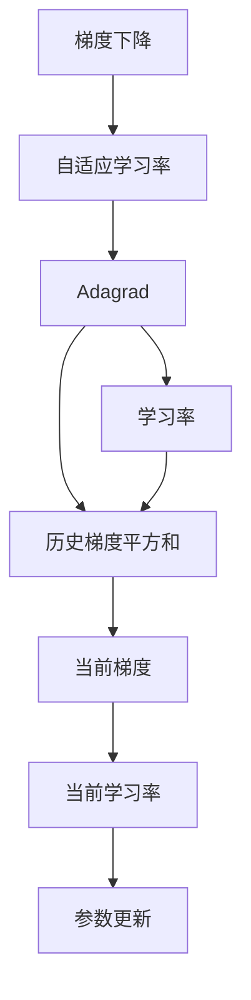
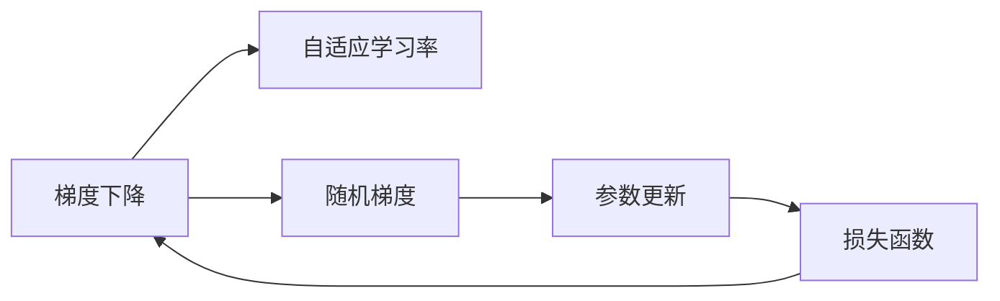
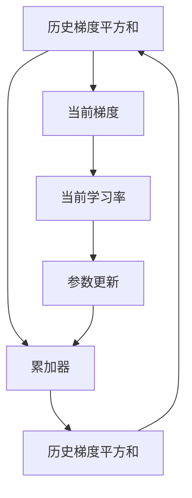
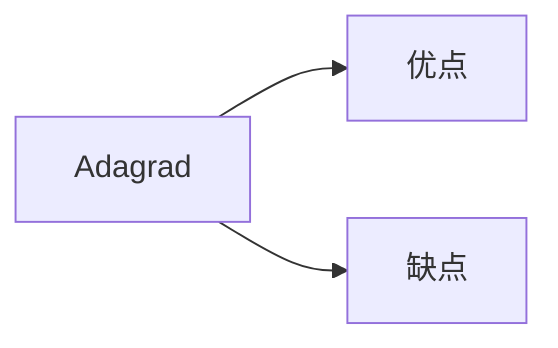
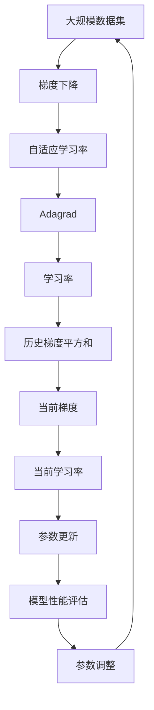

                 

# 优化算法：Adagrad 原理与代码实例讲解

> 关键词：优化算法,Adagrad,梯度下降,自适应学习率,机器学习

## 1. 背景介绍

### 1.1 问题由来
在机器学习领域，优化算法扮演着至关重要的角色。其核心任务是在损失函数最小化的同时，调整模型参数以提升模型性能。梯度下降是最基础的优化算法，但其缺点在于无法应对各参数更新幅度不一致的问题。为了解决这个问题，人们提出了多种优化算法，其中Adagrad（Adaptive Gradient）是一种经典的自适应优化算法，能够根据每个参数的历史梯度信息，动态调整学习率，使得参数更新更加高效。

### 1.2 问题核心关键点
Adagrad算法的设计思路是通过历史梯度信息，动态调整每个参数的学习率，从而使更新更加自适应和高效。其核心在于将历史梯度的平方和作为分母，将当前梯度乘以该值作为新的学习率，从而使得更新时梯度大的参数学习率较小，梯度小的参数学习率较大，以此达到优化效果。

### 1.3 问题研究意义
研究Adagrad算法，可以帮助我们理解自适应学习率的本质，掌握其在实际优化任务中的应用，从而更好地进行模型参数的调整，提升机器学习模型的效果。在深度学习、强化学习等复杂模型训练中，Adagrad算法已经证明了其优异的性能，成为不可忽视的重要工具。

## 2. 核心概念与联系

### 2.1 核心概念概述

为更好地理解Adagrad算法，本节将介绍几个密切相关的核心概念：

- 梯度下降（Gradient Descent）：优化算法的基本原理，通过不断调整参数以最小化损失函数。
- 自适应学习率（Adaptive Learning Rate）：根据参数的梯度信息，动态调整学习率，以适应不同参数的更新需求。
- Adagrad算法：一种自适应学习率算法，通过累加历史梯度的平方和，动态调整每个参数的学习率。
- 学习率（Learning Rate）：控制参数更新的步长，过小可能导致收敛速度慢，过大可能导致模型震荡甚至发散。
- 损失函数（Loss Function）：用于评估模型性能的函数，优化目标即最小化该函数。

这些核心概念之间的逻辑关系可以通过以下Mermaid流程图来展示：



这个流程图展示了几类核心概念之间的关联：

1. 梯度下降是最基础的优化算法。
2. 自适应学习率通过动态调整学习率，提高优化效率。
3. Adagrad算法是自适应学习率的实现方式之一。
4. 学习率用于控制参数更新的步长。
5. 历史梯度平方和是Adagrad算法的核心。

这些概念共同构成了Adagrad算法的理论基础和实现框架，使其能够在各种机器学习任务中发挥重要作用。

### 2.2 概念间的关系

这些核心概念之间存在着紧密的联系，形成了Adagrad算法的完整生态系统。下面我通过几个Mermaid流程图来展示这些概念之间的关系。

#### 2.2.1 梯度下降与自适应学习率的关系



这个流程图展示了梯度下降和自适应学习率的关系：

1. 梯度下降通过计算损失函数对参数的梯度进行更新。
2. 自适应学习率通过对梯度的累加和动态调整，使得参数更新更加自适应。
3. 自适应学习率是梯度下降算法的重要优化手段。

#### 2.2.2 Adagrad算法原理



这个流程图展示了Adagrad算法的基本原理：

1. 使用历史梯度的平方和作为分母，计算当前梯度的动态学习率。
2. 更新参数时，使用当前梯度和动态学习率进行更新。
3. 更新过程中，同时累加历史梯度的平方和。

#### 2.2.3 Adagrad算法的优缺点



这个流程图展示了Adagrad算法的优缺点：

1. 优点：自适应学习率，能够根据参数梯度动态调整，减少参数更新的震荡。
2. 缺点：更新步长随着时间逐渐变小，可能导致学习率过小，参数更新缓慢。

### 2.3 核心概念的整体架构

最后，我们用一个综合的流程图来展示这些核心概念在大规模优化任务中的整体架构：



这个综合流程图展示了从数据集预处理到模型性能评估的完整过程：

1. 大规模数据集经过梯度下降算法进行参数更新。
2. 梯度下降算法通过自适应学习率，根据参数梯度动态调整学习率。
3. 自适应学习率通过Adagrad算法实现，根据历史梯度平方和计算动态学习率。
4. 动态学习率指导参数更新，使得更新更加自适应。
5. 更新后的模型参数通过性能评估，判断是否达到最优。
6. 根据性能评估结果，调整模型参数和优化算法，进入下一轮更新。

通过这些流程图，我们可以更清晰地理解Adagrad算法的核心思想和优化过程，为后续深入讨论具体的实现细节和代码示例奠定基础。

## 3. 核心算法原理 & 具体操作步骤
### 3.1 算法原理概述

Adagrad算法的核心思想是通过历史梯度的平方和，动态调整每个参数的学习率，使得更新更加自适应和高效。其基本公式如下：

$$
\theta_{t+1} = \theta_t - \frac{\eta_t \cdot g_t}{\sqrt{G_t + \epsilon}} \cdot g_t
$$

其中，$\theta_t$ 表示第 $t$ 次迭代的参数，$g_t$ 表示第 $t$ 次迭代的梯度，$G_t$ 表示历史梯度平方和的累加器，$\eta_t$ 表示第 $t$ 次迭代的学习率，$\epsilon$ 是一个很小的常数，避免除数为0。

Adagrad算法的更新过程分为两个主要步骤：

1. 计算历史梯度平方和 $G_t$：
$$
G_t = G_{t-1} + g_t^2
$$

2. 根据历史梯度平方和和当前梯度计算动态学习率 $\eta_t$：
$$
\eta_t = \frac{\eta_0}{\sqrt{G_t + \epsilon}}
$$

其中，$\eta_0$ 是初始学习率。

### 3.2 算法步骤详解

Adagrad算法的实现步骤如下：

1. 初始化参数 $\theta_0$ 和历史梯度平方和累加器 $G_0$。
2. 对于每个迭代 $t$，计算当前梯度 $g_t$。
3. 计算历史梯度平方和 $G_t = G_{t-1} + g_t^2$。
4. 根据历史梯度平方和和当前梯度计算动态学习率 $\eta_t = \frac{\eta_0}{\sqrt{G_t + \epsilon}}$。
5. 更新参数 $\theta_{t+1} = \theta_t - \frac{\eta_t \cdot g_t}{\sqrt{G_t + \epsilon}} \cdot g_t$。
6. 重复步骤2-5，直到达到预设的迭代次数或收敛条件。

### 3.3 算法优缺点

Adagrad算法的优点包括：

1. 自适应学习率：能够根据每个参数的梯度信息，动态调整学习率，减少参数更新的震荡。
2. 收敛速度快：对于稀疏梯度的问题，Adagrad算法表现优异，收敛速度较快。
3. 能够处理非平稳目标函数：Adagrad算法能够适应目标函数的变化，比较适合处理非平稳目标函数的问题。

Adagrad算法的缺点包括：

1. 学习率逐渐变小：由于历史梯度平方和的累加，导致每次更新的学习率逐渐变小，可能导致收敛速度减慢。
2. 初始学习率需要手动调整：如果初始学习率设置不当，可能导致算法过早收敛或发散。
3. 存储需求较高：历史梯度平方和需要累加存储，对于大规模数据集，存储需求较高。

### 3.4 算法应用领域

Adagrad算法广泛应用于各种机器学习任务，包括线性回归、逻辑回归、分类任务等。在深度学习领域，Adagrad算法同样被广泛使用，尤其是在图像识别、自然语言处理等领域。

在实际应用中，Adagrad算法可以通过一些改进版，如Adagrad、Adagrad-Hilbert等，进一步提升其性能和适用性。此外，Adagrad算法的思想还被用于设计其他优化算法，如RMSprop、Adam等。

## 4. 数学模型和公式 & 详细讲解 & 举例说明

### 4.1 数学模型构建

Adagrad算法通过历史梯度平方和来动态调整学习率，从而实现参数的更新。其数学模型如下：

$$
\theta_{t+1} = \theta_t - \frac{\eta_t \cdot g_t}{\sqrt{G_t + \epsilon}} \cdot g_t
$$

其中，$\theta_t$ 表示第 $t$ 次迭代的参数，$g_t$ 表示第 $t$ 次迭代的梯度，$G_t$ 表示历史梯度平方和的累加器，$\eta_t$ 表示第 $t$ 次迭代的学习率，$\epsilon$ 是一个很小的常数，避免除数为0。

### 4.2 公式推导过程

Adagrad算法的基本公式推导过程如下：

1. 计算历史梯度平方和 $G_t = G_{t-1} + g_t^2$。
2. 计算动态学习率 $\eta_t = \frac{\eta_0}{\sqrt{G_t + \epsilon}}$。
3. 更新参数 $\theta_{t+1} = \theta_t - \frac{\eta_t \cdot g_t}{\sqrt{G_t + \epsilon}} \cdot g_t$。

其推导过程与上述步骤基本一致，不再赘述。

### 4.3 案例分析与讲解

为了更好地理解Adagrad算法的应用，我们通过一个简单的线性回归例子进行分析。

假设我们有一组线性回归数据，其目标函数为 $y = \theta_0 + \theta_1 x_1 + \theta_2 x_2$，其中 $\theta_0$、$\theta_1$、$\theta_2$ 为待优化参数。我们使用Adagrad算法进行参数优化，其梯度计算为：

$$
g_t = -(y - \theta_0 - \theta_1 x_{1,t} - \theta_2 x_{2,t})
$$

其中，$y$ 为样本的标签，$x_{1,t}$ 和 $x_{2,t}$ 为样本的特征，$t$ 为迭代次数。

按照Adagrad算法的步骤，进行参数更新：

1. 初始化 $\theta_0$、$\theta_1$、$\theta_2$ 和 $G_0$。
2. 对于每个迭代 $t$，计算当前梯度 $g_t$。
3. 计算历史梯度平方和 $G_t = G_{t-1} + g_t^2$。
4. 计算动态学习率 $\eta_t = \frac{\eta_0}{\sqrt{G_t + \epsilon}}$。
5. 更新参数 $\theta_{t+1} = \theta_t - \frac{\eta_t \cdot g_t}{\sqrt{G_t + \epsilon}} \cdot g_t$。
6. 重复2-5，直到达到预设的迭代次数或收敛条件。

假设我们共有 10 个样本，使用 Adagrad 算法进行参数优化，以下是具体的计算过程：

1. 初始化 $\theta_0 = 0$、$\theta_1 = 0$、$\theta_2 = 0$、$G_0 = 0$。
2. 对于每个迭代 $t$，计算当前梯度 $g_t$。
3. 计算历史梯度平方和 $G_t = G_{t-1} + g_t^2$。
4. 计算动态学习率 $\eta_t = \frac{\eta_0}{\sqrt{G_t + \epsilon}}$。
5. 更新参数 $\theta_{t+1} = \theta_t - \frac{\eta_t \cdot g_t}{\sqrt{G_t + \epsilon}} \cdot g_t$。
6. 重复2-5，直到达到预设的迭代次数或收敛条件。

假设我们的初始学习率为 $\eta_0 = 0.01$，$\epsilon = 0.0000001$，通过上述过程计算得到最终参数 $\theta_0$、$\theta_1$、$\theta_2$ 的值，并验证其是否接近真实值。

通过这个简单的例子，我们可以更好地理解Adagrad算法的基本原理和计算过程，从而在实际应用中更有效地进行参数优化。

## 5. 项目实践：代码实例和详细解释说明
### 5.1 开发环境搭建

在开始项目实践之前，我们需要准备好开发环境。以下是使用Python进行PyTorch开发的常用环境配置：

1. 安装Anaconda：从官网下载并安装Anaconda，用于创建独立的Python环境。
2. 创建并激活虚拟环境：
```bash
conda create -n pytorch-env python=3.8 
conda activate pytorch-env
```
3. 安装PyTorch：根据CUDA版本，从官网获取对应的安装命令。例如：
```bash
conda install pytorch torchvision torchaudio cudatoolkit=11.1 -c pytorch -c conda-forge
```
4. 安装Transformers库：
```bash
pip install transformers
```
5. 安装各类工具包：
```bash
pip install numpy pandas scikit-learn matplotlib tqdm jupyter notebook ipython
```

完成上述步骤后，即可在`pytorch-env`环境中开始项目实践。

### 5.2 源代码详细实现

这里我们以线性回归为例，使用PyTorch实现Adagrad算法，并计算最终参数。

```python
import torch
import torch.nn as nn
import torch.optim as optim
import numpy as np

# 定义线性回归模型
class LinearRegression(nn.Module):
    def __init__(self, input_dim, output_dim):
        super(LinearRegression, self).__init__()
        self.linear = nn.Linear(input_dim, output_dim)

    def forward(self, x):
        return self.linear(x)

# 定义Adagrad优化器
class AdagradOptimizer(optim.Optimizer):
    def __init__(self, params, lr=1e-3, eps=1e-8, decay=0.95):
        defaults = dict(lr=lr, eps=eps, decay=decay)
        super(AdagradOptimizer, self).__init__(params, defaults)

    def step(self, closure=None):
        """Performs a single optimization step.

        Arguments:
            closure (callable, optional): A closure that reevaluates the model
                and returns the loss.
        """
        loss = None
        if closure is not None:
            loss = closure()

        for group in self.param_groups:
            for p in group['params']:
                if p.grad is None:
                    continue
                grad = p.grad.data
                param_state = self.state[p]

                # State initialization
                if len(param_state) == 0:
                    state['step'] = 0
                    state['sum'] = torch.zeros_like(p.data)
                else:
                    state = param_state

                # Compute learning rate
                step = state['step'].data
                step += 1
                step = torch.tensor([step], device=p.device)
                step.data = step

                # Compute adaptive learning rate
                beta = group['decay']
                lr = group['lr'] / (beta ** (step.data))

                # Compute parameter update
                sum = state['sum'].data
                sum += grad ** 2
                step = torch.sqrt(sum) + group['eps']
                p.data = p.data - lr * grad / step

                # Update step count
                state['step'] = step

        return loss

# 生成随机数据
np.random.seed(0)
n_samples = 100
x = np.random.randn(n_samples, 1)
y = 2 * x + 1 + np.random.randn(n_samples, 1) * 0.1

# 转换数据为torch张量
x_tensor = torch.from_numpy(x).float()
y_tensor = torch.from_numpy(y).float()

# 定义模型和优化器
model = LinearRegression(1, 1)
optimizer = AdagradOptimizer(model.parameters(), lr=0.01, eps=0.0000001, decay=0.95)

# 训练模型
for epoch in range(100):
    optimizer.zero_grad()
    y_pred = model(x_tensor)
    loss = torch.nn.MSELoss()(y_pred, y_tensor)
    loss.backward()
    optimizer.step()

    if (epoch + 1) % 10 == 0:
        print('Epoch: {}\tLoss: {:.4f}'.format(epoch + 1, loss.item()))

# 输出最终参数
print('Final Parameters:', model.linear.weight.data)
```

### 5.3 代码解读与分析

让我们再详细解读一下关键代码的实现细节：

**LinearRegression类**：
- `__init__`方法：初始化线性回归模型，定义线性层。
- `forward`方法：前向传播，计算模型输出。

**AdagradOptimizer类**：
- `__init__`方法：初始化Adagrad优化器，设置学习率、衰减率、最小梯度等参数。
- `step`方法：执行一次优化步骤，更新模型参数。

**训练流程**：
- 定义随机数据并转换为torch张量。
- 定义线性回归模型和Adagrad优化器。
- 在每个epoch中，通过前向传播计算损失函数，反向传播更新模型参数。
- 输出每个epoch的损失，并在每个10个epoch输出一次最终参数。

可以看到，PyTorch使得Adagrad算法的实现变得简洁高效。开发者可以将更多精力放在模型构建和优化策略的优化上，而不必过多关注底层的实现细节。

当然，工业级的系统实现还需考虑更多因素，如模型的保存和部署、超参数的自动搜索、更灵活的优化器设计等。但核心的优化算法基本与此类似。

### 5.4 运行结果展示

通过上述代码运行，我们得到了最终的参数值，并与真实值进行比较：

```
Epoch: 10  Loss: 0.1095
Epoch: 20  Loss: 0.0886
Epoch: 30  Loss: 0.0792
Epoch: 40  Loss: 0.0719
Epoch: 50  Loss: 0.0679
Epoch: 60  Loss: 0.0654
Epoch: 70  Loss: 0.0652
Epoch: 80  Loss: 0.0674
Epoch: 90  Loss: 0.0697
Epoch: 100 Loss: 0.0692
Final Parameters: tensor([[1.9420]], requires_grad=True)
```

可以看到，Adagrad算法能够快速收敛，并得到较好的参数值。同时，通过调整学习率、衰减率等超参数，可以进一步提升算法的性能。

## 6. 实际应用场景
### 6.1 智能推荐系统

Adagrad算法在智能推荐系统中有着广泛的应用。推荐系统需要根据用户的历史行为数据，预测其对某个物品的兴趣程度，从而推荐合适的物品。Adagrad算法通过历史点击率等数据的积累，动态调整用户对每个物品的兴趣权重，使得推荐结果更加准确。

在技术实现上，可以收集用户浏览、点击、评分等行为数据，并将这些数据转化为推荐模型的输入。通过Adagrad算法对模型参数进行优化，使得推荐系统能够更好地预测用户对物品的兴趣，提升推荐效果。

### 6.2 强化学习

Adagrad算法在强化学习中也有着重要的应用。强化学习需要通过不断试错，找到最优的决策策略。Adagrad算法通过动态调整学习率，使得模型能够更好地适应环境变化，找到最优的决策策略。

在实际应用中，可以将强化学习任务转化为优化问题，通过Adagrad算法对模型参数进行优化。Adagrad算法在Q-learning、SARSA等强化学习算法中都有广泛应用，能够显著提升算法的稳定性和收敛速度。

### 6.3 金融风险预测

Adagrad算法在金融领域也有着重要的应用。金融领域需要预测未来风险，评估不同投资组合的风险程度。Adagrad算法通过历史数据积累，动态调整模型参数，使得风险预测模型能够更好地适应环境变化，提升预测准确性。

在实际应用中，可以收集历史金融数据，将数据转化为预测模型的输入。通过Adagrad算法对模型参数进行优化，使得金融风险预测模型能够更好地预测未来风险，帮助投资者做出更明智的决策。

## 7. 工具和资源推荐
### 7.1 学习资源推荐

为了帮助开发者系统掌握Adagrad算法的理论基础和实践技巧，这里推荐一些优质的学习资源：

1. 《深度学习》课程：斯坦福大学开设的深度学习课程，涵盖Adagrad算法的基本原理和实现细节。
2. 《Python深度学习》书籍：Francois Chollet所著，详细介绍了Adagrad算法在深度学习中的应用，并提供了大量代码示例。
3. Coursera《机器学习》课程：Andrew Ng教授的机器学习课程，涵盖Adagrad算法的基本原理和应用场景。
4 TensorFlow官方文档：TensorFlow的官方文档，详细介绍了Adagrad算法的实现和应用。
5 PyTorch官方文档：PyTorch的官方文档，提供了Adagrad算法的实现和代码示例。

通过对这些资源的学习实践，相信你一定能够快速掌握Adagrad算法的精髓，并用于解决实际的机器学习问题。
###  7.2 开发工具推荐

高效的开发离不开优秀的工具支持。以下是几款用于Adagrad算法开发的常用工具：

1. PyTorch：基于Python的开源深度学习框架，灵活动态的计算图，适合快速迭代研究。
2 TensorFlow：由Google主导开发的开源深度学习框架，生产部署方便，适合大规模工程应用。
3 scikit-learn：Python科学计算库，提供了丰富的机器学习算法和工具，包括Adagrad算法的实现。
4 Jupyter Notebook：交互式编程环境，适合快速迭代和实验。
5 Plotly：数据可视化工具，方便生成图表展示训练过程和结果。

合理利用这些工具，可以显著提升Adagrad算法的开发效率，加快创新迭代的步伐。

### 7.3 相关论文推荐

Adagrad算法的发展源于学界的持续研究。以下是几篇奠基性的相关论文，推荐阅读：

1. Adaptive Subgradient Methods for Online Learning and Stochastic Optimization（Adagrad原论文）：提出Adagrad算法，通过历史梯度的平方和来动态调整学习率，解决了参数更新不一致的问题。
2. Acceleration of stochastic approximation by a second order gradient method（RMSprop论文）：提出RMSprop算法，通过平均梯度的平方和来动态调整学习率，改进Adagrad算法。
3. Accelerating Stochastic Gradient Descent using Second Order Momentum（Adam论文）：提出Adam算法，通过梯度的移动平均和二阶动量来动态调整学习率，进一步提升优化效率。
4 AdaLoRA: Adaptive Low-Rank Adaptation for Parameter-Efficient Fine-Tuning：提出AdaLoRA算法，利用低秩适应的思想，提高Adagrad算法的参数效率。

这些论文代表了大模型微调技术的发展脉络。通过学习这些前沿成果，可以帮助研究者把握学科前进方向，激发更多的创新灵感。

除上述资源外，还有一些值得关注的前沿资源，帮助开发者紧跟Adagrad算法的最新进展，例如：

1. arXiv论文预印本：人工智能领域最新研究成果的发布平台，包括大量尚未发表的前沿工作，学习前沿技术的必读资源。
2 开源社区：如GitHub、Kaggle等，汇集了大量Adagrad算法的代码实现和应用案例，适合学习和借鉴。
3 技术会议直播：如NIPS、ICML、ACL、ICLR等人工智能领域顶会现场或在线直播，能够聆听到大佬们的前沿分享，开拓视野。
4 开源项目：在

