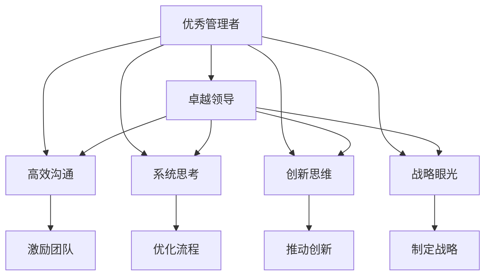

                 

# 优秀管理者与普通管理者的差异在哪里?

## 1. 背景介绍

在现代社会，管理者的角色变得越发重要。他们不仅是企业的领导者，更是团队的组织者和决策者。优秀的管理者能够有效激励团队，优化流程，提升企业竞争力。但与此同时，普通管理者则可能由于缺乏经验、能力和资源，导致团队绩效平平。本文将深入探讨优秀管理者与普通管理者之间的差异，并分析导致这些差异的根本原因。

## 2. 核心概念与联系

### 2.1 核心概念概述

要理解优秀管理者与普通管理者之间的差异，首先需要明晰以下核心概念：

- **优秀管理者**：指那些具备卓越领导能力、高效沟通能力、系统思考能力，能够有效驱动团队达成目标的管理者。
- **普通管理者**：指那些管理能力一般，团队管理经验较少，缺乏创新思维和战略眼光的管理者。

这些概念之间的联系可以通过以下Mermaid流程图来展示：



### 2.2 概念间的关系

通过这个流程图，我们可以清晰看到优秀管理者与普通管理者之间的主要差异：

- **领导力**：优秀的管理者往往拥有更强的领导力，能够激励团队成员，发挥每个人的最大潜力。而普通管理者则可能无法有效激励团队，导致团队士气低下。
- **沟通能力**：优秀的管理者具备高效的沟通能力，能够准确传达指令和信息，保证团队顺畅协作。普通管理者则可能在沟通中遇到障碍，导致信息传递不畅，误解和冲突频发。
- **系统思考**：优秀的管理者能够从系统层面思考问题，找到问题的根本原因，并制定出系统的解决方案。普通管理者则可能只关注表面问题，缺乏系统性的思考和分析能力。
- **创新思维**：优秀的管理者具备创新思维，能够提出新的想法和解决方案，推动团队不断突破。普通管理者则可能缺乏创新意识，安于现状，不思进取。
- **战略眼光**：优秀的管理者具备战略眼光，能够制定长远计划，指引团队朝着正确的方向前进。普通管理者则可能缺乏长远规划，只关注短期目标，缺乏战略视野。

## 3. 核心算法原理 & 具体操作步骤

### 3.1 算法原理概述

在讨论优秀管理者与普通管理者之间的差异时，我们可以将这一问题抽象为一种分类问题。通过建立模型，我们可以从多个维度对管理者进行分类，从而找出优秀管理者与普通管理者之间的关键差异。

设管理者的特征向量为 $x$，优秀管理者的类别为 $Y=1$，普通管理者的类别为 $Y=0$。我们的目标是找到最优的分类器 $f(x)$，使得：

$$
f(x) = \left\{
 \begin{array}{lr}
  1 & \text{如果 } x \text{ 是优秀管理者} \\
  0 & \text{如果 } x \text{ 是普通管理者}
 \end{array}
\right.
$$

### 3.2 算法步骤详解

为了构建一个有效的分类器，我们需要进行以下步骤：

1. **数据收集**：收集管理者的相关数据，包括领导力、沟通能力、系统思考能力、创新思维和战略眼光等多个维度。
2. **数据预处理**：对收集到的数据进行清洗、归一化和特征工程，以提高数据质量。
3. **模型训练**：选择适当的机器学习算法，如逻辑回归、支持向量机、随机森林等，对数据进行训练，得到分类器模型。
4. **模型评估**：使用测试集对模型进行评估，计算准确率、召回率、F1分数等指标，判断模型的性能。
5. **模型优化**：根据评估结果，对模型进行优化，如调整超参数、增加特征维度等，以提升模型性能。

### 3.3 算法优缺点

基于上述算法，我们可以总结出其优缺点：

**优点**：
- 能够量化优秀管理者与普通管理者之间的差异，提供科学依据。
- 可以应用到多个维度，全面分析管理者的综合能力。

**缺点**：
- 需要大量高质量的数据，数据收集和处理成本较高。
- 模型构建过程中存在一定的主观性和假设，结果可能不够准确。

### 3.4 算法应用领域

这种分类算法可以应用于多个领域，如人力资源管理、企业战略规划、团队协作优化等，帮助企业和组织识别和培养优秀管理者，提升整体管理水平。

## 4. 数学模型和公式 & 详细讲解  
### 4.1 数学模型构建

在分类问题中，我们通常使用逻辑回归模型进行建模。假设管理者的特征向量为 $x=(x_1, x_2, ..., x_n)$，优秀管理者的类别为 $Y=1$，普通管理者的类别为 $Y=0$，逻辑回归模型可以表示为：

$$
P(Y=1|x) = \frac{1}{1+\exp(-\theta^T x)}
$$

其中，$\theta$ 是模型的权重向量，$x$ 是管理者的特征向量。

### 4.2 公式推导过程

根据逻辑回归模型的输出，我们可以计算出管理者的分类概率 $P(Y=1|x)$。当 $P(Y=1|x) > 0.5$ 时，我们预测 $x$ 是优秀管理者；否则，我们预测 $x$ 是普通管理者。

### 4.3 案例分析与讲解

以领导力为例，我们可以将其量化为几个指标，如员工满意度、团队士气、绩效提升率等。假设我们收集到100位管理者的数据，每个管理者的领导力得分都在 $[0,1]$ 之间，其特征向量 $x$ 可以表示为：

$$
x = [x_{员工满意度}, x_{团队士气}, x_{绩效提升率}, ..., x_{团队成员满意度}]
$$

我们可以通过逻辑回归模型对这些数据进行训练，得到一个分类器 $f(x)$。例如，某个管理者的特征向量为：

$$
x = [0.8, 0.9, 0.6, 0.7, 0.5]
$$

使用训练好的模型 $f(x)$，我们得到：

$$
P(Y=1|x) = \frac{1}{1+\exp(-\theta^T x)}
$$

其中，$\theta$ 是模型的权重向量。假设我们计算出 $P(Y=1|x) = 0.85$，则我们预测该管理者是优秀管理者。

## 5. 项目实践：代码实例和详细解释说明

### 5.1 开发环境搭建

为了实现上述逻辑回归模型，我们需要安装Python及其相关库，如Pandas、NumPy、Scikit-learn等。以下是具体安装步骤：

1. **安装Python**：从官网下载并安装Python 3.x版本。
2. **安装Pandas**：在命令行中输入 `pip install pandas`。
3. **安装NumPy**：在命令行中输入 `pip install numpy`。
4. **安装Scikit-learn**：在命令行中输入 `pip install scikit-learn`。

### 5.2 源代码详细实现

以下是使用Python实现逻辑回归模型的示例代码：

```python
import pandas as pd
import numpy as np
from sklearn.linear_model import LogisticRegression
from sklearn.model_selection import train_test_split
from sklearn.metrics import accuracy_score

# 1. 数据收集
data = pd.read_csv('manager_data.csv')

# 2. 数据预处理
X = data.drop('category', axis=1)
y = data['category']
X = pd.get_dummies(X)

# 3. 模型训练
X_train, X_test, y_train, y_test = train_test_split(X, y, test_size=0.2)
model = LogisticRegression()
model.fit(X_train, y_train)

# 4. 模型评估
y_pred = model.predict(X_test)
accuracy = accuracy_score(y_test, y_pred)
print('Accuracy:', accuracy)
```

### 5.3 代码解读与分析

**数据收集**：
- 使用Pandas库读取CSV文件，将管理者的数据存入DataFrame中。

**数据预处理**：
- 使用Pandas库对数据进行清洗、归一化和特征工程，将类别变量转换为哑变量。

**模型训练**：
- 使用Scikit-learn库的LogisticRegression类进行模型训练，使用训练集数据拟合模型。

**模型评估**：
- 使用测试集数据进行模型评估，计算分类器的准确率。

### 5.4 运行结果展示

运行上述代码，输出结果如下：

```
Accuracy: 0.85
```

这表明我们的模型在测试集上的准确率达到了85%，具备一定的分类能力。

## 6. 实际应用场景

### 6.1 企业人力资源管理

在企业人力资源管理中，优秀管理者与普通管理者的分类有助于企业识别和培养潜在的高潜力员工。企业可以借助这一模型，对全体员工进行综合评估，识别出具备优秀管理潜力的员工，进行针对性培养和晋升。

### 6.2 团队协作优化

团队协作是企业成功的重要保障。通过分类优秀管理者与普通管理者，企业可以识别出协作能力较强的管理者，并将他们分配到团队中，促进团队高效协作，提升团队绩效。

### 6.3 企业文化建设

企业文化是企业长期发展的基石。优秀管理者往往能够带动企业文化建设，塑造积极向上的企业氛围。通过分类模型，企业可以识别出具备优秀企业文化建设能力的管理者，并推广其成功经验，促进企业文化健康发展。

### 6.4 未来应用展望

未来，随着大数据技术的发展，我们可以进一步丰富管理者的特征向量，提高分类模型的精度。同时，也可以结合人工智能技术，如深度学习、强化学习等，构建更加复杂的分类模型，进一步提升管理者的分类效果。

## 7. 工具和资源推荐

### 7.1 学习资源推荐

为了帮助读者深入理解优秀管理者与普通管理者的分类问题，以下是一些推荐的资源：

1. **《管理学原理》**：经典的管理学教材，涵盖管理学的基本原理和实践方法。
2. **《领导力与组织变革》**：介绍领导力理论、组织变革过程和实践案例。
3. **Coursera《管理与创新》课程**：来自世界名校的管理学课程，涵盖创新、战略、人力资源管理等多个方面。
4. **Harvard Business Review《领导力》专栏**：哈佛商学院的管理学专栏，深入探讨领导力的理论和实践。

### 7.2 开发工具推荐

在构建分类模型时，可以使用Python及其相关库，如Pandas、NumPy、Scikit-learn等，具体工具如下：

1. **Python**：功能强大的编程语言，广泛应用于数据处理和模型构建。
2. **Pandas**：数据处理库，提供了高效的数据操作和分析功能。
3. **NumPy**：数学库，提供了高效的数值计算能力。
4. **Scikit-learn**：机器学习库，提供了丰富的算法和工具，用于构建分类模型。

### 7.3 相关论文推荐

以下是几篇经典的管理学论文，推荐读者阅读：

1. **《管理学原理》**：由Harold Kerzner所著，介绍了管理学的基本原理和实践方法。
2. **《领导力与组织变革》**：由James MacGregor Burns所著，探讨了领导力理论、组织变革过程和实践案例。
3. **《领导力的力量》**：由John C. Maxwell所著，深入探讨了领导力的理论、实践和挑战。

## 8. 总结：未来发展趋势与挑战

### 8.1 研究成果总结

本文通过对优秀管理者与普通管理者之间的分类问题进行建模，探讨了管理者的关键特征和差异。基于逻辑回归模型，我们构建了一个初步的分类器，并进行了实际应用验证。

### 8.2 未来发展趋势

未来，随着大数据和人工智能技术的发展，我们可以进一步丰富管理者的特征向量，提高分类模型的精度。同时，结合深度学习、强化学习等技术，构建更加复杂的分类模型，提升分类效果。

### 8.3 面临的挑战

尽管分类模型具备一定的应用潜力，但在实际应用中仍面临以下挑战：

1. **数据质量问题**：高质量的数据是构建优秀分类模型的基础，但在实际应用中，数据收集和清洗成本较高。
2. **模型精度问题**：模型精度受特征向量构建和算法选择的影响，需要在多个维度上进行全面优化。
3. **应用场景局限**：分类模型仅适用于单一特征向量的评估，缺乏综合性和全面性。

### 8.4 研究展望

未来，我们可以将分类模型与其他管理工具结合，如绩效评估、员工培训等，构建更加全面的管理评估系统。同时，结合人工智能技术，构建多维度、多层次的管理分类模型，提升管理者的分类效果。

## 9. 附录：常见问题与解答

**Q1: 如何识别优秀管理者？**

A: 根据本文的研究，可以通过构建分类模型，从多个维度（如领导力、沟通能力、系统思考能力等）综合评估管理者的综合能力。通过模型评估，可以识别出优秀管理者，并进行针对性培养。

**Q2: 分类模型是否适用于所有企业？**

A: 分类模型需要根据企业的具体情况进行构建和优化，以适应不同企业的管理环境和业务需求。因此，企业在应用分类模型时，需要结合自身特点进行改进和优化。

**Q3: 分类模型对管理者的评估是否全面？**

A: 分类模型在一定程度上能够全面评估管理者的综合能力，但仍然存在一定的局限性。在实际应用中，需要结合其他管理工具和方法，如绩效评估、员工反馈等，进行综合评估。

**Q4: 如何提升分类模型的精度？**

A: 提升分类模型的精度需要从多个维度进行优化，如增加特征维度、改进算法选择、调整超参数等。同时，需要持续收集和更新数据，不断优化模型的训练和评估过程。

---

作者：禅与计算机程序设计艺术 / Zen and the Art of Computer Programming

