                 

# 何为语言？信息又如何传播？

> 关键词：语言模型,信息传播,自然语言处理,神经网络,深度学习,Transformer,语言理解,语言生成

## 1. 背景介绍

### 1.1 问题由来
随着信息技术的不断进步，人类社会的信息获取、传播和处理方式发生了根本性的变革。从传统的文字、语音、图像，到今天的海量文本数据，信息的形式越来越丰富，结构也越来越复杂。自然语言处理（Natural Language Processing, NLP）作为人工智能领域的重要分支，致力于让机器更好地理解和生成人类语言，为信息的高效传播和智能应用提供了重要的技术支撑。

在NLP研究中，语言模型作为其核心组件之一，通过对语言的概率分布进行建模，成为了理解和生成自然语言的基础。随着深度学习和大规模预训练语言模型（Large Language Models, LLMs）的兴起，语言模型及其在NLP中的应用，再次引起了学术界和工业界的广泛关注。

### 1.2 问题核心关键点
语言模型在NLP中扮演着至关重要的角色。它通过对语言的统计规律进行建模，能够预测给定文本序列的下一个词汇或句子。常见的语言模型包括N-gram模型、基于神经网络的语言模型等。其中，基于深度学习的语言模型，如Transformer架构的模型，由于其强大的表达能力和泛化能力，成为了NLP研究的热点。

在深度学习语言模型中，Transformer架构以其自注意力机制的优越性，成为了当前的主流模型。Transformer模型通过多头注意力机制，能够高效地捕捉文本序列中长距离依赖关系，从而在语言理解和生成任务中取得了显著的进步。

### 1.3 问题研究意义
语言模型的研究不仅对于NLP领域具有重要意义，它还与更广泛的信息传播和智能应用紧密相关。通过对语言的理解和生成，机器能够更准确地理解和生成信息，从而促进信息的传播和人类社会的智能应用。

语言模型的研究还将推动NLP技术向更广泛的应用场景扩展，如智能客服、智能翻译、智能问答等，为各行各业带来新的发展机遇。此外，语言模型的研究还将促进跨领域知识的学习和迁移，为构建通用人工智能（General AI）奠定基础。

## 2. 核心概念与联系

### 2.1 核心概念概述

为更好地理解语言模型及其在信息传播中的应用，本节将介绍几个关键概念：

- 语言模型（Language Model）：通过对语言的概率分布进行建模，预测给定文本序列的下一个词汇或句子。常见的语言模型包括N-gram模型、基于神经网络的模型等。

- 深度学习语言模型（Deep Learning Language Model）：使用深度神经网络对语言进行建模，具有强大的表达能力和泛化能力。常见的深度学习语言模型包括RNN、LSTM、Transformer等。

- 自然语言处理（Natural Language Processing, NLP）：研究如何让机器理解和生成人类语言，涉及文本分类、情感分析、机器翻译、问答系统等多个任务。

- Transformer：一种基于自注意力机制的深度学习模型架构，由于其高效的并行计算能力和强大的表达能力，成为了当前NLP领域的主流模型。

- 自注意力机制（Self-Attention Mechanism）：Transformer的核心组件，通过对输入序列的各个位置进行加权平均，计算出每个位置的表示，从而捕捉长距离依赖关系。

- 多头注意力（Multi-Head Attention）：Transformer中的一种注意力机制，通过多头并行计算，进一步提高了模型的表达能力和泛化能力。

- 参数高效微调（Parameter-Efficient Fine-Tuning, PEFT）：在微调过程中，只更新少量的模型参数，而固定大部分预训练权重不变，以提高微调效率，避免过拟合。

- 提示学习（Prompt Learning）：通过在输入文本中添加提示模板（Prompt Template），引导模型按期望方式输出，减少微调参数。

- 少样本学习（Few-shot Learning）：在只有少量标注样本的情况下，模型能够快速适应新任务的学习方法。

- 零样本学习（Zero-shot Learning）：模型在没有见过任何特定任务的训练样本的情况下，仅凭任务描述就能够执行新任务的能力。

这些概念之间的逻辑关系可以通过以下Mermaid流程图来展示：


这个流程图展示了大语言模型的核心概念及其之间的关系：

1. 大语言模型通过自注意力机制和多头注意力机制进行高效建模。
2. 基于深度学习的语言模型是NLP任务的基础。
3. 提示学习、少样本学习和零样本学习是微调大语言模型时的常用方法。
4. 参数高效微调在保留预训练权重的同时，仅微调少量的模型参数。

这些概念共同构成了语言模型及其在信息传播中的应用框架，使得机器能够更好地理解和生成人类语言。

### 2.2 概念间的关系

这些核心概念之间存在着紧密的联系，形成了语言模型及其应用的整体生态系统。下面我们通过几个Mermaid流程图来展示这些概念之间的关系。

#### 2.2.1 语言模型的基本架构


这个流程图展示了Transformer模型中语言模型的基本架构：

1. 输入序列经过多头自注意力和线性层的编码器进行建模。
2. 解码器通过多头自注意力和线性层对输入序列进行生成，最终输出序列。

#### 2.2.2 语言模型的训练和应用


这个流程图展示了语言模型的训练和应用过程：

1. 大语言模型通过大规模文本数据进行预训练。
2. 微调、提示学习、少样本学习和零样本学习等方法在微调大语言模型时得到应用。
3. 微调后的模型用于下游任务，如分类、匹配、生成等。

#### 2.2.3 提示学习的具体实现


这个流程图展示了提示学习的具体实现过程：

1. 输入文本与提示模板组合，作为模型的输入。
2. 大语言模型根据输入生成预测输出。
3. 解析预测输出，并根据需求进行反馈。

### 2.3 核心概念的整体架构

最后，我们用一个综合的流程图来展示这些核心概念在大语言模型中的整体架构：

```mermaid
graph TB
    A[大规模文本数据] --> B[预训练]
    B --> C[大语言模型]
    C --> D[微调]
    C --> E[提示学习]
    C --> F[少样本学习]
    C --> G[零样本学习]
    C --> H[参数高效微调]
    D --> I[下游任务]
    F --> I
    G --> I
    H --> I
    I --> J[持续学习]
    J --> K[模型更新]
    K --> C
```



这个综合流程图展示了从预训练到微调，再到下游任务的应用过程。大语言模型首先在大规模文本数据上进行预训练，然后通过微调、提示学习、少样本学习和零样本学习等方法，适应特定任务，并用于实际应用场景。

## 3. 核心算法原理 & 具体操作步骤
### 3.1 算法原理概述

语言模型的基本原理是通过对语言的概率分布进行建模，从而预测给定文本序列的下一个词汇或句子。常见的语言模型包括N-gram模型和基于神经网络的模型。其中，基于深度学习的语言模型具有强大的表达能力和泛化能力，通过神经网络对语言进行建模。

在深度学习语言模型中，Transformer模型由于其高效的并行计算能力和强大的表达能力，成为了当前的主流模型。Transformer模型通过多头自注意力机制和多头注意力机制，能够高效地捕捉文本序列中长距离依赖关系。

Transformer模型的核心架构包括编码器和解码器。编码器通过自注意力机制对输入序列进行建模，生成编码表示。解码器通过自注意力机制和多头注意力机制对编码表示进行生成，最终输出序列。整个模型通过学习输入序列和输出序列之间的对应关系，从而实现语言的理解和生成。

### 3.2 算法步骤详解

深度学习语言模型的训练和应用过程一般包括以下几个关键步骤：

**Step 1: 准备数据集和模型架构**
- 收集大规模文本数据，划分为训练集、验证集和测试集。
- 选择合适的深度学习语言模型架构，如Transformer。
- 设计输入和输出层，以及对应的损失函数。

**Step 2: 进行预训练**
- 使用大规模文本数据对模型进行预训练，学习语言的统计规律。
- 采用自监督学习方法，如掩码语言模型（Masked Language Modeling, MLM）和下一句预测（Next Sentence Prediction, NSP），对模型进行预训练。
- 通过梯度下降等优化算法，不断更新模型参数，最小化预训练损失。

**Step 3: 进行微调**
- 收集下游任务的标注数据，划分为训练集、验证集和测试集。
- 在预训练模型的基础上，通过有监督学习优化模型在特定任务上的性能。
- 选择合适的优化算法及其参数，如AdamW、SGD等，设置学习率、批大小、迭代轮数等。
- 设置正则化技术及强度，包括权重衰减、Dropout、Early Stopping等。
- 确定冻结预训练参数的策略，如仅微调顶层，或全部参数都参与微调。

**Step 4: 进行测试和部署**
- 在测试集上评估微调后模型的性能，对比微调前后的精度提升。
- 使用微调后的模型对新样本进行推理预测，集成到实际的应用系统中。
- 持续收集新的数据，定期重新微调模型，以适应数据分布的变化。

以上是深度学习语言模型的基本训练和应用过程。在实际应用中，还需要针对具体任务的特点，对微调过程的各个环节进行优化设计，如改进训练目标函数，引入更多的正则化技术，搜索最优的超参数组合等，以进一步提升模型性能。

### 3.3 算法优缺点

深度学习语言模型具有以下优点：
1. 强大的表达能力：Transformer模型能够高效地捕捉文本序列中长距离依赖关系，从而在语言理解和生成任务中取得了显著的进步。
2. 良好的泛化能力：大规模预训练语言模型在大规模语料上进行预训练，能够学习到通用的语言表示，适用于多种NLP任务。
3. 高效的并行计算：Transformer模型采用了自注意力机制，能够进行高效的并行计算，加速模型训练和推理过程。

然而，深度学习语言模型也存在一些局限性：
1. 依赖标注数据：深度学习语言模型的训练过程需要大量的标注数据，标注成本较高。
2. 过拟合风险：在标注数据不足的情况下，模型容易过拟合，泛化性能受到影响。
3. 计算资源需求高：大规模预训练语言模型的参数量较大，训练和推理过程需要大量的计算资源。
4. 可解释性不足：深度学习语言模型通常被认为是“黑盒”系统，难以解释其内部工作机制和决策逻辑。

尽管存在这些局限性，深度学习语言模型在NLP领域的应用已经取得了显著的成功，并成为了当前研究的热点。未来相关研究的方向之一是如何进一步降低深度学习语言模型的标注需求，提高其少样本学习和跨领域迁移能力，同时兼顾可解释性和伦理安全性等因素。

### 3.4 算法应用领域

深度学习语言模型已经在多个NLP任务上取得了显著的成果，包括：

- 文本分类：如情感分析、主题分类、意图识别等。通过微调使模型学习文本-标签映射。
- 命名实体识别：识别文本中的人名、地名、机构名等特定实体。通过微调使模型掌握实体边界和类型。
- 关系抽取：从文本中抽取实体之间的语义关系。通过微调使模型学习实体-关系三元组。
- 问答系统：对自然语言问题给出答案。将问题-答案对作为微调数据，训练模型学习匹配答案。
- 机器翻译：将源语言文本翻译成目标语言。通过微调使模型学习语言-语言映射。
- 文本摘要：将长文本压缩成简短摘要。将文章-摘要对作为微调数据，使模型学习抓取要点。
- 对话系统：使机器能够与人自然对话。将多轮对话历史作为上下文，微调模型进行回复生成。

除了上述这些经典任务外，深度学习语言模型还被创新性地应用到更多场景中，如可控文本生成、常识推理、代码生成、数据增强等，为NLP技术带来了全新的突破。随着深度学习语言模型的不断进步，相信NLP技术将在更广阔的应用领域大放异彩。

## 4. 数学模型和公式 & 详细讲解  
### 4.1 数学模型构建

在深度学习语言模型中，我们通常使用Transformer架构进行建模。以下是Transformer模型的一般架构：


在这个架构中，编码器和解码器分别负责对输入序列和输出序列进行建模。每个子层都包括多头自注意力层、线性层和残差连接层，并通过层归一化进行归一化处理。

### 4.2 公式推导过程

假设输入序列为 $x_1, x_2, ..., x_n$，输出序列为 $y_1, y_2, ..., y_n$，使用Transformer模型进行语言建模。我们定义 $z_i = (y_1, y_2, ..., y_i)$ 表示输出序列的前 $i$ 个位置，$h_i = (x_1, x_2, ..., x_i)$ 表示输入序列的前 $i$ 个位置。

在Transformer模型中，每个位置 $i$ 的表示 $z_i$ 由自注意力机制和多头注意力机制计算得出：

$$
z_i = \text{Attention}(Q(z_{i-1}), K(z_{i-1}), V(z_{i-1}))
$$

其中 $Q(z_{i-1})$ 为查询向量，$K(z_{i-1})$ 为键向量，$V(z_{i-1})$ 为值向量。通过多头注意力机制，Transformer模型能够同时关注输入序列的不同位置，从而捕捉长距离依赖关系。

在多头注意力机制中，每个位置的表示 $z_i$ 由多个头的注意力机制计算得出：

$$
z_i = \sum_{k=1}^K \alpha_k h_k + h_k
$$

其中 $\alpha_k$ 表示第 $k$ 头的注意力权重，$h_k$ 表示第 $k$ 头的表示。每个头的注意力权重通过计算查询向量 $Q(z_{i-1})$ 和键向量 $K(z_{i-1})$ 的相似度得到：

$$
\alpha_k = \frac{\exp(\text{score}(z_{i-1}, h_k))}{\sum_{k=1}^K \exp(\text{score}(z_{i-1}, h_k))}
$$

其中 $\text{score}(z_{i-1}, h_k)$ 表示查询向量 $Q(z_{i-1})$ 和键向量 $K(z_{i-1})$ 的相似度，通常采用点积形式：

$$
\text{score}(z_{i-1}, h_k) = \text{Q}(z_{i-1}) \cdot \text{K}(h_k)
$$

### 4.3 案例分析与讲解

假设我们有一个简单的文本分类任务，输入为一句话，输出为该句子的情感类别。我们首先使用Transformer模型对输入进行编码，然后将其输入到分类器中进行分类。

假设输入序列为 $x_1, x_2, ..., x_n$，输出序列为 $y_1, y_2, ..., y_n$。我们定义 $z_i = (y_1, y_2, ..., y_i)$ 表示输出序列的前 $i$ 个位置，$h_i = (x_1, x_2, ..., x_i)$ 表示输入序列的前 $i$ 个位置。

在Transformer模型中，每个位置 $i$ 的表示 $z_i$ 由自注意力机制和多头注意力机制计算得出：

$$
z_i = \text{Attention}(Q(z_{i-1}), K(z_{i-1}), V(z_{i-1}))
$$

其中 $Q(z_{i-1})$ 为查询向量，$K(z_{i-1})$ 为键向量，$V(z_{i-1})$ 为值向量。通过多头注意力机制，Transformer模型能够同时关注输入序列的不同位置，从而捕捉长距离依赖关系。

在多头注意力机制中，每个位置的表示 $z_i$ 由多个头的注意力机制计算得出：

$$
z_i = \sum_{k=1}^K \alpha_k h_k + h_k
$$

其中 $\alpha_k$ 表示第 $k$ 头的注意力权重，$h_k$ 表示第 $k$ 头的表示。每个头的注意力权重通过计算查询向量 $Q(z_{i-1})$ 和键向量 $K(z_{i-1})$ 的相似度得到：

$$
\alpha_k = \frac{\exp(\text{score}(z_{i-1}, h_k))}{\sum_{k=1}^K \exp(\text{score}(z_{i-1}, h_k))}
$$

其中 $\text{score}(z_{i-1}, h_k)$ 表示查询向量 $Q(z_{i-1})$ 和键向量 $K(z_{i-1})$ 的相似度，通常采用点积形式：

$$
\text{score}(z_{i-1}, h_k) = \text{Q}(z_{i-1}) \cdot \text{K}(h_k)
$$

在得到输入序列的表示 $z_n$ 后，我们将其输入到分类器中进行分类。分类器通常是一个简单的全连接层，输出为一个类别概率分布。

假设分类器输出为 $p_1, p_2, ..., p_n$，其中 $p_i$ 表示输入序列为 $x_1, x_2, ..., x_i$ 时，情感类别为正类的概率。我们定义 $y_i = \text{argmax}(p_i)$，即情感分类结果。

在训练过程中，我们定义交叉熵损失函数为：

$$
\mathcal{L}(p, y) = -\sum_{i=1}^n y_i \log p_i + (1 - y_i) \log (1 - p_i)
$$

其中 $y_i$ 表示真实标签，$p_i$ 表示模型预测的概率。通过梯度下降等优化算法，我们不断更新模型参数，最小化损失函数 $\mathcal{L}$，从而提高模型的预测准确率。

## 5. 项目实践：代码实例和详细解释说明
### 5.1 开发环境搭建

在进行深度学习语言模型实践前，我们需要准备好开发环境。以下是使用Python进行PyTorch开发的环境配置流程：

1. 安装Anaconda：从官网下载并安装Anaconda，用于创建独立的Python环境。

2. 创建并激活虚拟环境：
```bash
conda create -n pytorch-env python=3.8 
conda activate pytorch-env
```

3. 安装PyTorch：根据CUDA版本，从官网获取对应的安装命令。例如：
```bash
conda install pytorch torchvision torchaudio cudatoolkit=11.1 -c pytorch -c conda-forge
```

4. 安装Transformer库：
```bash
pip install transformers
```

5. 安装各类工具包：
```bash
pip install numpy pandas scikit-learn matplotlib tqdm jupyter notebook ipython
```

完成上述步骤后，即可在`pytorch-env`环境中开始深度学习语言模型的实践。

### 5.2 源代码详细实现

下面我们以文本分类任务为例，给出使用Transformers库对BERT模型进行深度学习语言模型训练的PyTorch代码实现。

首先，定义文本分类任务的数据处理函数：

```python
from transformers import BertTokenizer
from torch.utils.data import Dataset
import torch

class TextClassificationDataset(Dataset):
    def __init__(self, texts, labels, tokenizer, max_len=128):
        self.texts = texts
        self.labels = labels
        self.tokenizer = tokenizer
        self.max_len = max_len
        
    def __len__(self):
        return len(self.texts)
    
    def __getitem__(self, item):
        text = self.texts[item]
        label = self.labels[item]
        
        encoding = self.tokenizer(text, return_tensors='pt', max_length=self.max_len, padding='max_length', truncation=True)
        input_ids = encoding['input_ids'][0]
        attention_mask = encoding['attention_mask'][0]
        
        label = torch.tensor(label, dtype=torch.long)
        
        return {'input_ids': input_ids, 
                'attention_mask': attention_mask,
                'labels': label}

# 标签与id的映射
label2id = {'positive': 1, 'negative': 0}
id2label = {v: k for k, v in label2id.items()}

# 创建dataset
tokenizer = BertTokenizer.from_pretrained('bert-base-cased')

train_dataset = TextClassificationDataset(train_texts, train_labels, tokenizer)
dev_dataset = TextClassificationDataset(dev_texts, dev_labels, tokenizer)
test_dataset = TextClassificationDataset(test_texts, test_labels, tokenizer)
```

然后，定义模型和优化器：

```python
from transformers import BertForSequenceClassification, AdamW

model = BertForSequenceClassification.from_pretrained('bert-base-cased', num_labels=len(label2id))

optimizer = AdamW(model.parameters(), lr=2e-5)
```

接着，定义训练和评估函数：

```python
from torch.utils.data import DataLoader
from tqdm import tqdm
from sklearn.metrics import accuracy_score

device = torch.device('cuda') if torch.cuda.is_available() else torch.device('cpu')
model.to(device)

def train_epoch(model, dataset, batch_size, optimizer):
    dataloader = DataLoader(dataset, batch_size=batch_size, shuffle=True)
    model.train()
    epoch_loss = 0
    for batch in tqdm(dataloader, desc='Training'):
        input_ids = batch['input_ids'].to(device)
        attention_mask = batch['attention_mask'].to(device)
        labels = batch['labels'].to(device)
        model.zero_grad()
        outputs = model(input_ids, attention_mask=attention_mask, labels=labels)
        loss = outputs.loss
        epoch_loss += loss.item()
        loss.backward()
        optimizer.step()
    return epoch_loss / len(dataloader)

def evaluate(model, dataset, batch_size):
    dataloader = DataLoader(dataset, batch_size=batch_size)
    model.eval()
    preds, labels = [], []
    with torch.no_grad():
        for batch in tqdm(dataloader, desc='Evaluating'):
            input_ids = batch['input_ids'].to(device)
            attention_mask = batch['attention_mask'].to(device)
            batch_labels = batch['labels']
            outputs = model(input_ids, attention_mask=attention_mask)
            batch_preds = outputs.logits.argmax(dim=2).to('cpu').tolist()
            batch_labels = batch_labels.to('cpu').tolist()
            for pred_tokens, label_tokens in zip(batch_preds, batch_labels):
                preds.append(pred_tokens[:len(label_tokens)])
                labels.append(label_tokens)
                
    print(accuracy_score(labels, preds))
```

最后，启动训练流程并在测试集上评估：

```python
epochs = 5
batch_size = 16

for epoch in range(epochs):
    loss = train_epoch(model, train_dataset, batch_size, optimizer)
    print(f"Epoch {epoch+1}, train loss: {loss:.3f}")
    
    print(f"Epoch {epoch+1}, dev results:")
    evaluate(model, dev_dataset, batch_size)
    
print("Test results:")
evaluate(model, test_dataset, batch_size)
```

以上就是使用PyTorch对BERT进行文本分类任务训练的完整代码实现。可以看到，得益于Transformers库的强大封装，我们可以用相对简洁的代码完成BERT模型的加载和训练。

### 5.3 代码解读与分析

让我们再详细解读一下关键代码的实现细节：

**TextClassificationDataset类**：
- `__init__`方法：初始化文本、标签、分词器等关键组件。
- `__len__`方法：返回数据集的样本数量。
- `__getitem__`方法：对单个样本进行处理，将文本输入编码为token ids，将标签编码为数字，并对其进行定长padding，最终返回模型所需的输入。

**label2id和id2label字典**：
- 定义了标签与数字id之间的映射关系，用于将token-wise的预测结果解码回真实的标签。

**训练和评估函数**

