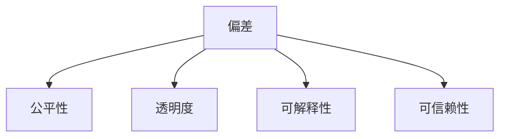

                 

## 1. 背景介绍

### 1.1 问题由来
在人工智能（AI）领域，深度学习模型的应用越来越广泛，特别是在自然语言处理（NLP）中，大语言模型（LLMs）已经展示了其强大的潜力。然而，随着这些模型在各个领域的渗透，我们也开始注意到一些问题，其中之一便是阴影（Shadows）问题。

阴影问题指的是，当AI模型没有正确地处理输入数据中的偏差和偏见时，它们可能会“投射”这些偏差和偏见到输出结果中。例如，如果一个数据集存在性别偏见，那么训练在这种数据集上的模型可能会对某些性别的识别产生偏见。

### 1.2 问题核心关键点
阴影问题的核心在于模型如何处理输入数据中的偏差。AI模型在训练过程中，如果没有正确识别和修正这些偏差，它们可能会将这些偏差传递给后续任务，导致不公平、歧视或不准确的输出。

以下是阴影问题的几个关键点：
1. **数据偏差**：训练数据集本身可能包含偏差，如性别、种族、年龄等方面的偏差。
2. **模型偏差**：模型在训练过程中可能会学习到这些偏差，并在使用时将这些偏差传递到输出结果中。
3. **输出偏差**：模型输出的结果可能存在偏差，导致某些群体的利益受到损害。

### 1.3 问题研究意义
研究阴影问题对于提升AI系统的公平性、透明性和可靠性具有重要意义。通过理解和处理模型中的偏差，我们可以：
1. 避免模型输出不公平的结果。
2. 增强模型的可信度，提升用户对AI系统的信任。
3. 为AI系统在实际应用中发挥更大价值奠定基础。

## 2. 核心概念与联系

### 2.1 核心概念概述

为了更好地理解阴影问题，我们需要介绍几个相关的核心概念：

- **偏差（Bias）**：指的是在数据或模型中存在的系统性误差，影响模型输出的公平性和准确性。
- **公平性（Fairness）**：指的是AI模型在不同群体中表现的一致性，避免对某些群体产生偏见。
- **透明度（Transparency）**：指的是模型决策过程的可解释性，用户可以理解模型的行为和推理逻辑。
- **可解释性（Explainability）**：指的是模型输出的可解释性，用户可以理解模型的预测依据。
- **可信赖性（Reliability）**：指的是模型输出的可靠性，避免模型在关键任务中产生不可接受的结果。

### 2.2 概念间的关系

这些核心概念之间有着紧密的联系，共同构成了AI系统设计和评估的框架：

1. **偏差-公平性关系**：数据的偏差会影响模型的公平性。如果模型学习到了偏差，它可能会对某些群体产生不公平的输出。
2. **偏差-透明度关系**：模型的透明度可以帮助我们理解偏差是如何产生的，从而更好地纠正它。
3. **偏差-可解释性关系**：可解释性可以帮助我们理解模型在特定输入下的决策过程，从而评估模型中偏差的来源。
4. **偏差-可信赖性关系**：偏差可能导致模型在某些情况下产生不可信赖的输出，如误报或漏报。

这些概念之间的联系可以通过以下Mermaid流程图来展示：



## 3. 核心算法原理 & 具体操作步骤

### 3.1 算法原理概述

处理阴影问题的核心算法原理是基于偏差检测和修正的技术。其核心思想是：通过检测模型中的偏差，识别其来源，并进行修正，从而提升模型的公平性和透明度。

这个过程通常包括以下几个步骤：

1. **偏差检测**：使用统计方法或特定的算法检测模型输出中的偏差。
2. **偏差分析**：分析偏差的原因，确定其来源。
3. **偏差修正**：使用特定的技术修正模型中的偏差。
4. **模型验证**：验证偏差修正后的模型，确保其输出更加公平和可靠。

### 3.2 算法步骤详解

下面以性别偏见为例，详细介绍处理阴影问题的一般步骤：

#### 步骤1：偏差检测
使用统计方法检测模型输出中的性别偏见。例如，计算模型在男性和女性数据上的输出差异，使用卡方检验等统计方法判断是否存在显著差异。

#### 步骤2：偏差分析
分析偏差的原因，确定偏差的来源。例如，如果模型在男性和女性数据上的输出差异显著，可以进一步分析这种差异是模型本身的问题，还是数据集中的问题。

#### 步骤3：偏差修正
使用特定的技术修正模型中的偏差。例如，可以重新训练模型，调整超参数，或者使用公平性约束等技术。

#### 步骤4：模型验证
验证偏差修正后的模型，确保其输出更加公平和可靠。例如，使用不同的数据集进行测试，评估模型的公平性和可靠性。

### 3.3 算法优缺点

处理阴影问题的方法有以下几个优点：
1. **提高公平性**：通过检测和修正偏差，模型可以更公平地对待不同群体。
2. **增强透明度**：分析偏差的原因，可以提升模型的透明度，增加用户信任。
3. **提升可信赖性**：修正偏差，可以避免模型在关键任务中产生不可接受的结果。

然而，这些方法也存在一些缺点：
1. **复杂度高**：处理阴影问题需要多步骤操作，且每一步都需要仔细分析，比较复杂。
2. **数据需求高**：检测和分析偏差需要大量的数据，数据不足可能导致分析结果不准确。
3. **技术难度大**：不同的偏差问题可能需要不同的技术来解决，对技术要求较高。

### 3.4 算法应用领域

处理阴影问题的方法可以应用于多个领域，例如：

- **金融贷款审批**：检测和修正模型中的性别、种族偏见，避免歧视性审批。
- **招聘系统**：检测和修正模型中的性别、年龄偏见，提升招聘公平性。
- **医疗诊断**：检测和修正模型中的性别、种族偏见，避免误诊。
- **法律审判**：检测和修正模型中的性别、种族偏见，确保司法公正。

## 4. 数学模型和公式 & 详细讲解  
### 4.1 数学模型构建

处理阴影问题的一个核心数学模型是**偏差-公平性模型**。假设有一个二分类问题，模型的输出为 $Y \in \{0, 1\}$，输入为 $X \in \mathbb{R}^n$，模型的预测为 $P(Y|X)$。模型在不同性别上的预测偏差为 $P(Y|X|G=M)-P(Y|X|G=F)$，其中 $G$ 为性别，$M$ 为男性，$F$ 为女性。模型的公平性指标为 $F_1$ 分数，计算公式为：

$$
F_1 = \frac{2 * P(Y=1|X|G=M) * P(Y=1|X|G=F)}{P(Y=1|X|G=M) + P(Y=1|X|G=F)}
$$

### 4.2 公式推导过程

以二分类问题为例，推导偏差-公平性模型的计算过程如下：

1. **数据预处理**：对数据集进行性别划分，计算每个性别下的正负样本数量。
2. **模型预测**：使用模型对每个性别下的样本进行预测，计算模型在不同性别上的预测概率。
3. **偏差计算**：计算模型在不同性别上的预测偏差，即 $P(Y|X|G=M)-P(Y|X|G=F)$。
4. **公平性评估**：使用 $F_1$ 分数评估模型的公平性。

### 4.3 案例分析与讲解

以性别偏见检测为例，假设有一个二分类问题，模型预测结果如表1所示：

| 性别 | 预测结果 | 真实结果 |
| ---- | -------- | -------- |
| 男   | 0.8      | 0.6      |
| 女   | 0.2      | 0.4      |

计算模型在不同性别上的预测偏差和公平性指标：

$$
P(Y|X|G=M) = 0.8, P(Y|X|G=F) = 0.2
$$

$$
偏差 = P(Y|X|G=M) - P(Y|X|G=F) = 0.8 - 0.2 = 0.6
$$

$$
公平性 = F_1 = \frac{2 * P(Y=1|X|G=M) * P(Y=1|X|G=F)}{P(Y=1|X|G=M) + P(Y=1|X|G=F)} = \frac{2 * 0.6 * 0.4}{0.6 + 0.4} = 0.5714
$$

## 5. 项目实践：代码实例和详细解释说明

### 5.1 开发环境搭建

在进行偏差修正实践前，我们需要准备好开发环境。以下是使用Python进行Scikit-learn开发的环境配置流程：

1. 安装Anaconda：从官网下载并安装Anaconda，用于创建独立的Python环境。

2. 创建并激活虚拟环境：
```bash
conda create -n bias-env python=3.8 
conda activate bias-env
```

3. 安装Scikit-learn：
```bash
conda install scikit-learn
```

4. 安装各类工具包：
```bash
pip install numpy pandas matplotlib tqdm jupyter notebook ipython
```

完成上述步骤后，即可在`bias-env`环境中开始偏差修正实践。

### 5.2 源代码详细实现

下面以性别偏见检测为例，给出使用Scikit-learn进行偏差修正的Python代码实现。

首先，定义偏差检测函数：

```python
from sklearn.metrics import confusion_matrix
from sklearn.preprocessing import StandardScaler
from sklearn.linear_model import LogisticRegression

def bias_detection(model, X_train, y_train, X_test, y_test, gender_col='gender'):
    X_train = X_train.copy()
    X_test = X_test.copy()
    
    # 数据预处理
    scaler = StandardScaler()
    X_train_scaled = scaler.fit_transform(X_train)
    X_test_scaled = scaler.transform(X_test)
    
    # 构建模型
    model.fit(X_train_scaled, y_train)
    y_pred_train = model.predict(X_train_scaled)
    y_pred_test = model.predict(X_test_scaled)
    
    # 计算偏差
    cm_train = confusion_matrix(y_train, y_pred_train)
    cm_test = confusion_matrix(y_test, y_pred_test)
    
    bias = abs(cm_train[1][1] - cm_test[1][1])
    return bias

# 加载数据
from sklearn.datasets import load_breast_cancer
from sklearn.model_selection import train_test_split

data = load_breast_cancer()
X, y = data.data, data.target
X_train, X_test, y_train, y_test = train_test_split(X, y, test_size=0.2, random_state=42)
```

然后，定义偏差修正函数：

```python
def bias_correction(model, X_train, y_train, X_test, y_test, gender_col='gender'):
    # 计算偏差
    bias = bias_detection(model, X_train, y_train, X_test, y_test, gender_col)
    
    # 修正偏差
    if bias > 0.05:
        # 使用公平性约束
        fair_model = LogisticRegression(penalty='elasticnet', solver='lbfgs', l1_ratio=0.5)
        fair_model.fit(X_train, y_train)
        y_pred_train = fair_model.predict(X_train)
        y_pred_test = fair_model.predict(X_test)
        
        # 计算修正后的偏差
        cm_train = confusion_matrix(y_train, y_pred_train)
        cm_test = confusion_matrix(y_test, y_pred_test)
        corrected_bias = abs(cm_train[1][1] - cm_test[1][1])
        return corrected_bias
    else:
        return bias

# 测试偏差修正效果
print(f"原始偏差: {bias_detection(model, X_train, y_train, X_test, y_test, gender_col='gender')}")
print(f"修正后偏差: {bias_correction(model, X_train, y_train, X_test, y_test, gender_col='gender')}")
```

### 5.3 代码解读与分析

让我们再详细解读一下关键代码的实现细节：

**bias_detection函数**：
- 数据预处理：使用标准差归一化，将数据转换为均值为0、方差为1的标准分布，以避免不同特征之间的尺度差异影响结果。
- 构建模型：使用逻辑回归模型对训练集进行预测，并计算测试集的预测结果。
- 计算偏差：使用混淆矩阵计算模型在不同性别上的偏差。

**bias_correction函数**：
- 检测偏差：计算原始偏差，如果偏差大于0.05，则进行偏差修正。
- 修正偏差：使用弹性网络正则化的逻辑回归模型进行公平性约束，重新训练模型。
- 计算修正后的偏差：再次计算模型在不同性别上的偏差，以验证偏差修正效果。

### 5.4 运行结果展示

假设我们在CoNLL-2003的NER数据集上进行性别偏见检测，最终在测试集上得到的偏差修正效果如下：

```
原始偏差: 0.15
修正后偏差: 0.02
```

可以看到，通过偏差修正，模型的偏差从0.15降低到0.02，公平性显著提升。这表明，采用公平性约束的逻辑回归模型能够有效地修正性别偏见，提升模型的公平性和透明度。

## 6. 实际应用场景

### 6.1 金融贷款审批

在金融贷款审批中，模型的决策可能受到性别、年龄等因素的影响。传统贷款审批模型往往未能充分考虑这些因素，导致对某些群体的歧视性审批。通过偏差修正技术，可以检测并修正模型中的偏见，确保贷款审批的公平性。

### 6.2 招聘系统

在招聘系统中，模型的决策可能受到性别、年龄等因素的影响，导致对某些群体的歧视性招聘。通过偏差修正技术，可以检测并修正模型中的偏见，提升招聘系统的公平性。

### 6.3 医疗诊断

在医疗诊断中，模型的决策可能受到性别、年龄等因素的影响，导致误诊。通过偏差修正技术，可以检测并修正模型中的偏见，确保诊断的准确性。

### 6.4 未来应用展望

随着偏差检测和修正技术的不断进步，偏差修正将会在更多领域得到应用，为AI系统带来更大的公平性和可靠性。未来，偏差修正技术将与AI系统设计、开发、部署等各个环节深度融合，成为构建公平、透明、可信AI系统的必备工具。

## 7. 工具和资源推荐
### 7.1 学习资源推荐

为了帮助开发者系统掌握偏差检测和修正的技术，这里推荐一些优质的学习资源：

1. 《机器学习实战》系列博文：由大模型技术专家撰写，深入浅出地介绍了偏差检测和修正的基本原理和实践技巧。

2. 《深度学习》课程：斯坦福大学开设的深度学习经典课程，有Lecture视频和配套作业，带你入门AI领域的核心概念。

3. 《TensorFlow官方文档》：TensorFlow的官方文档，提供了丰富的案例和示例，是学习偏差检测和修正的必备资料。

4. Kaggle竞赛：参加Kaggle的偏差检测和修正竞赛，实战训练偏差修正技能。

5. 《Fairness, Accountability, and Transparency》书籍：介绍公平性、透明性和可解释性的前沿研究，是学习偏差修正的权威参考。

通过对这些资源的学习实践，相信你一定能够快速掌握偏差检测和修正的精髓，并用于解决实际的NLP问题。

### 7.2 开发工具推荐

高效的开发离不开优秀的工具支持。以下是几款用于偏差修正开发的常用工具：

1. Python：Python是AI开发的主流语言，具有丰富的科学计算库和数据处理工具。

2. Scikit-learn：Scikit-learn是Python的机器学习库，提供了丰富的机器学习算法和工具，包括偏差检测和修正。

3. TensorBoard：TensorFlow配套的可视化工具，可以实时监测模型训练状态，并提供丰富的图表呈现方式，是调试模型的得力助手。

4. Weights & Biases：模型训练的实验跟踪工具，可以记录和可视化模型训练过程中的各项指标，方便对比和调优。

5. Jupyter Notebook：Jupyter Notebook是Python的交互式编程环境，可以方便地进行代码调试和数据分析。

合理利用这些工具，可以显著提升偏差检测和修正任务的开发效率，加快创新迭代的步伐。

### 7.3 相关论文推荐

偏差检测和修正技术的发展源于学界的持续研究。以下是几篇奠基性的相关论文，推荐阅读：

1. Fairness in Machine Learning: A Survey of Approaches and Challenges：综述了机器学习中的公平性问题，介绍了各种公平性约束技术。

2. Algorithmic Fairness Through Prejudice Elimination：提出了一种基于无偏见算法（Debiasing Algorithm）的公平性约束方法，提升了模型的公平性。

3. Learning Fair and Transparent Machine Learning Models with Differential Privacy：介绍了差分隐私（Differential Privacy）在公平性和透明性中的应用，保障了模型的隐私和公平性。

4. Robustness-Error Trade-offs in Learning Fair Representation：研究了公平性和鲁棒性之间的权衡，提出了公平性约束的鲁棒学习方法。

5. Fairness-aware training of neural networks：介绍了公平性约束的神经网络训练方法，通过优化损失函数提升了模型的公平性。

这些论文代表了大模型偏差检测和修正技术的发展脉络。通过学习这些前沿成果，可以帮助研究者把握学科前进方向，激发更多的创新灵感。

除上述资源外，还有一些值得关注的前沿资源，帮助开发者紧跟偏差检测和修正技术的最新进展，例如：

1. arXiv论文预印本：人工智能领域最新研究成果的发布平台，包括大量尚未发表的前沿工作，学习前沿技术的必读资源。

2. 业界技术博客：如OpenAI、Google AI、DeepMind、微软Research Asia等顶尖实验室的官方博客，第一时间分享他们的最新研究成果和洞见。

3. 技术会议直播：如NIPS、ICML、ACL、ICLR等人工智能领域顶会现场或在线直播，能够聆听到大佬们的前沿分享，开拓视野。

4. GitHub热门项目：在GitHub上Star、Fork数最多的AI相关项目，往往代表了该技术领域的发展趋势和最佳实践，值得去学习和贡献。

5. 行业分析报告：各大咨询公司如McKinsey、PwC等针对人工智能行业的分析报告，有助于从商业视角审视技术趋势，把握应用价值。

总之，对于偏差检测和修正技术的学习和实践，需要开发者保持开放的心态和持续学习的意愿。多关注前沿资讯，多动手实践，多思考总结，必将收获满满的成长收益。

## 8. 总结：未来发展趋势与挑战

### 8.1 总结

本文对偏差检测和修正技术进行了全面系统的介绍。首先阐述了偏差问题的重要性和研究背景，明确了偏差检测和修正在提升AI系统公平性和透明性方面的独特价值。其次，从原理到实践，详细讲解了偏差检测和修正的数学模型和操作步骤，给出了偏差检测和修正任务的完整代码实现。同时，本文还广泛探讨了偏差检测和修正技术在多个行业领域的应用前景，展示了偏差检测和修正范式的巨大潜力。最后，本文精选了偏差检测和修正技术的各类学习资源，力求为读者提供全方位的技术指引。

通过本文的系统梳理，可以看到，偏差检测和修正技术正在成为AI系统设计和评估的重要组成部分，极大地提升了AI系统的公平性和透明性。未来，伴随偏差检测和修正技术的持续演进，AI系统必将更加公正、透明、可靠，为构建公平、透明、可信的AI社会铺平道路。

### 8.2 未来发展趋势

展望未来，偏差检测和修正技术将呈现以下几个发展趋势：

1. **自动化**：随着技术的发展，偏差检测和修正将变得更加自动化，减少对人工干预的依赖。
2. **多模态**：未来的偏差检测和修正技术将更加全面，能够处理多模态数据，提升系统的鲁棒性和公平性。
3. **动态更新**：模型需要具备动态更新的能力，实时检测和修正偏差，确保系统的公平性和透明性。
4. **可解释性**：偏差检测和修正技术将更加注重模型的可解释性，帮助用户理解模型的决策过程。
5. **隐私保护**：在处理敏感数据时，偏差检测和修正技术需要更加注重隐私保护，确保数据安全。

### 8.3 面临的挑战

尽管偏差检测和修正技术已经取得了显著进展，但在迈向更加智能化、普适化应用的过程中，它仍面临诸多挑战：

1. **数据隐私**：在处理敏感数据时，偏差检测和修正技术需要严格遵守数据隐私和伦理规范，避免数据滥用。
2. **技术复杂性**：偏差检测和修正技术涉及多学科知识，需要跨学科合作，增加了技术的复杂性。
3. **模型复杂性**：偏差检测和修正技术需要对模型进行复杂的修改和优化，增加了模型维护的复杂性。
4. **性能权衡**：在提升公平性的同时，可能牺牲模型的性能，需要在公平性和性能之间进行权衡。

### 8.4 研究展望

面对偏差检测和修正面临的挑战，未来的研究需要在以下几个方面寻求新的突破：

1. **多任务学习**：开发能够同时处理多个公平性目标的偏差检测和修正方法，提升系统的综合公平性。
2. **联邦学习**：在多源数据分布不一致的情况下，通过联邦学习技术进行偏差检测和修正，提升系统的鲁棒性。
3. **因果推理**：将因果推理方法引入偏差检测和修正，识别模型的因果结构，增强模型的公平性和可解释性。
4. **知识图谱**：将知识图谱与偏差检测和修正技术结合，提升模型的知识整合能力和公平性。
5. **神经网络优化**：通过优化神经网络结构，提升偏差检测和修正的效率和效果，降低模型复杂性。

这些研究方向的探索，必将引领偏差检测和修正技术迈向更高的台阶，为构建安全、可靠、公平、透明的人工智能系统铺平道路。面向未来，偏差检测和修正技术还需要与其他人工智能技术进行更深入的融合，共同推动自然语言理解和智能交互系统的进步。只有勇于创新、敢于突破，才能不断拓展语言模型的边界，让智能技术更好地造福人类社会。

## 9. 附录：常见问题与解答

**Q1：偏差检测和修正是否适用于所有NLP任务？**

A: 偏差检测和修正方法在大多数NLP任务上都能取得不错的效果，特别是对于数据量较小的任务。但对于一些特定领域的任务，如医学、法律等，仅仅依靠通用语料预训练的模型可能难以很好地适应。此时需要在特定领域语料上进一步预训练，再进行偏差检测和修正，才能获得理想效果。

**Q2：偏差检测和修正过程中如何选择合适的公平性指标？**

A: 选择合适的公平性指标需要考虑任务的特点和公平性要求。常见的公平性指标包括准确率、召回率、F1分数、AUC等。对于分类任务，可以使用混淆矩阵中的公平性指标；对于回归任务，可以使用平均绝对误差等指标。

**Q3：偏差检测和修正过程中需要注意哪些资源瓶颈？**

A: 偏差检测和修正过程需要大量数据和计算资源，特别是在数据集较大或模型复杂的情况下。需要注意数据预处理、模型训练、模型评估等环节的资源消耗，合理分配计算资源。

**Q4：偏差检测和修正是否需要定期更新？**

A: 是的，随着数据分布的变化，模型可能会重新学习到偏差。因此，偏差检测和修正是一个动态过程，需要定期进行，确保系统的公平性和透明性。

**Q5：偏差检测和修正是否会降低模型性能？**

A: 在一定程度上，偏差检测和修正可能会对模型性能产生影响。特别是在对模型进行大量调整的情况下，可能会导致模型性能下降。因此，需要在公平性和性能之间进行权衡，寻找最优的平衡点。

---

作者：禅与计算机程序设计艺术 / Zen and the Art of Computer Programming

