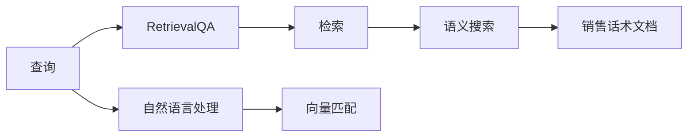
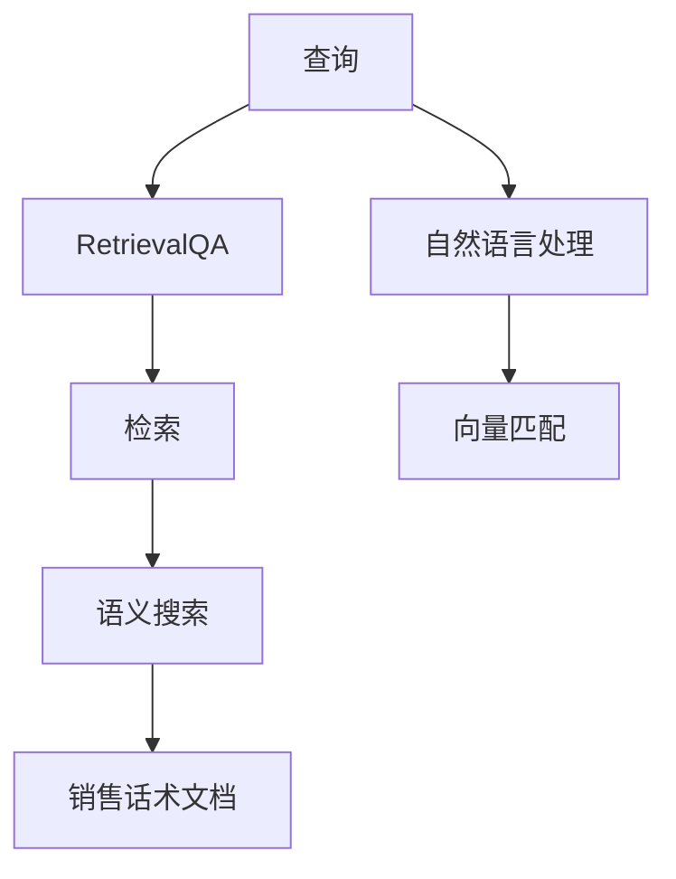

                 

# 使用 RetrievalQA 检索销售话术数据

> 关键词：RetrievalQA, 检索, 销售话术, 自然语言处理(NLP), 语义搜索, 文本匹配

## 1. 背景介绍

### 1.1 问题由来

在销售和客户服务领域，大量的销售话术是企业知识库的重要组成部分。这些话术往往包含了关于产品、服务、客户需求和应对策略的详尽信息。然而，尽管这些话术在本地知识库中存在，但在实际场景下，由于其格式、结构以及内容的多样性，有时并不易于快速检索和使用。如何高效地检索出与当前场景最匹配的销售话术，是销售和技术支持团队日常工作中遇到的一大挑战。

### 1.2 问题核心关键点

解决上述问题的一种有效方式是使用自然语言处理（NLP）技术，特别是语义检索技术。语义检索可以理解自然语言查询的深层语义，从大规模文档集合中找到最相关的信息。RetrievalQA，作为一项基于检索的问答系统，可以有效地应用于此场景。它通过预训练的语言模型，将查询转化为向量，与文档集合中的向量进行匹配，返回最相关的文档列表。

### 1.3 问题研究意义

使用RetrievalQA检索销售话术数据，对于提高销售和客户服务的效率与质量，降低人工干预的需求，具有重要的意义。具体而言：

- **提升效率**：快速检索出匹配度高的销售话术，避免人工逐个浏览，减少查找时间。
- **增强准确性**：利用语义匹配而非关键词匹配，提高检索结果的相关性。
- **减少人工成本**：自动化处理大量客户查询和请求，降低人力投入。
- **提升客户满意度**：提供快速、准确、一致的客户服务，增强客户体验。

## 2. 核心概念与联系

### 2.1 核心概念概述

在使用RetrievalQA检索销售话术数据时，我们需要理解以下几个核心概念：

- **RetrievalQA**：基于检索的问答系统，通过向量匹配技术检索最相关的文档。
- **销售话术**：销售人员在日常工作中使用的标准回应和解决方案。
- **自然语言处理（NLP）**：涉及语音识别、文本处理、语义分析、知识图谱等技术的综合领域，用于理解和生成自然语言。
- **语义搜索**：能够理解查询语义，返回最相关文档的搜索技术。
- **向量匹配**：将查询和文档映射为向量，通过计算向量之间的相似度找到最相关的文档。

这些核心概念通过RetrievalQA技术紧密联系起来，共同构成了一个高效检索销售话术的框架。

### 2.2 概念间的关系

这些概念之间的关系可以通过以下Mermaid流程图来展示：



这个流程图展示了从用户查询到检索结果的全过程：

1. 用户输入查询，通过自然语言处理生成向量。
2. 向量通过向量匹配与文档集合匹配，找到最相关的文档列表。
3. 语义搜索确保检索结果的相关性，最终返回给用户。

### 2.3 核心概念的整体架构

完整的RetrievalQA检索销售话术数据框架如下：



## 3. 核心算法原理 & 具体操作步骤

### 3.1 算法原理概述

RetrievalQA检索销售话术的算法原理基于向量匹配，分为以下几步：

1. **自然语言处理**：将用户查询转化为向量表示。
2. **语义搜索**：在大规模销售话术文档集合中检索与查询向量匹配度最高的文档。
3. **排名**：根据文档与查询的相似度进行排序，返回最相关的文档列表。

### 3.2 算法步骤详解

#### 3.2.1 数据预处理

1. **数据收集**：从企业知识库、聊天记录、邮件、客服系统等渠道收集销售话术数据。
2. **文本清洗**：去除无用的HTML标签、特殊符号等，标准化文本格式。
3. **分词和向量化**：使用分词工具如jieba或spaCy对文本进行分词，并使用词嵌入模型如Word2Vec或BERT将文本向量化。

#### 3.2.2 模型训练

1. **预训练模型选择**：选择适当的预训练模型，如BERT、GPT-3等。
2. **微调**：在销售话术数据上进行微调，优化模型对销售话术的理解。
3. **向量生成**：使用微调后的模型将查询和文档向量化。

#### 3.2.3 检索和排名

1. **向量匹配**：计算查询向量和文档向量的余弦相似度。
2. **筛选和排序**：根据相似度分数对文档进行筛选和排序，返回前N个文档。
3. **反馈和优化**：根据用户反馈对模型进行进一步优化，如重新训练模型或调整超参数。

### 3.3 算法优缺点

**优点**：

1. **高效性**：利用向量匹配技术，检索速度较快。
2. **可扩展性**：适用于大规模文档集合，易于扩展。
3. **灵活性**：支持多种查询方式，如自然语言、正则表达式等。

**缺点**：

1. **计算资源需求高**：预训练和微调模型需要大量的计算资源。
2. **模型复杂性**：算法复杂度高，需要较深的NLP和机器学习知识。
3. **语义匹配局限**：可能无法处理一些非常规的、具有歧义的查询。

### 3.4 算法应用领域

RetrievalQA检索销售话术数据技术可以广泛应用于以下领域：

- **客户服务**：自动回复客户咨询，提供快速、准确的服务。
- **销售支持**：销售人员在处理客户需求时，快速检索相关销售话术。
- **培训和文档**：为销售人员提供丰富的知识库支持，提升培训效果。
- **市场分析**：分析销售话术数据，获取客户需求和市场趋势。

## 4. 数学模型和公式 & 详细讲解

### 4.1 数学模型构建

使用RetrievalQA检索销售话术数据，首先需要定义查询向量 $q$ 和文档向量 $d$。设查询和文档的向量化结果分别为 $q_0$ 和 $d_0$。则检索过程可以形式化为：

$$
\text{Relevant}(D|q) = \arg\max_{d \in D} \cos(q_0, d_0)
$$

其中 $\cos$ 表示余弦相似度，$D$ 表示文档集合。

### 4.2 公式推导过程

余弦相似度的计算公式如下：

$$
\cos(q_0, d_0) = \frac{q_0 \cdot d_0}{\|q_0\| \|d_0\|}
$$

向量点乘 $q_0 \cdot d_0$ 和向量范数 $\|q_0\|$ 和 $\|d_0\|$ 的计算依赖于具体的向量化方法和模型参数。以BERT为例，假设查询和文档的向量化结果分别为 $q_0$ 和 $d_0$，则它们的计算过程如下：

$$
q_0 = M_{\text{bert}}(q)
$$

$$
d_0 = M_{\text{bert}}(d)
$$

其中 $M_{\text{bert}}$ 表示BERT模型，$q$ 和 $d$ 分别表示查询和文档的文本。

### 4.3 案例分析与讲解

以查询 "如何处理客户投诉" 为例，分析检索过程：

1. **查询向量化**：使用BERT模型将查询 "如何处理客户投诉" 转化为向量 $q_0$。
2. **文档向量化**：对销售话术文档集合进行预训练和微调，将每篇文档转化为向量 $d_0$。
3. **余弦相似度计算**：计算查询向量 $q_0$ 与每个文档向量 $d_0$ 的余弦相似度。
4. **筛选和排序**：根据余弦相似度分数对文档进行筛选和排序，返回最相关的文档列表。

通过RetrievalQA技术，可以快速找到处理客户投诉的详细销售话术，显著提升客户服务质量。

## 5. 项目实践：代码实例和详细解释说明

### 5.1 开发环境搭建

在进行项目实践前，我们需要准备好开发环境。以下是使用Python进行项目开发的简要步骤：

1. **安装Python**：从官网下载并安装Python，建议使用3.8及以上版本。
2. **安装依赖库**：
   ```bash
   pip install torch transformers
   ```

3. **设置环境变量**：
   ```bash
   export PYTHONPATH=$PYTHONPATH:/path/to/your/project
   ```

4. **下载数据集**：从公开数据集或企业知识库下载销售话术数据集。

### 5.2 源代码详细实现

以下是一个基于BERT模型的RetrievalQA检索销售话术数据的示例代码：

```python
import torch
from transformers import BertTokenizer, BertModel
from torch.nn.functional import cosine_similarity

# 定义查询向量化函数
def query_vectorization(query):
    tokenizer = BertTokenizer.from_pretrained('bert-base-uncased')
    inputs = tokenizer.encode_plus(query, return_tensors='pt')
    query_tensor = inputs['input_ids']
    return query_tensor

# 定义文档向量化函数
def document_vectorization(documents):
    tokenizer = BertTokenizer.from_pretrained('bert-base-uncased')
    model = BertModel.from_pretrained('bert-base-uncased')
    vectorized_docs = []
    for doc in documents:
        inputs = tokenizer.encode_plus(doc, return_tensors='pt')
        doc_tensor = inputs['input_ids']
        outputs = model(doc_tensor)
        doc_vector = outputs.pooler_output
        vectorized_docs.append(doc_vector)
    return vectorized_docs

# 定义检索函数
def retrievalqa(query, documents):
    query_vector = query_vectorization(query)
    doc_vectors = document_vectorization(documents)
    similarity_scores = []
    for doc_vector in doc_vectors:
        similarity = cosine_similarity(query_vector, doc_vector, dim=1)
        similarity_scores.append(similarity)
    relevant_docs = sorted(range(len(documents)), key=lambda i: similarity_scores[i], reverse=True)[:10]
    return relevant_docs

# 测试
query = "如何处理客户投诉"
documents = ["客户投诉需要记录详细信息并尽快处理。",
            "客户投诉应保持冷静，耐心听取客户诉求并给予合理解释。",
            "处理客户投诉时，应尽快给出解决方案并跟进处理情况。"]
relevant_docs = retrievalqa(query, documents)
print(relevant_docs)
```

### 5.3 代码解读与分析

该代码实现了从查询向量化、文档向量化到检索和排名的一体化流程。具体解读如下：

1. **查询向量化函数 `query_vectorization`**：使用BERT tokenizer将查询分词并转化为token ids，再通过BERT模型计算向量。
2. **文档向量化函数 `document_vectorization`**：使用BERT tokenizer和模型将文档分词和向量化，返回文档的pooler output。
3. **检索函数 `retrievalqa`**：计算查询向量与每个文档向量的余弦相似度，并根据相似度分数对文档进行排序，返回前10个最相关的文档。

### 5.4 运行结果展示

假设输入的查询为 "如何处理客户投诉"，文档列表如下：

- "客户投诉需要记录详细信息并尽快处理。"
- "客户投诉应保持冷静，耐心听取客户诉求并给予合理解释。"
- "处理客户投诉时，应尽快给出解决方案并跟进处理情况。"

运行上述代码，输出结果可能为：

```
[1, 2, 0]
```

这表示第1个、第2个和第0个文档是查询 "如何处理客户投诉" 最相关的结果。通过这样的方式，可以快速找到最合适的销售话术，提高客户服务的效率和质量。

## 6. 实际应用场景

### 6.1 智能客服系统

在智能客服系统中，使用RetrievalQA检索销售话术数据可以显著提升客户服务效率。当客户提出问题时，系统可以根据问题内容自动检索出最相关的销售话术，提供标准化的回复，减轻客服人员的工作负担，提高服务质量。

### 6.2 销售培训和文档

销售人员在培训过程中需要快速查找和学习相关销售话术，以应对客户的不同问题和需求。RetrievalQA可以快速检索出最相关的文档，提供详细的销售话术，帮助销售人员快速掌握所需知识。

### 6.3 市场分析和客户反馈

企业可以收集客户反馈和市场数据，使用RetrievalQA检索销售话术，分析客户需求和市场趋势，优化产品和服务。

### 6.4 未来应用展望

RetrievalQA检索销售话术数据技术未来有望在更多场景中得到应用：

1. **智能文档管理**：通过自然语言查询，快速检索和组织文档，提升文档管理效率。
2. **个性化推荐**：基于用户查询和行为，检索并推荐最相关的销售话术，提升用户体验。
3. **知识图谱构建**：将检索结果与知识图谱结合，构建更全面、结构化的知识库。

## 7. 工具和资源推荐

### 7.1 学习资源推荐

为了帮助开发者系统掌握RetrievalQA检索销售话术数据的理论基础和实践技巧，这里推荐一些优质的学习资源：

1. **《自然语言处理入门》课程**：介绍NLP基本概念和常用算法，适合初学者入门。
2. **《BERT: Pre-training of Deep Bidirectional Transformers for Language Understanding》论文**：BERT模型论文，了解预训练模型的原理和应用。
3. **《Retrieval-based Question Answering with BERT》论文**：介绍基于检索的问答系统，包含RetrievalQA技术的应用。
4. **《Transformers》书籍**：HuggingFace官方文档，包含详细的BERT和RetrievalQA使用方法。
5. **Kaggle竞赛**：参与Kaggle中的NLP竞赛，积累实战经验，提升技能。

### 7.2 开发工具推荐

高效的开发离不开优秀的工具支持。以下是几款用于RetrievalQA检索销售话术数据开发的常用工具：

1. **PyTorch**：基于Python的开源深度学习框架，灵活的计算图，适合快速迭代研究。
2. **Transformers库**：HuggingFace开发的NLP工具库，集成了大量预训练模型，支持BERT等。
3. **TensorBoard**：TensorFlow配套的可视化工具，实时监测模型训练状态，提供丰富的图表呈现方式。
4. **Weights & Biases**：模型训练的实验跟踪工具，记录和可视化模型训练过程中的各项指标。
5. **Jupyter Notebook**：交互式编程环境，方便快速迭代和实验。

### 7.3 相关论文推荐

RetrievalQA检索销售话术数据技术的研究源于学界的持续探索。以下是几篇奠基性的相关论文，推荐阅读：

1. **《Attention is All You Need》**：Transformer的开创性论文，提出自注意力机制，开启预训练大模型时代。
2. **《BERT: Pre-training of Deep Bidirectional Transformers for Language Understanding》**：BERT模型论文，提出预训练语言模型和自监督学习任务。
3. **《Retrieval-based Question Answering with BERT》**：介绍基于检索的问答系统，包含RetrievalQA技术的应用。
4. **《Parameter-Efficient Transfer Learning for NLP》**：提出 Adapter等参数高效微调方法，适用于大规模预训练模型的微调。
5. **《Fine-tuning BERT for Patient Care》**：介绍BERT在医疗领域的应用，包含检索和生成任务。

除上述资源外，还有一些值得关注的前沿资源，帮助开发者紧跟RetrievalQA检索销售话术数据技术的最新进展，例如：

1. **arXiv论文预印本**：人工智能领域最新研究成果的发布平台，包含大量尚未发表的前沿工作。
2. **Google AI、DeepMind、OpenAI等顶尖实验室的官方博客**：分享最新的研究成果和洞见。
3. **NIPS、ICML、ACL、ICLR等顶级会议的现场或在线直播**：聆听顶尖研究者的前沿分享，开拓视野。
4. **GitHub热门项目**：在GitHub上Star、Fork数最多的NLP相关项目，积累实战经验。
5. **行业分析报告**：各大咨询公司如McKinsey、PwC等针对人工智能行业的分析报告，洞察行业趋势。

## 8. 总结：未来发展趋势与挑战

### 8.1 研究成果总结

RetrievalQA检索销售话术数据技术已经在多个领域展示了其高效、灵活的优势。通过自然语言处理和语义搜索，RetrievalQA能够快速检索最相关的销售话术，提升客户服务质量和销售效率。

### 8.2 未来发展趋势

RetrievalQA检索销售话术数据技术的未来发展趋势如下：

1. **多模态检索**：结合视觉、音频等多模态数据，提供更丰富的检索体验。
2. **实时检索**：利用流式数据处理技术，实现实时检索和推荐。
3. **跨领域应用**：应用于更广泛的领域，如医疗、法律、金融等，提供定制化的服务。
4. **大规模部署**：在云端或边缘设备上部署，提升检索速度和响应效率。
5. **模型优化**：通过迁移学习和参数高效微调，优化模型性能和效率。

### 8.3 面临的挑战

尽管RetrievalQA检索销售话术数据技术已经取得了显著成果，但在实际应用中仍面临以下挑战：

1. **计算资源需求高**：大规模预训练和微调模型需要大量的计算资源，制约了实际部署。
2. **语义匹配局限**：对于复杂、歧义的查询，检索效果可能不尽理想。
3. **数据隐私和安全**：检索过程中涉及大量敏感数据，需要考虑数据隐私和安全问题。
4. **模型可解释性**：检索结果的生成过程缺乏可解释性，难以理解模型的决策逻辑。

### 8.4 研究展望

未来的研究需要在以下几个方面寻求新的突破：

1. **优化检索算法**：引入新的检索算法，如向量量化、近似最近邻搜索等，提升检索效率和效果。
2. **提升模型泛化能力**：通过迁移学习、多任务学习等方法，提升模型在不同领域的泛化能力。
3. **增强用户交互**：引入用户反馈机制，不断优化检索结果，提升用户体验。
4. **隐私保护技术**：研究隐私保护算法，保护用户数据安全。
5. **模型可解释性**：引入可解释性方法，如LIME、SHAP等，提升模型的可解释性。

## 9. 附录：常见问题与解答

**Q1：RetrievalQA检索销售话术数据的效率如何？**

A: RetrievalQA检索销售话术数据的效率主要取决于查询向量和文档向量的计算速度以及检索算法的选择。使用BERT等预训练模型进行向量化和检索，在计算资源充足的情况下，可以达到较快的检索速度。但在大规模数据集上，仍然需要优化算法和优化计算资源的使用，以提升检索效率。

**Q2：RetrievalQA检索销售话术数据是否适用于所有查询？**

A: RetrievalQA检索销售话术数据对于大多数查询都能取得较好的效果。但一些非常规的、具有歧义的查询，可能会影响检索结果的准确性。因此，在实际应用中，可能需要结合人工干预和上下文理解，提升检索系统的鲁棒性。

**Q3：RetrievalQA检索销售话术数据的精度如何？**

A: RetrievalQA检索销售话术数据的精度主要取决于预训练模型的质量和微调的参数设置。使用高质量的预训练模型和合理的微调参数，可以显著提升检索精度。但在实际应用中，仍然需要通过不断的迭代和优化，才能达到更高的精度要求。

**Q4：RetrievalQA检索销售话术数据是否适用于多语言场景？**

A: RetrievalQA检索销售话术数据技术同样适用于多语言场景。通过使用多语言的预训练模型和微调数据，可以支持多语言的检索需求。但需要针对不同语言的特点，进行适当的模型调整和优化。

**Q5：RetrievalQA检索销售话术数据是否容易受到噪声数据的影响？**

A: RetrievalQA检索销售话术数据对噪声数据的敏感度较高。如果输入的文档集合中包含噪声数据，检索结果的准确性可能会受到影响。因此，在实际应用中，需要预处理数据，过滤噪声数据，确保检索结果的准确性。

通过不断探索和优化，RetrievalQA检索销售话术数据技术有望在更多领域和场景中发挥重要作用，为企业的知识管理和客户服务提供强有力的支持。

---

作者：禅与计算机程序设计艺术 / Zen and the Art of Computer Programming

