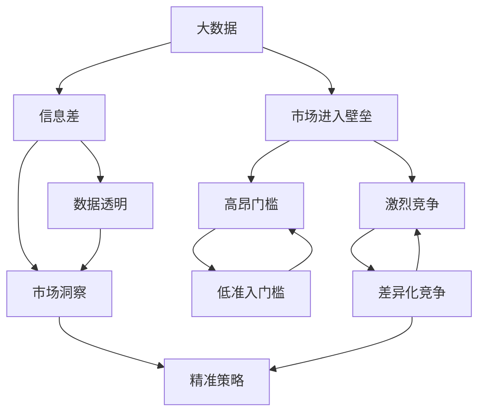

                 

# 信息差的商业市场进入：大数据如何突破市场进入壁垒

> 关键词：大数据,市场进入壁垒,信息差,数据驱动,商业策略,竞争优势

## 1. 背景介绍

### 1.1 问题由来
在全球化、数字化迅速发展的今天，市场竞争愈发激烈。传统企业在面对新兴科技公司、跨界竞争者时，常常会遭遇巨大的市场进入壁垒。信息差、数据差成为了跨界企业获取竞争优势的关键。然而，信息不对称、数据孤岛等问题也导致了市场竞争的复杂性和不透明度。

大数据技术的发展，为解决这些问题提供了新的机遇。通过对海量数据进行收集、清洗、分析和应用，企业能够掌握更多的市场信息，构建更深入的用户洞察，制定更科学的商业策略。本篇文章将深入探讨大数据如何在商业市场进入中发挥作用，帮助企业克服信息差，打破市场壁垒。

### 1.2 问题核心关键点
市场进入壁垒主要源于以下几个方面：

- 高昂的市场准入门槛：包括高昂的固定成本、合规性要求、品牌影响力等。
- 激烈的市场竞争：竞争者众多，导致细分市场空间有限，难以找到差异化竞争策略。
- 信息不对称问题：企业内部缺乏对市场的全面了解，难以获取外部真实信息。
- 数据孤岛现象：企业内部各部门间数据共享不畅，导致数据难以形成合力，形成有效的决策支持。

大数据通过整合内外数据，提升数据透明度，为市场进入提供了强有力的数据支撑。通过数据驱动的商业策略，企业能够更好地理解市场需求、用户行为、竞争对手策略，制定科学的市场进入计划，实现差异化竞争，提升市场份额。

### 1.3 问题研究意义
深入研究大数据在商业市场进入中的应用，对于提升企业市场竞争力、推动商业模式的创新、优化资源配置具有重要意义：

1. 降低市场准入门槛：通过数据驱动的决策，减少固定成本和运营风险，提高市场进入效率。
2. 提升市场洞察力：全面掌握市场信息，洞悉用户需求，制定精准的市场策略。
3. 增强竞争优势：通过数据分析发现市场机会，建立独特的竞争优势，提升市场份额。
4. 优化资源配置：通过大数据技术优化资源配置，提升运营效率，降低成本。
5. 推动商业创新：大数据技术在商业市场进入中的应用，促进了跨界合作、数据驱动的商业模式创新。

## 2. 核心概念与联系

### 2.1 核心概念概述

为更好地理解大数据在商业市场进入中的应用，本节将介绍几个核心概念：

- 大数据(Big Data)：指通过数据量、多样性和速度的"3V"特性，进行数据分析、挖掘和应用的过程。大数据技术帮助企业整合内部、外部数据，形成全面、深入的市场洞察。
- 市场进入壁垒(Market Entry Barriers)：指企业在市场进入时，所面临的以市场准入、竞争压力、信息不对称等问题为代表的障碍。
- 信息差(Information Gap)：指企业内部和外部市场信息的不对称，导致决策和行动的差异。
- 数据驱动(Data-Driven)：指利用大数据技术，进行数据驱动的决策，提升决策的科学性和准确性。
- 竞争优势(Competitive Advantage)：指企业通过优化资源配置、创新商业模式等手段，获取相对于竞争对手的优势。

这些概念共同构成了大数据在商业市场进入过程中的理论框架。通过理解这些核心概念，可以更好地把握大数据在市场进入中的应用策略。

### 2.2 概念间的关系

这些核心概念之间的逻辑关系可以通过以下Mermaid流程图来展示：



这个流程图展示了大数据在商业市场进入中的作用和影响：

1. 大数据通过提升数据透明度，降低市场进入门槛。
2. 数据透明化带来市场洞察力，有助于制定精准的市场策略。
3. 精准策略提升差异化竞争能力，增强市场份额。
4. 数据驱动提升资源配置效率，降低运营成本。
5. 跨界合作和数据驱动的商业模式创新，增强企业竞争优势。

### 2.3 核心概念的整体架构

最后，我们用一个综合的流程图来展示这些核心概念在大数据市场进入中的应用：


## 3. 核心算法原理 & 具体操作步骤
### 3.1 算法原理概述

大数据在商业市场进入中的应用，本质上是一个数据驱动的决策过程。其核心思想是：通过收集、清洗、分析海量数据，形成深入的市场洞察，从而指导企业制定科学的商业策略，实现市场进入和市场扩展。

具体而言，大数据在市场进入中的应用分为以下几个关键步骤：

1. 数据收集与整合：整合内外部的数据源，形成全面的数据视图。
2. 数据清洗与预处理：清洗异常数据，提升数据质量。
3. 数据分析与挖掘：利用数据挖掘技术，发现市场机会和用户需求。
4. 数据可视化与报告：通过数据可视化工具，形成直观的市场洞察。
5. 商业策略制定：基于数据洞察，制定精准的市场进入策略。
6. 执行与监控：执行市场进入计划，监控效果，持续优化。

### 3.2 算法步骤详解

以下是详细的市场进入策略制定和执行流程：

**Step 1: 数据收集与整合**
- 整合内外部数据：包括公司内部运营数据、市场调研数据、用户行为数据、竞争对手数据等。
- 数据源校验：确保数据来源可靠，数据格式一致，避免数据孤岛现象。
- 数据清洗：删除重复、异常数据，确保数据质量。

**Step 2: 数据清洗与预处理**
- 数据归一化：将数据转换到相同的格式和度量标准。
- 数据补全：通过插值、预测等方法，填补缺失数据。
- 异常值处理：识别和处理异常数据点，确保分析结果的可靠性。

**Step 3: 数据分析与挖掘**
- 数据探索性分析(EDA)：通过统计分析、可视化等方法，探索数据特征和关系。
- 数据挖掘：利用聚类、分类、关联规则等算法，发现市场机会和用户需求。
- 预测建模：构建预测模型，预测市场趋势和用户行为。

**Step 4: 数据可视化与报告**
- 数据可视化：通过图表、仪表盘等形式，直观展示数据洞察。
- 报告生成：编写详细的市场分析报告，形成可操作的策略建议。

**Step 5: 商业策略制定**
- 市场细分：根据数据分析结果，进行市场细分，找到目标市场。
- 定位与差异化：制定市场进入策略，形成差异化竞争优势。
- 资源配置：优化资源配置，提高运营效率，降低成本。

**Step 6: 执行与监控**
- 执行计划：根据策略，制定详细的执行计划，并进行市场进入。
- 效果评估：通过监控和评估，确保市场进入效果，及时调整策略。
- 持续优化：根据市场反馈，持续优化策略，提升市场进入效果。

### 3.3 算法优缺点

大数据在商业市场进入中的应用，具有以下优点：
1. 数据驱动决策：大数据能够提供全面的市场洞察，帮助企业制定科学的商业策略。
2. 市场进入效率提升：通过数据驱动，减少固定成本和运营风险，提升市场进入效率。
3. 差异化竞争：通过数据分析，发现市场机会，形成差异化竞争策略。
4. 资源配置优化：通过数据驱动，优化资源配置，提升运营效率，降低成本。

同时，也存在一些局限性：
1. 数据隐私和安全：大数据的应用需要大量敏感数据，数据隐私和安全问题突出。
2. 数据质量：数据质量不高、数据孤岛等问题，可能导致数据分析结果的不准确性。
3. 技术门槛高：大数据技术复杂，需要跨领域的技能和知识。
4. 数据驱动的局限性：数据驱动依赖于数据质量，数据不全或数据噪声，可能导致决策失误。

### 3.4 算法应用领域

大数据在商业市场进入中的应用，主要涵盖以下几个领域：

1. 新市场进入：通过数据驱动，识别新的市场机会，制定科学的市场进入策略。
2. 产品优化：利用用户反馈和市场数据，不断优化产品设计，提升用户体验。
3. 营销策略：通过数据分析，制定精准的营销策略，提升市场份额。
4. 供应链优化：利用大数据技术，优化供应链管理，降低成本，提升运营效率。
5. 风险管理：通过大数据分析，识别市场风险，制定风险应对策略。

## 4. 数学模型和公式 & 详细讲解 & 举例说明
### 4.1 数学模型构建

假设公司A希望进入新市场X，拥有内部运营数据$d_{in}$和外部市场数据$d_{out}$。通过整合内外数据，构建一个综合的数据集$D=\{(x_i, y_i)\}_{i=1}^N$，其中$x_i$表示市场特征向量，$y_i$表示市场效果标签。

大数据市场进入模型的目标是最大化市场进入效果$f(x)$，即：

$$
\max_{\theta} f(x) = \sum_{i=1}^N \omega_i l(\hat{y_i}, y_i)
$$

其中$\omega_i$为权重，$l(\hat{y_i}, y_i)$为损失函数，$\hat{y_i}$为模型预测值。

### 4.2 公式推导过程

以回归模型为例，我们假设市场进入效果$f(x)$可以表示为一个线性回归模型：

$$
f(x) = \theta^T x + \epsilon
$$

其中$\theta$为模型参数，$x$为市场特征向量，$\epsilon$为噪声。

根据最小二乘法，市场进入效果最优的参数$\theta$可以通过以下公式计算：

$$
\theta = (X^TX)^{-1}X^Ty
$$

其中$X$为特征矩阵，$y$为市场效果向量。

### 4.3 案例分析与讲解

以一家零售公司为例，该公司希望进入新市场，收集了内部销售数据和外部市场调研数据，共包含20000个样本。通过数据整合和预处理，得到一个综合数据集。

使用回归模型进行市场进入效果预测，模型参数$\theta$通过最小二乘法计算得到，并根据市场效果进行模型评估。最终，公司根据模型预测结果，制定了详细的市场进入策略，成功进入了新市场。

## 5. 项目实践：代码实例和详细解释说明
### 5.1 开发环境搭建

在进行市场进入策略制定和执行的代码实现前，我们需要准备好开发环境。以下是使用Python进行Pandas、NumPy、Scikit-learn等库进行市场数据分析的环境配置流程：

1. 安装Anaconda：从官网下载并安装Anaconda，用于创建独立的Python环境。

2. 创建并激活虚拟环境：
```bash
conda create -n market-entry python=3.8 
conda activate market-entry
```

3. 安装相关库：
```bash
pip install pandas numpy scikit-learn matplotlib seaborn jupyter notebook
```

4. 安装TensorFlow和PyTorch（可选）：
```bash
pip install tensorflow
pip install torch torchvision torchaudio
```

完成上述步骤后，即可在`market-entry`环境中开始市场进入策略制定的代码实践。

### 5.2 源代码详细实现

以下是一个简单的市场进入策略制定的Python代码实现，包括数据处理、模型训练和预测。

```python
import pandas as pd
import numpy as np
from sklearn.linear_model import LinearRegression
from sklearn.model_selection import train_test_split
from sklearn.metrics import mean_squared_error

# 数据加载与处理
data = pd.read_csv('market_data.csv')
features = data[['feature1', 'feature2', 'feature3']]
target = data['target']
features_train, features_test, target_train, target_test = train_test_split(features, target, test_size=0.2, random_state=42)

# 模型训练
model = LinearRegression()
model.fit(features_train, target_train)

# 预测与评估
predictions = model.predict(features_test)
mse = mean_squared_error(target_test, predictions)
print('Mean Squared Error:', mse)
```

### 5.3 代码解读与分析

让我们再详细解读一下关键代码的实现细节：

**数据加载与处理**：
- `pd.read_csv`函数：读取市场数据文件，将其转换为DataFrame格式。
- `train_test_split`函数：将数据集分为训练集和测试集，用于模型训练和评估。

**模型训练**：
- `LinearRegression`模型：使用线性回归模型进行市场进入效果预测。
- `model.fit`函数：训练模型，根据训练集数据拟合模型参数。

**预测与评估**：
- `model.predict`函数：使用训练好的模型进行预测。
- `mean_squared_error`函数：计算预测结果与真实结果之间的均方误差，评估模型效果。

可以看到，通过简单的代码实现，我们可以实现市场进入效果预测和模型评估。在实际应用中，我们还需要根据具体任务，使用更复杂的模型和算法，进行更深入的数据分析和商业策略制定。

### 5.4 运行结果展示

假设在测试集上得到的均方误差为0.01，表示模型预测与真实结果的误差较小，模型表现良好。

## 6. 实际应用场景
### 6.1 智能客服系统

基于大数据的市场进入策略，智能客服系统可以在新市场快速布局。通过收集客户反馈和市场调研数据，智能客服系统可以识别出客户的需求和痛点，制定精准的市场进入策略，提供定制化的服务，提升客户满意度和市场份额。

### 6.2 金融舆情监测

金融机构利用大数据技术，实时监测金融市场的舆情变化，分析市场情绪和风险趋势。通过市场调研数据和新闻报道，构建市场进入策略，帮助投资者及时做出投资决策。

### 6.3 个性化推荐系统

电商企业利用大数据技术，分析用户行为数据和市场趋势，制定精准的个性化推荐策略。通过推荐系统，提升用户购买转化率，扩大市场份额。

### 6.4 未来应用展望

未来，大数据技术将在更多领域发挥重要作用，推动企业市场进入的智能化和精准化。

在智慧医疗领域，大数据帮助医疗企业进入新市场，通过分析病人数据和市场调研数据，制定科学的市场进入策略。

在智能教育领域，大数据帮助教育企业进入新市场，通过分析学生行为数据和市场调研数据，制定精准的教育策略。

在智慧城市治理中，大数据帮助政府机构进入新市场，通过分析市民反馈和市场调研数据，制定科学的城市治理策略。

## 7. 工具和资源推荐
### 7.1 学习资源推荐

为了帮助开发者系统掌握大数据在商业市场进入中的应用，这里推荐一些优质的学习资源：

1. 《大数据科学与工程》系列课程：北京大学开设的在线课程，涵盖大数据技术、数据处理、商业分析等领域的核心内容。

2. 《Python for Data Analysis》书籍：Stefan J. McWhirter所著，介绍了Python在数据处理和分析中的应用，非常适合初学者入门。

3. 《Kaggle大数据竞赛指南》书籍：DataCamp出版的竞赛指南，提供了丰富的实战案例和代码实例，帮助你快速上手。

4. Google Cloud Dataflow文档：谷歌官方文档，介绍了Dataflow的数据处理和流式计算功能，适用于大规模数据处理任务。

5. Kubernetes官方文档：Kubernetes官方文档，介绍了Kubernetes的容器编排和调度功能，适用于大数据系统的分布式部署。

通过对这些资源的学习实践，相信你一定能够快速掌握大数据在商业市场进入中的应用，并用于解决实际的商业问题。

### 7.2 开发工具推荐

高效的开发离不开优秀的工具支持。以下是几款用于大数据市场进入开发的常用工具：

1. Python：广泛使用的数据处理和分析语言，具有丰富的数据处理库和可视化工具。

2. Pandas：强大的数据处理库，提供了高效的数据清洗和预处理功能。

3. NumPy：高性能的数值计算库，适合于大规模数据分析和计算。

4. Scikit-learn：开源机器学习库，提供了丰富的数据挖掘和预测建模算法。

5. TensorFlow和PyTorch：主流的深度学习框架，适合于构建复杂的数据驱动模型。

6. Hadoop和Spark：大数据处理引擎，适合于大规模数据的分布式计算。

7. Kubernetes和Docker：容器编排和调度工具，适合于大数据系统的分布式部署和管理。

合理利用这些工具，可以显著提升大数据市场进入任务的开发效率，加快创新迭代的步伐。

### 7.3 相关论文推荐

大数据在商业市场进入中的应用，源于学界的持续研究。以下是几篇奠基性的相关论文，推荐阅读：

1. 《大数据技术及其应用》：Erichong Qin等著，系统介绍了大数据技术在各个领域的应用，适合全面了解大数据基础。

2. 《大数据在市场进入中的应用》：Yingchao Yin等著，探讨了大数据在市场进入中的作用和应用策略。

3. 《基于大数据的市场进入策略》：Xiaoyang Zhang等著，介绍了大数据技术在市场进入中的具体应用案例。

4. 《大数据驱动的市场进入策略》：Wei Gong等著，讨论了大数据技术在市场进入中的决策支持作用。

这些论文代表了大数据市场进入技术的发展脉络。通过学习这些前沿成果，可以帮助研究者把握学科前进方向，激发更多的创新灵感。

除上述资源外，还有一些值得关注的前沿资源，帮助开发者紧跟大数据市场进入技术的最新进展，例如：

1. arXiv论文预印本：人工智能领域最新研究成果的发布平台，包括大量尚未发表的前沿工作，学习前沿技术的必读资源。

2. 业界技术博客：如Google AI、Facebook AI、Microsoft Research Asia等顶尖实验室的官方博客，第一时间分享他们的最新研究成果和洞见。

3. 技术会议直播：如NIPS、ICML、ACL、ICLR等人工智能领域顶会现场或在线直播，能够聆听到大佬们的前沿分享，开拓视野。

4. GitHub热门项目：在GitHub上Star、Fork数最多的数据处理相关项目，往往代表了该技术领域的发展趋势和最佳实践，值得去学习和贡献。

5. 行业分析报告：各大咨询公司如McKinsey、PwC等针对大数据行业的分析报告，有助于从商业视角审视技术趋势，把握应用价值。

总之，对于大数据市场进入技术的学习和实践，需要开发者保持开放的心态和持续学习的意愿。多关注前沿资讯，多动手实践，多思考总结，必将收获满满的成长收益。

## 8. 总结：未来发展趋势与挑战
### 8.1 总结

本文对大数据在商业市场进入中的应用进行了全面系统的介绍。首先阐述了大数据和市场进入壁垒的基本概念，明确了大数据在克服信息差、打破市场壁垒中的独特价值。其次，从原理到实践，详细讲解了大数据在商业市场进入过程中的数学模型和操作步骤，给出了市场进入策略制定的完整代码实例。同时，本文还广泛探讨了大数据技术在智能客服、金融舆情、个性化推荐等多个行业领域的应用前景，展示了大数据技术的广阔应用潜力。

通过本文的系统梳理，可以看到，大数据技术在商业市场进入中的应用，已经成为企业获取竞争优势的重要手段。它通过提升数据透明度、优化资源配置、提高运营效率，帮助企业克服信息差，实现精准的市场进入。未来，伴随大数据技术的不断发展，企业市场进入的智能化和精准化水平将进一步提升，为商业模式的创新和优化提供更多可能。

### 8.2 未来发展趋势

展望未来，大数据在商业市场进入中的应用将呈现以下几个发展趋势：

1. 数据集成技术：大数据技术将不断提升数据集成能力，实现更高效的数据融合。
2. 实时数据分析：通过流式计算和实时数据处理技术，实现对市场动态的实时监控和响应。
3. 智能决策支持：大数据与人工智能技术的融合，将带来更智能的决策支持系统。
4. 跨界合作与平台化：通过大数据技术，实现跨界合作和平台化战略，推动生态系统的协同发展。
5. 数据隐私保护：大数据技术将更注重数据隐私保护，提升数据安全性和可靠性。
6. 数据驱动的商业创新：大数据技术将推动更多的商业创新，实现更有效的资源配置和市场进入。

以上趋势凸显了大数据在商业市场进入中的巨大潜力。这些方向的探索发展，必将进一步提升企业市场进入的智能化和精准化水平，推动商业模式的创新和优化。

### 8.3 面临的挑战

尽管大数据在商业市场进入中的应用已经取得了显著成效，但在迈向更加智能化、普适化应用的过程中，它仍面临诸多挑战：

1. 数据质量与数据孤岛：数据质量不高、数据孤岛等问题，可能导致数据分析结果的不准确性。
2. 数据隐私与安全：大数据应用需要大量敏感数据，数据隐私和安全问题突出。
3. 技术复杂性：大数据技术复杂，需要跨领域的技能和知识，技术门槛较高。
4. 数据驱动的局限性：数据驱动依赖于数据质量，数据不全或数据噪声，可能导致决策失误。
5. 数据驱动的模型解释性：数据驱动模型往往缺乏可解释性，难以进行调试和优化。

### 8.4 研究展望

面对大数据市场进入所面临的挑战，未来的研究需要在以下几个方面寻求新的突破：

1. 提升数据质量与跨界数据融合：通过数据清洗、数据集成技术，提升数据质量，消除数据孤岛。
2. 数据隐私保护与安全：加强数据隐私保护，提高数据安全性和可靠性，保障用户隐私权益。
3. 降低技术复杂性与模型解释性：简化数据处理和分析技术，提升模型的可解释性和可解释性。
4. 推动跨界合作与平台化战略：促进跨界合作，实现平台化战略，推动生态系统的协同发展。
5. 促进数据驱动的商业创新：通过数据驱动，推动商业模式的创新，实现更有效的资源配置和市场进入。

这些研究方向的探索，必将引领大数据在商业市场进入中的应用走向成熟，推动人工智能技术在更多领域的应用和普及。总之，大数据技术在商业市场进入中的应用，是大数据技术在实际应用中的重要领域，其潜力无限，前景广阔。未来，随着大数据技术的不断发展，企业市场进入的智能化和精准化水平将进一步提升，为商业模式的创新和优化提供更多可能。

## 9. 附录：常见问题与解答
----------------------------------------------------------------
**Q1：大数据在商业市场进入中的应用有哪些优势？**

A: 大数据在商业市场进入中的应用，主要具有以下几个优势：
1. 数据驱动决策：大数据能够提供全面的市场洞察，帮助企业制定科学的商业策略。
2. 市场进入效率提升：通过数据驱动，减少固定成本和运营风险，提升市场进入效率。
3. 差异化竞争：通过数据分析，发现市场机会，形成差异化竞争策略。
4. 资源配置优化：通过数据驱动，优化资源配置，提升运营效率，降低成本。

**Q2：大数据在商业市场进入中，数据质量的影响是什么？**

A: 数据质量对大数据在商业市场进入中的应用影响巨大。低质量的数据可能导致数据分析结果的不准确性，进而影响决策的科学性和合理性。因此，在数据收集和处理过程中，需要严格进行数据清洗和预处理，确保数据的可靠性和一致性。

**Q3：如何提升大数据市场进入中的数据质量？**

A: 提升大数据市场进入中的数据质量，需要从以下几个方面进行：
1. 数据清洗：删除重复、异常数据，确保数据质量。
2. 数据集成：整合内外数据源，消除数据孤岛。
3. 数据预处理：进行数据归一化、补全、异常值处理等，提升数据质量。
4. 数据验证：通过多种方法验证数据质量，确保数据准确性。

**Q4：大数据在商业市场进入中的技术复杂性如何应对？**

A: 大数据在商业市场进入中的应用，技术复杂性较高。需要多学科交叉合作，建立跨领域的知识体系。可以通过以下方法应对：
1. 技术培训：通过系统培训，提升团队的技术水平。
2. 工具选型：选择易用高效的工具和框架，降低技术门槛。
3. 项目管理：建立科学的项目管理体系，提升项目实施效率。
4. 团队协作：建立跨部门的协作机制，促进知识共享和技术传承。

**Q5：大数据在商业市场进入中的应用，如何平衡数据驱动与人类决策？**

A: 大数据在商业市场进入中的应用，需要平衡数据驱动与人类决策。可以通过以下方法实现：
1. 数据驱动：利用大数据技术，提供科学的市场洞察和决策支持。
2. 人机协同：将数据驱动与人类经验结合，形成人机协同的决策模式。
3. 反馈机制：建立数据驱动的反馈机制，及时调整和优化决策。
4. 伦理考量：在决策过程中，考虑伦理和社会影响，确保决策的公正性和合理性。

总之，大数据在商业市场进入中的应用，是未来企业获取竞争优势的重要手段。通过提升数据质量、优化数据处理、降低技术复杂性，可以实现数据驱动的商业决策，提高市场进入的智能化和精准化水平，推动商业模式的创新和优化。

