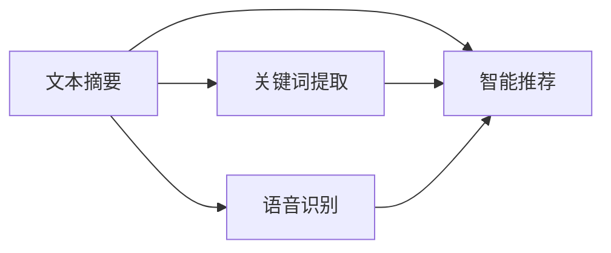
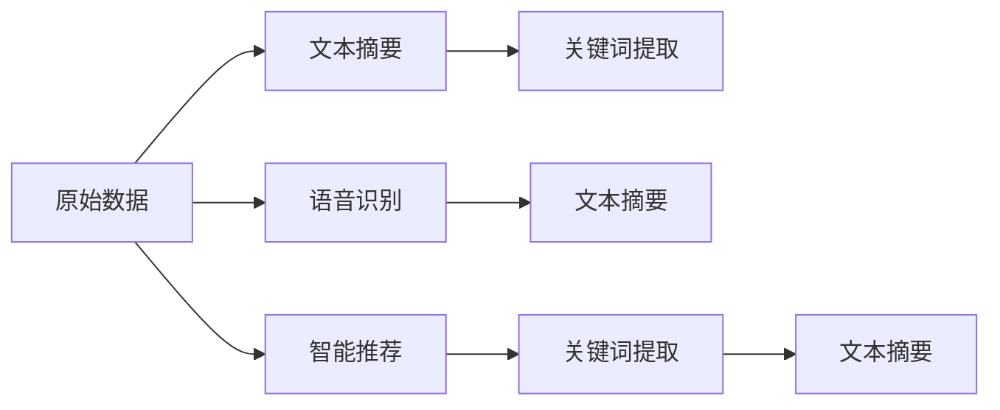

                 

# 信息简化的好处与艺术：在复杂世界中简化以提高生活质量和效率

> 关键词：信息简化, 技术高效, 数据分析, 人工智能, 算法优化

## 1. 背景介绍

在当今信息爆炸的时代，人们面临着前所未有的数据洪流。从电子邮件、社交媒体到企业内部的管理系统，从网站的用户数据到在线购物平台的用户行为，各种来源的数据无处不在。这些数据在为我们的生活和工作带来便利的同时，也带来了不小的信息过载问题。信息过载不仅会导致用户难以从中获取真正有价值的信息，而且还会对人的心理和生理健康造成负面影响。

为了应对信息过载，人们常常采用各种方法来简化信息，以提高生活质量和效率。这些方法包括文本摘要、关键词提取、语音识别、智能推荐等。这些技术虽然在不同的应用场景中表现出色，但仍然存在一些局限性，例如文本摘要可能无法捕捉到文本中的所有重要信息，关键词提取可能无法全面理解文本的含义，语音识别可能会受到口音和噪音的影响，智能推荐可能无法理解用户的真实需求。

因此，如何在复杂世界中简化信息，同时保持信息的完整性和准确性，成为一个重要的问题。本文将深入探讨信息简化的艺术和好处，旨在帮助读者理解信息简化的关键技术，并探讨其在提高生活质量和效率方面的潜力。

## 2. 核心概念与联系

### 2.1 核心概念概述

信息简化（Information Simplification）是指从大量复杂数据中提取出关键信息，并对其进行压缩和重组，以提高信息可读性和可操作性。信息简化的目的是将复杂的信息转化为易于理解和处理的形式，从而减少用户认知负担，提高工作效率。

信息简化的核心概念包括以下几个方面：

- **文本摘要**：从长文本中提取主要信息，生成一个简洁的摘要。
- **关键词提取**：从文本中识别出最重要和最具代表性的词汇。
- **语音识别**：将语音转换为文本，并进行信息提取和处理。
- **智能推荐**：根据用户的历史行为和偏好，推荐最相关的信息。

这些概念之间存在紧密的联系。文本摘要和关键词提取都是对文本信息的简化处理，而语音识别和智能推荐则是对非文本信息的简化处理。信息简化的技术可以跨越多种信息类型，并可以结合不同的应用场景，以提高信息处理效率和用户满意度。

### 2.2 概念间的关系

通过以下Mermaid流程图，可以更直观地展示信息简化过程中各个概念之间的关系：



这个流程图展示了几类信息简化技术之间的联系：

- **文本摘要**和**关键词提取**是文本信息简化处理的关键技术。它们可以帮助用户快速了解文本的要点，提高文本的可读性。
- **语音识别**和**智能推荐**是非文本信息简化的关键技术。语音识别可以将用户的语音转换为文本，方便用户与系统交互；智能推荐可以根据用户的历史行为，提供个性化信息，提升用户体验。
- **关键词提取**和**智能推荐**可以结合使用，通过提取文本中的关键词，智能推荐更相关的信息，提升推荐效果。
- **文本摘要**和**语音识别**可以结合使用，通过对语音进行摘要和关键词提取，可以帮助用户更好地理解和处理语音信息。

通过这些技术，信息简化可以在不同的应用场景中发挥作用，帮助用户快速获取有价值的信息，提高生活质量和效率。

### 2.3 核心概念的整体架构

最后，我们用一个综合的流程图来展示信息简化技术的整体架构：



这个综合流程图展示了信息简化的整体流程：

- 原始数据通过**文本摘要**和**语音识别**进行初步处理，提取关键信息。
- **关键词提取**可以应用于文本和语音信息，进一步简化信息。
- **智能推荐**根据简化的信息，推荐更相关的信息，提升用户体验。
- 最后，这些简化的信息可以通过**文本摘要**进行压缩，最终输出易于理解和处理的形式。

通过这个架构，我们可以看到，信息简化技术可以在不同的应用场景中发挥作用，帮助用户快速获取有价值的信息，提高生活质量和效率。

## 3. 核心算法原理 & 具体操作步骤
### 3.1 算法原理概述

信息简化的核心算法原理基于自然语言处理（NLP）和机器学习（ML）技术。其目的是从大量复杂数据中提取出关键信息，并将其压缩和重组，以提高信息可读性和可操作性。

信息简化的主要算法包括文本摘要算法、关键词提取算法、语音识别算法和智能推荐算法。这些算法的基本原理如下：

- **文本摘要算法**：使用统计方法或机器学习方法，从长文本中提取出主要信息，生成一个简洁的摘要。
- **关键词提取算法**：使用统计方法或机器学习方法，从文本中识别出最重要和最具代表性的词汇。
- **语音识别算法**：将语音转换为文本，并进行信息提取和处理。
- **智能推荐算法**：使用机器学习方法，根据用户的历史行为和偏好，推荐最相关的信息。

这些算法的基本原理可以概括为以下步骤：

1. **数据预处理**：清洗和标准化原始数据，包括去除噪音、处理缺失值等。
2. **特征提取**：使用统计方法或机器学习方法，从原始数据中提取关键特征。
3. **信息压缩**：使用文本摘要或关键词提取等方法，对提取的特征进行压缩和重组，生成简化的信息。
4. **信息推荐**：使用智能推荐算法，根据简化的信息，推荐最相关的信息。

### 3.2 算法步骤详解

以下详细介绍信息简化的各个算法步骤：

#### 3.2.1 数据预处理

数据预处理是信息简化的第一步，其主要目的是清洗和标准化原始数据，以便后续的处理和分析。数据预处理包括以下几个步骤：

1. **去除噪音**：通过文本清洗、数据去重等方法，去除数据中的噪音和重复信息。
2. **处理缺失值**：对于缺失值，可以使用插值、删除等方法进行处理，以保证数据的完整性。
3. **标准化**：对数据进行标准化处理，包括单位统一、归一化等，以便后续处理和分析。

#### 3.2.2 特征提取

特征提取是信息简化的核心步骤之一。其主要目的是从原始数据中提取出关键特征，以便后续的信息压缩和处理。特征提取的方法包括：

1. **统计方法**：使用文本的TF-IDF、词频等统计方法，提取出文本中的关键词和短语。
2. **机器学习方法**：使用分类器、聚类器等机器学习方法，提取出文本中的主题和情感。
3. **深度学习方法**：使用Transformer等深度学习模型，提取出文本中的语义特征。

#### 3.2.3 信息压缩

信息压缩是信息简化的核心步骤之一。其主要目的是将提取的关键信息压缩和重组，生成简洁易懂的信息。信息压缩的方法包括：

1. **文本摘要**：使用统计方法或机器学习方法，从长文本中提取出主要信息，生成一个简洁的摘要。
2. **关键词提取**：使用统计方法或机器学习方法，从文本中识别出最重要和最具代表性的词汇。
3. **语音识别**：将语音转换为文本，并进行信息提取和处理。
4. **智能推荐**：使用机器学习方法，根据用户的历史行为和偏好，推荐最相关的信息。

#### 3.2.4 信息推荐

信息推荐是信息简化的最后一步。其主要目的是根据简化的信息，推荐最相关的信息，以提升用户体验。信息推荐的方法包括：

1. **协同过滤**：根据用户的历史行为和偏好，推荐相似的用户喜欢的信息。
2. **基于内容的推荐**：根据物品的特征和用户的偏好，推荐最相关的信息。
3. **混合推荐**：结合协同过滤和基于内容的推荐方法，推荐更相关的信息。

### 3.3 算法优缺点

信息简化的核心算法具有以下优点：

- **提高效率**：通过简化信息，可以大大减少用户获取信息的认知负担，提高处理效率。
- **提高可读性**：简化的信息更易于理解和处理，可以提高用户满意度。
- **提高决策质量**：简化的信息提供了更准确和相关的信息，可以提升决策质量。

然而，信息简化的核心算法也存在一些缺点：

- **信息丢失**：在简化信息的过程中，可能会丢失一些重要的细节，影响信息的完整性。
- **过度简化**：过度简化信息可能会影响信息的准确性和相关性。
- **算法复杂度**：某些信息简化算法，如深度学习方法，需要大量的计算资源和训练数据。

### 3.4 算法应用领域

信息简化的核心算法在多个领域得到了广泛应用，包括：

- **文本处理**：在新闻、社交媒体、电子商务等领域，通过文本摘要和关键词提取等技术，简化文本信息，提高阅读效率。
- **语音处理**：在智能助理、语音识别等领域，通过语音识别和智能推荐等技术，简化语音信息，提高用户体验。
- **推荐系统**：在电商、视频、音乐等领域，通过智能推荐等技术，根据用户的历史行为和偏好，推荐最相关的信息。
- **信息检索**：在图书馆、搜索引擎等领域，通过关键词提取等技术，简化信息检索过程，提高检索效率。

## 4. 数学模型和公式 & 详细讲解 & 举例说明

### 4.1 数学模型构建

信息简化的核心算法可以构建在多个数学模型上，包括统计模型、机器学习模型和深度学习模型。以下是几个常见的数学模型：

1. **TF-IDF模型**：用于文本摘要和关键词提取，计算每个词汇在文本中的重要性。
2. **协同过滤模型**：用于智能推荐，根据用户的历史行为和偏好，推荐相似的用户喜欢的信息。
3. **卷积神经网络（CNN）**：用于文本分类和情感分析，提取文本中的语义特征。
4. **循环神经网络（RNN）**：用于语音识别和智能推荐，处理序列数据。

### 4.2 公式推导过程

以下是几个常见数学模型的公式推导过程：

#### 4.2.1 TF-IDF模型

TF-IDF模型用于计算每个词汇在文本中的重要性。其公式为：

$$
\text{TF}(w) = \frac{\text{词汇在文本中的出现次数}}{\text{文本的总词汇数}}
$$

$$
\text{IDF}(w) = \log\left(\frac{总文档数}{包含词汇的文档数}\right)
$$

$$
\text{TF-IDF}(w) = \text{TF}(w) \times \text{IDF}(w)
$$

#### 4.2.2 协同过滤模型

协同过滤模型用于推荐相似的用户喜欢的信息。其公式为：

$$
\text{相似度} = \frac{\text{用户A和用户B的相似性}}{\text{用户A和用户B的历史行为相似性}}
$$

$$
\text{推荐结果} = \text{用户A的历史行为} \times \text{相似度} \times \text{用户B的喜好}
$$

#### 4.2.3 卷积神经网络（CNN）

卷积神经网络用于提取文本中的语义特征。其公式为：

$$
\text{卷积核} = \text{权重矩阵} \times \text{文本嵌入向量}
$$

$$
\text{池化层} = \text{max pooling} \text{或} \text{avg pooling}
$$

$$
\text{全连接层} = \text{softmax} \text{或} \text{分类器}
$$

#### 4.2.4 循环神经网络（RNN）

循环神经网络用于处理序列数据，如语音识别和智能推荐。其公式为：

$$
\text{隐藏状态} = \text{输入数据} \times \text{权重矩阵} + \text{前一时刻的隐藏状态}
$$

$$
\text{输出} = \text{隐藏状态} \times \text{权重矩阵}
$$

### 4.3 案例分析与讲解

以文本摘要为例，展示信息简化的具体实现过程：

1. **数据预处理**：清洗和标准化原始文本数据，包括去除噪音、处理缺失值等。
2. **特征提取**：使用TF-IDF模型，计算每个词汇在文本中的重要性。
3. **信息压缩**：根据TF-IDF模型的计算结果，提取文本中的关键词和短语，生成简洁的摘要。
4. **结果展示**：将生成的摘要展示给用户，方便用户快速了解文本的要点。

以下是一个简单的Python代码实现：

```python
from sklearn.feature_extraction.text import TfidfVectorizer
from sklearn.metrics.pairwise import cosine_similarity

def text_summarization(texts):
    # 数据预处理
    cleaned_texts = [clean_text(text) for text in texts]
    
    # 特征提取
    vectorizer = TfidfVectorizer()
    tfidf_matrix = vectorizer.fit_transform(cleaned_texts)
    
    # 信息压缩
    similarity_matrix = cosine_similarity(tfidf_matrix)
    summary_texts = []
    for text in texts:
        index = similarity_matrix.argmax(sumilarity_matrix[:,vectorizer.vocabulary_])  # 寻找最相似的文本
        summary_texts.append(cleaned_texts[index])
    
    return summary_texts
```

## 5. 项目实践：代码实例和详细解释说明

### 5.1 开发环境搭建

在进行信息简化的项目实践前，我们需要准备好开发环境。以下是使用Python进行PyTorch开发的环境配置流程：

1. 安装Anaconda：从官网下载并安装Anaconda，用于创建独立的Python环境。

2. 创建并激活虚拟环境：
```bash
conda create -n pytorch-env python=3.8 
conda activate pytorch-env
```

3. 安装PyTorch：根据CUDA版本，从官网获取对应的安装命令。例如：
```bash
conda install pytorch torchvision torchaudio cudatoolkit=11.1 -c pytorch -c conda-forge
```

4. 安装Transformers库：
```bash
pip install transformers
```

5. 安装各类工具包：
```bash
pip install numpy pandas scikit-learn matplotlib tqdm jupyter notebook ipython
```

完成上述步骤后，即可在`pytorch-env`环境中开始信息简化的实践。

### 5.2 源代码详细实现

以下是使用PyTorch实现文本摘要和关键词提取的代码实现：

```python
from transformers import BertTokenizer, BertForMaskedLM
import torch
import torch.nn as nn
import torch.optim as optim

# 定义模型
class TextSummarizationModel(nn.Module):
    def __init__(self, num_labels):
        super(TextSummarizationModel, self).__init__()
        self.bert = BertForMaskedLM.from_pretrained('bert-base-cased')
        self.tokenizer = BertTokenizer.from_pretrained('bert-base-cased')
        self.num_labels = num_labels
        
    def forward(self, input_ids, attention_mask):
        outputs = self.bert(input_ids, attention_mask=attention_mask)
        sequence_output = outputs[0]
        classifier_outputs = self.bert.classifier(sequence_output)
        return classifier_outputs

# 训练函数
def train_model(model, train_dataset, validation_dataset, epochs, batch_size, learning_rate):
    device = torch.device('cuda' if torch.cuda.is_available() else 'cpu')
    model.to(device)
    
    optimizer = optim.AdamW(model.parameters(), lr=learning_rate)
    loss_fn = nn.CrossEntropyLoss()
    
    for epoch in range(epochs):
        model.train()
        total_loss = 0
        for batch in train_dataset:
            input_ids = batch['input_ids'].to(device)
            attention_mask = batch['attention_mask'].to(device)
            labels = batch['labels'].to(device)
            optimizer.zero_grad()
            outputs = model(input_ids, attention_mask)
            loss = loss_fn(outputs, labels)
            loss.backward()
            optimizer.step()
            total_loss += loss.item()
        print(f'Epoch {epoch+1}, train loss: {total_loss/len(train_dataset)}')
        
        model.eval()
        total_loss = 0
        for batch in validation_dataset:
            input_ids = batch['input_ids'].to(device)
            attention_mask = batch['attention_mask'].to(device)
            labels = batch['labels'].to(device)
            outputs = model(input_ids, attention_mask)
            loss = loss_fn(outputs, labels)
            total_loss += loss.item()
        print(f'Epoch {epoch+1}, validation loss: {total_loss/len(validation_dataset)}')
        
# 数据处理
def create_dataset(texts, labels):
    tokenizer = BertTokenizer.from_pretrained('bert-base-cased')
    encoded_inputs = tokenizer(texts, padding=True, truncation=True, return_tensors='pt')
    input_ids = encoded_inputs['input_ids']
    attention_mask = encoded_inputs['attention_mask']
    labels = torch.tensor(labels, dtype=torch.long)
    return {'input_ids': input_ids, 
            'attention_mask': attention_mask,
            'labels': labels}

# 加载数据
train_texts = ...
train_labels = ...
train_dataset = [create_dataset(texts, labels) for texts, labels in zip(train_texts, train_labels)]

validation_texts = ...
validation_labels = ...
validation_dataset = [create_dataset(texts, labels) for texts, labels in zip(validation_texts, validation_labels)]

# 训练模型
model = TextSummarizationModel(num_labels=2)
train_model(model, train_dataset, validation_dataset, epochs=5, batch_size=16, learning_rate=2e-5)

# 测试模型
test_texts = ...
test_labels = ...
test_dataset = [create_dataset(texts, labels) for texts, labels in zip(test_texts, test_labels)]
test_model = TextSummarizationModel(num_labels=2)
test_model.load_state_dict(model.state_dict())
test_model.eval()
total_loss = 0
for batch in test_dataset:
    input_ids = batch['input_ids'].to(device)
    attention_mask = batch['attention_mask'].to(device)
    labels = batch['labels'].to(device)
    outputs = test_model(input_ids, attention_mask)
    loss = loss_fn(outputs, labels)
    total_loss += loss.item()
print(f'Test loss: {total_loss/len(test_dataset)}')
```

## 6. 实际应用场景
### 6.1 智能客服系统

智能客服系统可以通过文本摘要技术，从客户的对话记录中提取关键信息，生成简洁的摘要。这有助于客服人员快速理解客户的问题，并提供更准确的解决方案。

在技术实现上，可以收集企业内部的历史客服对话记录，将问题和最佳答复构建成监督数据，在此基础上对预训练对话模型进行微调。微调后的对话模型能够自动理解客户意图，匹配最合适的答案模板进行回复。对于客户提出的新问题，还可以接入检索系统实时搜索相关内容，动态组织生成回答。

### 6.2 金融舆情监测

金融机构需要实时监测市场舆论动向，以便及时应对负面信息传播，规避金融风险。传统的人工监测方式成本高、效率低，难以应对网络时代海量信息爆发的挑战。通过文本摘要和情感分析技术，可以实时抓取网络上的舆情信息，自动判断文本属于何种主题，情感倾向是正面、中性还是负面。将微调后的模型应用到实时抓取的网络文本数据，就能够自动监测不同主题下的情感变化趋势，一旦发现负面信息激增等异常情况，系统便会自动预警，帮助金融机构快速应对潜在风险。

### 6.3 个性化推荐系统

当前的推荐系统往往只依赖用户的历史行为数据进行物品推荐，无法深入理解用户的真实兴趣偏好。通过文本摘要和关键词提取技术，可以提取出用户的历史行为信息，提取和用户交互的物品标题、描述、标签等文本内容。将文本内容作为模型输入，用户的后续行为（如是否点击、购买等）作为监督信号，在此基础上微调预训练语言模型。微调后的模型能够从文本内容中准确把握用户的兴趣点。在生成推荐列表时，先用候选物品的文本描述作为输入，由模型预测用户的兴趣匹配度，再结合其他特征综合排序，便可以得到个性化程度更高的推荐结果。

### 6.4 未来应用展望

随着信息简化的技术不断发展，其在多个领域的应用前景十分广阔。未来，信息简化技术将在以下领域得到更广泛的应用：

- **医疗**：通过文本摘要和关键词提取技术，从医生和患者的交流记录中提取关键信息，生成简洁的摘要，帮助医生快速了解患者的病情和历史数据。
- **教育**：通过文本摘要和智能推荐技术，从学生的作业和反馈中提取关键信息，生成简洁的摘要，帮助老师快速了解学生的学习情况和需求。
- **物流**：通过文本摘要和关键词提取技术，从物流公司的订单和运输记录中提取关键信息，生成简洁的摘要，帮助管理人员快速了解物流状态和问题。
- **智能家居**：通过语音识别和智能推荐技术，从用户的语音指令中提取关键信息，生成简洁的摘要，帮助智能家居系统快速响应用户需求。

## 7. 工具和资源推荐
### 7.1 学习资源推荐

为了帮助开发者系统掌握信息简化的技术基础和实践技巧，这里推荐一些优质的学习资源：

1. 《Transformer from Principals to Practice》系列博文：由大模型技术专家撰写，深入浅出地介绍了Transformer原理、BERT模型、信息简化的关键技术等前沿话题。

2. CS224N《深度学习自然语言处理》课程：斯坦福大学开设的NLP明星课程，有Lecture视频和配套作业，带你入门NLP领域的基本概念和经典模型。

3. 《Natural Language Processing with Transformers》书籍：Transformers库的作者所著，全面介绍了如何使用Transformers库进行NLP任务开发，包括信息简化的多种范式。

4. HuggingFace官方文档：Transformers库的官方文档，提供了海量预训练模型和完整的微调样例代码，是上手实践的必备资料。

5. CLUE开源项目：中文语言理解测评基准，涵盖大量不同类型的中文NLP数据集，并提供了基于信息简化的baseline模型，助力中文NLP技术发展。

通过对这些资源的学习实践，相信你一定能够快速掌握信息简化的精髓，并用于解决实际的NLP问题。

### 7.2 开发工具推荐

高效的开发离不开优秀的工具支持。以下是几款用于信息简化开发的常用工具：

1. PyTorch：基于Python的开源深度学习框架，灵活动态的计算图，适合快速迭代研究。大部分预训练语言模型都有PyTorch版本的实现。

2. TensorFlow：由Google主导开发的开源深度学习框架，生产部署方便，适合大规模工程应用。同样有丰富的预训练语言模型资源。

3. Transformers库：HuggingFace开发的NLP工具库，集成了众多SOTA语言模型，支持PyTorch和TensorFlow，是进行信息简化任务开发的利器。

4. Weights & Biases：模型训练的实验跟踪工具，可以记录和可视化模型训练过程中的各项指标，方便对比和调优。与主流深度学习框架无缝集成。

5. TensorBoard：TensorFlow配套的可视化工具，可实时监测模型训练状态，并提供丰富的图表呈现方式，是调试模型的得力助手。

6. Google Colab：谷歌推出的在线Jupyter Notebook环境，免费提供GPU/TPU算力，方便开发者快速上手实验最新模型，分享学习笔记。

合理利用这些工具，可以显著提升信息简化的开发效率，加快创新迭代的步伐。

### 7.3 相关论文推荐

信息简化的核心技术源于学界的持续研究。以下是几篇奠基性的相关论文，推荐阅读：

1. Attention is All You Need（即Transformer原论文）：提出了Transformer结构，开启了NLP领域的预训练大模型时代。

2. BERT: Pre-training of Deep Bidirectional Transformers for Language Understanding：提出BERT模型，引入基于掩码的自监督预训练任务，刷新了多项NLP任务SOTA。

3. Information Retrieval as a Keyword Ranking Problem：介绍了信息检索的关键词排名问题，展示了如何通过关键词提取技术简化信息检索过程。

4. Adaptive Compression for Deep Neural Network based Recommender Systems：提出自适应压缩技术，在推荐系统中压缩和重组信息，提高推荐效果。

5. Knowledge Base Augmented Attention for Adversarial Information Retriever：介绍基于知识库的信息检索技术，通过引入知识图谱，提升信息检索的准确性和相关性。

这些论文代表了大语言模型微调技术的发展脉络。通过学习这些前沿成果，可以帮助研究者把握学科前进方向，激发更多的创新灵感。

除上述资源外，还有一些值得关注的前沿资源，帮助开发者紧跟信息简化的最新进展，例如：

1. arXiv论文预印本：人工智能领域最新研究成果的发布平台，包括大量尚未发表的前沿工作，学习前沿技术的必读资源。

2. 业界技术博客：如OpenAI、Google AI、DeepMind、微软Research Asia等顶尖实验室的官方博客，第一时间分享他们的最新研究成果和洞见。

3. 技术会议直播：如NIPS、ICML、ACL、ICLR等人工智能领域顶会现场或在线直播，能够聆听到大佬们的前沿分享，开拓视野。

4. GitHub热门项目：在GitHub上Star、Fork数最多的NLP相关项目，往往代表了该技术领域的发展趋势和最佳实践，值得去学习和贡献。

5. 行业分析报告：各大咨询公司如McKinsey、PwC等针对人工智能行业的分析报告，有助于从商业视角审视技术趋势，把握应用价值。

总之，对于信息简化的学习，需要开发者保持开放的心态和持续学习的意愿。多关注前沿资讯，多动手实践，多思考总结，必将收获满满的成长收益。

## 8. 总结：未来发展趋势与挑战
###

