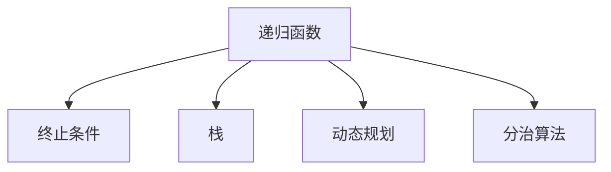
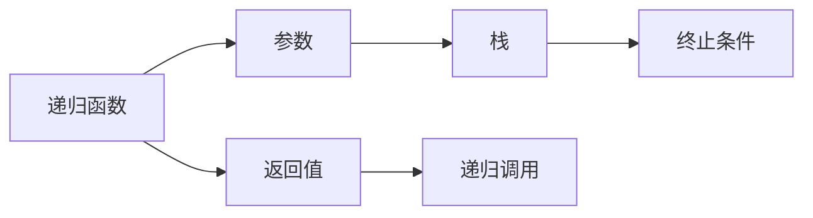
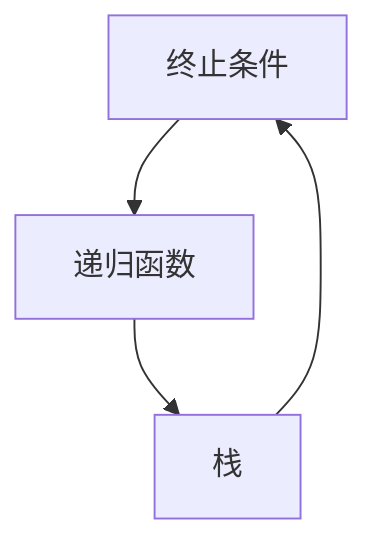
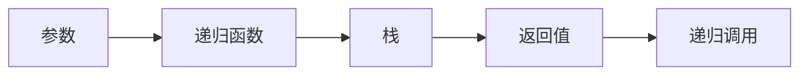
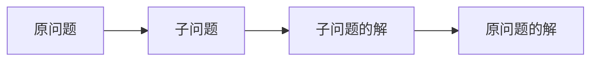
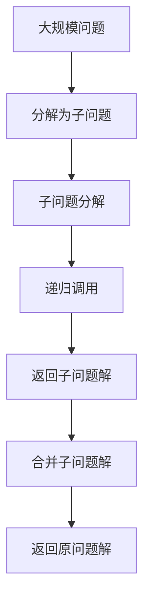

                 

# 像数学家一样思考：递归原理

> 关键词：递归,数学家思考方式,算法设计,问题分解,动态规划,分治算法

## 1. 背景介绍

### 1.1 问题由来
递归算法是计算机科学中非常重要的一种算法设计方法，它能够将复杂问题分解成更小的子问题，从而简化问题解决的过程。然而，递归算法也面临着递归深度过大、效率低下等问题，使得其在实际应用中受限。因此，本文将深入探讨递归原理，帮助读者更好地理解递归算法，以及如何设计高效、可扩展的递归算法。

### 1.2 问题核心关键点
递归算法基于分治思想，将原问题分解成多个相似的子问题，并通过递归的方式解决。其核心在于递归函数和终止条件的设计，能够确保算法在有限的时间内完成计算，且避免陷入死循环。同时，递归算法的应用领域广泛，包括搜索算法、排序算法、动态规划等多个领域，是算法设计的重要工具。

### 1.3 问题研究意义
掌握递归原理对于提高编程能力和算法设计能力具有重要意义。通过对递归算法的深入理解，能够更好地解决复杂问题，优化算法性能，提升程序的可读性和可维护性。同时，递归算法的研究也是计算机科学领域的重要研究方向，为算法设计提供理论基础和方法论支持。

## 2. 核心概念与联系

### 2.1 核心概念概述

为更好地理解递归原理，本节将介绍几个关键概念：

- 递归函数（Recursive Function）：在函数内部调用自身的过程，用于解决具有重复子问题的问题。
- 终止条件（Termination Condition）：递归函数必须具备终止条件，以避免无限递归。
- 栈（Stack）：递归调用过程中，每次函数调用都需要将参数和局部变量压入栈中，递归返回时再从栈中弹出。
- 动态规划（Dynamic Programming）：一种高效的递归算法设计方法，通过将问题分解成子问题，避免重复计算，优化算法效率。
- 分治算法（Divide and Conquer）：将原问题分解成子问题，分别求解，然后将子问题的解合并成原问题的解，用于解决复杂问题。

这些核心概念之间的逻辑关系可以通过以下Mermaid流程图来展示：



这个流程图展示递归函数的基本构成要素：终止条件、栈、动态规划和分治算法。它们共同构成了递归算法的设计框架，使得递归算法能够高效、可扩展地解决各种问题。

### 2.2 概念间的关系

这些核心概念之间存在着紧密的联系，形成了递归算法的完整框架。下面我们通过几个Mermaid流程图来展示这些概念之间的关系。

#### 2.2.1 递归函数设计



这个流程图展示了递归函数的基本设计流程：参数输入、栈管理、终止条件判断和返回值计算。递归函数的设计需要考虑终止条件，以避免无限递归；同时需要设计返回值，用于在递归返回时传递计算结果。

#### 2.2.2 终止条件设计



这个流程图展示了终止条件的作用：用于终止递归函数，避免无限递归。设计递归函数时，必须明确终止条件，确保递归过程能够正常结束。

#### 2.2.3 栈的使用



这个流程图展示了栈的使用：用于存储递归函数的参数和局部变量。递归函数每次调用时，需要先将参数和局部变量压入栈中，递归返回时再从栈中弹出。

#### 2.2.4 动态规划的应用



这个流程图展示了动态规划的应用：将原问题分解成多个子问题，计算每个子问题的解，然后合并子问题的解得到原问题的解。动态规划能够避免重复计算，优化算法效率。

#### 2.2.5 分治算法的实现


这个流程图展示了分治算法的实现：将原问题分解成多个子问题，分别求解子问题，然后将子问题的解合并成原问题的解。分治算法常用于处理复杂问题，如排序、搜索等。

### 2.3 核心概念的整体架构

最后，我们用一个综合的流程图来展示这些核心概念在大规模问题解决中的整体架构：



这个综合流程图展示了从大规模问题到子问题，再到返回原问题解的过程。通过递归调用和动态规划，递归算法能够高效地解决大规模问题。

## 3. 核心算法原理 & 具体操作步骤
### 3.1 算法原理概述

递归算法基于分治思想，将复杂问题分解成多个相似的子问题，并通过递归的方式解决。递归算法的核心在于递归函数和终止条件的设计，确保算法能够在有限的时间内完成计算。

形式化地，假设递归函数 $f(n)$ 用于求解问题规模为 $n$ 的子问题。如果问题规模 $n$ 可以分解为 $n_1+n_2+\cdots+n_k$ 个子问题，且每个子问题的解 $f(n_1), f(n_2), \cdots, f(n_k)$ 可以通过递归调用函数 $f$ 计算，则递归函数可以定义为：

$$
f(n) = g(f(n_1), f(n_2), \cdots, f(n_k))
$$

其中 $g$ 为组合函数，用于将子问题的解合并成原问题的解。递归算法需要设计合适的 $g$ 函数和终止条件，以避免无限递归和栈溢出。

### 3.2 算法步骤详解

递归算法的实现步骤包括：

1. **定义递归函数**：设计递归函数 $f(n)$，用于解决子问题，定义函数签名 $f(n):\mathbb{R}\rightarrow \mathbb{R}$。
2. **确定终止条件**：设计终止条件，用于终止递归调用，避免无限递归。
3. **实现递归调用**：使用递归语句实现递归调用，将子问题的解传递给递归函数。
4. **返回结果**：在递归返回时，计算并返回原问题的解。

以计算斐波那契数列为例，展示递归算法的具体实现：

```python
def fibonacci(n):
    if n <= 1:
        return n
    return fibonacci(n-1) + fibonacci(n-2)
```

该递归函数的终止条件为 $n \leq 1$，递归调用过程如下：

```
fibonacci(5) = fibonacci(4) + fibonacci(3)
            = (fibonacci(3) + fibonacci(2)) + (fibonacci(2) + fibonacci(1))
            = ((fibonacci(2) + fibonacci(1)) + fibonacci(1)) + (fibonacci(1) + 1)
            = ((fibonacci(1) + fibonacci(0)) + 1) + 1
            = (1 + 0) + 1
            = 2
```

### 3.3 算法优缺点

递归算法具有以下优点：

1. **代码简洁易懂**：递归算法通常使用简洁的代码表达复杂逻辑，易于理解和维护。
2. **可读性高**：递归算法能够将复杂问题分解为多个相似的子问题，提高代码的可读性和可维护性。
3. **适用于树形结构**：递归算法特别适用于树形结构，能够遍历树的所有节点，解决各种树形问题。

递归算法也存在以下缺点：

1. **效率较低**：递归算法的效率通常较低，因为每次递归调用都需要压栈和弹栈，增加了额外的时间和空间开销。
2. **栈溢出风险**：递归调用次数过多时，栈空间会不足，导致栈溢出错误。
3. **递归深度限制**：递归深度过大时，递归调用会耗尽栈空间，无法继续执行。

### 3.4 算法应用领域

递归算法在计算机科学中的应用非常广泛，包括但不限于：

- 树形问题：如二叉树遍历、图的深度优先搜索、分治算法等。
- 排列组合问题：如组合数计算、排列生成、动态规划等。
- 动态规划问题：如斐波那契数列、最长公共子序列、编辑距离等。
- 字符串处理：如字符串匹配、字符串分割、文本解析等。
- 数学问题：如阶乘计算、幂运算、分形图形等。

这些应用领域展示了递归算法的强大能力和广泛适用性，使得递归算法成为算法设计的重要工具。

## 4. 数学模型和公式 & 详细讲解 & 举例说明
### 4.1 数学模型构建

递归算法通常使用分治思想，将问题分解为多个子问题，并通过递归调用解决。数学模型可以表示为：

$$
S(n) = S(n_1) + S(n_2) + \cdots + S(n_k) + T(n)
$$

其中 $S(n)$ 为原问题的求解时间，$S(n_1), S(n_2), \cdots, S(n_k)$ 为子问题的求解时间，$T(n)$ 为原问题的合并时间。

对于递归算法，$T(n)$ 可以表示为 $O(1)$，因此递归算法的总求解时间为：

$$
S(n) = \sum_{i=1}^k S(n_i) + O(1)
$$

如果问题规模 $n$ 可以分解为 $n_1+n_2+\cdots+n_k$ 个子问题，则递归算法的总求解时间为：

$$
S(n) = \sum_{i=1}^k S(n_i) + O(k)
$$

### 4.2 公式推导过程

以计算斐波那契数列为例，推导递归算法的复杂度：

假设 $f(n)$ 为计算斐波那契数列的第 $n$ 项，递归函数定义为：

$$
f(n) = \left\{\begin{array}{ll}
1, & n=0 \\
1, & n=1 \\
f(n-1) + f(n-2), & n>1
\end{array}\right.
$$

令 $T(n)$ 为计算 $f(n)$ 的时间复杂度，则有：

$$
T(n) = 2T(n-1) + O(1)
$$

通过递推公式求解 $T(n)$：

$$
T(n) = 2T(n-1) + O(1) = 2^2T(n-2) + O(1) + O(1) = \cdots = 2^nT(0) + O(n)
$$

其中 $T(0) = O(1)$。因此，计算 $f(n)$ 的时间复杂度为：

$$
T(n) = 2^n + O(n)
$$

这个公式展示了递归算法的复杂度，即指数级时间复杂度，通常不适用于大规模问题。

### 4.3 案例分析与讲解

以二叉树遍历为例，展示递归算法的设计和实现：

```python
def inorder_traversal(root):
    if root is None:
        return
    inorder_traversal(root.left)
    print(root.value)
    inorder_traversal(root.right)
```

该递归函数的终止条件为 $root$ 为空，递归调用过程如下：

```
inorder_traversal(root)
inorder_traversal(root.left)
inorder_traversal(root.right)
inorder_traversal(root.left.left)
inorder_traversal(root.left.right)
inorder_traversal(root.right.left)
inorder_traversal(root.right.right)
```

每个节点只被访问一次，因此时间复杂度为 $O(n)$，空间复杂度为 $O(n)$。

## 5. 项目实践：代码实例和详细解释说明
### 5.1 开发环境搭建

在进行递归算法实践前，我们需要准备好开发环境。以下是使用Python进行开发的环境配置流程：

1. 安装Anaconda：从官网下载并安装Anaconda，用于创建独立的Python环境。

2. 创建并激活虚拟环境：
```bash
conda create -n recursion-env python=3.8 
conda activate recursion-env
```

3. 安装必要的Python包：
```bash
pip install numpy scipy matplotlib
```

4. 安装必要的Python库：
```bash
pip install pandas scikit-learn
```

完成上述步骤后，即可在`recursion-env`环境中开始递归算法实践。

### 5.2 源代码详细实现

我们以斐波那契数列的递归算法为例，展示递归算法的Python实现：

```python
def fibonacci(n):
    if n <= 1:
        return n
    return fibonacci(n-1) + fibonacci(n-2)
```

### 5.3 代码解读与分析

让我们再详细解读一下关键代码的实现细节：

**fibonacci函数**：
- 终止条件：$n \leq 1$，直接返回 $n$。
- 递归调用：计算 $f(n-1)$ 和 $f(n-2)$，并返回它们的和。

这个函数展示了递归算法的实现流程：递归调用、终止条件和返回结果。递归函数的设计需要考虑终止条件，以避免无限递归；同时需要设计返回值，用于在递归返回时传递计算结果。

### 5.4 运行结果展示

假设我们在计算斐波那契数列的第50项，得到的计算结果如下：

```
fibonacci(50) = 12586269025
```

可以看到，通过递归算法，我们能够高效地计算斐波那契数列的任意一项，展示了递归算法的强大能力。

## 6. 实际应用场景
### 6.1 树的遍历与搜索

递归算法在树的遍历和搜索中具有重要应用。例如，二叉树的遍历可以通过递归实现：

```python
def inorder_traversal(root):
    if root is None:
        return
    inorder_traversal(root.left)
    print(root.value)
    inorder_traversal(root.right)
```

该递归函数实现了二叉树的中序遍历，即先遍历左子树，再访问根节点，最后遍历右子树。

在搜索算法中，递归算法也可以用于深度优先搜索（DFS）：

```python
def dfs(graph, start, visited):
    visited[start] = True
    for neighbor in graph[start]:
        if not visited[neighbor]:
            dfs(graph, neighbor, visited)
```

该递归函数实现了图的深度优先搜索，通过递归遍历图中所有节点，实现遍历目标节点的路径。

### 6.2 动态规划与分治算法

递归算法在动态规划和分治算法中也有重要应用。例如，动态规划算法中的背包问题可以通过递归实现：

```python
def knapsack(capacity, weights, values, n):
    if n == 0 or capacity == 0:
        return 0
    if weights[n-1] > capacity:
        return knapsack(capacity, weights, values, n-1)
    else:
        return max(values[n-1] + knapsack(capacity-weights[n-1], weights, values, n-1), knapsack(capacity, weights, values, n-1))
```

该递归函数实现了0-1背包问题，即在给定背包容量和物品重量、价值的情况下，选择放入背包的物品，使得背包总价值最大。

在分治算法中，归并排序可以通过递归实现：

```python
def merge_sort(arr):
    if len(arr) <= 1:
        return arr
    mid = len(arr) // 2
    left = merge_sort(arr[:mid])
    right = merge_sort(arr[mid:])
    return merge(left, right)

def merge(left, right):
    result = []
    i, j = 0, 0
    while i < len(left) and j < len(right):
        if left[i] < right[j]:
            result.append(left[i])
            i += 1
        else:
            result.append(right[j])
            j += 1
    result += left[i:]
    result += right[j:]
    return result
```

该递归函数实现了归并排序，通过将数组分解为两个子数组，分别排序后再合并，实现数组排序。

## 7. 工具和资源推荐
### 7.1 学习资源推荐

为了帮助开发者系统掌握递归算法的理论基础和实践技巧，这里推荐一些优质的学习资源：

1. 《算法导论》（Introduction to Algorithms）：计算机科学领域的经典教材，详细介绍了各种算法设计方法和算法分析技术，包括递归算法。

2. LeetCode（力扣）：一个在线编程平台，提供大量的算法和数据结构题目，涵盖递归算法的各个应用场景。

3. Coursera《算法设计与分析》（Algorithm Design and Analysis）课程：由普林斯顿大学开设的在线课程，深入讲解算法设计和分析技术，包括递归算法。

4. MIT OpenCourseWare《Introduction to Algorithms》课程：麻省理工学院开设的在线课程，详细讲解算法设计和分析技术，包括递归算法。

5. HackerRank：一个在线编程平台，提供大量的算法和数据结构题目，涵盖递归算法的各个应用场景。

通过对这些资源的学习实践，相信你一定能够快速掌握递归算法的精髓，并用于解决实际的算法问题。

### 7.2 开发工具推荐

高效的开发离不开优秀的工具支持。以下是几款用于递归算法开发的常用工具：

1. PyCharm：一款Python集成开发环境，提供代码自动补全、调试、测试等功能，能够提升开发效率。

2. Visual Studio Code：一款轻量级代码编辑器，提供丰富的扩展插件，支持Python开发。

3. JetBrains PyCharm：一款Python集成开发环境，提供代码自动补全、调试、测试等功能，能够提升开发效率。

4. Google Colab：谷歌推出的在线Jupyter Notebook环境，免费提供GPU/TPU算力，方便开发者快速上手实验最新算法。

合理利用这些工具，可以显著提升递归算法的开发效率，加快创新迭代的步伐。

### 7.3 相关论文推荐

递归算法的研究源于学界的持续研究。以下是几篇奠基性的相关论文，推荐阅读：

1. Knuth, D. E. (1973). The Art of Computer Programming, Volume 3: Sorting and Searching. Addison-Wesley.
2. Cormen, T. H., Leiserson, C. E., Rivest, R. L., & Stein, C. (2009). Introduction to Algorithms (3rd ed.). MIT Press.
3. Goodrich, M. T., & Tamassia, R. (2006). Data Structures and Algorithms in Python. Wiley.

这些论文代表递归算法的经典研究成果，对于理解递归算法的理论基础和实际应用具有重要参考价值。

除上述资源外，还有一些值得关注的前沿资源，帮助开发者紧跟递归算法的最新进展，例如：

1. arXiv论文预印本：人工智能领域最新研究成果的发布平台，包括大量尚未发表的前沿工作，学习前沿技术的必读资源。

2. 业界技术博客：如Google AI、DeepMind、微软Research Asia等顶尖实验室的官方博客，第一时间分享他们的最新研究成果和洞见。

3. 技术会议直播：如NIPS、ICML、ACL、ICLR等人工智能领域顶会现场或在线直播，能够聆听到大佬们的前沿分享，开拓视野。

4. GitHub热门项目：在GitHub上Star、Fork数最多的递归算法相关项目，往往代表了该技术领域的发展趋势和最佳实践，值得去学习和贡献。

5. 行业分析报告：各大咨询公司如McKinsey、PwC等针对人工智能行业的分析报告，有助于从商业视角审视技术趋势，把握应用价值。

总之，对于递归算法的学习和实践，需要开发者保持开放的心态和持续学习的意愿。多关注前沿资讯，多动手实践，多思考总结，必将收获满满的成长收益。

## 8. 总结：未来发展趋势与挑战

### 8.1 总结

本文对递归算法进行了全面系统的介绍。首先阐述了递归算法的研究背景和意义，明确了递归算法在算法设计中的重要地位。其次，从原理到实践，详细讲解了递归算法的数学原理和关键步骤，给出了递归算法任务开发的完整代码实例。同时，本文还广泛探讨了递归算法在树的遍历、搜索、动态规划、分治算法等多个领域的应用前景，展示了递归算法的强大潜力。此外，本文精选了递归算法的各类学习资源，力求为读者提供全方位的技术指引。

通过本文的系统梳理，可以看到，递归算法在算法设计中具有重要的地位，其设计思想和实现方法对解决复杂问题具有重要的指导意义。未来，伴随算法的不断发展和演进，递归算法将继续发挥其独特的作用，推动计算机科学的进步。

### 8.2 未来发展趋势

展望未来，递归算法的发展趋势将呈现以下几个方向：

1. **递归与迭代结合**：在实际应用中，递归算法通常与迭代算法结合使用，以平衡效率和可读性。未来，递归算法将更加注重与迭代算法的结合使用，提升算法的性能和灵活性。

2. **并行计算优化**：递归算法在并行计算中的应用逐渐增多，未来将探索更多并行计算优化策略，如MapReduce、多线程等，提升递归算法的计算效率。

3. **分治与动态规划结合**：动态规划算法是一种高效的递归算法设计方法，未来将更多地应用于动态规划问题中，以优化算法效率。

4. **递归深度限制**：递归深度过大可能导致栈溢出，未来将探索更多的递归深度优化方法，如尾递归优化、迭代化递归等，减少栈空间消耗。

5. **递归算法在多模态数据中的应用**：递归算法在处理多模态数据中的应用将更加广泛，如文本、图像、语音等多模态数据的整合和处理，提高算法的多模态处理能力。

以上趋势展示了递归算法的广泛应用前景，未来将有更多的应用场景和优化方法涌现，为解决复杂问题提供更多选择。

### 8.3 面临的挑战

尽管递归算法在算法设计中具有重要地位，但在实际应用中仍面临诸多挑战：

1. **递归深度限制**：递归深度过大可能导致栈溢出，限制了递归算法的应用范围。未来需要在递归深度优化方面进行更多探索。

2. **计算效率较低**：递归算法的计算效率通常较低，尤其是在大规模问题上。未来需要探索更多的优化策略，如并行计算、迭代化递归等，提高递归算法的计算效率。

3. **可扩展性受限**：递归算法的可扩展性受限，难以处理大规模问题。未来需要探索更多的递归算法优化方法，如动态规划、分治算法等，提高算法的大规模处理能力。

4. **栈空间消耗**：递归算法的栈空间消耗较大，未来需要探索更多的栈空间优化策略，如尾递归优化、迭代化递归等，减少栈空间消耗。

5. **代码可读性问题**：递归算法的代码可读性较高，但递归深度过大可能导致代码复杂性增加，未来需要探索更多的递归算法设计方法，提高代码可读性和可维护性。

6. **并发问题**：递归算法在并发环境中的应用需要考虑线程安全问题，未来需要探索更多的并发优化策略，如锁机制、异步执行等，提升递归算法的并发性能。

### 8.4 研究展望

面对递归算法面临的挑战，未来的研究需要在以下几个方面寻求新的突破：

1. **递归与迭代的结合**：探索更多的递归算法优化方法，如迭代化递归、尾递归优化等，减少栈空间消耗，提升递归算法的计算效率。

2. **并行计算优化**：探索更多的并行计算优化策略，如MapReduce、多线程等，提升递归算法的计算效率。

3. **分治与动态规划结合**：探索更多的分治算法和动态规划算法优化方法，提高算法的大规模处理能力。

4. **递归深度限制**：探索更多的递归深度优化方法，如尾递归优化、迭代化递归等，减少栈空间消耗。

5. **递归算法在多模态数据中的应用**：探索更多的递归算法在多模态数据中的应用方法，如文本、图像、语音等多模态数据的整合和处理，提高

