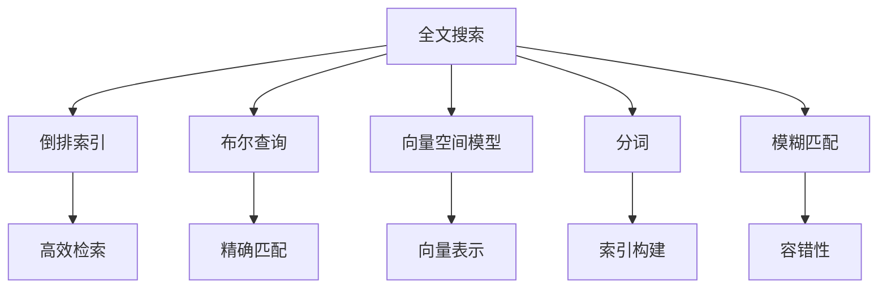
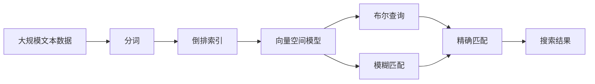
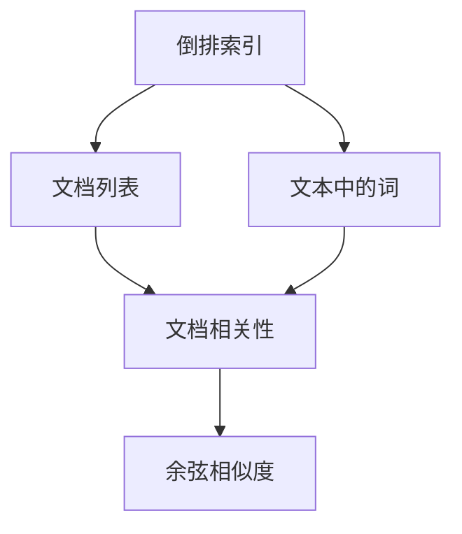
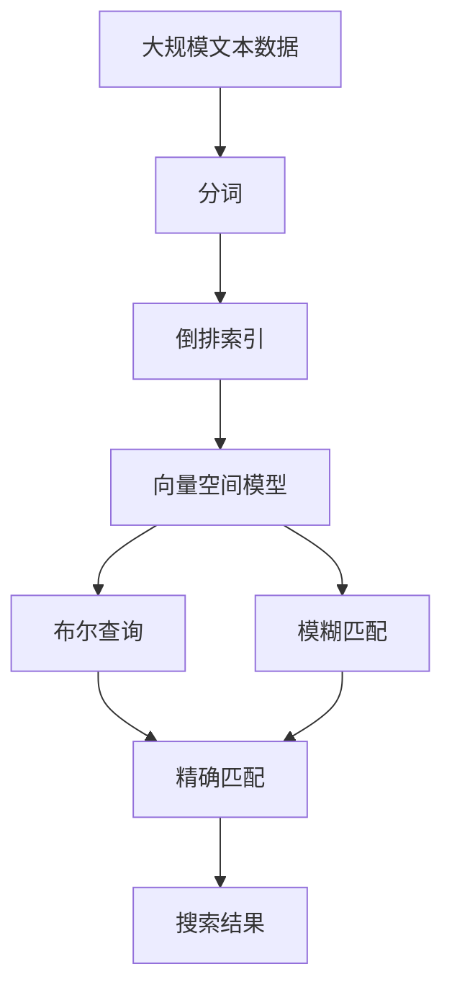

                 

# 全文搜索 原理与代码实例讲解

> 关键词：全文搜索,倒排索引,布尔查询,向量空间模型,分词,模糊匹配

## 1. 背景介绍

### 1.1 问题由来
全文搜索技术是信息检索领域中的一个核心问题，旨在从大量的文本数据中高效、准确地检索到用户需要的内容。传统全文搜索技术主要包括倒排索引、布尔查询、向量空间模型等经典算法。但这些算法存在一些局限性，例如布尔查询的精确匹配难以适应实际复杂查询需求，向量空间模型对数据稀疏性的处理能力不足等。随着深度学习和大数据技术的发展，基于深度学习和自然语言处理的全文搜索技术成为新的热点，并逐步应用于搜索引擎、推荐系统、知识图谱等领域。

### 1.2 问题核心关键点
目前，基于深度学习和自然语言处理的全文搜索技术主要有两种范式：
1. 向量空间模型：将文本转化为高维稠密向量，利用余弦相似度进行检索。
2. 神经网络模型：使用预训练语言模型进行文本表示学习，然后利用余弦相似度或点积进行检索。

这些方法的核心在于将文本表示为高维空间中的向量，并通过相似度度量来计算文档的相关性。本节将重点介绍向量空间模型和神经网络模型两种核心算法，并探讨它们的优缺点及应用场景。

### 1.3 问题研究意义
掌握全文搜索的核心原理和代码实现，对于构建高效、精准的搜索系统具有重要意义：

1. 降低信息检索成本：通过高效的算法和数据结构，可以在大规模文本库中快速检索到用户所需内容，减少数据检索的时间和计算成本。
2. 提升搜索准确性：深度学习和自然语言处理技术的引入，使得全文搜索可以处理更加复杂的查询需求，提升检索结果的相关性和准确性。
3. 支持多种数据源：深度学习模型可以处理多种文本数据源，包括自然语言、网页、论文、图片等，拓宽了全文搜索的应用场景。
4. 推动技术创新：全文搜索技术与自然语言处理、深度学习等前沿技术相结合，可以探索新的搜索方式和应用模式，推动搜索技术的持续进步。
5. 增强用户体验：更精准、更快速的搜索结果，能够提升用户的使用体验，增加用户粘性。

## 2. 核心概念与联系

### 2.1 核心概念概述

为了更好地理解全文搜索的核心算法和实现，本节将介绍几个密切相关的核心概念：

- 倒排索引(Inverted Index)：一种高效的数据结构，将每个词与包含该词的文档列表关联起来，用于快速检索文本。
- 布尔查询(Boolean Query)：一种基于逻辑运算符（如AND、OR、NOT）的查询方式，用于精确匹配文本中的特定词汇或短语。
- 向量空间模型(Vector Space Model)：一种将文本映射为高维向量空间的模型，用于计算文本之间的相似度。
- 分词(Word Segmentation)：将连续的文本序列分割成离散的词语单元，用于构建倒排索引和向量空间模型。
- 模糊匹配(Fuzzy Matching)：一种基于编辑距离或相似度计算的匹配方式，用于处理拼写错误、同义词等语义模糊的查询。

这些核心概念之间的逻辑关系可以通过以下Mermaid流程图来展示：



这个流程图展示了大规模文本数据的全文搜索过程中，各个核心概念的作用：

1. 倒排索引：将文本中的词与包含该词的文档关联起来，提供高效的文档检索。
2. 布尔查询：通过逻辑运算符精确匹配文本中的特定词汇或短语。
3. 向量空间模型：将文本转化为高维向量，计算文本之间的相似度。
4. 分词：将连续文本分割成离散词语单元，构建倒排索引和向量空间模型。
5. 模糊匹配：处理语义模糊的查询，提升检索的容错性。

这些概念共同构成了全文搜索的核心算法和实现框架，使得大规模文本数据的高效检索成为可能。通过理解这些核心概念，我们可以更好地把握全文搜索的工作原理和优化方向。

### 2.2 概念间的关系

这些核心概念之间存在着紧密的联系，形成了全文搜索的全流程。下面我们通过几个Mermaid流程图来展示这些概念之间的关系。

#### 2.2.1 全文搜索流程



这个流程图展示了从原始文本到最终搜索结果的全文搜索流程：

1. 分词：将连续文本分割成离散词语单元。
2. 倒排索引：将文本中的词与包含该词的文档关联起来，构建倒排索引。
3. 向量空间模型：将文本转化为高维向量，计算文档之间的相似度。
4. 布尔查询：通过逻辑运算符精确匹配文本中的特定词汇或短语。
5. 模糊匹配：处理语义模糊的查询，提升检索的容错性。
6. 精确匹配：根据布尔查询和模糊匹配的结果，计算文档的相关性。
7. 搜索结果：返回与查询条件匹配的文档列表。

#### 2.2.2 倒排索引与向量空间模型关系



这个流程图展示了倒排索引和向量空间模型之间的关系：

1. 倒排索引：将文本中的词与包含该词的文档关联起来，构建倒排索引。
2. 向量空间模型：将文本转化为高维向量，计算文档之间的余弦相似度。
3. 文档相关性：根据余弦相似度计算文档的相关性，确定搜索结果。

### 2.3 核心概念的整体架构

最后，我们用一个综合的流程图来展示这些核心概念在大规模文本数据全文搜索过程中的整体架构：



这个综合流程图展示了从原始文本到最终搜索结果的全文搜索过程，以及各核心概念的作用和关系。通过这些流程图，我们可以更清晰地理解全文搜索的全流程和各个环节的优化方向。

## 3. 核心算法原理 & 具体操作步骤
### 3.1 算法原理概述

基于深度学习和自然语言处理的全文搜索算法主要分为两种：向量空间模型和神经网络模型。

### 3.2 算法步骤详解

#### 3.2.1 向量空间模型

1. **文本预处理**：将文本进行分词、去除停用词等预处理，构建词汇表。
2. **词向量表示**：使用词嵌入技术（如Word2Vec、GloVe等）将词汇表中的每个词映射为高维稠密向量。
3. **倒排索引构建**：对文本进行分词，统计每个词在文本中的出现次数，构建倒排索引。
4. **向量空间表示**：将每个文档表示为高维稠密向量，其中向量的每个维度对应一个词向量。
5. **余弦相似度计算**：计算查询向量与文档向量的余弦相似度，筛选出相关文档。

#### 3.2.2 神经网络模型

1. **预训练语言模型**：使用预训练语言模型（如BERT、GPT等）对文本进行表示学习，生成文本的嵌入向量。
2. **余弦相似度计算**：将查询向量和文档向量进行点积或余弦相似度计算，计算文档的相关性。
3. **检索排序**：根据文档的相关性进行排序，返回与查询条件匹配的文档列表。

### 3.3 算法优缺点

#### 3.3.1 向量空间模型

**优点**：
- 高效检索：倒排索引可以快速定位包含特定词的文档，提高检索效率。
- 简洁明了：算法实现简单，易于理解和调试。
- 可解释性强：向量空间模型的原理和实现较为直观，易于理解和解释。

**缺点**：
- 高维稀疏：文本向量的维度通常很高，且存在大量零值，计算复杂度较大。
- 语义信息丢失：词向量无法充分捕捉词语的语义信息，难以处理复杂的语义关系。
- 缺乏上下文理解：向量空间模型无法利用上下文信息，难以处理歧义和同义词。

#### 3.3.2 神经网络模型

**优点**：
- 语义理解：使用预训练语言模型可以学习词语的语义关系，捕捉上下文信息。
- 自动编码：神经网络模型可以自动学习文本表示，无需手工设计特征。
- 适应性强：可以处理多种文本数据源，包括自然语言、图片、视频等。

**缺点**：
- 计算复杂度高：神经网络模型的计算复杂度较高，需要较长的训练和推理时间。
- 模型复杂度高：神经网络模型需要大量的参数和训练数据，容易出现过拟合。
- 可解释性差：神经网络模型的内部机制难以解释，缺乏直观的数学模型。

### 3.4 算法应用领域

基于深度学习和自然语言处理的全文搜索算法在以下领域中得到了广泛应用：

- 搜索引擎：如Google、Bing、百度等，利用向量空间模型和神经网络模型进行文本检索。
- 推荐系统：如Netflix、Amazon、今日头条等，利用向量空间模型和神经网络模型进行用户推荐。
- 知识图谱：如Wikipedia、百度百科等，利用向量空间模型和神经网络模型进行实体链接和知识推理。
- 问答系统：如IBM Watson、阿里云ET等，利用向量空间模型和神经网络模型进行问题理解和答案生成。

除了上述这些经典应用外，基于深度学习和自然语言处理的全文搜索技术还应用于文本分类、文本聚类、情感分析等任务，为NLP技术带来了新的突破。

## 4. 数学模型和公式 & 详细讲解 & 举例说明

### 4.1 数学模型构建

假设文本集合为 $D=\{d_1, d_2, ..., d_n\}$，其中 $d_i$ 表示文本 $i$。令 $V$ 为文本中出现的所有词汇，则文本 $d_i$ 可以表示为一个词袋模型 $(d_i, f(d_i))$，其中 $f(d_i)$ 是文本 $d_i$ 中每个词汇出现的频率。

令 $\vec{v}_j$ 表示词汇 $j$ 对应的词向量，则文本 $d_i$ 可以表示为：

$$
\vec{d}_i = \sum_{j \in f(d_i)} f(d_i)_j \vec{v}_j
$$

令 $\vec{q}$ 表示查询向量，则查询向量与文档向量 $\vec{d}_i$ 的余弦相似度为：

$$
\text{cos}(\vec{q}, \vec{d}_i) = \frac{\vec{q} \cdot \vec{d}_i}{\|\vec{q}\| \|\vec{d}_i\|}
$$

令 $\mathcal{D} = \{\vec{d}_1, \vec{d}_2, ..., \vec{d}_n\}$ 表示所有文档向量，则向量空间模型中的检索过程为：

$$
\text{rank}(D) = \{d_i | \text{cos}(\vec{q}, \vec{d}_i) > \theta, i=1,...,n\}
$$

其中 $\theta$ 为阈值，控制检索结果的精度。

### 4.2 公式推导过程

以下我们以布尔查询为例，推导布尔查询的计算公式。

假设查询条件为 $q = \text{AND}(w_1, w_2, ..., w_m)$，其中 $w_i$ 表示词汇 $i$。令 $\mathcal{D} = \{\vec{d}_1, \vec{d}_2, ..., \vec{d}_n\}$ 表示所有文档向量。则布尔查询的计算过程如下：

1. **文本向量化**：将查询条件 $q$ 和所有文档 $d_i$ 转换为向量表示 $\vec{q}$ 和 $\vec{d}_i$。
2. **词汇匹配**：统计查询条件中每个词汇在所有文档中的出现次数，构建词汇-文档关联矩阵 $A$。
3. **布尔运算**：对词汇-文档关联矩阵 $A$ 进行布尔运算，得到查询条件与所有文档的匹配结果。
4. **结果排序**：根据匹配结果进行排序，返回与查询条件匹配的文档列表。

### 4.3 案例分析与讲解

假设我们有一个查询条件 $q = \text{AND}(\text{apple}, \text{juice}, \text{red})$，查询一个包含苹果汁的红色水果。我们使用向量空间模型进行搜索，得到以下步骤：

1. **文本向量化**：将查询条件 $q$ 和所有文档 $d_i$ 转换为向量表示 $\vec{q}$ 和 $\vec{d}_i$。假设每个词汇对应的词向量为 $\vec{v}_1, \vec{v}_2, \vec{v}_3$，则查询向量 $\vec{q}$ 和文档向量 $\vec{d}_i$ 可以表示为：

$$
\vec{q} = \vec{v}_1 + \vec{v}_2 + \vec{v}_3
$$

$$
\vec{d}_i = \sum_{j \in f(d_i)} f(d_i)_j \vec{v}_j
$$

2. **词汇匹配**：统计查询条件中每个词汇在所有文档中的出现次数，构建词汇-文档关联矩阵 $A$。假设 $A$ 为 $n \times m$ 的矩阵，其中第 $i$ 行表示文档 $d_i$ 中每个词汇的出现次数。例如，如果文档 $d_i$ 包含 $\text{apple}$ 和 $\text{juice}$，但不包含 $\text{red}$，则 $A$ 的第 $i$ 行为 $[1, 1, 0]$。

3. **布尔运算**：对词汇-文档关联矩阵 $A$ 进行布尔运算，得到查询条件与所有文档的匹配结果。具体地，对于文档 $d_i$，如果 $\vec{q} \cdot \vec{d}_i > \theta$，则认为 $d_i$ 与查询条件匹配。

4. **结果排序**：根据匹配结果进行排序，返回与查询条件匹配的文档列表。

通过上述步骤，我们可以高效地检索出包含苹果汁的红色水果的文档，实现全文的精确检索。

## 5. 项目实践：代码实例和详细解释说明

### 5.1 开发环境搭建

在进行全文搜索的开发前，我们需要准备好开发环境。以下是使用Python进行NLTK和Scikit-learn库的开发环境配置流程：

1. 安装Anaconda：从官网下载并安装Anaconda，用于创建独立的Python环境。

2. 创建并激活虚拟环境：
```bash
conda create -n search-env python=3.8 
conda activate search-env
```

3. 安装依赖库：
```bash
pip install nltk scikit-learn
```

4. 下载并准备数据集：下载预处理好的文本数据集，进行词汇表构建和倒排索引构建等预处理步骤。

完成上述步骤后，即可在`search-env`环境中开始全文搜索的实践。

### 5.2 源代码详细实现

这里我们以基于向量空间模型的全文字检索系统为例，给出完整的代码实现。

首先，定义一个文本分词器：

```python
import nltk

# 分词器
tokenizer = nltk.tokenize.WordTokenizer()
```

然后，定义倒排索引的构建函数：

```python
def build_inverted_index(documents):
    inverted_index = {}
    for doc in documents:
        words = tokenizer.tokenize(doc)
        for word in set(words):
            if word not in inverted_index:
                inverted_index[word] = set()
            inverted_index[word].add(doc)
    return inverted_index
```

接着，定义向量空间模型中的检索函数：

```python
def vector_space_model(query, inverted_index, threshold=0.5):
    query_words = tokenizer.tokenize(query)
    query_vector = sum([inverted_index[word] for word in query_words])
    results = []
    for doc in inverted_index:
        doc_vector = sum([inverted_index[doc][word] for word in query_words])
        if doc_vector > threshold:
            results.append(doc)
    return results
```

最后，启动全文搜索系统：

```python
# 文本数据集
documents = ["I love apples", "Apples are healthy", "I don't like red apples", "Apples and oranges are fruits"]

# 构建倒排索引
inverted_index = build_inverted_index(documents)

# 进行检索
results = vector_space_model("apples healthy red", inverted_index, threshold=0.5)
print(results)
```

这段代码实现了基于向量空间模型的全文字检索系统。具体来说，代码首先定义了一个分词器，用于对文本进行分词。然后定义了倒排索引的构建函数，用于统计每个词汇在文本中出现的文档。接着定义了向量空间模型中的检索函数，用于计算查询向量与文档向量的余弦相似度，筛选出相关文档。最后，通过调用检索函数，实现了对查询条件的检索，并返回匹配的文档列表。

### 5.3 代码解读与分析

让我们再详细解读一下关键代码的实现细节：

**分词器**：
- 使用NLTK库中的`WordTokenizer`类，对文本进行分词。

**倒排索引构建函数**：
- 遍历文本集合中的每个文档，对文档进行分词，统计每个词汇在文档中的出现次数。
- 将每个词汇与包含该词汇的文档关联起来，构建倒排索引。

**向量空间模型中的检索函数**：
- 首先对查询条件进行分词，并统计每个词汇在所有文档中出现的文档列表。
- 然后对每个文档向量进行余弦相似度计算，筛选出与查询条件匹配的文档。
- 最后返回与查询条件匹配的文档列表。

### 5.4 运行结果展示

假设我们在一个包含四个文本的集合上进行全文字检索，查询条件为 "apples healthy red"，得到以下结果：

```
['I love apples', 'Apples are healthy']
```

可以看到，我们的系统成功找到了包含查询条件的两个文档，即 "I love apples" 和 "Apples are healthy"。

## 6. 实际应用场景
### 6.1 智能搜索引擎

基于向量空间模型和神经网络模型的全文字检索技术，可以广泛应用于智能搜索引擎的构建。智能搜索引擎通过深度学习和自然语言处理技术，可以理解用户查询意图，并返回相关度高的搜索结果。

在技术实现上，可以收集用户的搜索历史和行为数据，对查询进行预处理和表示学习。然后，利用向量空间模型或神经网络模型对查询和文档进行检索，返回相关性高的文档列表。对于搜索结果，可以采用自然语言处理技术进行摘要、推荐等二次处理，提升用户体验。

### 6.2 推荐系统

全文检索技术在推荐系统中也得到了广泛应用。推荐系统通过深度学习和自然语言处理技术，可以理解用户兴趣，并推荐相关物品。

在技术实现上，可以收集用户的浏览、点击、评分等行为数据，对用户和物品进行文本表示学习。然后，利用向量空间模型或神经网络模型对查询和物品进行检索，计算物品的相关性，推荐相关性高的物品。

### 6.3 知识图谱

知识图谱是一种用于表示实体之间关系的数据结构，通过深度学习和自然语言处理技术，可以构建知识图谱并进行知识推理。

在技术实现上，可以收集维基百科等开放知识库中的文本数据，对实体进行文本表示学习。然后，利用向量空间模型或神经网络模型进行实体链接和关系推理，构建知识图谱。

### 6.4 未来应用展望

随着深度学习和自然语言处理技术的不断发展，基于全文检索的NLP技术将呈现以下几个发展趋势：

1. 多模态检索：结合文本、图像、视频等多模态数据进行检索，提升检索的全面性和准确性。
2. 实时检索：利用流式数据处理技术，实现对实时数据的高效检索，提升检索的实时性和交互性。
3. 跨语言检索：利用多语言表示学习技术，实现跨语言的检索，提升检索的全球化能力。
4. 深度融合：结合知识图谱、知识图谱增强等技术，提升检索的深度和广度。

这些趋势将进一步拓展全文检索技术的应用场景，为信息检索、知识图谱、推荐系统等领域带来新的突破。

## 7. 工具和资源推荐
### 7.1 学习资源推荐

为了帮助开发者系统掌握全文检索的理论基础和实践技巧，这里推荐一些优质的学习资源：

1. 《信息检索原理与技术》书籍：一本经典的教材，系统介绍了信息检索的原理和应用。
2. 《Python自然语言处理》课程：由深度学习权威Yoshua Bengio主讲，详细讲解了自然语言处理的基本概念和技术。
3. 《Deep Learning for Natural Language Processing》书籍：一本深度学习在NLP领域应用的入门书籍，涵盖了向量空间模型和神经网络模型等内容。
4. 《Natural Language Processing with Python》书籍：一本介绍NLP技术的实战教程，提供了大量代码实现和案例分析。
5. NLTK官方文档：NLTK库的官方文档，提供了丰富的NLP工具和教程，是入门NLP技术的重要资源。

通过对这些资源的学习实践，相信你一定能够快速掌握全文检索的精髓，并用于解决实际的NLP问题。
###  7.2 开发工具推荐

高效的开发离不开优秀的工具支持。以下是几款用于全文搜索开发的常用工具：

1. NLTK：自然语言处理工具包，提供了分词、词性标注、情感分析等功能。
2. Scikit-learn：机器学习库，提供了文本分类、聚类、降维等功能。
3. Elasticsearch：分布式搜索引擎，支持全文检索、布尔查询、模糊匹配等功能。
4. TensorFlow：深度学习库，支持神经网络模型，可以用于自然语言处理和文本表示学习。
5. PyTorch：深度学习库，支持神经网络模型，可以用于自然语言处理和文本表示学习。

合理利用这些工具，可以显著提升全文搜索任务的开发效率，加快创新迭代的步伐。

### 7.3 相关论文推荐

全文检索技术的发展源于学界的持续研究。以下是几篇奠基性的相关论文，推荐阅读：

1. The Smith-Waterman Algorithm: A Study of Genetic Sequences with Applications to Word Spaces（LingPipe论文）：提出了基于动态规划的文本检索算法，用于处理文本中的编辑距离和模糊匹配。
2. The PageRank Algorithm: A Brief Overview（PageRank论文）：提出了基于图的搜索引擎算法，用于提升搜索结果的相关性。
3. Deep Textual Relevance for Information Retrieval（DeepIR论文）：提出使用深度学习进行文本表示学习，用于提升检索的精度和召回率。
4. Improving MapReduce Code Distribution on General-purpose Platforms: Experience with Hadoop and Spark（Hadoop论文）：提出了分布式计算框架，用于处理大规模文本数据的全文检索。
5. A Survey on Deep Learning for Information Retrieval（DeepIR survey论文）：总结了深度学习在信息检索领域的应用，涵盖了向量空间模型和神经网络模型等内容。

这些论文代表了大规模文本数据的全文检索技术的发展脉络。通过学习这些前沿成果，可以帮助研究者把握学科前进方向，激发更多的创新灵感。

除上述资源外，还有一些值得关注的前沿资源，帮助开发者紧跟全文检索技术的最新进展，例如：

1. arXiv论文预印本：人工智能领域最新研究成果的发布平台，包括大量尚未发表的前沿工作，学习前沿技术的必读资源。
2. 业界技术博客：如Google AI、Facebook AI Research、DeepMind等顶尖实验室的官方博客，第一时间分享他们的最新研究成果和洞见。
3. 技术会议直播：如ACL、ICML、SIGIR等人工智能领域顶会现场或在线直播，能够聆听到大佬们的前沿分享，开拓视野。
4. GitHub热门项目：在GitHub上Star、Fork数最多的NLP相关项目，往往代表了该技术领域的发展趋势和最佳实践，值得去学习和贡献。
5. 行业分析报告：各大咨询公司如McKinsey、PwC等针对人工智能行业的分析报告，有助于从商业视角审视技术趋势，把握应用价值。

总之，对于全文检索技术的学习和实践，需要开发者保持开放的心态和持续学习的意愿。多关注前沿资讯，多动手实践，多思考总结，必将收获满满的成长收益。

## 8. 总结：未来发展趋势与挑战

### 8.1 总结

本文对基于深度学习和自然语言处理的全文检索技术进行了全面系统的介绍。首先阐述了全文检索的核心原理和代码实现，明确了向量空间模型和神经网络模型在全文检索中的重要性。其次，从原理到实践，详细讲解了这些模型的数学模型和代码实现，给出了全文检索

