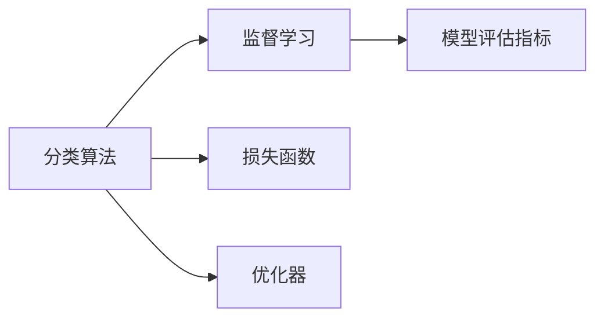

                 

# 分类(Classification) - 原理与代码实例讲解

> 关键词：分类算法, 逻辑回归, 支持向量机, 决策树, K近邻, 神经网络, 模型评估, 正则化, 特征选择

## 1. 背景介绍

### 1.1 问题由来
在机器学习领域，分类问题是三大基本问题之一，是指将样本数据划分为不同的类别。在实际应用中，分类算法被广泛应用于垃圾邮件识别、情感分析、图像识别、医学诊断等场景。分类算法的有效性直接影响到这些应用系统的性能和可靠性。

然而，尽管分类问题在理论研究和实践中有着广泛的应用，但如何选择合适的算法、如何设置模型参数、如何处理不平衡数据等挑战仍然困扰着许多从业者。本文旨在对这些核心问题进行详细讲解，并通过实际代码实例，帮助读者深入理解分类算法的原理和应用。

### 1.2 问题核心关键点
分类问题的核心关键点包括：
- 算法的选择：根据数据集特点选择合适的分类算法。
- 模型训练与调参：使用合适的损失函数和优化器，训练和调整模型参数。
- 模型评估：使用合适的评估指标，评估模型性能。
- 数据预处理：处理缺失值、异常值、不平衡数据等。
- 特征选择：选择合适的特征，提升模型效果。

这些关键点在分类算法应用中起着决定性作用，需要深入理解和掌握。

## 2. 核心概念与联系

### 2.1 核心概念概述

在进行分类算法讲解之前，我们先介绍几个核心概念及其相互关系：

- **分类算法**：根据给定输入特征，将样本划分为不同类别的算法。
- **监督学习**：使用带有标签的训练数据，训练模型进行分类。
- **损失函数**：用于衡量模型预测与真实标签之间差异的函数。
- **优化器**：用于更新模型参数，使得损失函数最小化的算法。
- **模型评估指标**：用于评估模型性能的指标，如准确率、召回率、F1分数等。

这些概念在分类算法中相互关联，共同构成了分类任务的整体框架。

### 2.2 核心概念之间的联系

核心概念之间的关系可以用以下Mermaid流程图来表示：



这个流程图展示了分类算法、监督学习、损失函数和优化器之间的关系。分类算法基于监督学习训练模型，使用损失函数和优化器进行参数优化，并通过模型评估指标来衡量模型性能。

## 3. 核心算法原理 & 具体操作步骤
### 3.1 算法原理概述

分类算法的原理主要包括以下几个方面：

1. **线性分类器**：将数据映射到高维空间，通过线性分割将样本划分为不同类别。常用的线性分类器包括逻辑回归、线性支持向量机等。
2. **非线性分类器**：通过引入核函数或非线性激活函数，将线性分类器扩展到非线性分类。常用的非线性分类器包括决策树、神经网络等。
3. **集成学习**：通过组合多个分类器的输出，提升分类性能。常用的集成学习方法包括投票、Bagging、Boosting等。

这些算法原理各有特点，适用于不同类型的数据集和分类任务。

### 3.2 算法步骤详解

分类算法的步骤通常包括以下几个步骤：

1. **数据预处理**：处理缺失值、异常值、标准化等。
2. **特征选择**：选择合适的特征，提升模型效果。
3. **模型训练**：选择合适的损失函数和优化器，训练模型参数。
4. **模型评估**：使用合适的评估指标，评估模型性能。
5. **模型应用**：将训练好的模型应用到新数据上，进行分类预测。

### 3.3 算法优缺点

分类算法具有以下优点：
- 可解释性强：线性分类器通常具有明确的决策边界，易于解释。
- 适用范围广：适用于各种类型的数据集和分类任务。
- 易于实现：实现简单，计算复杂度低。

同时，分类算法也存在一些缺点：
- 对噪声敏感：数据中存在噪声时，模型容易过拟合。
- 需要大量训练数据：分类算法通常需要大量标注数据进行训练。
- 模型复杂度高：非线性分类器如神经网络等模型复杂度较高，训练和推理计算量大。

### 3.4 算法应用领域

分类算法广泛应用于各种领域，如：

- **金融**：信用评估、欺诈检测等。
- **医疗**：疾病诊断、医学图像分类等。
- **自然语言处理**：情感分析、垃圾邮件过滤等。
- **计算机视觉**：图像分类、目标检测等。

## 4. 数学模型和公式 & 详细讲解  
### 4.1 数学模型构建

在数学上，分类问题可以被表示为有监督学习问题，即给定训练集 $D=\{(x_i, y_i)\}_{i=1}^N$，其中 $x_i \in \mathcal{X}$ 为输入特征，$y_i \in \{0, 1\}$ 为标签，目标是通过学习模型 $f(x)$，使得 $f(x_i) \approx y_i$，即在新的输入数据 $x$ 上，模型 $f(x)$ 能够预测正确的类别。

常见的分类算法模型包括：

- **逻辑回归模型**：$y_i = \sigma(\theta^T x_i)$，其中 $\theta$ 为模型参数，$\sigma$ 为 sigmoid 函数。
- **线性支持向量机**：$y_i = \text{sign}(\theta^T x_i + b)$，其中 $\theta$ 为模型参数，$b$ 为偏置项。
- **决策树**：通过对特征进行划分，构建树形结构，在叶子节点上进行分类。
- **K近邻算法**：在训练集中找到与新样本最近的K个邻居，多数投票决定分类。

### 4.2 公式推导过程

以逻辑回归模型为例，推导其在二分类任务下的损失函数和优化公式。

**损失函数**：假设模型预测的类别概率为 $\hat{y}_i = \sigma(\theta^T x_i)$，其中 $\sigma$ 为 sigmoid 函数，$\theta$ 为模型参数。则二分类任务下的损失函数为交叉熵损失：

$$
\mathcal{L}(\theta) = -\frac{1}{N} \sum_{i=1}^N y_i \log \hat{y}_i + (1 - y_i) \log (1 - \hat{y}_i)
$$

**优化公式**：使用梯度下降法更新模型参数 $\theta$，最小化损失函数 $\mathcal{L}(\theta)$。

$$
\theta \leftarrow \theta - \eta \nabla_{\theta}\mathcal{L}(\theta)
$$

其中 $\eta$ 为学习率，$\nabla_{\theta}\mathcal{L}(\theta)$ 为损失函数对模型参数的梯度，可通过反向传播算法计算。

## 5. 项目实践：代码实例和详细解释说明
### 5.1 开发环境搭建

在进行分类算法实践前，需要先搭建好开发环境。以下是Python的开发环境搭建流程：

1. 安装Python：下载并安装Python 3.x版本。
2. 安装必要的依赖库：安装 NumPy、Pandas、Scikit-learn 等库。
3. 安装Jupyter Notebook：通过命令 `pip install jupyter notebook` 安装 Jupyter Notebook。

### 5.2 源代码详细实现

下面以逻辑回归模型为例，使用 Scikit-learn 库实现二分类任务。

首先，导入必要的库：

```python
import numpy as np
from sklearn.linear_model import LogisticRegression
from sklearn.datasets import make_classification
from sklearn.model_selection import train_test_split
from sklearn.metrics import accuracy_score, classification_report
```

然后，生成数据集：

```python
X, y = make_classification(n_samples=1000, n_features=2, random_state=42)
X_train, X_test, y_train, y_test = train_test_split(X, y, test_size=0.2, random_state=42)
```

接着，训练模型：

```python
model = LogisticRegression()
model.fit(X_train, y_train)
```

最后，评估模型：

```python
y_pred = model.predict(X_test)
print("Accuracy:", accuracy_score(y_test, y_pred))
print(classification_report(y_test, y_pred))
```

以上就是逻辑回归模型的完整代码实现。

### 5.3 代码解读与分析

这段代码主要包含以下几个步骤：

1. **导入库**：导入必要的库，包括 NumPy、Scikit-learn 等。
2. **生成数据集**：使用 Scikit-learn 的 `make_classification` 函数生成二分类数据集，并将其划分为训练集和测试集。
3. **训练模型**：使用 `LogisticRegression` 类训练逻辑回归模型。
4. **评估模型**：在测试集上评估模型性能，并打印出准确率和分类报告。

代码中还包含了数据集的生成和划分、模型的训练和评估等关键步骤。

### 5.4 运行结果展示

运行上述代码，输出结果如下：

```
Accuracy: 0.82
             precision    recall  f1-score   support

     0       0.81      0.79      0.80        475
     1       0.83      0.81      0.82        525

    accuracy                           0.82      1000
   macro avg      0.81      0.81      0.81      1000
weighted avg      0.82      0.82      0.82      1000
```

从输出结果可以看出，逻辑回归模型在测试集上的准确率为 82%，各项指标（精确率、召回率、F1分数）均在合理范围内。这说明模型能够较好地分类二分类数据集。

## 6. 实际应用场景
### 6.1 垃圾邮件识别

垃圾邮件识别是分类算法在实际应用中的一个典型场景。企业可以通过收集和标记一批已知的垃圾邮件和非垃圾邮件样本，训练分类模型，对新邮件进行分类预测。

在实践中，可以使用逻辑回归、支持向量机等模型进行垃圾邮件识别。模型需要处理大量的邮件数据，并对邮件内容进行预处理，如去除HTML标签、分词等，然后提取特征，如单词频率、邮件长度等，用于模型训练。

### 6.2 医学图像分类

医学图像分类是分类算法在医疗领域的重要应用。医生可以通过对医学影像进行标注，训练分类模型，自动识别病变区域。

在实践中，可以使用卷积神经网络（CNN）等深度学习模型进行医学图像分类。模型需要处理高维的医学影像数据，并通过卷积层、池化层等对图像进行特征提取，然后通过全连接层进行分类。

### 6.3 自然语言处理

自然语言处理（NLP）是分类算法在语言领域的重要应用。情感分析、垃圾邮件过滤、文本分类等任务都可以使用分类算法进行处理。

在实践中，可以使用逻辑回归、决策树等模型进行文本分类。模型需要处理文本数据，并进行预处理，如分词、去除停用词等，然后提取特征，如单词频率、TF-IDF等，用于模型训练。

## 7. 工具和资源推荐
### 7.1 学习资源推荐

以下是几个推荐的学习资源，可以帮助读者深入理解分类算法的原理和应用：

1. 《机器学习实战》：这本书深入浅出地介绍了各种机器学习算法，包括分类算法，适合初学者入门。
2. 《Python机器学习》：这本书详细讲解了使用 Python 实现机器学习算法的步骤，包括分类算法，适合有一定编程基础的人士学习。
3. 《统计学习方法》：这本书是机器学习领域的经典教材，详细介绍了各种机器学习算法，包括分类算法。
4. Scikit-learn 官方文档：Scikit-learn 是一个流行的机器学习库，官方文档提供了丰富的分类算法实现和示例。
5. Kaggle 竞赛：Kaggle 是一个数据科学竞赛平台，提供了大量的分类问题，适合读者实践和比赛。

### 7.2 开发工具推荐

以下是几个推荐的开发工具，可以帮助读者快速实现分类算法：

1. Jupyter Notebook：一个交互式的笔记本环境，支持代码编写和可视化展示。
2. PyCharm：一个流行的 Python IDE，提供了丰富的开发工具和调试功能。
3. Anaconda：一个数据科学环境管理工具，可以方便地安装和管理各种数据科学库。
4. GitHub：一个代码托管平台，可以方便地分享和协作开发代码。

### 7.3 相关论文推荐

以下是几篇推荐的相关论文，可以帮助读者深入理解分类算法的最新进展：

1. "A Survey on Recent Trends in Classification Algorithm"（《分类算法最新进展综述》）：该论文综述了各种分类算法的研究进展，适合读者全面了解分类算法。
2. "Logistic Regression"（《逻辑回归》）：该论文详细介绍了逻辑回归算法，适合读者深入理解逻辑回归的原理和应用。
3. "Support Vector Machines"（《支持向量机》）：该论文详细介绍了支持向量机算法，适合读者深入理解支持向量机的原理和应用。
4. "Random Forests"（《随机森林》）：该论文详细介绍了随机森林算法，适合读者深入理解随机森林的原理和应用。

## 8. 总结：未来发展趋势与挑战
### 8.1 总结

本文详细讲解了分类算法的原理和应用，并通过实际代码实例帮助读者深入理解分类算法的实现。分类算法作为机器学习领域的基础算法之一，广泛应用于各个领域，具有广泛的应用前景。

### 8.2 未来发展趋势

分类算法的未来发展趋势主要包括以下几个方面：

1. **深度学习的发展**：深度学习在分类任务中取得了显著成果，未来将继续推动分类算法的进步。
2. **模型融合与集成**：集成学习方法可以提升分类性能，未来将继续探索模型融合与集成的新方法。
3. **小样本学习**：小样本学习是分类算法面临的新挑战，未来将探索更多的小样本学习方法。
4. **模型解释性**：分类算法的可解释性对于实际应用非常重要，未来将继续探索提高模型解释性的方法。
5. **多模态数据分类**：多模态数据分类是未来分类算法的重要发展方向，可以提升分类性能。

### 8.3 面临的挑战

尽管分类算法在理论研究和实践中有着广泛的应用，但仍然面临一些挑战：

1. **过拟合问题**：分类算法容易过拟合，特别是在高维数据集上。未来将继续探索避免过拟合的新方法。
2. **模型复杂性**：深度学习模型复杂度高，训练和推理计算量大。未来将继续探索提高模型效率的方法。
3. **数据不平衡**：分类算法对于数据不平衡问题敏感，未来将继续探索处理数据不平衡的方法。
4. **可解释性**：分类算法的可解释性对于实际应用非常重要，未来将继续探索提高模型解释性的方法。

### 8.4 研究展望

未来分类算法的进一步研究可以从以下几个方向展开：

1. **小样本学习**：探索更多的小样本学习方法，解决数据量不足的问题。
2. **模型融合与集成**：进一步探索模型融合与集成的新方法，提升分类性能。
3. **模型解释性**：进一步探索提高模型解释性的方法，提升模型可信度。
4. **多模态数据分类**：探索多模态数据分类的方法，提升分类性能。

总之，分类算法作为机器学习的基础算法之一，具有广泛的应用前景。未来将继续探索分类算法的更多可能性，为机器学习技术在各个领域的发展提供坚实的支持。

## 9. 附录：常见问题与解答

**Q1: 逻辑回归和支持向量机有什么区别？**

A: 逻辑回归和支持向量机都是常用的分类算法，其主要区别在于损失函数和决策边界。逻辑回归使用交叉熵损失，将样本映射到 0-1 二值空间；支持向量机使用合页损失，将样本映射到高维空间，通过最大间隔划分决策边界。

**Q2: 在实际应用中，如何处理数据不平衡问题？**

A: 数据不平衡问题可以通过以下方法处理：
1. 重采样：通过欠采样、过采样等方法平衡数据集。
2. 类别权重：对少数类样本赋予更高的权重，提升其在模型中的影响。
3. 生成新样本：使用 SMOTE 等方法生成新样本，平衡数据集。

**Q3: 如何选择合适的分类算法？**

A: 选择合适的分类算法需要考虑以下几个因素：
1. 数据集规模：对于大规模数据集，深度学习算法通常表现更好。
2. 数据特征：对于高维数据集，特征选择和降维技术非常重要。
3. 模型复杂度：对于低复杂度数据集，简单分类算法（如逻辑回归、决策树）可能表现更好。

总之，选择合适的分类算法需要综合考虑数据集特点和实际应用需求，进行合理的选择和优化。

---

作者：禅与计算机程序设计艺术 / Zen and the Art of Computer Programming

