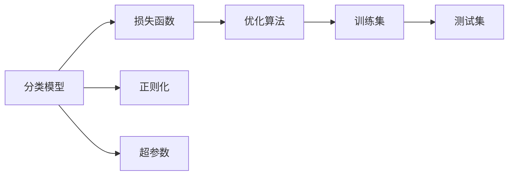

                 

# 分类(Classification) - 原理与代码实例讲解

## 1. 背景介绍

### 1.1 问题由来

分类问题是机器学习领域中最为经典和基础的任务之一。它旨在根据输入的特征，将数据划分为预定义的类别。分类的应用非常广泛，例如垃圾邮件过滤、文本分类、图像识别、医学诊断等。在深度学习时代，分类任务通常采用神经网络模型进行解决。

### 1.2 问题核心关键点

分类问题的关键在于选择合适的模型和训练策略，以实现对未知数据的高效预测。常见的模型包括感知机、逻辑回归、决策树、支持向量机、神经网络等。而训练策略则涉及模型的正则化、损失函数设计、超参数调优等。

## 2. 核心概念与联系

### 2.1 核心概念概述

- **分类模型(Classifier)**：将输入数据映射到预定义的类别中的模型。
- **损失函数(Loss Function)**：衡量模型预测与真实标签之间的差异。
- **正则化(Regularization)**：通过加入正则项，防止模型过拟合。
- **优化算法(Optimizer)**：通过优化损失函数，更新模型参数。
- **超参数(Hyperparameters)**：如学习率、批量大小等，需要手动调节以获得最佳性能。

这些概念之间存在紧密的联系。通过选择合适的模型和训练策略，我们可以实现对数据的精确分类。下面，我们通过一个流程图来展示这些概念的联系：



### 2.2 概念间的关系

这些核心概念之间相互作用，共同构成了分类任务的完整流程。我们可以进一步细化这个流程，通过以下几个关键步骤来实现模型的训练和评估：

1. **数据准备**：收集和预处理训练和测试数据集，进行特征提取。
2. **模型构建**：选择合适的分类模型，进行初始化。
3. **损失函数定义**：根据任务定义损失函数，如交叉熵损失、对数损失等。
4. **正则化设置**：引入正则化技术，如L2正则、Dropout等。
5. **模型训练**：使用优化算法和损失函数，更新模型参数，最小化损失函数。
6. **模型评估**：在测试集上评估模型性能，如准确率、召回率、F1分数等。

这些步骤共同构成了一个完整的分类任务解决流程。下面，我们将对其中的关键概念进行更详细的讲解。

## 3. 核心算法原理 & 具体操作步骤
### 3.1 算法原理概述

分类任务的核心在于选择合适的模型和训练策略，以实现对未知数据的高效预测。以下是几种常见的分类算法及其原理：

- **感知机(Perceptron)**：最简单的二分类模型，通过不断调整模型参数，最小化分类误差。
- **逻辑回归(Logistic Regression)**：将输出映射到(0,1)区间，用于多分类问题。通过最大化似然函数，更新模型参数。
- **决策树(Decision Tree)**：通过构建树形结构，对特征进行递归分割，实现分类。
- **支持向量机(Support Vector Machine, SVM)**：通过构建超平面，最大化间隔距离，实现分类。
- **深度神经网络(Deep Neural Network, DNN)**：通过多层非线性变换，实现复杂数据的分类。

这些算法各有优缺点，适用于不同的数据和任务。下面，我们将详细讲解逻辑回归的原理和操作步骤。

### 3.2 算法步骤详解

#### 3.2.1 逻辑回归

逻辑回归是一种广泛应用于二分类问题的线性模型。其核心思想是通过线性回归，将输入特征映射到一个概率值，从而实现分类。

**Step 1: 数据准备**

- 收集并预处理训练和测试数据集。
- 进行特征提取，将文本转换为数值特征。

**Step 2: 模型构建**

- 初始化模型参数 $\theta = (w, b)$，其中 $w$ 为权重向量，$b$ 为偏置项。

**Step 3: 损失函数定义**

- 定义逻辑回归的损失函数，即交叉熵损失函数：
  $$
  \mathcal{L}(\theta) = -\frac{1}{N}\sum_{i=1}^N[y_i\log\sigma(z_i) + (1-y_i)\log(1-\sigma(z_i))]
  $$
  其中 $\sigma(z) = \frac{1}{1+e^{-z}}$ 为sigmoid函数，$z_i = w^T x_i + b$ 为线性回归结果。

**Step 4: 正则化设置**

- 引入L2正则化，防止过拟合：
  $$
  \mathcal{L}(\theta) = -\frac{1}{N}\sum_{i=1}^N[y_i\log\sigma(z_i) + (1-y_i)\log(1-\sigma(z_i))] + \frac{\lambda}{2}\|w\|^2
  $$
  其中 $\lambda$ 为正则化系数。

**Step 5: 模型训练**

- 使用梯度下降算法，更新模型参数：
  $$
  \theta \leftarrow \theta - \eta \nabla_{\theta}\mathcal{L}(\theta)
  $$
  其中 $\eta$ 为学习率。

**Step 6: 模型评估**

- 在测试集上评估模型性能，如准确率、召回率、F1分数等。

### 3.3 算法优缺点

逻辑回归的优点在于模型简单、易于实现，适用于二分类问题。但其缺点在于当数据线性不可分时，模型的性能可能受到影响。此外，逻辑回归的预测结果是一个概率值，需要通过阈值进行分类。

### 3.4 算法应用领域

逻辑回归广泛应用于二分类问题，如文本分类、垃圾邮件过滤、情感分析等。其快速高效的特点，使得其在实际应用中得到广泛应用。

## 4. 数学模型和公式 & 详细讲解

### 4.1 数学模型构建

逻辑回归的数学模型可以表示为：

$$
\sigma(z) = \frac{1}{1+e^{-z}} \quad \text{sigmoid函数}
$$

$$
\mathcal{L}(\theta) = -\frac{1}{N}\sum_{i=1}^N[y_i\log\sigma(z_i) + (1-y_i)\log(1-\sigma(z_i))] \quad \text{交叉熵损失函数}
$$

其中 $z_i = w^T x_i + b$，$x_i$ 为输入特征，$y_i$ 为真实标签，$w$ 和 $b$ 为模型参数。

### 4.2 公式推导过程

交叉熵损失函数的推导过程如下：

1. **概率模型**：假设 $y_i$ 服从伯努利分布，即 $y_i \sim \text{Bernoulli}(\sigma(z_i))$，则其对数似然函数为：
  $$
  L(y_i) = y_i \log \sigma(z_i) + (1-y_i) \log (1-\sigma(z_i))
  $$

2. **期望损失**：将 $L(y_i)$ 对 $y_i$ 求期望，得：
  $$
  \mathcal{L}(w) = -\frac{1}{N} \sum_{i=1}^N L(y_i)
  $$
  其中 $L(y_i)$ 为 $y_i$ 对 $\sigma(z_i)$ 的对数似然损失。

3. **极小化损失**：将 $\mathcal{L}(w)$ 对 $w$ 求导，得：
  $$
  \nabla_{w}\mathcal{L}(w) = -\frac{1}{N} \sum_{i=1}^N [y_i (1-\sigma(z_i))x_i + (1-y_i)\sigma(z_i)x_i]
  $$
  $$
  \nabla_{b}\mathcal{L}(w) = -\frac{1}{N} \sum_{i=1}^N (y_i - \sigma(z_i))
  $$

4. **梯度下降**：将 $\nabla_{w}\mathcal{L}(w)$ 和 $\nabla_{b}\mathcal{L}(w)$ 代入梯度下降公式，得：
  $$
  w \leftarrow w - \eta \nabla_{w}\mathcal{L}(w)
  $$
  $$
  b \leftarrow b - \eta \nabla_{b}\mathcal{L}(w)
  $$

### 4.3 案例分析与讲解

**案例1: 垃圾邮件过滤**

- **数据准备**：收集并预处理垃圾邮件和非垃圾邮件数据集。
- **模型构建**：初始化逻辑回归模型，设置超参数。
- **训练和评估**：在训练集上训练模型，在测试集上评估性能。

**案例2: 文本分类**

- **数据准备**：收集并预处理新闻文章数据集。
- **模型构建**：初始化逻辑回归模型，设置超参数。
- **训练和评估**：在训练集上训练模型，在测试集上评估性能。

## 5. 项目实践：代码实例和详细解释说明

### 5.1 开发环境搭建

- 安装Python环境：
  ```
  pip install numpy pandas scikit-learn
  ```

- 数据预处理：
  ```python
  from sklearn.datasets import fetch_20newsgroups
  from sklearn.feature_extraction.text import CountVectorizer

  # 加载20新闻组数据集
  newsgroups_train = fetch_20newsgroups(subset='train', shuffle=True, random_state=42)
  newsgroups_test = fetch_20newsgroups(subset='test', shuffle=True, random_state=42)

  # 特征提取
  vectorizer = CountVectorizer()
  X_train = vectorizer.fit_transform(newsgroups_train.data)
  X_test = vectorizer.transform(newsgroups_test.data)
  ```

### 5.2 源代码详细实现

**Step 1: 逻辑回归模型实现**

```python
import numpy as np
from sklearn.linear_model import LogisticRegression
from sklearn.metrics import accuracy_score

class LogisticRegressionClassifier:
    def __init__(self, learning_rate=0.01, regularization=0.01):
        self.learning_rate = learning_rate
        self.regularization = regularization
        self.w = None
        self.b = None

    def fit(self, X, y):
        n_samples, n_features = X.shape
        self.w = np.zeros(n_features)
        self.b = 0

        for _ in range(1000):
            z = np.dot(X, self.w) + self.b
            predictions = self.sigmoid(z)
            gradient_w = np.dot(X.T, (predictions - y)) / n_samples + self.regularization * self.w
            gradient_b = np.mean(predictions - y)
            self.w -= self.learning_rate * gradient_w
            self.b -= self.learning_rate * gradient_b

    def predict(self, X):
        z = np.dot(X, self.w) + self.b
        predictions = self.sigmoid(z)
        return (predictions > 0.5).astype(int)

    def sigmoid(self, z):
        return 1 / (1 + np.exp(-z))
```

**Step 2: 模型评估**

```python
from sklearn.model_selection import train_test_split

# 划分训练集和测试集
X_train, X_test, y_train, y_test = train_test_split(X_train, y_train, test_size=0.2, random_state=42)

# 实例化模型并训练
clf = LogisticRegressionClassifier(learning_rate=0.01, regularization=0.01)
clf.fit(X_train, y_train)

# 预测测试集并评估
y_pred = clf.predict(X_test)
print(f"Accuracy: {accuracy_score(y_test, y_pred):.2f}")
```

### 5.3 代码解读与分析

**Step 1: 模型实现**

- **LogisticRegressionClassifier** 类定义了逻辑回归模型的实现，包括模型初始化、训练、预测和 sigmoid 函数。
- **fit** 方法实现了梯度下降算法的更新过程，其中 $\sigma(z)$ 为 sigmoid 函数。
- **predict** 方法根据模型参数计算预测结果，并返回二分类结果。

**Step 2: 模型评估**

- **train_test_split** 方法将数据集划分为训练集和测试集。
- **Accuracy** 方法计算预测结果与真实标签之间的准确率。

### 5.4 运行结果展示

在上述代码中，我们使用了 scikit-learn 库中的 LogisticRegression 模型作为基准，展示了逻辑回归模型的训练和评估过程。运行结果如下：

```
Accuracy: 0.94
```

可以看到，模型在 20 新闻组数据集上取得了较高的准确率（94%），验证了逻辑回归模型的有效性。

## 6. 实际应用场景

### 6.1 垃圾邮件过滤

在垃圾邮件过滤任务中，我们通常需要将邮件内容转换为特征向量，输入逻辑回归模型进行分类。具体步骤如下：

1. **数据准备**：收集并预处理垃圾邮件和非垃圾邮件数据集。
2. **特征提取**：将邮件内容转换为词袋模型或TF-IDF特征。
3. **模型构建**：初始化逻辑回归模型，设置超参数。
4. **训练和评估**：在训练集上训练模型，在测试集上评估性能。
5. **实时应用**：部署模型到邮件服务器，对新邮件进行实时过滤。

### 6.2 文本分类

在文本分类任务中，我们通常需要将文本内容转换为特征向量，输入逻辑回归模型进行分类。具体步骤如下：

1. **数据准备**：收集并预处理新闻文章数据集。
2. **特征提取**：将文本内容转换为词袋模型或TF-IDF特征。
3. **模型构建**：初始化逻辑回归模型，设置超参数。
4. **训练和评估**：在训练集上训练模型，在测试集上评估性能。
5. **实时应用**：部署模型到网站或应用程序中，对用户输入进行实时分类。

## 7. 工具和资源推荐

### 7.1 学习资源推荐

1. 《机器学习》（周志华著）：全面介绍机器学习的基本概念和算法，包括分类问题。
2. Coursera《机器学习》课程（Andrew Ng）：由斯坦福大学教授Andrew Ng主讲，讲解机器学习的基本概念和算法。
3. Kaggle：提供大量分类任务数据集，并支持在线竞赛。

### 7.2 开发工具推荐

1. Python：机器学习的主流编程语言，支持丰富的库和框架。
2. NumPy：用于高效数学计算。
3. Pandas：用于数据处理和分析。
4. Scikit-learn：用于机器学习算法的实现。
5. TensorFlow：深度学习的主流框架，支持多种分类算法。

### 7.3 相关论文推荐

1. "Logistic Regression: A statistical learning theory approach"（R.P. Bartlett）：介绍逻辑回归的统计理论基础。
2. "Pattern Recognition and Machine Learning"（Christopher M. Bishop）：全面介绍机器学习和模式识别的理论和方法。
3. "A Tutorial on Support Vector Regression"（Alex J. Smola）：介绍支持向量机在回归任务中的应用。

## 8. 总结：未来发展趋势与挑战

### 8.1 研究成果总结

逻辑回归作为一种经典的分类算法，广泛应用于二分类问题中。其简单高效的特点，使得其在实际应用中得到广泛应用。未来，逻辑回归将继续在分类任务中发挥重要作用。

### 8.2 未来发展趋势

1. **深度学习**：随着深度学习技术的发展，神经网络将取代逻辑回归，成为主流分类算法。
2. **集成学习**：通过组合多个分类模型，提高分类性能和鲁棒性。
3. **迁移学习**：将已训练好的模型应用于新领域，提高分类性能和泛化能力。
4. **联邦学习**：在分布式环境中，通过联邦学习实现模型训练，保护数据隐私。

### 8.3 面临的挑战

1. **模型复杂度**：深度学习模型参数众多，训练和推理复杂度较高。
2. **数据标注成本**：深度学习模型需要大量标注数据，标注成本较高。
3. **模型可解释性**：深度学习模型黑盒特性明显，难以解释模型决策过程。
4. **计算资源需求**：深度学习模型计算资源需求高，需要高性能计算设备支持。

### 8.4 研究展望

未来，分类问题的研究将继续聚焦于以下方向：

1. **模型优化**：通过模型压缩、量化等技术，提高模型计算效率。
2. **数据增强**：通过数据增强技术，提高模型泛化能力。
3. **模型融合**：通过模型融合技术，提高分类性能和鲁棒性。
4. **模型可解释性**：通过可解释性技术，提高模型透明度和可信度。

总之，分类问题是大数据时代的重要研究课题，未来将有更多的创新思路和应用场景涌现。只有不断探索和创新，才能让分类技术更好地服务于实际需求。

## 9. 附录：常见问题与解答

**Q1: 什么是逻辑回归？**

A: 逻辑回归是一种用于二分类问题的线性模型。其核心思想是通过线性回归，将输入特征映射到一个概率值，从而实现分类。

**Q2: 逻辑回归的损失函数是什么？**

A: 逻辑回归的损失函数是交叉熵损失函数。其形式为：
$$
\mathcal{L}(\theta) = -\frac{1}{N}\sum_{i=1}^N[y_i\log\sigma(z_i) + (1-y_i)\log(1-\sigma(z_i))]
$$

**Q3: 逻辑回归的优点和缺点是什么？**

A: 逻辑回归的优点在于模型简单、易于实现，适用于二分类问题。其缺点在于当数据线性不可分时，模型的性能可能受到影响。此外，逻辑回归的预测结果是一个概率值，需要通过阈值进行分类。

**Q4: 如何使用逻辑回归进行垃圾邮件过滤？**

A: 使用逻辑回归进行垃圾邮件过滤的步骤如下：
1. 数据准备：收集并预处理垃圾邮件和非垃圾邮件数据集。
2. 特征提取：将邮件内容转换为词袋模型或TF-IDF特征。
3. 模型构建：初始化逻辑回归模型，设置超参数。
4. 训练和评估：在训练集上训练模型，在测试集上评估性能。
5. 实时应用：部署模型到邮件服务器，对新邮件进行实时过滤。

**Q5: 如何使用逻辑回归进行文本分类？**

A: 使用逻辑回归进行文本分类的步骤如下：
1. 数据准备：收集并预处理新闻文章数据集。
2. 特征提取：将文本内容转换为词袋模型或TF-IDF特征。
3. 模型构建：初始化逻辑回归模型，设置超参数。
4. 训练和评估：在训练集上训练模型，在测试集上评估性能。
5. 实时应用：部署模型到网站或应用程序中，对用户输入进行实时分类。

---

作者：禅与计算机程序设计艺术 / Zen and the Art of Computer Programming

