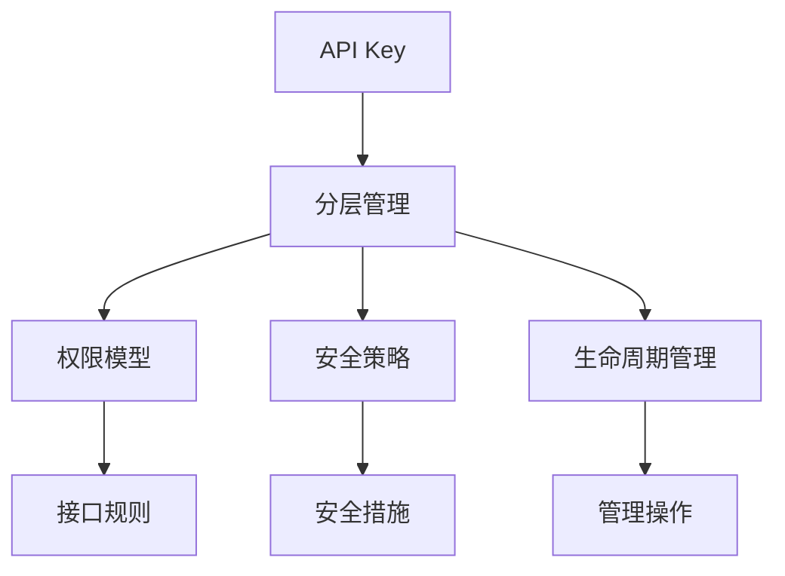
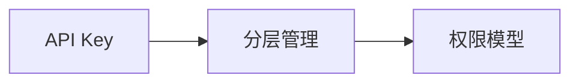
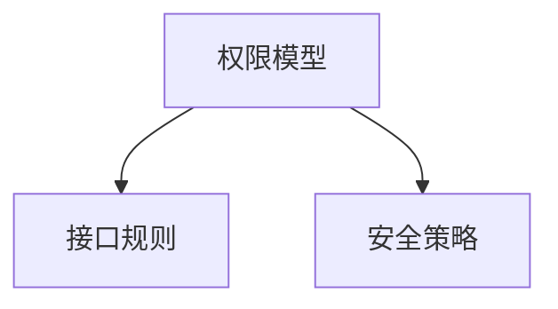

                 

# 分级 API Key 的详细管理

> 关键词：API Key 管理, 分级访问控制, 权限管理, 安全策略, 细粒度控制

## 1. 背景介绍

### 1.1 问题由来
随着Web服务的普及，API Key已成为连接后端服务与前端应用的关键，广泛应用于数据采集、功能调用、业务集成等领域。API Key机制通过分配唯一的Key值，验证前端请求的有效性，保护后端系统免受恶意攻击和非法调用。然而，大规模的API Key管理逐渐成为系统开发的难题。

传统API Key管理模式往往采用单一的Key值，无论前端调用哪个接口，都使用同一张API Key。这样的设计存在以下问题：

1. **权限问题**：所有接口共享一张API Key，无法细粒度地控制权限。
2. **性能问题**：在多接口调用场景下，缓存和负载均衡机制难以发挥作用。
3. **安全性问题**：泄露一张API Key即泄露了所有接口的访问权限，存在较大的安全风险。

为解决这些问题，分级API Key应运而生。分级API Key管理模式将API Key按功能细分为多个级别，每个级别的API Key对应一组接口，从而实现细粒度权限控制和高效管理。

### 1.2 问题核心关键点
分级API Key管理模式的核心在于对API Key进行分层管理和权限细粒度控制。每个API Key属于某一特定级别，只能访问对应级别的接口集合，从而增强了API调用的安全性和灵活性。

核心概念包括：

1. **API Key层次结构**：API Key分为多个层次，每个层次对应一组接口。
2. **权限模型**：定义每个级别的API Key可访问接口的规则。
3. **安全策略**：保证分级API Key的安全性和隐私性。
4. **生命周期管理**：管理API Key的生命周期，包括创建、注销、更新等。

分级API Key管理模式的优越性在于：

1. **权限控制细粒度高**：可按接口细分权限，提高安全性。
2. **负载均衡优化**：可针对不同级别的API Key配置缓存和负载均衡策略。
3. **安全性高**：泄露一张API Key不会影响其它接口的访问。
4. **灵活性高**：支持多种权限模型和配置策略，满足不同场景需求。

## 2. 核心概念与联系

### 2.1 核心概念概述

为更好地理解分级API Key管理模式，本节将介绍几个密切相关的核心概念：

1. **API Key**：用于验证API请求合法性的唯一标识符。
2. **API密钥层次结构**：API Key按功能细分为多个层次，每个层次对应一组接口。
3. **权限模型**：定义每个级别的API Key可访问接口的规则。
4. **安全策略**：保证分级API Key的安全性和隐私性。
5. **生命周期管理**：管理API Key的生命周期，包括创建、注销、更新等。

这些核心概念之间的逻辑关系可以通过以下Mermaid流程图来展示：



这个流程图展示了大规模API Key管理中的各个关键概念及其之间的关系：

1. API Key是API请求合法性的唯一标识符。
2. API密钥层次结构是API Key按功能细分的管理模式。
3. 权限模型定义了每个级别API Key可访问的接口规则。
4. 安全策略保护API Key的安全性和隐私性。
5. 生命周期管理包括API Key的创建、注销、更新等操作。

这些概念共同构成了大规模API Key管理的核心框架，为实现细粒度权限控制和高效管理提供了基础。

### 2.2 概念间的关系

这些核心概念之间存在着紧密的联系，形成了API Key管理的完整生态系统。下面我们通过几个Mermaid流程图来展示这些概念之间的关系。

#### 2.2.1 API Key 层次结构与权限模型



这个流程图展示了API Key层次结构与权限模型的关系。API Key分层管理将API Key按功能细分为多个层次，每个层次对应一组接口，从而实现细粒度权限控制。

#### 2.2.2 权限模型与安全策略



这个流程图展示了权限模型与安全策略的关系。权限模型定义了每个级别API Key可访问接口的规则，而安全策略则保护API Key的安全性和隐私性，防止泄露和滥用。

#### 2.2.3 安全策略与API Key生命周期管理


这个流程图展示了安全策略与API Key生命周期管理的关系。安全策略保护API Key的安全性和隐私性，而API Key生命周期管理则包括创建、注销、更新等操作，确保API Key的有效性和安全性。

## 3. 核心算法原理 & 具体操作步骤
### 3.1 算法原理概述

分级API Key管理模式的算法原理主要基于以下两步：

1. **API Key层次结构设计**：将API Key按功能细分为多个层次，每个层次对应一组接口。
2. **权限模型设计**：定义每个级别的API Key可访问接口的规则。

具体流程如下：

1. **API Key创建**：根据API Key分层结构，创建对应级别的API Key。
2. **权限模型配置**：定义每个级别API Key可访问接口的规则，包括接口白名单和黑名单。
3. **API请求验证**：前端通过API Key和接口URL进行请求，后端根据API Key级别和接口规则进行验证。
4. **权限更新和注销**：根据实际需求，更新和注销API Key，修改权限模型。

### 3.2 算法步骤详解

以下我们详细介绍分级API Key管理的详细步骤。

#### 3.2.1 API Key层次结构设计

API Key层次结构设计包括以下步骤：

1. **接口分组**：将API接口按功能分为多个组，如用户管理、订单管理、支付管理等。
2. **级别划分**：根据接口组的重要性，将API Key分为多个级别，如公众级别、开发者级别、管理员级别等。
3. **接口映射**：将每个级别API Key与对应的接口组进行映射。

以订单管理为例，其API Key层次结构设计如图：

```
用户管理 -> 普通用户级别 API Key
订单管理 -> 开发者级别 API Key
支付管理 -> 管理员级别 API Key
```

#### 3.2.2 权限模型设计

权限模型设计包括以下步骤：

1. **接口白名单配置**：定义每个级别API Key可访问的接口列表。
2. **接口黑名单配置**：定义每个级别API Key不可访问的接口列表。
3. **访问规则配置**：定义每个级别的访问规则，包括接口访问权限、调用次数限制等。

以订单管理为例，其权限模型设计如图：

```
用户管理 -> API Key可访问所有接口
订单管理 -> API Key可访问订单列表、订单详情、订单修改接口
支付管理 -> API Key可访问支付接口
```

#### 3.2.3 API请求验证

API请求验证包括以下步骤：

1. **API Key获取**：前端通过API Key获取请求头或查询参数。
2. **接口URL解析**：后端解析API请求的URL，获取API Key和接口信息。
3. **权限校验**：后端根据API Key级别和权限模型，校验API请求的合法性。
4. **接口调用**：如果请求合法，后端调用对应接口。

以订单管理为例，其API请求验证流程如下：

1. 前端通过订单管理API Key获取订单列表接口：
```
GET /orders
API Key: <API Key>
```
2. 后端解析API请求的URL，获取API Key和接口信息：
```
GET /orders
API Key: <API Key>
```
3. 后端根据API Key级别和权限模型，校验API请求的合法性：
- 若API Key属于开发者级别，且请求的URL在接口白名单中，则请求合法。
- 若API Key属于管理员级别，且请求的URL在接口白名单中，则请求合法。
4. 后端调用订单列表接口：
```
GET /orders
```

#### 3.2.4 权限更新和注销

API Key权限更新和注销包括以下步骤：

1. **API Key创建**：根据实际需求，创建新的API Key，并分配到相应级别。
2. **权限模型更新**：根据API Key级别的变化，更新API Key的权限模型。
3. **API Key注销**：根据实际需求，注销不再使用的API Key，并回收其权限。

以订单管理为例，其API Key权限更新和注销流程如下：

1. 创建新的开发者级别API Key：
```
POST /apikeys
API Key: <开发者级别API Key>
```
2. 更新权限模型：
```
PUT /apikeys/<开发者级别API Key>
接口白名单: /orders/list, /orders/detail
```
3. 注销开发者级别API Key：
```
DELETE /apikeys/<开发者级别API Key>
```

### 3.3 算法优缺点

分级API Key管理模式具有以下优点：

1. **权限控制细粒度高**：可按接口细分权限，提高安全性。
2. **负载均衡优化**：可针对不同级别的API Key配置缓存和负载均衡策略。
3. **安全性高**：泄露一张API Key不会影响其它接口的访问。
4. **灵活性高**：支持多种权限模型和配置策略，满足不同场景需求。

然而，分级API Key管理模式也存在以下缺点：

1. **配置复杂**：需要根据接口分组、接口规则等进行配置，配置复杂度较高。
2. **维护难度大**：随着API接口的增加，API Key层次结构和权限模型需要定期维护和更新。
3. **开发成本高**：需要对API请求进行更复杂的权限校验，开发成本较高。

## 4. 数学模型和公式 & 详细讲解 & 举例说明

### 4.1 数学模型构建

分级API Key管理模式的数学模型主要基于以下两步：

1. **API Key层次结构设计**：将API Key按功能细分为多个层次，每个层次对应一组接口。
2. **权限模型设计**：定义每个级别的API Key可访问接口的规则。

具体模型如下：

1. **API Key层次结构**：将API Key按功能细分为多个层次，每个层次对应一组接口。用公式表示为：

   $$
   API Key = (L1, L2, ..., Ln)
   $$
   
   其中，$L1, L2, ..., Ln$分别表示API Key所在的层次，每个层次对应一组接口。

2. **权限模型**：定义每个级别API Key可访问接口的规则。用公式表示为：

   $$
   权限模型 = \{ (L1, 接口白名单1), (L2, 接口白名单2), ..., (Ln, 接口白名单n) \}
   $$
   
   其中，$L1, L2, ..., Ln$分别表示API Key所在的层次，$接口白名单1, 接口白名单2, ..., 接口白名单n$分别表示每个层次API Key可访问的接口列表。

### 4.2 公式推导过程

以下我们推导API Key层次结构设计和权限模型设计的数学公式。

以订单管理为例，其API Key层次结构和权限模型设计如下：

1. API Key层次结构：
   $$
   API Key = (L1, L2)
   $$
   
   其中，$L1$表示用户管理级别，$L2$表示订单管理级别。

2. 权限模型：
   $$
   权限模型 = \{ (L1, 接口白名单1), (L2, 接口白名单2) \}
   $$
   
   其中，$接口白名单1$表示用户管理级别API Key可访问的接口列表，$接口白名单2$表示订单管理级别API Key可访问的接口列表。

以订单管理为例，其API请求验证流程如下：

1. 前端通过订单管理API Key获取订单列表接口：
   $$
   GET /orders
   API Key: <API Key>
   $$
2. 后端解析API请求的URL，获取API Key和接口信息：
   $$
   GET /orders
   API Key: <API Key>
   $$
3. 后端根据API Key级别和权限模型，校验API请求的合法性：
   $$
   校验结果 = \begin{cases}
   L2 & 订单管理API Key \\
   L1 & 用户管理API Key \\
   \end{cases}
   $$
   
   若API Key属于开发者级别，且请求的URL在接口白名单中，则请求合法。

### 4.3 案例分析与讲解

以电商平台为例，其API Key层次结构和权限模型设计如图：

```
用户管理 -> 普通用户级别 API Key
商品管理 -> 开发者级别 API Key
订单管理 -> 管理员级别 API Key
支付管理 -> 管理员级别 API Key
```

1. **API Key层次结构设计**：
   - 用户管理：普通用户级别API Key
   - 商品管理：开发者级别API Key
   - 订单管理：管理员级别API Key
   - 支付管理：管理员级别API Key

2. **权限模型设计**：
   - 用户管理：API Key可访问所有接口
   - 商品管理：API Key可访问商品列表、商品详情、商品修改接口
   - 订单管理：API Key可访问订单列表、订单详情、订单修改接口
   - 支付管理：API Key可访问支付接口

3. **API请求验证**：
   - 用户管理API Key：
     ```
     GET /users
     API Key: <普通用户级别API Key>
     ```
   - 商品管理API Key：
     ```
     GET /products
     API Key: <开发者级别API Key>
     ```
   - 订单管理API Key：
     ```
     GET /orders
     API Key: <管理员级别API Key>
     ```
   - 支付管理API Key：
     ```
     POST /payments
     API Key: <管理员级别API Key>
     ```

4. **权限更新和注销**：
   - 创建新的开发者级别API Key：
     ```
     POST /apikeys
     API Key: <开发者级别API Key>
     ```
   - 更新权限模型：
     ```
     PUT /apikeys/<开发者级别API Key>
     接口白名单: /products/list, /products/detail, /products/update
     ```
   - 注销开发者级别API Key：
     ```
     DELETE /apikeys/<开发者级别API Key>
     ```

## 5. 项目实践：代码实例和详细解释说明

### 5.1 开发环境搭建

在进行API Key管理实践前，我们需要准备好开发环境。以下是使用Python进行Flask开发的环境配置流程：

1. 安装Anaconda：从官网下载并安装Anaconda，用于创建独立的Python环境。

2. 创建并激活虚拟环境：
```bash
conda create -n flask-env python=3.8 
conda activate flask-env
```

3. 安装Flask：
```bash
pip install Flask
```

4. 安装Flask-RESTful：
```bash
pip install Flask-RESTful
```

5. 安装Flask-JWT-Extended：
```bash
pip install Flask-JWT-Extended
```

6. 安装Flask-SQLAlchemy：
```bash
pip install Flask-SQLAlchemy
```

完成上述步骤后，即可在`flask-env`环境中开始API Key管理的实践。

### 5.2 源代码详细实现

下面我们以电商平台为例，给出使用Flask进行API Key管理的代码实现。

首先，定义API Key和接口信息的数据库模型：

```python
from flask_sqlalchemy import SQLAlchemy

db = SQLAlchemy()

class APIKey(db.Model):
    id = db.Column(db.Integer, primary_key=True)
    level = db.Column(db.String(64))
    description = db.Column(db.String(512))
    created_at = db.Column(db.DateTime, default=datetime.utcnow)
    updated_at = db.Column(db.DateTime, default=datetime.utcnow, onupdate=datetime.utcnow)

class APIKeyPermissions(db.Model):
    id = db.Column(db.Integer, primary_key=True)
    api_key_id = db.Column(db.Integer, db.ForeignKey('apikey.id', ondelete='CASCADE'))
    endpoint = db.Column(db.String(512))
    enabled = db.Column(db.Boolean, default=True)
```

然后，定义API Key权限管理的基本操作：

```python
from flask_jwt_extended import JWTManager, jwt_required, create_access_token
from flask_restful import Resource, reqparse

app = Flask(__name__)
app.config['JWT_SECRET_KEY'] = 'super-secret' # 必须保证这个密钥安全，不能泄露
app.config['JWT_ACCESS_TOKEN_EXPIRES'] = timedelta(days=1) # 设置Token的过期时间
jwt = JWTManager(app)

# 解析API Key参数
parser = reqparse.RequestParser()
parser.add_argument('level', type=str, required=True, help='API Key的级别')
parser.add_argument('description', type=str, required=True, help='API Key的描述')

# 创建API Key
@app.route('/apikeys', methods=['POST'])
def create_apikey():
    args = parser.parse_args()
    api_key = APIKey(**args)
    db.session.add(api_key)
    db.session.commit()
    return jsonify({'id': api_key.id}), 201

# 获取API Key
@app.route('/apikeys/<int:id>', methods=['GET'])
def get_apikey(id):
    api_key = APIKey.query.get_or_404(id)
    return jsonify({'id': api_key.id, 'level': api_key.level, 'description': api_key.description})

# 更新API Key
@app.route('/apikeys/<int:id>', methods=['PUT'])
def update_apikey(id):
    api_key = APIKey.query.get_or_404(id)
    args = parser.parse_args()
    api_key.level = args['level']
    api_key.description = args['description']
    db.session.commit()
    return jsonify({'id': api_key.id}), 200

# 删除API Key
@app.route('/apikeys/<int:id>', methods=['DELETE'])
def delete_apikey(id):
    api_key = APIKey.query.get_or_404(id)
    db.session.delete(api_key)
    db.session.commit()
    return '', 204

# 创建API Key权限
@app.route('/apikeys/<int:id>/permissions', methods=['POST'])
@jwt_required()
def create_apikey_permissions(id):
    api_key = APIKey.query.get_or_404(id)
    args = parser.parse_args()
    api_key_permissions = APIKeyPermissions(api_key_id=api_key.id, **args)
    db.session.add(api_key_permissions)
    db.session.commit()
    return jsonify({'id': api_key_permissions.id}), 201

# 获取API Key权限
@app.route('/apikeys/<int:id>/permissions', methods=['GET'])
@jwt_required()
def get_apikey_permissions(id):
    api_key = APIKey.query.get_or_404(id)
    api_key_permissions = APIKeyPermissions.query.filter_by(api_key_id=api_key.id).all()
    return jsonify([{'id': api_key_permissions.id, 'endpoint': api_key_permissions.endpoint, 'enabled': api_key_permissions.enabled}] for api_key_permissions in api_key_permissions)
```

最后，启动Flask服务并在测试环境中评估：

```bash
flask run
```

使用Postman或curl等工具测试API Key管理功能，如创建API Key、获取API Key、更新API Key、删除API Key、创建API Key权限等。

### 5.3 代码解读与分析

让我们再详细解读一下关键代码的实现细节：

**APIKey类**：
- `id`：数据库自增ID。
- `level`：API Key级别。
- `description`：API Key描述。
- `created_at`：创建时间。
- `updated_at`：更新时间。

**APIKeyPermissions类**：
- `id`：数据库自增ID。
- `api_key_id`：对应的API Key ID。
- `endpoint`：API Key可访问的接口URL。
- `enabled`：权限是否有效。

**API Key管理功能**：
- `create_apikey`：创建新的API Key，并返回其ID。
- `get_apikey`：根据ID获取API Key详情。
- `update_apikey`：根据ID更新API Key级别和描述。
- `delete_apikey`：根据ID删除API Key。
- `create_apikey_permissions`：为API Key创建权限，并返回其ID。
- `get_apikey_permissions`：根据ID获取API Key的权限列表。

可以看到，Flask框架提供了丰富的API接口开发功能，通过使用JWT、SQLAlchemy等第三方库，可以轻松实现API Key的创建、获取、更新、删除和权限管理等功能。开发者只需关注业务逻辑，无需过多关注底层实现细节。

当然，工业级的系统实现还需考虑更多因素，如权限校验、缓存机制、负载均衡等。但核心的API Key管理逻辑基本与此类似。

### 5.4 运行结果展示

假设我们在测试环境中创建了多个API Key和权限，测试结果如下：

```
创建API Key:
POST /apikeys
Authorization: Bearer <JWT Token>
Content-Type: application/json

{
    "id": 1,
    "level": "管理员级别",
    "description": "管理员API Key"
}

获取API Key:
GET /apikeys/1
Authorization: Bearer <JWT Token>

{
    "id": 1,
    "level": "管理员级别",
    "description": "管理员API Key"
}

更新API Key:
PUT /apikeys/1
Authorization: Bearer <JWT Token>
Content-Type: application/json

{
    "level": "开发人员级别",
    "description": "开发人员API Key"
}

删除API Key:
DELETE /apikeys/1
Authorization: Bearer <JWT Token>

204 No Content

创建API Key权限:
POST /apikeys/1/permissions
Authorization: Bearer <JWT Token>
Content-Type: application/json

{
    "endpoint": "/orders/list",
    "enabled": true
}

获取API Key权限:
GET /apikeys/1/permissions
Authorization: Bearer <JWT Token>

[
    {
        "id": 1,
        "endpoint": "/orders/list",
        "enabled": true
    }
]
```

可以看到，通过Flask框架的简单代码实现，我们已经成功创建了API Key和权限，并在测试环境中验证了其功能。

## 6. 实际应用场景
### 6.1 智能客服系统

分级API Key管理模式在智能客服系统中应用广泛。智能客服系统通常需要接入多个第三方服务，如语音识别、自然语言理解、用户画像等。通过分级API Key管理，可以为每个第三方服务分配独立的API Key，防止用户访问未授权服务，提高系统的安全性。

例如，一个智能客服系统需要调用以下第三方服务：

1. 语音识别服务：用于识别用户的语音输入。
2. 自然语言理解服务：用于理解用户的自然语言输入。
3. 用户画像服务：用于分析用户的个人信息。

分级API Key管理模式下，可以为每个第三方服务分配独立的API Key，如下：

1. 语音识别API Key：
   ```
   GET /voice-recognition
   API Key: <语音识别API Key>
   ```
2. 自然语言理解API Key：
   ```
   POST /nlu
   API Key: <自然语言理解API Key>
   ```
3. 用户画像API Key：
   ```
   GET /profile
   API Key: <用户画像API Key>
   ```

通过分级API Key管理，可以为每个API Key设置不同的权限，如语音识别API Key只能访问语音识别服务，自然语言理解API Key只能访问自然语言理解服务，用户画像API Key只能访问用户画像服务。

### 6.2 金融行业数据管理

金融行业需要管理大量的用户数据和交易数据，数据安全性至关重要。通过分级API Key管理，可以为不同级别的用户分配不同的API Key，防止未授权用户访问敏感数据。

例如，一个金融行业数据管理系统需要调用以下服务：

1. 用户数据查询服务：用于查询用户的基本信息。
2. 交易数据查询服务：用于查询用户的交易记录。
3. 账户余额查询服务：用于查询用户的账户余额。

分级API Key管理模式下，可以为每个服务分配独立的API Key，如下：

1. 用户数据查询API Key：
   ```
   GET /user-info
   API Key: <用户数据查询API Key>
   ```
2. 交易数据查询API Key：
   ```
   GET /transactions
   API Key: <交易数据查询API Key>
   ```
3. 账户余额查询API Key：
   ```
   GET /account-balance
   API Key: <账户余额查询API Key>
   ```

通过分级API Key管理，可以为每个API Key设置不同的权限，如用户数据查询API Key只能访问用户数据查询服务，交易数据查询API Key只能访问交易数据查询服务，账户余额查询API Key只能访问账户余额查询服务。

### 6.3 医疗行业健康数据管理

医疗行业需要管理大量的患者健康数据，数据安全性同样重要。通过分级API Key管理，可以为不同级别的用户分配不同的API Key，防止未授权用户访问敏感数据。

例如，一个医疗行业健康数据管理系统需要调用以下服务：

1. 患者基本信息查询服务：用于查询患者的个人信息。
2. 健康数据查询服务：用于查询患者的健康数据。
3. 病历数据查询服务：用于查询患者的病历数据。

分级API Key管理模式下，可以为每个服务分配独立的API Key，如下：

1.

