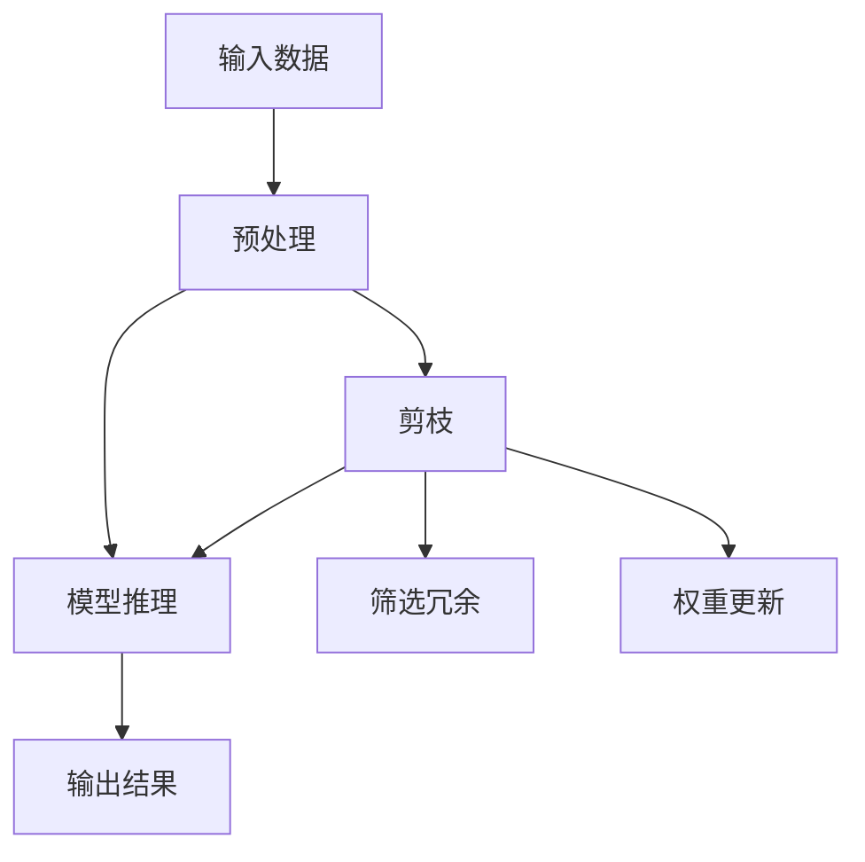

                 

# 剪枝技术在可穿戴设备AI中的实践

## 1. 背景介绍

随着物联网和可穿戴设备的普及，越来越多的智能设备被部署到用户的日常生活场景中，从智能手表、智能眼镜到健康监测器、运动手环，各类设备的应用场景逐渐增多。然而，尽管这些设备具有便携性和易用性，但它们在资源受限、计算能力有限的条件下，仍然面临着计算效率和数据处理能力不足的挑战。针对这一问题，本文将重点介绍剪枝技术在可穿戴设备AI中的应用，以优化资源利用率，提升设备性能，实现高效且智能的AI推理。

## 2. 核心概念与联系

### 2.1 核心概念概述

剪枝（Pruning）是一种模型压缩技术，通过删除冗余权重或神经元，减少模型参数，从而降低模型大小、计算量、内存占用等。在可穿戴设备AI中，由于设备硬件资源有限，剪枝技术可以显著优化模型的推理速度和内存占用，提高设备的计算效率和用户体验。

### 2.2 核心概念原理和架构的 Mermaid 流程图



这个流程图展示了剪枝技术在可穿戴设备AI推理中的应用流程。具体步骤如下：
1. 输入数据经过预处理后，进入模型推理阶段。
2. 在推理阶段中，通过剪枝算法筛选出冗余权重或神经元。
3. 更新模型权重，移除冗余部分，缩小模型规模。
4. 模型推理输出结果。

### 2.3 核心概念间的联系

剪枝技术与深度学习模型紧密相关，它通过删除模型中的冗余信息，实现模型的压缩和加速。在可穿戴设备AI中，剪枝技术的应用不仅有助于提升设备性能，还可以降低能耗、延长设备使用时间，从而提高用户的满意度和依赖性。

## 3. 核心算法原理 & 具体操作步骤

### 3.1 算法原理概述

剪枝技术的核心思想是通过删除模型中的不必要部分来减少模型大小和计算量。其主要包括以下几个步骤：

1. 权重筛选：根据模型参数的重要性进行筛选，保留对模型性能影响较大的部分。
2. 神经元筛选：根据神经元的活动程度进行筛选，去除对模型输出影响较小的神经元。
3. 模型量化：将模型中的浮点数参数转换为定点数，进一步减小模型体积。
4. 模型压缩：通过权重共享、层合并等技术，进一步压缩模型结构。

### 3.2 算法步骤详解

以权重筛选为例，下面是详细的步骤：

1. 初始化模型：构建完整模型，并设定剪枝目标（如模型大小或计算速度）。
2. 计算权重重要性：通过训练或测试数据，计算每个权重的重要性。常见的权重重要性评估方法有梯度重要度、权重平方和、L1范数等。
3. 筛选权重：根据权重重要性排序，选择对模型性能影响较小的权重进行删除。
4. 更新模型：重新训练模型，保持剪枝后的模型参数与剪枝前一致，确保模型性能不下降。

### 3.3 算法优缺点

剪枝技术的优点包括：
- 减少模型大小和计算量，提升计算效率。
- 降低能耗，延长设备使用时间。
- 优化存储空间，提高内存利用率。

其缺点包括：
- 剪枝过程中可能影响模型性能，需要进行额外的训练或调优。
- 剪枝策略的选择可能依赖于特定应用场景，不够通用。

### 3.4 算法应用领域

剪枝技术广泛应用于深度学习模型的压缩和优化，尤其在计算资源有限的可穿戴设备AI中具有重要应用价值。例如：

- 智能手表：通过剪枝技术优化图像分类、文本识别等AI推理任务，提升设备响应速度。
- 智能眼镜：用于图像识别、语音识别等任务，通过剪枝减少模型计算量和内存占用，提高实时性。
- 健康监测器：用于心率、步数、睡眠质量等生理参数的监测，通过剪枝提升模型精度和计算效率。
- 运动手环：用于运动数据处理、运动分析等任务，通过剪枝优化模型性能，减少电池消耗。

## 4. 数学模型和公式 & 详细讲解 & 举例说明

### 4.1 数学模型构建

剪枝技术通常基于权重或神经元的重要性评估来筛选模型中的冗余部分。以权重筛选为例，数学模型可以表示为：

$$
w_{i}^{*} = \begin{cases}
w_{i}, & \text{if}\ \text{rank}(w_i) \leq k \\
0, & \text{otherwise}
\end{cases}
$$

其中，$w_{i}$表示第$i$个权重，$\text{rank}(w_i)$表示权重$w_i$在所有权重中的排序，$k$为剪枝目标，即保留$k$个最重要的权重。

### 4.2 公式推导过程

在剪枝过程中，我们需要计算每个权重的排序。一种常见的方法是通过梯度下降等优化算法，计算每个权重对损失函数的影响。例如，在L1范数剪枝中，权重排序可以通过计算每个权重的绝对值之和来确定，即：

$$
\text{rank}(w_i) = \sum_{j=1}^n |w_j|
$$

其中，$n$为权重总数。

### 4.3 案例分析与讲解

以L1范数剪枝为例，假设我们有一个包含10个权重的模型，其中前5个权重对模型性能影响较大，后5个权重影响较小。通过L1范数剪枝，我们可以选择保留前5个权重，删除后5个权重，从而得到一个包含5个权重的模型。

## 5. 项目实践：代码实例和详细解释说明

### 5.1 开发环境搭建

在剪枝技术的应用过程中，我们需要使用一些常用的深度学习框架和工具，如TensorFlow、PyTorch、Keras等。下面以TensorFlow为例，介绍开发环境的搭建步骤：

1. 安装TensorFlow：
   ```
   pip install tensorflow
   ```

2. 下载预训练模型：
   ```
   wget https://storage.googleapis.com/download.tensorflow.org/models/tflite/ssd_mobilenet_v1_2018_06_29.tflite
   ```

3. 下载测试数据集：
   ```
   wget https://storage.googleapis.com/download.tensorflow.org/models/image/ssd_mobilenet_v1_coco_2018_06_29.tar.gz
   ```

4. 解压数据集：
   ```
   tar -xvf ssd_mobilenet_v1_coco_2018_06_29.tar.gz
   ```

### 5.2 源代码详细实现

下面是一个基于TensorFlow实现剪枝技术的示例代码：

```python
import tensorflow as tf
import numpy as np

# 加载模型
model = tf.keras.models.load_model('path/to/model')

# 获取模型权重
weights = model.get_weights()

# 计算每个权重的L1范数
l1_norms = np.sum(np.abs(weights), axis=0)

# 根据L1范数排序
sorted_indices = np.argsort(l1_norms)[::-1]

# 选择前k个权重进行保留
k = 5
sorted_weights = [weights[i] for i in sorted_indices[:k]]

# 更新模型权重
model.set_weights(sorted_weights)

# 保存剪枝后的模型
model.save('path/to/pruned_model')
```

### 5.3 代码解读与分析

上述代码中，我们首先加载了预训练模型，并获取了模型的权重。然后，计算每个权重的L1范数，并根据范数排序选择前k个权重进行保留。最后，更新模型的权重，并保存剪枝后的模型。

## 6. 实际应用场景

### 6.1 智能手表

在智能手表中，剪枝技术可以优化图像分类和文本识别等AI推理任务。例如，我们可以使用剪枝技术对预先训练好的MobileNet模型进行优化，减少模型大小和计算量，提升智能手表对用户指令的快速响应。

### 6.2 智能眼镜

智能眼镜的AI推理任务通常涉及图像识别、语音识别等，通过剪枝技术可以减少模型计算量和内存占用，提高设备的实时性和响应速度。例如，我们可以对YOLO模型进行剪枝，优化图像检测任务，使智能眼镜能够快速识别和跟踪用户的目光。

### 6.3 健康监测器

健康监测器通常需要实时处理生理参数数据，如心率、步数、睡眠质量等。通过剪枝技术，我们可以优化模型性能，减少计算量和能耗，延长设备使用时间。例如，我们可以使用剪枝技术对预训练的卷积神经网络进行优化，提高健康监测器的计算效率和精度。

### 6.4 运动手环

运动手环的AI推理任务通常涉及运动数据处理和运动分析，通过剪枝技术可以优化模型性能，减少电池消耗。例如，我们可以对循环神经网络（RNN）进行剪枝，优化运动分析任务，使运动手环能够在长时间内提供准确的运动数据和分析结果。

## 7. 工具和资源推荐

### 7.1 学习资源推荐

1. TensorFlow官方文档：提供了详细的使用指南和示例代码，适合初学者学习剪枝技术。
2. TensorFlow Lite官方文档：介绍了剪枝技术在移动设备中的应用，包括模型压缩、模型量化等。
3. PyTorch官方文档：提供了丰富的剪枝算法和工具，支持深度学习模型的压缩和优化。
4. 剪枝技术专题文章：如《剪枝技术：模型压缩的利器》，详细介绍了剪枝算法的原理和实践技巧。

### 7.2 开发工具推荐

1. TensorFlow：深度学习框架，支持剪枝算法和模型压缩。
2. PyTorch：深度学习框架，提供了丰富的剪枝工具和算法。
3. Quantization Tools：用于模型量化和剪枝的工具，如TensorFlow Quantize、ONNX Runtime等。
4. Keras：高层次深度学习框架，易于实现剪枝算法。

### 7.3 相关论文推荐

1. "Pruning Neural Networks: The Loss Landscape and Model Capacity"：论文探讨了剪枝算法的损失函数和模型容量，提供了剪枝策略的理论基础。
2. "Dynamic Network Surgery for Extreme Model Compression"：论文提出了一种动态网络手术剪枝方法，能够在保持模型性能的前提下，大幅度减小模型规模。
3. "Pruning Deep Neural Networks Using Multi-Task Training"：论文提出了一种基于多任务训练的剪枝方法，能够在剪枝过程中保留模型性能。

## 8. 总结：未来发展趋势与挑战

### 8.1 研究成果总结

剪枝技术在可穿戴设备AI中的应用已经取得了显著成果，尤其在减少模型大小、计算量和内存占用方面表现优异。通过剪枝技术，我们可以在资源受限的设备上实现高效的AI推理，提升用户体验。

### 8.2 未来发展趋势

1. 模型压缩算法的发展：未来的剪枝算法将更加高效、通用，能够处理更大规模、更复杂的深度学习模型。
2. 硬件加速的结合：通过与硬件加速器（如GPU、TPU）的结合，进一步提升剪枝技术的应用效果。
3. 多模态数据的融合：未来的剪枝技术将能够处理多种模态数据，实现跨模态信息的融合和优化。

### 8.3 面临的挑战

1. 模型性能的平衡：如何在剪枝过程中保持模型性能，避免过剪枝和欠剪枝的问题。
2. 计算资源的优化：如何在有限资源条件下，实现高效的剪枝和模型压缩。
3. 剪枝策略的通用性：如何在不同应用场景下，选择适合的剪枝策略。

### 8.4 研究展望

未来的剪枝技术将在模型压缩、优化和加速等方面取得更多突破，结合硬件加速、多模态数据处理等技术，进一步提升可穿戴设备AI的性能和用户体验。随着剪枝技术的发展，我们期待在更多的智能设备中看到高效、智能的AI推理应用。

## 9. 附录：常见问题与解答

**Q1：剪枝技术会对模型性能产生影响吗？**

A: 剪枝技术可能会对模型性能产生影响，尤其是在剪枝过程中删除较多权重的情况下。为避免这一问题，需要选择合适的剪枝策略，并在剪枝后重新训练或调优模型。

**Q2：剪枝后模型的大小如何计算？**

A: 剪枝后模型的大小可以通过计算模型参数的数量来确定。例如，在TensorFlow中，可以使用`tf.keras.models.experimental.Pruning`函数来计算剪枝后模型的参数数量。

**Q3：剪枝技术适用于所有深度学习模型吗？**

A: 剪枝技术适用于大多数深度学习模型，但在某些情况下可能需要调整剪枝策略和算法。例如，对于递归神经网络（RNN），剪枝时需要考虑时间序列的影响。

**Q4：剪枝技术如何应用于大规模数据集？**

A: 对于大规模数据集，剪枝技术可以在训练过程中进行，或者通过预训练和微调结合的方式实现。例如，可以在预训练阶段进行剪枝，并在微调阶段进行调优，以保持模型性能。

**Q5：剪枝技术是否会影响模型泛化能力？**

A: 剪枝技术可能会影响模型的泛化能力，尤其是在剪枝过程中删除较多权重的情况下。为避免这一问题，可以在剪枝后进行额外的微调或调优，以确保模型在新的数据集上表现良好。

通过本文的介绍，我们了解了剪枝技术在可穿戴设备AI中的应用，以及其在优化模型大小、计算量和内存占用方面的重要作用。未来的剪枝技术将在更广泛的领域和更复杂的应用场景中发挥更大作用，进一步推动可穿戴设备AI的发展。

