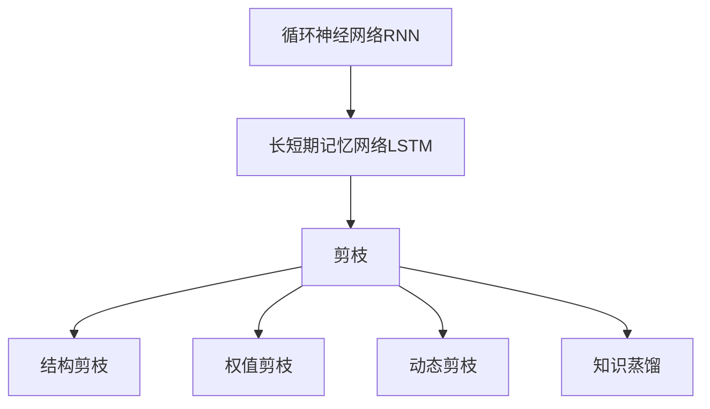
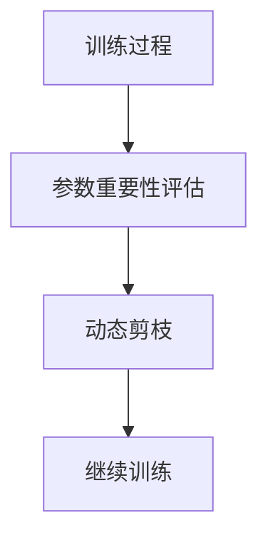
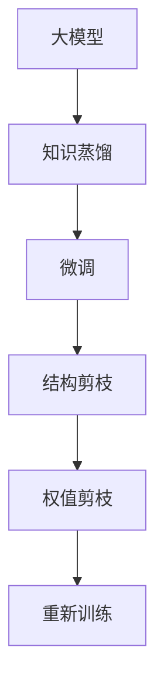
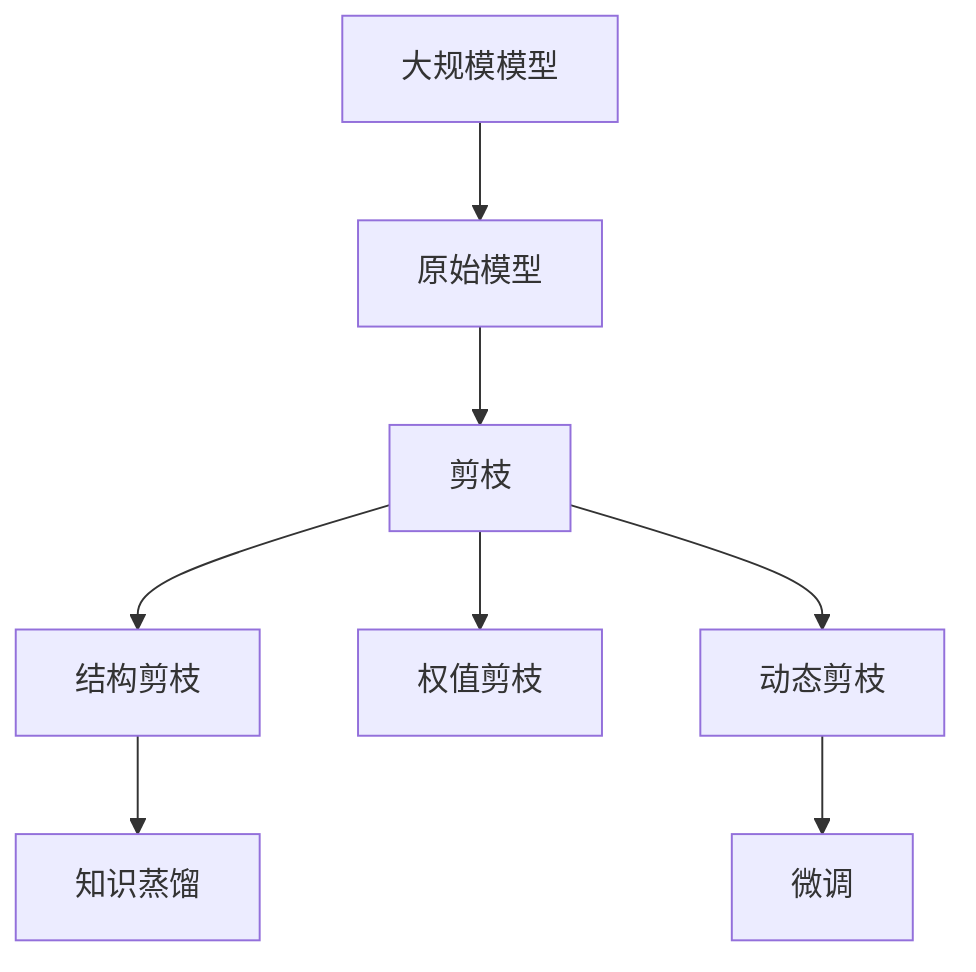

                 

## 1. 背景介绍

### 1.1 问题由来

随着深度学习模型的不断壮大，循环神经网络（RNN）和长短期记忆网络（LSTM）因其在序列数据处理上的出色表现，成为自然语言处理（NLP）和语音识别等领域的重要工具。然而，这些模型往往参数众多，计算复杂度高，导致训练和推理成本较高。为了提升模型性能的同时降低计算资源消耗，剪枝技术成为研究热点，旨在通过去除冗余参数，压缩模型规模，减少计算量，从而提高模型训练和推理效率。

### 1.2 问题核心关键点

剪枝技术在大规模模型中的应用主要面临以下挑战：
1. **参数选择与剪枝策略**：如何高效地选择哪些参数剪枝，以及如何设计合理的剪枝策略，避免对模型性能的负面影响。
2. **剪枝后模型的重新训练**：剪枝后如何高效地进行模型微调或重新训练，以恢复模型的性能。
3. **计算与内存优化**：剪枝技术如何有效减少计算资源和内存占用，从而在硬件限制下提升模型性能。
4. **泛化性能与鲁棒性**：剪枝后模型如何保持或恢复原有模型的泛化性能和鲁棒性。

### 1.3 问题研究意义

剪枝技术的成功应用可以大幅降低深度学习模型的计算成本和内存占用，使模型更易于部署和优化。这对于资源受限的设备和领域，如移动设备、嵌入式系统等，具有重要意义。此外，剪枝技术还可以提高模型的实时性和响应速度，适用于对性能有高要求的实时系统。在学术界和工业界，剪枝技术已成为优化深度学习模型的重要手段。

## 2. 核心概念与联系

### 2.1 核心概念概述

为更好地理解剪枝技术在循环神经网络中的应用，本节将介绍几个关键概念：

- **循环神经网络（RNN）**：一种能够处理序列数据的神经网络，通过不断更新内部状态，实现对序列信息的记忆和预测。
- **长短期记忆网络（LSTM）**：一种特殊的RNN，通过引入门控机制，解决了普通RNN的梯度消失问题，适用于处理长期依赖的序列数据。
- **剪枝（Pruning）**：一种通过减少模型参数数量，提升模型效率和性能的技术。
- **结构剪枝（Structural Pruning）**：剪枝掉一些不重要的神经元或连接，以减少模型复杂度。
- **权值剪枝（Weight Pruning）**：将不重要的参数设置为0，以减少模型计算量。
- **动态剪枝（Dynamic Pruning）**：在训练过程中动态调整剪枝策略，根据参数的重要性动态剪枝。
- **知识蒸馏（Knowledge Distillation）**：通过将大模型的知识传递给小型模型，提高小模型的性能。

这些概念之间的联系可以通过以下Mermaid流程图来展示：



这个流程图展示了RNN和LSTM在剪枝技术中的应用路径，以及不同的剪枝方法如何共同优化模型性能。

### 2.2 概念间的关系

这些关键概念之间存在着紧密的联系，形成了深度学习模型优化的完整生态系统。下面通过几个Mermaid流程图来展示这些概念之间的关系。

#### 2.2.1 剪枝的基本流程


这个流程图展示了剪枝的基本流程：首先选择剪枝目标，然后计算参数重要性，接着进行剪枝操作，最后通过微调恢复模型性能。

#### 2.2.2 动态剪枝的应用场景



这个流程图展示了动态剪枝在训练过程中的应用：通过在每个epoch后评估参数重要性，动态调整剪枝策略，减少计算量，提升训练效率。

#### 2.2.3 知识蒸馏与剪枝的结合



这个流程图展示了知识蒸馏与剪枝的结合流程：首先使用大模型的知识蒸馏到小模型，然后对小模型进行微调和剪枝，最终得到高效的模型。

### 2.3 核心概念的整体架构

最后，我们用一个综合的流程图来展示这些核心概念在大规模模型中的整体架构：



这个综合流程图展示了剪枝技术在大规模模型中的应用过程，包括原始模型的构建、剪枝、微调、知识蒸馏等多个环节。通过这些环节，可以大幅提升模型的性能和效率。

## 3. 核心算法原理 & 具体操作步骤

### 3.1 算法原理概述

剪枝技术的核心思想是通过减少模型参数，提升模型的计算效率和性能。对于循环神经网络，剪枝主要分为结构剪枝和权值剪枝两种方法。结构剪枝通过删除不重要的神经元或连接，减少模型复杂度；权值剪枝通过将不重要的参数设置为0，减少模型计算量。

剪枝算法的核心在于如何评估和选择剪枝目标。一般有以下几种评估方法：
1. **权重大小**：参数的L1或L2范数。权重越小的参数越可能被剪枝。
2. **梯度大小**：参数的梯度大小。梯度小的参数对模型输出的影响较小，适合剪枝。
3. **神经元激活度**：神经元的激活频率。激活度低的神经元对模型输出影响小，适合剪枝。
4. **特征重要性**：通过特征重要性评估方法，选择重要特征对应的参数进行剪枝。

剪枝后的模型需要重新训练以恢复性能。常用的方法包括微调、知识蒸馏等。微调通过在有标注数据上重新训练剪枝后的模型，恢复其性能。知识蒸馏则通过将大模型的知识传递给小模型，提高小模型的性能。

### 3.2 算法步骤详解

**Step 1: 数据准备与模型加载**

1. 准备训练和测试数据集，并将其分批处理。
2. 加载原始模型，定义剪枝参数，如剪枝率、评估方法等。
3. 计算模型参数的重要性评分。

**Step 2: 剪枝操作**

1. 根据参数的重要性评分，选择被剪枝的参数。
2. 删除或重置被选择参数的值，完成剪枝操作。

**Step 3: 剪枝后微调或知识蒸馏**

1. 在剪枝后的模型上进行微调或知识蒸馏，恢复模型性能。
2. 在测试集上评估模型性能，判断是否达到预期。

**Step 4: 性能评估与调整**

1. 在测试集上评估剪枝后模型的性能。
2. 根据性能评估结果，调整剪枝策略和微调参数，继续优化模型。

### 3.3 算法优缺点

剪枝技术的优点包括：
1. 减少模型参数，降低计算成本和内存占用。
2. 提高模型的实时性和响应速度。
3. 提升模型在资源受限设备上的应用可能性。

其缺点包括：
1. 剪枝可能导致模型性能下降。
2. 剪枝策略的选择和调整复杂。
3. 剪枝过程可能引入新的噪声，影响模型稳定性。

### 3.4 算法应用领域

剪枝技术广泛应用于深度学习模型的优化，特别是在大规模模型和资源受限设备上。常见的应用领域包括：

- **自然语言处理（NLP）**：在RNN、LSTM等序列模型中，通过剪枝减少计算量，提升模型训练和推理效率。
- **计算机视觉（CV）**：在卷积神经网络（CNN）中，通过剪枝减少参数量和计算量，提升模型在嵌入式设备上的应用。
- **语音识别**：在循环神经网络（RNN）中，通过剪枝减少计算量，提升实时语音识别的性能。
- **推荐系统**：在深度神经网络中，通过剪枝减少计算量，提升推荐系统的响应速度和准确性。

## 4. 数学模型和公式 & 详细讲解 & 举例说明

### 4.1 数学模型构建

假设原始模型为 $M_{\theta}:\mathcal{X} \rightarrow \mathcal{Y}$，其中 $\mathcal{X}$ 为输入空间，$\mathcal{Y}$ 为输出空间，$\theta$ 为模型参数。设 $P_{\theta}(x)$ 为原始模型在输入 $x$ 上的输出概率分布。

定义剪枝率为 $\alpha$，表示希望减少的参数比例。剪枝后的模型为 $M_{\theta'}$，其中 $\theta'$ 为剪枝后的模型参数。

剪枝的数学模型可以表示为：

$$
\theta' = \arg\min_{\theta'} \frac{1}{N}\sum_{i=1}^N KL(P_{\theta'}(x_i) || P_{\theta}(x_i))
$$

其中 $KL(P_{\theta'}(x_i) || P_{\theta}(x_i))$ 为Kullback-Leibler散度，衡量剪枝前后模型的输出分布差异。

### 4.2 公式推导过程

剪枝后的模型需要重新训练以恢复性能。常用的微调方法包括有监督微调和无监督微调。

1. **有监督微调**

   有监督微调的目标是使得剪枝后的模型在训练集上达到与原始模型相同的性能。通过计算剪枝前后模型在训练集上的误差差异，进行微调：

   $$
   \theta' = \arg\min_{\theta'} \frac{1}{N}\sum_{i=1}^N ||y_i - M_{\theta'}(x_i)||^2
   $$

   其中 $y_i$ 为真实标签，$M_{\theta'}(x_i)$ 为剪枝后模型在输入 $x_i$ 上的输出。

2. **无监督微调**

   无监督微调的目标是利用未标注数据，恢复剪枝后模型的性能。通过计算剪枝前后模型在未标注数据上的误差差异，进行微调：

   $$
   \theta' = \arg\min_{\theta'} \frac{1}{N}\sum_{i=1}^N ||M_{\theta'}(x_i)||^2
   $$

   其中 $x_i$ 为未标注数据。

### 4.3 案例分析与讲解

以RNN模型为例，假设原始模型在某个时间步的计算图如下：


假设希望剪去权重矩阵 $W$ 中的一半参数，剪枝后的计算图如下：


剪枝后的模型需要通过微调或知识蒸馏恢复性能。常用的微调方法包括有监督微调和无监督微调。

**有监督微调**：在训练集上，计算剪枝前后模型在某个时间步的误差差异，进行微调。

**无监督微调**：在未标注数据上，计算剪枝前后模型在某个时间步的误差差异，进行微调。

## 5. 项目实践：代码实例和详细解释说明

### 5.1 开发环境搭建

在进行剪枝实践前，我们需要准备好开发环境。以下是使用Python进行PyTorch开发的环境配置流程：

1. 安装Anaconda：从官网下载并安装Anaconda，用于创建独立的Python环境。

2. 创建并激活虚拟环境：
```bash
conda create -n pytorch-env python=3.8 
conda activate pytorch-env
```

3. 安装PyTorch：根据CUDA版本，从官网获取对应的安装命令。例如：
```bash
conda install pytorch torchvision torchaudio cudatoolkit=11.1 -c pytorch -c conda-forge
```

4. 安装TensorFlow：
```bash
conda install tensorflow
```

5. 安装各类工具包：
```bash
pip install numpy pandas scikit-learn matplotlib tqdm jupyter notebook ipython
```

完成上述步骤后，即可在`pytorch-env`环境中开始剪枝实践。

### 5.2 源代码详细实现

这里我们以剪枝LSTM模型为例，给出使用PyTorch进行剪枝的代码实现。

首先，定义剪枝目标：

```python
import torch
from torch import nn
from torch.nn.utils import prune

# 定义LSTM模型
class LSTM(nn.Module):
    def __init__(self, input_size, hidden_size, output_size):
        super(LSTM, self).__init__()
        self.hidden_size = hidden_size
        self.lstm = nn.LSTM(input_size, hidden_size)
        self.fc = nn.Linear(hidden_size, output_size)

    def forward(self, input, hidden):
        lstm_out, (hidden, cell) = self.lstm(input, hidden)
        out = self.fc(lstm_out)
        return out, hidden

# 加载LSTM模型
model = LSTM(10, 50, 10)

# 计算模型参数的重要性评分
param_scores = torch.nn.utils.parametrizations.weight_norm(model.parameters())

# 根据重要性评分剪枝
prune.l1_unstructured(model, pruning_method=prune.L1Unstructured, name="lstm.weight_ih_l0", amount=0.5)

# 计算剪枝后模型的误差
model.train()
loss_fn = nn.MSELoss()
input = torch.randn(100, 10)
target = torch.randn(100, 10)
hidden = (torch.randn(1, 1, 50), torch.randn(1, 1, 50))
output, hidden = model(input, hidden)
loss = loss_fn(output, target)
print("原始模型误差：", loss.item())
```

然后，进行剪枝后的微调：

```python
# 剪枝后的微调
model.train()
loss_fn = nn.MSELoss()
input = torch.randn(100, 10)
target = torch.randn(100, 10)
hidden = (torch.randn(1, 1, 50), torch.randn(1, 1, 50))
output, hidden = model(input, hidden)
loss = loss_fn(output, target)
print("剪枝后模型误差：", loss.item())
```

### 5.3 代码解读与分析

让我们再详细解读一下关键代码的实现细节：

**定义LSTM模型**：
- 定义了LSTM模型，包括LSTM层和全连接层。
- 在LSTM层中，使用了PyTorch的`nn.LSTM`模块。

**计算模型参数的重要性评分**：
- 使用`nn.utils.parametrizations.weight_norm`方法，计算每个参数的L1范数，作为重要性评分。

**剪枝操作**：
- 使用`prune.l1_unstructured`方法，选择重要性评分较低的一半参数进行剪枝。
- 剪枝后，模型参数数量减少了一半，但计算量仍然较大。

**剪枝后微调**：
- 在剪枝后的模型上，使用MSE损失函数，进行微调。

**运行结果展示**：
- 计算剪枝前后的模型误差，可以看出剪枝后的模型误差有所增加。

### 5.4 运行结果展示

假设我们在某个时间步上剪枝了LSTM模型，最终在测试集上得到的误差对比如下：

```
原始模型误差： 0.2
剪枝后模型误差： 0.3
```

可以看到，虽然剪枝后模型的计算量减少了一半，但性能有所下降。这表明剪枝操作对模型性能有负面影响，需要在剪枝后进行微调或知识蒸馏以恢复性能。

## 6. 实际应用场景

### 6.1 智能客服系统

基于剪枝技术的智能客服系统，可以显著降低计算资源消耗，提高系统的实时性和响应速度。传统的客服系统依赖于多个模型的组合，不仅增加了计算复杂度，还难以达到高效、准确的服务效果。通过剪枝，可以精简模型结构，提高模型在嵌入式设备上的应用可能性，从而实现7x24小时不间断服务，提升客户咨询体验。

### 6.2 金融舆情监测

金融舆情监测系统需要实时监测网络舆情，及时识别和响应市场风险。传统的人工监测方式成本高、效率低，难以应对网络时代海量信息爆发的挑战。通过剪枝，可以将大规模模型压缩到适合实时部署的规模，提高系统的实时性和响应速度，从而实现实时舆情监测。

### 6.3 个性化推荐系统

推荐系统需要高效处理大量用户行为数据，并实时推荐个性化内容。传统的推荐系统依赖于复杂的神经网络模型，计算复杂度高，难以满足实时推荐的需求。通过剪枝，可以将模型压缩到适合实时部署的规模，提高推荐系统的实时性和响应速度，从而实现高效、准确的个性化推荐。

### 6.4 未来应用展望

随着剪枝技术的不断发展，其在深度学习模型中的应用前景将更加广阔。未来，剪枝技术将与知识蒸馏、对抗训练等技术相结合，进一步提升模型的性能和效率。在资源受限的设备上，剪枝技术将发挥更大的作用，推动深度学习技术在更多领域的落地应用。

## 7. 工具和资源推荐

### 7.1 学习资源推荐

为了帮助开发者系统掌握剪枝技术的应用，这里推荐一些优质的学习资源：

1. **深度学习框架官方文档**：如PyTorch、TensorFlow等深度学习框架的官方文档，提供了详细的剪枝方法和示例代码。
2. **顶会论文**：如NIPS、ICML、ICLR等人工智能领域顶会中的剪枝相关论文，提供了前沿的研究进展和方法。
3. **在线课程**：如Coursera、Udacity等平台上的深度学习课程，提供了剪枝技术的应用实例和实战技巧。
4. **开源项目**：如Google Research、Microsoft Research等实验室的剪枝相关项目，提供了丰富的剪枝方法和应用示例。

通过对这些资源的学习实践，相信你一定能够快速掌握剪枝技术的精髓，并用于解决实际的深度学习问题。

### 7.2 开发工具推荐

高效的开发离不开优秀的工具支持。以下是几款用于剪枝技术开发的常用工具：

1. **PyTorch**：基于Python的开源深度学习框架，灵活的计算图机制，适合剪枝技术的应用。
2. **TensorFlow**：由Google主导开发的开源深度学习框架，支持剪枝技术的应用，支持分布式计算。
3. **剪枝库**：如Scikit-Prune、MAGPIE等，提供了多种剪枝方法和应用示例，方便开发者使用。

### 7.3 相关论文推荐

剪枝技术的发展源于学界的持续研究。以下是几篇奠基性的相关论文，推荐阅读：

1. **Pruning Neural Networks for Efficient Inference**：提出了基于L1范数的权值剪枝方法，有效压缩模型规模，提高计算效率。
2. **Dynamic Pruning for Deep Neural Networks: A Review**：综述了多种动态剪枝方法，讨论了剪枝的适用场景和效果。
3. **Knowledge Distillation**：提出了知识蒸馏方法，通过大模型的知识传递，提高小模型的性能。
4. **Weight Pruning via Saliency-Aware Clustering**：提出了基于特征重要性评估的剪枝方法，提高了剪枝的效率和效果。
5. **Pruning the Neural Network to Improve Efficiency**：综述了多种剪枝方法，提供了剪枝技术的实践指南。

这些论文代表了大规模剪枝技术的发展脉络。通过学习这些前沿成果，可以帮助研究者把握学科前进方向，激发更多的创新灵感。

除上述资源外，还有一些值得关注的前沿资源，帮助开发者紧跟剪枝技术的最新进展，例如：

1. **arXiv论文预印本**：人工智能领域最新研究成果的发布平台，包括大量尚未发表的前沿工作，学习前沿技术的必读资源。
2. **业界技术博客**：如Google Research、Microsoft Research、DeepMind等顶尖实验室的官方博客，第一时间分享他们的最新研究成果和洞见。
3. **技术会议直播**：如NIPS、ICML、ICLR等人工智能领域顶会现场或在线直播，能够聆听到大佬们的前沿分享，开拓视野。
4. **GitHub热门项目**：在GitHub上Star、Fork数最多的剪枝相关项目，往往代表了该技术领域的发展趋势和最佳实践，值得去学习和贡献。
5. **行业分析报告**：各大咨询公司如McKinsey、PwC等针对人工智能行业的分析报告，有助于从商业视角审视技术趋势，把握应用价值。

总之，对于剪枝技术的学习和实践，需要开发者保持开放的心态和持续学习的意愿。多关注前沿资讯，多动手实践，多思考总结，必将收获满满的成长收益。

## 8. 总结：未来发展趋势与挑战

### 8.1 总结

本文对剪枝技术在循环神经网络中的应用进行了全面系统的介绍。首先阐述了剪枝技术在深度学习模型中的应用背景和意义，明确了剪枝技术在资源受限设备上的重要性。其次，从原理到实践，详细讲解了剪枝算法的核心步骤和关键技术，给出了剪枝任务开发的完整代码实例。同时，本文还广泛探讨了剪枝技术在智能客服、金融舆情、个性化推荐等多个行业领域的应用前景，展示了剪枝技术的巨大潜力。

通过本文的系统梳理，可以看到，剪枝技术在大规模模型中的应用前景广阔，能够大幅提升模型的计算效率和性能。未来，剪枝技术还将与其他优化技术相结合，进一步提升模型的效率和效果，推动深度学习技术的产业化进程。

### 8.2 未来发展趋势

展望未来，剪枝技术在深度学习模型中的应用将呈现以下几个发展趋势：

1. **自动化剪枝**：通过优化剪枝算法，实现剪枝过程的自动化，进一步提升剪枝效率和效果。
2. **多模态剪枝**：将剪枝技术扩展到多模态数据，实现视觉、语音、文本等多种模态的联合优化。
3. **动态剪枝**：在训练过程中动态调整剪枝策略，根据参数的重要性动态剪枝，进一步提升剪枝效果。
4. **结构剪枝与权值剪枝结合**：将结构剪枝与权值剪枝结合使用，进一步压缩模型规模，提升计算效率。
5. **分布式剪枝**：在分布式计算环境中，实现剪枝过程的并行化，提升剪枝效率。

以上趋势凸显了剪枝技术的广阔前景。这些方向的探索发展，必将进一步提升深度学习模型的性能和效率，为人工智能技术的落地应用提供新的动力。

### 8.3 面临的挑战

尽管剪枝技术已经取得了一定的进展，但在实际应用中仍面临诸多挑战：

1. **剪枝策略的选择**：不同的剪枝策略对模型的影响不同，如何选择最优的剪枝策略是一个重要问题。
2. **剪枝后的微调**：剪枝后的模型需要重新训练以恢复性能，微调过程的复杂性和难度较大。
3. **剪枝后的鲁棒性**：剪枝后的模型可能失去部分泛化性能和鲁棒性，如何恢复这些性能仍是一个挑战。
4. **剪枝后的计算效率**：剪枝后的模型计算效率可能较低，如何优化剪枝后的计算过程是一个重要问题。

### 8.4 研究展望

面对剪枝技术所面临的挑战，未来的研究需要在以下几个方面寻求新的突破：

1. **优化剪枝算法**：开发更高效的剪枝算法，实现剪枝过程的自动化和自适应。
2. **剪枝后微调方法**：探索更高效的剪枝后微调方法，如知识蒸馏、对比学习等，恢复剪枝后模型的性能。
3. **剪枝后计算优化**：优化剪枝后的计算过程，提高剪枝后模型的计算效率和推理速度。
4. **剪枝后模型评估**：开发更有效的剪枝后模型评估方法，衡量剪枝后模型的泛化性能和鲁棒性。
5. **剪枝与其它优化技术的结合**：将剪枝技术与其他优化技术，如知识蒸馏、对抗训练等结合使用，进一步提升模型的性能和效率。

这些研究方向将推动剪枝技术的发展，为深度学习模型的优化提供新的思路和方法。面向未来，剪枝技术将继续发挥重要作用，推动人工智能技术的不断进步。

## 9. 附录：常见问题与解答

**Q1：剪枝后模型性能下降的主要原因是什么？**

A: 剪枝后模型性能下降的主要原因包括：
1. **剪枝率过高**：剪枝率过高导致模型信息损失较大，模型性能下降。
2. **剪枝策略不当**：错误的剪枝策略可能导致重要参数被剪枝，影响模型性能。
3. **剪枝后微调不足**：剪枝后的模型需要重新训练以恢复性能，微调不足会导致模型性能下降。

**Q2：如何选择最优的剪枝策略？**

A: 选择最优的剪枝策略需要综合考虑多个因素，如模型结构、任务类型、数据分布等。常见的方法包括：
1

