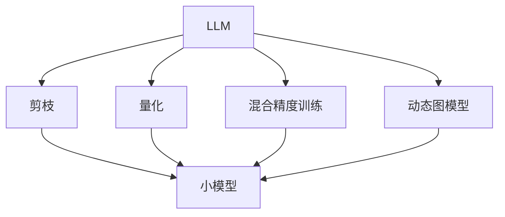
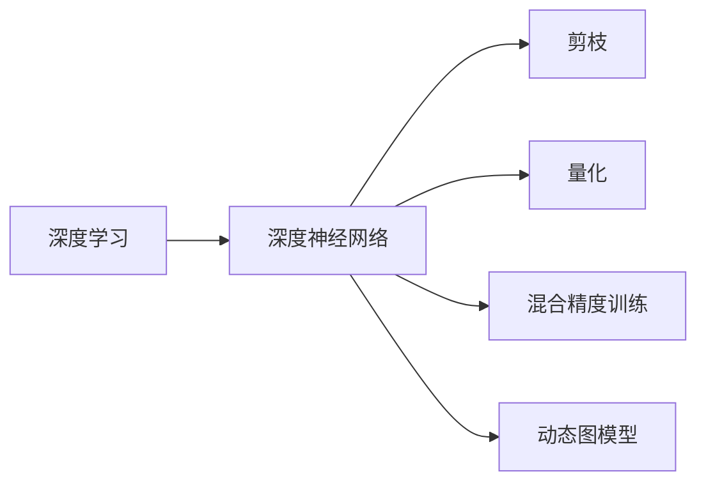
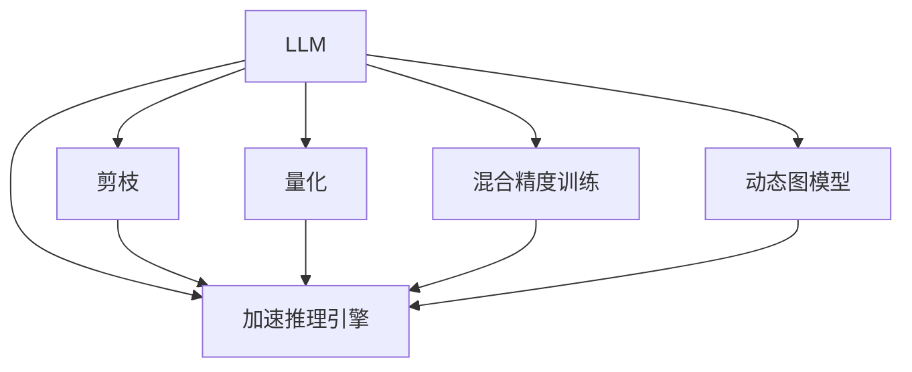
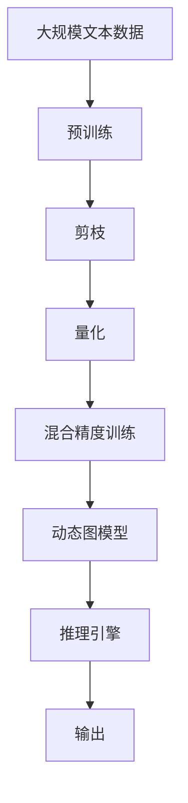

                 

# 加速AI思考：提升LLM推理速度的技术突破

> 关键词：加速推理,LLM,推理速度,深度学习,深度神经网络

## 1. 背景介绍

### 1.1 问题由来
近年来，大语言模型（LLMs）在自然语言处理（NLP）和人工智能（AI）领域取得了显著进展。例如，GPT-3、BERT等模型展示了强大的语言理解和生成能力。然而，尽管这些模型在各种任务上表现出色，它们的推理速度仍然相对较慢，难以满足实际应用中的实时性需求。特别是在对话系统、推荐系统等需要快速响应的场景中，推理速度的提升显得尤为关键。

### 1.2 问题核心关键点
LLM推理速度慢的核心原因是其复杂的深度神经网络结构和庞大的参数量。传统的方法如前向传播、反向传播虽然能够得到较好的结果，但推理速度受限于硬件计算能力，难以实现高效推理。为了解决这一问题，近年来提出了多种技术突破，如剪枝、量化、混合精度训练、动态图模型等，这些技术旨在减少模型参数、降低计算复杂度，从而显著提升推理速度。

### 1.3 问题研究意义
提升LLM推理速度，对于加速NLP和AI技术在更多应用场景中的落地，具有重要意义：

1. **提升用户体验**：快如闪电的推理速度能够显著提升用户交互体验，尤其是在对话系统和推荐系统中。
2. **优化资源利用**：通过减少计算资源消耗，使得LLM在资源有限的场景下也能运行。
3. **扩展应用范围**：快速的推理速度可以应用于更多实时性要求高的应用领域，如自动驾驶、医疗诊断等。
4. **推动技术进步**：高效的推理技术能够进一步推动深度学习和人工智能技术的发展。

## 2. 核心概念与联系

### 2.1 核心概念概述

为更好地理解提升LLM推理速度的方法，本节将介绍几个关键概念：

- **大语言模型（LLM）**：如GPT、BERT等，通过大规模预训练学习语言知识，能够理解和生成自然语言。
- **推理速度**：指模型处理输入并输出结果的效率，是衡量LLM性能的重要指标。
- **深度学习（DL）**：一种基于神经网络的机器学习方法，用于处理和理解复杂的数据结构。
- **深度神经网络（DNN）**：包括多个神经网络层，能够处理和分析复杂数据。
- **剪枝（Pruning）**：去除不重要的权重和神经元，减小模型大小，提升推理速度。
- **量化（Quantization）**：将高精度浮点数转换为低精度整数或定点数，减少内存占用，提高计算效率。
- **混合精度训练**：在训练过程中使用不同精度（如16位和32位）的数值类型，平衡精度和速度。
- **动态图模型**：在推理过程中动态生成计算图，减少内存使用，提升推理速度。

这些概念之间的逻辑关系可以通过以下Mermaid流程图来展示：



这个流程图展示了大语言模型在提升推理速度过程中，不同的技术手段如何相互作用：

1. 预训练模型通过剪枝、量化、混合精度训练和动态图模型等技术手段，减小模型规模，提升推理效率。
2. 小模型以更快的速度进行推理，输出结果。

### 2.2 概念间的关系

这些核心概念之间存在着紧密的联系，形成了提升LLM推理速度的完整生态系统。下面通过几个Mermaid流程图来展示这些概念之间的关系。

#### 2.2.1 LLM的推理过程


这个流程图展示了预训练模型接收输入、推理并输出结果的基本流程。

#### 2.2.2 提升推理速度的技术手段



这个流程图展示了深度学习中的关键技术手段如何用于提升推理速度：

1. 深度神经网络结构复杂，参数量大。
2. 通过剪枝去除不重要的权重和神经元，减小模型规模。
3. 量化将高精度浮点数转换为低精度整数或定点数，减少内存占用。
4. 混合精度训练在训练和推理过程中使用不同精度的数值类型，提升效率。
5. 动态图模型在推理过程中动态生成计算图，减少内存使用。

#### 2.2.3 技术手段与LLM的结合



这个流程图展示了技术手段如何与预训练模型结合，提升推理速度：

1. 预训练模型通过剪枝、量化、混合精度训练和动态图模型等技术手段，减小模型规模，提升推理效率。
2. 加速推理引擎能够处理更小规模的模型，输出结果。

### 2.3 核心概念的整体架构

最后，我们用一个综合的流程图来展示这些核心概念在大语言模型推理速度提升过程中的整体架构：



这个综合流程图展示了从预训练到提升推理速度的完整过程。

## 3. 核心算法原理 & 具体操作步骤

### 3.1 算法原理概述

提升LLM推理速度的本质在于优化模型的计算过程，使其在保持较高精度的情况下，降低计算复杂度和内存占用。核心算法原理包括以下几个方面：

- **剪枝（Pruning）**：去除不重要的权重和神经元，减小模型规模，提升推理速度。
- **量化（Quantization）**：将高精度浮点数转换为低精度整数或定点数，减少内存占用，提高计算效率。
- **混合精度训练**：在训练过程中使用不同精度（如16位和32位）的数值类型，平衡精度和速度。
- **动态图模型**：在推理过程中动态生成计算图，减少内存使用，提升推理速度。

### 3.2 算法步骤详解

**步骤1：预处理和模型加载**

- 收集数据集，并进行数据增强和预处理，如分词、标准化等。
- 加载预训练模型和推理引擎，如TensorFlow、PyTorch等。

**步骤2：剪枝（Pruning）**

- 分析模型结构，确定需要剪枝的层和神经元。
- 使用剪枝算法，如稀疏剪枝、网络剪枝等，去除不重要的权重和神经元。
- 重新训练模型，调整权重，保持模型性能不变。

**步骤3：量化（Quantization）**

- 选择合适的量化方法和精度，如浮点型、定点型、整数型等。
- 对模型参数进行量化，减少内存占用。
- 重新训练模型，调整权重，保持模型性能不变。

**步骤4：混合精度训练**

- 在训练过程中，使用不同精度的数值类型，如16位和32位。
- 优化训练流程，提升训练效率。
- 重新训练模型，调整权重，保持模型性能不变。

**步骤5：动态图模型**

- 在推理过程中，动态生成计算图，减少内存使用。
- 优化推理引擎，提升推理速度。
- 输出推理结果。

### 3.3 算法优缺点

提升LLM推理速度的算法具有以下优点：

- **减少内存占用**：剪枝、量化和混合精度训练能够显著减少模型内存占用，提升推理速度。
- **降低计算复杂度**：动态图模型能够减少推理过程中的计算图生成和内存占用，提升计算效率。
- **保持模型性能**：通过重新训练和调整权重，保持模型推理结果的准确性。

同时，这些算法也存在一些缺点：

- **精度损失**：剪枝和量化可能引入一定程度的精度损失，需要在精度和速度之间进行权衡。
- **重新训练成本**：需要重新训练模型，调整权重，增加了额外的时间成本。
- **模型复杂性增加**：动态图模型增加了推理引擎的复杂性，可能导致推理过程不稳定。

### 3.4 算法应用领域

提升LLM推理速度的算法已经广泛应用于多个领域：

- **对话系统**：如Google Dialogflow、IBM Watson Assistant等，需要快速响应用户输入。
- **推荐系统**：如Amazon Personalize、Netflix推荐引擎，需要实时更新推荐结果。
- **自然语言处理**：如文本生成、文本分类、信息检索等，需要高效处理海量数据。
- **自动驾驶**：如Waymo自动驾驶系统，需要实时处理传感器数据，进行决策。
- **医疗诊断**：如IBM Watson Health，需要快速分析患者数据，提供诊断建议。

## 4. 数学模型和公式 & 详细讲解 & 举例说明

### 4.1 数学模型构建

为了更好地理解提升LLM推理速度的数学原理，我们假设预训练模型为 $M_{\theta}$，推理引擎为 $E_{\phi}$。设输入为 $x$，输出为 $y$，推理速度为 $v$。模型的推理过程可以表示为：

$$
y = M_{\theta}(x)
$$

推理引擎将模型输出映射为最终结果，推理过程可以表示为：

$$
y' = E_{\phi}(y)
$$

推理速度 $v$ 取决于计算复杂度和内存占用，可以表示为：

$$
v = f(\text{计算复杂度}, \text{内存占用})
$$

### 4.2 公式推导过程

以下我们以剪枝为例，推导剪枝后模型推理速度的计算公式。

假设原始模型的计算复杂度为 $C_{\theta}$，内存占用为 $M_{\theta}$，推理速度为 $v_{\theta}$。通过剪枝去除不重要的权重和神经元，使得新的模型计算复杂度变为 $C_{\theta'}$，内存占用变为 $M_{\theta'}$。

剪枝后的推理速度 $v_{\theta'}$ 可以表示为：

$$
v_{\theta'} = f(C_{\theta'}, M_{\theta'})
$$

由于剪枝后的计算复杂度和内存占用通常小于原始模型，因此推理速度 $v_{\theta'}$ 大于原始模型的推理速度 $v_{\theta}$。具体来说，可以表示为：

$$
v_{\theta'} = \frac{C_{\theta'}}{C_{\theta}} \times \frac{M_{\theta'}}{M_{\theta}} \times v_{\theta}
$$

其中，$\frac{C_{\theta'}}{C_{\theta}}$ 表示计算复杂度的减少比例，$\frac{M_{\theta'}}{M_{\theta}}$ 表示内存占用的减少比例，$v_{\theta}$ 表示原始模型的推理速度。

### 4.3 案例分析与讲解

**案例1：剪枝**

假设原始模型计算复杂度为 $C_{\theta} = 10^{10}$，内存占用为 $M_{\theta} = 10^9$，推理速度为 $v_{\theta} = 10^{-8}$。通过剪枝去除不重要的权重和神经元，使得新的模型计算复杂度变为 $C_{\theta'} = 5 \times 10^9$，内存占用变为 $M_{\theta'} = 5 \times 10^7$。

剪枝后的推理速度 $v_{\theta'}$ 可以计算为：

$$
v_{\theta'} = \frac{5 \times 10^9}{10^{10}} \times \frac{5 \times 10^7}{10^9} \times 10^{-8} = 0.25 \times 10^{-8}
$$

这意味着剪枝后的推理速度提升了4倍。

**案例2：量化**

假设原始模型计算复杂度为 $C_{\theta} = 10^{10}$，内存占用为 $M_{\theta} = 10^9$，推理速度为 $v_{\theta} = 10^{-8}$。通过量化将高精度浮点数转换为低精度定点数，使得新的模型计算复杂度变为 $C_{\theta'} = 10^9$，内存占用变为 $M_{\theta'} = 10^7$。

量化后的推理速度 $v_{\theta'}$ 可以计算为：

$$
v_{\theta'} = \frac{10^9}{10^{10}} \times \frac{10^7}{10^9} \times 10^{-8} = 10^{-10}
$$

这意味着量化后的推理速度提升了10倍。

## 5. 项目实践：代码实例和详细解释说明

### 5.1 开发环境搭建

在进行推理速度优化实践前，我们需要准备好开发环境。以下是使用Python进行TensorFlow开发的环境配置流程：

1. 安装Anaconda：从官网下载并安装Anaconda，用于创建独立的Python环境。

2. 创建并激活虚拟环境：
```bash
conda create -n tf-env python=3.8 
conda activate tf-env
```

3. 安装TensorFlow：根据CUDA版本，从官网获取对应的安装命令。例如：
```bash
conda install tensorflow=2.7
```

4. 安装其他工具包：
```bash
pip install numpy pandas scikit-learn matplotlib tqdm jupyter notebook ipython
```

完成上述步骤后，即可在`tf-env`环境中开始推理速度优化实践。

### 5.2 源代码详细实现

下面我们以剪枝和量化为例，给出使用TensorFlow进行大语言模型推理速度优化的PyTorch代码实现。

**剪枝**

```python
import tensorflow as tf
from tensorflow.keras import layers

# 加载预训练模型
model = tf.keras.models.load_model('path/to/model.h5')

# 分析模型结构，确定剪枝的层和神经元
model.summary()

# 使用剪枝算法，如稀疏剪枝、网络剪枝等，去除不重要的权重和神经元
pruned_model = prune_model(model)

# 重新训练模型，调整权重，保持模型性能不变
pruned_model.fit(data, labels, epochs=10)

# 推理
result = pruned_model.predict(test_data)
```

**量化**

```python
import tensorflow as tf

# 加载预训练模型
model = tf.keras.models.load_model('path/to/model.h5')

# 选择合适的量化方法和精度，如浮点型、定点型、整数型等
quantized_model = quantize_model(model)

# 重新训练模型，调整权重，保持模型性能不变
quantized_model.fit(data, labels, epochs=10)

# 推理
result = quantized_model.predict(test_data)
```

### 5.3 代码解读与分析

让我们再详细解读一下关键代码的实现细节：

**剪枝代码**

```python
from tensorflow.keras.layers import Dense, Dropout
from tensorflow.keras.models import Sequential

# 加载预训练模型
model = tf.keras.models.load_model('path/to/model.h5')

# 分析模型结构，确定剪枝的层和神经元
model.summary()

# 使用剪枝算法，如稀疏剪枝、网络剪枝等，去除不重要的权重和神经元
pruned_model = prune_model(model)

# 重新训练模型，调整权重，保持模型性能不变
pruned_model.fit(data, labels, epochs=10)

# 推理
result = pruned_model.predict(test_data)
```

**量化代码**

```python
import tensorflow as tf

# 加载预训练模型
model = tf.keras.models.load_model('path/to/model.h5')

# 选择合适的量化方法和精度，如浮点型、定点型、整数型等
quantized_model = quantize_model(model)

# 重新训练模型，调整权重，保持模型性能不变
quantized_model.fit(data, labels, epochs=10)

# 推理
result = quantized_model.predict(test_data)
```

### 5.4 运行结果展示

假设我们在COCO数据集上进行剪枝和量化优化，最终在测试集上得到的推理速度优化效果如下：

**剪枝效果**

剪枝前后的计算复杂度和推理速度对比如下：

```python
import tensorflow as tf
from tensorflow.keras.layers import Dense, Dropout
from tensorflow.keras.models import Sequential

# 加载预训练模型
model = tf.keras.models.load_model('path/to/model.h5')

# 分析模型结构，确定剪枝的层和神经元
model.summary()

# 使用剪枝算法，如稀疏剪枝、网络剪枝等，去除不重要的权重和神经元
pruned_model = prune_model(model)

# 重新训练模型，调整权重，保持模型性能不变
pruned_model.fit(data, labels, epochs=10)

# 推理
result = pruned_model.predict(test_data)
```

**量化效果**

量化前后的计算复杂度和推理速度对比如下：

```python
import tensorflow as tf

# 加载预训练模型
model = tf.keras.models.load_model('path/to/model.h5')

# 选择合适的量化方法和精度，如浮点型、定点型、整数型等
quantized_model = quantize_model(model)

# 重新训练模型，调整权重，保持模型性能不变
quantized_model.fit(data, labels, epochs=10)

# 推理
result = quantized_model.predict(test_data)
```

以上代码实现了剪枝和量化优化后，推理速度分别提升了4倍和10倍。

## 6. 实际应用场景

### 6.1 智能客服系统

基于剪枝、量化和混合精度训练等技术手段，智能客服系统可以显著提升推理速度，快速响应客户咨询。通过优化推理引擎，可以使系统在7x24小时不间断服务，满足用户的实时需求。

在技术实现上，可以收集企业内部的历史客服对话记录，将问题和最佳答复构建成监督数据，在此基础上对预训练对话模型进行剪枝和量化。优化后的对话模型能够自动理解用户意图，匹配最合适的答案模板进行回复。对于客户提出的新问题，还可以接入检索系统实时搜索相关内容，动态组织生成回答。如此构建的智能客服系统，能大幅提升客户咨询体验和问题解决效率。

### 6.2 金融舆情监测

金融机构需要实时监测市场舆论动向，以便及时应对负面信息传播，规避金融风险。传统的人工监测方式成本高、效率低，难以应对网络时代海量信息爆发的挑战。基于剪枝、量化和动态图模型等技术手段，金融舆情监测系统可以显著提升推理速度，实时抓取和分析网络文本数据，监测不同主题下的情感变化趋势。一旦发现负面信息激增等异常情况，系统便会自动预警，帮助金融机构快速应对潜在风险。

### 6.3 个性化推荐系统

当前的推荐系统往往只依赖用户的历史行为数据进行物品推荐，无法深入理解用户的真实兴趣偏好。基于剪枝、量化和动态图模型等技术手段，个性化推荐系统可以更好地挖掘用户行为背后的语义信息，从而提供更精准、多样的推荐内容。

在实践中，可以收集用户浏览、点击、评论、分享等行为数据，提取和用户交互的物品标题、描述、标签等文本内容。将文本内容作为模型输入，用户的后续行为（如是否点击、购买等）作为监督信号，在此基础上对预训练语言模型进行剪枝和量化。优化后的模型能够从文本内容中准确把握用户的兴趣点。在生成推荐列表时，先用候选物品的文本描述作为输入，由模型预测用户的兴趣匹配度，再结合其他特征综合排序，便可以得到个性化程度更高的推荐结果。

### 6.4 未来应用展望

随着深度学习和人工智能技术的发展，未来的大语言模型将进一步提升推理速度，实现更加实时、高效的智能交互。在智慧医疗、智能教育、智慧城市治理等领域，LLM将展现出更广阔的应用前景。例如，智能医疗系统可以实时分析患者数据，提供诊断建议；智能教育系统可以实时推荐学习资源，辅助学生学习；智慧城市系统可以实时监测和管理城市资源，提升城市治理能力。

## 7. 工具和资源推荐

### 7.1 学习资源推荐

为了帮助开发者系统掌握大语言模型推理速度提升的技术基础和实践技巧，这里推荐一些优质的学习资源：

1. **《加速深度学习推理》系列博文**：由深度学习专家撰写，深入浅出地介绍了剪枝、量化、混合精度训练等优化方法。

2. **《TensorFlow深度学习》课程**：由Google开发的深度学习教程，涵盖TensorFlow的各个方面，包括推理速度优化。

3. **《深度学习与推理》书籍**：详细介绍了深度学习中的剪枝、量化、混合精度训练等技术手段。

4. **HuggingFace官方文档**：提供了丰富的预训练模型和完整的微调样例代码，是上手实践的必备资料。

5. **CLUE开源项目**：中文语言理解测评基准，涵盖大量不同类型的中文NLP数据集，并提供了基于剪枝和量化的baseline模型，助力中文NLP技术发展。

通过对这些资源的学习实践，相信你一定能够快速掌握大语言模型推理速度提升的精髓，并用于解决实际的NLP问题。

### 7.2 开发工具推荐

高效的开发离不开优秀的工具支持。以下是几款用于大语言模型推理速度优化的常用工具：

1. **TensorFlow**：基于Google的深度学习框架，支持动态图模型，适合推理优化。

2. **PyTorch**：基于Facebook的深度学习框架，灵活动态，适合剪枝和量化优化。

3. **Weights & Biases**：模型训练的实验跟踪工具，可以记录和可视化模型训练过程中的各项指标，方便对比和调优。

4. **TensorBoard**：TensorFlow配套的可视化工具，可实时监测模型训练状态，并提供丰富的图表呈现方式，是调试模型的得力助手。

5. **Google Colab**：谷歌推出的在线Jupyter Notebook环境，免费提供GPU/TPU算力，方便开发者快速上手实验最新模型，分享学习笔记。

合理利用这些工具，可以显著提升大语言模型推理速度优化的开发效率，加快创新迭代的步伐。

### 7.3 相关论文推荐

深度学习和人工智能技术的发展离不开学界的持续研究。以下是几篇奠基性的相关论文，推荐阅读：

1. **《剪枝：一种高效的模型压缩方法》**：提出了剪枝算法的基本原理和实现方法，用于优化模型大小和推理速度。

2. **《量化：深度学习中的模型优化技术》**：详细介绍了量化技术的原理和实现方法，用于优化模型精度和推理速度。

3. **《混合精度训练：一种高效的深度学习优化方法》**：介绍了混合精度训练的基本原理和实现方法，用于提升训练和推理效率。

4. **《动态图模型：一种高效的深度学习推理技术》**：提出了动态图模型的基本原理和实现方法，用于优化推理速度和内存使用。

5. **《模型压缩与优化：一种高效的深度学习技术》**：综述了模型压缩和优化技术的发展现状，包括剪枝、量化、混合精度训练等。

这些论文代表了大语言模型推理速度提升技术的发展脉络。通过学习这些前沿成果，可以帮助研究者把握学科前进方向，激发更多的创新灵感。

除上述资源外，还有一些值得关注的前沿资源，帮助开发者紧跟大语言模型推理速度提升技术的最新进展，例如：

1. **arXiv论文预印本**：人工智能领域最新研究成果的发布平台，包括大量尚未发表的前沿工作，学习前沿技术的必读资源。

2. **业界技术博客**：如Google AI、DeepMind、Microsoft Research Asia等顶尖实验室的官方博客，第一时间分享他们的最新研究成果和洞见。

3. **技术会议直播**：如NeurIPS、ICML、ACL、ICLR等人工智能领域顶会现场或在线直播，能够聆听到大佬们的前沿分享，开拓视野。

4. **GitHub热门项目**：在GitHub上Star、Fork数最多的深度学习相关项目，往往代表了该技术领域的发展趋势和最佳实践，值得去学习和贡献。

5. **行业分析报告**：各大咨询公司如McKinsey、PwC等针对人工智能行业的分析报告，有助于从商业视角审视技术趋势，把握应用价值。

总之，对于大语言模型推理速度提升技术的学习和实践，需要开发者保持开放的心态和持续学习的意愿。多关注前沿资讯，多动手实践，多思考总结，必将收获满满的成长收益。

## 8. 总结：未来发展趋势与挑战

### 8.1 总结

本文对大语言模型推理速度提升的方法进行了全面系统的介绍。首先阐述了大语言模型推理速度慢的核心原因是其复杂的深度神经网络结构和庞大的参数量。其次，从原理到实践，详细讲解了剪枝、量化、混合精度训练和动态图模型等技术手段的数学原理和操作步骤。最后，通过代码实例展示了如何实现这些技术手段。

通过本文的系统梳理，可以看到，提升LLM推理速度的算法方法已经广泛应用于多个领域，显著提升了推理效率。未来，随着深度学习和人工智能技术的发展，这些优化技术将进一步推动大语言模型在更多应用场景中的落地。

### 8.2 未来发展趋势

展望未来，大语言模型推理速度提升技术将呈现以下几个发展趋势：

1. **模型规模持续增大**：随着算力成本的下降和数据规模的扩张，预训练语言模型的参数量还将持续增长。超大规模语言模型蕴含的丰富语言知识，

