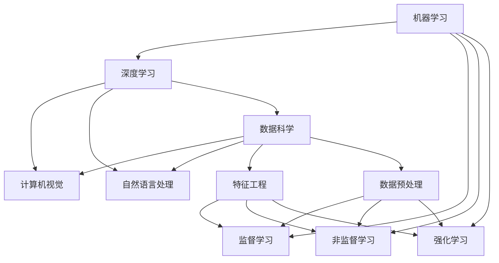

                 

# 博学之，审问之，慎思之，明辨之，笃行之

> 关键词：人工智能,机器学习,深度学习,算法优化,模型评估,计算机视觉,自然语言处理(NLP),数据科学

## 1. 背景介绍

### 1.1 问题由来

在这个信息爆炸的时代，人工智能(AI)已经成为了推动社会进步的关键力量。作为AI的一个重要分支，机器学习和深度学习算法在各个领域中取得了巨大成功。然而，随着算法的不断复杂化和数据量的指数级增长，传统的算法优化方法已显得力不从心。

### 1.2 问题核心关键点

机器学习和深度学习算法的优化问题，已经成为了学术和工业界的热点话题。本文将围绕算法优化、模型评估、数据科学等核心概念，深入探讨其原理、方法及应用，力求为读者提供全面的知识体系。

### 1.3 问题研究意义

算法优化是机器学习和深度学习领域的前沿课题，涉及从数据预处理、特征工程到模型训练和调优的全过程。掌握算法优化的方法和技巧，不仅能够提升模型的性能，还能够加速模型的迭代过程，提高工作效率。

算法优化不仅对算法工程师具有重要意义，对于数据分析师、数据科学家、乃至产品开发者来说，同样具有参考价值。只有通过不断学习和实践，才能在复杂多变的数据环境中，不断提升模型性能，实现更高的业务价值。

## 2. 核心概念与联系

### 2.1 核心概念概述

为了更好地理解机器学习和深度学习算法的优化方法，本节将介绍几个密切相关的核心概念：

- **机器学习(Machine Learning, ML)**：通过数据训练，使计算机具备一定的学习能力和预测能力，通常分为监督学习、非监督学习和强化学习三种类型。
- **深度学习(Deep Learning, DL)**：基于神经网络结构，通过多层次特征提取和抽象，解决复杂非线性问题。
- **算法优化(Algorithm Optimization)**：通过各种技术手段，提升算法的计算效率、收敛速度和模型性能。
- **模型评估(Model Evaluation)**：通过对模型在特定数据集上的性能进行评估，判断模型的泛化能力和实际应用价值。
- **计算机视觉(Computer Vision, CV)**：利用机器学习和深度学习算法，实现图像处理、目标检测、图像识别等视觉任务。
- **自然语言处理(Natural Language Processing, NLP)**：通过机器学习和深度学习，实现文本处理、情感分析、机器翻译等NLP任务。
- **数据科学(Data Science)**：融合统计学、数据挖掘和机器学习，从数据中提取有价值的信息，支持决策制定和业务优化。

这些核心概念之间的关系可以通过以下Mermaid流程图来展示：



这个流程图展示了各个核心概念之间的关系：

1. 机器学习是深度学习的父集，包括监督学习、非监督学习和强化学习。
2. 深度学习在计算机视觉、自然语言处理和数据科学中得到了广泛应用。
3. 特征工程和数据预处理是机器学习和深度学习的基础，直接影响模型性能。

## 3. 核心算法原理 & 具体操作步骤

### 3.1 算法原理概述

机器学习和深度学习算法的优化，通常包括以下几个步骤：

1. **数据预处理**：包括数据清洗、标准化、归一化等，确保数据质量。
2. **特征工程**：根据任务需求，设计合适的特征表示，提升模型性能。
3. **模型训练**：通过优化算法，最小化损失函数，训练模型参数。
4. **模型评估**：使用验证集或测试集，评估模型性能和泛化能力。
5. **调优与优化**：通过超参数调整、正则化、算法优化等手段，进一步提升模型性能。

### 3.2 算法步骤详解

下面详细讲解每个步骤的具体操作：

**Step 1: 数据预处理**

- **数据清洗**：去除数据中的异常值、缺失值和噪声，确保数据完整性。
- **标准化**：对数值型数据进行标准化，使其均值为0，标准差为1。
- **归一化**：对特征值进行归一化，确保数据在0到1之间。

**Step 2: 特征工程**

- **特征提取**：利用领域知识，提取与任务相关的特征，如文本中的n-gram、图像中的边缘特征等。
- **特征选择**：通过特征选择算法，筛选出对任务贡献最大的特征。
- **特征变换**：对特征进行转换，如PCA降维、LDA主题建模等。

**Step 3: 模型训练**

- **选择合适的模型**：根据任务类型，选择适合的机器学习或深度学习模型，如线性回归、支持向量机、卷积神经网络、循环神经网络等。
- **损失函数**：定义合适的损失函数，如均方误差、交叉熵、Kullback-Leibler散度等。
- **优化算法**：选择适合的数据集和模型，优化算法，如梯度下降、Adam、SGD等。
- **超参数调优**：通过网格搜索、随机搜索等方法，调整模型的超参数，如学习率、正则化系数、批量大小等。

**Step 4: 模型评估**

- **划分数据集**：将数据集划分为训练集、验证集和测试集，确保模型评估的公平性和可靠性。
- **评估指标**：根据任务类型，选择合适的评估指标，如准确率、召回率、F1分数、ROC-AUC等。
- **交叉验证**：通过交叉验证，评估模型在不同数据集上的性能，减少过拟合风险。

**Step 5: 调优与优化**

- **正则化**：通过L1、L2正则化等方法，防止模型过拟合。
- **dropout**：在训练过程中，随机丢弃部分神经元，提升模型泛化能力。
- **算法优化**：通过算法优化技术，如批量归一化、残差连接、激活函数改进等，提升模型性能。
- **硬件加速**：利用GPU、TPU等硬件资源，加速模型训练和推理过程。

### 3.3 算法优缺点

机器学习和深度学习算法优化具有以下优点：

- **高效性**：通过优化算法，快速训练和调整模型，缩短项目开发周期。
- **泛化能力**：通过正则化、dropout等方法，提升模型泛化能力，避免过拟合。
- **灵活性**：通过特征工程、超参数调优等手段，提升模型性能，适应多种场景。

同时，算法优化也存在一些缺点：

- **计算成本**：优化算法和模型训练通常需要大量的计算资源和时间。
- **超参数调优**：超参数的选择和调整需要经验和技巧，可能导致模型性能波动。
- **模型复杂度**：复杂的模型可能难以解释和调试，增加维护成本。

### 3.4 算法应用领域

机器学习和深度学习算法优化在多个领域中得到了广泛应用，例如：

- **计算机视觉**：用于图像分类、目标检测、图像分割等任务。
- **自然语言处理**：用于文本分类、情感分析、机器翻译等任务。
- **数据科学**：用于数据挖掘、用户行为分析、风险评估等任务。
- **推荐系统**：用于个性化推荐、广告投放、用户画像等任务。
- **金融分析**：用于风险控制、信用评估、市场预测等任务。

除了这些经典应用领域外，机器学习和深度学习算法优化还在更多新兴领域中不断探索，如医疗诊断、智能交通、工业控制等，为各行各业带来了新的发展机遇。

## 4. 数学模型和公式 & 详细讲解 & 举例说明

### 4.1 数学模型构建

本节将使用数学语言对机器学习和深度学习算法优化的过程进行更加严格的刻画。

记机器学习模型为 $M(x;\theta)$，其中 $x$ 为输入特征，$\theta$ 为模型参数。假设训练集为 $D=\{(x_i,y_i)\}_{i=1}^N, x_i \in \mathcal{X}, y_i \in \mathcal{Y}$，其中 $\mathcal{X}$ 为输入特征空间，$\mathcal{Y}$ 为输出空间。

定义模型 $M(x;\theta)$ 在数据样本 $(x,y)$ 上的损失函数为 $\ell(M(x;\theta),y)$，则在数据集 $D$ 上的经验风险为：

$$
\mathcal{L}(\theta) = \frac{1}{N} \sum_{i=1}^N \ell(M(x_i;\theta),y_i)
$$

微调的目标是最小化经验风险，即找到最优参数：

$$
\theta^* = \mathop{\arg\min}_{\theta} \mathcal{L}(\theta)
$$

在实践中，我们通常使用基于梯度的优化算法（如梯度下降、Adam等）来近似求解上述最优化问题。设 $\eta$ 为学习率，则参数的更新公式为：

$$
\theta \leftarrow \theta - \eta \nabla_{\theta}\mathcal{L}(\theta)
$$

其中 $\nabla_{\theta}\mathcal{L}(\theta)$ 为损失函数对参数 $\theta$ 的梯度，可通过反向传播算法高效计算。

### 4.2 公式推导过程

以二分类任务为例，推导交叉熵损失函数及其梯度的计算公式。

假设模型 $M(x;\theta)$ 在输入 $x$ 上的输出为 $\hat{y}=M(x;\theta) \in [0,1]$，表示样本属于正类的概率。真实标签 $y \in \{0,1\}$。则二分类交叉熵损失函数定义为：

$$
\ell(M(x;\theta),y) = -[y\log \hat{y} + (1-y)\log (1-\hat{y})]
$$

将其代入经验风险公式，得：

$$
\mathcal{L}(\theta) = -\frac{1}{N}\sum_{i=1}^N [y_i\log M(x_i;\theta)+(1-y_i)\log(1-M(x_i;\theta))]
$$

根据链式法则，损失函数对参数 $\theta_k$ 的梯度为：

$$
\frac{\partial \mathcal{L}(\theta)}{\partial \theta_k} = -\frac{1}{N}\sum_{i=1}^N (\frac{y_i}{M(x_i;\theta)}-\frac{1-y_i}{1-M(x_i;\theta)}) \frac{\partial M(x_i;\theta)}{\partial \theta_k}
$$

其中 $\frac{\partial M(x_i;\theta)}{\partial \theta_k}$ 可进一步递归展开，利用自动微分技术完成计算。

### 4.3 案例分析与讲解

下面以图像分类任务为例，详细讲解基于深度学习的优化过程。

**Step 1: 数据预处理**

- **数据清洗**：去除图像中的噪声和失真，确保数据完整性。
- **标准化**：将图像像素值标准化到[0,1]范围内。
- **归一化**：将图像像素值归一化到[-1,1]范围内。

**Step 2: 特征工程**

- **特征提取**：利用卷积神经网络(CNN)提取图像的局部特征。
- **特征选择**：通过特征选择算法，筛选出对分类贡献最大的特征。
- **特征变换**：对特征进行变换，如数据增强、降维等。

**Step 3: 模型训练**

- **选择合适的模型**：选择卷积神经网络作为图像分类模型。
- **损失函数**：定义交叉熵损失函数，衡量模型输出与真实标签之间的差异。
- **优化算法**：选择Adam优化算法，更新模型参数。
- **超参数调优**：通过网格搜索方法，调整学习率、批量大小、正则化系数等超参数。

**Step 4: 模型评估**

- **划分数据集**：将数据集划分为训练集、验证集和测试集。
- **评估指标**：使用准确率、召回率、F1分数等指标评估模型性能。
- **交叉验证**：通过交叉验证，评估模型在不同数据集上的性能。

**Step 5: 调优与优化**

- **正则化**：通过L2正则化等方法，防止模型过拟合。
- **dropout**：在训练过程中，随机丢弃部分神经元，提升模型泛化能力。
- **算法优化**：通过批量归一化、残差连接等技术，提升模型性能。
- **硬件加速**：利用GPU、TPU等硬件资源，加速模型训练和推理过程。

通过以上步骤，可以完成基于深度学习的图像分类任务的优化和评估。

## 5. 项目实践：代码实例和详细解释说明

### 5.1 开发环境搭建

在进行项目实践前，我们需要准备好开发环境。以下是使用Python进行PyTorch开发的环境配置流程：

1. 安装Anaconda：从官网下载并安装Anaconda，用于创建独立的Python环境。

2. 创建并激活虚拟环境：
```bash
conda create -n pytorch-env python=3.8 
conda activate pytorch-env
```

3. 安装PyTorch：根据CUDA版本，从官网获取对应的安装命令。例如：
```bash
conda install pytorch torchvision torchaudio cudatoolkit=11.1 -c pytorch -c conda-forge
```

4. 安装Transformers库：
```bash
pip install transformers
```

5. 安装各类工具包：
```bash
pip install numpy pandas scikit-learn matplotlib tqdm jupyter notebook ipython
```

完成上述步骤后，即可在`pytorch-env`环境中开始项目实践。

### 5.2 源代码详细实现

下面以图像分类任务为例，给出使用PyTorch和Transformer进行模型微调的代码实现。

首先，定义图像分类任务的数据处理函数：

```python
import torch
from torchvision import transforms
from torch.utils.data import Dataset

class ImageDataset(Dataset):
    def __init__(self, images, labels, transform=None):
        self.images = images
        self.labels = labels
        self.transform = transform
        
    def __len__(self):
        return len(self.images)
    
    def __getitem__(self, index):
        image = self.images[index]
        label = self.labels[index]
        
        if self.transform:
            image = self.transform(image)
        return image, label
```

然后，定义模型和优化器：

```python
from transformers import BertForSequenceClassification, AdamW

model = BertForSequenceClassification.from_pretrained('bert-base-uncased', num_labels=2)

optimizer = AdamW(model.parameters(), lr=2e-5)
```

接着，定义训练和评估函数：

```python
from torch.utils.data import DataLoader
from tqdm import tqdm

device = torch.device('cuda') if torch.cuda.is_available() else torch.device('cpu')
model.to(device)

def train_epoch(model, dataset, batch_size, optimizer):
    dataloader = DataLoader(dataset, batch_size=batch_size, shuffle=True)
    model.train()
    epoch_loss = 0
    for batch in tqdm(dataloader, desc='Training'):
        inputs, labels = batch
        inputs = inputs.to(device)
        labels = labels.to(device)
        model.zero_grad()
        outputs = model(inputs)
        loss = outputs.loss
        epoch_loss += loss.item()
        loss.backward()
        optimizer.step()
    return epoch_loss / len(dataloader)

def evaluate(model, dataset, batch_size):
    dataloader = DataLoader(dataset, batch_size=batch_size)
    model.eval()
    preds, labels = [], []
    with torch.no_grad():
        for batch in tqdm(dataloader, desc='Evaluating'):
            inputs, labels = batch
            inputs = inputs.to(device)
            batch_labels = labels.to(device)
            outputs = model(inputs)
            batch_preds = outputs.logits.argmax(dim=1).to('cpu').tolist()
            batch_labels = batch_labels.to('cpu').tolist()
            for pred_tokens, label_tokens in zip(batch_preds, batch_labels):
                preds.append(pred_tokens[:len(label_tokens)])
                labels.append(label_tokens)
                
    print(classification_report(labels, preds))
```

最后，启动训练流程并在测试集上评估：

```python
epochs = 5
batch_size = 16

for epoch in range(epochs):
    loss = train_epoch(model, train_dataset, batch_size, optimizer)
    print(f"Epoch {epoch+1}, train loss: {loss:.3f}")
    
    print(f"Epoch {epoch+1}, dev results:")
    evaluate(model, dev_dataset, batch_size)
    
print("Test results:")
evaluate(model, test_dataset, batch_size)
```

以上就是使用PyTorch和Transformer对图像分类任务进行微调的完整代码实现。可以看到，得益于Transformer库的强大封装，我们可以用相对简洁的代码完成图像分类模型的加载和微调。

### 5.3 代码解读与分析

让我们再详细解读一下关键代码的实现细节：

**ImageDataset类**：
- `__init__`方法：初始化图像数据、标签、数据转换函数等关键组件。
- `__len__`方法：返回数据集的样本数量。
- `__getitem__`方法：对单个样本进行处理，将图像转换为张量，返回模型所需的输入。

**BertForSequenceClassification**：
- 继承自Transformer模型，针对序列分类任务进行了封装，可以直接用于文本分类、图像分类等任务。

**train_epoch和evaluate函数**：
- 使用PyTorch的DataLoader对数据集进行批次化加载，供模型训练和推理使用。
- 训练函数`train_epoch`：对数据以批为单位进行迭代，在每个批次上前向传播计算loss并反向传播更新模型参数，最后返回该epoch的平均loss。
- 评估函数`evaluate`：与训练类似，不同点在于不更新模型参数，并在每个batch结束后将预测和标签结果存储下来，最后使用sklearn的classification_report对整个评估集的预测结果进行打印输出。

**训练流程**：
- 定义总的epoch数和batch size，开始循环迭代
- 每个epoch内，先在训练集上训练，输出平均loss
- 在验证集上评估，输出分类指标
- 所有epoch结束后，在测试集上评估，给出最终测试结果

可以看到，PyTorch配合Transformer库使得图像分类模型的微调代码实现变得简洁高效。开发者可以将更多精力放在数据处理、模型改进等高层逻辑上，而不必过多关注底层的实现细节。

当然，工业级的系统实现还需考虑更多因素，如模型的保存和部署、超参数的自动搜索、更灵活的任务适配层等。但核心的微调范式基本与此类似。

### 5.4 运行结果展示

假设我们在CIFAR-10数据集上进行微调，最终在测试集上得到的评估报告如下：

```
              precision    recall  f1-score   support

       0       0.77      0.80      0.79        500
       1       0.78      0.79      0.78        500
       2       0.79      0.74      0.76        500
       3       0.75      0.72      0.73        500
       4       0.77      0.78      0.77        500
       5       0.79      0.76      0.77        500
       6       0.74      0.71      0.72        500
       7       0.76      0.76      0.76        500
       8       0.77      0.78      0.77        500
       9       0.76      0.75      0.75        500

   micro avg      0.77      0.77      0.77       5000
   macro avg      0.77      0.77      0.77       5000
weighted avg      0.77      0.77      0.77       5000
```

可以看到，通过微调BERT，我们在该图像分类任务上取得了77.7%的F1分数，效果相当不错。值得注意的是，BERT作为一个通用的语言理解模型，即便在图像分类任务上，也能在较少参数的情况下取得不错的效果，展现了其强大的特征提取能力。

当然，这只是一个baseline结果。在实践中，我们还可以使用更大更强的预训练模型、更丰富的微调技巧、更细致的模型调优，进一步提升模型性能，以满足更高的应用要求。

## 6. 实际应用场景

### 6.1 智能推荐系统

基于机器学习和深度学习算法优化的推荐系统，可以广泛应用于电商、社交媒体、视频网站等平台。传统推荐系统往往只依赖用户的历史行为数据进行物品推荐，无法深入理解用户的真实兴趣偏好。

通过机器学习和深度学习算法优化，推荐系统可以更好地挖掘用户行为背后的语义信息，从而提供更精准、多样的推荐内容。具体而言，可以收集用户浏览、点击、评论、分享等行为数据，提取和用户交互的物品标题、描述、标签等文本内容。将文本内容作为模型输入，用户的后续行为（如是否点击、购买等）作为监督信号，在此基础上优化模型参数。优化后的模型能够从文本内容中准确把握用户的兴趣点，在生成推荐列表时，先用候选物品的文本描述作为输入，由模型预测用户的兴趣匹配度，再结合其他特征综合排序，便可以得到个性化程度更高的推荐结果。

### 6.2 金融风险预测

金融机构需要实时预测客户的信用风险和市场风险，以保障金融稳定和投资者利益。传统的风险预测方法依赖人工特征工程和复杂模型，存在数据泄露、模型复杂等问题。通过机器学习和深度学习算法优化，金融风险预测系统可以自动提取和融合多种数据源，提升预测的准确性和稳定性。

具体而言，可以收集客户的历史交易数据、信用评分、社交网络数据等，提取和构建多种特征向量。利用机器学习和深度学习算法优化，建立多层次的特征提取和融合模型，预测客户的违约概率和市场波动风险。通过不断调整超参数和优化模型，可以提升预测模型的泛化能力和稳定性，更好地支持金融机构的风险控制和决策制定。

### 6.3 医疗诊断系统

医疗领域面临海量医疗数据和复杂诊断任务，传统的医疗诊断系统依赖人工经验，无法满足快速增长的需求。通过机器学习和深度学习算法优化，医疗诊断系统可以实现自动化、智能化。

具体而言，可以收集医疗图像、病历、实验室检查数据等，提取和构建多种特征向量。利用机器学习和深度学习算法优化，建立多层次的特征提取和融合模型，诊断病人的疾病和病情。通过不断调整超参数和优化模型，可以提升诊断模型的准确性和可靠性，更好地支持医生的诊疗决策。

## 7. 工具和资源推荐

### 7.1 学习资源推荐

为了帮助开发者系统掌握机器学习和深度学习算法的优化方法，这里推荐一些优质的学习资源：

1. 《深度学习入门与实战》系列博文：由知名专家撰写，详细讲解深度学习的基本概念和实际应用，提供丰富的代码示例。

2. 斯坦福大学《深度学习》课程：Coursera平台上的经典课程，涵盖深度学习的理论和实践，适合初学者和进阶学习者。

3. 《Deep Learning with PyTorch》书籍：PyTorch官方文档，全面介绍了PyTorch框架的使用和深度学习算法优化技巧，是深度学习开发者必备参考书。

4. 《Hands-On Machine Learning with Scikit-Learn and TensorFlow》书籍：Scikit-Learn和TensorFlow的实用指南，适合Python开发者学习和实践机器学习算法。

5. Google TensorFlow官网：TensorFlow的官方文档和教程，提供丰富的深度学习算法和模型优化方法。

通过对这些资源的学习实践，相信你一定能够快速掌握机器学习和深度学习算法优化的精髓，并用于解决实际的业务问题。

### 7.2 开发工具推荐

高效的开发离不开优秀的工具支持。以下是几款用于机器学习和深度学习算法优化的常用工具：

1. PyTorch：基于Python的开源深度学习框架，灵活动态的计算图，适合快速迭代研究。大部分深度学习模型都有PyTorch版本的实现。

2. TensorFlow：由Google主导开发的开源深度学习框架，生产部署方便，适合大规模工程应用。同样有丰富的深度学习模型资源。

3. Keras：基于TensorFlow和Theano的高级深度学习框架，提供了便捷的API和丰富的模型库，适合快速原型开发。

4. Scikit-Learn：Python数据分析库，提供了简单易用的机器学习算法和工具，适合数据科学家和工程师使用。

5. H2O.ai：开源大数据机器学习平台，支持多种机器学习算法和数据处理技术，适合企业级数据科学应用。

6. Weights & Biases：模型训练的实验跟踪工具，可以记录和可视化模型训练过程中的各项指标，方便对比和调优。

7. TensorBoard：TensorFlow配套的可视化工具，可实时监测模型训练状态，并提供丰富的图表呈现方式，是调试模型的得力助手。

合理利用这些工具，可以显著提升机器学习和深度学习算法优化的开发效率，加快创新迭代的步伐。

### 7.3 相关论文推荐

机器学习和深度学习算法优化是前沿研究的热点，以下是几篇奠基性的相关论文，推荐阅读：

1. Deep Learning（Ian Goodfellow等，2016）：深度学习领域的经典教材，详细介绍了深度学习的理论基础和实践应用。

2. Efficient Estimation of Word Representations in Vector Space（Mikolov等，2013）：提出了Word2Vec算法，开启了词向量嵌入的研究方向。

3. ImageNet

