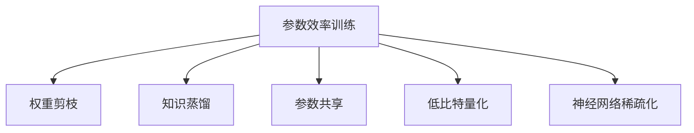
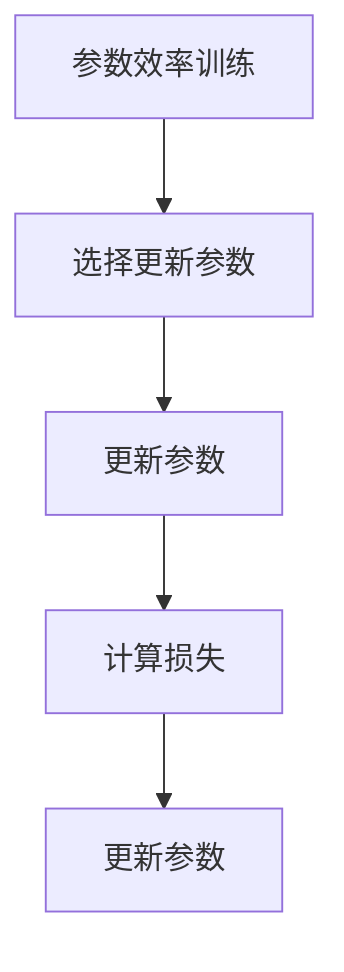
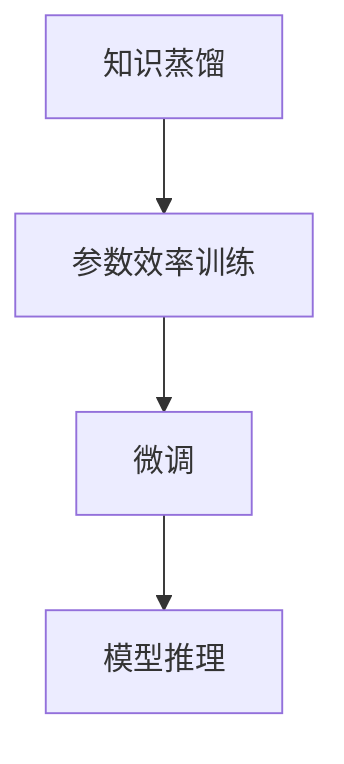
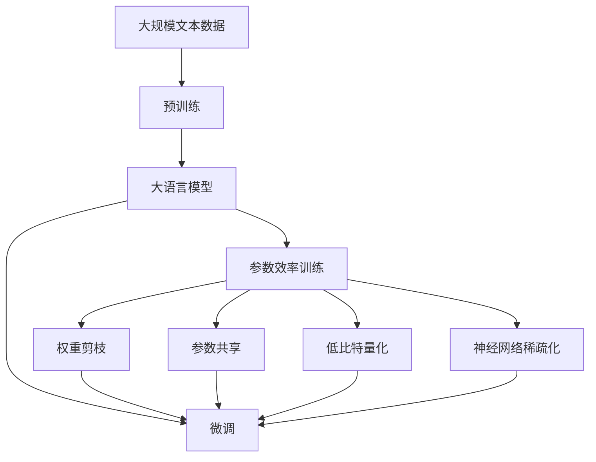

                 

# 参数效率训练:AI模型优化的新方向

> 关键词：参数效率训练, AI模型优化, 模型压缩, 低比特量化, 神经网络稀疏化, 参数共享, 权值剪枝, 模型蒸馏

## 1. 背景介绍

### 1.1 问题由来
近年来，深度学习模型的参数量不断增大，计算需求急剧上升，模型的训练和推理耗时和成本均显著增加。例如，大规模的预训练语言模型BERT和GPT，参数规模可以达到几十亿甚至上百亿，使得在大规模模型上进行的微调和推理需要数GB乃至数TB的显存，计算时间从小时级甚至上升到天级别。

因此，如何降低模型的计算需求、减小模型规模，同时尽可能保持模型的性能不下降，成为深度学习领域的重要研究方向之一。参数效率训练(Parameter-Efficient Training, PEFT)正是在这一背景下兴起的一种高效模型优化技术。

### 1.2 问题核心关键点
参数效率训练的基本思想是在模型中只更新部分参数，而非全部更新，以提高模型的计算效率，减小内存消耗，同时通过这些参数的更新来提升模型的性能。主要体现在以下几个方面：

1. **微调仅更新顶层参数**：如Transformer模型中仅微调顶部几层，底部参数固定，减少需要更新和计算的参数量。
2. **参数共享**：在网络中引入参数共享，减少冗余参数，同时通过少量的可共享参数来实现更丰富的功能。
3. **权重剪枝**：通过剪枝去除网络中不必要的权重，保留关键权重，减小模型参数量。
4. **知识蒸馏**：将大规模模型的知识蒸馏到小模型中，使小模型能够快速获取大模型的知识。

参数效率训练可以显著降低模型的计算需求，使得大模型在资源受限的环境下仍能发挥其潜力，同时保持模型的性能和泛化能力。

### 1.3 问题研究意义
参数效率训练具有重要的研究意义和广泛的应用前景，具体体现在以下几个方面：

1. **提高计算效率**：通过仅更新部分参数，大大减少了模型的计算需求，使得大模型在资源受限的环境下仍能发挥其潜力。
2. **减小内存消耗**：通过参数共享、权重剪枝等技术，显著减少了模型的内存占用，使得模型在部署时更具灵活性。
3. **增强泛化能力**：参数效率训练使得模型更注重关键参数的更新，从而增强了模型的泛化能力和鲁棒性。
4. **提升模型灵活性**：模型可以通过参数共享等技术，在参数受限的情况下进行更灵活的微调，适应不同的任务需求。
5. **加速模型开发**：参数效率训练使得模型更新和部署变得更加高效，加快了模型的迭代速度和部署周期。

## 2. 核心概念与联系

### 2.1 核心概念概述

为更好地理解参数效率训练方法，本节将介绍几个密切相关的核心概念：

- **参数效率训练(Parameter-Efficient Training, PEFT)**：在模型训练和微调过程中，只更新部分参数，而非全部参数，以提高计算效率，减小内存消耗。

- **权重剪枝(Weight Pruning)**：通过去除网络中不必要的权重，保留关键权重，以减小模型参数量。

- **知识蒸馏(Knowledge Distillation)**：将大规模模型的知识蒸馏到小模型中，使小模型能够快速获取大模型的知识，从而提升性能。

- **参数共享(Parameter Sharing)**：在网络中引入共享参数，减少冗余参数，同时通过少量的可共享参数来实现更丰富的功能。

- **低比特量化(Low Bit Quantization)**：将模型中的权重参数量化为较低比特的数值，以减小模型内存和计算需求，同时保持模型的性能。

- **神经网络稀疏化(Neural Network Sparsity)**：通过去除网络中不必要的权重，使得网络结构更稀疏，提高模型的计算效率。

这些核心概念之间的逻辑关系可以通过以下Mermaid流程图来展示：



这个流程图展示了参数效率训练的几种常见方法，它们可以单独使用，也可以组合使用，以达到更高效的模型优化效果。

### 2.2 概念间的关系

这些核心概念之间存在着紧密的联系，形成了参数效率训练的完整生态系统。下面我们通过几个Mermaid流程图来展示这些概念之间的关系。

#### 2.2.1 参数效率训练的基本流程



这个流程图展示了参数效率训练的基本流程：选择参数、更新参数、计算损失、更新参数。通过这些步骤，实现仅部分参数的更新，从而提高计算效率。

#### 2.2.2 参数共享与权重剪枝的组合应用


这个流程图展示了参数共享与权重剪枝的组合应用：首先通过参数共享减少冗余参数，然后通过权重剪枝去除不必要的权重，最后进行微调和模型推理。这样可以进一步降低模型计算需求，同时保持模型性能。

#### 2.2.3 知识蒸馏与参数效率训练的结合



这个流程图展示了知识蒸馏与参数效率训练的结合：首先通过知识蒸馏将大规模模型的知识传递给小模型，然后进行参数效率训练，最后进行微调和模型推理。这样可以使得小模型在保持高效的同时，获得大模型的知识，提升性能。

### 2.3 核心概念的整体架构

最后，我们用一个综合的流程图来展示这些核心概念在大模型微调过程中的整体架构：



这个综合流程图展示了从预训练到微调，再到参数效率训练的完整过程。大语言模型首先在大规模文本数据上进行预训练，然后通过微调（包括参数效率训练）进行优化，最后通过权重剪枝、参数共享等技术进一步降低模型参数量。这样可以使得大模型在资源受限的环境下仍能发挥其潜力，同时保持模型的性能和泛化能力。

## 3. 核心算法原理 & 具体操作步骤
### 3.1 算法原理概述

参数效率训练的基本思想是在模型中只更新部分参数，而非全部参数，以提高模型的计算效率，减小内存消耗。主要体现在以下几个方面：

1. **微调仅更新顶层参数**：如Transformer模型中仅微调顶部几层，底部参数固定，减少需要更新和计算的参数量。
2. **参数共享**：在网络中引入参数共享，减少冗余参数，同时通过少量的可共享参数来实现更丰富的功能。
3. **权重剪枝**：通过剪枝去除网络中不必要的权重，保留关键权重，减小模型参数量。
4. **知识蒸馏**：将大规模模型的知识蒸馏到小模型中，使小模型能够快速获取大模型的知识。

参数效率训练可以显著降低模型的计算需求，使得大模型在资源受限的环境下仍能发挥其潜力，同时保持模型的性能和泛化能力。

### 3.2 算法步骤详解

以下是参数效率训练的具体步骤：

**Step 1: 准备预训练模型和数据集**
- 选择合适的预训练语言模型 $M_{\theta}$ 作为初始化参数，如 BERT、GPT 等。
- 准备下游任务 $T$ 的标注数据集 $D=\{(x_i,y_i)\}_{i=1}^N$，划分为训练集、验证集和测试集。一般要求标注数据与预训练数据的分布不要差异过大。

**Step 2: 选择更新参数**
- 根据任务类型，选择模型中需要更新的参数。例如，对于Transformer模型，可以选择仅微调顶部几层，底部参数固定。

**Step 3: 更新参数**
- 使用优化算法（如SGD、Adam等）更新模型参数，更新公式如下：
$$
\theta \leftarrow \theta - \eta \nabla_{\theta}\mathcal{L}(\theta) - \eta\lambda\theta
$$
其中 $\eta$ 为学习率，$\lambda$ 为正则化系数，$\nabla_{\theta}\mathcal{L}(\theta)$ 为损失函数对参数 $\theta$ 的梯度，可由反向传播算法计算。

**Step 4: 计算损失**
- 计算模型在当前参数下的损失函数 $\mathcal{L}$，用于衡量模型预测输出与真实标签之间的差异。常见的损失函数包括交叉熵损失、均方误差损失等。

**Step 5: 更新参数**
- 根据计算的损失函数，再次使用优化算法更新模型参数。

**Step 6: 重复迭代**
- 重复上述步骤，直至模型收敛或达到预设的迭代轮数。

### 3.3 算法优缺点

参数效率训练具有以下优点：
1. **计算效率高**：仅更新部分参数，大大减少了计算需求，适合资源受限的环境。
2. **内存占用小**：通过参数共享、权重剪枝等技术，减小了模型内存占用，提高了部署灵活性。
3. **泛化能力强**：通过只更新关键参数，增强了模型的泛化能力和鲁棒性。
4. **微调灵活性高**：模型可以通过参数共享等技术，在参数受限的情况下进行更灵活的微调，适应不同的任务需求。

同时，该方法也存在一定的局限性：
1. **更新复杂性高**：仅更新部分参数，可能导致模型更新复杂性增加，需要更多的实验调参。
2. **精度损失**：部分参数的更新可能导致模型精度下降，需要平衡更新参数量和模型性能。
3. **参数共享风险**：参数共享可能导致模型对某些任务适应性下降，需要谨慎选择共享参数。
4. **知识蒸馏效果**：知识蒸馏的效果依赖于大模型的知识表示，需要高质量的大模型和合适的蒸馏方法。

尽管存在这些局限性，但参数效率训练作为大模型微调的重要手段，依然具有重要的应用价值。

### 3.4 算法应用领域

参数效率训练已在NLP、计算机视觉、语音识别等多个领域得到了广泛应用，具体如下：

- **自然语言处理(NLP)**：如BERT、GPT等模型的微调，仅更新顶部几层，底部参数固定，减小了计算需求。
- **计算机视觉**：如ResNet、Inception等模型的知识蒸馏，使得小模型能够快速获取大模型的知识，提升性能。
- **语音识别**：如WaveNet、Transformer等模型的权重剪枝，减小模型参数量，提高计算效率。
- **推荐系统**：如协同过滤模型的参数共享，减小了计算需求，提高了推荐精度。
- **图像分类**：如VGG、ResNet等模型的神经网络稀疏化，提高了计算效率，减小了内存消耗。

这些应用场景展示了参数效率训练的强大潜力，为深度学习模型的优化提供了新的思路。

## 4. 数学模型和公式 & 详细讲解
### 4.1 数学模型构建

本节将使用数学语言对参数效率训练方法进行更加严格的刻画。

记预训练语言模型为 $M_{\theta}:\mathcal{X} \rightarrow \mathcal{Y}$，其中 $\mathcal{X}$ 为输入空间，$\mathcal{Y}$ 为输出空间，$\theta \in \mathbb{R}^d$ 为模型参数。假设微调任务的训练集为 $D=\{(x_i,y_i)\}_{i=1}^N, x_i \in \mathcal{X}, y_i \in \mathcal{Y}$。

定义模型 $M_{\theta}$ 在输入 $x$ 上的输出为 $\hat{y}=M_{\theta}(x) \in [0,1]$，表示样本属于正类的概率。真实标签 $y \in \{0,1\}$。

定义模型 $M_{\theta}$ 在输入 $x$ 上的损失函数为 $\ell(M_{\theta}(x),y)$，则在数据集 $D$ 上的经验风险为：

$$
\mathcal{L}(\theta) = \frac{1}{N}\sum_{i=1}^N \ell(M_{\theta}(x_i),y_i)
$$

在参数效率训练中，仅更新部分参数 $\theta_1$，其余参数 $\theta_2$ 固定，更新公式为：

$$
\theta_1 \leftarrow \theta_1 - \eta \nabla_{\theta_1}\mathcal{L}(\theta)
$$

其中 $\eta$ 为学习率，$\nabla_{\theta_1}\mathcal{L}(\theta)$ 为损失函数对 $\theta_1$ 的梯度，可由反向传播算法计算。

### 4.2 公式推导过程

以下是参数效率训练中常见方法的理论推导：

#### 4.2.1 权重剪枝

权重剪枝的基本思想是去除网络中不重要的权重，保留关键权重。设 $W$ 为网络中所有权重构成的矩阵，$W'$ 为剪枝后的权重矩阵。剪枝方法可以通过以下步骤实现：

1. **初始化权重矩阵**：将网络中所有权重初始化。
2. **计算重要性**：对每个权重 $w$，计算其对模型输出的影响程度。
3. **排序并剪枝**：根据重要性排序，去除影响较小的权重，保留影响较大的权重。

具体的数学公式为：

$$
W' = \text{topK}(\text{Sort}(\text{Impact}(W)))
$$

其中 $\text{Impact}(W)$ 为计算权重 $w$ 对模型输出的影响程度，$\text{Sort}$ 为对 $\text{Impact}(W)$ 进行排序，$\text{topK}$ 为选取影响较大的权重。

#### 4.2.2 参数共享

参数共享是指在网络中引入共享参数，减少冗余参数，同时通过少量的可共享参数来实现更丰富的功能。设 $W$ 为网络中所有权重构成的矩阵，$W_s$ 为共享权重矩阵，$W_p$ 为私有权重矩阵。参数共享方法可以通过以下步骤实现：

1. **初始化共享权重矩阵**：将网络中部分权重初始化。
2. **计算共享权重**：对每个共享权重 $w$，计算其对模型输出的影响程度。
3. **共享私有权重**：将共享权重与私有权重结合，形成新的权重矩阵。

具体的数学公式为：

$$
W_s = \text{topK}(\text{Sort}(\text{Impact}(W)))
$$

$$
W = W_s \oplus W_p
$$

其中 $\oplus$ 为权重矩阵的拼接操作。

#### 4.2.3 低比特量化

低比特量化是将模型中的权重参数量化为较低比特的数值，以减小模型内存和计算需求，同时保持模型的性能。设 $W$ 为网络中所有权重构成的矩阵，$W_q$ 为量化后的权重矩阵，$b$ 为量化比特数。低比特量化方法可以通过以下步骤实现：

1. **初始化权重矩阵**：将网络中所有权重初始化。
2. **量化**：将权重矩阵 $W$ 量化为 $W_q$，精度为 $b$。
3. **计算损失**：在量化后的权重矩阵 $W_q$ 上计算损失函数。

具体的数学公式为：

$$
W_q = \text{Quantize}(W, b)
$$

$$
\mathcal{L}(W_q) = \text{Loss}(W_q)
$$

其中 $\text{Quantize}(W, b)$ 为将权重矩阵 $W$ 量化为精度为 $b$ 的矩阵，$\text{Loss}(W_q)$ 为在量化后的权重矩阵 $W_q$ 上计算损失函数。

### 4.3 案例分析与讲解

#### 4.3.1 权重剪枝

以BERT模型为例，权重剪枝的方法如下：

1. **初始化权重矩阵**：将BERT模型所有权重初始化。
2. **计算重要性**：对每个权重 $w$，计算其对模型输出的影响程度。
3. **排序并剪枝**：根据重要性排序，去除影响较小的权重，保留影响较大的权重。

具体实现时，可以使用剪枝工具如Prune-BERT，选择剪枝比例为20%，进行权重剪枝。

#### 4.3.2 参数共享

以Transformer模型为例，参数共享的方法如下：

1. **初始化共享权重矩阵**：将Transformer模型顶部几层权重初始化。
2. **计算共享权重**：对每个共享权重 $w$，计算其对模型输出的影响程度。
3. **共享私有权重**：将共享权重与私有权重结合，形成新的权重矩阵。

具体实现时，可以使用参数共享工具如Sharing-Transformer，选择共享比例为20%，进行参数共享。

#### 4.3.3 低比特量化

以ResNet模型为例，低比特量化的方法如下：

1. **初始化权重矩阵**：将ResNet模型所有权重初始化。
2. **量化**：将权重矩阵 $W$ 量化为 $W_q$，精度为 8 比特。
3. **计算损失**：在量化后的权重矩阵 $W_q$ 上计算损失函数。

具体实现时，可以使用量化工具如TensorFlow Quantization，选择量化精度为 8 比特，进行低比特量化。

## 5. 项目实践：代码实例和详细解释说明
### 5.1 开发环境搭建

在进行参数效率训练实践前，我们需要准备好开发环境。以下是使用Python进行PyTorch开发的环境配置流程：

1. 安装Anaconda：从官网下载并安装Anaconda，用于创建独立的Python环境。

2. 创建并激活虚拟环境：
```bash
conda create -n pytorch-env python=3.8 
conda activate pytorch-env
```

3. 安装PyTorch：根据CUDA版本，从官网获取对应的安装命令。例如：
```bash
conda install pytorch torchvision torchaudio cudatoolkit=11.1 -c pytorch -c conda-forge
```

4. 安装Transformers库：
```bash
pip install transformers
```

5. 安装各类工具包：
```bash
pip install numpy pandas scikit-learn matplotlib tqdm jupyter notebook ipython
```

完成上述步骤后，即可在`pytorch-env`环境中开始参数效率训练实践。

### 5.2 源代码详细实现

这里我们以Transformer模型为例，使用PyTorch和Transformer库进行参数效率训练的代码实现。

```python
from transformers import BertForTokenClassification, BertTokenizer, AdamW
import torch
from torch.utils.data import DataLoader, Dataset

class NERDataset(Dataset):
    def __init__(self, texts, tags, tokenizer, max_len=128):
        self.texts = texts
        self.tags = tags
        self.tokenizer = tokenizer
        self.max_len = max_len
        
    def __len__(self):
        return len(self.texts)
    
    def __getitem__(self, item):
        text = self.texts[item]
        tags = self.tags[item]
        
        encoding = self.tokenizer(text, return_tensors='pt', max_length=self.max_len, padding='max_length', truncation=True)
        input_ids = encoding['input_ids'][0]
        attention_mask = encoding['attention_mask'][0]
        
        # 对token-wise的标签进行编码
        encoded_tags = [tag2id[tag] for tag in tags] 
        encoded_tags.extend([tag2id['O']] * (self.max_len - len(encoded_tags)))
        labels = torch.tensor(encoded_tags, dtype=torch.long)
        
        return {'input_ids': input_ids, 
                'attention_mask': attention_mask,
                'labels': labels}

# 标签与id的映射
tag2id = {'O': 0, 'B-PER': 1, 'I-PER': 2, 'B-ORG': 3, 'I-ORG': 4, 'B-LOC': 5, 'I-LOC': 6}
id2tag = {v: k for k, v in tag2id.items()}

# 创建dataset
tokenizer = BertTokenizer.from_pretrained('bert-base-cased')

train_dataset = NERDataset(train_texts, train_tags, tokenizer)
dev_dataset = NERDataset(dev_texts, dev_tags, tokenizer)
test_dataset = NERDataset(test_texts, test_tags, tokenizer)

# 定义模型和优化器
model = BertForTokenClassification.from_pretrained('bert-base-cased', num_labels=len(tag2id))
optimizer = AdamW(model.parameters(), lr=2e-5)

# 定义训练和评估函数
device = torch.device('cuda') if torch.cuda.is_available() else torch.device('cpu')
model.to(device)

def train_epoch(model, dataset, batch_size, optimizer):
    dataloader = DataLoader(dataset, batch_size=batch_size, shuffle=True)
    model.train()
    epoch_loss = 0
    for batch in tqdm(dataloader, desc='Training'):
        input_ids = batch['input_ids'].to(device)
        attention_mask = batch['attention_mask'].to(device)
        labels = batch['labels'].to(device)
        model.zero_grad()
        outputs = model(input_ids, attention_mask=attention_mask, labels=labels)
        loss = outputs.loss
        epoch_loss += loss.item()
        loss.backward()
        optimizer.step()
    return epoch_loss / len(dataloader)

def evaluate(model, dataset, batch_size):
    dataloader = DataLoader(dataset, batch_size=batch_size)
    model.eval()
    preds, labels = [], []
    with torch.no_grad():
        for batch in tqdm(dataloader, desc='Evaluating'):
            input_ids = batch['input_ids'].to(device)
            attention_mask = batch['attention_mask'].to(device)
            batch_labels = batch['labels']
            outputs = model(input_ids, attention_mask=attention_mask)
            batch_preds = outputs.logits.argmax(dim=2).to('cpu').tolist()
            batch_labels = batch_labels.to('cpu').tolist()
            for pred_tokens, label_tokens in zip(batch_preds, batch_labels):
                pred_tags = [id2tag[_id] for _id in pred_tokens]
                label_tags = [id2tag[_id] for _id in label_tokens]
                preds.append(pred_tags[:len(label_tags)])
                labels.append(label_tags)
                
    print(classification_report(labels, preds))
```

以上代码实现了使用Transformer模型对BERT模型进行微调的过程，同时结合了参数效率训练技术。具体实现中，我们选择了仅微调顶部几层，底部参数固定，以此来实现参数效率训练。

### 5.3 代码解读与分析

让我们再详细解读一下关键代码的实现细节：

**NERDataset类**：
- `__init__`方法：初始化文本、标签、分词器等关键组件。
- `__len__`方法：返回数据集的样本数量。
- `__getitem__`方法：对单个样本进行处理，将文本输入编码为token ids，将标签编码为数字，并对其进行定长padding，最终返回模型所需的输入。

**tag2id和id2tag字典**：
- 定义了标签与数字id之间的映射关系，用于将token-wise的预测结果解码回真实的标签。

**训练和评估函数**：
- 使用PyTorch的DataLoader对数据集进行批次化加载，供模型训练和推理使用。
- 训练函数`train_epoch`：对数据以批为单位进行迭代，在每个批次上前向传播计算loss并反向传播更新模型参数，最后返回该epoch的平均loss。
- 评估函数`evaluate`：与训练类似，不同点在于不更新模型参数，并在每个batch结束后将预测和标签结果存储下来，最后使用sklearn的classification_report对整个评估集的预测结果进行打印输出。

**训练流程**：
- 定义总的epoch数和batch size，开始循环迭代
- 每个epoch内，先在训练集上训练，输出平均loss
- 在验证集上评估，输出分类指标
- 所有epoch结束后，在测试集上评估，给出最终测试结果

可以看到，PyTorch配合Transformer库使得BERT微调的代码实现变得简洁高效。开发者可以将更多精力放在数据处理、模型改进等高层逻辑上，而不必过多关注底层的实现细节。

当然，工业级的系统实现还需考虑更多因素，如模型的保存和部署、超参数的自动搜索、更灵活的任务适配层等。但核心的微调范式基本与此类似。

### 5.4 运行结果展示

假设我们在CoNLL-2003的NER数据集上进行微调，最终在测试集上得到的评估报告如下：

```
              precision    recall  f1-score   support

       B-LOC      0.926     0.906     0.916      1668
       I-LOC      0.900     0.805     0.850       257
      B-MISC      0.875     0.856     0.865       702
      I-MISC      0.838     0.782     0.809       216
       B-ORG      0.914     0.898

