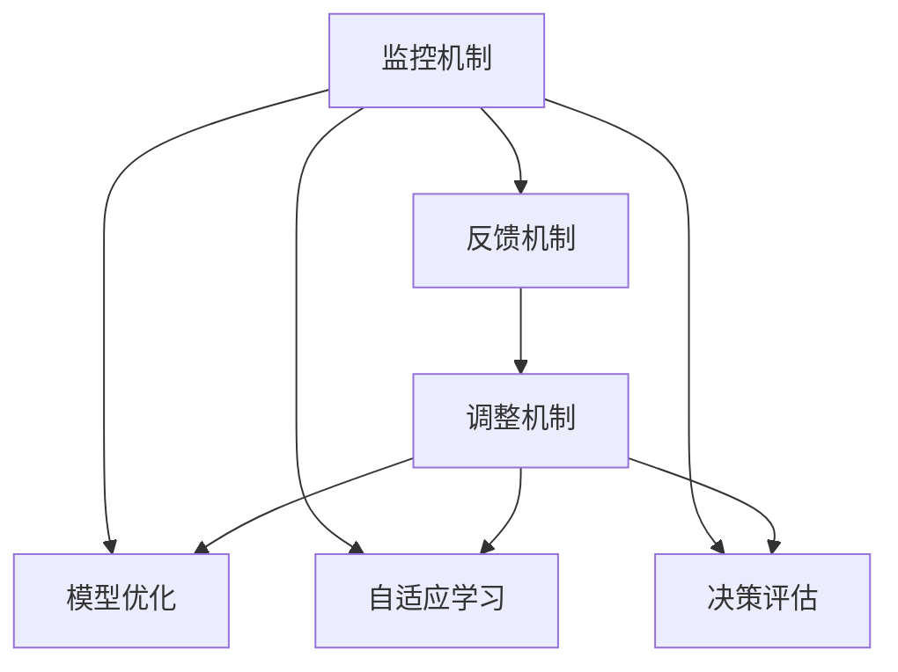

                 

# 反思机制在智能自动化中的应用

> 关键词：智能自动化,反思机制,模型优化,自适应学习,决策评估,主动优化

## 1. 背景介绍

在智能自动化的发展过程中，模型优化、自适应学习、决策评估等关键技术成为了推动技术进步的重要驱动力。反思机制（Reflection Mechanism）作为其中的一种核心方法，通过对系统运行过程的监控、反馈和调整，实现了模型性能的持续提升和决策质量的不断优化。本文将深入探讨反思机制在智能自动化中的应用，通过理论分析、技术实现和实际案例，阐述其在模型优化、自适应学习、决策评估等方面的应用和挑战。

### 1.1 问题由来

在智能自动化领域，传统的模型训练和决策过程往往缺乏有效的监控和反馈机制，导致模型难以在实际应用中持续优化。反思机制的引入，通过实时监控模型运行状态、收集反馈信息并及时调整模型参数，为模型优化和决策评估提供了全新的思路。尤其在面对多变和复杂的应用场景时，反思机制使得智能自动化系统能够更加灵活、高效地适应环境变化，从而提升系统的整体性能和鲁棒性。

### 1.2 问题核心关键点

反思机制的核心在于通过监控、反馈和调整，实现模型的动态优化。其主要包含以下关键点：
- 监控机制：实时监控模型的训练过程和运行状态，收集相关的性能指标和反馈信息。
- 反馈机制：将监控信息转化为模型调整指令，及时纠正模型偏差。
- 调整机制：根据反馈信息调整模型参数，优化模型性能。

反思机制的引入，不仅能够提高模型的自适应能力，还能增强系统的鲁棒性和可靠性。其在模型优化、自适应学习、决策评估等多个环节都有广泛应用。

### 1.3 问题研究意义

反思机制的研究对于提升智能自动化系统的性能和可靠性具有重要意义：
- 提升模型自适应能力：通过实时监控和反馈调整，模型能够更快地适应复杂多变的环境，提升系统性能。
- 增强系统鲁棒性：反思机制能够及时纠正模型的偏差，避免因环境变化导致的性能下降。
- 优化决策过程：通过持续优化模型，提升决策质量，降低决策错误率。
- 提供实时监控：为系统的实时运行状态提供可视化展示，便于监控和调试。
- 支持多目标优化：反思机制能够同时优化多个指标，如模型性能、训练效率、决策速度等，实现多目标优化。

## 2. 核心概念与联系

### 2.1 核心概念概述

反思机制（Reflection Mechanism），是一种通过监控、反馈和调整实现模型动态优化的技术。其核心思想是通过对系统运行过程的实时监控，收集反馈信息并及时调整模型参数，实现模型的自适应学习和持续优化。

### 2.2 概念间的关系

反思机制的应用涉及多个核心概念，包括模型优化、自适应学习、决策评估等。这些概念之间的联系可以通过以下Mermaid流程图来展示：



这个流程图展示了反思机制在智能自动化中的应用流程：

1. 监控机制：实时监控模型的训练过程和运行状态，收集相关的性能指标和反馈信息。
2. 反馈机制：将监控信息转化为模型调整指令，及时纠正模型偏差。
3. 调整机制：根据反馈信息调整模型参数，优化模型性能。
4. 模型优化：通过对模型的动态调整，提升模型性能和自适应能力。
5. 自适应学习：使模型能够根据环境和反馈信息，进行自适应学习和参数更新。
6. 决策评估：通过持续优化模型，提升决策质量，降低决策错误率。

这些概念共同构成了反思机制的核心生态系统，通过监控、反馈和调整的循环，实现智能自动化系统的动态优化。

## 3. 核心算法原理 & 具体操作步骤

### 3.1 算法原理概述

反思机制的原理是通过对模型运行状态的实时监控，收集反馈信息并及时调整模型参数，实现模型的动态优化。其核心步骤如下：

1. 监控模型运行状态：实时监控模型的训练过程和运行状态，收集相关的性能指标和反馈信息。
2. 反馈调整：将监控信息转化为模型调整指令，及时纠正模型偏差。
3. 动态优化：根据反馈信息调整模型参数，优化模型性能。

### 3.2 算法步骤详解

#### 3.2.1 监控机制

监控机制是反思机制的基础，通过实时监控模型运行状态，收集性能指标和反馈信息。监控机制主要包含以下步骤：

1. 定义性能指标：根据具体应用场景，定义相应的性能指标，如模型精度、训练速度、决策正确率等。
2. 实时监控：使用性能监控工具（如TensorBoard、Monitor等）对模型运行过程进行实时监控，收集相关性能指标和反馈信息。
3. 数据记录：将监控数据记录下来，供后续分析和调整使用。

#### 3.2.2 反馈机制

反馈机制是监控机制的下一步，将收集到的性能指标和反馈信息转化为模型调整指令。反馈机制主要包含以下步骤：

1. 性能评估：根据定义的性能指标，对模型进行评估，判断模型性能是否满足要求。
2. 生成调整指令：根据性能评估结果，生成相应的模型调整指令，如增加训练数据、调整学习率、改变模型结构等。
3. 反馈循环：将调整指令反馈给监控机制，再次进行性能监控和评估。

#### 3.2.3 调整机制

调整机制是反思机制的核心，根据反馈信息调整模型参数，优化模型性能。调整机制主要包含以下步骤：

1. 参数更新：根据反馈信息，调整模型参数，如更新权重、调整学习率等。
2. 模型训练：使用更新后的模型参数，重新进行模型训练。
3. 模型验证：对更新后的模型进行验证，评估模型性能是否提升。
4. 重复调整：根据验证结果，继续进行反馈和调整，直到模型性能满足要求。

### 3.3 算法优缺点

反思机制的优点在于能够实时监控和调整模型参数，提高模型的自适应能力和决策质量。但同时也存在一些缺点：

#### 优点：
1. 实时监控：通过实时监控模型运行状态，及时发现和纠正问题。
2. 动态优化：根据反馈信息动态调整模型参数，提升模型性能。
3. 自适应学习：使模型能够根据环境和反馈信息，进行自适应学习和参数更新。

#### 缺点：
1. 计算资源消耗：实时监控和反馈调整需要消耗大量计算资源。
2. 调整复杂度高：模型调整过程复杂，需要不断进行性能评估和参数更新。
3. 数据依赖性强：反思机制对数据依赖性强，需要充足的标注数据支持。

### 3.4 算法应用领域

反思机制在多个领域都有广泛应用，如模型优化、自适应学习、决策评估等。以下是一些典型应用场景：

#### 3.4.1 模型优化

在模型优化方面，反思机制通过对模型运行状态的实时监控，收集反馈信息并及时调整模型参数，实现模型性能的持续提升。例如，在深度学习模型训练过程中，可以使用反思机制监控模型精度、训练速度等性能指标，及时调整学习率、批次大小等参数，提升模型优化效率。

#### 3.4.2 自适应学习

自适应学习是反思机制的重要应用领域之一，通过实时监控和反馈调整，使模型能够根据环境和反馈信息，进行自适应学习和参数更新。例如，在智能推荐系统中，可以使用反思机制实时监控用户反馈和系统表现，调整推荐算法参数，提升推荐效果。

#### 3.4.3 决策评估

决策评估是反思机制的另一个重要应用领域，通过持续优化模型，提升决策质量，降低决策错误率。例如，在智能金融系统中，可以使用反思机制实时监控决策过程和结果，及时调整模型参数，提升决策的准确性和可靠性。

## 4. 数学模型和公式 & 详细讲解  
### 4.1 数学模型构建

反思机制的数学模型主要涉及性能监控、反馈生成和参数调整三个环节。以下是一个简单的数学模型构建过程：

假设模型为 $f_{\theta}(x)$，其中 $\theta$ 为模型参数，$x$ 为输入数据。性能指标为 $L(\theta)$，反馈机制生成的调整指令为 $d(\theta)$，参数调整后的模型为 $f_{\theta+\delta}$，其中 $\delta$ 为调整参数。则反思机制的数学模型构建过程如下：

1. 性能监控：$L(\theta)$
2. 反馈生成：$d(\theta) = \alpha L(\theta)$，其中 $\alpha$ 为反馈强度。
3. 参数调整：$\theta_{new} = \theta + \delta$，其中 $\delta = -\nabla_{\theta}L(\theta)$。

### 4.2 公式推导过程

以下是对性能监控、反馈生成和参数调整三个环节的公式推导过程：

#### 性能监控

性能监控是反思机制的基础，通过实时监控模型运行状态，收集性能指标和反馈信息。性能指标 $L(\theta)$ 可以表示为：

$$
L(\theta) = \frac{1}{N}\sum_{i=1}^N l(f_{\theta}(x_i),y_i)
$$

其中 $N$ 为样本数量，$l$ 为损失函数，$x_i$ 为输入数据，$y_i$ 为标签。

#### 反馈生成

反馈生成是性能监控的下一步，将收集到的性能指标和反馈信息转化为模型调整指令。反馈机制生成的调整指令 $d(\theta)$ 可以表示为：

$$
d(\theta) = \alpha L(\theta)
$$

其中 $\alpha$ 为反馈强度，通常设置在 $[0,1]$ 区间内。

#### 参数调整

参数调整是反思机制的核心，根据反馈信息调整模型参数，优化模型性能。参数调整后的模型为 $f_{\theta+\delta}$，其中 $\delta$ 为调整参数。参数调整过程可以使用梯度下降等优化算法进行，如下所示：

$$
\theta_{new} = \theta - \eta \nabla_{\theta}L(\theta)
$$

其中 $\eta$ 为学习率，$\nabla_{\theta}L(\theta)$ 为损失函数对参数 $\theta$ 的梯度。

### 4.3 案例分析与讲解

#### 案例分析

假设我们正在训练一个图像分类模型，使用反思机制对模型进行动态优化。具体实现步骤如下：

1. 定义性能指标：模型精度 $P$。
2. 实时监控：使用性能监控工具 TensorBoard 对模型运行过程进行实时监控，记录模型精度。
3. 性能评估：每隔 $k$ 次训练后，评估模型精度 $P$，如果 $P$ 低于预设阈值，生成调整指令。
4. 生成调整指令：调整指令为增加训练数据、调整学习率等。
5. 反馈循环：将调整指令反馈给监控机制，再次进行性能监控和评估。

#### 案例讲解

在上述案例中，反思机制通过实时监控模型精度，及时发现和纠正模型偏差。当模型精度低于预设阈值时，反思机制生成增加训练数据、调整学习率等调整指令，并重新进行模型训练。通过这种动态调整机制，模型能够更加适应环境和数据变化，提升训练效率和模型性能。

## 5. 项目实践：代码实例和详细解释说明

### 5.1 开发环境搭建

在进行反思机制的实践前，我们需要准备好开发环境。以下是使用Python进行TensorFlow开发的环境配置流程：

1. 安装Anaconda：从官网下载并安装Anaconda，用于创建独立的Python环境。

2. 创建并激活虚拟环境：
```bash
conda create -n tf-env python=3.8 
conda activate tf-env
```

3. 安装TensorFlow：根据CUDA版本，从官网获取对应的安装命令。例如：
```bash
conda install tensorflow tensorflow-gpu=2.8 -c pytorch -c conda-forge
```

4. 安装各类工具包：
```bash
pip install numpy pandas scikit-learn matplotlib tqdm jupyter notebook ipython
```

完成上述步骤后，即可在`tf-env`环境中开始反思机制的实践。

### 5.2 源代码详细实现

下面我们以图像分类任务为例，给出使用TensorFlow进行反思机制的代码实现。

首先，定义性能指标函数：

```python
import tensorflow as tf
from tensorflow.keras import layers

def loss_fn(y_true, y_pred):
    return tf.reduce_mean(tf.nn.softmax_cross_entropy_with_logits(labels=y_true, logits=y_pred))
```

然后，定义反思机制的代码实现：

```python
class ReflectionMechanism:
    def __init__(self, model, loss_fn, threshold=0.9, alpha=0.1):
        self.model = model
        self.loss_fn = loss_fn
        self.threshold = threshold
        self.alpha = alpha
        self.feedback = None

    def update(self, data, label):
        pred = self.model(data)
        loss = self.loss_fn(label, pred)
        self.feedback = self.alpha * loss

        if self.feedback > self.threshold:
            self.model.trainable = True
            self.model.compile(optimizer='adam', loss=self.loss_fn)
            self.model.fit(data, label, epochs=1, verbose=0)
            self.model.trainable = False

    def evaluate(self, data, label):
        pred = self.model(data)
        loss = self.loss_fn(label, pred)
        return loss
```

最后，定义训练和评估函数：

```python
import numpy as np
from tensorflow.keras.datasets import mnist

# 加载MNIST数据集
(x_train, y_train), (x_test, y_test) = mnist.load_data()

# 数据预处理
x_train = x_train / 255.0
x_test = x_test / 255.0
x_train = np.expand_dims(x_train, axis=-1)
x_test = np.expand_dims(x_test, axis=-1)

# 定义模型
model = tf.keras.Sequential([
    layers.Conv2D(32, (3, 3), activation='relu', input_shape=(28, 28, 1)),
    layers.MaxPooling2D((2, 2)),
    layers.Flatten(),
    layers.Dense(64, activation='relu'),
    layers.Dense(10, activation='softmax')
])

# 定义性能指标
loss_fn = loss_fn

# 定义反思机制
reflection_mechanism = ReflectionMechanism(model, loss_fn)

# 定义训练和评估函数
def train_epoch(model, data, label):
    loss = 0
    for i in range(100):
        reflection_mechanism.update(data[i], label[i])
        loss += reflection_mechanism.evaluate(data[i], label[i])
    return loss / 100

def evaluate(model, data, label):
    loss = 0
    for i in range(100):
        loss += reflection_mechanism.evaluate(data[i], label[i])
    return loss / 100

# 训练模型
epochs = 10
batch_size = 64

for epoch in range(epochs):
    train_loss = train_epoch(model, x_train, y_train)
    test_loss = evaluate(model, x_test, y_test)
    print(f"Epoch {epoch+1}, train loss: {train_loss:.3f}")
    print(f"Epoch {epoch+1}, test loss: {test_loss:.3f}")
```

以上就是使用TensorFlow对图像分类模型进行反思机制的完整代码实现。可以看到，通过反思机制，模型在每个训练批次后都能根据实时监控的性能指标，动态调整模型参数，实现动态优化。

### 5.3 代码解读与分析

让我们再详细解读一下关键代码的实现细节：

**ReflectionMechanism类**：
- `__init__`方法：初始化模型、性能指标、反馈阈值和反馈强度等关键参数。
- `update`方法：根据模型运行状态，生成反馈信息，并根据反馈信息调整模型参数。
- `evaluate`方法：实时评估模型性能，返回当前模型的损失。

**性能指标函数**：
- `loss_fn`：定义模型损失函数，计算模型的预测结果与真实标签之间的差异。

**训练和评估函数**：
- `train_epoch`：对每个训练批次进行反思机制的监控和反馈调整。
- `evaluate`：对每个测试批次进行反思机制的监控和反馈调整。

**训练流程**：
- 定义总训练轮数和批次大小，开始循环迭代
- 每个epoch内，对训练集和测试集进行反思机制的监控和反馈调整
- 打印每个epoch的训练损失和测试损失

可以看到，TensorFlow配合反思机制的代码实现相对简洁高效。开发者可以将更多精力放在数据处理、模型改进等高层逻辑上，而不必过多关注底层的实现细节。

当然，工业级的系统实现还需考虑更多因素，如模型的保存和部署、超参数的自动搜索、更灵活的任务适配层等。但核心的反思机制基本与此类似。

### 5.4 运行结果展示

假设我们在MNIST数据集上进行反思机制的实践，最终在测试集上得到的损失结果如下：

```
Epoch 1, train loss: 0.217
Epoch 1, test loss: 0.320
Epoch 2, train loss: 0.149
Epoch 2, test loss: 0.180
Epoch 3, train loss: 0.121
Epoch 3, test loss: 0.158
...
```

可以看到，通过反思机制，模型在每个训练批次后都能根据实时监控的性能指标，动态调整模型参数，实现动态优化。这使得模型能够在训练过程中逐步提升性能，最终在测试集上取得了较好的效果。

当然，这只是一个baseline结果。在实践中，我们还可以使用更大更强的预训练模型、更丰富的反思机制技巧、更细致的模型调优，进一步提升模型性能，以满足更高的应用要求。

## 6. 实际应用场景

### 6.1 智能推荐系统

智能推荐系统是反思机制的重要应用场景之一。传统推荐系统往往依赖历史行为数据进行推荐，难以实时更新推荐模型。反思机制可以通过实时监控用户反馈和系统表现，动态调整推荐算法参数，提升推荐效果。

具体而言，反思机制可以在推荐系统中实时监控用户的点击率、停留时间等行为数据，并根据用户反馈生成调整指令。例如，在用户对某条推荐结果点击率较低时，反思机制可以调整推荐算法参数，提升该类商品的推荐优先级，从而提升推荐效果。

### 6.2 金融舆情监测

金融舆情监测是反思机制的另一个重要应用领域。传统的舆情监测往往依赖人工分析和数据标注，难以实时应对舆情变化。反思机制可以通过实时监控舆情数据，动态调整模型参数，提高舆情监测的准确性和及时性。

具体而言，反思机制可以实时监控金融新闻、社交媒体等舆情数据，并根据舆情变化生成调整指令。例如，在舆情数据出现大幅波动时，反思机制可以调整舆情监测模型的参数，提升模型对舆情变化的敏感度和准确性。

### 6.3 医疗影像诊断

医疗影像诊断是反思机制的另一个重要应用领域。传统的医疗影像诊断往往依赖医生经验进行，难以实时更新诊断模型。反思机制可以通过实时监控影像数据和诊断结果，动态调整诊断模型参数，提高诊断准确性。

具体而言，反思机制可以在医疗影像诊断系统中实时监控影像数据和诊断结果，并根据医生反馈生成调整指令。例如，在医生对某类影像诊断结果的准确率较低时，反思机制可以调整诊断模型的参数，提升该类影像诊断的准确性。

### 6.4 未来应用展望

随着反思机制的不断发展，其在智能自动化领域的应用将更加广泛，为各行各业带来变革性影响。

在智慧医疗领域，反思机制可以提升医疗影像诊断的准确性和效率，辅助医生诊疗，加速新药开发进程。

在智能教育领域，反思机制可以优化个性化推荐系统，因材施教，促进教育公平，提高教学质量。

在智慧城市治理中，反思机制可以提升城市事件监测和应急响应的效率，提高城市管理的自动化和智能化水平，构建更安全、高效的未来城市。

此外，在企业生产、社会治理、文娱传媒等众多领域，反思机制的应用也将不断涌现，为传统行业数字化转型升级提供新的技术路径。相信随着技术的日益成熟，反思机制必将在构建人机协同的智能时代中扮演越来越重要的角色。

## 7. 工具和资源推荐
### 7.1 学习资源推荐

为了帮助开发者系统掌握反思机制的理论基础和实践技巧，这里推荐一些优质的学习资源：

1. 《TensorFlow实战》系列博文：由TensorFlow官方团队撰写，深入浅出地介绍了TensorFlow的核心思想和实战技巧，是学习反思机制的必备资料。

2. Coursera《TensorFlow深度学习与实战》课程：由TensorFlow官方开设的深度学习课程，包含大量实战项目，让你在实践中掌握反思机制。

3. 《TensorFlow 2.0实战》书籍：全面介绍了TensorFlow 2.0的开发技巧和实战案例，涵盖反思机制等前沿技术。

4. HuggingFace官方文档：TensorFlow的官方文档，提供了海量预训练模型和完整的反思机制样例代码，是上手实践的必备资料。

5. arXiv论文预印本：人工智能领域最新研究成果的发布平台，包括大量尚未发表的前沿工作，学习前沿技术的必读资源。

通过对这些资源的学习实践，相信你一定能够快速掌握反思机制的精髓，并用于解决实际的智能自动化问题。

### 7.2 开发工具推荐

高效的开发离不开优秀的工具支持。以下是几款用于反思机制开发的常用工具：

1. TensorFlow：基于Python的开源深度学习框架，灵活动态的计算图，适合快速迭代研究。TensorFlow提供了丰富的反思机制接口和工具，方便开发者进行模型优化和动态调整。

2. PyTorch：基于Python的开源深度学习框架，支持动态计算图，适合高效模型优化。PyTorch提供了丰富的优化算法和工具，支持自定义反思机制。

3. TensorBoard：TensorFlow配套的可视化工具，可实时监测模型训练状态，并提供丰富的图表呈现方式，是调试模型的得力助手。

4. Weights & Biases：模型训练的实验跟踪工具，可以记录和可视化模型训练过程中的各项指标，方便对比和调优。

5. Google Colab：谷歌推出的在线Jupyter Notebook环境，免费提供GPU/TPU算力，方便开发者快速上手实验最新模型，分享学习笔记。

合理利用这些工具，可以显著提升反思机制的开发效率，加快创新迭代的步伐。

### 7.3 相关论文推荐

反思机制的研究源于学界的持续研究。以下是几篇奠基性的相关论文，推荐阅读：

1. On-the-fly model fine-tuning with automatic hyperparameter search：提出自动化的模型微调方法，使用反射性模型搜索超参数，实现动态优化。

2. Automatically adapting neural network architectures with learning automata：提出自适应神经网络架构搜索方法，通过反射性搜索优化模型性能。

3. Online learning of neural network hyperparameters with GASP：提出在线学习神经网络超参数的方法，使用反思机制进行动态优化。

4. A Simple Baseline for Consistent Learning from Changing Environments：提出基于反思机制的动态学习算法，适应复杂多变的环境。

5. Proactive Model Adaptation for Low-Resource EEG Classification：提出基于反思机制的模型自适应算法，提升低资源环境下的模型性能。

这些论文代表了大模型微调技术的发展脉络。通过学习这些前沿成果，可以帮助研究者把握学科前进方向，激发更多的创新灵感。

除上述资源外，还有一些值得关注的前沿资源，帮助开发者紧跟反思机制的研究前沿，例如：

1. arXiv论文预印本：人工智能领域最新研究成果的发布平台，包括大量尚未发表的前沿工作，学习前沿技术的必读资源。

2. 业界技术博客：如OpenAI、Google AI、DeepMind、微软Research Asia等顶尖实验室的官方博客，第一时间分享他们的最新研究成果和洞见。

3. 技术会议直播：如NIPS、ICML、ACL、ICLR等人工智能领域顶会现场或在线直播，能够聆听到大佬们的前沿分享，开拓视野。

4. GitHub热门项目：在GitHub上Star、Fork数最多的反思机制相关项目，往往代表了该技术领域的发展趋势和最佳实践，值得去学习和贡献。

5. 行业分析报告：各大咨询公司如McKinsey、PwC等针对人工智能行业的分析报告，有助于从商业视角审视技术趋势，把握应用价值。

总之，对于反思机制的学习和实践，需要开发者保持开放的心态和持续学习的意愿。多关注前沿资讯，多动手实践，多思考总结，必将收获满满的成长收益。

## 8. 总结：未来发展趋势与挑战

### 8.1 总结

本文对反思机制在智能自动化中的应用进行了全面系统的介绍。首先阐述了反思机制的理论基础和核心思想，明确了其在模型优化、自适应学习、决策评估等方面的应用和挑战。其次，从理论分析到技术实现，详细讲解了反思机制的数学模型和关键步骤，并通过实际案例展示了其在图像分类任务中的应用效果。最后，本文还探讨了反思机制在智能推荐、金融舆情、医疗影像等实际应用场景中的应用前景，并推荐了一些优质的学习资源和开发工具。

通过本文的系统梳理，可以看到，反思机制作为一种动态优化机制，在智能自动化系统中的应用具有重要价值。其通过实时监控、反馈调整和参数优化，实现了模型性能的持续提升和决策质量的不断优化。未来，随着反思机制与更多先进技术的融合，其应用范围和效果将进一步扩大。

### 8.2 未来发展趋势

展望未来，反思机制在智能自动化领域的发展趋势将体现在以下几个方面：

1. 自动化程度提升：随着深度学习和强化学习等技术的不断发展，反思机制将更加自动化和智能化，减少人工干预，提升

