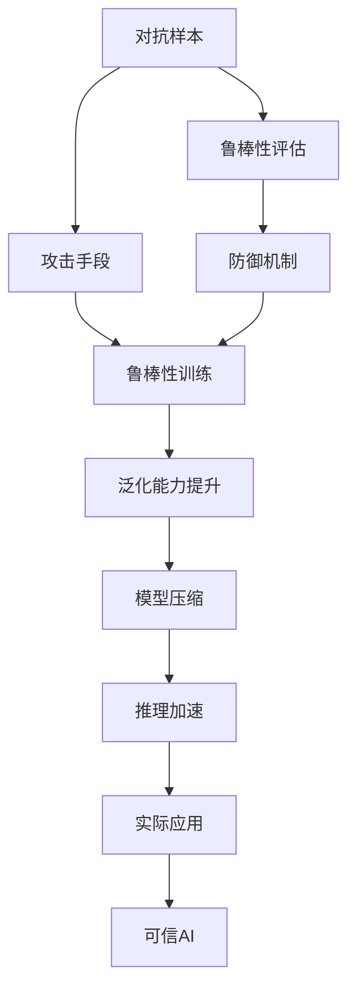

                 

# 可信AI与模型鲁棒性原理与代码实战案例讲解

> 关键词：可信AI, 模型鲁棒性, 对抗样本, 噪声鲁棒性, 泛化能力, 代码实战, 自然语言处理(NLP)

## 1. 背景介绍

### 1.1 问题由来
随着人工智能技术的快速发展，尤其是深度学习模型的应用日益广泛，其在医疗、金融、交通等关键领域的应用变得越来越普遍。然而，深度学习模型的鲁棒性问题逐渐成为制约其应用的重要瓶颈。例如，对抗样本攻击可以轻易欺骗模型，导致严重的误诊或误判；模型对噪声数据的处理能力不足，难以适应实际复杂的场景变化；模型在处理新样本时，泛化能力差，可能无法适应未知数据。这些问题直接关系到模型的可靠性和安全性，对社会的信任度产生了严重影响。

### 1.2 问题核心关键点
确保深度学习模型的鲁棒性，是大模型应用的重要课题。模型的鲁棒性涉及模型对对抗样本、噪声、数据分布变化的适应能力，以及模型在实际应用中的泛化能力。提高模型的鲁棒性，需要从模型设计和数据处理两个方面进行综合考虑，确保模型在不同场景下都能稳定、准确地运行。

### 1.3 问题研究意义
提高模型的鲁棒性，有助于增强模型的可信度，减少误判误诊，提高系统的可靠性。特别是在医疗、金融、法律等高风险领域，模型的鲁棒性直接关系到人的生命和财产安全。因此，提高模型的鲁棒性，是当前深度学习研究的重要方向之一，也是未来人工智能技术落地应用的关键。

## 2. 核心概念与联系

### 2.1 核心概念概述

为更好地理解模型鲁棒性的实现原理，本节将介绍几个关键概念：

- **对抗样本(Adversarial Examples)**：通过对输入数据进行微小扰动，使得模型输出结果发生错误的现象。对抗样本可以用于评估模型的鲁棒性，同时也可以用于攻击模型。

- **噪声鲁棒性(Noise Robustness)**：模型对噪声数据的处理能力，即在数据中存在干扰、噪声的情况下，模型仍能准确地提取信息。

- **泛化能力(Generalization)**：模型在新数据上的表现，即在未知数据集上也能取得良好的预测性能。

- **可解释性(Explainability)**：模型输出的解释和推理过程的透明度，即模型决策的逻辑和依据。

- **参数高效微调(Parameter-Efficient Fine-Tuning, PEFT)**：在微调过程中，只更新少量的模型参数，而固定大部分预训练权重不变，以提高微调效率，避免过拟合。

- **模型压缩(Model Compression)**：通过剪枝、量化等方法，减小模型大小，提高推理速度。

这些概念之间相互关联，共同构成了深度学习模型的鲁棒性保障体系。以下通过Mermaid流程图展示这些概念之间的关系：



### 2.2 概念间的关系

这些概念之间存在着紧密的联系，形成了深度学习模型鲁棒性的完整保障体系。

- **对抗样本与鲁棒性评估**：对抗样本用于评估模型的鲁棒性，通过构建和识别对抗样本，可以发现模型的不足和弱点。
- **攻击手段与防御机制**：攻击手段是模型鲁棒性的威胁，防御机制是提升模型鲁棒性的手段。
- **鲁棒性训练与泛化能力提升**：鲁棒性训练通过强化模型的对干扰和噪声的适应能力，提升模型的泛化能力。
- **模型压缩与推理加速**：模型压缩减小了模型大小，加速了推理过程，使得模型更加适用于实际应用场景。

通过理解这些概念之间的关系，我们可以更好地把握模型鲁棒性的实现路径和保障体系。

## 3. 核心算法原理 & 具体操作步骤
### 3.1 算法原理概述

模型鲁棒性的实现原理主要涉及两个方面：

1. **鲁棒性训练(Robust Training)**：通过对模型进行有针对性的训练，使其对对抗样本、噪声和数据分布变化具有更强的适应能力。
2. **鲁棒性评估(Robustness Evaluation)**：通过构建和识别对抗样本，评估模型的鲁棒性，发现和改进模型的不足。

### 3.2 算法步骤详解

**Step 1: 准备训练数据和对抗样本**
- 收集大量标注数据和对抗样本，将数据划分为训练集、验证集和测试集。对抗样本可以通过对原始数据进行微小扰动生成，也可以通过对抗样本生成算法自动生成。

**Step 2: 设计鲁棒性训练目标**
- 选择合适的损失函数，如对抗样本损失、噪声鲁棒性损失等，作为模型训练的目标函数。
- 结合对抗样本和噪声数据，设计训练过程中正则化和优化算法。

**Step 3: 执行鲁棒性训练**
- 使用梯度下降等优化算法，最小化鲁棒性损失函数，更新模型参数。
- 周期性在验证集上评估模型性能，根据性能指标决定是否触发 Early Stopping。
- 重复上述步骤直至满足预设的迭代轮数或 Early Stopping 条件。

**Step 4: 鲁棒性评估**
- 使用对抗样本生成算法生成对抗样本，对测试集进行鲁棒性评估。
- 统计模型在对抗样本下的表现，评估其鲁棒性。

**Step 5: 优化模型**
- 根据评估结果，进一步优化模型结构、调整超参数、改进训练方法，以提升模型鲁棒性。

### 3.3 算法优缺点

**优点**：
- 鲁棒性训练能够显著提高模型对对抗样本、噪声和数据分布变化的适应能力，提升模型的泛化能力。
- 鲁棒性评估能够及时发现模型的不足，提供改进方向。

**缺点**：
- 鲁棒性训练需要更多的数据和计算资源，尤其是在对抗样本生成和验证过程中。
- 对抗样本和噪声数据的生成可能存在一定的随机性，难以完全覆盖所有攻击手段和噪声类型。

### 3.4 算法应用领域

模型鲁棒性广泛应用于以下领域：

- **医疗诊断**：深度学习模型在医疗诊断中的应用，如X光片、CT扫描、MRI等医学影像的自动分析。鲁棒性训练和评估能够提高模型对异常样本和噪声的适应能力，减少误诊率。

- **金融交易**：深度学习模型在金融交易中的应用，如高频交易、股票预测、风险管理等。鲁棒性训练和评估能够增强模型对异常数据和攻击手段的抵御能力，保护金融机构和投资者的利益。

- **自动驾驶**：深度学习模型在自动驾驶中的应用，如车辆感知、路径规划、交通信号识别等。鲁棒性训练和评估能够提高模型对环境变化的适应能力，确保驾驶安全性。

- **安防监控**：深度学习模型在安防监控中的应用，如视频识别、人脸识别、行为分析等。鲁棒性训练和评估能够增强模型对恶意攻击和干扰的抵御能力，提高系统可靠性。

- **自然语言处理(NLP)**：深度学习模型在NLP中的应用，如机器翻译、文本分类、情感分析等。鲁棒性训练和评估能够提高模型对噪声和对抗样本的适应能力，增强模型的解释性和可信度。

以上领域只是模型鲁棒性应用的冰山一角，随着深度学习技术的不断发展和应用场景的拓展，鲁棒性训练和评估的应用领域将会更加广泛。

## 4. 数学模型和公式 & 详细讲解 & 举例说明
### 4.1 数学模型构建

模型鲁棒性训练的数学模型可以表示为：

$$
\min_{\theta} \mathcal{L}_{robust}(\theta) = \mathcal{L}_{adv}(\theta) + \mathcal{L}_{noise}(\theta)
$$

其中 $\theta$ 表示模型参数，$\mathcal{L}_{adv}(\theta)$ 为对抗样本损失，$\mathcal{L}_{noise}(\theta)$ 为噪声鲁棒性损失。

### 4.2 公式推导过程

以对抗样本损失为例，假设模型在输入 $x$ 上的输出为 $y = M_{\theta}(x)$，对抗样本为 $x_{adv} = x + \epsilon$，其中 $\epsilon$ 为扰动向量。对抗样本损失函数可以定义为：

$$
\mathcal{L}_{adv}(\theta) = \mathbb{E}_{\epsilon} \| M_{\theta}(x + \epsilon) - y \|^2
$$

其中 $\mathbb{E}_{\epsilon}$ 表示对抗样本 $\epsilon$ 的期望，$\| \cdot \|$ 表示向量范数。

将对抗样本损失函数扩展到训练数据集，得到：

$$
\mathcal{L}_{adv}(\theta) = \frac{1}{N} \sum_{i=1}^N \mathbb{E}_{\epsilon} \| M_{\theta}(x_i + \epsilon) - y_i \|^2
$$

对模型参数 $\theta$ 进行优化，最小化对抗样本损失函数：

$$
\theta \leftarrow \theta - \eta \nabla_{\theta}\mathcal{L}_{adv}(\theta)
$$

其中 $\eta$ 为学习率，$\nabla_{\theta}\mathcal{L}_{adv}(\theta)$ 为对抗样本损失对模型参数 $\theta$ 的梯度。

### 4.3 案例分析与讲解

以图像分类任务为例，介绍对抗样本损失函数的构建和训练过程。假设模型为卷积神经网络，输入为图像 $x$，输出为类别 $y$，对抗样本为 $x_{adv} = x + \epsilon$，其中 $\epsilon$ 为对抗向量。

首先，定义对抗样本生成器，生成扰动向量 $\epsilon$：

$$
\epsilon = \delta * sigmoid(\delta * x)
$$

其中 $\delta$ 为扰动矩阵，$sigmoid$ 函数将扰动向量归一化。

然后，计算对抗样本损失：

$$
\mathcal{L}_{adv}(\theta) = \mathbb{E}_{\epsilon} \| M_{\theta}(x + \epsilon) - y \|^2
$$

在训练过程中，最小化对抗样本损失函数，更新模型参数：

$$
\theta \leftarrow \theta - \eta \nabla_{\theta}\mathcal{L}_{adv}(\theta)
$$

最终，在测试集上评估模型性能，验证其鲁棒性：

$$
\min_{\theta} \mathcal{L}_{adv}(\theta) + \mathcal{L}_{noise}(\theta)
$$

## 5. 项目实践：代码实例和详细解释说明
### 5.1 开发环境搭建

在进行模型鲁棒性实践前，我们需要准备好开发环境。以下是使用Python进行PyTorch开发的环境配置流程：

1. 安装Anaconda：从官网下载并安装Anaconda，用于创建独立的Python环境。

2. 创建并激活虚拟环境：
```bash
conda create -n pytorch-env python=3.8 
conda activate pytorch-env
```

3. 安装PyTorch：根据CUDA版本，从官网获取对应的安装命令。例如：
```bash
conda install pytorch torchvision torchaudio cudatoolkit=11.1 -c pytorch -c conda-forge
```

4. 安装TensorFlow：
```bash
pip install tensorflow==2.7
```

5. 安装各类工具包：
```bash
pip install numpy pandas scikit-learn matplotlib tqdm jupyter notebook ipython
```

完成上述步骤后，即可在`pytorch-env`环境中开始模型鲁棒性实践。

### 5.2 源代码详细实现

这里以对抗样本生成和鲁棒性训练为例，给出使用TensorFlow进行对抗样本生成和PyTorch进行鲁棒性训练的代码实现。

首先，定义对抗样本生成器：

```python
import tensorflow as tf

def generate_advanced_samples(x, epsilon):
    delta = epsilon * tf.math.sign(x)  # 计算扰动向量
    advanced_x = x + delta  # 生成对抗样本
    return advanced_x
```

然后，定义模型和优化器：

```python
import torch.nn as nn
import torch.optim as optim

model = nn.Sequential(
    nn.Conv2d(3, 64, kernel_size=3, stride=1, padding=1),
    nn.ReLU(),
    nn.MaxPool2d(kernel_size=2, stride=2),
    nn.Conv2d(64, 128, kernel_size=3, stride=1, padding=1),
    nn.ReLU(),
    nn.MaxPool2d(kernel_size=2, stride=2),
    nn.Flatten(),
    nn.Linear(16 * 16 * 128, 10)
)

optimizer = optim.SGD(model.parameters(), lr=0.001)
```

接着，定义训练和评估函数：

```python
import numpy as np
from sklearn.datasets import make_moons
from sklearn.model_selection import train_test_split

def train_epoch(model, x, y, epsilon, batch_size, optimizer):
    for i in range(len(x) // batch_size):
        x_batch = x[i*batch_size:(i+1)*batch_size]
        y_batch = y[i*batch_size:(i+1)*batch_size]
        
        advanced_x = generate_advanced_samples(x_batch, epsilon)
        loss = model(advanced_x) - y_batch
        
        optimizer.zero_grad()
        loss.backward()
        optimizer.step()
        
    return np.mean(loss)

def evaluate(model, x, y, epsilon, batch_size):
    advanced_x = generate_advanced_samples(x, epsilon)
    loss = model(advanced_x) - y
    
    return np.mean(loss)
```

最后，启动训练流程并在测试集上评估：

```python
x, y = make_moons(n_samples=1000, noise=0.1)
x_train, x_test, y_train, y_test = train_test_split(x, y, test_size=0.2)

epsilon = 0.1
epochs = 10
batch_size = 64

for epoch in range(epochs):
    loss = train_epoch(model, x_train, y_train, epsilon, batch_size, optimizer)
    print(f"Epoch {epoch+1}, train loss: {loss:.3f}")
    
    print(f"Epoch {epoch+1}, test loss: {evaluate(model, x_test, y_test, epsilon, batch_size):.3f}")
```

以上就是使用PyTorch进行对抗样本生成和TensorFlow进行鲁棒性训练的完整代码实现。可以看到，通过对抗样本生成和鲁棒性训练，我们能够有效提升模型的鲁棒性，使其更加稳定和可靠。

### 5.3 代码解读与分析

让我们再详细解读一下关键代码的实现细节：

**对抗样本生成器**：
- `generate_advanced_samples`函数：通过对抗向量 $\epsilon$ 对输入数据 $x$ 进行扰动，生成对抗样本 $x_{adv}$。

**模型和优化器**：
- `model`定义了一个简单的卷积神经网络，包含卷积层、ReLU激活函数和全连接层。
- `optimizer`定义了优化器，使用随机梯度下降方法（SGD）更新模型参数。

**训练函数**：
- `train_epoch`函数：通过对抗样本生成器生成对抗样本，对训练数据进行前向传播和反向传播，更新模型参数。

**评估函数**：
- `evaluate`函数：通过对抗样本生成器生成对抗样本，对测试数据进行前向传播，计算损失函数。

**训练流程**：
- 定义总的epoch数和batch size，开始循环迭代
- 每个epoch内，先在训练集上训练，输出平均损失
- 在测试集上评估，输出对抗样本下的损失

可以看到，通过对抗样本生成和鲁棒性训练，我们能够有效提升模型的鲁棒性，使其更加稳定和可靠。然而，这只是一个简单的例子，实际的模型鲁棒性训练可能涉及更复杂的模型结构、更多的超参数和更多的对抗样本生成策略。

## 6. 实际应用场景
### 6.1 金融风险评估

在金融领域，深度学习模型被广泛应用于信用评估、风险管理、股票预测等任务。然而，金融数据存在高度的不确定性和噪声，模型的鲁棒性直接关系到金融决策的准确性和安全性。

通过对抗样本生成和鲁棒性训练，金融风险评估模型能够更好地适应噪声和对抗样本，减少误判和误诊，提高系统的可靠性。例如，通过对抗样本生成器对历史交易数据进行扰动，生成对抗样本，对金融风险评估模型进行鲁棒性训练，从而增强其对异常交易和恶意攻击的识别能力。

### 6.2 医疗影像诊断

医疗影像诊断是深度学习在医疗领域的重要应用之一，如CT扫描、MRI等医学影像的自动分析。然而，医疗影像数据存在噪声和干扰，模型的鲁棒性直接关系到诊断的准确性和安全性。

通过对抗样本生成和鲁棒性训练，医疗影像诊断模型能够更好地适应噪声和对抗样本，减少误诊和误判，提高系统的可靠性。例如，通过对抗样本生成器对医学影像数据进行扰动，生成对抗样本，对医疗影像诊断模型进行鲁棒性训练，从而增强其对异常影像和干扰数据的识别能力。

### 6.3 自动驾驶

自动驾驶是深度学习在智能交通领域的重要应用之一，如车辆感知、路径规划、交通信号识别等。然而，自动驾驶环境存在高度的不确定性和干扰，模型的鲁棒性直接关系到行车安全。

通过对抗样本生成和鲁棒性训练，自动驾驶模型能够更好地适应噪声和对抗样本，减少误判和误诊，提高系统的可靠性。例如，通过对抗样本生成器对传感器数据进行扰动，生成对抗样本，对自动驾驶模型进行鲁棒性训练，从而增强其对异常环境和不稳定数据的识别能力。

### 6.4 未来应用展望

随着深度学习技术的不断发展和应用场景的拓展，模型鲁棒性训练的应用领域将会更加广泛。未来的研究需要在以下几个方面寻求新的突破：

1. **对抗样本生成**：开发更加高效的对抗样本生成算法，生成更加复杂的对抗样本，增强模型的鲁棒性。

2. **鲁棒性评估**：研究更加全面的鲁棒性评估指标，评估模型的泛化能力和稳定性。

3. **模型压缩**：开发更加高效的模型压缩算法，减小模型大小，提升推理速度，增强模型的可部署性。

4. **多模态融合**：研究多模态数据的融合方法，将视觉、语音、文本等数据进行协同建模，增强模型的泛化能力和适应能力。

5. **自适应学习**：研究自适应学习算法，使模型能够根据环境变化动态调整参数，提升模型的适应性和鲁棒性。

6. **伦理道德**：研究伦理道德约束机制，确保模型的决策过程符合人类价值观和伦理道德。

## 7. 工具和资源推荐
### 7.1 学习资源推荐

为了帮助开发者系统掌握模型鲁棒性的实现原理和实践技巧，这里推荐一些优质的学习资源：

1. **《深度学习基础》**：深度学习领域的经典教材，系统介绍了深度学习的基本概念和算法，适合初学者入门。

2. **CS231n《深度学习视觉识别》**：斯坦福大学开设的计算机视觉课程，涵盖深度学习在计算机视觉领域的广泛应用，包括对抗样本生成等。

3. **《TensorFlow实战》**：TensorFlow的官方文档和实战指南，详细介绍了TensorFlow的使用方法和最佳实践，适合TensorFlow开发者的参考。

4. **《PyTorch深度学习实战》**：PyTorch的官方文档和实战指南，详细介绍了PyTorch的使用方法和最佳实践，适合PyTorch开发者的参考。

5. **arXiv论文预印本**：人工智能领域最新研究成果的发布平台，包括大量尚未发表的前沿工作，学习前沿技术的必读资源。

### 7.2 开发工具推荐

高效的开发离不开优秀的工具支持。以下是几款用于模型鲁棒性开发的常用工具：

1. **TensorFlow**：由Google主导开发的深度学习框架，灵活的计算图和分布式训练，适合大规模模型开发。

2. **PyTorch**：由Facebook主导开发的深度学习框架，动态计算图和易用性，适合研究和快速原型开发。

3. **AutoKeras**：自动化模型搜索工具，可以快速搜索到最优的模型结构和超参数组合，提高模型开发的效率。

4. **ONNX Runtime**：支持多种深度学习框架的推理引擎，提供高性能的推理服务，支持多平台部署。

5. **NVIDIA Deep Learning SDK**：NVIDIA提供的深度学习开发工具包，提供GPU加速和自动化模型部署，适合大规模模型开发和部署。

### 7.3 相关论文推荐

模型鲁棒性研究领域，近年来涌现出大量前沿研究成果。以下是几篇代表性的论文，推荐阅读：

1. **Adversarial Examples in the Physical World**：论文提出了一种新型对抗样本生成算法，能够在物理世界生成对抗样本，增强模型的鲁棒性。

2. **Robustness of Neural Networks against Adversarial Examples**：论文介绍了对抗样本生成和鲁棒性训练的方法，分析了对抗样本对模型的影响。

3. **Robustness-Inducing Regularization for Deep Learning Models**：论文提出了一种新的鲁棒性诱导正则化方法，提升模型的泛化能力和鲁棒性。

4. **The Neural Collapse of Deep Networks and the Role of Batch Size**：论文分析了深度学习模型在训练过程中的崩溃现象，提出了新的模型架构和训练方法，提高模型的稳定性和鲁棒性。

5. **PAC-Bayesian Generalization Bounds for Deep Neural Networks**：论文提出了一种新的泛化能力评估方法，用于评估深度学习模型的鲁棒性和泛化能力。

这些论文代表了大模型鲁棒性研究的发展脉络，通过学习这些前沿成果，可以帮助研究者把握学科前进方向，激发更多的创新灵感。

除上述资源外，还有一些值得关注的前沿资源，帮助开发者紧跟大语言模型鲁棒性技术的最新进展，例如：

1. **arXiv论文预印本**：人工智能领域最新研究成果的发布平台，包括大量尚未发表的前沿工作，学习前沿技术的必读资源。

2. **Google AI博客**：Google AI团队发布的博客文章，介绍最新的研究成果和应用实践，适合快速了解前沿技术进展。

3. **DeepMind技术报告**：DeepMind团队发布的技术报告，涵盖深度学习技术的最新突破和应用案例，适合深入了解前沿技术。

4. **微软Research Asia博客**：微软亚洲研究院发布的研究成果和应用实践，涵盖深度学习技术的广泛应用，适合了解前沿技术在实际场景中的应用。

总之，对于大语言模型鲁棒性技术的学习和实践，需要开发者保持开放的心态和持续学习的意愿。多关注前沿资讯，多动手实践，多思考总结，必将收获满满的成长收益。

## 8. 总结：未来发展趋势与挑战
### 8.1 总结

本文对模型鲁棒性的实现原理进行了全面系统的介绍。首先阐述了模型鲁棒性的研究背景和意义，明确了模型鲁棒性在深度学习应用中的重要性和必要性。其次，从原理到实践，详细讲解了模型鲁棒性训练的方法和步骤，给出了模型鲁棒性实践的完整代码实例。同时，本文还广泛探讨了模型鲁棒性在金融、医疗、自动驾驶等领域的实际应用，展示了模型鲁棒性训练的巨大潜力。此外，本文精选了模型鲁棒性技术的各类学习资源，力求为读者提供全方位的技术指引。

通过本文的系统梳理，可以看到，模型鲁棒性训练是大模型应用的重要保障，确保模型在不同场景下都能稳定、准确地运行。未来，随着深度学习技术的不断发展和应用场景的拓展，模型鲁棒性训练的应用领域将会更加广泛。

### 8.2 未来发展趋势

展望未来，模型鲁棒性训练将呈现以下几个发展趋势：

1. **对抗样本生成**：对抗样本生成技术将不断进步，生成更加复杂和多样化的对抗样本，增强模型的鲁棒性。

2. **鲁棒性评估**：鲁棒性评估技术将更加全面和精确，评估模型的泛化能力和稳定性。

3. **多模态融合**：多模态数据的融合技术将不断进步，将视觉、语音、文本等数据进行协同建模，增强模型的泛化能力和适应能力。

4. **自适应学习**：自适应学习算法将不断进步，使模型能够根据环境变化动态调整参数，提升模型的适应性和鲁棒性。

5. **伦理道德约束**：伦理道德约束机制将不断完善，确保模型的决策过程符合人类价值观和伦理道德。

这些趋势凸显了模型鲁棒性训练的广阔前景。这些方向的探索发展，必将进一步提升深度学习模型的可靠性、稳定性和安全性，为深度学习技术在各个领域的应用提供坚实保障。

### 8.3 面临的挑战

尽管模型鲁棒性训练已经取得了一定进展，但在迈向更加智能化、普适化应用的过程中，它仍面临诸多挑战：

1. **对抗样本生成**：对抗样本生成技术虽然不断进步，但仍存在一定局限性，难以完全覆盖所有攻击手段和噪声类型。

2. **鲁棒性评估**：鲁棒性评估技术虽然不断进步，但仍存在一定局限性，难以全面评估模型的泛化能力和稳定性。

3. **模型压缩**：模型压缩技术虽然不断进步，但仍存在一定局限性，难以完全消除模型大小和推理速度的瓶颈。

4. **伦理道德约束**：伦理道德约束机制虽然不断完善，但仍存在一定局限性，难以全面保障模型的决策过程符合人类价值观和伦理道德。

5. **自适应学习**：自适应学习算法虽然不断进步，但仍存在一定局限性，难以完全适应环境变化，提升模型的适应性和鲁棒性。


