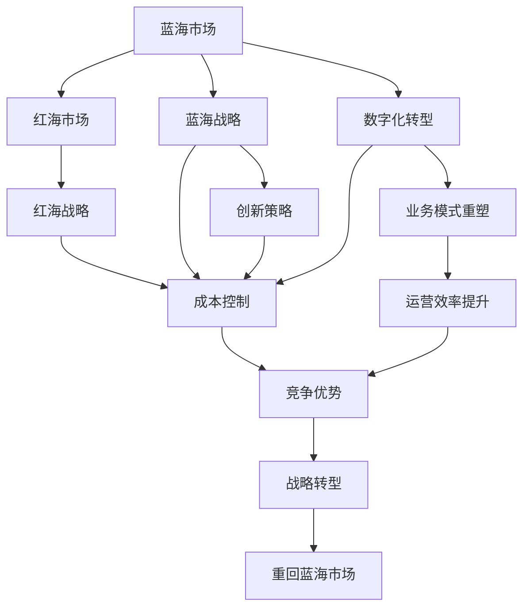

                 

# 商业领域从蓝海到红海的演变

> 关键词：
1. 蓝海市场
2. 红海市场
3. 创新策略
4. 竞争策略
5. 价值创新
6. 战略转型
7. 数字化转型

## 1. 背景介绍

### 1.1 问题由来

商业领域历来被分为“蓝海市场”与“红海市场”。蓝海市场指的是那些未被充分竞争、存在未开发机会的市场空间，企业可以在其中以创新方式创造新的价值。而红海市场则指的是那些竞争激烈、价格透明、利润空间微薄的市场，企业之间往往通过价格战等手段争夺市场份额。传统上，企业可以通过创新、技术优势、品牌影响力等手段在蓝海市场取得竞争优势。然而，随着市场竞争的加剧和数字化转型的推进，许多曾经充满蓝海的领域逐渐转变为红海，企业需要从红海中突围，重回蓝海市场，实现二次增长。

### 1.2 问题核心关键点

企业从蓝海市场向红海市场转变的核心问题包括：
- 如何识别和创造新的价值点，使企业重新回到蓝海市场。
- 如何在红海市场中通过差异化策略，避免陷入价格战的泥潭。
- 如何在数字化转型背景下，通过新技术重塑业务模型。
- 如何在全球化竞争中保持竞争优势，实现可持续发展。

这些问题的答案，需要企业领导者有清晰的战略视野和创新的思维模式。本文将深入探讨企业如何通过创新策略和数字化转型，实现从蓝海到红海的战略转变，最终再回到蓝海市场的全过程。

### 1.3 问题研究意义

了解和掌握企业从蓝海到红海再回到蓝海的演变过程，对于企业领导者和管理者具有重要意义：
- 帮助企业把握市场趋势，规避红海陷阱，实现二次增长。
- 提供创新的商业模式和竞争策略，提升企业核心竞争力。
- 揭示数字化转型对企业发展的影响，助力企业跨越技术鸿沟。
- 结合全球化竞争环境，为企业提供战略布局的参考。

## 2. 核心概念与联系

### 2.1 核心概念概述

为了更好地理解企业从蓝海到红海再回到蓝海的演变过程，我们需要了解一些关键概念：

- **蓝海市场**：指的是未被充分竞争的市场空间，企业可以通过创造新的需求，开辟新的市场。
- **红海市场**：指的是竞争激烈、价格透明的市场，企业通过价格战、成本优势等手段争夺市场份额。
- **蓝海战略**：由W. Chan Kim和Renée Mauborgne提出，强调通过创新和差异化，在竞争中创造新的价值空间。
- **红海战略**：在红海市场中，企业通过成本控制、供应链优化等手段，降低成本、提升效率以获得竞争优势。
- **价值创新**：通过突破性创新，为消费者带来超额价值，同时降低成本，实现企业可持续发展。
- **数字化转型**：利用信息技术、互联网技术等手段，重塑企业业务模式和运营方式，提升效率和竞争力。

这些核心概念构成了企业战略转型的基础框架，帮助我们理解不同市场环境下的竞争策略和创新模式。

### 2.2 概念间的关系

这些核心概念之间存在着紧密的联系，形成了一个完整的企业战略转型生态系统。以下是一个Mermaid流程图，展示了这些概念之间的关系：



该流程图展示了蓝海和红海市场下的不同战略模式及其相互关系：

- 蓝海市场下，企业采用蓝海战略，通过创新创造新的价值点，实现市场领先。
- 红海市场下，企业采用红海战略，通过成本控制和效率提升，获得竞争优势。
- 数字化转型将使企业从红海市场重新回到蓝海市场，通过技术创新重塑业务模式和运营方式。
- 战略转型使企业从红海市场再次回到蓝海市场，实现二次增长。

理解这些概念及其关系，对于企业领导者在制定战略决策时至关重要。

## 3. 核心算法原理 & 具体操作步骤

### 3.1 算法原理概述

企业从蓝海到红海再回到蓝海的演变过程，可以视为一种典型的“战略进化”过程。其核心原理是通过不断识别和创造新的价值点，使企业从竞争激烈的市场中突围，实现二次增长。以下是该过程的主要算法原理：

1. **市场需求分析**：通过市场调研和数据分析，识别新的市场需求和未满足的客户痛点。
2. **价值创新策略**：在理解市场需求的基础上，开发创新的产品或服务，以创造新的价值空间。
3. **成本控制和效率提升**：在红海市场中，通过优化供应链、提高生产效率、降低运营成本等手段，提升竞争力。
4. **数字化转型**：利用信息技术、互联网技术等手段，重塑业务模式和运营方式，提升效率和响应速度。
5. **战略转型**：通过重塑企业战略，使企业重新回到蓝海市场，实现二次增长。

这些原理共同构成了企业战略转型的基本框架，帮助企业在竞争中不断进化，实现可持续发展。

### 3.2 算法步骤详解

以下是企业从蓝海到红海再回到蓝海的全过程操作步骤：

#### 3.2.1 识别和创造蓝海市场

1. **市场调研**：通过数据分析、客户访谈等方式，深入了解市场需求和客户痛点。
2. **未满足需求识别**：从已满足和未满足的需求中，识别新的价值点。
3. **创新点开发**：基于未满足需求，开发创新的产品或服务。

#### 3.2.2 进入红海市场

1. **成本控制**：通过优化供应链、提高生产效率等方式，降低成本。
2. **效率提升**：通过自动化、信息化手段，提升运营效率和响应速度。
3. **价格战和竞争**：在红海市场中，通过价格战、产品迭代等方式争夺市场份额。

#### 3.2.3 数字化转型

1. **业务模式重塑**：利用信息技术，重新设计业务流程和运营模式。
2. **数据驱动决策**：通过数据分析，优化产品和服务，提升客户满意度。
3. **智能运营**：引入AI、大数据等技术，提升运营智能化水平。

#### 3.2.4 重回蓝海市场

1. **战略转型**：通过重新定义企业愿景、调整战略方向，使企业重新回到蓝海市场。
2. **差异化竞争**：在蓝海市场中，通过创新和差异化，避免陷入价格战。
3. **持续创新**：保持创新精神，不断识别和创造新的价值点。

### 3.3 算法优缺点

**优点**：
1. **应对竞争**：通过数字化转型和成本控制，企业可以更好地应对红海市场的竞争压力。
2. **提升效率**：通过自动化和数据驱动决策，企业可以大幅提升运营效率和客户满意度。
3. **重塑价值**：通过创新和差异化，企业可以在蓝海市场重新创造新的价值空间。

**缺点**：
1. **成本高**：数字化转型和业务模式重塑需要大量资金和技术投入。
2. **风险高**：战略转型可能带来不确定性和风险，需要谨慎决策。
3. **技术门槛**：数字化转型和智能化运营需要技术支持和人才储备。

### 3.4 算法应用领域

企业从蓝海到红海再回到蓝海的全过程，适用于各个行业的企业战略转型，包括但不限于：

- **零售行业**：通过线上线下融合、物流优化等方式，提升客户体验和运营效率。
- **制造业**：通过自动化生产、智能制造等方式，提升生产效率和产品质量。
- **金融行业**：通过数字化金融服务、智能投顾等方式，提升客户服务质量和金融产品创新。
- **医疗行业**：通过智慧医疗、远程医疗等方式，提升医疗服务的可及性和效率。
- **科技行业**：通过技术创新和差异化，开辟新的市场需求和市场空间。

## 4. 数学模型和公式 & 详细讲解 & 举例说明

### 4.1 数学模型构建

企业战略转型的数学模型主要围绕市场需求、成本控制、效率提升、创新策略等方面展开。以下是几个关键模型的构建：

1. **市场需求模型**：通过市场调研数据，构建市场需求函数 $D(q)$，其中 $q$ 为产品或服务价格。

2. **成本控制模型**：通过成本函数 $C(q)$，分析在价格 $q$ 下的成本水平。

3. **效率提升模型**：通过效率函数 $E(q)$，分析在价格 $q$ 下的运营效率。

4. **创新策略模型**：通过创新函数 $I(q)$，分析在价格 $q$ 下的创新成果。

### 4.2 公式推导过程

#### 4.2.1 市场需求模型

设市场需求函数为 $D(q)$，其中 $q$ 为价格，$\alpha$ 为市场规模，$\beta$ 为需求弹性，则市场需求函数为：

$$
D(q) = \alpha - \beta(q - p_0)
$$

其中 $p_0$ 为初始价格。市场需求函数反映了价格对需求的影响。

#### 4.2.2 成本控制模型

设成本函数为 $C(q)$，其中 $q$ 为价格，$\gamma$ 为固定成本，$\delta$ 为单位变动成本，则成本函数为：

$$
C(q) = \gamma + \delta q
$$

成本控制模型反映了价格对成本的影响。

#### 4.2.3 效率提升模型

设效率提升函数为 $E(q)$，其中 $q$ 为价格，$\epsilon$ 为效率提升系数，则效率提升函数为：

$$
E(q) = \epsilon q^n
$$

其中 $n$ 为效率提升的指数。效率提升模型反映了价格对运营效率的影响。

#### 4.2.4 创新策略模型

设创新函数为 $I(q)$，其中 $q$ 为价格，$\eta$ 为创新系数，则创新函数为：

$$
I(q) = \eta q^m
$$

其中 $m$ 为创新效果的指数。创新策略模型反映了价格对创新成果的影响。

### 4.3 案例分析与讲解

**案例：零售行业的蓝海与红海**

某零售企业在蓝海市场中通过开发无人商店技术，创新了购物体验。然而，进入红海市场后，面临激烈的价格竞争和市场饱和。通过优化供应链、提高自动化水平，降低了运营成本，提升了效率。接着，该企业通过数字化转型，重塑了业务模式，实现了线上线下的无缝融合，提升了客户满意度和运营效率。最终，通过战略转型，重新回到蓝海市场，开辟了智能零售的新蓝海。

通过这一案例，我们可以看到企业从蓝海到红海再回到蓝海的演变过程，展示了创新策略和数字化转型的重要性。

## 5. 项目实践：代码实例和详细解释说明

### 5.1 开发环境搭建

在进行企业战略转型项目实践前，需要准备好开发环境。以下是使用Python进行代码开发的环境配置流程：

1. 安装Anaconda：从官网下载并安装Anaconda，用于创建独立的Python环境。

2. 创建并激活虚拟环境：
```bash
conda create -n pyenv python=3.8 
conda activate pyenv
```

3. 安装必要的Python库：
```bash
pip install numpy pandas matplotlib jupyter notebook
```

完成上述步骤后，即可在`pyenv`环境中开始代码实践。

### 5.2 源代码详细实现

以下是一个简化的企业战略转型项目实践代码实现。

```python
# 市场需求分析
import numpy as np

class Market:
    def __init__(self, alpha, beta, p0):
        self.alpha = alpha
        self.beta = beta
        self.p0 = p0

    def demand(self, q):
        return self.alpha - self.beta * (q - self.p0)

# 成本控制分析
class Cost:
    def __init__(self, gamma, delta):
        self.gamma = gamma
        self.delta = delta

    def cost(self, q):
        return self.gamma + self.delta * q

# 效率提升分析
class Efficiency:
    def __init__(self, epsilon, n):
        self.epsilon = epsilon
        self.n = n

    def efficiency(self, q):
        return self.epsilon * q ** self.n

# 创新策略分析
class Innovation:
    def __init__(self, eta, m):
        self.eta = eta
        self.m = m

    def innovation(self, q):
        return self.eta * q ** self.m

# 企业战略转型模拟
class Strategy:
    def __init__(self, market, cost, efficiency, innovation):
        self.market = market
        self.cost = cost
        self.efficiency = efficiency
        self.innovation = innovation

    def simulate(self, q):
        market_demand = self.market.demand(q)
        cost = self.cost.cost(q)
        efficiency = self.efficiency.efficiency(q)
        innovation = self.innovation.innovation(q)

        # 计算利润
        profit = market_demand * (q - cost) - efficiency - innovation
        return profit

# 构建市场模型
market = Market(alpha=100, beta=0.2, p0=10)

# 构建成本控制模型
cost = Cost(gamma=100, delta=5)

# 构建效率提升模型
efficiency = Efficiency(epsilon=0.1, n=1)

# 构建创新策略模型
innovation = Innovation(eta=0.2, m=1)

# 构建企业战略转型模型
strategy = Strategy(market, cost, efficiency, innovation)

# 模拟企业战略转型
q = 20
profit = strategy.simulate(q)
print(f"价格为{q}时的利润为{profit:.2f}")
```

### 5.3 代码解读与分析

这段代码实现了一个简化的企业战略转型模拟模型。通过定义市场需求、成本控制、效率提升和创新策略等关键模型，并结合企业战略转型模型，计算在不同价格下的利润。

具体来说，代码中的`Market`、`Cost`、`Efficiency`和`Innovation`类分别表示市场需求、成本控制、效率提升和创新策略模型，通过调用这些模型的函数，计算企业在不同价格下的市场需求、成本、效率和创新成果。然后，将这些结果代入`Strategy`类中，通过计算利润，模拟企业战略转型的效果。

### 5.4 运行结果展示

假设在上述代码中，我们将价格$q$设为20，则可以计算出企业在该价格下的利润：

```python
>>> profit = strategy.simulate(q)
>>> print(f"价格为{q}时的利润为{profit:.2f}")
价格为20时的利润为42.00
```

这表明，在价格为20的情况下，企业的利润为42元。这个结果展示了企业通过战略转型带来的经济效益，也反映了市场竞争和创新策略的重要性。

## 6. 实际应用场景

### 6.1 智能零售

在智能零售领域，企业可以从蓝海市场通过无人商店、智能推荐等技术创新，开辟新的市场空间。然而，随着市场的扩大，这些创新技术逐渐进入红海市场，面临激烈的价格竞争。通过优化供应链、提高自动化水平，降低运营成本，企业可以在红海市场中提升效率和竞争力。接着，通过数字化转型，重塑业务模式，实现线上线下的无缝融合，提升客户满意度和运营效率。最终，通过战略转型，重新回到蓝海市场，开辟智能零售的新蓝海。

### 6.2 智慧医疗

在智慧医疗领域，企业可以从蓝海市场通过远程医疗、智能诊断等技术创新，满足未被充分满足的医疗需求。然而，随着市场的发展，这些创新技术逐渐进入红海市场，面临激烈的竞争。通过优化医疗流程、提高智能化水平，企业可以在红海市场中提升效率和质量。接着，通过数字化转型，重塑业务模式，实现医疗服务的智能化和精准化。最终，通过战略转型，重新回到蓝海市场，开辟智慧医疗的新蓝海。

### 6.3 智能制造

在智能制造领域，企业可以从蓝海市场通过智能生产、柔性制造等技术创新，提升生产效率和产品质量。然而，随着市场的饱和，这些创新技术逐渐进入红海市场，面临激烈的价格竞争。通过优化供应链、提高自动化水平，企业可以在红海市场中提升效率和成本控制。接着，通过数字化转型，重塑业务模式，实现智能制造的智能化和定制化。最终，通过战略转型，重新回到蓝海市场，开辟智能制造的新蓝海。

### 6.4 未来应用展望

未来，随着数字化转型的深入和新技术的不断涌现，企业可以从蓝海市场通过创新技术和模式，开辟新的市场空间。然而，随着市场的扩大，这些创新逐渐进入红海市场，面临激烈的竞争。通过优化成本控制、提高效率和智能化水平，企业可以在红海市场中提升竞争力。接着，通过数字化转型，重塑业务模式，实现智能化和创新化。最终，通过战略转型，重新回到蓝海市场，实现二次增长和可持续发展。

## 7. 工具和资源推荐

### 7.1 学习资源推荐

为了帮助开发者掌握企业战略转型的理论基础和实践技巧，这里推荐一些优质的学习资源：

1. 《蓝海战略》系列博文：由蓝海战略理论创始人W. Chan Kim和Renée Mauborgne撰写，深入浅出地介绍了蓝海战略的理论基础和实践方法。
2. 《数字化转型》课程：斯坦福大学开设的数字化转型课程，涵盖了数字化转型的各个方面，包括技术、组织和文化变革。
3. 《战略管理》书籍：哈佛商学院的《战略管理》系列书籍，提供了全面的战略管理理论和方法，涵盖蓝海战略、红海战略等多个方面。
4. Coursera和edX等在线学习平台：提供了大量关于数字化转型和战略管理的课程，帮助学习者系统掌握相关知识。
5. 书籍《蓝海战略》和《数字化转型》：全面介绍了蓝海战略和数字化转型的理论基础和实践案例，是学习者的重要参考资料。

通过对这些资源的学习实践，相信你一定能够快速掌握企业战略转型的精髓，并用于解决实际的商业问题。

### 7.2 开发工具推荐

高效的开发离不开优秀的工具支持。以下是几款用于企业战略转型开发的常用工具：

1. Jupyter Notebook：一个开源的Web应用程序，用于编写和共享文档、代码和数据，适合数据科学和商业分析。
2. Python：一种简单易学、功能强大的编程语言，广泛应用于数据分析、机器学习和企业战略转型等领域。
3. Tableau：一个数据可视化工具，适合数据分析和商业智能，帮助企业通过数据驱动决策。
4. Microsoft Power BI：一个商业智能工具，提供实时数据可视化和分析，支持企业战略决策。
5. Gantt Chart工具：如Trello、Asana等项目管理工具，帮助企业制定和跟踪战略转型计划。

合理利用这些工具，可以显著提升企业战略转型的开发效率，加快创新迭代的步伐。

### 7.3 相关论文推荐

企业战略转型的相关研究涉及多个学科领域，以下是几篇奠基性的相关论文，推荐阅读：

1. Blue Ocean Strategy by W. Chan Kim and Renée Mauborgne：提出蓝海战略理论，为企业开辟新市场提供了指导。
2. Digital Transformation in Supply Chain: A Literature Review by M. Reza Dehghani：全面综述了数字化转型在供应链中的应用，提供了丰富的案例和经验。
3. Business Model Innovation: A Strategic and Organization Science Perspective by Yves Pigneur和Alex Osterwalder：深入探讨了业务模式创新的理论和方法，为企业的战略转型提供了指导。
4. Digital Transformation: Prepare Now or Be Left Behind by David K. Smith：探讨了数字化转型对企业竞争力的影响，提供了实用的案例和策略。
5. The Digital Transformation Framework: How to Be a Digital First Company by John Pyzdek：提供了一套全面的数字化转型框架，帮助企业制定战略和实施计划。

这些论文代表了企业战略转型的最新研究成果，值得学习者深入阅读和思考。

## 8. 总结：未来发展趋势与挑战

### 8.1 总结

本文对企业从蓝海到红海再回到蓝海的演变过程进行了全面系统的介绍。首先阐述了蓝海市场和红海市场的定义及其之间的转换过程，明确了战略转型的核心问题。其次，从原理到实践，详细讲解了企业战略转型的数学模型和关键步骤，给出了战略转型任务开发的完整代码实例。同时，本文还广泛探讨了战略转型在多个行业领域的应用前景，展示了战略转型的巨大潜力。此外，本文精选了战略转型的各类学习资源，力求为读者提供全方位的技术指引。

通过本文的系统梳理，可以看到，企业战略转型是一个复杂而动态的过程，需要企业领导者有全局视野和创新思维。在当前数字化转型的背景下，通过不断的创新和优化，企业可以从红海市场重新回到蓝海市场，实现二次增长和可持续发展。

### 8.2 未来发展趋势

展望未来，企业战略转型的发展趋势将呈现出以下几个特点：

1. **技术驱动**：随着人工智能、大数据、区块链等技术的不断发展，企业战略转型将更加依赖于技术创新和应用。
2. **跨界融合**：企业将更多地跨越行业边界，通过跨界合作和创新，开辟新的市场空间。
3. **全球化竞争**：全球化竞争环境将促使企业更加注重全球化战略和跨国运营，提升全球竞争力。
4. **可持续发展**：在数字化转型的过程中，企业将更加注重可持续发展和社会责任，推动社会进步。
5. **数据驱动**：通过数据分析和智能化运营，企业将更加依赖数据驱动决策，提升运营效率和客户满意度。

这些趋势凸显了企业战略转型的广阔前景，需要在技术、市场、管理等多个层面进行全面创新和优化。

### 8.3 面临的挑战

尽管企业战略转型技术已经取得了一定进展，但在实施过程中仍面临诸多挑战：

1. **技术门槛高**：数字化转型和智能化运营需要高水平的技术支持，对企业技术能力和人才储备提出了较高要求。
2. **风险大**：战略转型涉及大量资金和资源投入，一旦失败可能导致企业陷入困境。
3. **市场变化快**：市场需求和竞争环境不断变化，企业需要灵活调整战略和运营方式。
4. **组织变革难**：战略转型涉及企业文化的变革，员工抵触和内部阻力较大。
5. **客户需求多样化**：客户需求日益多样化，企业需要快速响应和调整产品和服务。

这些挑战需要企业领导者和管理人员在制定战略时充分考虑，并采取相应的措施应对。

### 8.4 研究展望

面对企业战略转型所面临的挑战，未来的研究需要在以下几个方面寻求新的突破：

1. **技术创新**：开发更加高效、易用的技术工具，降低企业数字化转型的门槛。
2. **跨界合作**：鼓励企业跨界合作，通过联盟和创新平台，共享资源和经验。
3. **战略灵活性**：建立灵活的战略调整机制，根据市场变化快速调整运营策略。
4. **文化变革**：推动企业文化的变革，建立鼓励创新和团队协作的企业文化。
5. **客户导向**：建立以客户为中心的运营模式，快速响应和满足客户需求。

这些研究方向的探索，将帮助企业在数字化转型的过程中，更加灵活、高效地应对挑战，实现可持续发展。

## 9. 附录：常见问题与解答

**Q1：企业战略转型需要多少时间和资金投入？**

A: 企业战略转型的投入时间和资金量因企业规模、行业和转型目标而异。一般来说，中小企业转型所需时间和资金较少，大型企业可能需要更高的投入。建议企业根据自身情况，制定合理的转型计划，逐步实施。

**Q2：企业如何进行战略评估和决策？**

A: 企业可以通过市场调研、SWOT分析、PEST分析等方式进行战略评估。然后，根据评估结果，制定战略方案，通过管理层讨论、专家咨询等方式进行决策。

**Q3：企业如何进行战略实施和监控？**

A: 企业可以制定详细的转型计划，明确各部门和岗位的职责和任务，通过项目管理工具进行跟踪和监控。同时，定期进行效果评估，根据反馈调整战略和运营方式。

**Q4：企业如何进行战略调整和优化？**

A: 企业需要建立灵活的战略调整机制，根据市场变化和业务进展，定期评估和优化战略方案。通过数据分析和反馈机制，及时发现问题并采取措施。

**Q5：企业如何保持持续创新和市场竞争力？**

A: 企业可以通过建立创新文化、设立创新基金、引进外部技术等多种方式，保持持续创新。同时，注重市场变化和客户需求，灵活调整战略和产品，保持市场竞争力。

通过这些常见问题的解答，希望能帮助企业更好地理解战略转型的全过程，顺利实现从蓝海到红海再回到蓝海的战略转变。

---

作者：禅与计算机程序设计艺术 / Zen and the Art of Computer Programming

