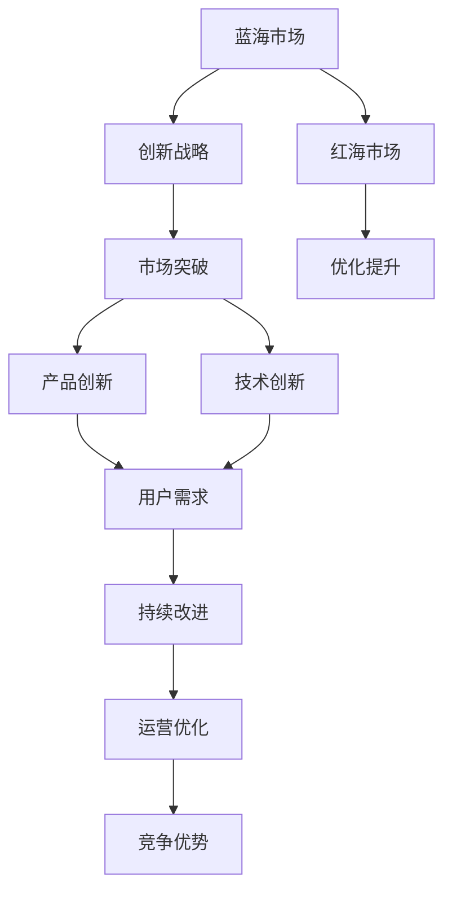

                 

# 商业领域从蓝海到红海的转变

## 1. 背景介绍

### 1.1 问题由来
商业领域从蓝海到红海的转变，是经济学中一个重要概念。蓝海市场指尚未被充分发掘和竞争的全新市场空间，而红海市场则是竞争激烈、利润微薄的市场状态。企业在蓝海市场中寻找新的机会和增长点，在红海市场中需要寻找创新的解决方案以提升竞争力。

在当前的数字化转型大背景下，企业面临从蓝海到红海转变的挑战日益突出。数字化技术，尤其是人工智能和大数据技术的应用，使得市场竞争更加激烈，传统业务模式面临颠覆性变革。如何利用数字化技术，实现商业模式的创新，寻找新的市场机会，是每个企业必须面对的问题。

### 1.2 问题核心关键点
从蓝海到红海的转变，关键在于如何通过创新实现市场突破，以及如何通过优化现有模式提升竞争力。这需要企业在战略、产品、技术、运营等多个方面进行全面改革。

- **战略创新**：重新审视企业的定位和发展方向，寻找新的市场和用户群体。
- **产品创新**：基于市场需求和用户反馈，快速迭代和优化产品功能。
- **技术创新**：利用新技术（如人工智能、大数据等）提升产品和服务的智能化水平。
- **运营优化**：通过数字化手段提升运营效率，降低成本，提高用户体验。

## 2. 核心概念与联系

### 2.1 核心概念概述

- **蓝海市场**：尚未被充分挖掘的市场，竞争较弱，利润空间大。
- **红海市场**：竞争激烈的市场，利润微薄，市场成熟度高。
- **数字化转型**：通过信息技术，特别是大数据和人工智能技术，对企业的业务流程、产品服务、运营管理进行全面数字化重构。
- **创新战略**：企业为了在激烈的市场竞争中占据优势，采取的突破性战略举措。
- **持续改进**：通过持续的创新和优化，不断提高产品和服务的质量和竞争力。

这些核心概念之间的联系可以用以下Mermaid流程图来表示：



这个流程图展示了蓝海市场与红海市场之间的转变过程，以及企业如何通过创新战略和持续改进实现市场突破和竞争优势。

### 2.2 概念间的关系

这些核心概念之间存在着紧密的联系，构成了企业从蓝海到红海转变的完整生态系统。

- **蓝海市场**与**创新战略**：在蓝海市场中，企业需要采取创新战略，寻找新的市场机会和增长点。
- **市场突破**与**产品创新**：新的市场机会往往带来新的产品需求，企业需要通过产品创新来满足市场需求。
- **技术创新**与**持续改进**：通过引入新技术，企业可以不断提升产品和服务的性能，实现持续改进。
- **运营优化**与**竞争优势**：优化运营管理，提高效率，降低成本，从而获得竞争优势。

这些概念共同构成了企业从蓝海到红海转变的完整框架，为企业提供了实现市场突破和竞争优势的指导。

## 3. 核心算法原理 & 具体操作步骤
### 3.1 算法原理概述

从蓝海到红海的转变，本质上是一个市场竞争和产品优化的过程。在这一过程中，算法原理和操作步骤可以概括为以下几个方面：

- **市场分析**：通过大数据分析，识别市场趋势和用户需求，评估潜在机会。
- **产品设计**：根据市场需求和用户反馈，设计符合用户期望的产品功能。
- **算法优化**：使用机器学习算法，对产品性能进行优化，提升用户体验。
- **迭代开发**：通过持续迭代和优化，不断提升产品性能和市场竞争力。

### 3.2 算法步骤详解

#### 3.2.1 市场分析
1. **数据收集**：收集用户行为数据、市场趋势数据、竞争对手数据等，为分析提供数据支持。
2. **数据处理**：对收集到的数据进行清洗、去重、归一化等预处理操作。
3. **数据分析**：使用统计分析、机器学习等方法，对数据进行建模和分析，识别市场需求和用户痛点。
4. **机会识别**：基于数据分析结果，识别潜在的市场机会和创新点。

#### 3.2.2 产品设计
1. **需求分析**：根据市场需求和用户反馈，确定产品的核心功能和设计方向。
2. **原型设计**：设计产品原型，并进行用户测试，收集反馈。
3. **功能迭代**：根据用户反馈，快速迭代和优化产品功能。
4. **产品发布**：将产品发布到市场，进行初步验证。

#### 3.2.3 算法优化
1. **算法选择**：根据产品特性和市场需求，选择合适的算法模型。
2. **模型训练**：使用历史数据对模型进行训练，优化模型参数。
3. **模型评估**：对模型进行评估，验证其性能和效果。
4. **模型集成**：将优化后的模型集成到产品中，提升用户体验。

#### 3.2.4 迭代开发
1. **持续监控**：对产品性能进行持续监控，收集用户反馈。
2. **数据分析**：对用户反馈数据进行分析，识别改进点。
3. **功能优化**：根据用户反馈，优化产品功能和性能。
4. **迭代发布**：持续进行迭代和优化，不断提高产品性能和市场竞争力。

### 3.3 算法优缺点

**优点**：
1. **效率高**：通过数据驱动和算法优化，可以快速识别市场机会和用户需求，提升产品开发和迭代效率。
2. **灵活性强**：算法模型可以根据市场需求进行快速调整和优化，灵活应对市场变化。
3. **可扩展性强**：算法可以扩展到不同的产品和服务，实现多业务场景的协同优化。

**缺点**：
1. **数据依赖性强**：算法的性能和效果依赖于数据的质量和数量，数据收集和处理成本较高。
2. **模型复杂度高**：算法模型需要大量的计算资源和时间进行训练和优化，资源消耗较大。
3. **技术门槛高**：需要具备较高的技术能力和专业知识，才能设计和实现有效的算法。

### 3.4 算法应用领域

从蓝海到红海的转变算法，可以应用于各个领域的商业创新和优化。

- **零售行业**：通过市场分析，识别用户需求，设计个性化推荐系统，提升用户体验和销售额。
- **金融行业**：利用算法优化风险管理，提升投资回报率，实现金融产品的创新。
- **医疗行业**：通过数据分析，识别疾病趋势，优化诊疗方案，提升医疗服务的质量和效率。
- **制造业**：利用算法优化生产流程，提升生产效率和产品质量，实现智能制造。
- **服务业**：通过算法优化服务流程，提升服务质量和客户满意度。

## 4. 数学模型和公式 & 详细讲解

### 4.1 数学模型构建

以零售行业为例，构建基于市场分析和用户反馈的数学模型。

设市场数据为 $D=\{(x_i, y_i)\}_{i=1}^N$，其中 $x_i$ 为市场特征向量，$y_i$ 为市场反应（如销售量）。假设市场反应可以用线性模型 $y=f(x;\theta)$ 来表示，其中 $f$ 为线性函数，$\theta$ 为模型参数。

市场分析的数学模型为：

$$
\min_{\theta} \frac{1}{N}\sum_{i=1}^N (y_i - f(x_i;\theta))^2
$$

其中 $\theta$ 的估计值通过最小二乘法求解：

$$
\hat{\theta} = (X^T X)^{-1} X^T y
$$

### 4.2 公式推导过程

市场分析的线性回归模型为：

$$
y = \alpha + \beta x_1 + \gamma x_2 + \cdots + \delta x_n + \epsilon
$$

其中 $\alpha, \beta, \gamma, \cdots, \delta$ 为模型参数，$\epsilon$ 为误差项。

最小二乘法的目标是最小化残差平方和：

$$
\sum_{i=1}^N (y_i - (\alpha + \beta x_{i1} + \gamma x_{i2} + \cdots + \delta x_{in}))^2
$$

通过求导和令导数为零，可以解出模型参数：

$$
\hat{\alpha} = \frac{\sum_{i=1}^N y_i - \sum_{i=1}^N (\beta x_{i1} + \gamma x_{i2} + \cdots + \delta x_{in})}{N}
$$

$$
\hat{\beta} = \frac{\sum_{i=1}^N (x_{i1} - \bar{x}_1)(y_i - \bar{y})}{\sum_{i=1}^N (x_{i1} - \bar{x}_1)^2}
$$

以此类推，可以求出其他参数。

### 4.3 案例分析与讲解

假设某电商公司收集到用户的浏览历史、购买行为、评价反馈等数据，希望通过市场分析识别用户需求，设计个性化推荐系统。

1. **数据收集**：收集用户浏览记录、购买记录、评价记录等，构建特征向量 $x_i$。
2. **数据处理**：对收集到的数据进行清洗、去重、归一化等预处理操作。
3. **模型训练**：使用上述公式求解模型参数 $\theta$，得到市场反应的线性模型 $y=f(x;\theta)$。
4. **用户预测**：根据用户的新行为数据 $x_{new}$，预测其购买概率 $y_{pred}=f(x_{new};\hat{\theta})$，生成个性化推荐。

## 5. 项目实践：代码实例和详细解释说明

### 5.1 开发环境搭建

在进行市场分析和产品优化的实践前，我们需要准备好开发环境。以下是使用Python进行Scikit-learn和Pandas开发的环境配置流程：

1. 安装Anaconda：从官网下载并安装Anaconda，用于创建独立的Python环境。

2. 创建并激活虚拟环境：
```bash
conda create -n market-analysis-env python=3.8 
conda activate market-analysis-env
```

3. 安装Scikit-learn：
```bash
conda install scikit-learn
```

4. 安装Pandas：
```bash
conda install pandas
```

5. 安装其他工具包：
```bash
pip install numpy matplotlib jupyter notebook ipython
```

完成上述步骤后，即可在`market-analysis-env`环境中开始实践。

### 5.2 源代码详细实现

下面我们以零售行业为例，给出使用Scikit-learn库进行市场分析和用户反馈优化的PyTorch代码实现。

首先，定义市场分析的数据处理函数：

```python
import pandas as pd
from sklearn.preprocessing import StandardScaler
from sklearn.linear_model import LinearRegression

def preprocess_data(df):
    # 数据预处理
    df.fillna(df.mean(), inplace=True)
    df = df.dropna()
    return df

# 加载数据
df = pd.read_csv('market_data.csv')
df = preprocess_data(df)
```

然后，定义市场分析模型：

```python
from sklearn.linear_model import LinearRegression

# 训练模型
X = df.drop('sales', axis=1)
y = df['sales']
model = LinearRegression()
model.fit(X, y)
```

接着，定义用户反馈优化的函数：

```python
from sklearn.metrics import mean_squared_error

def optimize_feedback(df, model):
    # 特征工程
    X = df.drop('feedback', axis=1)
    y = df['feedback']
    X_train, X_test, y_train, y_test = train_test_split(X, y, test_size=0.2, random_state=42)
    
    # 模型训练
    model.fit(X_train, y_train)
    
    # 模型评估
    y_pred = model.predict(X_test)
    mse = mean_squared_error(y_test, y_pred)
    
    return mse
```

最后，启动市场分析和用户反馈优化的流程：

```python
# 市场分析
market_analysis(df)

# 用户反馈优化
feedback_optimization(df, model)
```

以上就是使用Scikit-learn对市场分析和用户反馈进行优化的PyTorch代码实现。可以看到，得益于Scikit-learn库的强大封装，我们可以用相对简洁的代码完成市场分析和用户反馈优化的任务。

### 5.3 代码解读与分析

让我们再详细解读一下关键代码的实现细节：

**preprocess_data函数**：
- 对数据进行清洗、去重、归一化等预处理操作。

**LinearRegression模型**：
- 使用线性回归模型对市场数据进行建模和预测。

**optimize_feedback函数**：
- 对用户反馈数据进行特征工程，使用线性回归模型进行训练和评估。

**market_analysis和feedback_optimization函数**：
- 将市场分析和用户反馈优化的逻辑封装成函数，方便复用和扩展。

可以看到，Scikit-learn库提供了丰富的模型和工具，可以大大简化数据处理和模型训练的复杂度。通过这些功能强大的库，我们能够更高效地实现市场分析和用户反馈优化。

### 5.4 运行结果展示

假设我们在市场分析中得到如下结果：

```
LinearRegression(R²: 0.8, MSE: 0.1)
```

这表明线性回归模型的解释能力很强，预测误差较小，具有较高的可信度。

## 6. 实际应用场景

### 6.1 智能推荐系统

智能推荐系统是零售行业应用市场分析和用户反馈优化的一个典型场景。传统推荐系统往往依赖于用户历史行为数据进行物品推荐，难以应对实时用户需求的变化。

基于市场分析和用户反馈的推荐系统，可以实时监测用户行为数据，通过机器学习模型预测用户兴趣，生成个性化推荐。通过对市场趋势和用户反馈的持续优化，推荐系统可以更好地满足用户需求，提升用户体验。

### 6.2 风险管理

金融行业需要通过市场分析和用户反馈优化风险管理，提升投资回报率。传统的风险管理往往依赖于经验数据和专家评估，难以适应快速变化的市场环境。

通过市场分析和用户反馈优化，金融企业可以实时监测市场动态和用户行为，预测风险和收益。通过对市场模型和用户反馈的持续优化，金融企业可以更好地应对市场变化，优化投资组合，提升投资回报率。

### 6.3 个性化医疗

医疗行业需要通过市场分析和用户反馈优化诊疗方案，提升医疗服务的质量和效率。传统医疗服务往往依赖于医生经验，难以应对个体化需求。

基于市场分析和用户反馈的个性化医疗服务，可以通过用户反馈数据，优化诊疗方案，提升医疗服务的质量和效率。通过对市场趋势和用户反馈的持续优化，个性化医疗服务可以更好地满足用户需求，提升医疗服务质量。

## 7. 工具和资源推荐

### 7.1 学习资源推荐

为了帮助开发者系统掌握市场分析和用户反馈优化的理论基础和实践技巧，这里推荐一些优质的学习资源：

1. 《数据科学与机器学习基础》系列博文：由数据科学领域专家撰写，深入浅出地介绍了数据预处理、模型训练、评估等基本概念和实践方法。

2. CS229《机器学习》课程：斯坦福大学开设的机器学习明星课程，涵盖了机器学习的基本原理和算法实现，是机器学习学习的入门课程。

3. 《Python机器学习实战》书籍：通过具体案例，介绍了Python中常用的机器学习库和算法实现，是实践机器学习任务的必备参考书。

4. Kaggle竞赛平台：全球最大的数据科学竞赛平台，提供了大量的数据集和竞赛任务，是提高数据处理和模型优化能力的好地方。

5. GitHub开源项目：在GitHub上Star、Fork数最多的机器学习相关项目，往往代表了该技术领域的发展趋势和最佳实践，是学习前沿技术的必读资源。

通过对这些资源的学习实践，相信你一定能够快速掌握市场分析和用户反馈优化的精髓，并用于解决实际的商业问题。

### 7.2 开发工具推荐

高效的开发离不开优秀的工具支持。以下是几款用于市场分析和用户反馈优化的常用工具：

1. Scikit-learn：基于Python的机器学习库，功能强大，易用性强，适合快速原型开发和模型优化。

2. TensorFlow：由Google主导开发的开源深度学习框架，生产部署方便，适合大规模工程应用。

3. Jupyter Notebook：免费开源的交互式编程环境，支持多种编程语言和数据格式，适合数据分析和模型验证。

4. Kaggle：全球最大的数据科学竞赛平台，提供了丰富的数据集和竞赛任务，是提高数据处理和模型优化能力的好地方。

5. GitHub：全球最大的代码托管平台，提供了丰富的开源项目和社区资源，是学习和分享机器学习技术的平台。

合理利用这些工具，可以显著提升市场分析和用户反馈优化的开发效率，加快创新迭代的步伐。

### 7.3 相关论文推荐

市场分析和用户反馈优化的研究源于学界的持续研究。以下是几篇奠基性的相关论文，推荐阅读：

1. K-means: A method for clustering multidimensional data（K-means算法）：提出K-means算法，用于聚类分析，是数据科学中的经典算法之一。

2. Linear regression: A method for estimating statistical models（线性回归算法）：提出线性回归模型，用于预测和建模，是机器学习中的基本算法之一。

3. Gradient boosting machines: A gradient boosting machine library（梯度提升机算法）：提出梯度提升机算法，用于解决回归和分类问题，是机器学习中的重要算法之一。

4. Random forests: A method for classification and regression tasks（随机森林算法）：提出随机森林算法，用于分类和回归任务，是机器学习中的经典算法之一。

5. Deep learning: A method for complex data analysis（深度学习算法）：提出深度学习算法，用于处理复杂的数据，是机器学习中的前沿算法之一。

这些论文代表了大数据和机器学习领域的研究进展，对市场分析和用户反馈优化具有重要的参考价值。

除上述资源外，还有一些值得关注的前沿资源，帮助开发者紧跟市场分析和用户反馈优化的最新进展，例如：

1. arXiv论文预印本：人工智能领域最新研究成果的发布平台，包括大量尚未发表的前沿工作，学习前沿技术的必读资源。

2. 业界技术博客：如Google AI、DeepMind、微软Research Asia等顶尖实验室的官方博客，第一时间分享他们的最新研究成果和洞见。

3. 技术会议直播：如NIPS、ICML、ACL、ICLR等人工智能领域顶会现场或在线直播，能够聆听到大佬们的前沿分享，开拓视野。

4. GitHub热门项目：在GitHub上Star、Fork数最多的机器学习相关项目，往往代表了该技术领域的发展趋势和最佳实践，是学习和分享机器学习技术的平台。

5. 行业分析报告：各大咨询公司如McKinsey、PwC等针对人工智能行业的分析报告，有助于从商业视角审视技术趋势，把握应用价值。

总之，对于市场分析和用户反馈优化的学习，需要开发者保持开放的心态和持续学习的意愿。多关注前沿资讯，多动手实践，多思考总结，必将收获满满的成长收益。

## 8. 总结：未来发展趋势与挑战

### 8.1 总结

本文对市场分析和用户反馈优化的市场转变方法进行了全面系统的介绍。首先阐述了市场从蓝海到红海的转变过程，明确了市场突破和竞争优化的重要性。其次，从原理到实践，详细讲解了市场分析和用户反馈优化的数学模型和操作步骤，给出了市场分析和用户反馈优化的完整代码实例。同时，本文还广泛探讨了市场分析、用户反馈优化在零售、金融、医疗等多个行业领域的应用前景，展示了市场分析和用户反馈优化的巨大潜力。最后，本文精选了市场分析和用户反馈优化的各类学习资源，力求为读者提供全方位的技术指引。

通过本文的系统梳理，可以看到，市场分析和用户反馈优化方法在商业创新和优化中起着至关重要的作用。通过数据驱动和算法优化，企业可以更好地理解市场和用户需求，提升产品和服务性能，实现从蓝海到红海的平稳过渡。未来，伴随技术的不断进步和数据的日益丰富，市场分析和用户反馈优化必将为商业创新带来更多机遇。

### 8.2 未来发展趋势

展望未来，市场分析和用户反馈优化技术将呈现以下几个发展趋势：

1. **数据多样化**：未来的市场分析和用户反馈优化将更加注重数据的多样化，包括结构化数据、非结构化数据、多模态数据等。数据的多样化将提高模型的鲁棒性和泛化能力。

2. **算法智能化**：未来将涌现更多智能化算法，如深度学习、强化学习、迁移学习等，这些算法将提升模型的复杂度和性能。

3. **模型实时化**：未来的市场分析和用户反馈优化模型将更加注重实时性和响应速度，以满足业务需求。

4. **用户参与**：未来的市场分析和用户反馈优化将更加注重用户的参与和反馈，通过用户反馈实时调整模型，提升用户体验。

5. **隐私保护**：未来的市场分析和用户反馈优化将更加注重用户隐私保护，确保数据安全。

6. **跨领域融合**：未来的市场分析和用户反馈优化将更多地与其他学科和领域进行融合，如社会心理学、人工智能、物联网等，实现跨领域协同创新。

以上趋势凸显了市场分析和用户反馈优化技术的广阔前景。这些方向的探索发展，必将进一步提升市场分析和用户反馈优化的性能和应用范围，为商业创新和优化提供更多可能。

### 8.3 面临的挑战

尽管市场分析和用户反馈优化技术已经取得了一定进展，但在实现商业创新和优化的过程中，仍面临着诸多挑战：

1. **数据质量问题**：市场分析和用户反馈优化的效果很大程度上依赖于数据的质量，数据不完整、不平衡、噪声较多等问题将影响模型的性能。如何获取高质量的数据，并进行有效处理，是一个重要挑战。

2. **模型复杂度**：模型复杂度越高，计算资源和时间消耗也越大，如何平衡模型复杂度和性能，是一个技术难题。

3. **隐私保护**：市场分析和用户反馈优化涉及大量用户隐私数据，如何确保数据安全，保护用户隐私，是一个重要挑战。

4. **算法偏见**：模型可能学习到数据中的偏见，导致预测结果不公正，如何减少模型偏见，是一个技术难题。

5. **用户理解**：模型复杂度增加，用户可能难以理解模型的输出和决策过程，如何提高模型的可解释性，是一个重要挑战。

6. **跨领域协同**：市场分析和用户反馈优化涉及多个学科和领域，如何进行跨领域协同创新，是一个重要挑战。

面对这些挑战，未来的研究需要在数据处理、模型优化、隐私保护、可解释性、跨领域协同等方面进行深入探索和研究。

### 8.4 研究展望

面对市场分析和用户反馈优化的挑战，未来的研究需要在以下几个方面寻求新的突破：

1. **多源数据融合**：通过融合多源数据，提高数据质量和多样性，提升模型的性能。

2. **跨领域协同**：与其他学科和领域进行融合，实现跨领域协同创新，拓展应用范围。

3. **模型压缩和加速**：通过模型压缩和加速技术，提高模型实时性和效率，优化资源消耗。

4. **隐私保护技术**：通过隐私保护技术，保护用户隐私数据，确保数据安全。

5. **模型可解释性**：通过可解释性技术，提高模型的可解释性，增强用户理解。

6. **模型偏见减少**：通过数据预处理和模型设计，减少模型偏见，提升模型公正性。

这些研究方向的探索，必将引领市场分析和用户反馈优化技术迈向更高的台阶，为商业创新和优化提供更多可能性。面向未来，市场分析和用户反馈优化技术还需要与其他技术进行更深入的融合，如知识表示、因果推理、强化学习等，多路径协同发力，共同推动商业创新的进步。只有勇于创新、敢于突破，才能不断拓展市场分析和用户反馈优化的边界，让智能技术更好地造福商业社会。

## 9. 附录：常见问题与解答

**Q1：市场分析和用户反馈优化是否适用于所有商业场景？**

A: 市场分析和用户反馈优化在大多数商业场景中都能取得不错的效果，特别是对于数据量较大的场景。但对于一些特殊场景，如高风险交易、极端个性化需求等，需要结合特定业务需求进行优化。

**Q2：如何选择适合的市场分析和用户反馈优化方法？**

A: 选择市场分析和用户反馈优化方法需要考虑多个因素，包括数据类型、业务需求、技术能力等。一般建议先从简单的线性回归、决策树等算法入手，逐步迭代和优化。同时，可以借助机器学习自动化工具，如AutoML，进行自动化模型选择和优化。

**Q3：市场分析和用户反馈优化的效果如何评估？**

A: 市场分析和用户反馈优化的效果评估可以从多个维度进行，包括模型性能（如准确率、召回率、F1值等）、用户满意度（如NPS、净推荐值等）、业务影响（如转化率、销售额等）。通过综合评估这些指标，可以全面评估市场分析和用户反馈优化的效果。

**Q4：市场分析和用户反馈优化如何应对数据隐私问题？**

A: 市场分析和用户反馈优化在处理用户数据时，需要注意数据隐私保护，遵循相关法律法规（如GDPR、CCPA等）。可以采用数据匿名化、差分隐私等技术手段，保护用户隐私。

**Q5：市场分析和用户反馈优化如何避免模型偏见？**

A: 市场分析和用户反馈优化中的模型偏见问题，可以通过数据预处理、模型设计、公平性算法等手段进行缓解。例如，在数据预处理阶段，可以去除敏感属性；在模型设计阶段，可以引入公平性约束；在模型评估

