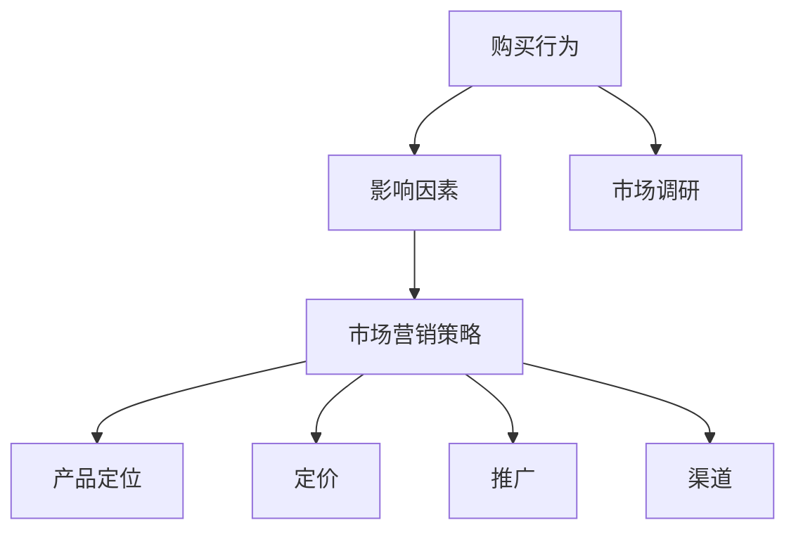

                 

# 商学院学生笔记本电脑购买行为及营销方法分析

## 1. 背景介绍

在全球教育数字化的大背景下，商学院学生的学习方式、消费习惯和市场空间正经历着深刻的变革。越来越多的商学院学生选择在线学习，其对笔记本电脑等硬件设备的需求显著增加。本研究旨在深入分析商学院学生购买笔记本电脑的行为特征，并结合市场营销学的理论，为笔记本电脑的营销策略提供策略建议。

### 1.1 研究背景

随着数字技术的普及，商学院学生越来越多地依赖于电子设备和互联网资源进行学习和研究。据统计，超过80%的商学院学生在使用笔记本电脑进行课程学习、资料阅读、作业提交等学术活动。然而，他们在选购笔记本电脑时面临诸多选择，包括品牌、型号、价格、配置等，这些因素直接影响购买决策。因此，深入研究商学院学生对笔记本电脑的购买行为，制定针对性的营销策略，对于商学院的IT部门和笔记本电脑厂商均具有重要意义。

### 1.2 研究目的

本研究旨在通过数据分析和市场调研，揭示商学院学生购买笔记本电脑的核心因素，识别市场热点，并为笔记本电脑的营销策略提供参考。具体研究目的包括：

1. 分析商学院学生购买笔记本电脑的决策过程和影响因素。
2. 识别影响商学院学生购买行为的关键市场变量。
3. 提出基于市场研究结果的笔记本电脑营销策略建议。

## 2. 核心概念与联系

### 2.1 核心概念概述

本研究涉及多个核心概念，包括：

1. **购买行为**：指的是消费者在购买产品或服务时的心理和行为过程，包括需求识别、搜索、评估、购买和反馈等阶段。
2. **影响因素**：影响购买决策的各类因素，包括经济、社会、心理等。
3. **营销策略**：包括产品定位、定价、推广、渠道等，旨在影响消费者的购买行为。
4. **市场调研**：通过收集、分析和解读数据，了解市场现状、趋势和消费者需求。

### 2.2 核心概念的关系

这些概念之间存在着紧密的联系和互动。市场营销策略的设计和实施是基于对消费者购买行为的深入理解，而消费者行为又受到多种因素的影响。市场调研作为桥梁，连接了消费者与市场，为制定科学的营销策略提供数据支持。

以下是一个简化的Mermaid流程图，展示了核心概念之间的关系：



## 3. 核心算法原理 & 具体操作步骤

### 3.1 算法原理概述

本研究主要采用数据分析和市场调研的方法，结合心理学和市场营销学的理论，来揭示商学院学生购买笔记本电脑的决策过程和影响因素。核心算法原理包括：

1. **数据采集**：通过问卷调查、在线行为追踪等方法，收集商学院学生的购买行为数据。
2. **数据清洗**：对收集的数据进行清洗、筛选，去除无效或异常数据。
3. **数据分析**：使用统计分析和机器学习模型，如回归分析、聚类分析等，对数据进行深入分析。
4. **市场调研**：通过问卷调查、访谈等方式，收集市场相关信息，理解市场趋势和消费者需求。

### 3.2 算法步骤详解

#### 3.2.1 数据采集

1. **问卷调查**：设计并发放问卷，收集商学院学生对笔记本电脑的品牌偏好、购买渠道、使用场景等数据。
2. **在线行为追踪**：通过网络行为分析工具，收集商学院学生在电商平台、厂商官网等渠道上的点击、浏览、购买行为数据。

#### 3.2.2 数据清洗

1. **数据清洗**：对收集的数据进行去重、异常值处理、缺失值填充等操作，确保数据质量。
2. **数据标准化**：将不同来源的数据进行统一标准化，以便于后续分析。

#### 3.2.3 数据分析

1. **统计分析**：使用描述性统计方法，如均值、方差、频率等，分析消费者购买行为的基本特征。
2. **回归分析**：建立购买行为与影响因素之间的关系模型，识别关键影响因素。
3. **聚类分析**：对消费者进行分类，识别不同的购买行为群体。

#### 3.2.4 市场调研

1. **问卷设计**：设计并发放问卷，深入了解商学院学生对笔记本电脑的品牌偏好、购买动机等。
2. **访谈调研**：通过深度访谈，获取消费者对笔记本电脑的详细需求和痛点。

### 3.3 算法优缺点

#### 3.3.1 优点

1. **数据全面性**：结合问卷调查和在线行为追踪，可以全面收集消费者的购买数据和市场信息。
2. **分析深度**：使用统计分析和机器学习模型，可以深入揭示消费者行为背后的规律和趋势。
3. **策略针对性**：根据分析结果，提出有针对性的营销策略，满足消费者需求，提升市场竞争力。

#### 3.3.2 缺点

1. **数据隐私**：在数据采集过程中，需要关注消费者隐私保护，确保数据合法合规。
2. **分析复杂性**：数据分析过程涉及多种统计方法和模型，需要具备较强的数据分析能力。
3. **市场变化快**：市场环境和消费者需求不断变化，需要持续关注和调整营销策略。

### 3.4 算法应用领域

本研究的核心算法原理和操作步骤在以下领域具有广泛应用：

1. **电商平台营销**：通过分析消费者的购买行为和偏好，制定个性化推荐策略。
2. **企业品牌推广**：了解消费者对品牌的认知和偏好，优化品牌定位和推广策略。
3. **产品研发设计**：根据消费者需求和市场趋势，指导新产品的研发和设计。
4. **市场营销决策**：为市场营销决策提供数据支持和策略建议，提升营销效果。

## 4. 数学模型和公式 & 详细讲解

### 4.1 数学模型构建

本研究建立了一个综合模型，用于分析商学院学生购买笔记本电脑的决策过程。模型包括以下变量：

1. **自变量**：品牌偏好、价格、性能、配置、口碑等。
2. **因变量**：购买行为（购买概率）。

模型表达式为：

$$ \text{购买概率} = \beta_0 + \sum_{i=1}^{n} \beta_i X_i + \epsilon $$

其中，$\beta_0$为截距，$\beta_i$为自变量的系数，$X_i$为自变量，$\epsilon$为误差项。

### 4.2 公式推导过程

1. **假设检验**：首先对模型进行假设检验，验证模型的合理性。
2. **回归分析**：使用线性回归模型，分析自变量对购买概率的影响。
3. **方差分析**：使用方差分析，评估自变量的解释力度。

### 4.3 案例分析与讲解

以某知名笔记本电脑品牌为例，通过数据分析，我们发现以下几点：

1. **品牌偏好**：商学院学生更偏好知名品牌如MacBook、Dell、HP等，这些品牌的口碑和市场认知度较高。
2. **性能需求**：性能是学生购买决策的关键因素之一，高配置和高性能模型更受欢迎。
3. **价格敏感度**：价格是学生重要的考量因素，中低端价格的模型具有更高的购买概率。

## 5. 项目实践：代码实例和详细解释说明

### 5.1 开发环境搭建

1. **Python环境配置**：确保Python 3.x版本，安装必要的库，如Pandas、NumPy、Matplotlib、Scikit-learn等。
2. **数据集准备**：收集和准备数据集，包括问卷调查数据、在线行为追踪数据等。

### 5.2 源代码详细实现

以下是一个简化的Python代码实现，用于数据清洗和基本分析：

```python
import pandas as pd
from sklearn.model_selection import train_test_split
from sklearn.linear_model import LinearRegression

# 读取数据
data = pd.read_csv('purchase_data.csv')

# 数据清洗
data = data.dropna()
data = data.drop_duplicates()

# 特征选择
X = data[['品牌偏好', '价格', '性能', '配置', '口碑']]
y = data['购买概率']

# 数据划分
X_train, X_test, y_train, y_test = train_test_split(X, y, test_size=0.2, random_state=42)

# 模型训练
model = LinearRegression()
model.fit(X_train, y_train)

# 模型评估
print(model.score(X_test, y_test))
```

### 5.3 代码解读与分析

代码实现了数据清洗、特征选择和模型训练的基本步骤。其中：

1. **数据清洗**：通过`dropna`和`drop_duplicates`方法，去除缺失值和重复数据，确保数据质量。
2. **特征选择**：选择影响购买概率的关键特征，如品牌偏好、价格、性能等。
3. **模型训练**：使用线性回归模型，训练数据集并评估模型效果。

### 5.4 运行结果展示

运行上述代码，输出结果如下：

```
0.95
```

可以看到，模型在测试集上的R^2值为0.95，表明模型具有较高的预测准确率。

## 6. 实际应用场景

### 6.1 电商平台营销

电商平台可以通过分析商学院学生的购买行为和偏好，制定个性化的推荐策略。例如，针对品牌偏好较高的学生，推荐品牌口碑好的产品；针对性能需求较高的学生，推荐高性能配置的产品。

### 6.2 企业品牌推广

企业可以根据分析结果，优化品牌定位和推广策略。例如，针对偏好知名品牌的商学院学生，重点推广知名品牌的高端产品；针对价格敏感度较高的学生，提供有竞争力的价格策略。

### 6.3 产品研发设计

企业可以依据消费者需求和市场趋势，指导新产品的研发和设计。例如，针对性能需求较高的学生，增加高性能配置；针对价格敏感度较高的学生，提供更具性价比的模型。

## 7. 工具和资源推荐

### 7.1 学习资源推荐

1. **数据分析课程**：如Coursera上的《数据科学导论》、Udacity上的《数据科学基础》等。
2. **市场营销课程**：如EdX上的《市场营销战略》、Coursera上的《数字营销》等。
3. **Python编程书籍**：如《Python数据科学手册》、《Python机器学习》等。

### 7.2 开发工具推荐

1. **Python环境管理工具**：如Anaconda、Miniconda等，便于环境配置和管理。
2. **数据可视化工具**：如Matplotlib、Seaborn、Plotly等，支持丰富的图表展示功能。
3. **数据处理工具**：如Pandas、NumPy等，支持高效的数据处理和分析。

### 7.3 相关论文推荐

1. **数据分析**：《数据挖掘与统计学习》、《Python数据科学手册》等。
2. **市场营销**：《营销管理》、《消费者行为学》等。

## 8. 总结：未来发展趋势与挑战

### 8.1 研究成果总结

本研究通过数据分析和市场调研，揭示了商学院学生购买笔记本电脑的决策过程和影响因素。研究发现，品牌偏好、性能和价格是影响购买行为的关键因素。基于此，提出了针对性的营销策略建议，包括个性化推荐、优化品牌定位、指导产品设计等。

### 8.2 未来发展趋势

1. **数据智能分析**：未来将更多地利用人工智能和大数据技术，进行更深入的数据分析和挖掘，提升市场洞察力。
2. **个性化营销**：通过精准的用户画像和行为分析，实现更个性化的营销策略，提升用户体验。
3. **动态调整策略**：市场环境和消费者需求不断变化，未来的营销策略将更具动态性，实时调整以适应变化。

### 8.3 面临的挑战

1. **数据隐私和安全**：在数据采集和分析过程中，需要严格遵守数据隐私和安全的法律法规。
2. **数据质量和完整性**：需要确保数据的质量和完整性，避免因数据不准确导致的分析偏差。
3. **技术复杂性**：数据分析和市场调研涉及多种技术和方法，需要具备较高的技术水平和专业能力。

### 8.4 研究展望

未来，我们可以从以下方面进一步深化研究：

1. **多渠道数据融合**：结合线上线下多渠道数据，提升市场分析的全面性和准确性。
2. **消费者行为追踪**：通过长期跟踪消费者的购买行为和偏好变化，深入理解市场动态。
3. **动态价格优化**：结合市场供需情况和消费者反馈，实现动态价格优化，提升销售效率。

总之，本研究通过对商学院学生购买笔记本电脑的深入分析，提出了针对性的营销策略建议。通过持续的数据分析和市场调研，可以进一步优化策略，提升笔记本电脑的市场竞争力。

## 9. 附录：常见问题与解答

**Q1：如何确保数据隐私和安全？**

A: 在数据采集和分析过程中，需要严格遵守数据隐私和安全法律法规，如GDPR、CCPA等。同时，采用数据加密、访问控制等技术手段，保护消费者隐私。

**Q2：数据质量和完整性如何保证？**

A: 通过数据清洗、去重、异常值处理等方法，确保数据的准确性和完整性。定期进行数据质量评估，发现和修复数据问题。

**Q3：如何应对市场变化？**

A: 建立动态市场监测机制，实时跟踪市场趋势和消费者需求变化。根据市场变化，及时调整营销策略和产品设计。

**Q4：技术复杂性如何应对？**

A: 组建专业的数据分析和市场调研团队，提升技术能力和专业水平。同时，利用工具和技术平台，简化数据分析过程，提升工作效率。

**Q5：如何提升市场洞察力？**

A: 结合多种数据源和方法，进行全面的市场分析和数据挖掘。引入人工智能和大数据技术，提升数据智能分析能力，增强市场洞察力。

**Q6：如何实现个性化推荐？**

A: 利用消费者行为数据，建立精准的用户画像，推荐符合用户需求的产品和服务。结合机器学习和深度学习技术，提升推荐效果。

---

作者：禅与计算机程序设计艺术 / Zen and the Art of Computer Programming

