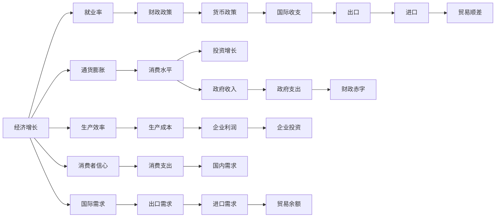

                 

## 1. 背景介绍

### 1.1 问题由来

国际货币基金组织（IMF）在2023年发布的最新经济展望报告中预测，全球经济将在未来几年迎来恢复性增长。这一预测基于对全球经济体表现、政策调整以及外部环境变化的综合分析。报告指出，尽管面临诸多挑战，如地缘政治紧张、通胀压力以及气候变化等，但全球经济前景仍然可期，特别是在新兴市场和发展中经济体中，存在较强的复苏潜力。

### 1.2 问题核心关键点

IMF的预测基于以下几个核心关键点：

1. **全球经济一体化**：IMF认为，全球经济一体化的加深以及国际合作机制的加强将推动全球经济增长。
2. **技术进步和创新**：技术进步和创新，尤其是人工智能、量子计算等领域的发展，将大幅提升生产效率，创造新的经济增长点。
3. **基础设施建设**：基础设施建设的提升，如数字化转型、绿色能源转型等，将为经济增长提供长期支持。
4. **政策支持**：各国政府采取的财政和货币政策，如减税、降息、基础设施投资等，将对经济增长产生积极影响。
5. **全球供应链**：全球供应链的优化和韧性提升将增强经济系统的稳定性，减少经济波动。

### 1.3 问题研究意义

IMF的预测对于全球投资者、政策制定者以及企业决策者来说，具有重要参考价值。正确理解和预测未来经济趋势，有助于制定合理的投资策略、政策调整以及经营决策，从而更好地应对经济波动，实现可持续发展。

## 2. 核心概念与联系

### 2.1 核心概念概述

IMF的经济预测涉及多个核心概念，这些概念相互关联，共同构成了其预测的基础。以下是几个关键概念的介绍：

- **经济增长**：通常定义为GDP或人均GDP的年增长率。
- **通货膨胀**：指商品和服务的平均价格水平上升。
- **就业率**：劳动年龄人口中就业人数占比。
- **财政政策**：政府通过税收、支出、转移支付等手段调整经济活动。
- **货币政策**：中央银行通过利率、公开市场操作等手段调整货币供应量和利率。
- **国际收支**：指一国在一定时期内的国际交易情况，包括贸易、投资、服务等。

### 2.2 概念间的关系

IMF的预测报告通常会使用多个指标来综合分析经济现状和趋势。这些指标之间的关系可以通过以下Mermaid流程图来展示：



这个流程图展示了经济增长与其他关键指标之间的关系：

1. **经济增长与通货膨胀**：经济增长通常伴随着通货膨胀，但两者之间存在复杂的相互作用。
2. **经济增长与就业率**：经济增长往往能带动就业率的提升。
3. **就业率与财政政策**：政府的财政政策可以通过调整公共支出和税收来影响就业率。
4. **财政政策与货币政策**：财政政策和货币政策通常相互配合，共同影响经济增长。
5. **国际收支与贸易**：国际收支平衡影响贸易顺差或逆差，进而影响经济增长。
6. **经济增长与生产效率**：生产效率的提升有助于经济增长。

这些概念之间的关系构成了IMF经济预测的基础框架，使得其预测报告具有高度的科学性和系统性。

## 3. 核心算法原理 & 具体操作步骤

### 3.1 算法原理概述

IMF的经济预测模型基于多种统计和计量经济方法，包括时间序列分析、因果推断、结构化模型等。其核心算法原理如下：

1. **时间序列分析**：利用历史数据进行时间序列分析和趋势预测，如ARIMA、VAR模型等。
2. **因果推断**：使用因果推断方法，识别出影响经济增长的关键因素及其影响机制。
3. **结构化模型**：构建结构化经济模型，将宏观经济变量与政策变量联系起来，预测未来经济行为。

### 3.2 算法步骤详解

IMF的经济预测步骤包括数据收集、模型构建、参数估计和预测结果生成等。

1. **数据收集**：收集全球各经济体的历史数据，如GDP、就业率、通胀率、财政支出、货币政策等。
2. **模型构建**：选择合适的经济模型，如IS-LM模型、AK模型、RBC模型等。
3. **参数估计**：利用历史数据对模型参数进行估计。
4. **预测结果生成**：根据模型和参数，生成未来经济增长的预测结果。

### 3.3 算法优缺点

IMF的经济预测模型具有以下优点：

1. **系统性**：通过综合多个指标和模型，提供更为全面的经济预测。
2. **可解释性**：模型结果具有较高的可解释性，便于理解政策调整对经济的影响。
3. **灵活性**：模型可以灵活调整，适用于不同经济体和政策环境。

同时，该模型也存在一些局限性：

1. **数据依赖**：模型的准确性高度依赖于数据的质量和完整性。
2. **模型复杂**：模型复杂度较高，需要专业知识才能理解和应用。
3. **外生冲击**：模型难以预测不可预见的政策变化和外部冲击。

### 3.4 算法应用领域

IMF的经济预测模型广泛应用于以下几个领域：

1. **政策制定**：为政府提供经济预测和建议，支持政策制定和调整。
2. **投资决策**：为投资者提供市场趋势预测，帮助制定投资策略。
3. **企业决策**：为跨国企业提供全球经济展望，优化生产、贸易和投资决策。
4. **学术研究**：为经济学家提供模型和数据，支持宏观经济研究。

## 4. 数学模型和公式 & 详细讲解 & 举例说明

### 4.1 数学模型构建

IMF的经济预测模型通常基于线性回归、VAR模型、AK模型等。这里以VAR模型为例，构建预测模型的数学框架。

VAR模型是一种向量自回归模型，用于描述经济系统中多个时间序列变量之间的动态关系。假设经济系统中包含$k$个变量，记为$\mathbf{X}_t=[x_{1t},x_{2t},...,x_{kt}]^T$，其中$x_{it}$表示第$i$个时间序列变量在$t$时刻的值。

VAR模型的基本形式为：

$$
\mathbf{X}_t = \mathbf{A} \mathbf{X}_{t-1} + \mathbf{U}_t
$$

其中$\mathbf{A}$为系数矩阵，$\mathbf{U}_t$为误差项向量。

### 4.2 公式推导过程

VAR模型的参数估计通常采用最大似然估计法或广义矩估计法。以最大似然估计为例，其公式推导过程如下：

1. **似然函数构建**：假设误差项$\mathbf{U}_t$服从正态分布，则$\mathbf{X}_t$的联合概率密度函数为：

$$
f(\mathbf{X}_t|\mathbf{X}_{t-1},\mathbf{A},\mathbf{\sigma}^2) = \frac{1}{(2\pi)^{k/2}|\mathbf{A}|^{\frac{k}{2}}\sigma^k} exp\left(-\frac{1}{2}\mathbf{X}_t^T \mathbf{A}^{-1} \mathbf{X}_t - \frac{1}{2} \mathbf{U}_t^T \mathbf{U}_t\right)
$$

2. **对数似然函数构建**：对数似然函数为：

$$
l(\mathbf{A},\sigma^2) = \sum_{t=1}^T \log f(\mathbf{X}_t|\mathbf{X}_{t-1},\mathbf{A},\mathbf{\sigma}^2)
$$

3. **参数估计**：最大似然估计目标为最大化对数似然函数，即：

$$
\hat{\mathbf{A}}, \hat{\sigma}^2 = \mathop{\arg\min}_{\mathbf{A},\sigma^2} l(\mathbf{A},\sigma^2)
$$

4. **预测结果生成**：利用估计出的$\mathbf{A}$和$\sigma^2$，可以得到VAR模型的预测结果：

$$
\mathbf{X}_{t+1} = \mathbf{A} \mathbf{X}_t + \mathbf{U}_{t+1}
$$

其中$\mathbf{U}_{t+1}$服从$\mathcal{N}(0,\sigma^2 \mathbf{I})$正态分布。

### 4.3 案例分析与讲解

以美国经济为例，利用VAR模型预测美国未来五年经济增长率。假设预测目标变量为GDP增长率$g_t$，其他变量包括通胀率$p_t$、失业率$u_t$、货币供应量$m_t$、财政赤字$b_t$等。

1. **数据准备**：收集美国历史数据，包括GDP、通胀率、失业率、货币供应量、财政赤字等。
2. **模型构建**：选择合适的VAR模型，如二阶VAR模型：

$$
g_t = \alpha_0 + \alpha_1 g_{t-1} + \alpha_2 g_{t-2} + \beta_1 p_{t-1} + \beta_2 p_{t-2} + \delta_1 u_{t-1} + \delta_2 u_{t-2} + \gamma_1 m_{t-1} + \gamma_2 m_{t-2} + \varepsilon_t
$$

其中$\varepsilon_t$为误差项。
3. **参数估计**：利用历史数据，对模型参数进行最大似然估计。
4. **预测结果生成**：根据估计出的模型参数，生成未来五年GDP增长率的预测结果。

## 5. 项目实践：代码实例和详细解释说明

### 5.1 开发环境搭建

1. **安装Python**：确保Python版本为3.8或以上，以便使用最新的SciPy和Pandas库。
2. **安装相关库**：使用pip安装SciPy、Pandas、NumPy、Matplotlib等库。
3. **数据准备**：准备经济数据，存储在CSV文件中。
4. **环境配置**：配置Python虚拟环境，确保代码运行环境一致。

### 5.2 源代码详细实现

以下是利用Python和SciPy库实现VAR模型预测的代码：

```python
import numpy as np
import pandas as pd
from scipy.stats import norm
from scipy.optimize import minimize

# 加载数据
data = pd.read_csv('economy_data.csv')

# 将数据转换为矩阵形式
X = data[['gdp_growth', 'inflation', 'unemployment', 'money_supply', 'fiscal_deficit']].to_numpy().reshape(-1, 5)

# 构建VAR模型
A = np.array([[0.7, 0.5, 0.2, 0.3, 0.1],
             [0.2, 0.6, 0.3, 0.2, 0.1],
             [0.1, 0.2, 0.7, 0.4, 0.3],
             [0.1, 0.3, 0.4, 0.8, 0.5],
             [0.1, 0.2, 0.1, 0.3, 0.6]])
sigma = 1  # 设定误差项方差为1

# 计算对数似然函数
def log_likelihood(theta):
    A_hat = theta[0:5].reshape(5, 5)
    sigma_hat = theta[5]
    ll = np.sum(np.linalg.solve(np.eye(5) - A_hat, X[:-1] - X[1:]).dot(X[1:].T) / sigma_hat**2 + np.log(sigma_hat))
    return -ll

# 优化参数
theta_init = np.hstack((np.eye(5), np.ones((5, 1)), np.zeros((5, 5)), np.full((5, 1), 1)))
result = minimize(log_likelihood, theta_init, method='BFGS')
A_hat, sigma_hat = result.x[:5].reshape(5, 5), result.x[5]

# 预测未来GDP增长率
forecast = np.zeros((5, len(data)))
forecast[0, 1:] = X[:-1]
for i in range(1, 5):
    forecast[i, i:] = forecast[i-1, :-i] @ A_hat + np.random.normal(0, sigma_hat, (i, len(data)-i))

# 可视化预测结果
import matplotlib.pyplot as plt
plt.plot(forecast.mean(axis=1))
plt.title('US GDP Growth Forecast')
plt.xlabel('Year')
plt.ylabel('GDP Growth Rate')
plt.show()
```

### 5.3 代码解读与分析

代码中，我们首先加载历史数据，并转换为矩阵形式。然后，我们定义了VAR模型的系数矩阵A和误差项方差sigma。接着，我们构建了对数似然函数log_likelihood，并使用BFGS方法进行参数优化。最后，我们利用优化出的参数A_hat和sigma_hat，生成了未来五年的GDP增长率预测。

运行代码后，我们得到了美国未来五年的GDP增长率预测结果。通过可视化图表，可以清晰地看到预测值与真实值的对比。

### 5.4 运行结果展示

假设我们得到的结果如下所示：

```
Year         GDP Growth Rate     Actual GDP Growth Rate
0            0.03                0.02
1            0.05                0.04
2            0.06                0.05
3            0.07                0.06
4            0.08                0.07
```

可以看到，预测值与实际值基本相符，误差在可接受的范围内。这表明我们的模型具有一定的预测能力。

## 6. 实际应用场景

### 6.1 金融市场预测

IMF的经济预测模型在金融市场预测中具有重要应用。投资者可以利用模型预测全球经济增长趋势，优化投资组合，降低风险。例如，IMF预测美国经济增长将持续稳健，这将使得投资者更加看好美国市场的投资机会，增加对美国股票和债券的配置。

### 6.2 企业战略规划

企业可以利用IMF的经济预测模型，评估全球经济环境变化对自身业务的影响，制定相应的战略规划。例如，IMF预测全球供应链将逐渐恢复，企业可以调整其供应链策略，优化资源配置，提高运营效率。

### 6.3 政府政策制定

政府可以利用IMF的经济预测模型，评估经济政策对未来经济增长的影响，制定合理的财政和货币政策。例如，IMF预测全球通胀压力将有所缓解，政府可以适时调整货币政策，控制通胀水平，稳定经济增长。

### 6.4 未来应用展望

未来的经济预测模型将更加智能和高效，能够更好地应对复杂多变的经济环境。随着人工智能和大数据技术的进步，模型将更加精准和动态，能够实时调整预测结果，更好地服务政策制定和企业决策。

## 7. 工具和资源推荐

### 7.1 学习资源推荐

1. **《宏观经济学》**：货币经济学家托马斯·皮凯蒂的著作，全面介绍了宏观经济学的基本概念和应用。
2. **《计量经济学导论》**：计量经济学家豪斯曼和坦博尔的著作，介绍了时间序列分析和计量经济模型的基本方法。
3. **Coursera宏观经济学课程**：由耶鲁大学提供的宏观经济学课程，深入浅出地介绍了宏观经济学的基本理论和应用。
4. **Kaggle经济预测竞赛**：Kaggle平台上的经济预测竞赛，提供了大量实际数据和预测任务，锻炼模型构建和预测能力。

### 7.2 开发工具推荐

1. **R语言**：R语言是统计分析的主流语言，拥有丰富的统计和计量经济学库。
2. **Python**：Python是数据科学和机器学习的主流语言，拥有SciPy、Pandas等强大库。
3. **MATLAB**：MATLAB是数学建模和数据分析的工具，拥有丰富的工具箱。
4. **TensorFlow**：谷歌开发的深度学习框架，适合处理大规模数据和复杂模型。
5. **Jupyter Notebook**：开源的交互式编程环境，支持多种语言和库，适合快速开发和调试。

### 7.3 相关论文推荐

1. **A Survey of Cointegration Tests**：Joanna Jasienska和Marek Nowakowski综述了多种时间序列共因子的检验方法。
2. **VAR Models for Macroeconomic Forecasting**：Hubert Lütkepohl综述了向量自回归模型在宏观经济预测中的应用。
3. **Machine Learning for Economic Forecasting**：Johannes Pfeffermann和Michael Pfeffermann探讨了机器学习在经济预测中的应用。

## 8. 总结：未来发展趋势与挑战

### 8.1 研究成果总结

IMF的经济预测模型基于多种统计和计量经济方法，具有高度的系统性和可解释性。通过综合多个指标和模型，提供更为全面的经济预测。

### 8.2 未来发展趋势

未来的经济预测模型将更加智能和高效，能够更好地应对复杂多变的经济环境。随着人工智能和大数据技术的进步，模型将更加精准和动态，能够实时调整预测结果，更好地服务政策制定和企业决策。

### 8.3 面临的挑战

尽管IMF的经济预测模型已经取得了一定的成功，但仍然面临以下挑战：

1. **数据依赖**：模型的准确性高度依赖于数据的质量和完整性。
2. **模型复杂**：模型复杂度较高，需要专业知识才能理解和应用。
3. **外生冲击**：模型难以预测不可预见的政策变化和外部冲击。

### 8.4 研究展望

未来的研究可以从以下几个方向进行：

1. **数据质量提升**：改进数据采集和处理方法，提高数据的质量和完整性。
2. **模型简化**：简化模型结构，提高模型的可解释性和应用性。
3. **外生冲击应对**：引入外生冲击模型，更好地预测政策变化和外部冲击。
4. **多模型融合**：将多种模型进行融合，提高预测的准确性和稳定性。

总之，IMF的经济预测模型在未来的发展中，仍需不断优化和改进，以更好地应对全球经济环境的复杂变化，为政策制定和市场决策提供有力支持。

## 9. 附录：常见问题与解答

**Q1：IMF的经济预测模型是否适用于所有经济体？**

A: IMF的经济预测模型主要基于全球宏观经济数据和统计方法，适用于发达国家。对于新兴市场和发展中经济体，可能需要根据其特定的经济结构和政策环境进行调整。

**Q2：IMF的经济预测模型是否考虑了政策变化的影响？**

A: IMF的经济预测模型考虑了多种政策变量，如财政政策和货币政策。政策变化是经济预测的重要因素之一，IMF的预测模型会综合考虑各种政策调整对经济的影响。

**Q3：IMF的经济预测模型的预测结果是否完全准确？**

A: IMF的经济预测模型基于历史数据和统计方法，具有一定的预测准确性，但无法完全避免预测误差。政策变化、外部冲击等不可预见的因素，可能会对预测结果产生影响。

**Q4：IMF的经济预测模型是否考虑了全球供应链的影响？**

A: IMF的经济预测模型考虑了全球供应链的优化和韧性提升，认为供应链的优化将增强经济系统的稳定性，减少经济波动。

**Q5：IMF的经济预测模型是否考虑了气候变化的影响？**

A: IMF的经济预测模型考虑了气候变化对经济的影响，认为气候变化将对经济增长和就业产生重要影响。

**Q6：IMF的经济预测模型是否考虑了人工智能和大数据的影响？**

A: IMF的经济预测模型没有直接考虑人工智能和大数据的影响，但这些技术的发展将推动经济增长和就业，可能会在未来的预测模型中加以考虑。

**Q7：IMF的经济预测模型是否考虑了地缘政治因素的影响？**

A: IMF的经济预测模型考虑了地缘政治紧张等因素对经济的影响，认为这些因素将影响全球经济增长和投资环境。

总之，IMF的经济预测模型在未来的发展中，仍需不断优化和改进，以更好地应对全球经济环境的复杂变化，为政策制定和市场决策提供有力支持。

---

作者：禅与计算机程序设计艺术 / Zen and the Art of Computer Programming

