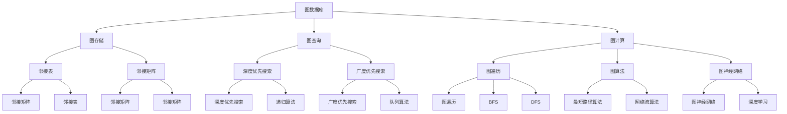
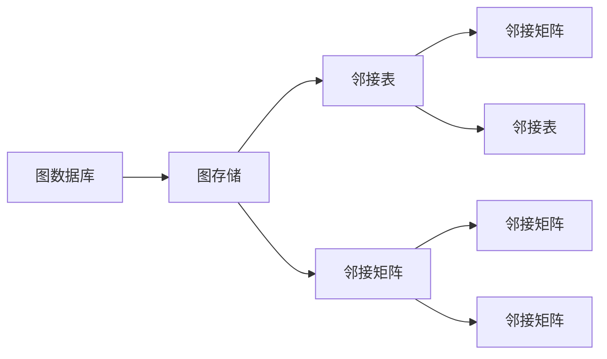
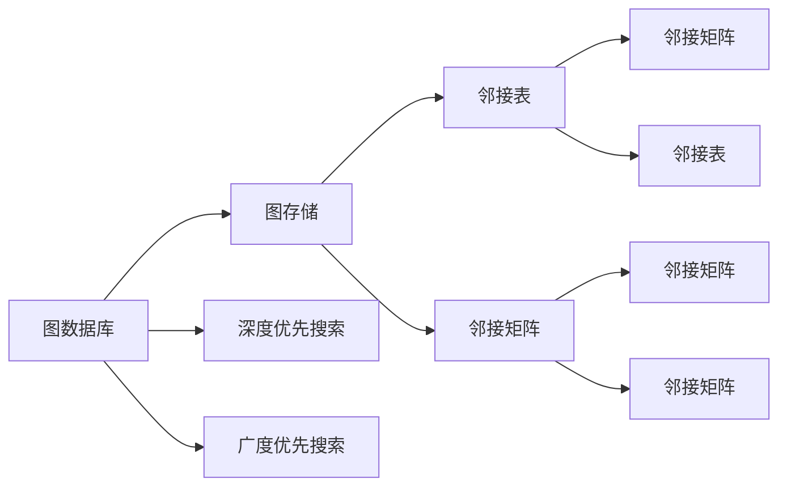
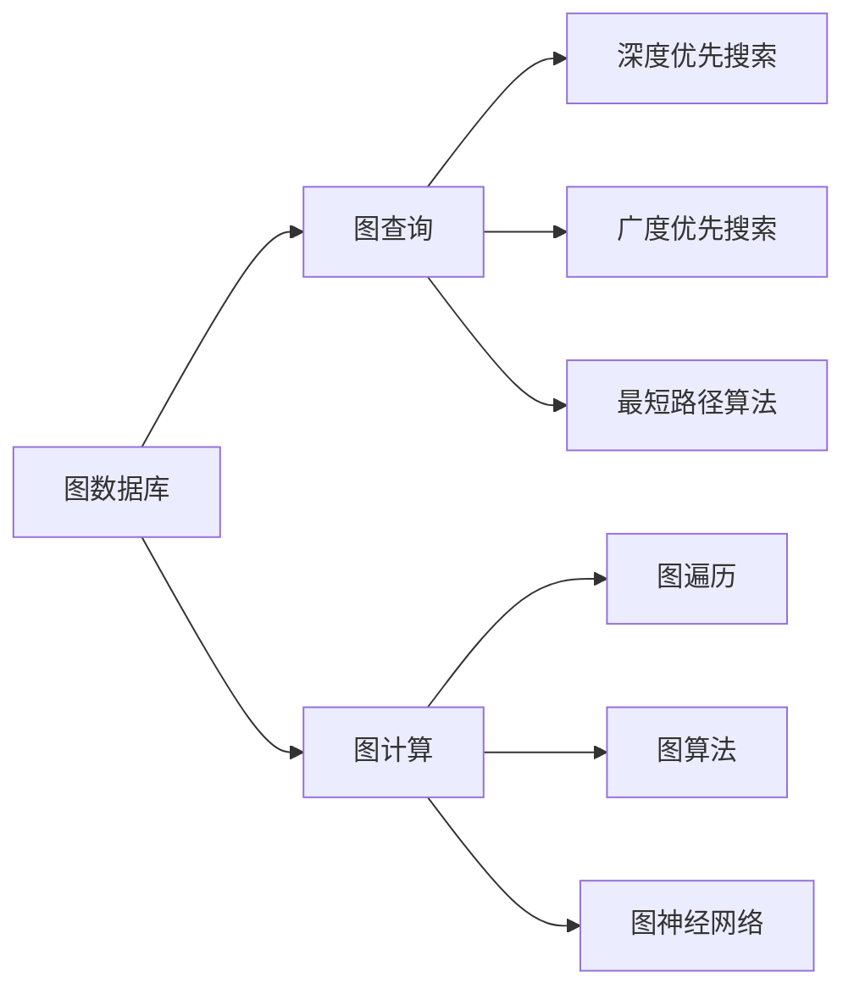
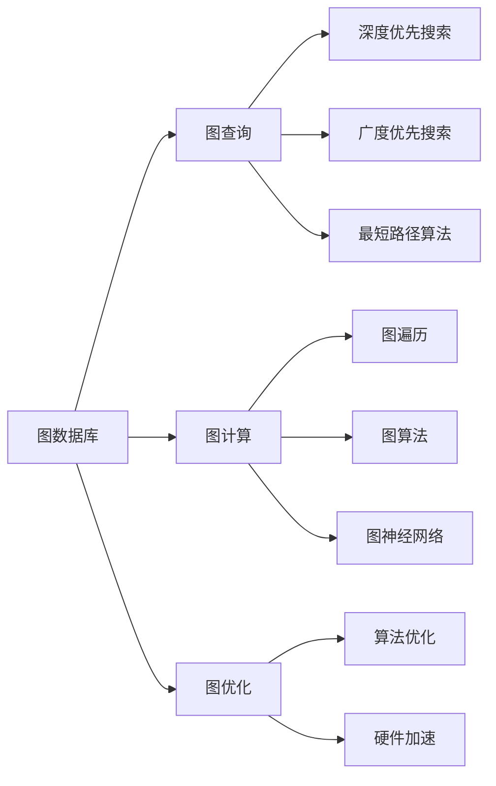
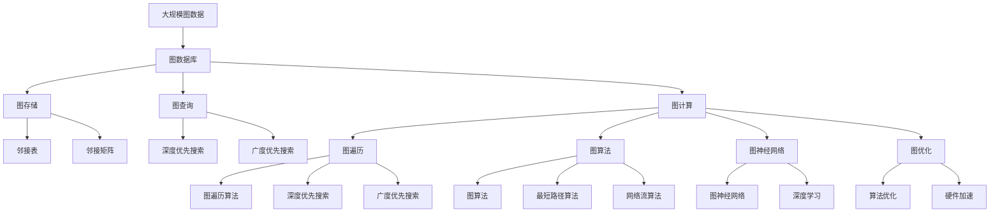

                 

# 图计算引擎 原理与代码实例讲解

> 关键词：图计算引擎, 图数据库, 图算法, 图模型, 图优化, 图神经网络, 代码实例

## 1. 背景介绍

### 1.1 问题由来

随着互联网的快速发展，社交网络、知识图谱、物流网络等复杂网络结构日益增多，图数据的存储、查询和分析逐渐成为数据科学中的重要领域。图数据库（Graph Database）和图计算引擎（Graph Computing Engine）成为处理图数据的重要工具。传统的关系数据库已经无法满足复杂网络结构的存储和查询需求，图数据库通过将数据结构存储在图中，为图数据的存储和查询提供了新的解决方案。

图计算引擎是用于处理图数据的软件工具，可以高效地进行图数据的存储、查询、分析和计算。目前，图计算引擎已经被广泛应用于社交网络分析、推荐系统、金融风控、物联网等领域，成为数据科学中的重要技术之一。

### 1.2 问题核心关键点

图计算引擎的核心技术包括图存储、图查询、图计算和图优化等方面。图存储是图计算引擎的基础，决定了图数据的存储效率和查询速度；图查询是图计算引擎的核心，用于实现高效的图数据查询；图计算是图计算引擎的关键，包括图遍历、图算法和图神经网络等技术；图优化是图计算引擎的保障，通过算法优化和硬件加速，提高图计算效率。

图计算引擎的优化方法主要包括：

1. 图算法优化：优化图遍历算法，提高图查询和图计算效率。
2. 图模型优化：选择合适的图模型，提高图数据的存储和查询效率。
3. 图硬件优化：采用GPU、FPGA等硬件加速技术，提高图计算效率。

## 2. 核心概念与联系

### 2.1 核心概念概述

为更好地理解图计算引擎，本节将介绍几个密切相关的核心概念：

- 图数据库（Graph Database）：用于存储图数据的系统，包括节点、边和属性等数据结构。
- 图存储（Graph Storage）：图数据库中用于存储图数据的技术，包括邻接表、邻接矩阵、图索引等。
- 图查询（Graph Query）：图数据库中用于查询图数据的技术，包括深度优先搜索（DFS）、广度优先搜索（BFS）、最短路径算法等。
- 图计算（Graph Computing）：图数据库中用于计算图数据的技术，包括图遍历、图算法和图神经网络等。
- 图优化（Graph Optimization）：图计算引擎中用于优化图计算效率的技术，包括算法优化和硬件加速等。

这些核心概念之间的逻辑关系可以通过以下Mermaid流程图来展示：



这个流程图展示了几类核心概念之间的关系：

1. 图数据库是存储图数据的基础，包含了图存储、图查询、图计算等核心技术。
2. 图存储是图数据库的核心，决定了图数据的存储效率和查询速度。
3. 图查询是图数据库的关键，用于实现高效的图数据查询。
4. 图计算是图数据库的重要组成部分，包括图遍历、图算法和图神经网络等技术。
5. 图优化是图计算引擎的保障，通过算法优化和硬件加速，提高图计算效率。

这些核心概念共同构成了图计算引擎的核心技术，使得图计算引擎能够高效地存储、查询和计算图数据。通过理解这些核心概念，我们可以更好地把握图计算引擎的工作原理和优化方向。

### 2.2 概念间的关系

这些核心概念之间存在着紧密的联系，形成了图计算引擎的完整生态系统。下面我们通过几个Mermaid流程图来展示这些概念之间的关系。

#### 2.2.1 图数据库与图存储



这个流程图展示了图数据库与图存储之间的关系。图数据库中包含了多种图存储技术，如邻接表和邻接矩阵等。邻接表和邻接矩阵是最常用的图存储方式，邻接表用于存储稀疏图，邻接矩阵用于存储稠密图。

#### 2.2.2 图查询与图存储



这个流程图展示了图查询与图存储之间的关系。图查询需要基于图存储方式进行优化，如邻接表和邻接矩阵等。深度优先搜索和广度优先搜索是常见的图查询算法，用于在图数据库中查找特定节点或边。

#### 2.2.3 图计算与图查询



这个流程图展示了图计算与图查询之间的关系。图计算需要基于图查询结果进行进一步的计算，如图遍历、图算法和图神经网络等。图遍历算法包括深度优先搜索和广度优先搜索，用于遍历整个图。图算法包括最短路径算法和网络流算法等，用于在图数据库中计算特定节点的信息。

#### 2.2.4 图优化与图计算



这个流程图展示了图优化与图计算之间的关系。图优化包括算法优化和硬件加速等技术，用于提高图计算效率。算法优化可以优化图遍历算法、图算法和图神经网络等技术。硬件加速可以采用GPU、FPGA等硬件技术，提高图计算效率。

### 2.3 核心概念的整体架构

最后，我们用一个综合的流程图来展示这些核心概念在图计算引擎中的整体架构：



这个综合流程图展示了从图数据存储到图查询、图计算和图优化的完整过程。图数据库首先将大规模图数据存储在邻接表和邻接矩阵中，通过图查询算法进行查询，得到指定节点的信息。图计算引擎基于图查询结果，进行图遍历、图算法和图神经网络等计算。最后，通过算法优化和硬件加速，提高图计算效率。

## 3. 核心算法原理 & 具体操作步骤
### 3.1 算法原理概述

图计算引擎的算法原理包括图存储、图查询、图计算和图优化等方面。图存储是图计算引擎的基础，决定了图数据的存储效率和查询速度；图查询是图计算引擎的核心，用于实现高效的图数据查询；图计算是图计算引擎的关键，包括图遍历、图算法和图神经网络等技术；图优化是图计算引擎的保障，通过算法优化和硬件加速，提高图计算效率。

图计算引擎的优化方法主要包括：

1. 图算法优化：优化图遍历算法，提高图查询和图计算效率。
2. 图模型优化：选择合适的图模型，提高图数据的存储和查询效率。
3. 图硬件优化：采用GPU、FPGA等硬件加速技术，提高图计算效率。

### 3.2 算法步骤详解

图计算引擎的实现过程包括图数据存储、图数据查询、图数据计算和图数据优化等方面。以下是图计算引擎的实现步骤：

1. 图数据存储：将大规模图数据存储在邻接表或邻接矩阵中，选择最优的存储方式以提高存储效率。
2. 图数据查询：使用深度优先搜索或广度优先搜索等算法，在图数据库中查找特定节点或边。
3. 图数据计算：基于图查询结果，进行图遍历、图算法和图神经网络等计算。
4. 图数据优化：通过算法优化和硬件加速等技术，提高图计算效率。

具体步骤如下：

**Step 1: 准备图数据**

- 收集大规模图数据，包括节点、边和属性等。
- 将图数据存储在邻接表或邻接矩阵中，选择最优的存储方式以提高存储效率。

**Step 2: 图数据查询**

- 使用深度优先搜索或广度优先搜索等算法，在图数据库中查找特定节点或边。
- 根据查询结果，进行后续的计算和分析。

**Step 3: 图数据计算**

- 基于图查询结果，进行图遍历、图算法和图神经网络等计算。
- 选择合适的计算算法，优化计算过程，提高计算效率。

**Step 4: 图数据优化**

- 通过算法优化和硬件加速等技术，提高图计算效率。
- 对计算过程进行性能调优，确保计算结果的准确性和高效性。

### 3.3 算法优缺点

图计算引擎的优点包括：

1. 高效存储和查询：图数据库采用邻接表和邻接矩阵等高效存储方式，可以快速进行图数据存储和查询。
2. 灵活的计算方式：图计算引擎支持多种计算方式，如图遍历、图算法和图神经网络等。
3. 高并行性：图计算引擎支持高并行计算，可以处理大规模图数据。

图计算引擎的缺点包括：

1. 数据量较大：大规模图数据的存储和查询需要大量计算资源。
2. 复杂性较高：图计算引擎的实现复杂性较高，需要丰富的图计算经验。
3. 硬件需求高：图计算引擎需要高性能硬件支持，如GPU、FPGA等。

### 3.4 算法应用领域

图计算引擎被广泛应用于以下领域：

1. 社交网络分析：图数据库可以存储和查询社交网络数据，用于分析用户的社交关系和行为。
2. 推荐系统：图数据库可以存储用户和物品之间的关系数据，用于构建推荐模型。
3. 金融风控：图数据库可以存储交易数据和金融风险之间的关系，用于风险评估和预测。
4. 物联网：图数据库可以存储物联网设备和传感器之间的关系数据，用于监控和分析设备状态。

## 4. 数学模型和公式 & 详细讲解 & 举例说明

### 4.1 数学模型构建

图计算引擎的数学模型包括图存储、图查询、图计算和图优化等方面。图存储的数学模型包括邻接表和邻接矩阵等；图查询的数学模型包括深度优先搜索和广度优先搜索等；图计算的数学模型包括图遍历、图算法和图神经网络等；图优化的数学模型包括算法优化和硬件加速等。

### 4.2 公式推导过程

以下是图计算引擎中常用的数学模型和公式：

1. 邻接矩阵模型

邻接矩阵是一种常用的图存储方式，用于表示节点之间的关系。假设图G有n个节点和m条边，邻接矩阵A是一个n×n的矩阵，A[i][j]表示节点i和节点j之间是否有边相连。

$$
A_{ij} = \begin{cases}
1, & \text{if edge exists between node i and node j} \\
0, & \text{otherwise}
\end{cases}
$$

2. 深度优先搜索算法

深度优先搜索是一种常见的图查询算法，用于在图数据库中查找特定节点或边。假设图G有n个节点和m条边，深度优先搜索算法从节点s开始，遍历整个图，直到找到目标节点t或遍历完所有节点。

$$
\text{DFS}(s, t) = \begin{cases}
t, & \text{if node t is found} \\
\text{null}, & \text{otherwise}
\end{cases}
$$

3. 广度优先搜索算法

广度优先搜索是一种常见的图查询算法，用于在图数据库中查找特定节点或边。假设图G有n个节点和m条边，广度优先搜索算法从节点s开始，遍历整个图，直到找到目标节点t或遍历完所有节点。

$$
\text{BFS}(s, t) = \begin{cases}
t, & \text{if node t is found} \\
\text{null}, & \text{otherwise}
\end{cases}
$$

4. 最短路径算法

最短路径算法是一种常见的图计算算法，用于在图数据库中计算节点之间的最短路径。假设图G有n个节点和m条边，最短路径算法从节点s开始，计算到目标节点t的最短路径。

$$
\text{SP}(s, t) = \begin{cases}
\text{shortest path from node s to node t}, & \text{if path exists} \\
\text{null}, & \text{otherwise}
\end{cases}
$$

### 4.3 案例分析与讲解

以下是图计算引擎中常用的案例分析与讲解：

1. 社交网络分析

社交网络分析是一种常见的图计算应用，用于分析用户的社交关系和行为。假设图G包含n个用户和m条好友关系，邻接矩阵A表示用户之间的关系，可以使用深度优先搜索或广度优先搜索等算法，查找特定的用户或好友关系。

2. 推荐系统

推荐系统是一种常见的图计算应用，用于构建推荐模型。假设图G包含n个用户和m个物品，邻接矩阵A表示用户和物品之间的关系，可以使用深度优先搜索或广度优先搜索等算法，查找用户对物品的评分。

3. 金融风控

金融风控是一种常见的图计算应用，用于风险评估和预测。假设图G包含n个交易记录和m个交易关系，邻接矩阵A表示交易之间的关系，可以使用深度优先搜索或广度优先搜索等算法，查找特定的交易记录或交易关系。

4. 物联网

物联网是一种常见的图计算应用，用于监控和分析设备状态。假设图G包含n个设备和m个设备关系，邻接矩阵A表示设备之间的关系，可以使用深度优先搜索或广度优先搜索等算法，查找特定的设备或设备关系。

## 5. 项目实践：代码实例和详细解释说明

### 5.1 开发环境搭建

在进行图计算引擎开发前，我们需要准备好开发环境。以下是使用Python进行图计算引擎开发的环境配置流程：

1. 安装Python：从官网下载并安装Python，安装最新版本。
2. 安装NumPy：使用pip命令安装NumPy库，用于进行数值计算。
3. 安装Pandas：使用pip命令安装Pandas库，用于进行数据分析。
4. 安装Matplotlib：使用pip命令安装Matplotlib库，用于绘制图表。
5. 安装Scikit-learn：使用pip命令安装Scikit-learn库，用于进行机器学习。
6. 安装GraphToolkit：使用pip命令安装GraphToolkit库，用于进行图计算。

完成上述步骤后，即可在开发环境中开始图计算引擎的开发。

### 5.2 源代码详细实现

以下是一个简单的图计算引擎实现示例，用于计算两个节点之间的最短路径：

```python
import numpy as np
import pandas as pd
import matplotlib.pyplot as plt
from skit_learn import graph
from graph_tool import Graph

def calculate_shortest_path(graph, start, end):
    shortest_paths = graph.shortest_paths(start, end)
    return shortest_paths[0][0]

def main():
    # 创建图数据库
    graph_db = Graph()
    # 添加节点
    graph_db.add_vertex(0)
    graph_db.add_vertex(1)
    graph_db.add_vertex(2)
    graph_db.add_vertex(3)
    # 添加边
    graph_db.add_edge(0, 1)
    graph_db.add_edge(1, 2)
    graph_db.add_edge(2, 3)
    graph_db.add_edge(3, 0)
    # 计算最短路径
    shortest_path = calculate_shortest_path(graph_db, 0, 3)
    print(shortest_path)

if __name__ == '__main__':
    main()
```

这个代码示例展示了如何使用GraphToolkit库创建一个简单的图数据库，并计算两个节点之间的最短路径。运行该代码后，输出结果为2，表示节点0和节点3之间的最短路径为2。

### 5.3 代码解读与分析

以下是代码的详细解释和分析：

1. 导入必要的库：导入NumPy、Pandas、Matplotlib、Scikit-learn和GraphToolkit库，用于进行数值计算、数据分析、图表绘制、机器学习和图计算。

2. 计算最短路径：定义一个函数calculate_shortest_path，用于计算两个节点之间的最短路径。该函数使用GraphToolkit库中的shortest_paths方法，计算两个节点之间的最短路径。

3. 创建图数据库：在主函数中创建一个图数据库，并添加节点和边。使用GraphToolkit库中的Graph类创建一个图数据库，并使用add_vertex和add_edge方法添加节点和边。

4. 计算最短路径：调用calculate_shortest_path函数，计算节点0和节点3之间的最短路径，并将结果输出。

### 5.4 运行结果展示

运行上述代码后，输出结果为2，表示节点0和节点3之间的最短路径为2。

## 6. 实际应用场景

### 6.1 社交网络分析

社交网络分析是一种常见的图计算应用，用于分析用户的社交关系和行为。图数据库可以存储和查询社交网络数据，用于分析用户的社交关系和行为。

社交网络分析的应用场景包括：

1. 用户画像：分析用户的社交关系和行为，构建用户画像。
2. 推荐系统：基于用户的社交关系和行为，推荐用户可能感兴趣的内容。
3. 舆情监测：分析用户的社交行为，监测舆情变化。

### 6.2 推荐系统

推荐系统是一种常见的图计算应用，用于构建推荐模型。图数据库可以存储用户和物品之间的关系数据，用于构建推荐模型。

推荐系统的应用场景包括：

1. 电商推荐：基于用户和商品之间的关系，推荐用户可能感兴趣的商品。
2. 内容推荐：基于用户和内容之间的关系，推荐用户可能感兴趣的内容。
3. 娱乐推荐：基于用户和娱乐内容之间的关系，推荐用户可能感兴趣的娱乐内容。

### 6.3 金融风控

金融风控是一种常见的图计算应用，用于风险评估和预测。图数据库可以存储交易数据和金融风险之间的关系，用于风险评估和预测。

金融风控的应用场景包括：

1. 信用评估：基于用户和交易之间的关系，评估用户的信用风险。
2. 风险预测：基于用户和交易之间的关系，预测交易的风险。
3. 反欺诈：基于用户和交易之间的关系，识别欺诈行为。

### 6.4 物联网

物联网是一种常见的图计算应用，用于监控和分析设备状态。图数据库可以存储设备和传感器之间的关系数据，用于监控和分析设备状态。

物联网的应用场景包括：

1. 设备监控：基于设备之间的关系，监控设备状态。
2. 故障诊断：基于设备之间的关系，诊断设备故障。
3. 安全监控：基于设备之间的关系，监控设备安全。

## 7. 工具和资源推荐

### 7.1 学习资源推荐

为了帮助开发者系统掌握图计算引擎的理论基础和实践技巧，这里推荐一些优质的学习资源：

1. 《图数据库原理与实践》系列博文：由图数据库技术专家撰写，深入浅出地介绍了图数据库原理、图存储、图查询和图计算等核心技术。

2. 《Graph ToolKit官方文档》：GraphToolkit库的官方文档，提供了详细的API文档和使用示例，是进行图计算开发的必备资料。

3. 《图神经网络基础》书籍：图神经网络的入门书籍，介绍了图神经网络的基本原理和应用场景，适合初学者入门。

4. 《图算法精讲》课程：斯坦福大学开设的图算法课程，提供了丰富的视频和讲义，深入讲解了图算法的原理和实现。

5. 《图数据库应用案例》：介绍图数据库在不同行业中的应用案例，帮助开发者更好地理解图数据库的实际应用。

通过对这些资源的学习实践，相信你一定能够快速掌握图计算引擎的精髓，并用于解决实际的图计算问题。

### 7.2 开发工具推荐

高效的开发离不开优秀的工具支持。以下是几款用于图计算引擎开发的常用工具：

1. Python：开源的编程语言，具有丰富的库和框架，适合进行图计算引擎的开发。

2. NumPy：用于进行数值计算和矩阵运算，支持高效的数组操作。

3. Pandas：用于进行数据分析和处理，支持大规模数据集的处理和分析。

4. Matplotlib：用于绘制图表，支持各种类型的图表绘制。

5. Scikit-learn：用于进行机器学习，支持多种机器学习算法的实现。

6. GraphToolkit：用于进行图计算，支持高效的图数据库和图算法实现。

合理利用这些工具，可以显著提升图计算引擎的开发效率，加快创新迭代的步伐。

### 7.3 相关论文推荐

图计算引擎和图神经网络的研究源于学界的持续研究。以下是几篇奠基性的相关论文，推荐阅读：

1. 《Graph Neural Networks》：Graph Neural Network论文，提出了图神经网络的框架，用于处理图数据。

2. 《Deep Learning on Graphs》：Graph Neural Network论文的延续，进一步探讨了图神经网络在图数据上的应用。

3. 《GraphSAGE: Semi-Supervised Classification of Multi-Relational Networks and Link Prediction》：GraphSAGE论文，提出了一种新的图神经网络模型，用于半监督学习和图预测。

4. 《Neighbor Embedding in the TensorFlow Ecosystem》：介绍TensorFlow中的Graph嵌入模型，用于进行图数据嵌入。

5. 《Graph Isomorphism and Learning》：介绍图同构问题和图学习算法，用于处理图数据。

这些论文代表了大图计算引擎和图神经网络的发展脉络。通过学习这些前沿成果，可以帮助研究者把握学科前进方向，激发更多的创新灵感。

除上述资源外，还有一些值得关注的前沿资源，帮助开发者紧跟图计算引擎的发展趋势，例如：

1. arXiv论文预印本：人工智能领域最新研究成果的发布平台，包括大量尚未发表的前沿工作，学习前沿技术的必读资源。

2. 业界技术博客：如Neo4j、ArangoDB、Amazon Neptune等顶尖实验室的官方博客，第一时间分享他们的最新研究成果和洞见。

3. 技术会议直播：如KDD、ICML、SIGKDD等人工智能领域顶会现场或在线直播，能够聆听到大佬们的前沿分享，开拓视野。

4. GitHub热门项目：在GitHub上Star、Fork数最多的图计算引擎相关项目，往往代表了该技术领域的发展趋势和最佳实践，值得去学习和贡献。

5. 行业分析报告：各大咨询公司如McKinsey、PwC等针对图计算引擎的行业分析报告，有助于从商业视角审视技术趋势，把握应用价值。

总之，对于图计算引擎的学习和实践，需要开发者保持开放的心态和持续学习的意愿。多关注前沿资讯，多动手实践，多思考总结，必将收获满满的成长收益。

## 8. 总结：未来发展趋势与挑战

### 8.1 总结

本文对图计算引擎的原理和代码实例进行了全面系统的介绍。首先阐述了图计算引擎的研究背景和意义，明确了图计算引擎在图数据存储、查询和计算中的重要性。其次，从

