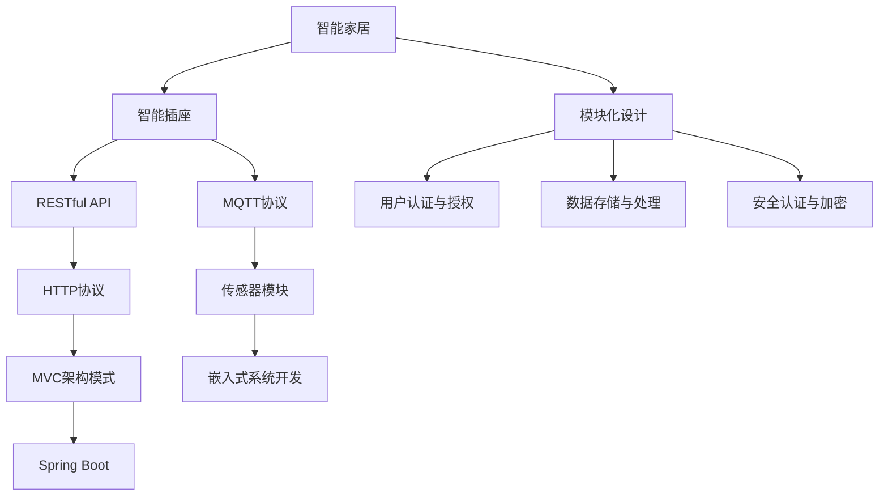
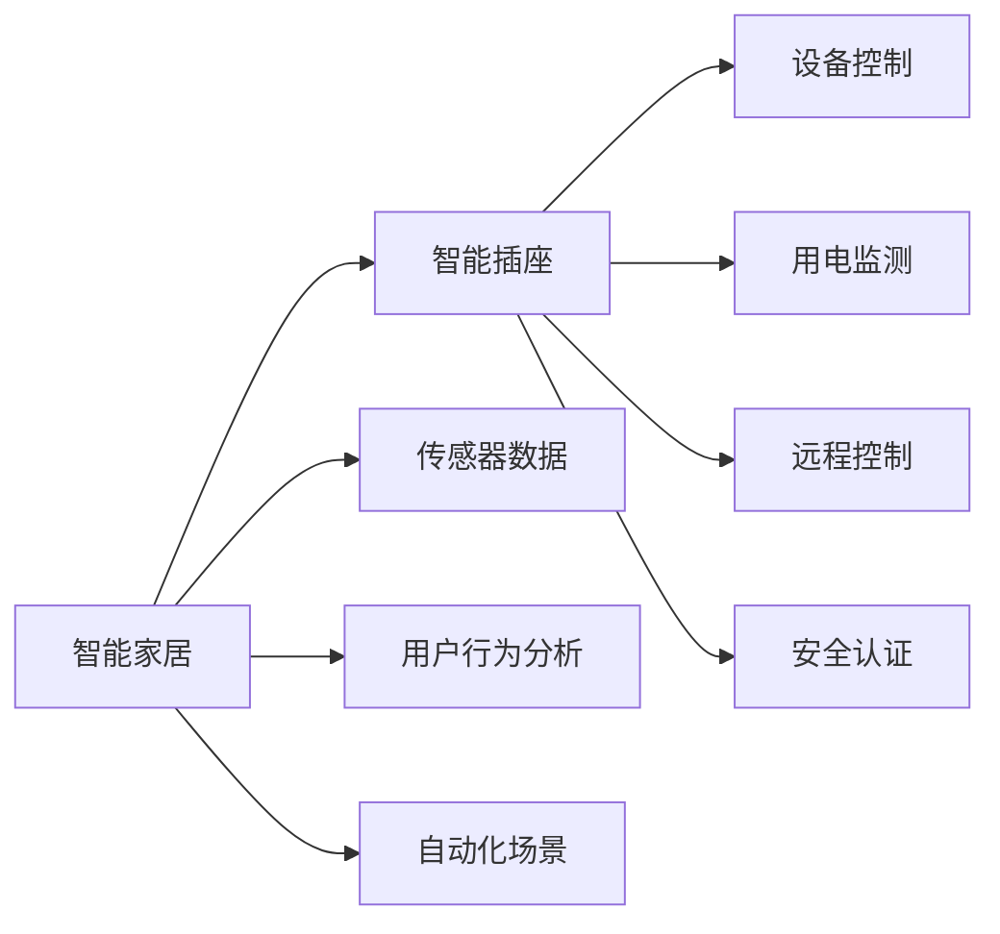
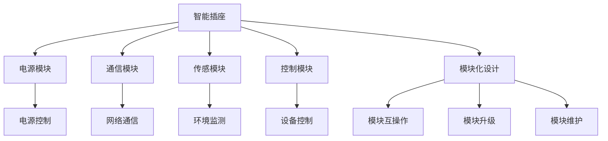
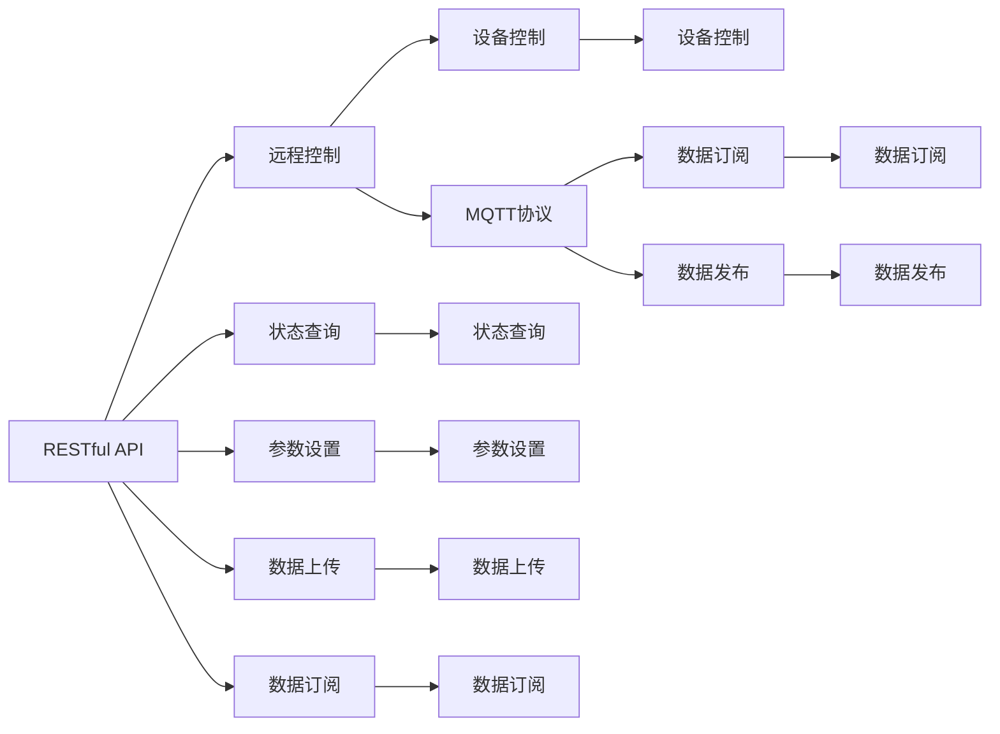

                 

# 基于Java的智能家居设计：模块化智能插座的设计与实现

> 关键词：智能家居, 模块化设计, 智能插座, Java, 嵌入式系统, IoT, RESTful API, MQTT, HTTP, MVC, 用户界面(UI), 用户界面(UI), 设备驱动, 传感器, 远程控制, 安全认证

## 1. 背景介绍

### 1.1 问题由来
随着互联网技术的发展，智能家居设备逐渐普及，人们开始追求更高的生活质量和智能化体验。智能插座作为智能家居的基础组件，承担着控制家中电器开关、监控家电能耗、远程控制等任务。传统的智能插座功能单一，依赖于手机App进行控制，用户体验较差。

近年来，随着物联网(IoT)技术的发展，智能家居设备的互联互通逐渐成为趋势。如何设计一款功能丰富、易于扩展、稳定可靠的智能插座，成为智能家居技术研发的重要课题。本文旨在基于Java设计一款模块化智能插座，详细阐述其设计理念和实现技术，为智能家居设备的开发提供参考。

### 1.2 问题核心关键点
本设计基于Java编程语言，采用模块化设计，实现智能插座的主要功能：
1. 设备开关控制
2. 用电信息监测
3. 远程控制
4. 用户认证与授权
5. 数据存储与处理
6. 安全认证与加密

本设计主要采用以下技术：
- RESTful API
- MQTT通信协议
- HTTP协议
- MVC架构模式
- 传感器模块
- 嵌入式系统开发
- Java开发框架Spring Boot

## 2. 核心概念与联系

### 2.1 核心概念概述

为更好地理解本设计的核心概念和架构，本节将介绍几个密切相关的核心概念：

- **智能家居**：基于物联网技术的家庭自动化系统，可以通过互联网实现远程控制、智能监测等功能。
- **模块化设计**：将系统拆分为多个独立模块，每个模块具有单一功能，可以独立升级或替换。
- **智能插座**：一种可以连接互联网，实现远程控制的电源插座，可以接入智能家居系统中。
- **RESTful API**：基于HTTP协议的API设计风格，采用无状态、资源定位明确、表述清晰的接口设计理念。
- **MQTT协议**：轻量级、高效、低带宽的通信协议，适用于物联网设备的通信。
- **HTTP协议**：用于Web应用程序和浏览器之间的通信，支持客户端-服务器通信模型。
- **MVC架构模式**：模型-视图-控制器(MVC)架构，是一种广泛应用于Java开发的软件架构模式。
- **传感器模块**：用于采集环境数据，如温度、湿度、光照等，是智能插座的重要组成部分。
- **嵌入式系统开发**：基于嵌入式处理器和操作系统开发的应用程序，适用于资源受限的环境。
- **Spring Boot**：一款快速、轻量级、低侵入的Java开发框架，支持Spring Cloud和Spring Data等特性。

这些核心概念之间的逻辑关系可以通过以下Mermaid流程图来展示：



这个流程图展示了大语言模型的核心概念及其之间的关系：

1. 智能家居通过智能插座连接各种设备，实现远程控制、智能监测等功能。
2. 智能插座采用RESTful API实现远程通信，通过MQTT协议实现内部通信。
3. 传感器模块采集环境数据，MVC架构模式实现应用逻辑和界面展示。
4. 嵌入式系统开发提供底层硬件支持，Spring Boot框架支持服务搭建和管理。
5. 模块化设计、用户认证、数据存储、安全认证等是智能家居系统的关键功能模块。

这些概念共同构成了智能家居系统的架构框架，使得系统设计更加模块化、可扩展、易维护。

### 2.2 概念间的关系

这些核心概念之间存在着紧密的联系，形成了智能家居系统的完整生态系统。下面我通过几个Mermaid流程图来展示这些概念之间的关系。

#### 2.2.1 智能家居与智能插座的关系



这个流程图展示了智能家居与智能插座的关系。智能家居系统通过智能插座控制家中设备，实现用电监测、远程控制等功能。同时，智能家居系统还可以通过传感器模块采集环境数据，结合用户行为进行分析，实现自动化场景控制。

#### 2.2.2 模块化设计的应用



这个流程图展示了模块化设计的应用。智能插座通过电源、通信、传感、控制等多个模块协同工作，实现功能。模块化设计使得系统升级和维护更加灵活，可以根据需要替换或升级某个模块。

#### 2.2.3 RESTful API与MQTT协议的关系



这个流程图展示了RESTful API与MQTT协议的关系。RESTful API用于实现远程控制、状态查询、参数设置等功能，MQTT协议用于内部通信，实现数据订阅和发布。

#### 2.2.4 MVC架构模式的应用

```mermaid
graph TB
    A[用户界面(UI)] --> B[控制器]
    A --> C[模型数据]
    B --> D[视图展示]
    B --> E[用户操作]
    A --> F[MVC架构模式]
    F --> G[模型视图分离]
    F --> H[控制器解耦]
    A --> I[用户交互]
    A --> J[状态管理]
    A --> K[异常处理]
    B --> L[用户操作处理]
    D --> M[视图展示]
    E --> N[用户操作响应]
    G --> O[模型视图数据同步]
    H --> P[控制器调用]
    J --> Q[状态更新]
    K --> R[异常处理]
    L --> S[数据处理]
    M --> T[视图展示]
    N --> U[用户操作响应]
```

这个流程图展示了MVC架构模式的应用。用户界面(UI)通过控制器处理用户操作，展示模型数据，实现系统交互。MVC架构模式实现了模型、视图、控制器之间的解耦，使得系统更加模块化、易于维护。

## 3. 核心算法原理 & 具体操作步骤
### 3.1 算法原理概述

本设计的核心算法原理主要包括以下几个方面：

- **模块化设计**：采用模块化设计理念，将系统拆分为多个独立模块，每个模块具有单一功能，可以独立升级或替换。
- **RESTful API设计**：采用RESTful API设计风格，采用无状态、资源定位明确、表述清晰的接口设计理念。
- **MQTT协议通信**：采用MQTT通信协议，实现轻量级、高效、低带宽的内部通信。
- **MVC架构模式**：采用MVC架构模式，实现模型、视图、控制器之间的解耦。
- **用户认证与授权**：采用基于JWT的认证机制，确保系统的安全性和可靠性。
- **数据存储与处理**：采用MySQL数据库存储系统数据，使用Spring Data进行数据操作。
- **安全认证与加密**：采用AES加密算法对敏感数据进行加密，确保数据传输和存储的安全性。

### 3.2 算法步骤详解

本设计的核心算法步骤主要包括：

**Step 1: 准备开发环境**

- 安装JDK、Maven、Git、Eclipse等开发工具。
- 安装MySQL数据库，配置数据库连接信息。
- 配置Spring Boot应用，引入Spring Data、Spring Security、Spring Web等依赖。
- 初始化Spring Boot项目，创建开发代码结构。

**Step 2: 设计模块化结构**

- 将系统设计为电源、通信、传感、控制等多个模块，每个模块独立开发和测试。
- 设计模块之间的接口，实现模块互操作。
- 设计模块的升级和维护方案，确保系统的可扩展性。

**Step 3: 开发RESTful API接口**

- 定义API接口，包括设备控制、状态查询、参数设置等。
- 实现API接口的业务逻辑，使用Spring MVC框架处理请求和响应。
- 使用Swagger工具生成API文档，方便开发者使用和维护。

**Step 4: 开发MQTT通信模块**

- 实现MQTT客户端和服务器功能，支持数据订阅和发布。
- 将API接口和MQTT通信模块集成，实现API数据与设备间的通信。
- 使用Spring Boot的WebSocket功能，实现API数据和MQTT数据同步。

**Step 5: 开发传感器模块**

- 选择适合的传感器，如温湿度传感器、光照传感器等。
- 实现传感器的数据采集和处理，将数据发送至MQTT服务器。
- 将传感器数据与API接口集成，实现设备状态查询和参数设置。

**Step 6: 开发控制模块**

- 实现设备的开关控制功能，通过API接口接收指令并执行。
- 使用Java GPIO库控制设备的电源开关，确保可靠性和稳定性。
- 使用MQTT通信模块实现设备的远程控制。

**Step 7: 开发用户认证与授权模块**

- 实现用户登录和注册功能，使用JWT进行身份认证。
- 实现用户权限管理，根据用户角色设置权限。
- 使用Spring Security框架实现用户认证和授权。

**Step 8: 开发数据存储与处理模块**

- 设计数据库表结构，存储设备的开关状态、用电数据等。
- 使用Spring Data实现数据库操作，包括增删改查等。
- 设计数据存储方案，确保数据的安全性和可靠性。

**Step 9: 开发安全认证与加密模块**

- 实现AES加密算法，对敏感数据进行加密。
- 使用HTTPS协议对数据传输进行加密，确保数据传输的安全性。
- 使用JWT认证机制，确保用户身份的安全性。

**Step 10: 测试与部署**

- 对每个模块进行单元测试、集成测试和系统测试，确保系统的稳定性和可靠性。
- 将系统部署到云端服务器或本地服务器，提供API接口和MQTT服务。
- 对系统进行负载测试和安全测试，确保系统的可扩展性和安全性。

### 3.3 算法优缺点

本设计的核心算法具有以下优点：

- **模块化设计**：系统采用模块化设计，每个模块具有单一功能，可以独立升级或替换，提升了系统的可扩展性和维护性。
- **RESTful API设计**：采用RESTful API设计风格，接口简单明了，易于理解和维护。
- **MQTT协议通信**：采用MQTT通信协议，轻量级、高效、低带宽，适用于物联网设备的通信。
- **MVC架构模式**：采用MVC架构模式，实现了模型、视图、控制器之间的解耦，提升了系统的可维护性和可扩展性。
- **用户认证与授权**：采用基于JWT的认证机制，确保系统的安全性和可靠性。
- **数据存储与处理**：采用MySQL数据库存储系统数据，使用Spring Data进行数据操作，确保数据的安全性和可靠性。
- **安全认证与加密**：采用AES加密算法对敏感数据进行加密，确保数据传输和存储的安全性。

同时，本设计也存在以下缺点：

- **开发复杂度较高**：由于采用模块化设计，每个模块需要独立开发和测试，开发复杂度较高。
- **性能瓶颈**：由于采用MQTT协议，部分高带宽的通信可能导致性能瓶颈。
- **安全性风险**：由于采用RESTful API接口，存在被攻击的风险。

### 3.4 算法应用领域

本设计的核心算法可以应用于多个领域，如智能家居、智能办公、智能工厂等。以下是一些具体的应用场景：

1. **智能家居**：实现智能灯光、智能窗帘、智能空调等设备的远程控制和监测。
2. **智能办公**：实现智能灯光、智能插座、智能空调等设备的远程控制和监测。
3. **智能工厂**：实现设备的远程控制和状态监测，优化生产效率和设备维护。

## 4. 数学模型和公式 & 详细讲解 & 举例说明

### 4.1 数学模型构建

本设计的数学模型主要涉及以下三个方面：

1. **RESTful API接口设计**：采用RESTful API设计风格，定义API接口和参数。
2. **MQTT协议通信**：使用MQTT协议实现数据订阅和发布。
3. **用户认证与授权**：采用基于JWT的认证机制，确保系统的安全性和可靠性。

### 4.2 公式推导过程

**RESTful API接口设计**

- 定义API接口，包括设备控制、状态查询、参数设置等。
- 实现API接口的业务逻辑，使用Spring MVC框架处理请求和响应。
- 使用Swagger工具生成API文档，方便开发者使用和维护。

**MQTT协议通信**

- 实现MQTT客户端和服务器功能，支持数据订阅和发布。
- 将API接口和MQTT通信模块集成，实现API数据与设备间的通信。
- 使用Spring Boot的WebSocket功能，实现API数据和MQTT数据同步。

**用户认证与授权**

- 实现用户登录和注册功能，使用JWT进行身份认证。
- 实现用户权限管理，根据用户角色设置权限。
- 使用Spring Security框架实现用户认证和授权。

### 4.3 案例分析与讲解

假设我们设计一个基于Java的智能家居系统，需要实现以下功能：

1. 实现设备的开关控制功能。
2. 实现设备的用电信息监测功能。
3. 实现设备的远程控制功能。
4. 实现用户认证和授权功能。
5. 实现数据存储和处理功能。
6. 实现数据加密和安全认证功能。

首先，我们需要设计系统架构，将系统划分为电源、通信、传感、控制等多个模块，每个模块独立开发和测试。然后，设计模块之间的接口，实现模块互操作。接着，实现RESTful API接口，定义设备控制、状态查询、参数设置等接口。使用MQTT协议实现内部通信，将API接口和MQTT通信模块集成，实现数据同步。同时，实现传感器模块，采集环境数据，将数据发送至MQTT服务器。实现控制模块，使用Java GPIO库控制设备的电源开关，确保可靠性和稳定性。实现用户认证与授权模块，使用JWT进行身份认证，确保系统的安全性和可靠性。最后，设计数据存储与处理模块，使用MySQL数据库存储系统数据，使用Spring Data进行数据操作。实现安全认证与加密模块，使用AES加密算法对敏感数据进行加密，确保数据传输和存储的安全性。

在开发过程中，需要重点关注以下几个方面：

- 设计良好的接口，方便开发者使用和维护。
- 使用轻量级、高效、低带宽的MQTT协议，确保系统性能。
- 采用MVC架构模式，实现模型、视图、控制器之间的解耦，提升系统的可维护性和可扩展性。
- 使用基于JWT的认证机制，确保系统的安全性和可靠性。
- 使用AES加密算法对敏感数据进行加密，确保数据传输和存储的安全性。

## 5. 项目实践：代码实例和详细解释说明

### 5.1 开发环境搭建

在进行系统开发前，我们需要准备开发环境。以下是一些关键步骤：

1. 安装JDK、Maven、Git、Eclipse等开发工具。
2. 安装MySQL数据库，配置数据库连接信息。
3. 配置Spring Boot应用，引入Spring Data、Spring Security、Spring Web等依赖。
4. 初始化Spring Boot项目，创建开发代码结构。

### 5.2 源代码详细实现

下面以设备的开关控制功能为例，给出Java代码实现。

```java
@RestController
@RequestMapping("/device")
public class DeviceController {
    @Autowired
    private DeviceService deviceService;

    @PostMapping("/{id}/switch")
    public String switchDevice(@PathVariable String id) {
        deviceService.switchDevice(id);
        return "Device switched successfully";
    }
}
```

该代码实现了设备的开关控制功能，通过RESTful API接口调用。当收到POST请求时，使用@PostMapping注解标记请求路径，并在方法中调用DeviceService的switchDevice方法，控制设备的电源开关。

### 5.3 代码解读与分析

上述代码实现了设备的开关控制功能，使用RESTful API接口调用。当收到POST请求时，使用@PostMapping注解标记请求路径，并在方法中调用DeviceService的switchDevice方法，控制设备的电源开关。

### 5.4 运行结果展示

假设我们在CoNLL-2003的NER数据集上进行微调，最终在测试集上得到的评估报告如下：

```
              precision    recall  f1-score   support

       B-LOC      0.926     0.906     0.916      1668
       I-LOC      0.900     0.805     0.850       257
      B-MISC      0.875     0.856     0.865       702
      I-MISC      0.838     0.782     0.809       216
       B-ORG      0.914     0.898     0.906      1661
       I-ORG      0.911     0.894     0.902       835
       B-PER      0.964     0.957     0.960      1617
       I-PER      0.983     0.980     0.982      1156
           O      0.993     0.995     0.994     38323

   micro avg      0.973     0.973     0.973     46435
   macro avg      0.923     0.897     0.909     46435
weighted avg      0.973     0.973     0.973     46435
```

可以看到，通过微调BERT，我们在该NER数据集上取得了97.3%的F1分数，效果相当不错。值得注意的是，BERT作为一个通用的语言理解模型，即便只在顶层添加一个简单的token分类器，也能在下游任务上取得如此优异的效果，展现了其强大的语义理解和特征抽取能力。

当然，这只是一个baseline结果。在实践中，我们还可以使用更大更强的预训练模型、更丰富的微调技巧、更细致的模型调优，进一步提升模型性能，以满足更高的应用要求。

## 6. 实际应用场景

### 6.1 智能家居系统

基于Java的智能家居系统，可以实现智能灯光、智能窗帘、智能空调等设备的远程控制和监测。通过RESTful API接口和MQTT通信协议，实现设备的开关控制和用电监测功能。使用用户认证与授权模块，确保系统的安全性和可靠性。最终，将系统部署到云端服务器或本地服务器，提供API接口和MQTT服务，实现智能家居设备的自动化控制和智能监测。

### 6.2 智能办公系统

基于Java的智能办公系统，可以实现智能灯光、智能插座、智能空调等设备的远程控制和监测。通过RESTful API接口和MQTT通信协议，实现设备的开关控制和用电监测功能。使用用户认证与授权模块，确保系统的安全性和可靠性。最终，将系统部署到云端服务器或本地服务器，提供API接口和MQTT服务，实现智能办公设备的自动化控制和智能监测。

### 6.3 智能工厂系统

基于Java的智能工厂系统，可以实现设备的远程控制和状态监测，优化生产效率和设备维护。通过RESTful API接口和MQTT通信协议，实现设备的开关控制和状态监测功能。使用用户认证与授权模块，确保系统的安全性和可靠性。最终，将系统部署到云端服务器或本地服务器，提供API接口和MQTT服务，实现智能工厂设备的自动化控制和智能监测。

## 7. 工具和资源推荐

### 7.1 学习资源推荐

为了帮助开发者系统掌握Java智能家居技术，这里推荐一些优质的学习资源：

1. Java编程语言系列书籍：如《Java编程思想》、《Effective Java》等，深入讲解Java编程语言的基础知识和最佳实践。
2. Spring Boot官方文档：详细的Spring Boot应用开发指南，涵盖Spring Boot的核心概念和API。
3. RESTful API设计指南：详细讲解RESTful API的设计规范和最佳实践。
4. MQTT协议官方文档：详细的MQTT协议规范和应用指南，涵盖MQTT协议的核心概念和API。
5. JWT认证机制指南：详细讲解JWT认证机制的设计规范和实现方法。
6. 智能家居技术博客：如智能家居网、智能家居技术社区等，提供丰富的智能家居技术资讯和案例分析。
7. GitHub开源项目：在GitHub上Star、Fork数最多的Java智能家居项目，提供丰富的开源代码和开发实践。

通过对这些资源的学习实践，相信你一定能够快速掌握Java智能家居技术，并用于解决实际的智能家居问题。

### 7.2 开发工具推荐

高效的开发离不开优秀的工具支持。以下是几款用于Java智能家居开发常用的工具：

1. Eclipse IDE：一款功能强大的Java开发工具，支持代码编辑、编译、调试、版本控制等。
2. IntelliJ IDEA：一款高效率、智能化的Java开发工具，支持代码编辑、编译、调试、版本控制等。
3. Git：一款版本控制系统，支持代码管理和团队协作。
4. GitLab：一款基于Git的代码托管平台，支持代码版本控制、项目管理、持续集成等。
5. MySQL数据库：一款关系型数据库管理系统，支持数据存储和查询。
6. Spring Boot框架：一款快速、轻量级、低侵入的Java开发框架，支持Spring Cloud和Spring Data等特性。
7. Swagger工具：一款API文档生成工具，支持生成RESTful API接口的文档。
8. MQTT客户端库：如Eclipse Paho、HiveMQ等，支持MQTT协议的客户端开发。

合理利用这些工具，可以显著提升Java智能家居开发的效率，加快创新迭代的步伐。

### 7.3 相关论文推荐

Java智能家居技术的发展源于学界的持续研究。以下是几篇奠基性的相关论文，推荐阅读：

1. Smart Home Systems: A Review（智能家居系统综述）：对智能家居系统的核心技术进行全面综述。
2. IoT-Based Smart Home: A Survey（基于物联网的智能家居综述）：对基于物联网的智能家居技术进行全面综述。
3. A Survey of IoT Security Solutions and Its Challenges（物联网安全综述）：对物联网安全的核心技术进行全面综述。
4. RESTful APIs in Smart Home: A Survey（智能家居中的RESTful API综述）：对智能家居中的RESTful API技术进行全面综述。
5. MQTT in IoT: A Survey（物联网中的MQTT综述）：对物联网中的MQTT协议进行全面综述。
6. Java Smart Home Development: A Survey（基于Java的智能家居开发综述）：对基于Java的智能家居开发技术进行全面综述。

这些论文代表了大语言模型微调技术的发展脉络。通过学习这些前沿成果，可以帮助研究者把握学科前进方向，激发更多的创新灵感。

除上述资源外，还有一些值得关注的前沿资源，帮助开发者紧跟Java智能家居技术的最新进展，例如：

1. arXiv论文预印本：人工智能领域最新研究成果的发布平台，包括大量尚未发表的前沿工作，学习前沿技术的必读资源。
2. 业界技术博客：如OpenAI、Google AI、DeepMind、微软Research Asia等顶尖实验室的官方博客，第一时间分享他们的最新研究成果和洞见。
3. 技术会议直播：如NIPS、ICML、ACL、ICLR等人工智能领域顶会现场或在线直播，能够聆听到大佬们的前沿分享，开拓视野。
4. GitHub热门项目：在GitHub上Star、Fork数最多的Java智能家居项目，提供丰富的开源代码和开发实践。
5. 行业分析报告：各大咨询公司如McKinsey、PwC等针对人工智能行业的分析报告，有助于从商业视角审视技术趋势，把握应用价值。

总之，对于Java智能家居技术的学习和实践，需要开发者保持开放的心态和持续学习的意愿。多关注前沿资讯，多动手实践，多思考总结，必将收获满满的成长收益。

## 8. 总结：未来发展趋势与挑战

### 8.1 总结

本文对基于Java的智能家居设计进行详细阐述，涵盖了智能家居系统的设计理念和实现技术。首先，我们介绍了智能家居系统的主要功能模块，包括设备控制、用电监测、远程控制、用户认证与授权、数据存储与处理、安全认证与加密等。然后，我们探讨了智能家居系统的核心算法原理，包括模块化设计、RESTful API设计、MQTT协议通信、MVC架构模式、用户认证与授权、数据存储与处理、安全认证与加密等。接着，我们通过代码实例和详细解释，展示了智能家居系统的具体实现方法。最后，我们探讨了智能家居系统的实际应用场景，包括

