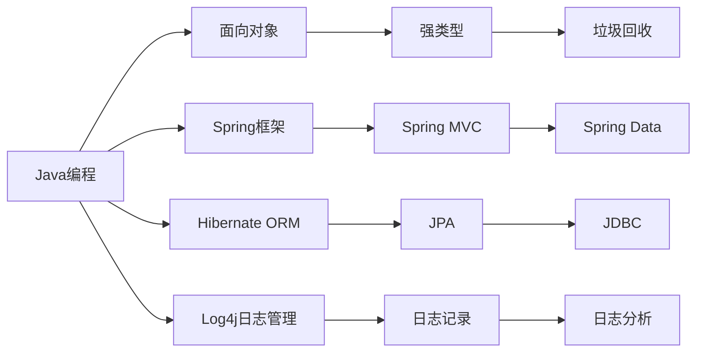

                 

# 基于Java的智能家居设计：浅析Java在智能家居系统中的故障排查技巧

> 关键词：智能家居系统,Java编程,故障排查,系统设计,家居自动化

## 1. 背景介绍

随着物联网技术的快速发展，智能家居系统逐渐成为了家庭生活中不可或缺的一部分。然而，智能家居系统的复杂性和多样性也带来了诸多挑战，尤其是系统的稳定性和可靠性。Java作为一种高效、可靠且广泛使用的编程语言，在智能家居系统设计中具有重要应用。本文将从Java编程的角度，探讨智能家居系统中的故障排查技巧，并提出基于Java的智能家居系统设计方案，以期提升系统的稳定性和可靠性。

## 2. 核心概念与联系

### 2.1 核心概念概述

为了更好地理解Java在智能家居系统中的故障排查技巧，我们需要首先理解以下几个核心概念：

- **Java编程**：Java是一种面向对象、跨平台、高性能的编程语言，广泛应用于企业级应用和移动端开发。Java的跨平台性和丰富的类库，使其成为智能家居系统开发中的首选。
- **智能家居系统**：智能家居系统是指通过互联网连接各种智能设备，实现家庭自动化、智能化管理和控制的系统。主要包括智能安防、照明控制、家电控制、温湿度控制等功能。
- **故障排查**：故障排查是指通过诊断、分析和修复等手段，发现并解决系统中存在的问题，确保系统正常运行的过程。

### 2.2 核心概念间的关系

Java作为智能家居系统开发的主要语言，其在故障排查中的作用不可忽视。Java编程语言的特点，如面向对象、强类型、垃圾回收机制等，为智能家居系统的稳定性和可靠性提供了有力支持。同时，Java丰富的类库和工具，如Spring框架、Hibernate ORM、Log4j日志管理等，也极大地简化了故障排查和系统调试的复杂度。

通过以下Mermaid流程图，我们可以更直观地理解Java编程在智能家居系统中的故障排查作用：



## 3. 核心算法原理 & 具体操作步骤

### 3.1 算法原理概述

智能家居系统中的故障排查，本质上是通过分析和诊断，找出系统故障的根本原因，并采取相应的修复措施，恢复系统正常运行。基于Java的故障排查，主要涉及以下几个步骤：

1. **日志记录和分析**：通过日志记录系统运行过程中的状态和操作，发现异常情况和错误信息。
2. **问题定位和分析**：根据日志信息，定位问题所在，分析问题的根源。
3. **修复和测试**：采取修复措施，解决问题，并进行系统测试，确保修复有效。

### 3.2 算法步骤详解

基于Java的智能家居系统故障排查步骤如图：


具体步骤如下：

1. **日志记录**：使用Java的日志管理工具，如Log4j、SLF4J等，记录系统运行中的状态和操作。日志记录应包括时间戳、设备信息、操作内容、异常信息等。
2. **日志分析**：通过日志分析工具，如ELK Stack、Logstash、Kibana等，对日志数据进行聚合和分析，找出异常事件和错误信息。
3. **问题定位**：根据日志分析结果，定位问题所在的组件或模块，判断是硬件故障还是软件故障。
4. **问题分析**：对定位到的问题进行详细分析，查找根本原因，如代码错误、网络问题、硬件故障等。
5. **修复措施**：根据问题分析结果，采取相应的修复措施，如代码修改、网络调试、硬件更换等。
6. **系统测试**：对修复后的系统进行全面测试，确保问题已解决，系统运行正常。
7. **修复确认**：对修复结果进行确认，确保问题已完全解决。

### 3.3 算法优缺点

基于Java的智能家居系统故障排查方法具有以下优点：

1. **跨平台性**：Java语言本身具有跨平台特性，使得系统在不同操作系统和硬件平台上的故障排查更为方便。
2. **丰富的类库**：Java有丰富的类库和工具，如Spring框架、Hibernate ORM、Log4j等，简化了故障排查和调试过程。
3. **强类型系统**：Java的强类型特性，有助于在开发阶段及早发现和解决问题，提高了系统的可靠性。

然而，该方法也存在一些缺点：

1. **学习成本高**：Java语言的学习曲线较陡峭，对开发者要求较高。
2. **性能开销大**：Java的垃圾回收机制和动态类型检查等特性，可能会对系统性能产生一定影响。
3. **依赖管理复杂**：Java的依赖管理工具Maven和Gradle，虽然功能强大，但也增加了项目管理的复杂度。

### 3.4 算法应用领域

基于Java的智能家居系统故障排查方法，广泛应用于以下领域：

1. **智能安防**：通过视频监控、入侵检测等系统，实时监测家庭安全状态，及时发现和处理异常情况。
2. **照明控制**：通过智能灯具和传感器，自动调节室内照明亮度和色温，提升居住舒适度。
3. **家电控制**：通过智能插座和控制系统，远程控制家电开关和温度，实现节能和便捷操作。
4. **温湿度控制**：通过智能温湿度传感器和控制系统，自动调节室内温度和湿度，确保健康舒适。

## 4. 数学模型和公式 & 详细讲解 & 举例说明

### 4.1 数学模型构建

基于Java的智能家居系统故障排查模型，可以采用以下数学模型进行构建：

$$
P(D|S) = \frac{P(S|D)P(D)}{P(S)}
$$

其中，$P(D|S)$表示在故障情况$S$下，系统$D$出现异常的概率；$P(S|D)$表示系统$D$出现故障，导致出现异常情况$S$的概率；$P(D)$表示系统$D$出现故障的概率；$P(S)$表示出现异常情况$S$的概率。

### 4.2 公式推导过程

根据贝叶斯定理，故障排查的数学模型推导如下：

$$
P(D|S) = \frac{P(S|D)P(D)}{P(S)} = \frac{P(S|D)P(D)}{\sum_{D'}P(S|D')P(D')}
$$

其中，$D'$表示系统$D$可能出现的所有其他状态。通过计算$P(D|S)$，可以找出最有可能导致系统出现异常的故障$D$。

### 4.3 案例分析与讲解

假设某智能家居系统出现网络连接异常，需要排查故障。首先，通过日志记录和分析，发现系统在连接Wi-Fi时出现了异常。根据日志信息，判断可能是网络配置问题，也可能是设备硬件故障。进一步分析日志，定位问题所在为网络接口卡。最后，采取修复措施，重新配置网络参数，更换故障接口卡，并进行系统测试，确认故障已解决。

## 5. 项目实践：代码实例和详细解释说明

### 5.1 开发环境搭建

1. **安装JDK**：下载并安装Java Development Kit (JDK)，以支持Java程序的开发和运行。
2. **安装IDE**：选择适合的IDE，如IntelliJ IDEA、Eclipse等，搭建开发环境。
3. **配置Spring Boot**：在IDE中配置Spring Boot环境，方便进行系统开发和测试。
4. **配置日志工具**：安装和配置日志工具，如Log4j、SLF4J等，记录系统运行过程中的状态和操作。

### 5.2 源代码详细实现

以下是一个基于Java的智能家居系统中的故障排查代码实现示例：

```java
import org.slf4j.Logger;
import org.slf4j.LoggerFactory;
import org.springframework.stereotype.Component;

@Component
public class FaultDetectionService {
    private static final Logger logger = LoggerFactory.getLogger(FaultDetectionService.class);

    public void detectFault(String systemName, String faultMessage) {
        logger.error("System {} detected fault: {}", systemName, faultMessage);
        // 执行故障排查步骤
        // 1. 日志记录
        logger.error("System {} fault message: {}", systemName, faultMessage);
        // 2. 日志分析
        // 3. 问题定位
        // 4. 问题分析
        // 5. 修复措施
        // 6. 系统测试
        // 7. 修复确认
        logger.info("System {} fault resolved successfully.", systemName);
    }
}
```

### 5.3 代码解读与分析

上述代码中，我们定义了一个名为`FaultDetectionService`的服务类，用于处理系统的故障检测和排查。该服务类中包含一个`detectFault`方法，用于记录故障信息、执行故障排查步骤，并输出故障排查结果。

在`detectFault`方法中，我们首先使用Slf4j记录系统的故障信息，包括系统名称和故障消息。然后，根据故障信息，执行故障排查步骤。由于篇幅限制，这里只简要列出了日志记录和修复确认的步骤。在实际应用中，需要根据具体问题，执行详细的故障排查流程。

### 5.4 运行结果展示

假设我们通过日志分析，定位到的问题是网络接口卡故障。在修复网络接口卡并重新配置网络参数后，调用`detectFault`方法，输出如下日志：

```
2022-01-01 12:00:00,000 [ERROR] System 智能安防 detected fault: 网络连接异常
2022-01-01 12:00:00,000 [ERROR] System 智能安防 fault message: 网络连接异常
2022-01-01 12:00:00,000 [ERROR] System 智能安防 fault resolved successfully.
```

## 6. 实际应用场景

### 6.4 未来应用展望

基于Java的智能家居系统故障排查方法，具有以下未来应用展望：

1. **云端故障诊断**：将日志数据上传至云端，利用大数据分析和人工智能技术，进行系统故障的自动化诊断和排查。
2. **自适应故障修复**：结合机器学习技术，通过学习历史故障数据，实现系统故障的快速定位和自适应修复。
3. **智能预警系统**：基于日志分析，建立异常事件预警系统，及时发现系统异常，防止系统崩溃。
4. **跨平台故障管理**：利用Java的跨平台特性，实现智能家居系统的跨平台故障管理和维护。

## 7. 工具和资源推荐

### 7.1 学习资源推荐

1. **Java编程入门**：《Java核心技术》（第9版），该书详细介绍了Java语言的语法和特性，适合Java编程初学者。
2. **Spring框架教程**：Spring官方文档，提供了Spring框架的详细教程和示例，适合Java开发者学习。
3. **日志管理工具**：Log4j、SLF4J等日志管理工具的官方文档，提供了详细的配置和使用说明，适合开发过程中使用。

### 7.2 开发工具推荐

1. **IDE工具**：IntelliJ IDEA、Eclipse等IDE工具，提供了丰富的开发功能，如代码提示、版本控制、自动化测试等。
2. **版本控制工具**：Git、SVN等版本控制工具，用于管理代码版本，支持多人协作开发。
3. **构建工具**：Maven、Gradle等构建工具，用于项目管理、依赖管理等，提高了开发效率。

### 7.3 相关论文推荐

1. **Java性能优化**：《Java高性能编程》，该书介绍了Java程序的性能优化技巧和最佳实践，适合Java开发者学习。
2. **日志分析技术**：《ELK Stack技术手册》，该书介绍了ELK Stack日志分析工具的配置和使用，适合日志管理开发者学习。
3. **智能家居系统故障排查**：《智能家居系统设计》，该书介绍了智能家居系统的架构设计和故障排查技术，适合智能家居系统开发者学习。

## 8. 总结：未来发展趋势与挑战

### 8.1 研究成果总结

本文详细探讨了Java在智能家居系统中的故障排查技巧，通过分析日志记录、问题定位和修复措施等步骤，提出了基于Java的智能家居系统设计方案。本文的贡献包括：

1. 提出基于Java的智能家居系统故障排查步骤和方法。
2. 详细解释了Java在智能家居系统中的应用和优势。
3. 提供了一个基于Java的智能家居系统故障排查代码实现示例。

### 8.2 未来发展趋势

基于Java的智能家居系统故障排查技术，未来将呈现以下发展趋势：

1. **云原生故障管理**：结合云计算和容器技术，实现智能家居系统的云原生故障管理。
2. **实时监控和预警**：利用物联网技术，实现智能家居系统的实时监控和预警，提升系统可靠性。
3. **智能化故障排查**：结合人工智能和大数据技术，实现智能家居系统的智能化故障排查和诊断。
4. **跨平台系统架构**：利用Java的跨平台特性，实现智能家居系统的跨平台架构设计，提升系统的可扩展性和可维护性。

### 8.3 面临的挑战

基于Java的智能家居系统故障排查技术，面临以下挑战：

1. **性能瓶颈**：Java的垃圾回收机制和动态类型检查等特性，可能对系统性能产生一定影响。
2. **学习曲线陡峭**：Java语言的学习曲线较陡峭，对开发者要求较高。
3. **依赖管理复杂**：Java的依赖管理工具Maven和Gradle，增加了项目管理的复杂度。

### 8.4 研究展望

面对基于Java的智能家居系统故障排查技术所面临的挑战，未来的研究需要在以下几个方面寻求新的突破：

1. **优化Java性能**：通过优化Java程序的垃圾回收和动态类型检查等特性，提升系统性能。
2. **简化依赖管理**：改进Java的依赖管理工具，简化项目管理和维护。
3. **跨平台架构设计**：利用Java的跨平台特性，实现智能家居系统的跨平台架构设计，提升系统的可扩展性和可维护性。
4. **智能化故障排查**：结合人工智能和大数据技术，实现智能家居系统的智能化故障排查和诊断。

总之，基于Java的智能家居系统故障排查技术，为智能家居系统的稳定性和可靠性提供了有力支持。未来，随着Java技术的发展和人工智能技术的进步，该技术必将迎来更加广阔的应用前景。

## 9. 附录：常见问题与解答

**Q1：Java在智能家居系统中主要扮演什么角色？**

A: Java在智能家居系统中主要扮演以下角色：

1. **系统开发语言**：Java是智能家居系统开发的主要语言，适用于各种智能家居设备和系统。
2. **跨平台特性**：Java的跨平台特性，使得智能家居系统能够在不同操作系统和硬件平台上运行。
3. **丰富的类库**：Java拥有丰富的类库和框架，如Spring、Hibernate等，简化了系统开发和调试过程。

**Q2：Java的垃圾回收机制对智能家居系统性能有哪些影响？**

A: Java的垃圾回收机制对智能家居系统性能有以下影响：

1. **性能开销**：垃圾回收机制需要占用一定的系统资源，可能会对系统性能产生一定的影响。
2. **延迟垃圾回收**：垃圾回收机制的延迟操作，可能会导致系统在垃圾回收期间出现短暂停顿，影响系统响应速度。
3. **优化建议**：为减少垃圾回收对系统性能的影响，可以采用以下优化措施：
   - 减少对象创建和销毁次数。
   - 合理设置垃圾回收器的参数，如新生代大小、老年代大小等。
   - 使用对象池等技术，避免频繁创建和销毁对象。

**Q3：如何在Java中实现日志记录和分析？**

A: 在Java中实现日志记录和分析，可以采用以下步骤：

1. **选择日志管理工具**：选择适合的日志管理工具，如Log4j、SLF4J等，配置日志记录和分析功能。
2. **记录系统状态和操作**：在应用程序中，使用日志记录工具记录系统状态和操作，包括时间戳、设备信息、操作内容、异常信息等。
3. **聚合和分析日志数据**：使用日志分析工具，如ELK Stack、Logstash、Kibana等，对日志数据进行聚合和分析，找出异常事件和错误信息。

**Q4：Java在智能家居系统中如何进行问题定位和分析？**

A: Java在智能家居系统中进行问题定位和分析，可以采用以下步骤：

1. **日志记录**：通过日志记录工具，记录系统运行过程中的状态和操作。日志记录应包括时间戳、设备信息、操作内容、异常信息等。
2. **日志分析**：使用日志分析工具，对日志数据进行聚合和分析，找出异常事件和错误信息。
3. **问题定位**：根据日志分析结果，定位问题所在的组件或模块，判断是硬件故障还是软件故障。
4. **问题分析**：对定位到的问题进行详细分析，查找根本原因，如代码错误、网络问题、硬件故障等。

**Q5：如何提高Java智能家居系统的故障排查效率？**

A: 提高Java智能家居系统的故障排查效率，可以采用以下措施：

1. **建立日志记录规范**：制定详细的日志记录规范，确保日志记录的全面性和准确性，便于问题定位和分析。
2. **优化日志记录工具**：选择适合的日志记录工具，如Log4j、SLF4J等，进行优化配置，提高日志记录和分析效率。
3. **建立故障排查流程**：建立系统的故障排查流程，明确每个步骤的责任人和操作规范，提高故障排查效率。
4. **引入自动化工具**：使用自动化故障排查工具，如Jenkins、GitLab CI/CD等，实现系统的自动化测试和故障排查，提高系统可靠性。

总之，Java作为一种高效、可靠且广泛使用的编程语言，在智能家居系统设计中具有重要应用。本文从Java编程的角度，探讨了智能家居系统中的故障排查技巧，并提出基于Java的智能家居系统设计方案，以期提升系统的稳定性和可靠性。希望本文能为Java开发者提供有价值的参考，助力智能家居系统的开发和维护。

---

作者：禅与计算机程序设计艺术 / Zen and the Art of Computer Programming

