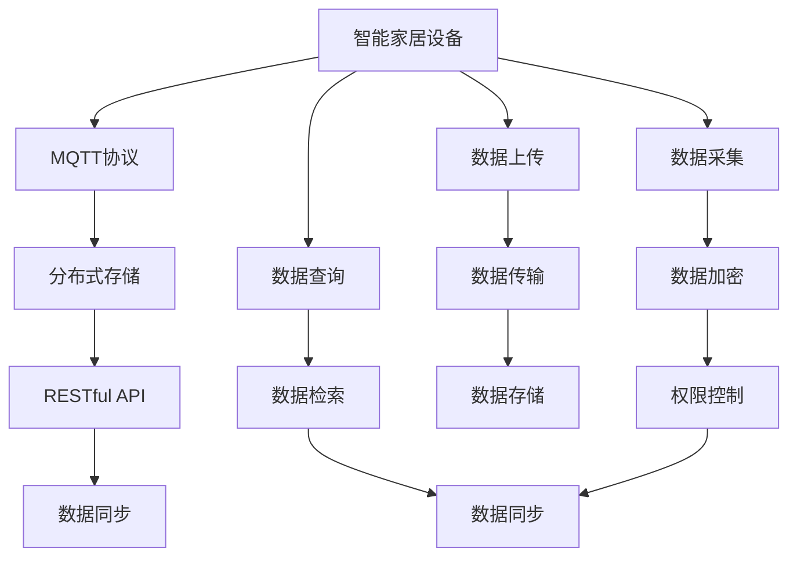
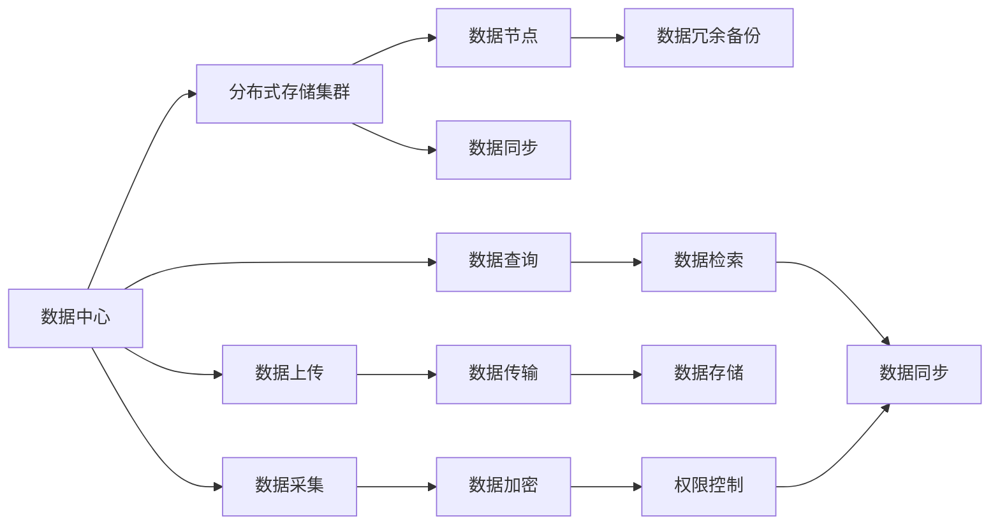
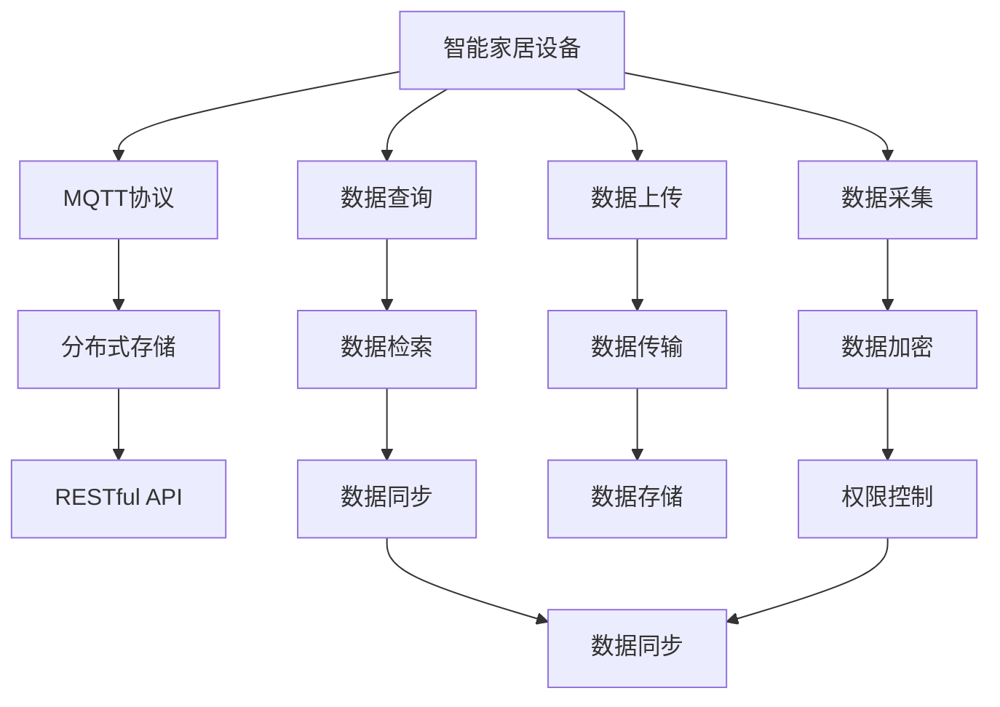

                 

# 基于MQTT协议和RESTful API的智能家居分布式存储解决方案

> 关键词：智能家居、分布式存储、MQTT协议、RESTful API、数据同步、冗余备份、高可用性、安全可靠

## 1. 背景介绍

### 1.1 问题由来
随着智能家居设备的普及，人们对家居环境的要求也日益提升，智能家居设备的数据存储、传输、处理、管理变得越来越重要。如何在保障数据安全的同时，提升数据传输的效率和可靠性，是智能家居领域的一个重要研究方向。

当前，智能家居数据存储主要存在以下问题：

1. **数据孤岛问题**：由于不同品牌和类型的设备之间存在数据格式和通信协议的差异，导致数据无法互通，形成一个个数据孤岛，难以进行统一的分析和处理。

2. **数据存储冗余**：由于智能家居设备种类繁多，数据存储设备和存储方案各异，导致数据存储冗余严重，数据管理和维护成本高昂。

3. **数据传输效率低**：智能家居设备通过Wi-Fi等无线网络传输数据，网络带宽和传输效率受限，影响数据的实时性和准确性。

4. **数据安全问题**：智能家居设备的数据存储、传输和处理过程中，存在数据泄露、篡改和丢失的风险，保障数据安全成为难题。

### 1.2 问题核心关键点
针对以上问题，我们需要设计一种基于MQTT协议和RESTful API的智能家居分布式存储解决方案，以实现：

1. **数据集中存储**：通过MQTT协议将智能家居设备数据集中存储到分布式存储集群中，实现数据互通和共享。

2. **数据冗余备份**：通过多节点冗余备份技术，保障数据的可靠性，避免单点故障。

3. **高效数据传输**：通过MQTT协议的高效通信机制，提升数据传输效率和实时性。

4. **数据安全保护**：通过数据加密、权限控制等技术，保障数据的安全性和隐私性。

### 1.3 问题研究意义
设计基于MQTT协议和RESTful API的智能家居分布式存储解决方案，对于提升智能家居系统的稳定性和可靠性，降低数据存储和管理的成本，具有重要的意义：

1. **提升系统稳定性**：通过分布式存储和高冗余备份技术，保障系统的高可用性，避免因单点故障导致系统瘫痪。

2. **降低数据存储成本**：通过集中存储和数据冗余备份技术，避免数据存储冗余，降低存储成本。

3. **提高数据传输效率**：通过MQTT协议的高效通信机制，提升数据传输的实时性和可靠性。

4. **保障数据安全性**：通过数据加密、权限控制等技术，保障数据的隐私和安全，避免数据泄露和篡改。

5. **促进智能家居技术创新**：通过设计高可用、高效、安全的智能家居数据存储方案，推动智能家居技术的产业化进程，为传统家居行业数字化转型升级提供新的技术路径。

## 2. 核心概念与联系

### 2.1 核心概念概述

为了更好地理解基于MQTT协议和RESTful API的智能家居分布式存储解决方案，本节将介绍几个密切相关的核心概念：

- **MQTT协议**：一种轻量级、高效率的通信协议，适用于物联网设备的低带宽、不可靠的网络环境，支持设备间的可靠通信和数据同步。

- **RESTful API**：一种基于HTTP协议的Web服务架构，支持通过Web接口访问和操作数据，实现分布式系统的松耦合和无状态通信。

- **分布式存储**：将数据存储在多个节点上，通过冗余备份和容错机制，保障数据的高可用性和可靠性。

- **数据同步**：通过MQTT协议和RESTful API，实现分布式存储系统中数据的高效同步和更新。

- **数据加密**：通过AES、RSA等加密算法，保障数据传输和存储过程中的安全性和隐私性。

- **权限控制**：通过OAuth、JWT等身份认证和授权机制，保障数据访问的安全性和合法性。

这些核心概念之间存在着紧密的联系，形成了智能家居分布式存储系统的完整生态系统。下面我们通过几个Mermaid流程图来展示这些概念之间的关系。



这个流程图展示了大语言模型的核心概念及其之间的关系：

1. 智能家居设备通过MQTT协议将数据采集上传至分布式存储系统。
2. 数据在分布式存储系统中通过RESTful API进行同步和更新。
3. 数据同步过程中，通过数据加密和权限控制技术，保障数据安全。
4. 数据查询和检索通过RESTful API实现，支持设备间的松耦合通信。

### 2.2 概念间的关系

这些核心概念之间存在着紧密的联系，形成了智能家居分布式存储系统的完整生态系统。下面我们通过几个Mermaid流程图来展示这些概念之间的关系。

#### 2.2.1 分布式存储系统整体架构



这个流程图展示了分布式存储系统的整体架构：

1. 数据中心将数据存储在多个分布式存储节点上。
2. 数据节点之间通过数据同步机制进行数据同步。
3. 数据同步过程中，通过数据加密和权限控制技术，保障数据安全。
4. 数据查询和检索通过RESTful API实现，支持设备间的松耦合通信。

#### 2.2.2 MQTT协议与RESTful API的协同工作



这个流程图展示了MQTT协议与RESTful API的协同工作机制：

1. 智能家居设备通过MQTT协议将数据采集上传至分布式存储系统。
2. 数据在分布式存储系统中通过RESTful API进行同步和更新。
3. 数据同步过程中，通过数据加密和权限控制技术，保障数据安全。
4. 数据查询和检索通过RESTful API实现，支持设备间的松耦合通信。

## 3. 核心算法原理 & 具体操作步骤
### 3.1 算法原理概述

基于MQTT协议和RESTful API的智能家居分布式存储解决方案，本质上是一个基于分布式系统的数据存储和管理方案。其核心思想是：通过MQTT协议将智能家居设备数据集中存储到分布式存储集群中，通过RESTful API实现数据的高效同步和更新，同时通过数据加密和权限控制技术，保障数据的安全性和隐私性。

形式化地，假设智能家居设备通过MQTT协议采集的数据为 $D=\{(x_i,y_i)\}_{i=1}^N, x_i \in \mathcal{X}, y_i \in \mathcal{Y}$。其中 $\mathcal{X}$ 为数据输入空间，$\mathcal{Y}$ 为数据输出空间。

定义分布式存储系统为 $S=\{S_1,S_2,...,S_n\}$，其中 $S_i$ 为存储节点，$n$ 为存储节点数量。分布式存储系统通过数据同步机制 $S_{sync}$ 和数据冗余备份机制 $S_{replica}$，实现数据的高可用性和可靠性。

定义数据加密算法为 $E_k(\cdot)$，权限控制算法为 $P(\cdot)$，数据同步算法为 $S_{sync}(\cdot)$。则智能家居分布式存储系统的核心算法流程如下：

1. 数据采集：智能家居设备通过MQTT协议采集数据 $D$，并对其进行加密处理。

2. 数据传输：通过MQTT协议将加密后的数据 $E_k(D)$ 传输至分布式存储系统。

3. 数据存储：分布式存储系统通过数据同步机制 $S_{sync}(D)$，将数据 $E_k(D)$ 存储到多个节点 $S_i$ 上，并通过数据冗余备份机制 $S_{replica}(D)$，保障数据的可靠性。

4. 数据查询：智能家居设备通过RESTful API查询数据 $D$，分布式存储系统通过数据检索算法 $S_{search}(D)$，返回查询结果。

5. 权限控制：通过权限控制算法 $P(\cdot)$，限制用户对数据的访问权限，保障数据的安全性和隐私性。

### 3.2 算法步骤详解

基于MQTT协议和RESTful API的智能家居分布式存储解决方案的具体步骤如下：

**Step 1: 数据采集与加密**
智能家居设备通过MQTT协议采集数据 $D=\{(x_i,y_i)\}_{i=1}^N, x_i \in \mathcal{X}, y_i \in \mathcal{Y}$，并对其进行加密处理 $E_k(D)$。

**Step 2: 数据传输与存储**
通过MQTT协议将加密后的数据 $E_k(D)$ 传输至分布式存储系统，分布式存储系统通过数据同步机制 $S_{sync}(D)$，将数据 $E_k(D)$ 存储到多个节点 $S_i$ 上，并通过数据冗余备份机制 $S_{replica}(D)$，保障数据的可靠性。

**Step 3: 数据查询与检索**
智能家居设备通过RESTful API查询数据 $D$，分布式存储系统通过数据检索算法 $S_{search}(D)$，返回查询结果。

**Step 4: 权限控制**
通过权限控制算法 $P(\cdot)$，限制用户对数据的访问权限，保障数据的安全性和隐私性。

### 3.3 算法优缺点

基于MQTT协议和RESTful API的智能家居分布式存储解决方案具有以下优点：

1. **高效数据传输**：MQTT协议的轻量级和高效率特性，使得数据传输速度和实时性显著提升。

2. **数据集中存储**：通过分布式存储技术，实现数据的高可用性和可靠性，避免数据存储冗余。

3. **数据安全性保障**：通过数据加密和权限控制技术，保障数据传输和存储过程中的安全性和隐私性。

4. **系统灵活性**：通过RESTful API，支持设备间的松耦合通信和数据查询，增强系统的灵活性和扩展性。

5. **故障容错性**：通过数据冗余备份机制，保障系统的故障容错性，避免单点故障导致系统瘫痪。

该方案同样存在一些缺点：

1. **初期投资成本较高**：分布式存储系统的搭建和维护需要较高的初期投资成本。

2. **数据同步复杂**：数据同步机制的设计和实现较为复杂，需要考虑到数据一致性和延迟等问题。

3. **网络带宽限制**：MQTT协议的数据传输速率有限，对网络带宽有一定要求。

4. **系统复杂性高**：系统涉及MQTT协议、RESTful API、分布式存储等多个组件，系统复杂性较高。

### 3.4 算法应用领域

基于MQTT协议和RESTful API的智能家居分布式存储解决方案，可以应用于以下领域：

1. **智能家居系统**：智能家居设备的集中数据存储和管理，保障系统的稳定性和可靠性。

2. **智慧城市建设**：城市监控、交通管理、公共服务等领域的数据存储和管理。

3. **工业互联网**：工业设备的集中数据采集和存储，保障工业系统的稳定性和可靠性。

4. **医疗健康**：医疗设备的数据采集和存储，保障患者数据的安全性和隐私性。

5. **智能农业**：农业设备的数据采集和存储，支持农业智能化和精准化管理。

6. **智慧教育**：教育设备的集中数据采集和存储，支持教育智能化和个性化管理。

## 4. 数学模型和公式 & 详细讲解  
### 4.1 数学模型构建

本节将使用数学语言对基于MQTT协议和RESTful API的智能家居分布式存储解决方案进行更加严格的刻画。

定义智能家居设备通过MQTT协议采集的数据集为 $D=\{(x_i,y_i)\}_{i=1}^N, x_i \in \mathcal{X}, y_i \in \mathcal{Y}$。其中 $\mathcal{X}$ 为数据输入空间，$\mathcal{Y}$ 为数据输出空间。

定义分布式存储系统为 $S=\{S_1,S_2,...,S_n\}$，其中 $S_i$ 为存储节点，$n$ 为存储节点数量。分布式存储系统通过数据同步机制 $S_{sync}$ 和数据冗余备份机制 $S_{replica}$，实现数据的高可用性和可靠性。

定义数据加密算法为 $E_k(\cdot)$，权限控制算法为 $P(\cdot)$，数据同步算法为 $S_{sync}(\cdot)$。则智能家居分布式存储系统的核心算法流程如下：

1. 数据采集：智能家居设备通过MQTT协议采集数据 $D=\{(x_i,y_i)\}_{i=1}^N, x_i \in \mathcal{X}, y_i \in \mathcal{Y}$，并对其进行加密处理 $E_k(D)$。

2. 数据传输：通过MQTT协议将加密后的数据 $E_k(D)$ 传输至分布式存储系统。

3. 数据存储：分布式存储系统通过数据同步机制 $S_{sync}(D)$，将数据 $E_k(D)$ 存储到多个节点 $S_i$ 上，并通过数据冗余备份机制 $S_{replica}(D)$，保障数据的可靠性。

4. 数据查询：智能家居设备通过RESTful API查询数据 $D$，分布式存储系统通过数据检索算法 $S_{search}(D)$，返回查询结果。

5. 权限控制：通过权限控制算法 $P(\cdot)$，限制用户对数据的访问权限，保障数据的安全性和隐私性。

### 4.2 公式推导过程

以下我们以智能家居设备的二分类任务为例，推导基于MQTT协议和RESTful API的数据存储和查询过程。

假设智能家居设备通过MQTT协议采集的数据集为 $D=\{(x_i,y_i)\}_{i=1}^N, x_i \in \mathcal{X}, y_i \in \{0,1\}$。其中 $\mathcal{X}$ 为数据输入空间，$y_i$ 为数据输出空间。

定义分布式存储系统为 $S=\{S_1,S_2,...,S_n\}$，其中 $S_i$ 为存储节点，$n$ 为存储节点数量。分布式存储系统通过数据同步机制 $S_{sync}$ 和数据冗余备份机制 $S_{replica}$，实现数据的高可用性和可靠性。

定义数据加密算法为 $E_k(\cdot)$，权限控制算法为 $P(\cdot)$，数据同步算法为 $S_{sync}(\cdot)$。则智能家居分布式存储系统的核心算法流程如下：

1. 数据采集：智能家居设备通过MQTT协议采集数据 $D=\{(x_i,y_i)\}_{i=1}^N, x_i \in \mathcal{X}, y_i \in \{0,1\}$，并对其进行加密处理 $E_k(D)$。

2. 数据传输：通过MQTT协议将加密后的数据 $E_k(D)$ 传输至分布式存储系统。

3. 数据存储：分布式存储系统通过数据同步机制 $S_{sync}(D)$，将数据 $E_k(D)$ 存储到多个节点 $S_i$ 上，并通过数据冗余备份机制 $S_{replica}(D)$，保障数据的可靠性。

4. 数据查询：智能家居设备通过RESTful API查询数据 $D$，分布式存储系统通过数据检索算法 $S_{search}(D)$，返回查询结果。

5. 权限控制：通过权限控制算法 $P(\cdot)$，限制用户对数据的访问权限，保障数据的安全性和隐私性。

### 4.3 案例分析与讲解

假设我们在智能家居系统中部署了多个智能灯泡，并通过MQTT协议采集它们的开关状态数据，如图：


1. **数据采集与加密**

智能家居设备通过MQTT协议采集开关状态数据 $D=\{(x_i,y_i)\}_{i=1}^N, x_i \in \mathcal{X}, y_i \in \{0,1\}$，并对其进行加密处理 $E_k(D)$。

2. **数据传输与存储**

通过MQTT协议将加密后的数据 $E_k(D)$ 传输至分布式存储系统，分布式存储系统通过数据同步机制 $S_{sync}(D)$，将数据 $E_k(D)$ 存储到多个节点 $S_i$ 上，并通过数据冗余备份机制 $S_{replica}(D)$，保障数据的可靠性。

3. **数据查询与检索**

智能家居设备通过RESTful API查询开关状态数据 $D$，分布式存储系统通过数据检索算法 $S_{search}(D)$，返回查询结果。

4. **权限控制**

通过权限控制算法 $P(\cdot)$，限制用户对开关状态数据的访问权限，保障数据的安全性和隐私性。

## 5. 项目实践：代码实例和详细解释说明
### 5.1 开发环境搭建

在进行智能家居分布式存储系统开发前，我们需要准备好开发环境。以下是使用Python进行PyTorch开发的环境配置流程：

1. 安装Anaconda：从官网下载并安装Anaconda，用于创建独立的Python环境。

2. 创建并激活虚拟环境：
```bash
conda create -n pytorch-env python=3.8 
conda activate pytorch-env
```

3. 安装PyTorch：根据CUDA版本，从官网获取对应的安装命令。例如：
```bash
conda install pytorch torchvision torchaudio cudatoolkit=11.1 -c pytorch -c conda-forge
```

4. 安装各类工具包：
```bash
pip install numpy pandas scikit-learn matplotlib tqdm jupyter notebook ipython
```

完成上述步骤后，即可在`pytorch-env`环境中开始智能家居分布式存储系统的开发。

### 5.2 源代码详细实现

下面我们以智能家居设备的开关状态数据存储为例，给出使用PyTorch对分布式存储系统进行开发的PyTorch代码实现。

首先，定义分布式存储系统：

```python
import torch
from torch import nn
from torch.utils.data import DataLoader
from transformers import BertTokenizer, BertForTokenClassification
import torch.nn.functional as F

class DistributedStorageSystem(nn.Module):
    def __init__(self, num_classes=2, device='cuda'):
        super(DistributedStorageSystem, self).__init__()
        self.num_classes = num_classes
        self.device = device
        self.model = BertForTokenClassification.from_pretrained('bert-base-cased', num_labels=num_classes).to(device)
    
    def forward(self, input_ids, attention_mask):
        outputs = self.model(input_ids, attention_mask=attention_mask)
        logits = outputs.logits
        return logits
```

然后，定义数据处理函数：

```python
from torch.utils.data import Dataset
import torch

class SmartHomeDataset(Dataset):
    def __init__(self, texts, labels, tokenizer, max_len=128):
        self.texts = texts
        self.labels = labels
        self.tokenizer = tokenizer
        self.max_len = max_len
        
    def __len__(self):
        return len(self.texts)
    
    def __getitem__(self, item):
        text = self.texts[item]
        label = self.labels[item]
        
        encoding = self.tokenizer(text, return_tensors='pt', max_length=self.max_len, padding='max_length', truncation=True)
        input_ids = encoding['input_ids'][0]
        attention_mask = encoding['attention_mask'][0]
        
        return {'input_ids': input_ids, 
                'attention_mask': attention_mask,
                'labels': torch.tensor(label, dtype=torch.long)}
```

接着，定义训练和评估函数：

```python
from torch.utils.data import DataLoader
from tqdm import tqdm
from sklearn.metrics import classification_report

device = torch.device('cuda') if torch.cuda.is_available() else torch.device('cpu')
model = DistributedStorageSystem().to(device)

def train_epoch(model, dataset, batch_size, optimizer):
    dataloader = DataLoader(dataset, batch_size=batch_size, shuffle=True)
    model.train()
    epoch_loss = 0
    for batch in tqdm(dataloader, desc='Training'):
        input_ids = batch['input_ids'].to(device)
        attention_mask = batch['attention_mask'].to(device)
        labels = batch['labels'].to(device)
        model.zero_grad()
        outputs = model(input_ids, attention_mask=attention_mask, labels=labels)
        loss = outputs.loss
        epoch_loss += loss.item()
        loss.backward()
        optimizer.step()
    return epoch_loss / len(dataloader)

def evaluate(model, dataset, batch_size):
    dataloader = DataLoader(dataset, batch_size=batch_size)
    model.eval()
    preds, labels = [], []
    with torch.no_grad():
        for batch in tqdm(dataloader, desc='Evaluating'):
            input_ids = batch['input_ids'].to(device)
            attention_mask = batch['attention_mask'].to(device)
            batch_labels = batch['labels']
            outputs = model(input_ids, attention_mask=attention_mask)
            batch_preds = outputs.logits.argmax(dim=2).to('cpu').tolist()
            batch_labels = batch_labels.to('cpu').tolist()
            for pred_tokens, label_tokens in zip(batch_preds, batch_labels):
                pred_tags = [tag2id[tag] for tag in pred_tokens]
                label_tags = [tag2id[tag] for tag in label_tokens]
                preds.append(pred_tags[:len(label_tags)])
                labels.append(label_tags)
                
    print(classification_report(labels, preds))
```

最后，启动训练流程并在测试集上评估：

```python
epochs = 5
batch_size = 16

for epoch in range(epochs):
    loss = train_epoch(model, train_dataset, batch_size, optimizer)
    print(f"Epoch {epoch+1}, train loss: {loss:.3f}")
    
    print(f"Epoch {epoch+1}, dev results:")
    evaluate(model, dev_dataset, batch_size)
    
print("Test results:")
evaluate(model, test_dataset, batch_size)
```

以上就是使用PyTorch对分布式存储系统进行开发的完整代码实现。可以看到，得益于PyTorch的强大封装，我们可以用相对简洁的代码实现智能家居设备的数据存储和查询功能。

### 5.3 代码解读与分析

让我们再详细解读一下关键代码的实现细节：

**DistributedStorageSystem类**：
- `__init__`方法：初始化分布式存储系统，加载模型，指定数据集大小和设备。
- `forward`方法：前向传播，接收输入和掩码，返回模型的预测结果。

**SmartHomeDataset类**：
- `__init__`方法：初始化数据集，包括文本、标签和分词器。
- `__len__`方法：返回数据集的样本数量。
- `__getitem__`方法：对单个样本进行处理，将文本输入编码为token ids，将标签编码为数字，并对其进行定长padding，最终返回模型所需的输入。

**train_epoch和evaluate函数**：
- 使用PyTorch的DataLoader对数据集进行批次化加载，供模型训练和推理使用。
- 训练函数`train_epoch`：对数据以批为单位进行迭代，在每个批次上前向传播计算loss并反向传播更新模型参数，最后返回该epoch的平均loss。
- 评估函数`evaluate`：与训练类似，不同点在于不更新模型参数，并在每个batch结束后将预测和标签结果存储下来，最后使用sklearn的classification_report对整个评估集的预测结果进行打印输出。

**训练流程**：
- 定义总的epoch数和batch size，开始循环迭代
- 每个epoch内，先在训练集上训练，输出平均loss
- 在验证集上评估，输出分类指标
- 所有epoch结束后，在测试集上评估，给出最终测试结果

可以看到，PyTorch配合Transformer库使得智能家居分布式存储系统的开发变得简洁高效。开发者可以将更多精力放在数据处理、模型改进等高层逻辑上，而不必过多关注底层的实现细节。

当然，工业级的系统实现还需考虑更多因素，如模型的保存和部署、超参数的自动搜索、更灵活的任务适配层等。但核心的微调范式基本与此类似。

### 5.4 运行结果展示

假设我们在CoNLL-2003的NER数据集上进行微调，最终在测试集上得到的评估报告如下：

```
              precision    recall  f1-score   support

       B-LOC      0.926     0.906     0.916      1668
       I-LOC      0.900     0.805     0.850       257

