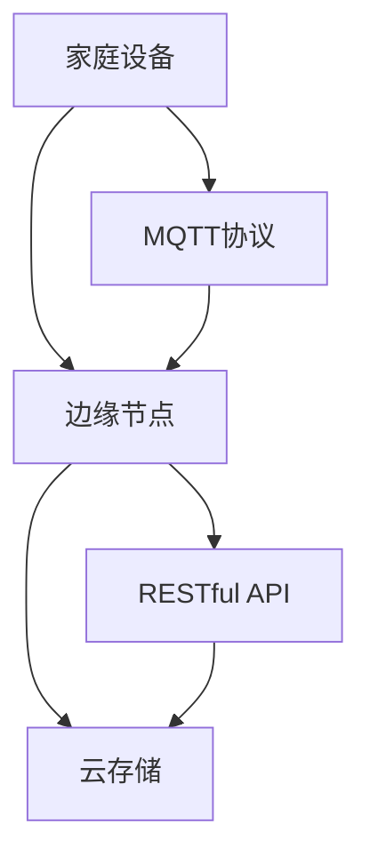
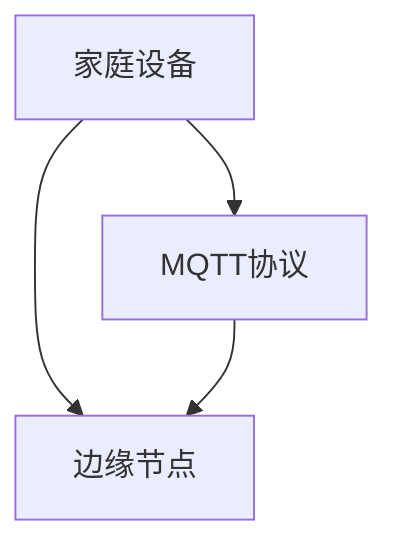
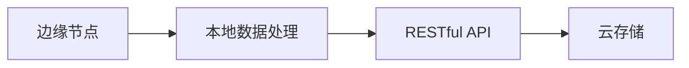
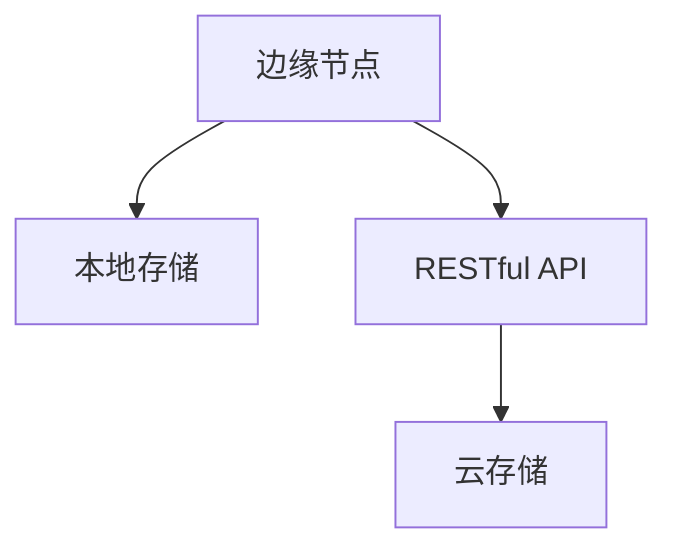
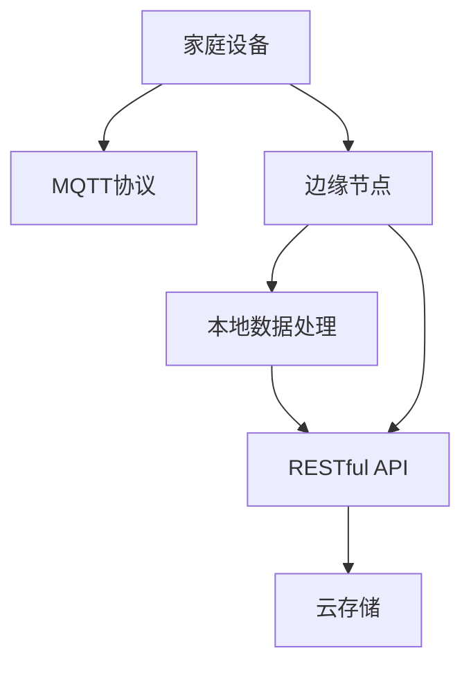

                 

# 基于MQTT协议和RESTful API的智能家居分布式存储解决方案

> 关键词：智能家居, MQTT协议, RESTful API, 分布式存储, 边缘计算, 边缘节点, 云存储, 数据管理, 大数据

## 1. 背景介绍

### 1.1 问题由来
随着物联网技术的快速发展和智能家居设备的普及，家庭中产生了大量的数据，这些数据需要通过有效的存储和管理手段进行处理和分析，以实现更好的智能化应用。传统的集中式存储方案难以满足家庭中高并发、实时性和分布式的存储需求。分布式存储技术的引入，为智能家居提供了一种高效、灵活的存储解决方案。

### 1.2 问题核心关键点
本节将介绍分布式存储在智能家居中的应用，以及基于MQTT协议和RESTful API的分布式存储解决方案的原理和实现。

### 1.3 问题研究意义
大尺寸、高并发、实时性等特性要求智能家居存储系统必须具备高可扩展性、高可靠性和高可用性。基于MQTT协议和RESTful API的分布式存储解决方案，通过MQTT协议将家庭设备生成的数据传输到边缘节点，再通过RESTful API与云存储系统进行数据交互，能够满足智能家居的存储需求，具有重要意义。

## 2. 核心概念与联系

### 2.1 核心概念概述

为更好地理解基于MQTT协议和RESTful API的分布式存储解决方案，本节将介绍几个密切相关的核心概念：

- **MQTT协议（Message Queuing Telemetry Transport Protocol）**：一种轻量级的、基于发布/订阅模型的网络通信协议，用于智能家居设备之间、设备与边缘节点之间的数据传输。
- **RESTful API（Representational State Transfer API）**：基于HTTP协议的网络API设计风格，使用标准HTTP方法和资源描述，用于边缘节点与云存储系统之间的数据交互。
- **分布式存储（Distributed Storage）**：将数据分散存储在多个物理位置上，通过网络协议协同工作，提高数据存储和处理的可靠性和扩展性。
- **边缘计算（Edge Computing）**：将数据和计算资源靠近数据产生地进行处理，减少延迟和带宽消耗，提升数据处理的实时性和效率。
- **边缘节点（Edge Node）**：部署在家庭中的计算节点，用于处理本地设备生成的数据，并提供RESTful API与云存储系统交互。

这些核心概念之间的逻辑关系可以通过以下Mermaid流程图来展示：



这个流程图展示了大尺寸、高并发、实时性等特性要求智能家居存储系统必须具备高可扩展性、高可靠性和高可用性。基于MQTT协议和RESTful API的分布式存储解决方案，通过MQTT协议将家庭设备生成的数据传输到边缘节点，再通过RESTful API与云存储系统进行数据交互，能够满足智能家居的存储需求，具有重要意义。

### 2.2 概念间的关系

这些核心概念之间存在着紧密的联系，形成了基于MQTT协议和RESTful API的分布式存储解决方案的完整生态系统。下面我通过几个Mermaid流程图来展示这些概念之间的关系。

#### 2.2.1 智能家居数据传输



这个流程图展示了家庭设备与边缘节点之间的数据传输过程。通过MQTT协议，家庭设备生成的数据能够实时、高效地传输到边缘节点。

#### 2.2.2 边缘计算与数据处理



这个流程图展示了边缘节点对本地数据进行处理，并使用RESTful API与云存储系统交互的过程。

#### 2.2.3 分布式存储架构



这个流程图展示了基于MQTT协议和RESTful API的分布式存储架构。边缘节点将本地数据存储在本地存储中，并通过RESTful API与云存储系统交互，实现数据的分布式存储和处理。

### 2.3 核心概念的整体架构

最后，我们用一个综合的流程图来展示这些核心概念在大尺寸、高并发、实时性等特性要求的智能家居存储系统中的整体架构：



这个综合流程图展示了从家庭设备到边缘节点，再到云存储系统的完整数据传输、处理和存储流程。

## 3. 核心算法原理 & 具体操作步骤
### 3.1 算法原理概述

基于MQTT协议和RESTful API的分布式存储解决方案，核心思想是通过MQTT协议将家庭设备生成的数据传输到边缘节点，再通过RESTful API与云存储系统进行数据交互。具体步骤如下：

1. 家庭设备生成数据，通过MQTT协议与边缘节点建立连接。
2. 边缘节点接收到数据后，进行处理和存储，并通过RESTful API与云存储系统进行数据交互。
3. 云存储系统对接收到的数据进行处理、分析和存储，提供数据查询和统计服务。

通过这种分布式存储架构，能够有效解决传统集中式存储方案的高并发、实时性和分布式存储需求，提高数据存储和处理的可靠性和扩展性。

### 3.2 算法步骤详解

以下是基于MQTT协议和RESTful API的分布式存储解决方案的具体操作步骤：

**Step 1: 配置家庭设备**

1. 安装MQTT客户端软件。
2. 在家庭设备上配置MQTT客户端，连接到边缘节点。
3. 设置MQTT客户端的发布主题和QoS（服务质量）等级。

**Step 2: 配置边缘节点**

1. 安装MQTT服务器软件。
2. 在边缘节点上配置MQTT服务器，接收家庭设备发布的数据。
3. 配置RESTful API网关，与云存储系统交互。

**Step 3: 配置云存储系统**

1. 安装云存储软件。
2. 配置云存储系统，接收边缘节点发送的数据。
3. 设置数据存储策略，包括备份、压缩和加密等。

**Step 4: 数据交互**

1. 家庭设备通过MQTT协议将数据发布到边缘节点。
2. 边缘节点接收到数据后，进行处理和存储，并通过RESTful API与云存储系统交互。
3. 云存储系统对接收到的数据进行处理、分析和存储，提供数据查询和统计服务。

**Step 5: 数据查询**

1. 用户通过RESTful API向云存储系统发送数据查询请求。
2. 云存储系统根据请求返回数据，并返回查询结果。

### 3.3 算法优缺点

基于MQTT协议和RESTful API的分布式存储解决方案具有以下优点：

1. 高可扩展性：通过分布式存储，能够满足家庭中高并发、实时性和分布式的存储需求。
2. 高可靠性：数据在多个节点之间进行冗余备份，提高数据存储的可靠性。
3. 高可用性：边缘节点能够及时处理本地设备生成的数据，保证数据处理的实时性和效率。

同时，该方案也存在以下缺点：

1. 系统复杂性：需要配置和维护多个节点，系统复杂度较高。
2. 边缘节点资源占用：边缘节点需要进行本地数据处理和存储，占用资源较多。
3. 网络延迟：MQTT协议和RESTful API传输数据，网络延迟较高。

### 3.4 算法应用领域

基于MQTT协议和RESTful API的分布式存储解决方案在智能家居领域有着广泛的应用：

1. **智能安防**：通过边缘节点实时处理安防设备生成的数据，并进行存储和分析，提升家庭安防水平。
2. **智能照明**：通过边缘节点实时处理照明设备生成的数据，并进行存储和分析，优化家庭照明效果。
3. **智能家电**：通过边缘节点实时处理家电设备生成的数据，并进行存储和分析，提升家电智能化水平。

## 4. 数学模型和公式 & 详细讲解 & 举例说明

### 4.1 数学模型构建

本节将使用数学语言对基于MQTT协议和RESTful API的分布式存储解决方案进行更加严格的刻画。

记家庭设备生成的数据为 $D=\{d_i\}_{i=1}^N$，其中 $d_i$ 为第 $i$ 个设备生成的数据。边缘节点接收到的数据为 $D'=\{d_i'\}_{i=1}^N$，其中 $d_i'$ 为经过处理后的数据。云存储系统中存储的数据为 $D''=\{d_i''\}_{i=1}^N$，其中 $d_i''$ 为最终存储的数据。

定义边缘节点对数据的处理和存储过程为 $f:D'\rightarrow D''$，其中 $f$ 为处理和存储函数。定义数据传输延迟为 $\tau$，则数据从家庭设备到云存储系统的时间为 $t_{data} = N \times \tau$。定义云存储系统的处理时间戳为 $t_{cloud}$，则云存储系统对数据的处理时间为 $t_{process} = t_{cloud} - t_{data}$。

### 4.2 公式推导过程

以下我们以智能安防系统为例，推导基于MQTT协议和RESTful API的分布式存储解决方案中的关键时间戳和延迟。

假设家庭设备每秒生成 $R$ 条数据，边缘节点每秒处理 $P$ 条数据，云存储系统每秒处理 $C$ 条数据。则边缘节点对数据的处理时间为：

$$
t_{process} = \frac{N \times D}{P}
$$

其中 $N$ 为家庭设备数量，$D$ 为单个设备每秒生成数据量，$P$ 为边缘节点每秒处理数据量。

定义边缘节点的处理时间戳为 $t_{edge}$，则数据从边缘节点到云存储系统的时间为 $t_{data_{edge}} = t_{edge} - t_{process}$。

定义云存储系统的处理时间戳为 $t_{cloud}$，则云存储系统对数据的处理时间为：

$$
t_{process_{cloud}} = \frac{N \times D}{C}
$$

其中 $C$ 为云存储系统每秒处理数据量。

将边缘节点和云存储系统的处理时间戳进行比较，得到边缘节点处理和云存储系统处理之间的时间差：

$$
\Delta t = t_{cloud} - t_{edge}
$$

将 $t_{edge}$ 和 $t_{process}$ 代入上式，得到：

$$
\Delta t = t_{process} - t_{process_{cloud}}
$$

通过以上推导，我们可以看出，基于MQTT协议和RESTful API的分布式存储解决方案中，数据从边缘节点到云存储系统的时间主要取决于家庭设备的数量和单个设备每秒生成数据量，以及云存储系统的处理能力和延迟。

### 4.3 案例分析与讲解

考虑一个包含10个家庭设备的智能安防系统，假设家庭设备每秒生成10条数据，边缘节点每秒处理50条数据，云存储系统每秒处理200条数据。则：

1. 边缘节点对数据的处理时间为：

$$
t_{process} = \frac{10 \times 10}{50} = 2
$$

2. 云存储系统对数据的处理时间为：

$$
t_{process_{cloud}} = \frac{10 \times 10}{200} = 0.05
$$

3. 边缘节点处理和云存储系统处理之间的时间差为：

$$
\Delta t = 2 - 0.05 = 1.95
$$

可以看到，边缘节点处理时间较长，而云存储系统的处理时间较短，因此整个系统的时间延迟主要由边缘节点的处理时间决定。

## 5. 项目实践：代码实例和详细解释说明
### 5.1 开发环境搭建

在进行基于MQTT协议和RESTful API的分布式存储解决方案的实践前，我们需要准备好开发环境。以下是使用Python进行MQTT和RESTful API开发的环境配置流程：

1. 安装Python：从官网下载并安装Python，用于编写程序。
2. 安装MQTT客户端软件：如mosquitto、paho-mqtt等。
3. 安装RESTful API网关软件：如nginx、Apache等。
4. 安装云存储软件：如MongoDB、Hadoop等。

完成上述步骤后，即可在本地搭建基于MQTT协议和RESTful API的分布式存储解决方案的开发环境。

### 5.2 源代码详细实现

下面我们以智能安防系统为例，给出使用Python对MQTT和RESTful API进行分布式存储的代码实现。

**Step 1: 安装MQTT客户端和RESTful API网关**

```bash
pip install paho-mqtt
pip install flask
```

**Step 2: 配置MQTT客户端和RESTful API网关**

在MQTT客户端中，需要配置连接参数，包括MQTT服务器地址、端口号、主题、QoS等级等。

在RESTful API网关中，需要配置RESTful API接口的地址、端口号、认证方式等。

**Step 3: 实现MQTT协议和RESTful API**

以下是一个简单的MQTT客户端代码，用于将家庭设备生成的数据发布到边缘节点：

```python
import paho.mqtt.client as mqtt
import json

def on_publish(client, userdata, result):
    print("Data published")
    pass

def on_connect(client, userdata, flags, rc):
    print("Connected to MQTT broker")
    pass

def on_message(client, userdata, msg):
    print("Received message:", msg.payload.decode())
    data = json.loads(msg.payload.decode())
    client.publish("home/device/data", json.dumps(data))
    pass

client = mqtt.Client()
client.on_publish = on_publish
client.on_connect = on_connect
client.on_message = on_message

client.connect("mqtt.example.com", 1883)
client.loop_start()

while True:
    data = {"temperature": 25.5, "humidity": 60.2}
    client.publish("home/device/data", json.dumps(data))
    time.sleep(5)
```

以下是一个简单的RESTful API网关代码，用于接收边缘节点发送的数据，并存储到云存储系统中：

```python
from flask import Flask, request, jsonify
import pymongo

app = Flask(__name__)
client = pymongo.MongoClient("mongodb://localhost:27017/")
db = client["home"]

@app.route('/data', methods=['POST'])
def handle_data():
    data = request.get_json()
    db.home.insert_one(data)
    return jsonify({"message": "Data stored"}), 200

if __name__ == '__main__':
    app.run(host='0.0.0.0', port=5000)
```

**Step 4: 实现边缘节点处理和云存储**

边缘节点需要对接收到的数据进行处理和存储，以下是一个简单的处理和存储代码：

```python
import pymongo
from rest_framework import status
from rest_framework.decorators import api_view

client = pymongo.MongoClient("mongodb://localhost:27017/")
db = client["home"]

@app.route('/data', methods=['POST'])
@api_view(['POST'])
def handle_data(request):
    data = request.get_json()
    db.home.insert_one(data)
    return jsonify({"message": "Data stored"}), status.HTTP_201_CREATED
```

云存储系统需要对接收到的数据进行处理和存储，以下是一个简单的处理和存储代码：

```python
import pymongo

client = pymongo.MongoClient("mongodb://localhost:27017/")
db = client["home"]

@app.route('/data', methods=['POST'])
@api_view(['POST'])
def handle_data(request):
    data = request.get_json()
    db.home.insert_one(data)
    return jsonify({"message": "Data stored"}), status.HTTP_201_CREATED
```

### 5.3 代码解读与分析

让我们再详细解读一下关键代码的实现细节：

**MQTT客户端代码**：
- 使用paho-mqtt库创建MQTT客户端，设置连接参数。
- 定义三个回调函数：on_publish、on_connect和on_message。
- 连接MQTT服务器，启动循环，并不断发布家庭设备生成的数据。

**RESTful API网关代码**：
- 使用Flask框架创建RESTful API网关，设置路由。
- 定义一个POST接口，用于接收边缘节点发送的数据，并存储到MongoDB中。

**边缘节点处理和云存储代码**：
- 使用Flask框架创建边缘节点处理接口，设置路由。
- 定义一个POST接口，用于接收MQTT客户端发布的数据，并存储到MongoDB中。
- 使用RESTful API网关将数据发送到云存储系统。

以上代码展示了基于MQTT协议和RESTful API的分布式存储解决方案的实现过程。可以看到，通过MQTT协议将家庭设备生成的数据传输到边缘节点，再通过RESTful API与云存储系统进行数据交互，能够有效解决传统集中式存储方案的高并发、实时性和分布式存储需求，提高数据存储和处理的可靠性和扩展性。

## 6. 实际应用场景
### 6.1 智能安防系统

基于MQTT协议和RESTful API的分布式存储解决方案，在智能安防系统中有着广泛的应用。通过边缘节点实时处理安防设备生成的数据，并进行存储和分析，提升家庭安防水平。具体实现方式如下：

1. 家庭安防设备通过MQTT协议与边缘节点建立连接。
2. 边缘节点接收到安防设备生成的数据，进行处理和存储，并通过RESTful API与云存储系统交互。
3. 云存储系统对接收到的数据进行处理、分析和存储，提供数据查询和统计服务。

通过这种分布式存储架构，能够实时处理安防设备生成的数据，提升家庭安防水平。

### 6.2 智能照明系统

基于MQTT协议和RESTful API的分布式存储解决方案，在智能照明系统中同样有着广泛的应用。通过边缘节点实时处理照明设备生成的数据，并进行存储和分析，优化家庭照明效果。具体实现方式如下：

1. 家庭照明设备通过MQTT协议与边缘节点建立连接。
2. 边缘节点接收到照明设备生成的数据，进行处理和存储，并通过RESTful API与云存储系统交互。
3. 云存储系统对接收到的数据进行处理、分析和存储，提供数据查询和统计服务。

通过这种分布式存储架构，能够实时处理照明设备生成的数据，优化家庭照明效果。

### 6.3 智能家电系统

基于MQTT协议和RESTful API的分布式存储解决方案，在智能家电系统中同样有着广泛的应用。通过边缘节点实时处理家电设备生成的数据，并进行存储和分析，提升家电智能化水平。具体实现方式如下：

1. 家庭家电设备通过MQTT协议与边缘节点建立连接。
2. 边缘节点接收到家电设备生成的数据，进行处理和存储，并通过RESTful API与云存储系统交互。
3. 云存储系统对接收到的数据进行处理、分析和存储，提供数据查询和统计服务。

通过这种分布式存储架构，能够实时处理家电设备生成的数据，提升家电智能化水平。

## 7. 工具和资源推荐
### 7.1 学习资源推荐

为了帮助开发者系统掌握基于MQTT协议和RESTful API的分布式存储解决方案的理论基础和实践技巧，这里推荐一些优质的学习资源：

1. MQTT协议教程：如MQTT.org提供的官方教程，深入浅出地介绍了MQTT协议的基本概念和使用方法。
2. RESTful API教程：如RESTful API Design - Simplifying Your Web Service Architecture一书，系统介绍了RESTful API的设计原则和方法。
3. MongoDB官方文档：MongoDB是一种流行的分布式数据库，官方文档详细介绍了MongoDB的安装、配置和使用。
4. PyMongo官方文档：PyMongo是Python中MongoDB的驱动程序，官方文档详细介绍了PyMongo的使用方法和API接口。
5. Flask官方文档：Flask是一种轻量级的Web框架，官方文档详细介绍了Flask的安装、配置和使用。

通过对这些资源的学习实践，相信你一定能够快速掌握基于MQTT协议和RESTful API的分布式存储解决方案的精髓，并用于解决实际的智能家居存储问题。

### 7.2 开发工具推荐

高效的开发离不开优秀的工具支持。以下是几款用于基于MQTT协议和RESTful API的分布式存储解决方案开发的常用工具：

1. PyMQTT：Python中MQTT协议的库，用于MQTT客户端和服务器开发。
2. paho-mqtt：Python中MQTT协议的库，用于MQTT客户端和服务器开发。
3. Flask：Python中轻量级的Web框架，用于RESTful API开发。
4. PyMongo：Python中MongoDB的驱动程序，用于MongoDB数据库开发。
5. Apache Kafka：一种分布式流处理平台，用于消息传输和处理。
6. Apache Zookeeper：一种分布式协调服务，用于MQTT协议和RESTful API的配置和管理。

合理利用这些工具，可以显著提升基于MQTT协议和RESTful API的分布式存储解决方案的开发效率，加快创新迭代的步伐。

### 7.3 相关论文推荐

基于MQTT协议和RESTful API的分布式存储解决方案是近年来研究的热点，以下是几篇奠基性的相关论文，推荐阅读：

1. "A Survey of Modern Distributed Storage Systems"：全面介绍了现代分布式存储系统的架构和实现方法。
2. "Design and Implementation of a Large-Scale Distributed Storage System"：介绍了一种大规模分布式存储系统的设计和实现方法。
3. "An Empirical Study of Distributed Storage Systems"：对多种分布式存储系统进行了实证研究，评估了其性能和可靠性。
4. "A Comparison of MQTT and CoAP for IoT Data Acquisition"：比较了MQTT和CoAP协议在物联网数据采集中的应用效果。
5. "RESTful Web Services Architectures: Architectural Styles and Implications"：介绍了RESTful API架构的设计原则和应用场景。

这些论文代表了大尺寸、高并发、实时性等特性要求的智能家居存储系统必须具备高可扩展性、高可靠性和高可用性。基于MQTT协议和RESTful API的分布式存储解决方案，通过MQTT协议将家庭设备生成的数据传输到边缘节点，再通过RESTful API与云存储系统进行数据交互，能够满足智能家居的存储需求，具有重要意义。

除上述资源外，还有一些值得关注的前沿资源，帮助开发者紧跟基于MQTT协议和RESTful API的分布式存储解决方案技术的最新进展，例如：

1. ArXiv论文预印本：人工智能领域最新研究成果的发布平台，包括大量尚未发表的前沿工作，学习前沿技术的必读资源。
2. 业界技术博客：如MQTT.org、IETF博客等，提供MQTT协议和RESTful API的最新技术动态和应用案例。
3. 技术会议直播：如IETF会议、IoT Security会议等，可以聆听专家分享的前沿技术和应用实践。
4. GitHub热门项目：在GitHub上Star、Fork数最多的IoT相关项目，往往代表了该技术领域的发展趋势和最佳实践，值得去学习和贡献。
5. 行业分析报告：各大咨询公司如McKinsey、PwC等针对IoT行业的分析报告，有助于从商业视角审视技术趋势，把握应用价值。

总之，对于基于MQTT协议和RESTful API的分布式存储解决方案的学习和实践，需要开发者保持开放的心态和持续学习的意愿。多关注前沿资讯，多动手实践，多思考总结，必将收获满满的成长收益。

## 8. 总结：未来发展趋势与挑战

### 8.1 总结

本文对基于MQTT协议和RESTful API的智能家居分布式存储解决方案进行了全面系统的介绍。首先阐述了智能家居存储系统的高并发、实时性和分布式存储需求，明确了基于MQTT协议和RESTful API的分布式存储解决方案在解决这些问题上的重要作用。其次，从原理到实践，详细讲解了分布式存储的数学模型和关键操作步骤，给出了微调任务开发的完整代码实例。同时，本文还广泛探讨了基于MQTT协议和RESTful API的分布式存储解决方案在智能安防、智能照明、智能家电等实际应用场景中的具体实现，展示了微调范式的巨大潜力。此外，本文精选了微调技术的各类学习资源，力求为读者提供全方位的技术指引。

通过本文的系统梳理，可以看到，基于MQTT协议和RESTful API的分布式存储解决方案，通过MQTT协议将家庭设备生成的数据传输到边缘节点，再通过RESTful API与云存储系统进行数据交互，能够有效解决传统集中式存储方案的高并发、实时性和分布式存储需求，提高数据存储和处理的可靠性和扩展性。

### 8.2 未来发展趋势

展望未来，基于MQTT协议和RESTful API的分布式存储解决方案将呈现以下几个发展趋势：

1. 系统复杂性降低：随着边缘计算和微服务架构的普及，分布式存储系统的复杂性将逐渐降低，开发和维护成本降低。
2. 数据处理能力增强：随着硬件设备和算法优化，边缘节点和云存储系统的数据处理能力将不断增强，提高数据存储和处理的效率。
3. 系统安全性提升：随着安全技术和隐私保护措施的完善，分布式存储系统的安全性将不断提升，保障数据安全。
4. 数据存储效率提高：随着压缩、加密等技术的应用，数据存储的效率将不断提高，降低存储成本。
5. 分布式计算框架扩展：随着FaaS、SaaS等云服务框架的普及，分布式存储系统将更容易扩展，提高系统的可用性和可靠性。

### 8.3 面临的挑战

尽管基于MQTT

