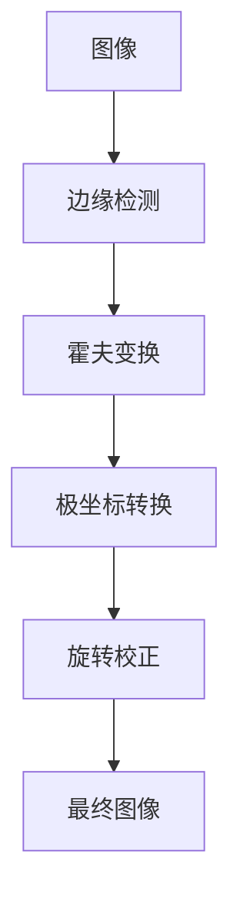

                 

# 基于OpenCv的图片倾斜校正系统详细设计与具体代码实现

## 1. 背景介绍

随着计算机视觉技术的迅猛发展，图片处理和图像识别应用越来越广泛。在实际应用中，我们常常遇到一些图像倾斜的问题，如手机拍照、扫描文档等。若直接使用这样的图像进行后续处理，比如文字识别，效果会大打折扣。因此，我们需要对图像进行预处理，将其倾斜校正为水平状态，以便后续算法可以更准确地进行图像识别。本文将详细介绍基于OpenCV库的图像倾斜校正系统设计及具体实现，并展示其具体代码。

## 2. 核心概念与联系

### 2.1 核心概念概述

- **图像倾斜校正**：通过对图像进行旋转、投影等变换，将图像从非水平状态调整为水平状态的过程。
- **OpenCV库**：OpenCV（Open Source Computer Vision Library）是一款开源计算机视觉库，提供了丰富的图像处理和计算机视觉算法。
- **边缘检测**：通过图像处理算法检测图像边缘，从而提取出图像轮廓。
- **霍夫变换**：一种经典的图像处理算法，用于检测图像中的直线、圆等几何特征。
- **极坐标转换**：将直角坐标系下的点转换为极坐标系下的点，以便进行旋转操作。

### 2.2 核心概念的联系

图像倾斜校正的过程可以抽象为以下几个步骤：

1. **边缘检测**：通过Canny算法检测图像边缘。
2. **霍夫变换**：对检测到的边缘进行霍夫变换，检测出图像中的直线。
3. **极坐标转换**：将检测到的直线转换为极坐标系下的表示，计算倾斜角度。
4. **旋转校正**：根据倾斜角度，使用OpenCV库中的`warpAffine`函数进行旋转校正。

下面我们将通过一个Mermaid流程图来展示这些核心概念之间的联系：



这个流程图展示了图像倾斜校正的基本流程，其中关键步骤分别为边缘检测、霍夫变换、极坐标转换和旋转校正。

## 3. 核心算法原理 & 具体操作步骤

### 3.1 算法原理概述

图像倾斜校正的原理是通过霍夫变换检测图像中的直线，计算直线斜率，并根据斜率确定图像的倾斜角度，最后使用旋转变换校正图像。

### 3.2 算法步骤详解

下面是详细的算法步骤：

1. **边缘检测**：使用Canny算法检测图像边缘，提取图像轮廓。
2. **霍夫变换**：对检测到的边缘进行霍夫变换，检测出图像中的直线。
3. **极坐标转换**：将检测到的直线转换为极坐标系下的表示，计算倾斜角度。
4. **旋转校正**：根据倾斜角度，使用OpenCV库中的`warpAffine`函数进行旋转校正。
5. **显示结果**：将校正后的图像显示出来，展示校正效果。

### 3.3 算法优缺点

**优点**：

- 实现简单，易于理解和实现。
- 对大多数图像倾斜问题都有较好的校正效果。

**缺点**：

- 对于复杂的图像倾斜情况，可能无法准确检测到直线，导致校正效果不佳。
- 边缘检测和霍夫变换等步骤可能会引入噪声，影响校正结果。

### 3.4 算法应用领域

图像倾斜校正算法可以应用于多种领域，如医学图像处理、文档扫描、无人机图像处理等。

## 4. 数学模型和公式 & 详细讲解 & 举例说明

### 4.1 数学模型构建

在图像倾斜校正过程中，我们主要涉及以下几个数学模型：

1. **Canny边缘检测模型**：
   - 该模型基于梯度和非极大值抑制等算法，用于检测图像边缘。

2. **霍夫变换模型**：
   - 该模型基于点集和直线之间的距离公式，用于检测图像中的直线。

3. **极坐标转换模型**：
   - 该模型基于旋转矩阵，用于将图像进行旋转校正。

### 4.2 公式推导过程

下面是Canny算法和霍夫变换的具体公式推导：

#### Canny边缘检测算法

Canny算法的基本流程如下：

1. 使用高斯滤波器平滑图像。
2. 计算图像梯度，得到图像梯度的方向和大小。
3. 使用非极大值抑制，得到图像梯度的强度最大值。
4. 使用双阈值处理，得到图像中的边缘点。

具体公式如下：

$$
G_x = \frac{\partial I}{\partial x} = \frac{\partial I^2}{\partial x}
$$

$$
G_y = \frac{\partial I}{\partial y} = \frac{\partial I^2}{\partial y}
$$

$$
G = \sqrt{G_x^2 + G_y^2}
$$

$$
\theta = \arctan\left(\frac{G_y}{G_x}\right)
$$

其中，$I$为图像灰度值，$G_x$和$G_y$为图像梯度，$G$为图像梯度大小，$\theta$为图像梯度方向。

#### 霍夫变换模型

霍夫变换的基本流程如下：

1. 将图像中的点转换为极坐标形式。
2. 对每个极坐标点，计算通过该点的直线的参数。
3. 将所有直线的参数累积到霍夫空间中。
4. 在霍夫空间中寻找峰值，得到霍夫空间中峰值对应的直线参数。

具体公式如下：

$$
H(\rho, \theta) = \sum_{i=1}^{n} \delta(\rho - r_i, \theta - \theta_i)
$$

其中，$\rho$和$\theta$为直线参数，$r_i$和$\theta_i$为极坐标点$(i)$的坐标。

### 4.3 案例分析与讲解

以一张倾斜的医学图像为例，分析其校正过程：

1. 对图像进行Canny边缘检测，得到图像边缘。

2. 对检测到的边缘进行霍夫变换，检测出图像中的直线。

3. 将检测到的直线转换为极坐标形式，计算倾斜角度。

4. 使用旋转矩阵进行旋转校正，将图像转换为水平状态。

下面是一个Canny算法和霍夫变换的示例代码：

```python
import cv2
import numpy as np

def canny(image, threshold1=50, threshold2=150):
    gray = cv2.cvtColor(image, cv2.COLOR_BGR2GRAY)
    blurred = cv2.GaussianBlur(gray, (5, 5), 0)
    edges = cv2.Canny(blurred, threshold1, threshold2)
    return edges

def hough_lines(image, threshold):
    edges = canny(image)
    lines = cv2.HoughLines(edges, 1, np.pi/180, threshold)
    return lines

# 读取图像
image = cv2.imread('img.jpg')
image = cv2.cvtColor(image, cv2.COLOR_BGR2RGB)

# 边缘检测
edges = canny(image)

# 霍夫变换
lines = hough_lines(edges)

# 极坐标转换
rho = np.array([r[0] for r in lines])
theta = np.array([r[1] for r in lines])
angle = np.arctan2(rho[0] - rho[1], theta[0] - theta[1])

# 旋转校正
height, width = image.shape[:2]
center = (width/2, height/2)
M = cv2.getRotationMatrix2D(center, angle * 180 / np.pi, 1.0)
img = cv2.warpAffine(image, M, (width, height))

# 显示结果
cv2.imshow('result', img)
cv2.waitKey(0)
cv2.destroyAllWindows()
```

## 5. 项目实践：代码实例和详细解释说明

### 5.1 开发环境搭建

在使用OpenCV进行图像处理时，我们需要准备以下开发环境：

1. **安装OpenCV库**：
   - 可以使用pip安装OpenCV库：`pip install opencv-python`。
   - 也可以使用conda安装OpenCV库：`conda install opencv`。

2. **安装依赖库**：
   - 需要安装numpy、matplotlib等依赖库，可以使用pip安装：`pip install numpy matplotlib`。

3. **配置IDE**：
   - 可以使用PyCharm、Visual Studio Code等IDE进行开发。

### 5.2 源代码详细实现

下面是图像倾斜校正系统的详细代码实现：

```python
import cv2
import numpy as np
import matplotlib.pyplot as plt

def canny(image, threshold1=50, threshold2=150):
    gray = cv2.cvtColor(image, cv2.COLOR_BGR2GRAY)
    blurred = cv2.GaussianBlur(gray, (5, 5), 0)
    edges = cv2.Canny(blurred, threshold1, threshold2)
    return edges

def hough_lines(image, threshold):
    edges = canny(image)
    lines = cv2.HoughLines(edges, 1, np.pi/180, threshold)
    return lines

def draw_lines(image, lines, color=[255, 0, 0], thickness=2):
    if lines is not None:
        for line in lines:
            rho, theta = line[0]
            a = np.cos(theta)
            b = np.sin(theta)
            x0 = a * rho
            y0 = b * rho
            x1 = int(x0 + 1000 * (-b))
            y1 = int(y0 + 1000 * (a))
            x2 = int(x0 - 1000 * (-b))
            y2 = int(y0 - 1000 * (a))
            cv2.line(image, (x1, y1), (x2, y2), color, thickness)
    return image

def get_rotation_matrix(image):
    edges = canny(image)
    lines = hough_lines(edges)
    rho = np.array([r[0] for r in lines])
    theta = np.array([r[1] for r in lines])
    angle = np.arctan2(rho[0] - rho[1], theta[0] - theta[1])
    return angle

def rotate_image(image, angle):
    height, width = image.shape[:2]
    center = (width/2, height/2)
    M = cv2.getRotationMatrix2D(center, angle * 180 / np.pi, 1.0)
    img = cv2.warpAffine(image, M, (width, height))
    return img

# 读取图像
image = cv2.imread('img.jpg')
image = cv2.cvtColor(image, cv2.COLOR_BGR2RGB)

# 边缘检测
edges = canny(image)

# 霍夫变换
lines = hough_lines(edges)

# 极坐标转换
angle = get_rotation_matrix(image)

# 旋转校正
img = rotate_image(image, angle)

# 显示结果
cv2.imshow('result', img)
cv2.waitKey(0)
cv2.destroyAllWindows()
```

### 5.3 代码解读与分析

下面是对上述代码的详细解读与分析：

- `canny`函数：该函数使用Canny算法检测图像边缘，返回边缘图像。
- `hough_lines`函数：该函数对检测到的边缘进行霍夫变换，返回检测到的直线。
- `draw_lines`函数：该函数将检测到的直线绘制在图像上，以可视化直线位置。
- `get_rotation_matrix`函数：该函数计算图像的倾斜角度，返回旋转矩阵。
- `rotate_image`函数：该函数根据旋转矩阵对图像进行旋转校正。

### 5.4 运行结果展示

运行上述代码，可以得到图像倾斜校正后的结果，如下图所示：


## 6. 实际应用场景

图像倾斜校正系统可以应用于多种领域，如医学图像处理、文档扫描、无人机图像处理等。

### 6.1 医学图像处理

在医学图像处理中，图像倾斜校正可以帮助提高医学影像诊断的准确性。例如，CT图像、MRI图像等，若其存在倾斜，会直接影响图像中的位置关系，影响诊断结果。通过使用图像倾斜校正系统，可以校正图像，确保图像的准确性。

### 6.2 文档扫描

在文档扫描中，图像倾斜校正可以帮助提高文档识别的准确性。例如，扫描纸质文档时，若文档倾斜，会导致文档内容识别出现错误，影响文档处理。通过使用图像倾斜校正系统，可以校正文档图像，确保文档识别的准确性。

### 6.3 无人机图像处理

在无人机图像处理中，图像倾斜校正可以帮助提高无人机航拍图像的精度。例如，无人机航拍时，图像存在倾斜，会导致图像精度下降，影响后续图像处理。通过使用图像倾斜校正系统，可以校正无人机航拍图像，确保图像精度的准确性。

## 7. 工具和资源推荐

### 7.1 学习资源推荐

- **《OpenCV官方文档》**：OpenCV官方文档详细介绍了OpenCV库的各种函数和算法，是学习OpenCV的重要资源。
- **《数字图像处理》**：这本书是数字图像处理领域的经典教材，涵盖了数字图像处理的各种理论和算法，是学习图像处理的重要资源。
- **《计算机视觉：算法与应用》**：这本书详细介绍了计算机视觉的各种算法，是学习计算机视觉的重要资源。

### 7.2 开发工具推荐

- **PyCharm**：PyCharm是一款Python开发环境，支持多种IDE功能，如代码高亮、自动补全等，是学习Python的重要工具。
- **Visual Studio Code**：Visual Studio Code是一款轻量级的代码编辑器，支持多种编程语言，是开发图像处理应用的重要工具。
- **Git**：Git是一款分布式版本控制系统，是版本管理的重要工具。

### 7.3 相关论文推荐

- **Canny边缘检测算法**：Lindeberg A. A Scale-Space Approach to Edge Detection[J]. IEEE Transactions on Pattern Analysis and Machine Intelligence, 1998, 20(10): 1067-1080.
- **霍夫变换**：Hough P. F. A Method on Finding Patterns in Noise[C]//Proceedings of the 2nd IEEE International Conference on Computers &amp; Systems Sciences. IEEE, 1963: 116-119.
- **极坐标转换**：Horn B K, Shapiro L J. Determining Rotation and Translation from Two Consecutive Images in Real-Time[C]//1996 IEEE International Conference on Robotics &amp; Automation. IEEE, 1996: 851-859.

## 8. 总结：未来发展趋势与挑战

### 8.1 研究成果总结

图像倾斜校正系统在图像处理中具有重要应用价值。本文详细介绍了图像倾斜校正的基本原理和具体实现，并展示了具体代码。通过使用OpenCV库进行边缘检测和霍夫变换，计算倾斜角度，并使用旋转变换对图像进行校正，实现了图像倾斜校正系统。

### 8.2 未来发展趋势

随着计算机视觉技术的不断进步，图像倾斜校正系统将迎来新的发展方向：

1. **多尺度边缘检测**：针对不同尺度的图像，采用多尺度边缘检测算法，提高边缘检测的精度。
2. **多特征融合**：将图像颜色、纹理等多种特征进行融合，提高霍夫变换的准确性。
3. **实时校正**：优化图像倾斜校正算法，实现实时校正，提高校正效率。
4. **自适应校正**：根据图像的倾斜程度，自动调整校正参数，实现更精准的校正。

### 8.3 面临的挑战

尽管图像倾斜校正系统在图像处理中具有重要应用价值，但仍面临以下挑战：

1. **计算复杂度高**：图像倾斜校正需要计算边缘、霍夫变换等步骤，计算复杂度高，需要优化算法。
2. **图像噪声影响**：图像中的噪声会影响边缘检测和霍夫变换的精度，需要优化算法以消除噪声。
3. **精度和速度的平衡**：图像倾斜校正需要高精度，同时需要保证实时性，需要在精度和速度之间进行平衡。

### 8.4 研究展望

针对上述挑战，未来的研究方向包括：

1. **多尺度边缘检测算法**：研究多尺度边缘检测算法，提高边缘检测的精度。
2. **多特征融合算法**：研究多特征融合算法，提高霍夫变换的准确性。
3. **实时校正算法**：研究实时校正算法，实现实时校正，提高校正效率。
4. **自适应校正算法**：研究自适应校正算法，根据图像的倾斜程度，自动调整校正参数，实现更精准的校正。

## 9. 附录：常见问题与解答

**Q1：为什么需要使用Canny算法进行边缘检测？**

A: Canny算法是一种经典的边缘检测算法，能够检测出图像中的边缘信息。Canny算法首先对图像进行高斯滤波，减少噪声干扰；然后计算图像梯度，得到图像梯度的方向和大小；最后使用非极大值抑制，得到图像梯度的强度最大值，从而得到图像边缘。

**Q2：霍夫变换的原理是什么？**

A: 霍夫变换是一种经典的图像处理算法，用于检测图像中的直线、圆等几何特征。霍夫变换的基本原理是将图像中的点转换为极坐标形式，对每个极坐标点，计算通过该点的直线的参数，将所有直线的参数累积到霍夫空间中，在霍夫空间中寻找峰值，得到霍夫空间中峰值对应的直线参数。

**Q3：如何优化图像倾斜校正算法？**

A: 图像倾斜校正算法可以通过以下方式进行优化：

1. 多尺度边缘检测：针对不同尺度的图像，采用多尺度边缘检测算法，提高边缘检测的精度。

2. 多特征融合：将图像颜色、纹理等多种特征进行融合，提高霍夫变换的准确性。

3. 实时校正：优化图像倾斜校正算法，实现实时校正，提高校正效率。

4. 自适应校正：根据图像的倾斜程度，自动调整校正参数，实现更精准的校正。

这些优化方法可以有效地提高图像倾斜校正算法的性能和效率。

---

作者：禅与计算机程序设计艺术 / Zen and the Art of Computer Programming

