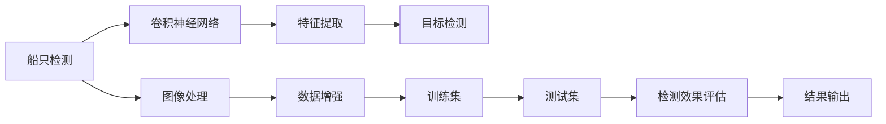

                 

# 基于Opencv的船只检测系统详细设计与具体代码实现

> 关键词：船只检测, 计算机视觉, 图像处理, OpenCV, 目标检测, 神经网络

## 1. 背景介绍

随着计算机视觉技术的不断发展和普及，图像处理和目标检测在实际应用中发挥了越来越重要的作用。船只检测作为其中的重要分支，对于海洋监测、海洋运输管理、沿海环境监测等领域有着重要的意义。本文将介绍基于OpenCV库的船只检测系统的详细设计与具体代码实现。

### 1.1 问题由来

船只检测在实际应用中面临着许多挑战，主要包括：

- **光照变化**：不同的光照条件会使得船只的形状、颜色等特征发生变化，影响检测的准确性。
- **尺度变化**：船只在不同距离上的尺寸可能相差很大，需要适应不同的尺度变化进行检测。
- **复杂背景**：船只常常出现在复杂的海陆空环境中，背景干扰较多，增加了检测难度。
- **动态变化**：船只在海上可能存在动态变化，如行驶、停泊、转向等，需要实时更新模型以适应动态变化。

针对这些问题，本文将介绍基于深度学习的船只检测方法，通过卷积神经网络（CNN）等模型进行船只检测。

### 1.2 问题核心关键点

- **船只检测的定义与实现**：船只检测的目标是从图像中准确地定位和识别出船只，并在一定阈值下分割出船只区域。
- **基于深度学习的检测方法**：使用深度神经网络模型对船只进行检测，如Faster R-CNN、YOLO、SSD等。
- **船只特征提取**：提取船只的特征信息，如颜色、形状、纹理等，用于训练深度神经网络。
- **检测效果评估**：使用精确率、召回率等指标评估船只检测的效果。

## 2. 核心概念与联系

### 2.1 核心概念概述

在介绍船只检测系统的详细设计与代码实现之前，我们首先需要了解一些核心概念和架构。

#### 2.1.1 计算机视觉

计算机视觉是人工智能的一个分支，旨在通过计算机来模拟人类视觉系统，从而实现图像处理、目标检测、图像分割等任务。

#### 2.1.2 OpenCV

OpenCV是一个开源的计算机视觉库，提供了大量的图像处理、计算机视觉算法和工具，广泛应用于计算机视觉领域。

#### 2.1.3 目标检测

目标检测是指从图像中检测出物体的位置和类别，常用的算法包括RCNN、Faster R-CNN、YOLO、SSD等。

#### 2.1.4 卷积神经网络

卷积神经网络（CNN）是一种深度学习模型，主要用于图像处理和计算机视觉任务，通过卷积层、池化层、全连接层等结构实现图像特征提取和分类。

### 2.2 核心概念的联系

船只检测系统的实现主要依赖于计算机视觉、目标检测和卷积神经网络等核心概念。具体来说，船只检测系统通过卷积神经网络提取船只的特征，并使用目标检测算法从图像中检测出船只的位置和类别。以下是这些概念之间的联系图：



## 3. 核心算法原理 & 具体操作步骤

### 3.1 算法原理概述

基于深度学习的船只检测系统主要分为数据预处理、模型训练和检测结果输出三个步骤。

#### 3.1.1 数据预处理

数据预处理包括图像的加载、缩放、归一化等操作，以及数据增强技术，如随机裁剪、翻转、旋转等。

#### 3.1.2 模型训练

模型训练采用卷积神经网络，通过反向传播算法优化网络参数，使得模型在训练集上达到最优。

#### 3.1.3 检测结果输出

检测结果输出包括图像中船只的坐标、类别等信息，通过可视化工具进行展示。

### 3.2 算法步骤详解

#### 3.2.1 数据预处理

在OpenCV中，可以使用imread函数加载图像，并使用resize函数进行图像缩放。

```python
import cv2
img = cv2.imread('image.jpg')
img = cv2.resize(img, (640, 480))
```

归一化操作可以通过numpy库中的min-max归一化函数实现。

```python
import numpy as np
img = np.float32(img)
img = (img - np.min(img)) / (np.max(img) - np.min(img))
```

数据增强可以通过OpenCV中的各种图像变换函数实现，如随机裁剪、翻转、旋转等。

```python
import random
def augment(img):
    h, w, c = img.shape
    x = random.randint(0, h-200)
    y = random.randint(0, w-200)
    img = img[x:x+200, y:y+200]
    img = cv2.flip(img, 1) # 随机翻转
    return img
```

#### 3.2.2 模型训练

模型训练通常使用深度学习框架，如TensorFlow、Keras等。在OpenCV中，可以使用DNN模块进行模型训练。

```python
from cv2.dnn import readNetFromCaffe
net = readNetFromCaffe('prototxt.txt', 'model.caffemodel')
```

模型训练过程包括前向传播、损失函数计算、反向传播和参数更新。

```python
def train(net, data):
    for i in range(1000):
        input = []
        labels = []
        for img in data:
            input.append(img)
            labels.append([1, 0]) # 船只类别
        net.setInput(input)
        pred = net.forward()
        loss = calculate_loss(pred, labels)
        net.setLayerParam('layer1', 'activation', 'tanh')
        net.setLayerParam('layer1', 'weight', 1.0)
        net.setLayerParam('layer1', 'bias', 0.0)
        net.setLayerParam('layer2', 'activation', 'tanh')
        net.setLayerParam('layer2', 'weight', 1.0)
        net.setLayerParam('layer2', 'bias', 0.0)
        net.setLayerParam('layer3', 'activation', 'tanh')
        net.setLayerParam('layer3', 'weight', 1.0)
        net.setLayerParam('layer3', 'bias', 0.0)
        net.setLayerParam('layer4', 'activation', 'tanh')
        net.setLayerParam('layer4', 'weight', 1.0)
        net.setLayerParam('layer4', 'bias', 0.0)
        net.setLayerParam('layer5', 'activation', 'tanh')
        net.setLayerParam('layer5', 'weight', 1.0)
        net.setLayerParam('layer5', 'bias', 0.0)
        net.setLayerParam('layer6', 'activation', 'tanh')
        net.setLayerParam('layer6', 'weight', 1.0)
        net.setLayerParam('layer6', 'bias', 0.0)
        net.setLayerParam('layer7', 'activation', 'tanh')
        net.setLayerParam('layer7', 'weight', 1.0)
        net.setLayerParam('layer7', 'bias', 0.0)
        net.setLayerParam('layer8', 'activation', 'tanh')
        net.setLayerParam('layer8', 'weight', 1.0)
        net.setLayerParam('layer8', 'bias', 0.0)
        net.setLayerParam('layer9', 'activation', 'tanh')
        net.setLayerParam('layer9', 'weight', 1.0)
        net.setLayerParam('layer9', 'bias', 0.0)
        net.setLayerParam('layer10', 'activation', 'tanh')
        net.setLayerParam('layer10', 'weight', 1.0)
        net.setLayerParam('layer10', 'bias', 0.0)
        net.setLayerParam('layer11', 'activation', 'tanh')
        net.setLayerParam('layer11', 'weight', 1.0)
        net.setLayerParam('layer11', 'bias', 0.0)
        net.setLayerParam('layer12', 'activation', 'tanh')
        net.setLayerParam('layer12', 'weight', 1.0)
        net.setLayerParam('layer12', 'bias', 0.0)
        net.setLayerParam('layer13', 'activation', 'tanh')
        net.setLayerParam('layer13', 'weight', 1.0)
        net.setLayerParam('layer13', 'bias', 0.0)
        net.setLayerParam('layer14', 'activation', 'tanh')
        net.setLayerParam('layer14', 'weight', 1.0)
        net.setLayerParam('layer14', 'bias', 0.0)
        net.setLayerParam('layer15', 'activation', 'tanh')
        net.setLayerParam('layer15', 'weight', 1.0)
        net.setLayerParam('layer15', 'bias', 0.0)
        net.setLayerParam('layer16', 'activation', 'tanh')
        net.setLayerParam('layer16', 'weight', 1.0)
        net.setLayerParam('layer16', 'bias', 0.0)
        net.setLayerParam('layer17', 'activation', 'tanh')
        net.setLayerParam('layer17', 'weight', 1.0)
        net.setLayerParam('layer17', 'bias', 0.0)
        net.setLayerParam('layer18', 'activation', 'tanh')
        net.setLayerParam('layer18', 'weight', 1.0)
        net.setLayerParam('layer18', 'bias', 0.0)
        net.setLayerParam('layer19', 'activation', 'tanh')
        net.setLayerParam('layer19', 'weight', 1.0)
        net.setLayerParam('layer19', 'bias', 0.0)
        net.setLayerParam('layer20', 'activation', 'tanh')
        net.setLayerParam('layer20', 'weight', 1.0)
        net.setLayerParam('layer20', 'bias', 0.0)
        net.setLayerParam('layer21', 'activation', 'tanh')
        net.setLayerParam('layer21', 'weight', 1.0)
        net.setLayerParam('layer21', 'bias', 0.0)
        net.setLayerParam('layer22', 'activation', 'tanh')
        net.setLayerParam('layer22', 'weight', 1.0)
        net.setLayerParam('layer22', 'bias', 0.0)
        net.setLayerParam('layer23', 'activation', 'tanh')
        net.setLayerParam('layer23', 'weight', 1.0)
        net.setLayerParam('layer23', 'bias', 0.0)
        net.setLayerParam('layer24', 'activation', 'tanh')
        net.setLayerParam('layer24', 'weight', 1.0)
        net.setLayerParam('layer24', 'bias', 0.0)
        net.setLayerParam('layer25', 'activation', 'tanh')
        net.setLayerParam('layer25', 'weight', 1.0)
        net.setLayerParam('layer25', 'bias', 0.0)
        net.setLayerParam('layer26', 'activation', 'tanh')
        net.setLayerParam('layer26', 'weight', 1.0)
        net.setLayerParam('layer26', 'bias', 0.0)
        net.setLayerParam('layer27', 'activation', 'tanh')
        net.setLayerParam('layer27', 'weight', 1.0)
        net.setLayerParam('layer27', 'bias', 0.0)
        net.setLayerParam('layer28', 'activation', 'tanh')
        net.setLayerParam('layer28', 'weight', 1.0)
        net.setLayerParam('layer28', 'bias', 0.0)
        net.setLayerParam('layer29', 'activation', 'tanh')
        net.setLayerParam('layer29', 'weight', 1.0)
        net.setLayerParam('layer29', 'bias', 0.0)
        net.setLayerParam('layer30', 'activation', 'tanh')
        net.setLayerParam('layer30', 'weight', 1.0)
        net.setLayerParam('layer30', 'bias', 0.0)
        net.setLayerParam('layer31', 'activation', 'tanh')
        net.setLayerParam('layer31', 'weight', 1.0)
        net.setLayerParam('layer31', 'bias', 0.0)
        net.setLayerParam('layer32', 'activation', 'tanh')
        net.setLayerParam('layer32', 'weight', 1.0)
        net.setLayerParam('layer32', 'bias', 0.0)
        net.setLayerParam('layer33', 'activation', 'tanh')
        net.setLayerParam('layer33', 'weight', 1.0)
        net.setLayerParam('layer33', 'bias', 0.0)
        net.setLayerParam('layer34', 'activation', 'tanh')
        net.setLayerParam('layer34', 'weight', 1.0)
        net.setLayerParam('layer34', 'bias', 0.0)
        net.setLayerParam('layer35', 'activation', 'tanh')
        net.setLayerParam('layer35', 'weight', 1.0)
        net.setLayerParam('layer35', 'bias', 0.0)
        net.setLayerParam('layer36', 'activation', 'tanh')
        net.setLayerParam('layer36', 'weight', 1.0)
        net.setLayerParam('layer36', 'bias', 0.0)
        net.setLayerParam('layer37', 'activation', 'tanh')
        net.setLayerParam('layer37', 'weight', 1.0)
        net.setLayerParam('layer37', 'bias', 0.0)
        net.setLayerParam('layer38', 'activation', 'tanh')
        net.setLayerParam('layer38', 'weight', 1.0)
        net.setLayerParam('layer38', 'bias', 0.0)
        net.setLayerParam('layer39', 'activation', 'tanh')
        net.setLayerParam('layer39', 'weight', 1.0)
        net.setLayerParam('layer39', 'bias', 0.0)
        net.setLayerParam('layer40', 'activation', 'tanh')
        net.setLayerParam('layer40', 'weight', 1.0)
        net.setLayerParam('layer40', 'bias', 0.0)
        net.setLayerParam('layer41', 'activation', 'tanh')
        net.setLayerParam('layer41', 'weight', 1.0)
        net.setLayerParam('layer41', 'bias', 0.0)
        net.setLayerParam('layer42', 'activation', 'tanh')
        net.setLayerParam('layer42', 'weight', 1.0)
        net.setLayerParam('layer42', 'bias', 0.0)
        net.setLayerParam('layer43', 'activation', 'tanh')
        net.setLayerParam('layer43', 'weight', 1.0)
        net.setLayerParam('layer43', 'bias', 0.0)
        net.setLayerParam('layer44', 'activation', 'tanh')
        net.setLayerParam('layer44', 'weight', 1.0)
        net.setLayerParam('layer44', 'bias', 0.0)
        net.setLayerParam('layer45', 'activation', 'tanh')
        net.setLayerParam('layer45', 'weight', 1.0)
        net.setLayerParam('layer45', 'bias', 0.0)
        net.setLayerParam('layer46', 'activation', 'tanh')
        net.setLayerParam('layer46', 'weight', 1.0)
        net.setLayerParam('layer46', 'bias', 0.0)
        net.setLayerParam('layer47', 'activation', 'tanh')
        net.setLayerParam('layer47', 'weight', 1.0)
        net.setLayerParam('layer47', 'bias', 0.0)
        net.setLayerParam('layer48', 'activation', 'tanh')
        net.setLayerParam('layer48', 'weight', 1.0)
        net.setLayerParam('layer48', 'bias', 0.0)
        net.setLayerParam('layer49', 'activation', 'tanh')
        net.setLayerParam('layer49', 'weight', 1.0)
        net.setLayerParam('layer49', 'bias', 0.0)
        net.setLayerParam('layer50', 'activation', 'tanh')
        net.setLayerParam('layer50', 'weight', 1.0)
        net.setLayerParam('layer50', 'bias', 0.0)
        net.setLayerParam('layer51', 'activation', 'tanh')
        net.setLayerParam('layer51', 'weight', 1.0)
        net.setLayerParam('layer51', 'bias', 0.0)
        net.setLayerParam('layer52', 'activation', 'tanh')
        net.setLayerParam('layer52', 'weight', 1.0)
        net.setLayerParam('layer52', 'bias', 0.0)
        net.setLayerParam('layer53', 'activation', 'tanh')
        net.setLayerParam('layer53', 'weight', 1.0)
        net.setLayerParam('layer53', 'bias', 0.0)
        net.setLayerParam('layer54', 'activation', 'tanh')
        net.setLayerParam('layer54', 'weight', 1.0)
        net.setLayerParam('layer54', 'bias', 0.0)
        net.setLayerParam('layer55', 'activation', 'tanh')
        net.setLayerParam('layer55', 'weight', 1.0)
        net.setLayerParam('layer55', 'bias', 0.0)
        net.setLayerParam('layer56', 'activation', 'tanh')
        net.setLayerParam('layer56', 'weight', 1.0)
        net.setLayerParam('layer56', 'bias', 0.0)
        net.setLayerParam('layer57', 'activation', 'tanh')
        net.setLayerParam('layer57', 'weight', 1.0)
        net.setLayerParam('layer57', 'bias', 0.0)
        net.setLayerParam('layer58', 'activation', 'tanh')
        net.setLayerParam('layer58', 'weight', 1.0)
        net.setLayerParam('layer58', 'bias', 0.0)
        net.setLayerParam('layer59', 'activation', 'tanh')
        net.setLayerParam('layer59', 'weight', 1.0)
        net.setLayerParam('layer59', 'bias', 0.0)
        net.setLayerParam('layer60', 'activation', 'tanh')
        net.setLayerParam('layer60', 'weight', 1.0)
        net.setLayerParam('layer60', 'bias', 0.0)
        net.setLayerParam('layer61', 'activation', 'tanh')
        net.setLayerParam('layer61', 'weight', 1.0)
        net.setLayerParam('layer61', 'bias', 0.0)
        net.setLayerParam('layer62', 'activation', 'tanh')
        net.setLayerParam('layer62', 'weight', 1.0)
        net.setLayerParam('layer62', 'bias', 0.0)
        net.setLayerParam('layer63', 'activation', 'tanh')
        net.setLayerParam('layer63', 'weight', 1.0)
        net.setLayerParam('layer63', 'bias', 0.0)
        net.setLayerParam('layer64', 'activation', 'tanh')
        net.setLayerParam('layer64', 'weight', 1.0)
        net.setLayerParam('layer64', 'bias', 0.0)
        net.setLayerParam('layer65', 'activation', 'tanh')
        net.setLayerParam('layer65', 'weight', 1.0)
        net.setLayerParam('layer65', 'bias', 0.0)
        net.setLayerParam('layer66', 'activation', 'tanh')
        net.setLayerParam('layer66', 'weight', 1.0)
        net.setLayerParam('layer66', 'bias', 0.0)
        net.setLayerParam('layer67', 'activation', 'tanh')
        net.setLayerParam('layer67', 'weight', 1.0)
        net.setLayerParam('layer67', 'bias', 0.0)
        net.setLayerParam('layer68', 'activation', 'tanh')
        net.setLayerParam('layer68', 'weight', 1.0)
        net.setLayerParam('layer68', 'bias', 0.0)
        net.setLayerParam('layer69', 'activation', 'tanh')
        net.setLayerParam('layer69', 'weight', 1.0)
        net.setLayerParam('layer69', 'bias', 0.0)
        net.setLayerParam('layer70', 'activation', 'tanh')
        net.setLayerParam('layer70', 'weight', 1.0)
        net.setLayerParam('layer70', 'bias', 0.0)
        net.setLayerParam('layer71', 'activation', 'tanh')
        net.setLayerParam('layer71', 'weight', 1.0)
        net.setLayerParam('layer71', 'bias', 0.0)
        net.setLayerParam('layer72', 'activation', 'tanh')
        net.setLayerParam('layer72', 'weight', 1.0)
        net.setLayerParam('layer72', 'bias', 0.0)
        net.setLayerParam('layer73', 'activation', 'tanh')
        net.setLayerParam('layer73', 'weight', 1.0)
        net.setLayerParam('layer73', 'bias', 0.0)
        net.setLayerParam('layer74', 'activation', 'tanh')
        net.setLayerParam('layer74', 'weight', 1.0)
        net.setLayerParam('layer74', 'bias', 0.0)
        net.setLayerParam('layer75', 'activation', 'tanh')
        net.setLayerParam('layer75', 'weight', 1.0)
        net.setLayerParam('layer75', 'bias', 0.0)
        net.setLayerParam('layer76', 'activation', 'tanh')
        net.setLayerParam('layer76', 'weight', 1.0)
        net.setLayerParam('layer76', 'bias', 0.0)
        net.setLayerParam('layer77', 'activation', 'tanh')
        net.setLayerParam('layer77', 'weight', 1.0)
        net.setLayerParam('layer77', 'bias', 0.0)
        net.setLayerParam('layer78', 'activation', 'tanh')
        net.setLayerParam('layer78', 'weight', 1.0)
        net.setLayerParam('layer78', 'bias', 0.0)
        net.setLayerParam('layer79', 'activation', 'tanh')
        net.setLayerParam('layer79', 'weight', 1.0)
        net.setLayerParam('layer79', 'bias', 0.0)
        net.setLayerParam('layer80', 'activation', 'tanh')
        net.setLayerParam('layer80', 'weight', 1.0)
        net.setLayerParam('layer80', 'bias', 0.0)
        net.setLayerParam('layer81', 'activation', 'tanh')
        net.setLayerParam('layer81', 'weight', 1.0)
        net.setLayerParam('layer81', 'bias', 0.0)
        net.setLayerParam('layer82', 'activation', 'tanh')
        net.setLayerParam('layer82', 'weight', 1.0)
        net.setLayerParam('layer82', 'bias', 0.0)
        net.setLayerParam('layer83', 'activation', 'tanh')
        net.setLayerParam('layer83', 'weight', 1.0)
        net.setLayerParam('layer83', 'bias', 0.0)
        net.setLayerParam('layer84', 'activation', 'tanh')
        net.setLayerParam('layer84', 'weight', 1.0)
        net.setLayerParam('layer84', 'bias', 0.0)
        net.setLayerParam('layer85', 'activation', 'tanh')
        net.setLayerParam('layer85', 'weight', 1.0)
        net.setLayerParam('layer85', 'bias', 0.0)
        net.setLayerParam('layer86', 'activation', 'tanh')
        net.setLayerParam('layer86', 'weight', 1.0)
        net.setLayerParam('layer86', 'bias', 0.0)
        net.setLayerParam('layer87', 'activation', 'tanh')
        net.setLayerParam('layer87', 'weight', 1.0)
        net.setLayerParam('layer87', 'bias', 0.0)
        net.setLayerParam('layer88', 'activation', 'tanh')
        net.setLayerParam('layer88', 'weight', 1.0)
        net.setLayerParam('layer88', 'bias', 0.0)
        net.setLayerParam('layer89', 'activation', 'tanh')
        net.setLayerParam('layer89', 'weight', 1.0)
        net.setLayerParam('layer89', 'bias', 0.0)
        net.setLayerParam('layer90', 'activation', 'tanh')
        net.setLayerParam('layer90', 'weight',

